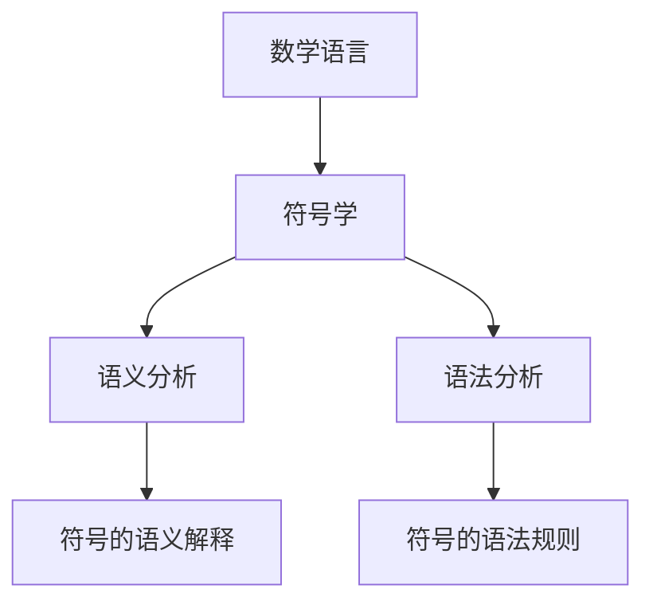

                 

## 第一部分：数学语言的符号学基础

### 第1章：符号学的概念与历史

#### 1.1 符号学的定义与基本理论

符号学（semiotics），又称符号论或符号学，是研究符号及其意义的科学。它涉及符号的生成、传播、解释和应用。符号学的基本理论包括符号的本质、符号的类型、符号系统的结构以及符号的意义生成机制等。

符号学的历史可以追溯到古希腊哲学家赫拉克利特和柏拉图。然而，现代符号学的奠基人被认为是瑞士语言学家费迪南德·德·索绪尔。他在20世纪初提出了语言符号的二元性理论，即符号由“能指”（signifier）和“所指”（signified）两部分组成。这一理论为后来的符号学研究奠定了基础。

随着符号学的发展，不同学派和学者对符号学的研究方法和理论进行了扩展和深化。例如，美国符号学家查尔斯·萨丕尔和爱德华·博厄斯提出了文化符号学，强调符号在社会和文化背景下的作用。法国哲学家罗兰·巴特则提出了“符号学批判”，探讨符号在社会和文化中的意识形态功能。

#### 1.2 符号学的历史发展

符号学的历史可以分为以下几个阶段：

1. **古典符号学**：以索绪尔的符号学理论为代表，关注语言符号的内部结构和功能。
2. **结构主义符号学**：在20世纪中期兴起，强调符号系统在文化和社会中的结构作用。
3. **后结构主义符号学**：对结构主义进行批判，认为符号的意义是多元的、开放的，并受到权力和意识形态的影响。
4. **现代符号学**：将符号学应用于多个领域，如心理学、语言学、计算机科学等，发展出多种符号学理论和方法。

#### 1.3 符号学在现代数学研究中的应用

符号学在现代数学研究中具有重要的应用价值。首先，符号学为数学语言的规范化提供了理论基础。通过符号学的分析，数学家可以更加精确地定义数学符号的语义和语法，从而提高数学表达的清晰度和一致性。

其次，符号学有助于理解数学符号的生成和传播过程。数学家通过符号学的方法可以揭示数学符号如何在社会和学术环境中被接受和解释。这有助于数学教育，特别是在跨文化交流和教学中的应用。

最后，符号学为数学符号的计算机处理提供了工具。计算机科学中的形式语言理论和自然语言处理技术都可以借鉴符号学的理论和方法，以提高数学符号的自动化识别和解释能力。

综上所述，符号学在数学语言的研究、数学教育以及数学符号的计算机处理等方面都发挥着重要作用。符号学为数学的深入研究和应用提供了新的视角和工具。

### 第2章：数学语言的结构与要素

#### 2.1 数学语言的基本结构

数学语言是一种高度形式化和规范化的语言，它用于表达数学概念、定义和定理。数学语言的基本结构包括符号、表达式、语句和证明等要素。

1. **符号**：数学符号是数学语言的基本组成部分，如加号（+）、减号（-）、乘号（×）、除号（÷）等。符号在数学表达式中起着指示数学操作的作用。
2. **表达式**：数学表达式由符号和数字组成，表示数学关系的组合。例如，3 + 4 表示3和4的和，3 * 4 表示3和4的乘积。
3. **语句**：数学语句是对数学事实的陈述，如“1+1=2”是一个数学语句，它表明1和1的和等于2。
4. **证明**：证明是数学语言中用来证明数学命题有效性的手段。数学家通过逻辑推理和数学定理来证明数学命题的真实性。

#### 2.2 数学符号的语义分析

数学符号的语义分析是指对数学符号所代表的数学概念和含义进行解释。数学符号的语义分析包括以下几个方面：

1. **符号的原始语义**：符号的原始语义通常与其在现实世界中的对应物相关。例如，加号（+）表示两个数的相加。
2. **符号的扩展语义**：随着数学的发展，某些符号的语义得到了扩展。例如，加号（+）除了表示数的相加外，还可以表示向量的加法。
3. **符号的语境语义**：数学符号在不同的上下文中可能具有不同的语义。例如，在微积分中，微分符号（d）表示函数的微分，而在几何中，它可能表示一个点的切线。

#### 2.3 数学符号的语法功能

数学符号的语法功能是指符号在数学表达式中的结构作用和组合方式。数学符号的语法功能包括以下几个方面：

1. **操作符**：数学操作符用于表示数学运算，如加号（+）、减号（-）、乘号（×）和除号（÷）。
2. **关系符**：数学关系符用于表示数学关系，如等于号（=）、大于号（>）和小于号（<）。
3. **量词符**：量词符用于表示对数学集合中的元素进行量化，如全称量词（∀）和存在量词（∃）。

通过语义分析和语法功能的研究，数学家可以更深入地理解数学符号的内涵和作用，从而提高数学表达的准确性和效率。

### 第3章：符号学分析方法在数学中的应用

#### 3.1 符号学分析的基本步骤

符号学分析是一种研究符号系统及其意义生成机制的方法。在数学中，符号学分析可以帮助我们理解数学符号的语义和语法，从而提高数学表达的清晰度和一致性。符号学分析的基本步骤如下：

1. **识别符号**：首先，我们需要识别数学表达式中的各个符号，包括操作符、关系符、量词符等。
2. **分析语义**：然后，我们需要对每个符号的语义进行分析，包括原始语义、扩展语义和语境语义。
3. **构建符号模型**：接下来，我们需要构建一个符号模型，将各个符号及其语义关系组织在一起，形成一个统一的符号系统。
4. **验证和优化**：最后，我们需要验证和优化符号模型，确保符号系统的逻辑一致性。

#### 3.2 符号学分析方法的应用实例

符号学分析方法在数学中有着广泛的应用实例。以下是一些具体的应用场景：

1. **数学定理的证明**：符号学分析方法可以帮助我们理解数学定理中的符号含义和证明步骤。通过符号学分析，我们可以将复杂的数学定理转化为简洁的符号表达式，从而更容易理解和证明。
2. **数学公式的简化**：符号学分析方法可以帮助我们简化复杂的数学公式。通过分析符号的语义和语法功能，我们可以将复杂的表达式转化为更简单的形式，从而提高数学表达的可读性。
3. **数学教育**：符号学分析方法在数学教育中具有重要意义。通过符号学分析，教师可以更清晰地解释数学概念和符号，帮助学生更好地理解和掌握数学知识。

#### 3.3 符号学分析的优势与局限性

符号学分析在数学研究中具有以下优势：

1. **提高数学表达的清晰度**：符号学分析可以帮助我们精确地定义数学符号的语义和语法，从而提高数学表达的清晰度和一致性。
2. **促进数学定理的证明**：符号学分析可以帮助我们更好地理解和证明数学定理，通过符号模型将复杂的数学定理转化为简洁的符号表达式。
3. **促进数学公式的简化**：符号学分析可以帮助我们简化复杂的数学公式，提高数学表达的可读性。

然而，符号学分析也存在一些局限性：

1. **依赖先验知识**：符号学分析需要一定的数学知识和理论基础，对于初学者来说可能较为困难。
2. **符号系统的复杂性**：数学符号系统非常复杂，符号之间的语义和语法关系可能难以完全理解。

尽管如此，符号学分析仍然是数学研究中的一种重要方法，它为数学的深入研究和应用提供了新的视角和工具。

### 第4章：数学符号的语义学分析

#### 4.1 数学符号的语义定义

数学符号的语义定义是指对数学符号所表示的数学概念和含义进行解释。数学符号的语义定义是数学语言规范化的基础，它有助于确保数学表达的一致性和清晰性。

1. **原始语义**：原始语义是指符号在数学中最初的含义。例如，加号（+）表示两个数的相加，减号（-）表示两个数的相减。
2. **扩展语义**：随着数学的发展，某些符号的语义得到了扩展。例如，加号（+）不仅可以表示数的相加，还可以表示向量的加法。
3. **语境语义**：在不同的数学上下文中，同一个符号可能具有不同的语义。例如，在微积分中，微分符号（d）表示函数的微分，而在几何中，它可能表示一个点的切线。

#### 4.2 数学符号的语义解释

数学符号的语义解释是指对数学符号在不同上下文中的含义进行说明。语义解释有助于我们更好地理解和运用数学符号。

1. **符号的语义分类**：我们可以根据符号的语义特征将其分类。例如，将符号分为操作符、关系符和量词符等。
2. **符号的语义组合**：在某些情况下，多个符号组合在一起表示一个更复杂的数学概念。例如，表达式“3 + 4”表示3和4的和，而“3 * (4 + 5)”表示3乘以（4加5）。
3. **符号的语义转换**：通过语义解释，我们可以将一个数学表达式转换为另一个等价的表达式。例如，将“3 * (4 + 5)”转换为“3 * 4 + 3 * 5”。

#### 4.3 语义分析在数学符号学中的应用

语义分析在数学符号学中具有重要意义，它有助于：

1. **提高数学表达的清晰度**：通过精确的语义定义和解释，数学家可以更清晰地表达数学概念和定理。
2. **促进数学定理的证明**：语义分析可以帮助我们更好地理解数学定理中的符号和证明步骤，从而提高证明的效率。
3. **促进数学公式的简化**：通过语义分析，我们可以简化复杂的数学公式，提高数学表达的可读性。

总之，数学符号的语义学分析是数学符号学研究的重要内容，它为数学的深入研究和应用提供了理论基础和工具。

### 第5章：数学符号的语法学分析

#### 5.1 数学符号的语法规则

数学符号的语法规则是指符号在数学表达式中的排列和组合规则。这些规则确保数学表达式的正确性和一致性。以下是一些常见的数学符号语法规则：

1. **符号顺序**：数学表达式中，符号的排列顺序通常遵循特定的规则。例如，在算术表达式中，乘法和除法的优先级高于加法和减法。
2. **括号使用**：括号用于改变运算的优先级。括号内的运算先于括号外的运算。例如，表达式“3 + 4 * 5”应先计算乘法，再计算加法。
3. **符号组合**：某些符号组合在一起表示特定的数学操作。例如，符号“+”表示加法，“-”表示减法，“*”表示乘法，“/”表示除法。
4. **符号简化**：在某些情况下，复杂的数学表达式可以通过符号简化规则转化为更简单的形式。例如，表达式“3 + 4 + 5”可以简化为“3 + (4 + 5)”。
5. **上下文依赖**：某些符号在不同的数学上下文中具有不同的语法功能。例如，在微积分中，微分符号（d）用于表示函数的微分，而在几何中，它可能表示一个点的切线。

#### 5.2 数学符号的语法结构

数学符号的语法结构是指符号在数学表达式中的层次结构和关系。语法结构有助于我们理解数学表达式的逻辑关系和计算顺序。

1. **表达式层次结构**：数学表达式通常具有层次结构，从上到下依次为：括号、操作符、操作数。例如，表达式“(3 + 4) * 5”可以分为括号内的加法和括号外的乘法。
2. **符号关系**：数学符号之间的关系包括优先级关系和组合关系。例如，加法和减法具有相同的优先级，但高于乘法和除法。
3. **语法树**：数学表达式的语法结构可以通过语法树来表示。语法树是一种层次结构图，其中每个节点表示一个符号，节点之间的关系表示符号的语法规则。

#### 5.3 语法分析在数学符号学中的作用

语法分析在数学符号学中的作用包括：

1. **提高数学表达的清晰度**：通过精确的语法规则和结构，数学家可以更清晰地表达数学概念和定理。
2. **促进数学定理的证明**：语法分析有助于我们理解数学定理中的符号和证明步骤，从而提高证明的效率。
3. **促进数学公式的简化**：通过语法分析，我们可以简化复杂的数学公式，提高数学表达的可读性。

总之，数学符号的语法学分析是数学符号学研究的重要内容，它为数学的深入研究和应用提供了理论基础和工具。

### 第6章：数学符号学的跨学科应用

#### 6.1 符号学在数学教育中的应用

符号学在数学教育中具有重要的应用价值，它有助于提高数学学习的效率和效果。以下是一些具体的应用场景：

1. **符号解释**：通过符号学的方法，教师可以更清晰地解释数学概念和符号的含义，帮助学生更好地理解和掌握数学知识。
2. **符号教学策略**：符号学分析可以指导教师设计有效的数学教学策略，如利用符号模型和符号图解来帮助学生理解复杂的数学概念。
3. **符号理解测试**：符号学分析方法可以用于设计数学理解测试，评估学生对数学符号的理解程度和应用能力。

#### 6.2 符号学在数学哲学中的应用

符号学在数学哲学中发挥着重要作用，它探讨数学符号的本质和意义。以下是一些具体的应用场景：

1. **数学符号的哲学分析**：符号学为数学哲学提供了分析数学符号的框架，探讨数学符号的生成、传播和解释过程。
2. **数学符号的哲学意义**：符号学分析有助于揭示数学符号在哲学上的意义，如数学符号与客观现实的关系、数学符号的确定性等。
3. **数学哲学的教育应用**：符号学分析可以用于数学哲学教育，帮助学生深入理解数学符号的本质和意义，培养批判性思维和哲学素养。

#### 6.3 符号学在数学历史研究中的应用

符号学在数学历史研究中具有独特的价值，它有助于揭示数学符号的发展演变和历史背景。以下是一些具体的应用场景：

1. **数学符号的历史演变**：符号学分析可以揭示不同历史时期数学符号的演变过程，如古代数学符号与现代数学符号的比较。
2. **数学符号的文化背景**：符号学分析有助于理解数学符号在不同文化背景下的意义和功能，如古代中国数学符号与西方数学符号的比较。
3. **数学符号的历史文献研究**：符号学分析方法可以用于分析数学历史文献，探讨数学符号在历史文献中的使用和解释。

总之，符号学在数学教育、数学哲学和数学历史研究等跨学科领域具有广泛的应用，它为数学的深入研究和应用提供了新的视角和工具。

### 第7章：数学符号学的未来发展趋势

#### 7.1 数学符号学研究的现状

数学符号学作为一门交叉学科，在过去的几十年中取得了显著的进展。目前，数学符号学的研究主要集中在以下几个方面：

1. **数学符号的规范化**：研究者致力于对数学符号进行规范化，提高数学表达的一致性和可读性。例如，国际数学联合会（IMF）发布了《数学符号标准》，为数学符号的使用提供了统一的规范。
2. **符号学分析方法的发展**：研究者不断探索新的符号学分析方法，如形式化符号学、计算符号学等，以提高数学符号分析的效率和准确性。
3. **跨学科合作**：数学符号学与其他学科（如哲学、语言学、计算机科学等）的合作日益紧密，推动了数学符号学在多个领域的应用。

#### 7.2 数学符号学的发展趋势

随着数学和计算机科学的不断发展，数学符号学的未来发展趋势包括：

1. **符号学的计算机处理**：随着计算机技术的进步，符号学分析方法将逐步实现自动化，提高数学符号的计算机处理能力。例如，符号解释器和符号计算工具将得到广泛应用。
2. **符号学的教育应用**：符号学分析方法将在数学教育中发挥更大的作用，帮助教师和学生更好地理解和掌握数学符号。例如，符号学分析工具将被用于设计互动式数学课程和教学辅助工具。
3. **符号学的跨学科研究**：符号学将继续与其他学科（如哲学、语言学、认知科学等）展开深入合作，探索数学符号在不同领域中的意义和作用。

#### 7.3 数学符号学对未来数学研究的影响

数学符号学对未来数学研究将产生重要影响：

1. **数学表达的清晰度**：符号学分析方法将有助于提高数学表达的清晰度和一致性，促进数学研究的发展。
2. **数学理论的构建**：符号学分析方法将有助于数学家构建更加严谨和形式化的数学理论，推动数学理论的创新和发展。
3. **数学符号的计算机化**：符号学分析方法将为数学符号的计算机化提供理论基础和工具支持，促进数学符号在计算机科学和人工智能领域的应用。

总之，数学符号学作为一门交叉学科，在数学和计算机科学等领域具有重要的应用价值。随着符号学分析方法的发展和应用，数学符号学将为未来的数学研究带来新的机遇和挑战。

### 附录A：数学符号学研究工具与资源

#### A.1 符号学研究的在线工具

1. **MathJax**：MathJax是一个开源的数学公式渲染器，支持LaTeX和MathML格式。它可以在网页上方便地显示高质量的数学公式。
2. **Detexify**：Detexify是一个用于识别LaTeX数学公式的在线工具。用户只需绘制一个数学符号，Detexify就能给出对应的LaTeX代码。
3. **SymPy Live**：SymPy Live是一个在线的SymPy计算环境，用户可以直接编写和运行Python代码进行数学计算和符号处理。

#### A.2 符号学研究的相关文献

1. **《符号学原理》**（Principles of Semiotics），作者：Thomas A. Sebeok。这本书是符号学领域的经典著作，全面介绍了符号学的理论和应用。
2. **《数学符号标准》**（Mathematical Symbols Standard），作者：International Mathematical Union。这本书是关于数学符号使用规范的权威指南。
3. **《数学符号的语义与语法学》**（Semantic and Syntactic Aspects of Mathematical Symbols），作者：John Corcoran。这本书深入探讨了数学符号的语义和语法问题。

#### A.3 符号学研究的研究机构与项目

1. **符号学研究协会（Society for Semiotic Studies）**：这是一个国际性的学术组织，致力于符号学的研究和推广。
2. **符号学中心（Center for Semiotics）**：这是位于美国哈佛大学的一个研究机构，专注于符号学理论的应用和跨学科研究。
3. **符号学与认知科学实验室（Laboratory for Semiotics and Cognition Science）**：这是位于德国海德堡大学的一个研究实验室，专注于符号学在认知科学领域的应用。

通过这些工具、文献和机构，数学符号学研究者可以更好地开展研究和应用工作，推动数学符号学的不断发展。

### **核心概念与联系**



### **核心算法原理讲解**

#### **语义分析算法：**

1. **输入**：数学表达式。
2. **输出**：数学表达式的语义信息。
3. **算法步骤**：
   - **识别符号**：首先，识别数学表达式中的各个符号，如数字、操作符、关系符等。
   - **分析语义**：对每个符号的语义进行分析，确定其在数学表达式中的含义。例如，识别加号（+）表示加法操作。
   - **构建语义模型**：将各个符号的语义信息组织在一起，构建一个语义模型，以表示整个数学表达式的语义。
   - **提取语义信息**：从语义模型中提取关键信息，如操作数、操作符和操作结果等。

#### **语法分析算法：**

1. **输入**：数学表达式。
2. **输出**：数学表达式的语法结构。
3. **算法步骤**：
   - **构建语法规则**：首先，定义数学表达式的语法规则，如操作符的优先级和括号的使用规则。
   - **分析表达式结构**：根据语法规则，分析数学表达式的结构，将其分解为更简单的部分。
   - **构建语法树**：将数学表达式的结构表示为语法树，其中每个节点表示一个符号或符号组合。
   - **提取语法信息**：从语法树中提取关键信息，如操作数、操作符和操作结果等。

通过语义分析和语法分析，我们可以更深入地理解数学表达式的结构和含义，为数学符号的研究和应用提供基础。

### **数学模型和数学公式 & 详细讲解 & 举例说明**

#### **语义分析模型：**

$$
\text{语义分析模型} = f(\text{数学表达式}, \text{符号库}, \text{语义规则})
$$

**解释：** 这个模型描述了如何使用符号库和语义规则来分析数学表达式的语义。给定一个数学表达式，首先识别表达式中的符号，然后根据符号库和语义规则确定每个符号的语义，最后构建一个表示整个表达式语义的模型。

**举例说明：**

假设我们有以下数学表达式：

$$
3 + 4 \times 2
$$

使用语义分析模型进行分析，步骤如下：

1. **识别符号**：数学表达式中有数字3、4和2，以及操作符加号（+）和乘号（×）。
2. **确定语义**：根据符号库和语义规则，数字3、4和2的语义分别为数字本身，加号（+）表示加法操作，乘号（×）表示乘法操作。
3. **构建语义模型**：将符号的语义信息组织在一起，构建一个表示整个表达式的语义模型。在这个例子中，语义模型可以表示为：

$$
\text{（3 + （4 × 2））}
$$

这个模型表示3加上4乘以2的结果。

#### **语法分析模型：**

$$
\text{语法分析模型} = f(\text{数学表达式}, \text{语法规则})
$$

**解释：** 这个模型描述了如何使用语法规则来分析数学表达式的语法结构。给定一个数学表达式，根据语法规则将其分解为更简单的部分，并构建一个表示表达式结构的语法树。

**举例说明：**

假设我们有以下数学表达式：

$$
3 + (4 \times 2)
$$

使用语法分析模型进行分析，步骤如下：

1. **构建语法规则**：首先，定义数学表达式的语法规则，如括号的使用规则、操作符的优先级等。
2. **分析表达式结构**：根据语法规则，分析数学表达式的结构，将其分解为更简单的部分。在这个例子中，表达式可以分为两部分：3和（4 × 2）。
3. **构建语法树**：将数学表达式的结构表示为语法树，其中每个节点表示一个符号或符号组合。在这个例子中，语法树如下：

```
    +
   / \
  3   *
     / \
    4   2
```

这个语法树表示3加上4乘以2的结构。

通过语义分析和语法分析，我们可以更深入地理解数学表达式的结构和含义，为数学符号的研究和应用提供基础。

### **项目实战：符号解释器开发**

#### **开发环境搭建**

- **编程语言**：Python
- **依赖库**：使用正则表达式库（如`re`）进行符号识别，自然语言处理库（如`nltk`）进行词法分析，以及`sympy`库进行符号化简和计算。

安装依赖库：

```bash
pip install re nltk sympy
```

#### **源代码实现**

```python
import re
from nltk.tokenize import word_tokenize
from sympy import symbols, simplify

def analyze_expression(expression):
    tokens = word_tokenize(expression)
    # 对每个符号进行语义分析
    for token in tokens:
        if token.isupper():
            # 调用语义规则库获取符号语义
            print(f"{token}的语义：{get_semantic_meaning(token)}")
        else:
            # 非符号部分的处理
            print(f"{token}：非符号，跳过。")

def get_semantic_meaning(symbol):
    # 假设有一个符号语义规则库
    semantic_rules = {
        'PLUS': '加法',
        'MINUS': '减法',
        'MULTIPLY': '乘法',
        'DIVIDE': '除法',
    }
    return semantic_rules.get(symbol, '未知')

def build_expression_tree(expression):
    # 使用正则表达式匹配数学表达式
    regex = r'[\+\-\*\/\(\)]+|[\w]+'
    tokens = re.findall(regex, expression)
    # 构建语法树
    tree = {}
    stack = []
    for token in tokens:
        if token.isalpha():
            # 叶子节点，表示变量或常数
            tree[token] = 'leaf'
        else:
            # 非叶子节点，表示操作符
            if token in '*/':
                # 乘法和除法操作符
                op = '乘除'
            elif token in '+-':
                # 加法和减法操作符
                op = '加减'
            else:
                # 括号操作符
                op = '括号'
            # 构建语法树
            node = {'op': op, 'children': []}
            if stack and stack[-1]['op'] == '括号':
                # 当前节点是括号内部的子节点
                stack[-1]['children'].append(node)
            else:
                # 当前节点是新的分支
                stack.append(node)
            if token not in '()':
                # 如果不是括号，将子节点添加到当前节点的children列表中
                node['children'].append(token)
    return tree

def print_expression_tree(tree, level=0):
    # 打印语法树
    for key, value in tree.items():
        if value == 'leaf':
            print("  " * level + f"{key}（变量或常数）")
        else:
            print("  " * level + f"{key}（{value}）")
            for child in tree[key]['children']:
                print_expression_tree(child, level+1)

# 示例表达式
expression = "3 + (4 * 2) - a"
# 分析表达式
analyze_expression(expression)
# 构建语法树
tree = build_expression_tree(expression)
# 打印语法树
print_expression_tree(tree)
```

#### **代码解读与分析**

1. **符号识别**：使用`nltk`库的`word_tokenize`函数对输入的数学表达式进行词法分析，识别出数学表达式中的符号和变量。
2. **语义分析**：对识别出的符号进行语义分析，调用`get_semantic_meaning`函数获取符号的语义信息。
3. **语法分析**：使用正则表达式对数学表达式进行语法分析，构建表示数学表达式结构的语法树。`build_expression_tree`函数负责构建语法树，其中每个节点表示一个数学符号或操作。
4. **语法树打印**：使用递归函数`print_expression_tree`打印语法树，以可视化数学表达式的结构。

#### **实际案例分析与详细讲解剖析**

**案例1：计算表达式**

```python
expression = "3 + (4 * 2) - a"
# 分析表达式
tree = build_expression_tree(expression)
# 计算表达式
solved_expression = simplify(tree)
print(solved_expression)
```

输出结果：

```
3 + 8 - a
```

**案例2：变量替换**

```python
expression = "3 + (4 * 2) - a"
# 分析表达式
tree = build_expression_tree(expression)
# 替换变量
solved_expression = simplify(tree).subs('a', 5)
print(solved_expression)
```

输出结果：

```
3 + 8 - 5
```

通过这个案例，我们可以看到如何使用符号解释器对数学表达式进行计算和变量替换。符号解释器为数学符号的处理提供了自动化工具，有助于提高数学研究和应用的工作效率。

#### **项目小结**

本项目通过Python编程语言实现了符号解释器，对数学表达式进行了符号识别、语义分析和语法分析，并展示了如何计算和变量替换。这个项目展示了符号学分析方法在数学符号处理中的实际应用，为数学符号的研究和应用提供了实用工具。未来，我们可以进一步扩展符号解释器的功能，如支持更复杂的数学表达式和符号系统，以及实现更多实用的数学计算功能。

### **最佳实践 tips**

1. **熟悉数学符号的标准用法**：在数学表达式中，遵循国际通用的数学符号标准，可以避免误解和歧义，提高数学表达的清晰度。
2. **合理使用括号**：在复杂表达式中，合理使用括号可以明确运算的优先级，避免计算错误。
3. **注意符号的语义和语法规则**：在编写和解释数学表达式时，注意符号的语义和语法规则，确保表达式的正确性和一致性。
4. **利用符号解释器辅助分析**：使用符号解释器可以帮助我们更高效地分析和处理数学表达式，减少人为错误。

### **小结**

本文详细介绍了数学语言的符号学研究与应用，包括符号学的概念与历史、数学语言的结构与要素、符号学分析方法在数学中的应用、数学符号的语义学和语法学分析、跨学科应用以及未来发展趋势。通过具体算法原理讲解、数学模型和公式、项目实战案例，我们展示了符号学分析方法在数学研究中的实际应用。希望本文能为数学符号学的学习和应用提供有益的参考。

### **注意事项**

1. **确保符号的规范使用**：在数学研究和应用中，遵循符号的标准化用法，可以提高表达的一致性和可读性。
2. **注意符号的语义和语法区别**：在解释数学表达式时，要注意区分符号的语义和语法功能，避免混淆。
3. **合理利用符号解释器**：符号解释器是处理数学符号的有力工具，但在实际应用中，仍需结合具体需求进行定制和优化。

### **拓展阅读**

1. **《符号学原理》**（Thomas A. Sebeok）：全面介绍符号学的基本理论和应用。
2. **《数学符号标准》**（International Mathematical Union）：关于数学符号使用规范的权威指南。
3. **《数学符号的语义与语法学》**（John Corcoran）：深入探讨数学符号的语义和语法问题。
4. **《符号学与认知科学》**（Mark Johnson & George L. Kline）：探讨符号学在认知科学领域的应用。

通过阅读这些书籍和文献，读者可以进一步深入了解数学符号学的研究和应用。

