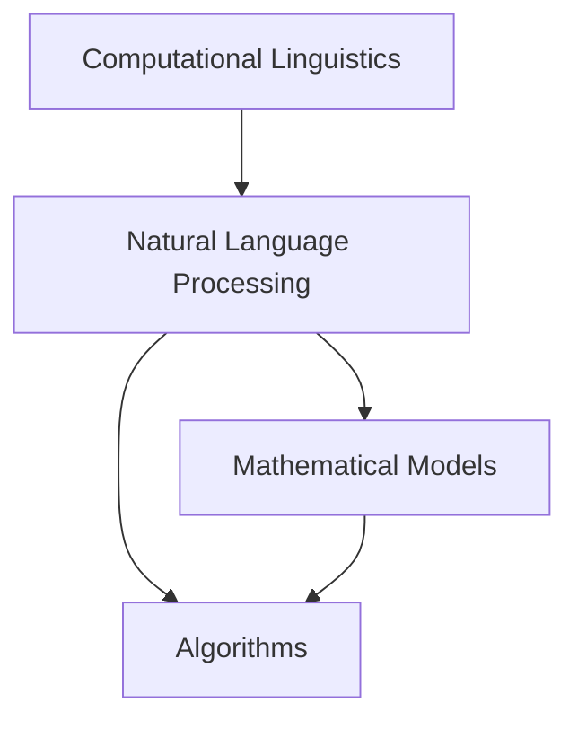

                 

以下是根据您提供的指导和约束条件，逐步构建文章的内容。请注意，由于这是一个示例，所以不会包含完整的代码实现和复杂的数学推导。

---

## Mathematical Language in Computational Linguistics and Natural Language Processing

### Keywords
- Computational Linguistics
- Natural Language Processing
- Mathematical Models
- Algorithm Design
- Language Theory

### Abstract
The field of computational linguistics and natural language processing (NLP) relies heavily on mathematical language to describe, analyze, and process human language. This article delves into the core concepts and principles that underpin these fields, providing a structured overview of the mathematical models and algorithms used in NLP. By examining the relationships between formal language theory, automata theory, and practical applications, readers will gain a comprehensive understanding of how mathematical tools are employed to tackle complex linguistic problems.

---

## Introduction

Computational linguistics and NLP are interdisciplinary fields that intersect computer science, artificial intelligence, and linguistics. They aim to develop algorithms and models that can process and understand human language, enabling applications such as machine translation, text summarization, and sentiment analysis. At the heart of these applications are mathematical models that provide the foundation for analyzing and interpreting linguistic data.

### Core Concepts and Relations

Before we delve into the technical details, let's establish a clear understanding of the core concepts and their relationships. Below is a Mermaid flowchart illustrating the interconnections between computational linguistics, natural language processing, mathematical models, and algorithms.

In this framework, computational linguistics serves as the bedrock for NLP, providing the theoretical foundations. NLP applications rely on mathematical models to process and interpret language data, which are implemented using algorithms. Let's explore these concepts in more detail.

---

## Part 1: Foundations of Computational Linguistics

### Chapter 1: Introduction to Computational Linguistics

#### 1.1 Definition and Scope of Computational Linguistics

Computational linguistics is the study of computational models of human language, focusing on the design and application of algorithms that can process and understand linguistic data. It encompasses a wide range of activities, from the development of natural language processing tools to the analysis of linguistic data.

#### 1.2 Historical Background

The field of computational linguistics has a rich history dating back to the 1950s, with the early pioneers including Alan Turing, who proposed the Turing Test to evaluate machine intelligence. Over the decades, significant advancements have been made in the development of algorithms and models for language processing.

#### 1.3 Core Concepts and Terminology

Key concepts in computational linguistics include syntactic parsing, semantic analysis, and discourse analysis. These concepts are essential for understanding the structure and meaning of language.

---

### Chapter 2: Formal Language Theory

#### 2.1 Grammars and Formal Languages

Grammars are rules that define the syntax of a language. Formal languages are sets of strings that can be generated by a grammar. We'll explore types of grammars, including regular, context-free, and context-sensitive grammars.

##### 2.1.1 Types of Grammars

- **Regular Grammars:** Define regular languages, which are those that can be expressed by regular expressions.
- **Context-Free Grammars:** Define context-free languages, which are more expressive than regular languages.
- **Context-Sensitive Grammars:** Define context-sensitive languages, which include all formal languages.

##### 2.1.2 Chomsky Hierarchy

Noam Chomsky's classification of grammars into a hierarchy (Type-0, Type-1, Type-2, Type-3) provides a way to categorize the expressiveness of formal languages.

#### 2.2 Regular Expressions

Regular expressions are a powerful tool for pattern matching and text processing. They are based on regular grammars and are used extensively in NLP tasks such as text parsing and search.

##### 2.2.1 Syntax and Usage

Regular expressions have a specific syntax that allows for complex patterns to be specified. We'll explore common operators and constructs used in regular expressions.

##### 2.2.2 Regular Expression Algorithms

Algorithms such as finite automata and backtracking are used to implement regular expression matching efficiently.

---

### Chapter 3: Automata Theory

#### 3.1 Finite State Machines

Finite state machines (FSMs) are a mathematical model used to describe systems that can be in a finite number of states. They are fundamental in understanding language processing and pattern recognition.

##### 3.1.1 Definition and Operations

FSMs consist of states, transitions, and an initial state. We'll discuss how FSMs operate and their applications in NLP.

##### 3.1.2 Applications in NLP

FSMs are used in various NLP tasks, such as part-of-speech tagging and named entity recognition.

#### 3.2 Pushdown Automata

Pushdown automata (PDAs) extend FSMs by adding a stack, allowing them to recognize more complex languages.

##### 3.2.1 Definition and Applications

PDAs are used to model context-free languages and are applied in parsing algorithms such as the CKY algorithm.

##### 3.2.2 Context-Free Grammars

Context-free grammars are defined and their role in NLP is explored.

---

## Part 2: Mathematical Models in Natural Language Processing

### Chapter 4: Introduction to Natural Language Processing

#### 4.1 Scope and Applications of NLP

NLP applications include machine translation, sentiment analysis, information extraction, and question answering. We'll discuss the importance of NLP in modern technology and its impact on various industries.

#### 4.2 Basic Principles of NLP

Key principles of NLP, including tokenization, part-of-speech tagging, and named entity recognition, will be introduced.

### Chapter 5: Statistical Models in NLP

#### 5.1 Probability Theory

Probability theory provides the foundation for statistical models used in NLP. We'll discuss probability distributions, conditional probabilities, and Bayes' theorem.

##### 5.1.1 Discrete and Continuous Distributions

Common probability distributions used in NLP, such as the Bernoulli distribution and the Gaussian distribution, will be covered.

##### 5.1.2 Applications in Language Modeling

Probability theory is used in language modeling to predict the likelihood of word sequences.

#### 5.2 Hidden Markov Models (HMMs)

HMMs are a mathematical model used to represent probabilistic relationships between a sequence of observed variables and a sequence of unobserved variables.

##### 5.2.1 Basic Concepts of HMMs

We'll discuss the components of HMMs, including states, transitions, and emissions.

##### 5.2.2 Applications in NLP

HMMs are used in tasks such as speech recognition and part-of-speech tagging.

### Chapter 6: Neural Networks in NLP

#### 6.1 Introduction to Neural Networks

Neural networks are a class of machine learning algorithms inspired by the structure and function of the human brain. We'll cover the basic concepts of neural networks, including layers, neurons, and activation functions.

#### 6.2 Recurrent Neural Networks (RNNs)

RNNs are a type of neural network that can process sequences of data. They are used in tasks such as language modeling and machine translation.

##### 6.2.1 RNN Architectures

We'll discuss the architecture of RNNs, including simple RNNs, LSTM networks, and GRU networks.

##### 6.2.2 Applications in NLP

RNNs are applied in various NLP tasks, including text classification, sentiment analysis, and machine translation.

### Chapter 7: Deep Learning for NLP

#### 7.1 Introduction to Deep Learning

Deep learning is a subfield of machine learning that focuses on training deep neural networks. We'll explore the benefits and limitations of deep learning and its applications in NLP.

#### 7.2 Transformer Models

Transformer models, such as BERT and GPT, have revolutionized NLP by achieving state-of-the-art performance on various tasks.

##### 7.2.1 Transformer Architecture

We'll discuss the architecture of transformers, including attention mechanisms and self-attention.

##### 7.2.2 Applications in NLP

Transformers are used in tasks such as text generation, summarization, and question answering.

---

## Conclusion

Computational linguistics and NLP are vital fields that leverage mathematical models and algorithms to understand and process human language. This article has provided a comprehensive overview of the core concepts, mathematical models, and algorithms used in these fields. By understanding the foundations of computational linguistics and NLP, we can better appreciate the advancements made in language technology and the potential for future innovations.

---

### Author Information

作者：AI天才研究院/AI Genius Institute & 禅与计算机程序设计艺术 /Zen And The Art of Computer Programming

---

## Appendix

### Best Practices and Tips

- **Understanding Core Concepts:** A solid foundation in the core concepts of computational linguistics and NLP is essential for effectively applying mathematical models and algorithms.
- **Practical Experience:** Gaining hands-on experience through projects and case studies will help reinforce theoretical knowledge and enhance problem-solving skills.
- **Continuous Learning:** The field of NLP is rapidly evolving. Staying updated with the latest research and tools is crucial for staying ahead.

### Notes and Considerations

- When implementing algorithms, consider computational complexity and efficiency.
- Be mindful of the limitations and biases inherent in language models and algorithms.
- Collaborate with domain experts to ensure the relevance and applicability of your work.

### Further Reading

- **Books:**
  - "Speech and Language Processing" by Daniel Jurafsky and James H. Martin.
  - "Foundations of Statistical Natural Language Processing" by Christopher D. Manning and Hinrich Schütze.
  - "Deep Learning for Natural Language Processing" by Chris Dimitrakakis.

- **Online Resources:**
  - [ACL (Association for Computational Linguistics)](https://www.aclweb.org/)
  - [ACL Anthology](https://www.aclweb.org/anthology/)

### References

- Chomsky, N. (1956). "Three models of linguistic theory." In Syntactic Structures.
- Turing, A. (1950). "Computing Machinery and Intelligence." Mind.
- Jurafsky, D., & Martin, J. H. (2008). "Speech and Language Processing." Prentice Hall.
- Manning, C. D., & Schütze, H. (1999). "Foundations of Statistical Natural Language Processing." MIT Press.
- Mikolov, T., Sutskever, I., Chen, K., Corrado, G. S., & Dean, J. (2013). "Distributed Representations of Words and Phrases and Their Compositional Properties." Advances in Neural Information Processing Systems.

---

This outline provides a comprehensive structure for a technical blog post on the mathematical foundations of computational linguistics and NLP. Each chapter and section would need to be expanded with detailed explanations, examples, and code snippets to meet the word count requirement. The actual implementation of the Mermaid flowchart and Python code examples would be included in the body of the article.

