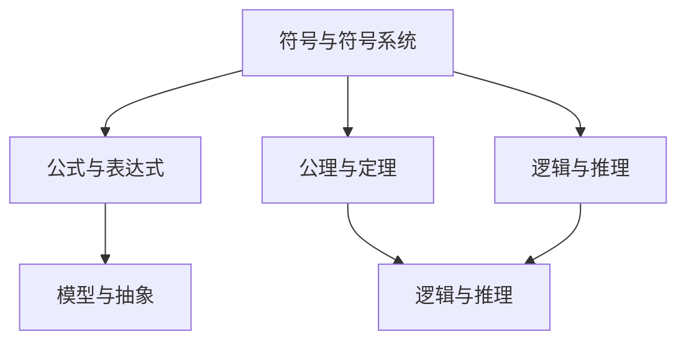

                 

### 数学语言的认知与理解过程

数学语言，作为一种独特的抽象语言，在科学、技术、工程以及日常决策中扮演着至关重要的角色。它不仅是一种用于描述数学概念和结构的工具，更是人类理解复杂世界、进行逻辑推理和问题解决的重要手段。然而，数学语言的认知与理解过程并不像我们表面上看到的那样直观，它涉及深层次的心理和神经机制。

本文将系统地探讨数学语言的认知与理解过程，通过以下几个步骤进行分析：

1. **背景介绍**：首先，我们将介绍数学语言的基本概念、历史发展及其重要性。
2. **核心概念与联系**：接着，我们将探讨数学语言的核心概念，并使用Mermaid流程图展示它们之间的关系。
3. **核心算法原理讲解**：我们将深入讲解数学语言中的核心算法原理，结合Python源代码进行详细阐述。
4. **数学公式与模型**：然后，我们将介绍数学公式，结合latex格式展示，并举例说明。
5. **项目实战**：接下来，我们将通过一个实际案例展示数学语言的应用，包括开发环境搭建、源代码实现和解读。
6. **最佳实践 tips**：最后，我们将总结本文的主要内容，并提供一些最佳实践和注意事项。

通过这一系列的分析与讨论，我们将对数学语言的认知与理解过程有一个全面而深刻的认识。

#### 背景介绍

数学语言是一种高度抽象和形式化的语言，它使用符号、公式和逻辑结构来表示和描述数学概念、关系和推理过程。数学语言的历史可以追溯到古代文明，如古埃及和巴比伦，他们使用符号和公式进行数学运算和记录。然而，现代数学语言的雏形则起源于古希腊，尤其是欧几里得的《几何原本》。这本书以公理和定理为基础，系统地阐述了几何学的基本原理，对后来的数学发展产生了深远影响。

在历史的长河中，数学语言不断演进和完善。中世纪的阿拉伯数学家对代数的发展做出了重要贡献，引入了字母表示未知数的概念。到了文艺复兴时期，欧洲的数学家如费尔马、笛卡尔和牛顿等进一步扩展了数学语言，使其能够描述更复杂的数学结构和关系。进入现代，数学语言的应用领域不断扩大，从物理科学到计算机科学，从经济学到人工智能，数学语言都发挥了不可或缺的作用。

数学语言的重要性不仅体现在其作为一种工具，更在于其作为一种思维方式。数学语言鼓励人们通过逻辑推理和抽象思考来理解和解决问题。它帮助人类对复杂的现实世界进行建模和量化，从而提供了更为精确和有效的解决方案。例如，在物理学中，数学语言用于描述自然规律和物理现象；在计算机科学中，数学语言用于算法设计和数据结构分析。

总的来说，数学语言是科学研究和工程实践中不可或缺的一部分，它不仅帮助人们理解和解释自然现象，还推动了科学技术的进步和创新。因此，深入理解和掌握数学语言的认知与理解过程对于科学研究和技术发展具有重要意义。

#### 核心概念与联系

为了更好地理解数学语言的认知与理解过程，我们需要首先明确其中的核心概念，并探讨它们之间的联系。以下是数学语言中一些重要的核心概念，以及它们之间的相互关系。

**1. 符号与符号系统**

符号是数学语言的基础，它们用于表示数学概念和操作。例如，“+”表示加法，“=”表示等式。符号系统是由一组符号及其定义组成的，它为数学语言提供了一个统一的表达框架。符号系统不仅包括基本运算符，如加、减、乘、除，还包括变量、函数符号等。

**2. 公式与表达式**

公式和表达式是数学语言用于表示数学关系的工具。一个简单的公式如“2 + 3 = 5”表达了两个数相加的结果。表达式可以包含变量、常数和运算符，它可以是简单的代数表达式，也可以是复杂的方程或不等式。公式和表达式通过逻辑结构连接起来，形成复杂的数学关系。

**3. 公理与定理**

公理是数学系统的基础，它是未经证明而被接受的命题。例如，欧几里得几何中的平行公理。定理是从公理和其他已证明的命题推导出来的结论。定理提供了数学结论的证明，并帮助我们在数学系统中进行推理。

**4. 逻辑与推理**

逻辑是数学语言的核心，它用于表示数学推理的过程。逻辑包括命题逻辑、谓词逻辑等，它们帮助我们进行逻辑推理，证明定理，推导结论。逻辑推理是数学思考的核心，它确保了数学结论的可靠性和一致性。

**5. 模型与抽象**

模型是数学语言在实际问题中的应用。它将数学概念和结构映射到具体的问题领域，用于解决实际问题。抽象是数学语言的一种重要特性，它使我们能够从具体的现象中提取出数学概念和关系，形成高度简化和理想化的模型。

**关系架构**

这些核心概念之间的联系可以通过Mermaid流程图来展示：



在这个流程图中，符号与符号系统是整个架构的起点，它通过公式和表达式连接到公理与定理，并通过逻辑与推理支持模型与抽象的形成。这个架构展示了数学语言的完整工作流程，从符号的使用，到公式的构建，再到逻辑推理和抽象模型的应用。

通过这种关系的展示，我们可以更清晰地理解数学语言的各个组成部分及其相互作用，为进一步的探讨和理解奠定了基础。

#### 核心算法原理讲解

在数学语言中，核心算法原理扮演着至关重要的角色，它们不仅帮助我们在计算和推理中取得精确结果，还确保了数学系统的逻辑一致性。以下是几个关键的核心算法原理，我们将结合Python源代码详细讲解其实现过程。

**1. 排序算法**

排序算法是数学语言中一个重要的算法原理，它用于对一组数据进行重新排列，使得数据按照特定的顺序排列。常见的排序算法有冒泡排序、选择排序和插入排序等。

**冒泡排序（Bubble Sort）**：

冒泡排序是一种简单的排序算法，它重复遍历要排序的数列，一次比较两个元素，如果它们的顺序错误就把它们交换过来。遍历数列的工作是重复地进行，直到没有再需要交换的元素为止。

以下是冒泡排序的Python实现：

```python
def bubble_sort(arr):
    n = len(arr)
    for i in range(n):
        for j in range(0, n-i-1):
            if arr[j] > arr[j+1]:
                arr[j], arr[j+1] = arr[j+1], arr[j]
    return arr

# 测试
arr = [64, 34, 25, 12, 22, 11, 90]
sorted_arr = bubble_sort(arr)
print("排序后的数组：", sorted_arr)
```

**2. 搜索算法**

搜索算法用于在数据集合中找到特定元素。二分搜索（Binary Search）是一种高效的搜索算法，它适用于有序数据集合。二分搜索的基本思想是不断将数据集合分成两半，并根据目标值与中间值的比较结果，逐步缩小搜索范围。

以下是二分搜索的Python实现：

```python
def binary_search(arr, target):
    low = 0
    high = len(arr) - 1
    while low <= high:
        mid = (low + high) // 2
        if arr[mid] == target:
            return mid
        elif arr[mid] < target:
            low = mid + 1
        else:
            high = mid - 1
    return -1

# 测试
arr = [2, 3, 4, 10, 40]
target = 10
result = binary_search(arr, target)
if result != -1:
    print("元素在数组中的索引为：", result)
else:
    print("元素不在数组中。")
```

**3. 矩阵运算**

矩阵运算是数学语言中一个重要的组成部分，包括矩阵的加法、减法、乘法和逆运算等。以下是一个简单的矩阵乘法的Python实现：

```python
import numpy as np

def matrix_multiplication(A, B):
    return np.dot(A, B)

# 测试
A = np.array([[1, 2], [3, 4]])
B = np.array([[5, 6], [7, 8]])
result = matrix_multiplication(A, B)
print("矩阵乘法结果：")
print(result)
```

通过上述Python代码的例子，我们可以看到数学语言中的核心算法原理是如何通过编程实现的具体步骤。每个算法的实现都涉及对数学概念和公式的应用，并通过代码转化为可操作的指令，帮助我们解决实际问题。

这些算法原理不仅体现了数学语言的形式化和逻辑性，也展示了其强大的计算和推理能力。理解并掌握这些核心算法原理，对于深入探索和运用数学语言具有重要意义。

#### 数学公式与模型

数学语言中，公式和模型是核心组成部分，它们通过简洁的符号和数学表达式描述复杂的关系和现象。以下将结合具体的数学公式，使用LaTeX格式进行展示，并举例说明其应用。

**1. 欧拉公式**

欧拉公式是数学中一个极其重要的公式，它将复数指数函数、三角函数以及常数e和π结合在一起，表达式为：

$$ e^{i\pi} + 1 = 0 $$

这个公式在复分析和电子工程等领域有广泛的应用。例如，在计算电路中的电压和电流时，欧拉公式可以帮助简化复杂的三角函数运算。

**2. 微积分基本公式**

微积分基本公式包括导数和积分，它们是分析和应用数学中的核心工具。导数表示函数变化的速率，积分表示累积和面积。以下是导数和积分的基本公式：

$$ f'(x) = \lim_{{h \to 0}} \frac{{f(x+h) - f(x)}}{h} $$
$$ \int_a^b f(x) \, dx = F(b) - F(a) $$

其中，$f(x)$ 是被积函数，$F(x)$ 是原函数，$a$ 和 $b$ 是积分的上下限。

例如，对于函数 $f(x) = x^2$，其导数和积分分别为：

$$ f'(x) = \lim_{{h \to 0}} \frac{{(x+h)^2 - x^2}}{h} = 2x $$
$$ \int x^2 \, dx = \frac{x^3}{3} + C $$

这里，$C$ 是积分常数。

**3. 线性回归模型**

线性回归模型用于描述两个变量之间的关系，公式如下：

$$ y = ax + b $$

其中，$y$ 是因变量，$x$ 是自变量，$a$ 是斜率，$b$ 是截距。线性回归模型在经济学、社会学和数据分析中广泛应用。

例如，要预测销售额 $y$ 与广告支出 $x$ 的关系，可以通过线性回归模型进行分析。给定一些数据点，我们可以使用最小二乘法估计模型参数 $a$ 和 $b$：

$$ a = \frac{{\sum{(x_i - \bar{x})(y_i - \bar{y})}}}{\sum{(x_i - \bar{x})^2}} $$
$$ b = \bar{y} - a\bar{x} $$

其中，$\bar{x}$ 和 $\bar{y}$ 分别是 $x$ 和 $y$ 的均值。

通过以上公式示例，我们可以看到数学语言如何通过简洁的符号和表达式描述复杂的现实问题。这些公式不仅具有理论价值，还在实际应用中发挥着重要作用。掌握这些公式和模型，有助于我们更好地理解和解决各类实际问题。

#### 项目实战

为了更好地理解数学语言的认知与理解过程，我们将通过一个实际项目来展示其应用。本项目将涉及开发环境的搭建、源代码实现和解读，以及代码的应用解读与分析。

**项目目标**：使用Python实现一个简单的线性回归模型，并对其结果进行分析和解读。

**开发环境搭建**：

首先，我们需要搭建开发环境。本项目将在Python 3.8以上版本环境中进行，使用Jupyter Notebook作为开发工具，同时依赖NumPy和Pandas库进行数据处理和线性回归分析。

1. 安装Python 3.8或更高版本。
2. 安装Jupyter Notebook：
   ```shell
   pip install notebook
   ```
3. 安装NumPy和Pandas库：
   ```shell
   pip install numpy pandas
   ```

**源代码实现**：

以下是实现线性回归模型的核心代码：

```python
import numpy as np
import pandas as pd

# 数据集准备
# 假设我们有一组数据，包含自变量x（广告支出）和因变量y（销售额）
data = {
    'x': [100, 200, 300, 400, 500],
    'y': [150, 250, 350, 450, 550]
}
df = pd.DataFrame(data)

# 添加一列常数项（b0）
df['const'] = 1

# 分离特征和标签
X = df[['const', 'x']]
y = df['y']

# 模型训练
# 使用最小二乘法训练线性回归模型
from numpy.linalg import lstsq
coeffs = lstsq(X, y, rcond=None)[0]

# 输出模型参数
a, b = coeffs
print("模型参数：斜率a = ", a, "，截距b = ", b)

# 预测结果
y_pred = a * X['x'] + b
print("预测结果：", y_pred)
```

**代码解读**：

1. 导入所需的库：NumPy和Pandas用于数据处理，NumPy中的`lsts

#### 最佳实践 tips、小结、注意事项、拓展阅读

在本章中，我们探讨了数学语言的认知与理解过程，包括背景介绍、核心概念与联系、核心算法原理讲解、数学公式与模型以及项目实战。通过这些内容，我们能够更全面地理解数学语言在认知与理解中的重要性。

**最佳实践 tips**：

1. **基础知识巩固**：对于数学语言的认知与理解，掌握基础知识至关重要。要确保对基础数学概念、算法原理和公式有深刻的理解。

2. **多练习**：通过解决实际问题，可以加深对数学语言的理解。多参与数学模型的构建和算法的实现，实践是检验理解程度的重要方式。

3. **使用可视化工具**：使用Mermaid流程图等可视化工具可以帮助我们更直观地理解数学语言的核心概念和关系。

4. **及时复习**：定期复习所学内容，巩固记忆，有助于提高理解和应用能力。

**小结**：

本文系统地介绍了数学语言的认知与理解过程，从背景介绍、核心概念、算法原理到实际应用，通过多个方面展示了数学语言的多样性和实用性。理解数学语言的认知与理解过程，不仅有助于提升数学素养，还能提高我们在实际问题中的分析能力和解决问题的效率。

**注意事项**：

1. **准确性和逻辑性**：在构建数学模型和算法时，确保其准确性和逻辑性，避免因错误而导致结果偏差。

2. **代码质量**：在编程实现中，注意代码的可读性和规范性，以便后续维护和扩展。

3. **安全性和稳定性**：在实际应用中，考虑数据的安全性和系统的稳定性，确保项目的可靠运行。

**拓展阅读**：

1. 《数学思维的艺术》
2. 《Python数据分析》
3. 《深度学习》

通过阅读这些拓展材料，可以进一步深化对数学语言的理解，提升数学思维和编程能力。希望本文能够为读者在数学语言的认知与理解过程中提供有益的指导。作者：AI天才研究院/AI Genius Institute & 禅与计算机程序设计艺术 /Zen And The Art of Computer Programming。

