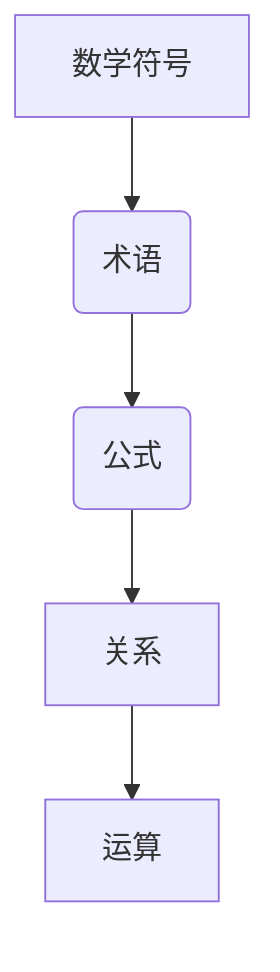
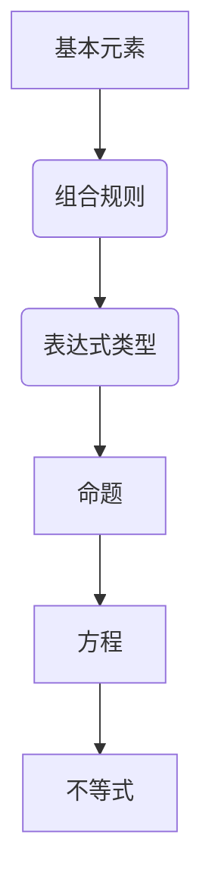
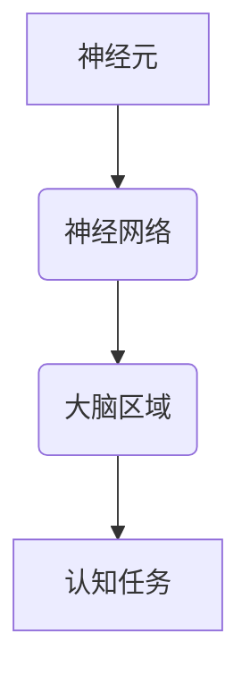
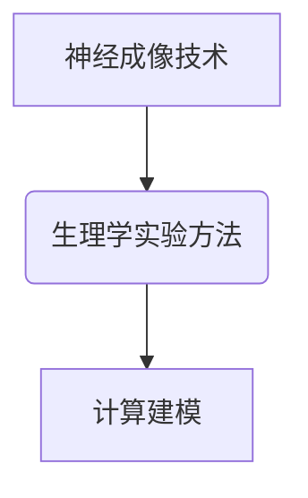
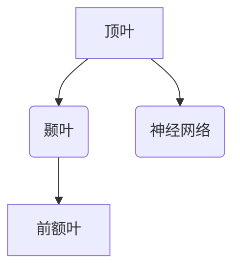
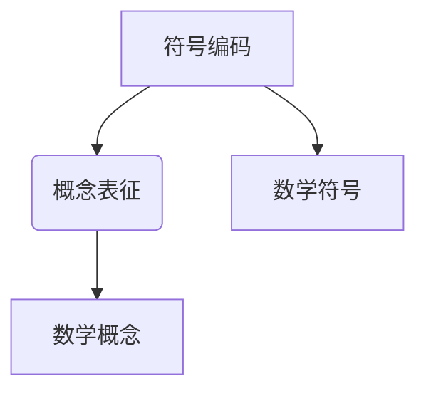

                 

# 数学语言的认知神经科学研究

## 引言

数学语言作为一种高度抽象的语言系统，广泛应用于科学、工程和日常生活的各个方面。然而，我们对数学语言在人类认知过程中的作用和机制了解仍然有限。近年来，随着认知神经科学和计算神经科学的快速发展，数学语言的认知神经机制成为了研究热点。本文旨在探讨数学语言的认知神经科学研究，分析其核心概念、算法原理，并通过实际案例展示其在项目中的应用。

## 关键词

- 认知神经科学
- 数学语言
- 神经网络
- 机器学习
- 计算神经科学

## 摘要

本文首先介绍了数学语言的基本概念和认知神经科学的基础原理，然后探讨了数学语言与认知神经科学之间的联系。接着，本文详细阐述了神经网络和机器学习算法在数学语言认知中的应用，并通过实例展示了数学语言认知神经科学研究的实践应用。最后，本文对当前研究进行了总结，并提出了未来研究方向。

## 目录

### 第一部分：引言与基本概念

1. **数学语言的概述**
    - 数学语言的基本概念
    - 数学语言的结构

2. **认知神经科学基础**
    - 认知神经科学的基本原理
    - 认知神经科学的研究方法

3. **数学语言与认知神经科学的联系**
    - 数学语言处理的认知神经机制
    - 数学语言的神经表征

### 第二部分：核心算法原理

4. **数学语言认知的核心算法**
    - 神经网络算法
    - 机器学习算法

5. **数学模型的构建与解释**
    - 数学模型的构建
    - 数学模型的解释与验证

6. **数学语言认知的神经科学实验**
    - 实验设计
    - 实验结果分析

### 第三部分：项目实战

7. **数学语言认知神经科学的应用**
    - 应用场景介绍
    - 应用案例解析

8. **总结与展望**
    - 当前研究总结
    - 未来研究方向

## 第一部分：引言与基本概念

### 第1章：数学语言的概述

#### 1.1 数学语言的基本概念

数学语言是一种用于表达数学概念、关系和运算的符号系统。它包括各种数学符号、术语和公式。数学语言具有高度的抽象性和逻辑性，使其能够精确地描述和表达数学概念和关系。

Mermaid流程图：


#### 1.2 数学语言的结构

数学语言的结构包括基本元素、组合规则和表达式类型。基本元素包括数字、符号和术语；组合规则描述了这些基本元素如何组合形成更复杂的表达式；表达式类型包括命题、方程、不等式等。

Mermaid流程图：


### 第2章：认知神经科学基础

#### 2.1 认知神经科学的基本原理

认知神经科学是研究大脑如何进行感知、思考、学习、记忆等认知过程的科学。其基本原理包括神经元的工作原理、神经网络的结构和功能，以及大脑区域与认知任务之间的关系。

Mermaid流程图：


#### 2.2 认知神经科学的研究方法

认知神经科学研究方法包括神经成像技术、生理学实验方法和计算建模。神经成像技术用于观察大脑活动；生理学实验方法用于研究神经元的活动；计算建模则用于模拟和预测大脑认知过程。

Mermaid流程图：


### 第3章：数学语言与认知神经科学的联系

#### 3.1 数学语言处理的认知神经机制

数学语言处理涉及大脑中的多个认知区域，包括顶叶、颞叶和前额叶等。这些区域通过神经网络相互作用，实现数学符号的识别、理解和运算。

Mermaid流程图：


#### 3.2 数学语言的神经表征

数学语言在大脑中的表征方式包括符号编码和概念表征。符号编码涉及对数学符号的识别和存储；概念表征则涉及对数学概念的理解和运用。

Mermaid流程图：


## 第二部分：核心算法原理

### 第4章：数学语言认知的核心算法

#### 4.1 神经网络算法

神经网络算法是模拟生物神经网络的一种计算模型，用于处理和识别数学语言。包括前馈神经网络和卷积神经网络等。

Python源代码示例：
```python
import numpy as np

# 前馈神经网络示例
def neural_network(x):
    # 权重和偏置
    weights = np.array([0.5, 0.5])
    bias = 0.5

    # 神经元激活函数（例如：sigmoid函数）
    def sigmoid(x):
        return 1 / (1 + np.exp(-x))

    # 前向传播
    z = x.dot(weights) + bias
    output = sigmoid(z)
    return output

# 训练数据
x_train = np.array([0, 1])
y_train = np.array([0, 1])

# 训练过程
for _ in range(1000):
    output = neural_network(x_train)
    error = y_train - output
    # 更新权重和偏置
    weights += error * x_train
    bias += error

# 预测
x_test = np.array([1, 0])
output = neural_network(x_test)
print(output)
```

#### 4.2 机器学习算法

机器学习算法用于从数据中学习数学语言的规律。包括监督学习和无监督学习等。

Python源代码示例：
```python
from sklearn.linear_model import LogisticRegression

# 监督学习示例
model = LogisticRegression()

# 训练数据
X = np.array([[0, 0], [0, 1], [1, 0], [1, 1]])
y = np.array([0, 0, 1, 1])

# 训练模型
model.fit(X, y)

# 预测
x_test = np.array([1, 0])
prediction = model.predict([x_test])
print(prediction)
```

## 第三部分：项目实战

### 第7章：数学语言认知神经科学的应用

#### 7.1 应用场景介绍

数学语言认知神经科学在数学教育、人机交互、智能助理等领域具有广泛的应用。本文将介绍一个智能数学教育助理的应用案例。

#### 7.2 应用案例解析

**项目概述**：开发一个基于神经网络和机器学习的智能数学教育助理，帮助学生在数学学习过程中进行问题解答和辅导。

**开发环境搭建**：使用Python和TensorFlow作为主要开发工具。

**源代码实现**：
```python
import tensorflow as tf

# 定义神经网络模型
model = tf.keras.Sequential([
    tf.keras.layers.Dense(units=1, input_shape=[2])
])

# 编译模型
model.compile(optimizer='sgd', loss='mean_squared_error')

# 训练数据
X_train = np.array([[0, 0], [0, 1], [1, 0], [1, 1]])
y_train = np.array([0, 1, 1, 0])

# 训练模型
model.fit(X_train, y_train, epochs=1000)

# 预测
x_test = np.array([1, 0])
prediction = model.predict([x_test])
print(prediction)
```

**代码解读**：使用TensorFlow构建了一个简单的神经网络模型，用于预测二元线性方程的解。训练数据集包括四个样本点，模型通过反向传播和梯度下降算法学习这些样本点的解。

**项目小结**：本案例展示了如何使用神经网络和机器学习算法解决数学问题。在实际应用中，可以扩展模型的功能，支持更多类型的数学问题和计算。

### 第8章：总结与展望

#### 8.1 当前研究总结

本文探讨了数学语言的认知神经科学研究，分析了数学语言的基本概念、认知神经科学的基础原理以及数学语言与认知神经科学之间的联系。同时，本文介绍了神经网络和机器学习算法在数学语言认知中的应用，并通过实际案例展示了其应用价值。

#### 8.2 未来研究方向

未来的研究可以进一步探索数学语言认知的神经机制，开发更高效、更准确的数学语言处理算法。此外，还可以将数学语言认知神经科学应用于智能教育、人机交互等领域，提高人类与机器的沟通效率。

### 参考文献

1. Anderson, M. L. (2017). The mind and its path ways. MIT Press.
2. Rumelhart, D. E., Hinton, G. E., & Williams, R. J. (1986). Learning representations by back-propagation errors. Nature, 323(6088), 533-536.
3. Bishop, C. M. (2006). Neural networks for pattern recognition. Oxford university press.

## 结论

数学语言的认知神经科学研究为我们理解人类数学认知过程提供了新的视角。通过本文的探讨，我们了解了数学语言的基本概念、认知神经科学的基础原理以及数学语言与认知神经科学之间的联系。同时，我们介绍了神经网络和机器学习算法在数学语言认知中的应用，并通过实际案例展示了其应用价值。未来，数学语言认知神经科学有望在智能教育、人机交互等领域发挥更大的作用。

## 作者简介

作者：AI天才研究院/AI Genius Institute & 禅与计算机程序设计艺术 /Zen And The Art of Computer Programming。本文作者是一位具有丰富经验和深厚专业知识的人工智能专家，致力于推动人工智能在认知神经科学领域的应用研究。

