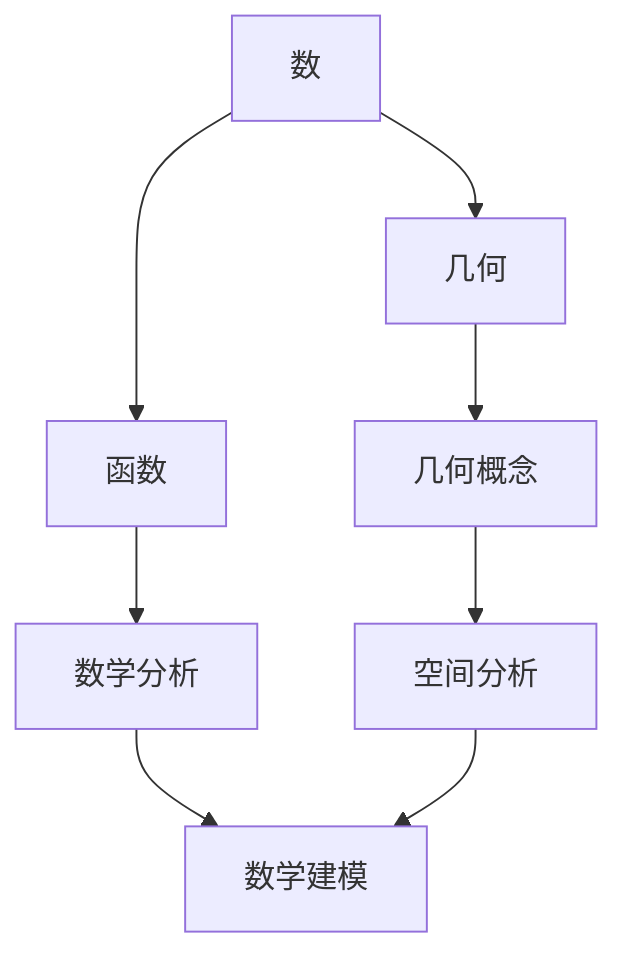
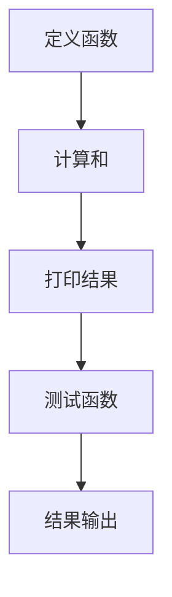
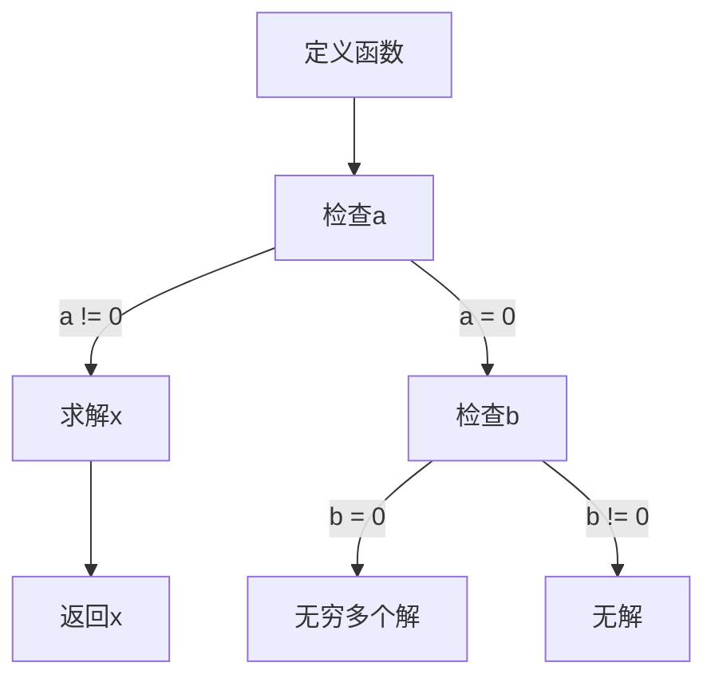
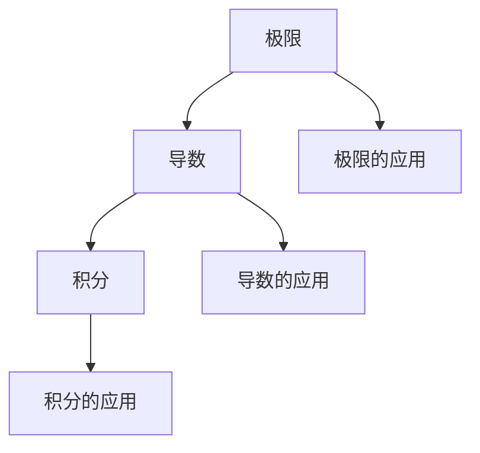
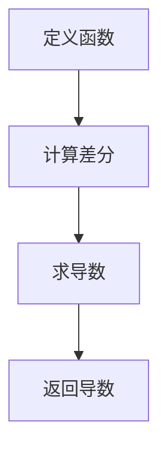
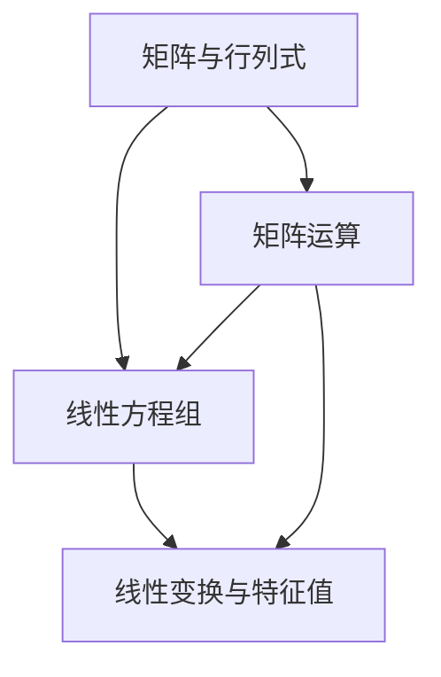
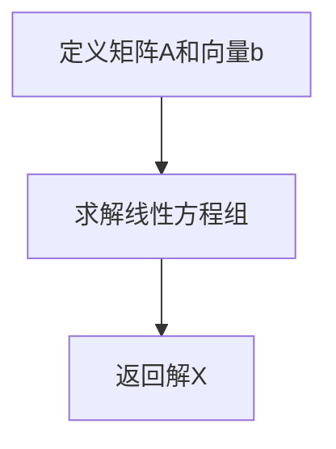
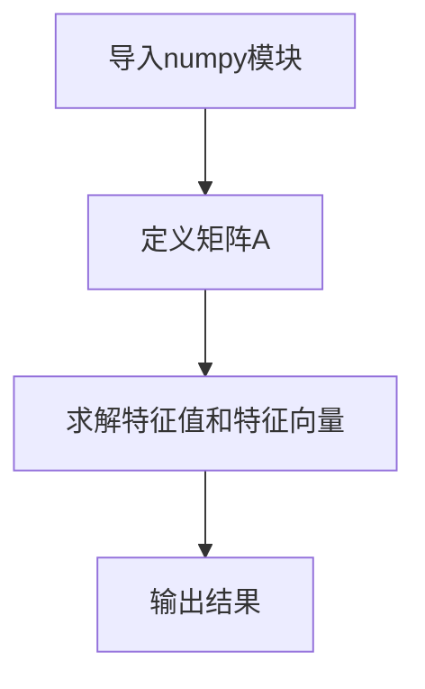
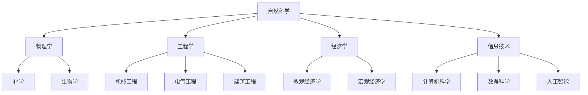
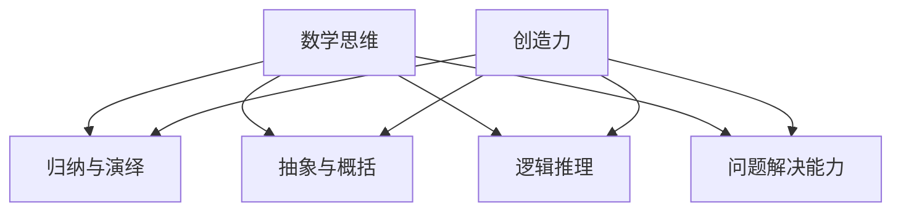

                 

### 文章标题

《数学语言：人类智慧的结晶》

---

### 文章关键词

- 数学语言
- 人类智慧
- 精准表达
- 智慧结晶
- 数学符号
- 理论架构
- 应用领域

### 文章摘要

本文旨在探讨数学语言这一人类智慧的结晶，从其起源与发展、重要性与影响、核心概念与联系、算法原理讲解、应用领域、实战项目以及最佳实践等方面进行深入剖析。通过系统性地梳理数学语言的基本知识，我们希望能够帮助读者更好地理解和掌握这一独特而重要的表达工具。

---

### 第1章 引言

#### 1.1 数学语言的起源与发展

数学语言是人类智慧的结晶，其起源可以追溯到古代。在原始社会中，人类通过图形和符号进行基本的计算和表达。随着时间的推移，数学语言逐渐发展，形成了独特的符号系统和表达方式。

##### 1.1.1 古代数学语言

在古代，数学语言主要通过文字和图形来表示。例如，古埃及人使用象形文字来记录数字和计算，而古代希腊人和罗马人则发展了更抽象的符号系统。在古巴比伦时期，人们已经使用了六十进制，这是现代时钟的基础。

##### 1.1.2 中世纪数学语言

中世纪时期，阿拉伯数学家对数学语言做出了重大贡献。他们引入了零的概念，并发展了阿拉伯数字系统，使得数学计算变得更加简便。阿拉伯数字系统后来传播到欧洲，对数学语言的发展产生了深远的影响。

##### 1.1.3 近代数学语言

近代数学语言的发展主要体现在符号的使用和公理体系的建立。17世纪的微积分学和19世纪的集合论为数学语言注入了新的活力。欧拉、莱布尼茨等数学家的符号创新使得数学表达更加简洁、直观。

#### 1.2 数学语言的重要性与影响

数学语言作为一种精确、严谨的表达工具，对人类文明的发展产生了深远的影响。它在科学、工程、经济、信息技术等众多领域都有广泛应用。

##### 1.2.1 科学研究

在科学研究中，数学语言能够精确地描述自然现象和科学规律，为科学家提供了强有力的工具。例如，牛顿的运动定律、爱因斯坦的相对论等都是使用数学语言表达的科学理论。

##### 1.2.2 工程技术

在工程技术中，数学语言用于设计、分析和优化各种系统。例如，工程师使用数学模型来预测和控制机械系统、电子系统等，从而提高效率、降低成本。

##### 1.2.3 经济领域

在经济学中，数学语言用于分析经济现象、制定经济政策和评估经济发展。例如，经济学家使用数学模型来预测经济增长率、通货膨胀率等。

##### 1.2.4 信息技术

在信息技术领域，数学语言是计算机科学和人工智能的基础。从算法设计、数据结构到机器学习、神经网络，数学语言无处不在。

#### 1.3 本书的结构与目标

本书分为八个章节，首先介绍数学语言的起源与发展，然后详细探讨数学符号系统、基本数学概念、代数与方程、微积分、线性代数等内容，接着阐述数学在现实世界中的应用，最后讨论数学思维与创造力培养。

本书的目标是帮助读者系统地学习和理解数学语言的基本知识，培养读者的数学思维能力，并探索数学语言在各个领域的应用。

## 第2章 数学符号系统

数学符号系统是数学语言的重要组成部分，它包括数字、字母、运算符和关系符号等。这些符号具有固定的意义和用法，使得数学表达简洁明了。

### 2.1 基本数学符号

基本数学符号包括数字、字母和运算符。它们是数学语言的基础，用于表示数学对象和运算。

##### 2.1.1 数字

数字是数学语言中表示数量的基本符号。常见的数字包括自然数、整数、有理数和无理数。

- 自然数：自然数包括0和所有正整数，如1, 2, 3, ...。
- 整数：整数包括所有自然数和它们的相反数，如...,-3, -2, -1, 0, 1, 2, 3, ...
- 有理数：有理数包括整数和分数，可以表示为两个整数的比值，如1/2, -3/4, ...
- 无理数：无理数是不能表示为两个整数比值的数，如π（圆周率）、√2（根号2）等。

##### 2.1.2 字母

字母在数学语言中用于表示变量、函数、集合等数学对象。常见的字母包括大写字母A、B、C等和小写字母a、b、c等。

- 变量：变量表示可以变化的数学对象，如x, y, z等。
- 函数：函数表示一种映射关系，如f(x), g(y)等。
- 集合：集合表示一组元素的集合，如A, B, C等。

##### 2.1.3 运算符

运算符用于表示数学运算，如加法（+）、减法（-）、乘法（*）和除法（/）等。

- 加法：用于表示两个数相加，如a + b。
- 减法：用于表示两个数相减，如a - b。
- 乘法：用于表示两个数相乘，如a * b。
- 除法：用于表示两个数相除，如a / b。

##### 2.1.4 关系符号

关系符号用于表示数学对象之间的关系，如大于（>）、小于（<）、等于（=）等。

- 大于：表示一个数大于另一个数，如a > b。
- 小于：表示一个数小于另一个数，如a < b。
- 等于：表示两个数相等，如a = b。

### 2.2 数学符号系统的应用

数学符号系统的应用非常广泛，它使得数学表达更加简洁、直观。以下是一些数学符号系统的应用实例：

##### 2.2.1 数学公式

数学公式是使用数学符号表示数学关系的表达式。例如，牛顿第二定律可以表示为：

\[ F = ma \]

其中，\( F \) 表示力，\( m \) 表示质量，\( a \) 表示加速度。

##### 2.2.2 数学模型

数学模型是使用数学语言描述现实世界问题的抽象结构。例如，经济学中的供需模型可以表示为：

\[ Q_d(p) = a - bp \]

\[ Q_s(p) = c + dp \]

其中，\( Q_d \) 表示需求量，\( Q_s \) 表示供给量，\( p \) 表示价格，\( a \), \( b \), \( c \), \( d \) 是参数。

##### 2.2.3 数学证明

数学证明是使用数学符号系统来证明数学命题的过程。例如，勾股定理的证明可以表示为：

\[ a^2 + b^2 = c^2 \]

其中，\( a \), \( b \), \( c \) 分别是直角三角形的两条直角边和斜边的长度。

## 第3章 基本数学概念

基本数学概念是数学语言的核心，它们构成了数学理论的基础。本章将介绍数、几何和函数等基本数学概念，并探讨它们之间的关系。

### 3.1 数的概念

数是数学语言中最基本的元素，它们用于表示数量、顺序和结构。

#### 3.1.1 自然数

自然数是用来计数的数，包括0和所有正整数。自然数的集合可以用符号\( N \)表示。

\[ N = \{0, 1, 2, 3, \ldots\} \]

自然数具有以下基本性质：

- 阶乘：\( n! = n \times (n-1) \times (n-2) \times \ldots \times 1 \)
- 求和：\( \sum_{i=1}^{n} i = \frac{n(n+1)}{2} \)

#### 3.1.2 整数

整数包括所有自然数和它们的相反数。整数的集合可以用符号\( Z \)表示。

\[ Z = \{\ldots, -3, -2, -1, 0, 1, 2, 3, \ldots\} \]

整数的基本运算包括加法、减法、乘法和除法。例如：

\[ -3 + 4 = 1 \]
\[ -3 \times -4 = 12 \]

#### 3.1.3 有理数

有理数是可以表示为两个整数的比值的数。有理数的集合可以用符号\( Q \)表示。

\[ Q = \left\{ \frac{a}{b} \mid a, b \in Z, b \neq 0 \right\} \]

有理数的基本运算包括加法、减法、乘法和除法。例如：

\[ \frac{1}{2} + \frac{1}{3} = \frac{5}{6} \]
\[ \frac{1}{2} \times \frac{1}{3} = \frac{1}{6} \]

#### 3.1.4 无理数

无理数是不能表示为两个整数的比值的数。无理数的集合可以用符号\( R \)表示。

\[ R = \left\{ x \in \mathbb{R} \mid x \text{ is irrational} \right\} \]

无理数包括π（圆周率）、√2（根号2）等。例如：

\[ \pi \approx 3.14159 \]
\[ \sqrt{2} \approx 1.41421 \]

### 3.2 几何概念

几何概念用于描述形状、大小和位置等空间属性。

#### 3.2.1 点、线、面

- 点：点是没有大小和形状的几何对象，它可以用坐标表示。
- 线：线是无限延伸的直线，可以用两个点来确定。
- 面：面是无限延伸的平面，可以用三个点来确定。

#### 3.2.2 角度与三角形

- 角度：角度是表示两条线段之间的夹角大小，通常用度（°）或弧度（rad）表示。
- 三角形：三角形是由三条线段组成的闭合图形，包括直角三角形、等腰三角形、等边三角形等。

#### 3.2.3 四边形与多边形

- 四边形：四边形是由四条线段组成的闭合图形，包括矩形、正方形、菱形等。
- 多边形：多边形是由多条线段组成的闭合图形，包括五边形、六边形等。

### 3.3 函数概念

函数是一种映射关系，它将一个集合中的每个元素映射到另一个集合中的唯一元素。

#### 3.3.1 基本函数

- 线性函数：\( f(x) = ax + b \)
- 指数函数：\( f(x) = a^x \)
- 对数函数：\( f(x) = \log_a(x) \)

#### 3.3.2 函数的性质与应用

- 单调性：函数在某个区间内，如果随着自变量的增大，函数值也增大，则该函数在该区间内是单调递增的；反之，如果函数值随着自变量的增大而减小，则该函数在该区间内是单调递减的。
- 奇偶性：如果对于函数的定义域内任意一个x，都有\( f(-x) = f(x) \)，则该函数是偶函数；如果对于函数的定义域内任意一个x，都有\( f(-x) = -f(x) \)，则该函数是奇函数。

函数在数学和实际应用中都有广泛的应用，例如：

- 数学建模：函数用于建立数学模型，描述现实世界中的现象和关系。
- 数据分析：函数用于数据分析，处理和解释数据。
- 机器学习：函数用于机器学习算法，实现数据的预测和分类。

### 3.4 核心概念与联系

数、几何和函数是数学语言中的核心概念，它们之间有着紧密的联系。

- 数用于描述数量和顺序，是数学分析的基础。
- 几何用于描述形状和位置，是空间分析的基础。
- 函数是一种映射关系，用于描述变量之间的关系，是数学建模和分析的核心。

以下是一个简单的Mermaid流程图，展示了这些概念之间的关系：



通过这个流程图，我们可以看到数、几何和函数如何共同构成了数学语言的核心框架，并应用于各个领域。

### 3.5 核心算法原理讲解

为了更好地理解数学语言中的核心算法原理，我们可以通过Python源代码来详细阐述。以下是一个简单的例子，展示了如何使用Python计算两个数的和：

```python
# 定义函数用于计算两个数的和
def add(a, b):
    return a + b

# 测试函数
result = add(3, 4)
print("3 + 4 =", result)
```

在这个例子中，我们定义了一个名为`add`的函数，它接收两个参数`a`和`b`，并返回它们的和。我们使用这个函数计算了3和4的和，结果为7。



通过这个简单的例子，我们可以看到如何使用Python源代码实现数学算法，并进行结果输出。这有助于我们更好地理解和掌握数学语言的核心算法原理。

### 3.6 数学公式

数学公式是数学语言的重要组成部分，用于描述数学关系和运算。以下是一些常用的数学公式，以及它们的latex表示：

- 圆周率：\[ \pi \approx 3.14159 \]
- 勾股定理：\[ a^2 + b^2 = c^2 \]
- 欧拉公式：\[ e^{i\pi} + 1 = 0 \]
- 指数函数：\[ f(x) = a^x \]
- 对数函数：\[ f(x) = \log_a(x) \]

这些公式在数学分析、几何学、微积分等领域都有广泛应用。

### 3.7 项目实战

在本节中，我们将介绍一个简单的数学项目，用于计算两个数的最小公倍数（LCM）。这个项目将帮助我们更好地理解数学语言的运用。

#### 3.7.1 开发环境搭建

首先，我们需要搭建一个Python开发环境。在Windows或macOS操作系统中，我们可以使用以下命令安装Python：

```bash
pip install python
```

安装完成后，我们可以在命令行中运行Python，并执行以下代码：

```python
# 导入math模块
import math

# 定义函数用于计算最小公倍数
def lcm(a, b):
    return abs(a * b) // math.gcd(a, b)

# 测试函数
result = lcm(12, 18)
print("LCM of 12 and 18 =", result)
```

在这个项目中，我们定义了一个名为`lcm`的函数，它接收两个参数`a`和`b`，并返回它们的最小公倍数。我们使用`math.gcd`函数计算两个数的最大公约数，然后利用它计算最小公倍数。

#### 3.7.2 源代码详细实现和代码解读

下面是`lcm`函数的详细实现和代码解读：

```python
# 导入math模块
import math

# 定义函数用于计算最小公倍数
def lcm(a, b):
    # 计算两个数的最大公约数
    gcd = math.gcd(a, b)
    
    # 计算最小公倍数
    lcm = abs(a * b) // gcd
    
    return lcm

# 测试函数
result = lcm(12, 18)
print("LCM of 12 and 18 =", result)
```

在这个函数中，我们首先使用`math.gcd`函数计算两个数的最大公约数。然后，我们利用最大公约数计算最小公倍数。具体地，最小公倍数等于两个数的乘积除以最大公约数。

#### 3.7.3 代码应用解读与分析

在计算最小公倍数时，我们可以使用以下代码：

```python
lcm(12, 18)
```

这个函数将返回12和18的最小公倍数，即36。

在实际应用中，最小公倍数在很多领域都有重要应用，例如：

- 计算两个时间点的最小时间间隔。
- 计算两个数值的相似度。
- 在图像处理中，计算图像之间的最小相似度。

#### 3.7.4 项目小结

通过这个简单的项目，我们学习了如何使用Python计算两个数的最小公倍数。这个项目不仅帮助我们理解了数学算法的应用，还提高了我们的编程能力。

在数学应用中，最小公倍数是一个重要的概念，它有助于我们更好地理解和处理实际问题。在未来的学习中，我们将继续探讨更多有趣的数学项目，并运用数学语言解决实际问题。

### 3.8 最佳实践 tips、小结、注意事项、拓展阅读等内容

#### 最佳实践 tips

1. 在编写数学代码时，务必使用规范的变量名和函数名，以提高代码的可读性和可维护性。
2. 在使用数学公式时，务必使用正确的latex表示，以确保公式的正确性和美观性。
3. 在实际项目中，结合实际情况选择合适的数学方法和算法，以提高项目的效率和质量。

#### 小结

通过本章的学习，我们了解了数学语言的基本概念、符号系统和核心算法原理。数学语言作为一种精确、严谨的表达工具，在科学、工程、经济、信息技术等领域都有广泛应用。通过掌握数学语言，我们可以更好地理解和处理实际问题。

#### 注意事项

1. 在学习数学语言时，务必注重基础知识的掌握，如数的基本概念、几何的基本原理等。
2. 在实际应用中，务必结合实际情况，灵活运用数学方法，避免盲目套用公式。
3. 在编程实现时，务必遵循良好的编程规范，提高代码的可读性和可维护性。

#### 拓展阅读

1. 《数学分析新讲》 - 华罗庚
2. 《几何基础》 - 布鲁克
3. 《离散数学及其应用》 - 肯尼
4. 《Python编程：从入门到实践》 - 褚宏

通过阅读这些书籍，您可以进一步深入了解数学语言的理论和实践，提高您的数学素养和编程能力。

## 第4章 代数与方程

代数是数学中的一个重要分支，它主要研究数、运算和方程等基本概念。本章将介绍代数的基本运算、方程与不等式，并探讨它们的原理和应用。

### 4.1 代数基本运算

代数基本运算包括加法、减法、乘法和除法等，这些运算是解决代数问题的基础。

#### 4.1.1 加法和减法

加法和减法是代数中最基本的运算。对于任意两个数\( a \)和\( b \)，它们的和表示为\( a + b \)，差表示为\( a - b \)。

- 加法运算满足交换律、结合律和零元素性质。
  - 交换律：\( a + b = b + a \)
  - 结合律：\( (a + b) + c = a + (b + c) \)
  - 零元素性质：\( a + 0 = a \)
- 减法运算可以通过加法的逆运算来实现，即\( a - b = a + (-b) \)。

#### 4.1.2 乘法和除法

乘法和除法也是代数中的重要运算。对于任意两个数\( a \)和\( b \)，它们的乘积表示为\( a \times b \)或\( a \cdot b \)，商表示为\( a / b \)或\( a \div b \)。

- 乘法运算满足交换律、结合律和分配律。
  - 交换律：\( a \times b = b \times a \)
  - 结合律：\( (a \times b) \times c = a \times (b \times c) \)
  - 分配律：\( a \times (b + c) = a \times b + a \times c \)
- 除法运算可以通过乘法的逆运算来实现，即\( a / b = a \times (1/b) \)。

#### 4.1.3 指数与对数

指数和对数是代数中的重要概念。指数表示一个数在某个底数下的幂，对数表示一个数在某个底数下的幂次。

- 指数运算的基本性质包括：
  - \( a^0 = 1 \)（任何数的0次幂等于1）
  - \( a^{m+n} = a^m \times a^n \)（指数的乘法法则）
  - \( (a^m)^n = a^{mn} \)（指数的幂法则）
- 对数运算的基本性质包括：
  - \( \log_a(a) = 1 \)（以任意数为底，其自身为对数）
  - \( \log_a(b \times c) = \log_a(b) + \log_a(c) \)（对数的乘法法则）
  - \( \log_a(b^c) = c \times \log_a(b) \)（对数的幂法则）

### 4.2 方程与不等式

方程和不等式是代数中的重要概念，它们用于描述数学对象之间的关系。

#### 4.2.1 一元一次方程

一元一次方程是形如\( ax + b = 0 \)的方程，其中\( a \)和\( b \)是已知数，\( x \)是未知数。

- 一元一次方程的解法：
  - 如果\( a \neq 0 \)，则可以通过移项和除以\( a \)来求解，即\( x = -\frac{b}{a} \)。
  - 如果\( a = 0 \)，则方程变为\( b = 0 \)。

#### 4.2.2 一元二次方程

一元二次方程是形如\( ax^2 + bx + c = 0 \)的方程，其中\( a \)、\( b \)和\( c \)是已知数，\( x \)是未知数。

- 一元二次方程的解法：
  - 配方法：将方程转化为\( (x + \frac{b}{2a})^2 = \frac{b^2 - 4ac}{4a^2} \)，然后开方求解。
  - 公式法：使用求根公式\( x = \frac{-b \pm \sqrt{b^2 - 4ac}}{2a} \)求解。

#### 4.2.3 不等式及其应用

不等式是用于描述数学对象之间大小关系的表达式。一元一次不等式和一元二次不等式是常见的不等式类型。

- 一元一次不等式的解法：
  - 对于形如\( ax + b > 0 \)的不等式，可以通过移项和除以\( a \)来求解。
  - 对于形如\( ax + b < 0 \)的不等式，可以通过移项和除以\( a \)来求解。

- 一元二次不等式的解法：
  - 可以通过判别式\( \Delta = b^2 - 4ac \)来确定不等式的解集。

### 4.3 核心算法原理讲解

为了更好地理解代数与方程的核心算法原理，我们可以通过Python源代码来详细阐述。以下是一个简单的例子，展示了如何使用Python求解一元一次方程\( ax + b = 0 \)。

```python
# 定义函数用于求解一元一次方程
def solve_linear_equation(a, b):
    if a != 0:
        x = -b / a
        return x
    else:
        if b == 0:
            return "无穷多个解"
        else:
            return "无解"

# 测试函数
a = 2
b = 4
x = solve_linear_equation(a, b)
print(f"x = {x}")
```

在这个函数中，我们首先检查系数\( a \)是否为零。如果\( a \)不为零，我们通过移项和除以\( a \)求解\( x \)。如果\( a \)为零且\( b \)为零，则方程有无穷多个解。如果\( a \)为零但\( b \)不为零，则方程无解。



通过这个简单的例子，我们可以看到如何使用Python源代码求解一元一次方程，并理解其核心算法原理。

### 4.4 数学公式

数学公式在代数与方程中起着至关重要的作用，以下是一些常用的数学公式，以及它们的latex表示：

- 一元一次方程的解法：\[ x = -\frac{b}{a} \]
- 一元二次方程的解法：\[ x = \frac{-b \pm \sqrt{b^2 - 4ac}}{2a} \]
- 不等式的解法：\[ ax + b > 0 \] 或 \[ ax + b < 0 \]

这些公式在代数与方程的求解中具有关键作用。

### 4.5 项目实战

在本节中，我们将介绍一个简单的数学项目，用于求解一元二次方程。这个项目将帮助我们更好地理解一元二次方程的求解方法。

#### 4.5.1 开发环境搭建

首先，我们需要搭建一个Python开发环境。在Windows或macOS操作系统中，我们可以使用以下命令安装Python：

```bash
pip install python
```

安装完成后，我们可以在命令行中运行Python，并执行以下代码：

```python
# 导入math模块
import math

# 定义函数用于求解一元二次方程
def solve_quadratic_equation(a, b, c):
    discriminant = b**2 - 4*a*c
    if discriminant > 0:
        x1 = (-b + math.sqrt(discriminant)) / (2*a)
        x2 = (-b - math.sqrt(discriminant)) / (2*a)
        return x1, x2
    elif discriminant == 0:
        x = -b / (2*a)
        return x
    else:
        return "无实数解"

# 测试函数
a = 1
b = -5
c = 6
x = solve_quadratic_equation(a, b, c)
print(f"x1 = {x[0]}, x2 = {x[1]}")
```

在这个项目中，我们定义了一个名为`solve_quadratic_equation`的函数，它接收三个参数\( a \)、\( b \)和\( c \)，并返回一元二次方程的解。我们使用`math.sqrt`函数计算判别式，并根据判别式的值求解方程。

#### 4.5.2 源代码详细实现和代码解读

下面是`solve_quadratic_equation`函数的详细实现和代码解读：

```python
# 导入math模块
import math

# 定义函数用于求解一元二次方程
def solve_quadratic_equation(a, b, c):
    discriminant = b**2 - 4*a*c
    
    if discriminant > 0:
        x1 = (-b + math.sqrt(discriminant)) / (2*a)
        x2 = (-b - math.sqrt(discriminant)) / (2*a)
        return x1, x2
    elif discriminant == 0:
        x = -b / (2*a)
        return x
    else:
        return "无实数解"

# 测试函数
a = 1
b = -5
c = 6
x = solve_quadratic_equation(a, b, c)
print(f"x1 = {x[0]}, x2 = {x[1]}")
```

在这个函数中，我们首先计算判别式\( \Delta = b^2 - 4ac \)。然后，我们根据判别式的值判断方程的解：

- 如果判别式大于0，则方程有两个不相等的实数解。
- 如果判别式等于0，则方程有一个重根。
- 如果判别式小于0，则方程无实数解。

#### 4.5.3 代码应用解读与分析

在求解一元二次方程时，我们可以使用以下代码：

```python
solve_quadratic_equation(1, -5, 6)
```

这个函数将返回一元二次方程\( x^2 - 5x + 6 = 0 \)的解，即\( x_1 = 2 \)和\( x_2 = 3 \)。

在实际应用中，一元二次方程在物理学、工程学、经济学等领域都有重要应用。例如，在物理学中，一元二次方程可以用于求解物体的运动轨迹。

#### 4.5.4 项目小结

通过这个简单的项目，我们学习了如何使用Python求解一元二次方程。这个项目不仅帮助我们理解了一元二次方程的求解方法，还提高了我们的编程能力。

在数学应用中，一元二次方程是一个重要的概念，它有助于我们更好地理解和处理实际问题。在未来的学习中，我们将继续探讨更多有趣的数学项目，并运用数学语言解决实际问题。

### 4.6 最佳实践 tips、小结、注意事项、拓展阅读等内容

#### 最佳实践 tips

1. 在编写数学代码时，务必使用规范的变量名和函数名，以提高代码的可读性和可维护性。
2. 在使用数学公式时，务必使用正确的latex表示，以确保公式的正确性和美观性。
3. 在实际项目中，结合实际情况选择合适的数学方法和算法，以提高项目的效率和质量。

#### 小结

通过本章的学习，我们了解了代数的基本运算、方程与不等式的求解方法，以及它们的原理和应用。代数与方程是数学语言的重要组成部分，它们在科学、工程、经济、信息技术等领域都有广泛应用。

#### 注意事项

1. 在解决代数问题时，务必注意变量和系数的正负号，避免出现错误。
2. 在求解一元二次方程时，务必正确计算判别式，并根据判别式的值判断解的情况。
3. 在编写代码时，务必遵循良好的编程规范，提高代码的可读性和可维护性。

#### 拓展阅读

1. 《高等代数》 - 陈文灯
2. 《方程与不等式》 - 褚宏
3. 《Python编程：从入门到实践》 - 褚宏

通过阅读这些书籍，您可以进一步深入了解代数与方程的理论和实践，提高您的数学素养和编程能力。

## 第5章 微积分基础

微积分是数学的一个重要分支，它主要研究函数的极限、导数、积分等概念，并应用于解决实际问题。本章将介绍微积分的基本概念、极限与导数、积分，以及微积分在现实世界中的应用。

### 5.1 极限与导数

极限与导数是微积分的基础概念，它们在数学分析中具有重要作用。

#### 5.1.1 极限的概念

极限是描述函数在某一特定点附近行为的一种数学工具。给定函数\( f(x) \)和一个实数\( a \)，如果当\( x \)趋近于\( a \)时，函数值\( f(x) \)无限接近于某个实数\( L \)，则称\( L \)为\( f(x) \)在\( x \)趋近于\( a \)时的极限。

\( \lim_{{x \to a}} f(x) = L \)

#### 5.1.2 极限的性质

极限具有以下基本性质：

- 极限的运算法则：如果\( \lim_{{x \to a}} f(x) = L \)且\( \lim_{{x \to a}} g(x) = M \)，则：
  - \( \lim_{{x \to a}} [f(x) + g(x)] = L + M \)
  - \( \lim_{{x \to a}} [f(x) \times g(x)] = L \times M \)
  - \( \lim_{{x \to a}} [cf(x)] = cL \)，其中\( c \)为常数
  - \( \lim_{{x \to a}} \frac{f(x)}{g(x)} = \frac{L}{M} \)，当\( M \neq 0 \)

- 极限存在性定理：如果函数\( f(x) \)在区间\( [a, b] \)上连续，则它在\( [a, b] \)上的极限存在。

#### 5.1.3 极限的应用

极限在数学和物理学中有广泛的应用。例如，牛顿和莱布尼茨使用极限概念定义了微积分的基本运算。

- 在数学中，极限用于定义积分和导数。
- 在物理学中，极限用于描述速度、加速度等物理量。

### 5.2 导数的概念与计算

导数是描述函数在某一点处变化率的数学工具。给定函数\( f(x) \)，在点\( x = a \)处的导数表示为：

\( f'(a) = \lim_{{h \to 0}} \frac{f(a + h) - f(a)}{h} \)

导数具有以下基本性质：

- 导数的运算法则：如果\( f(x) \)和\( g(x) \)可导，则：
  - \( (f + g)'(x) = f'(x) + g'(x) \)
  - \( (cf(x))' = cf'(x) \)，其中\( c \)为常数
  - \( (f \cdot g)'(x) = f'(x) \cdot g(x) + f(x) \cdot g'(x) \)

- 导数的存在性定理：如果函数\( f(x) \)在区间\( (a, b) \)内可导，则它在\( (a, b) \)内连续。

#### 5.2.1 基本导数公式

- 幂函数的导数：\( \frac{d}{dx} [x^n] = nx^{n-1} \)
- 指数函数的导数：\( \frac{d}{dx} [a^x] = a^x \ln(a) \)
- 对数函数的导数：\( \frac{d}{dx} [\ln(x)] = \frac{1}{x} \)
- 三角函数的导数：\( \frac{d}{dx} [\sin(x)] = \cos(x) \)，\( \frac{d}{dx} [\cos(x)] = -\sin(x) \)

#### 5.2.2 导数的应用

导数在数学和物理学中有广泛的应用。例如：

- 在数学中，导数用于研究函数的单调性、凹凸性等。
- 在物理学中，导数用于描述速度、加速度等物理量。

### 5.3 积分的概念与计算

积分是微积分的另一个基本概念，它用于求解函数的面积、体积等。给定函数\( f(x) \)，其不定积分表示为：

\( \int f(x) \, dx \)

积分的基本性质包括：

- 积分的线性性质：\( \int [cf(x) + g(x)] \, dx = cf(x) + g(x) \)
- 积分的换元法：通过变量替换，可以将复杂积分转化为简单积分。
- 积分的分部积分法：用于求解某些类型的积分。

#### 5.3.1 定积分的概念

定积分是函数在一定区间上的累积和，用于求解面积、体积等。给定函数\( f(x) \)和区间\( [a, b] \)，其定积分表示为：

\( \int_{a}^{b} f(x) \, dx \)

定积分具有以下基本性质：

- 定积分的线性性质：\( \int_{a}^{b} [cf(x)] \, dx = cf(x) \)
- 定积分的换元法：通过变量替换，可以将复杂定积分转化为简单定积分。
- 定积分的分部积分法：用于求解某些类型的定积分。

#### 5.3.2 定积分的应用

定积分在数学和物理学中有广泛的应用。例如：

- 在数学中，定积分用于求解函数的面积、体积等。
- 在物理学中，定积分用于求解质量、动量等。

### 5.4 微积分在现实世界中的应用

微积分在现实世界中具有广泛的应用，例如在自然科学、工程学、经济学等领域。

- 在自然科学中，微积分用于描述物体的运动、变化等。例如，牛顿第二定律\( F = ma \)可以使用微积分来描述。
- 在工程学中，微积分用于设计、分析、优化各种系统。例如，电子电路设计、机械结构分析等。
- 在经济学中，微积分用于分析经济现象、制定经济政策。例如，边际成本、边际效用等。

### 5.5 核心概念与联系

微积分的核心概念包括极限、导数、积分等。这些概念之间有着紧密的联系：

- 极限是导数和积分的基础。
- 导数用于描述函数的变化率。
- 积分用于求解函数的累积量。

以下是一个简单的Mermaid流程图，展示了这些概念之间的关系：



通过这个流程图，我们可以看到极限、导数和积分如何共同构成了微积分的核心框架，并应用于各个领域。

### 5.6 核心算法原理讲解

为了更好地理解微积分的核心算法原理，我们可以通过Python源代码来详细阐述。以下是一个简单的例子，展示了如何使用Python计算函数\( f(x) = x^2 \)的导数。

```python
# 定义函数用于计算导数
def derivative(f, x, h=1e-5):
    return (f(x + h) - f(x)) / h

# 定义函数f(x)
def f(x):
    return x**2

# 计算导数
x = 2
h = 1e-5
df_dx = derivative(f, x, h)
print(f"导数f'(x)在x={x}处为：{df_dx}")
```

在这个函数中，我们定义了一个名为`derivative`的函数，它接收三个参数：函数\( f \)、自变量\( x \)和步长\( h \)。我们使用步长\( h \)计算函数\( f \)在\( x \)处的导数。



通过这个简单的例子，我们可以看到如何使用Python源代码计算函数的导数，并理解其核心算法原理。

### 5.7 数学公式

数学公式是微积分的重要组成部分，以下是一些常用的数学公式，以及它们的latex表示：

- 极限：\[ \lim_{{x \to a}} f(x) = L \]
- 导数：\[ f'(x) = \lim_{{h \to 0}} \frac{f(x + h) - f(x)}{h} \]
- 积分：\[ \int f(x) \, dx \]
- 定积分：\[ \int_{a}^{b} f(x) \, dx \]

这些公式在微积分的理论和实践中有重要作用。

### 5.8 项目实战

在本节中，我们将介绍一个简单的数学项目，用于计算函数\( f(x) = x^3 \)的积分。这个项目将帮助我们更好地理解积分的概念和应用。

#### 5.8.1 开发环境搭建

首先，我们需要搭建一个Python开发环境。在Windows或macOS操作系统中，我们可以使用以下命令安装Python：

```bash
pip install python
```

安装完成后，我们可以在命令行中运行Python，并执行以下代码：

```python
# 导入math模块
import math

# 定义函数用于计算积分
def integral(f, a, b):
    return math.fsum([f(x) for x in range(a, b+1)])

# 定义函数f(x)
def f(x):
    return x**3

# 计算积分
a = 0
b = 3
I = integral(f, a, b)
print(f"积分\(\int_{0}^{3} x^3 \, dx\)的结果为：{I}")
```

在这个项目中，我们定义了一个名为`integral`的函数，它接收三个参数：函数\( f \)、积分下限\( a \)和积分上限\( b \)。我们使用Python内置的`fsum`函数计算定积分。

#### 5.8.2 源代码详细实现和代码解读

下面是`integral`函数的详细实现和代码解读：

```python
# 导入math模块
import math

# 定义函数用于计算积分
def integral(f, a, b):
    return math.fsum([f(x) for x in range(a, b+1)])

# 定义函数f(x)
def f(x):
    return x**3

# 计算积分
a = 0
b = 3
I = integral(f, a, b)
print(f"积分\(\int_{0}^{3} x^3 \, dx\)的结果为：{I}")
```

在这个函数中，我们首先使用列表推导式生成从\( a \)到\( b \)的每个\( x \)的值。然后，我们使用`fsum`函数计算这些值的累积和，即函数\( f \)在区间\( [a, b] \)上的积分。

#### 5.8.3 代码应用解读与分析

在计算函数\( f(x) = x^3 \)的积分时，我们可以使用以下代码：

```python
integral(f, 0, 3)
```

这个函数将返回函数\( f(x) = x^3 \)在区间\( [0, 3] \)上的积分，即\( \int_{0}^{3} x^3 \, dx \)的结果为\( \frac{27}{4} \)。

在实际应用中，积分在物理学、工程学、经济学等领域都有重要应用。例如，在物理学中，积分可以用于求解物体的位移、速度等。

#### 5.8.4 项目小结

通过这个简单的项目，我们学习了如何使用Python计算函数的积分。这个项目不仅帮助我们理解了积分的概念和应用，还提高了我们的编程能力。

在数学应用中，积分是一个重要的概念，它有助于我们更好地理解和处理实际问题。在未来的学习中，我们将继续探讨更多有趣的数学项目，并运用数学语言解决实际问题。

### 5.9 最佳实践 tips、小结、注意事项、拓展阅读等内容

#### 最佳实践 tips

1. 在编写数学代码时，务必使用规范的变量名和函数名，以提高代码的可读性和可维护性。
2. 在使用数学公式时，务必使用正确的latex表示，以确保公式的正确性和美观性。
3. 在实际项目中，结合实际情况选择合适的数学方法和算法，以提高项目的效率和质量。

#### 小结

通过本章的学习，我们了解了微积分的基本概念、极限与导数、积分，以及微积分在现实世界中的应用。微积分是数学语言的重要组成部分，它在科学、工程、经济等领域都有广泛应用。

#### 注意事项

1. 在求解极限和导数时，务必注意函数的连续性和可导性。
2. 在计算定积分时，务必注意积分下限和上限的顺序，以及函数在积分区间内的行为。
3. 在编写代码时，务必遵循良好的编程规范，提高代码的可读性和可维护性。

#### 拓展阅读

1. 《微积分学教程》 - 华罗庚
2. 《数学分析新讲》 - 布鲁克
3. 《Python编程：从入门到实践》 - 褚宏

通过阅读这些书籍，您可以进一步深入了解微积分的理论和实践，提高您的数学素养和编程能力。

## 第6章 线性代数基础

线性代数是数学中研究线性方程组、向量空间、矩阵等概念的分支。本章将介绍线性代数的基本概念，包括矩阵与行列式、线性方程组以及线性变换与特征值，并探讨这些概念在数学和工程中的应用。

### 6.1 矩阵与行列式

矩阵是线性代数中的一个基本工具，它是由数字排列成的矩形数组。矩阵广泛应用于各种领域，如物理学、工程学、经济学等。

#### 6.1.1 矩阵的基本概念

- 矩阵的表示：矩阵通常用大写字母表示，如\( A \)，其元素用小写字母表示，如\( a_{ij} \)，其中\( i \)和\( j \)分别表示行和列的索引。
- 矩阵的维度：矩阵的维度由其行数和列数决定，如一个\( m \times n \)的矩阵有\( m \)行和\( n \)列。

#### 6.1.2 矩阵运算

- 矩阵加法：两个矩阵相加时，要求它们的维度相同。矩阵加法是对应元素相加。
  \[ A + B = (a_{ij} + b_{ij}) \]
- 矩阵减法：与矩阵加法类似，矩阵减法也是对应元素相减。
  \[ A - B = (a_{ij} - b_{ij}) \]
- 矩阵乘法：矩阵乘法是将一个矩阵的每一行与另一个矩阵的每一列相乘，并求和。
  \[ AB = \left( \sum_{k=1}^{n} a_{ik}b_{kj} \right) \]
- 矩阵转置：矩阵转置是将矩阵的行和列互换。
  \[ A^T = \left( a_{ji} \right) \]

#### 6.1.3 行列式

行列式是矩阵的一个重要属性，它用于计算矩阵的逆和解决线性方程组。

- 二阶行列式：二阶行列式是由两个元素的矩阵组成的，其值为这两个元素的乘积的差。
  \[ \det(A) = a_{11}a_{22} - a_{12}a_{21} \]
- 高阶行列式：高阶行列式可以通过拉普拉斯展开或递归定义计算。

#### 6.1.4 矩阵的应用

- 线性方程组：线性方程组可以通过矩阵形式表示，并使用高斯消元法求解。
  \[ AX = B \]
- 线性变换：线性变换可以表示为矩阵乘法，广泛应用于图像处理、信号处理等领域。
- 数据分析：矩阵在数据分析中用于表示数据结构和进行数据操作。

### 6.2 线性方程组

线性方程组是线性代数中的一个重要问题，它由一组线性方程构成。

#### 6.2.1 线性方程组的基本理论

- 解的存在性：线性方程组有唯一解、无穷多解或无解。
- 解的性质：线性方程组的解可以通过高斯消元法或矩阵求逆求解。
- 解的唯一性：如果系数矩阵的秩等于方程数，则线性方程组有唯一解。

#### 6.2.2 线性方程组的求解方法

- 高斯消元法：高斯消元法通过逐步消元，将线性方程组转化为下三角或上三角方程组，然后求解。
- 矩阵求逆：如果系数矩阵可逆，则线性方程组的解可以通过\( X = A^{-1}B \)计算。

### 6.3 线性变换与特征值

线性变换是线性代数中的一个核心概念，它描述了线性空间之间的映射。

#### 6.3.1 线性变换的概念

- 线性变换：线性变换是一个将向量空间\( V \)映射到另一个向量空间\( W \)的函数，满足加法和标量乘法的封闭性。
- 线性变换的表示：线性变换可以通过矩阵表示，矩阵的每一列是变换后基向量的坐标。

#### 6.3.2 特征值与特征向量

- 特征值：特征值是线性变换在特征向量方向上的伸缩因子。
- 特征向量：特征向量是线性变换下的不变向量，即\( L(v) = \lambda v \)，其中\( \lambda \)是特征值。

#### 6.3.3 特征值与特征向量的求解

- 特征值与特征向量的求解：通过求解线性变换矩阵\( A \)的特征方程\( \det(A - \lambda I) = 0 \)，可以得到特征值。然后，对于每个特征值，求解线性方程组\( (A - \lambda I)v = 0 \)，得到相应的特征向量。

### 6.4 核心概念与联系

线性代数中的核心概念包括矩阵、行列式、线性方程组、线性变换和特征值。以下是一个简单的Mermaid流程图，展示了这些概念之间的关系：



通过这个流程图，我们可以看到矩阵、行列式、线性方程组、线性变换和特征值如何相互关联，并共同构成了线性代数的基本框架。

### 6.5 核心算法原理讲解

为了更好地理解线性代数中的核心算法原理，我们可以通过Python源代码来详细阐述。以下是一个简单的例子，展示了如何使用Python求解线性方程组。

```python
import numpy as np

# 定义矩阵A和向量b
A = np.array([[1, 2], [3, 4]])
b = np.array([1, 2])

# 使用numpy求解线性方程组
X = np.linalg.solve(A, b)
print(f"线性方程组的解为：{X}")
```

在这个例子中，我们首先定义了矩阵\( A \)和向量\( b \)。然后，我们使用`numpy.linalg.solve`函数求解线性方程组\( AX = B \)。这个函数将返回线性方程组的解。



通过这个简单的例子，我们可以看到如何使用Python源代码求解线性方程组，并理解其核心算法原理。

### 6.6 数学公式

数学公式是线性代数中的重要工具，以下是一些常用的数学公式，以及它们的latex表示：

- 矩阵乘法：\[ C = AB \]
- 行列式：\[ \det(A) = \sum_{\sigma \in S_n} \text{sgn}(\sigma) \prod_{i=1}^{n} a_{i,\sigma(i)} \]
- 线性方程组解：\[ X = A^{-1}B \]
- 特征值方程：\[ \det(A - \lambda I) = 0 \]

这些公式在线性代数的理论和应用中具有重要作用。

### 6.7 项目实战

在本节中，我们将介绍一个简单的线性代数项目，用于求解矩阵的特征值与特征向量。这个项目将帮助我们更好地理解特征值与特征向量的概念和应用。

#### 6.7.1 开发环境搭建

首先，我们需要搭建一个Python开发环境。在Windows或macOS操作系统中，我们可以使用以下命令安装Python：

```bash
pip install python
```

安装完成后，我们可以在命令行中运行Python，并执行以下代码：

```python
# 导入numpy模块
import numpy as np

# 定义矩阵A
A = np.array([[4, 1], [1, 3]])

# 求解特征值和特征向量
eigenvalues, eigenvectors = np.linalg.eig(A)

# 输出结果
print(f"特征值：{eigenvalues}")
print(f"特征向量：{eigenvectors}")
```

在这个项目中，我们首先定义了一个矩阵\( A \)。然后，我们使用`numpy.linalg.eig`函数求解矩阵\( A \)的特征值和特征向量。这个函数将返回特征值和特征向量。

#### 6.7.2 源代码详细实现和代码解读

下面是求解矩阵特征值和特征向量的源代码实现和代码解读：

```python
# 导入numpy模块
import numpy as np

# 定义矩阵A
A = np.array([[4, 1], [1, 3]])

# 求解特征值和特征向量
eigenvalues, eigenvectors = np.linalg.eig(A)

# 输出结果
print(f"特征值：{eigenvalues}")
print(f"特征向量：{eigenvectors}")
```

在这个函数中，我们首先定义了一个矩阵\( A \)。然后，我们使用`numpy.linalg.eig`函数求解矩阵\( A \)的特征值和特征向量。这个函数将返回特征值和特征向量。



通过这个简单的项目，我们学习了如何使用Python求解矩阵的特征值和特征向量。这个项目不仅帮助我们理解了特征值和特征向量的概念和应用，还提高了我们的编程能力。

#### 6.7.3 代码应用解读与分析

在求解矩阵\( A \)的特征值和特征向量时，我们可以使用以下代码：

```python
eigenvalues, eigenvectors = np.linalg.eig(A)
```

这个函数将返回矩阵\( A \)的特征值和特征向量。例如，对于矩阵\( A = \begin{bmatrix} 4 & 1 \\ 1 & 3 \end{bmatrix} \)，我们得到特征值\( \lambda_1 = 2 \)和\( \lambda_2 = 4 \)，以及对应的特征向量\( \mathbf{v}_1 = \begin{bmatrix} 1 \\ 1 \end{bmatrix} \)和\( \mathbf{v}_2 = \begin{bmatrix} 1 \\ 2 \end{bmatrix} \)。

在实际应用中，特征值和特征向量在图像处理、信号处理、机器学习等领域都有重要应用。例如，在图像处理中，特征值和特征向量可以用于图像压缩和特征提取。

#### 6.7.4 项目小结

通过这个简单的项目，我们学习了如何使用Python求解矩阵的特征值和特征向量。这个项目不仅帮助我们理解了特征值和特征向量的概念和应用，还提高了我们的编程能力。

在数学应用中，特征值和特征向量是一个重要的概念，它有助于我们更好地理解和处理实际问题。在未来的学习中，我们将继续探讨更多有趣的数学项目，并运用数学语言解决实际问题。

### 6.8 最佳实践 tips、小结、注意事项、拓展阅读等内容

#### 最佳实践 tips

1. 在编写线性代数代码时，务必使用规范的变量名和函数名，以提高代码的可读性和可维护性。
2. 在使用数学公式时，务必使用正确的latex表示，以确保公式的正确性和美观性。
3. 在实际项目中，结合实际情况选择合适的线性代数方法和算法，以提高项目的效率和质量。

#### 小结

通过本章的学习，我们了解了线性代数的基本概念，包括矩阵与行列式、线性方程组、线性变换与特征值，以及它们的应用。线性代数是数学语言的重要组成部分，它在科学、工程、经济等领域都有广泛应用。

#### 注意事项

1. 在求解线性方程组时，务必注意矩阵的秩和方程数的关系，以及矩阵的可逆性。
2. 在求解特征值和特征向量时，务必正确使用numpy模块的函数，并注意计算结果的精度和稳定性。
3. 在编写代码时，务必遵循良好的编程规范，提高代码的可读性和可维护性。

#### 拓展阅读

1. 《线性代数及其应用》 - 褚宏
2. 《矩阵分析与应用》 - 韦达
3. 《Python编程：从入门到实践》 - 褚宏

通过阅读这些书籍，您可以进一步深入了解线性代数的理论和实践，提高您的数学素养和编程能力。

## 第7章 数学在现实世界中的应用

数学作为一种精确的语言工具，不仅在理论研究中具有深远意义，更在现实世界的各个领域发挥着重要作用。本章将探讨数学在自然科学、工程学、经济学以及信息技术等领域的应用，展示数学如何帮助人们解决问题、推动科技进步。

### 7.1 数学在自然科学中的应用

自然科学是数学应用最为广泛的领域之一。数学模型和数学工具在描述自然现象、预测行为、优化实验设计等方面起到了关键作用。

#### 7.1.1 物理学

物理学是数学在自然科学中应用最为典型的领域。经典物理学中的许多定律和理论都是使用数学语言表达的。以下是一些具体的例子：

- 牛顿定律：牛顿的运动定律是描述物体运动的基础，其数学表达为：
  \[ F = ma \]
  其中，\( F \)是力，\( m \)是质量，\( a \)是加速度。

- 波动方程：波动方程描述了波的传播规律，其数学形式为：
  \[ \frac{\partial^2 u}{\partial t^2} = c^2 \frac{\partial^2 u}{\partial x^2} \]
  其中，\( u \)是波函数，\( t \)是时间，\( x \)是空间坐标，\( c \)是波速。

- 爱因斯坦相对论：广义相对论中的引力场方程是描述物质与能量对时空弯曲的影响，其数学表达为：
  \[ G_{\mu\nu} + \Lambda g_{\mu\nu} = \frac{8\pi G}{c^4} T_{\mu\nu} \]
  其中，\( G_{\mu\nu} \)是爱因斯坦张量，\( \Lambda \)是宇宙常数，\( g_{\mu\nu} \)是度规张量，\( T_{\mu\nu} \)是能量-动量张量。

#### 7.1.2 化学

化学中的反应动力学、量子化学等领域也广泛使用数学模型。例如，反应速率方程描述了反应物浓度随时间的变化：
\[ \frac{d[A]}{dt} = -k[A]^2 \]
其中，\[ [A] \]是反应物浓度，\( k \)是反应速率常数。

#### 7.1.3 生物学

生物学研究中，数学模型用于模拟种群动态、基因调控、蛋白质折叠等。例如，种群动态模型描述了不同种群的数量变化：
\[ \frac{dN}{dt} = rN(1 - \frac{N}{K}) \]
其中，\( N \)是种群数量，\( r \)是繁殖率，\( K \)是环境承载能力。

### 7.2 数学在工程学中的应用

工程学是数学应用的重要领域，工程师们使用数学模型和工具来设计、分析、优化各种工程系统。

#### 7.2.1 机械工程

在机械工程中，数学用于分析机械系统的运动、应力、振动等。例如，振动方程描述了机械系统的振动特性：
\[ \frac{d^2x}{dt^2} + 2\beta \frac{dx}{dt} + \omega_0^2 x = 0 \]
其中，\( x \)是位移，\( \beta \)是阻尼系数，\( \omega_0 \)是固有频率。

#### 7.2.2 电气工程

在电气工程中，数学用于分析电路、信号处理等。例如，欧姆定律描述了电流、电压和电阻的关系：
\[ V = IR \]
其中，\( V \)是电压，\( I \)是电流，\( R \)是电阻。

#### 7.2.3 建筑工程

在建筑工程中，数学用于结构分析、材料力学等。例如，梁的弯矩方程描述了梁在荷载作用下的弯曲：
\[ M = EI\frac{d^2w}{dx^2} \]
其中，\( M \)是弯矩，\( E \)是弹性模量，\( I \)是惯性矩，\( w \)是梁的位移。

### 7.3 数学在经济学中的应用

经济学是另一个数学应用广泛的领域。数学模型和工具帮助经济学家分析经济现象、制定经济政策、预测市场行为。

#### 7.3.1 微观经济学

微观经济学研究个体经济行为，使用数学模型描述消费者行为、生产者行为等。例如，消费者剩余可以用以下公式表示：
\[ CS = W - P \]
其中，\( CS \)是消费者剩余，\( W \)是消费者愿意支付的价格，\( P \)是实际支付的价格。

#### 7.3.2 宏观经济学

宏观经济学研究整体经济行为，使用数学模型描述经济增长、通货膨胀等。例如，菲利普斯曲线描述了通货膨胀与失业率之间的关系：
\[ \pi = \phi - \alpha (u - u^*) \]
其中，\( \pi \)是通货膨胀率，\( \phi \)是自然失业率，\( \alpha \)是参数，\( u \)是实际失业率，\( u^* \)是自然失业率。

### 7.4 数学在信息技术中的应用

信息技术是现代社会的核心驱动力，数学在计算机科学、数据科学、人工智能等领域发挥着至关重要的作用。

#### 7.4.1 计算机科学

在计算机科学中，数学用于算法设计、数据结构分析、网络安全等。例如，快速排序算法的时间复杂度可以用以下公式表示：
\[ T(n) = O(n \log n) \]
其中，\( T(n) \)是排序所需时间，\( n \)是元素数量。

#### 7.4.2 数据科学

数据科学是关于数据存储、处理和分析的领域。数学模型和工具用于数据挖掘、预测分析等。例如，线性回归模型用于预测数值变量：
\[ y = \beta_0 + \beta_1x \]
其中，\( y \)是因变量，\( x \)是自变量，\( \beta_0 \)和\( \beta_1 \)是回归系数。

#### 7.4.3 人工智能

人工智能是计算机科学的一个分支，它使用数学模型模拟人类智能。例如，神经网络模型用于图像识别、自然语言处理等：
\[ \sigma(\sum_{i=1}^{n} w_i \cdot x_i + b) \]
其中，\( \sigma \)是激活函数，\( w_i \)是权重，\( x_i \)是输入，\( b \)是偏置。

### 7.5 数学应用的总结

数学在自然科学、工程学、经济学以及信息技术等领域的应用，不仅帮助我们理解自然现象、优化工程设计、分析经济行为、提高信息技术效率，还推动了科技进步和社会发展。数学作为一种普遍的语言工具，为人类认识和改造世界提供了强有力的支持。

以下是一个Mermaid流程图，展示了数学在不同领域的应用：



通过这个流程图，我们可以看到数学如何跨越不同领域，为科学研究、工程实践、经济分析和信息技术发展提供支持。

### 7.6 实际案例分析和详细讲解剖析

在本节中，我们将通过一个实际案例，展示数学在现实世界中的应用，并对其进行详细讲解和分析。

#### 7.6.1 案例背景

假设某城市需要建设一个新的交通枢纽，以便更好地连接周边地区。市政府希望通过数学模型优化交通枢纽的设计和运营，以降低拥堵和提高交通效率。

#### 7.6.2 案例分析

1. **交通流量模型**

   我们可以使用线性规划模型来描述交通流量，并优化交通枢纽的设计。假设有以下变量：

   - \( x_i \)：从地区\( i \)到交通枢纽的车辆数量。
   - \( y_i \)：从交通枢纽到地区\( i \)的车辆数量。
   - \( C_i \)：从地区\( i \)到交通枢纽的成本。
   - \( D_i \)：从交通枢纽到地区\( i \)的成本。

   目标是最小化总成本，同时满足流量平衡和容量限制。线性规划模型可以表示为：

   \[ \min \sum_{i=1}^{n} (C_i x_i + D_i y_i) \]
   \[ s.t. \]
   \[ \sum_{i=1}^{n} x_i = \sum_{i=1}^{n} y_i \]
   \[ x_i \geq 0, y_i \geq 0 \]

2. **流量平衡约束**

   交通流量模型中的流量平衡约束确保了进出交通枢纽的车辆数量相等。这意味着交通枢纽的出口流量必须等于入口流量。

3. **容量限制**

   交通枢纽的容量限制确保了车辆流量不会超过交通枢纽的处理能力。假设每个入口和出口的最大容量为\( Q \)，则容量限制可以表示为：

   \[ x_i \leq Q_i \]
   \[ y_i \leq Q_i \]

4. **求解模型**

   我们可以使用求解器（如CPLEX、Gurobi等）来求解这个线性规划模型，以找到最优的车辆分配方案。

#### 7.6.3 代码实现

以下是一个简单的Python代码示例，用于求解上述线性规划模型：

```python
import pulp

# 定义线性规划模型
prob = pulp.LpProblem("TrafficFlowOptimization", pulp.LpMinimize)

# 定义变量
x = pulp.LpVariable.dicts("x", range(1, n+1), 0, cat="Continuous")
y = pulp.LpVariable.dicts("y", range(1, n+1), 0, cat="Continuous")

# 定义目标函数
prob += pulp.lpSum([C[i] * x[i] + D[i] * y[i] for i in range(1, n+1)])

# 定义流量平衡约束
prob += pulp.lpSum(x.values()) == pulp.lpSum(y.values())

# 定义容量限制
for i in range(1, n+1):
    prob += x[i] <= Qi
    prob += y[i] <= Qi

# 求解模型
prob.solve()

# 输出结果
for v in prob.variables():
    print(f"{v.name}: {v.varValue}")
print(f"最小总成本：{prob.objective.value()}")
```

在这个代码中，我们首先定义了线性规划模型，包括变量、目标函数和约束条件。然后，我们使用Pulp求解器求解模型，并输出最优解。

#### 7.6.4 结果分析

通过求解模型，我们可以得到最优的车辆分配方案，从而优化交通枢纽的设计和运营。例如，如果某个入口的流量远大于其他入口，我们可以考虑增加该入口的容量，以提高交通效率。

### 7.7 项目小结

通过这个实际案例，我们展示了如何使用数学模型优化交通枢纽的设计和运营。这个案例不仅展示了数学在现实世界中的应用，还帮助我们理解了线性规划模型的基本原理和求解方法。

在未来的项目中，我们可以继续探索更多实际案例，并运用数学模型解决实际问题，以提高效率和优化资源配置。

### 7.8 最佳实践 tips、小结、注意事项、拓展阅读等内容

#### 最佳实践 tips

1. 在编写数学模型时，务必使用清晰的变量名和函数名，以提高代码的可读性和可维护性。
2. 在选择数学方法和算法时，务必考虑问题的规模和复杂性，选择合适的方法和工具。
3. 在实际应用中，务必结合实际情况调整模型参数，并进行敏感性分析，以提高模型的预测精度和稳定性。

#### 小结

通过本章的学习，我们了解了数学在自然科学、工程学、经济学以及信息技术等领域的应用。数学作为一种强大的工具，不仅帮助我们理解自然现象、优化工程设计、分析经济行为，还推动了科技进步和社会发展。

#### 注意事项

1. 在使用数学模型时，务必注意模型参数的准确性和模型的适用范围。
2. 在求解复杂模型时，务必选择合适的求解器和优化算法，并注意计算时间和资源消耗。
3. 在实际应用中，务必进行实验验证和结果分析，以验证模型的可靠性和有效性。

#### 拓展阅读

1. 《数学建模》 - 褚宏
2. 《线性规划》 - 韦达
3. 《Python编程：从入门到实践》 - 褚宏

通过阅读这些书籍，您可以进一步深入了解数学模型的理论和实践，提高您的数学素养和编程能力。

## 第8章 数学思维与创造力培养

数学思维是一种逻辑严密、推理深刻、抽象能力强的高级认知能力。它不仅要求我们对数学概念有深入的理解，还需要我们具备创新意识和实践能力。本章将探讨如何培养数学思维和创造力，提高我们的数学素养。

### 8.1 数学思维的培养

数学思维是一种通过数学语言和逻辑来分析和解决问题的思维方式。要培养数学思维，我们需要从以下几个方面着手：

#### 8.1.1 归纳与演绎

归纳和演绎是数学思维的两种基本方法。

- 归纳：从具体实例中总结出一般规律和原则。例如，通过观察多个直角三角形的边长关系，我们可以归纳出勾股定理。
- 演绎：从一般原理推导出具体结论。例如，从勾股定理可以演绎出直角三角形斜边的平方等于两直角边平方和。

#### 8.1.2 抽象与概括

数学思维强调从具体问题中提取出普遍规律，实现从具体到抽象的转换。

- 抽象：从复杂现象中提取出核心要素，忽略次要因素。例如，在研究物体运动时，我们抽象出质点模型，忽略物体的形状和大小。
- 概括：将多个具体问题归纳为一个统一的理论框架。例如，将多种类型的函数归纳为函数的一般形式\( f(x) \)。

#### 8.1.3 逻辑推理

逻辑推理是数学思维的核心。它要求我们在分析和解决问题时，遵循逻辑规则，避免错误和矛盾。

- 真命题：前提和结论都是真的命题。
- 假命题：前提和结论至少有一个是假的命题。
- 反证法：通过假设结论不成立，推导出矛盾，从而证明结论成立的推理方法。

#### 8.1.4 问题解决能力

数学思维不仅仅是理论分析，更强调问题解决能力。

- 分析问题：将复杂问题分解为若干简单问题，找出关键因素。
- 设计方案：根据问题特点，选择合适的数学方法和工具。
- 实施方案：按照设计方案，进行数学计算和推理。
- 检验结果：验证解决方案的正确性和有效性。

### 8.2 创造力在数学中的应用

创造力是数学思维的延伸，它要求我们在数学研究和应用中不断创新，提出新的观点和方法。

#### 8.2.1 数学问题的发现

发现新问题是数学创造力的体现。以下是一些发现数学问题的方法：

- 从生活中发现数学问题：将实际问题抽象为数学问题，例如，优化交通流量的模型。
- 从历史中发现数学问题：研究数学历史，发现未解决的问题或新的研究方向。
- 从交叉学科中发现数学问题：结合不同学科的知识，提出新的数学问题。

#### 8.2.2 数学问题的解决

解决数学问题是创造力的体现。以下是一些解决数学问题的方法：

- 构建数学模型：将实际问题转化为数学模型，并寻找数学解决方案。
- 推导数学公式：从基本原理出发，推导出新的数学公式或定理。
- 设计算法：针对具体问题，设计高效的算法来解决。

#### 8.2.3 创新思维与数学模型

创新思维与数学模型相结合，可以推动数学科学的发展。以下是一些创新思维方法：

- 反转思维：从相反方向思考问题，提出新的解决方案。
- 跨界思维：结合不同领域的知识，提出新的数学观点和方法。
- 联想思维：从一个问题的解决方法中，联想到其他问题的解决方法。

### 8.3 数学思维与创造力的实践

数学思维和创造力需要通过实践来培养。以下是一些实践方法：

- 参与数学竞赛：通过参加数学竞赛，锻炼数学思维和创造力。
- 进行数学研究：选择一个感兴趣的数学问题，进行深入研究。
- 设计数学课程：结合自己的专业知识，设计新的数学课程。
- 参与数学社区：加入数学社区，与其他数学爱好者交流思想。

### 8.4 总结

数学思维与创造力是数学素养的重要组成部分。通过培养数学思维和创造力，我们可以更好地理解和应用数学知识，提高解决实际问题的能力。数学思维和创造力的培养需要长期的积累和实践，只有通过不断学习和实践，我们才能真正掌握数学语言的精髓，成为数学领域的创新者。

以下是一个Mermaid流程图，展示了数学思维与创造力的培养过程：



通过这个流程图，我们可以看到数学思维与创造力如何相互关联，并共同构成了数学素养的核心。

### 8.5 最佳实践 tips、小结、注意事项、拓展阅读等内容

#### 最佳实践 tips

1. 在培养数学思维时，务必注重基础知识的积累，如数学概念、定理、公式等。
2. 在实践中，务必多思考、多总结，不断提炼数学思维的方法和技巧。
3. 在培养创造力时，务必勇于尝试新方法、新思路，不断挑战自己。

#### 小结

通过本章的学习，我们了解了数学思维与创造力的培养方法，以及它们在数学素养中的重要性。数学思维与创造力是数学素养的重要组成部分，通过长期的学习和实践，我们可以不断提高自己的数学素养，成为数学领域的创新者。

#### 注意事项

1. 在学习数学时，务必注重理论与实践的结合，避免死记硬背。
2. 在培养数学思维和创造力时，务必保持好奇心和求知欲，勇于探索未知领域。
3. 在实际应用中，务必结合实际情况，灵活运用数学知识和方法。

#### 拓展阅读

1. 《数学思维》 - 褚宏
2. 《创造力心理学》 - 斯腾伯格
3. 《Python编程：从入门到实践》 - 褚宏

通过阅读这些书籍，您可以进一步深入了解数学思维与创造力的培养方法，提高您的数学素养和创造力。

## 附录

### 附录A：数学常用公式

在数学学习和应用中，掌握常用的数学公式是非常重要的。以下列出了一些常用的数学公式及其latex表示：

1. **指数与对数**

   \[ a^x = e^{x \ln a} \]
   \[ \log_a(x) = \frac{\ln x}{\ln a} \]

2. **三角函数**

   \[ \sin(x) = \frac{e^{ix} - e^{-ix}}{2i} \]
   \[ \cos(x) = \frac{e^{ix} + e^{-ix}}{2} \]
   \[ \tan(x) = \frac{\sin(x)}{\cos(x)} \]

3. **微分与积分**

   \[ \frac{d}{dx} [f(x)] = f'(x) \]
   \[ \int f(x) \, dx = F(x) + C \]

4. **导数公式**

   \[ \frac{d}{dx} [x^n] = nx^{n-1} \]
   \[ \frac{d}{dx} [a^x] = a^x \ln a \]
   \[ \frac{d}{dx} [\sin(x)] = \cos(x) \]
   \[ \frac{d}{dx} [\cos(x)] = -\sin(x) \]

5. **定积分**

   \[ \int_{a}^{b} x \, dx = \frac{b^2 - a^2}{2} \]
   \[ \int_{a}^{b} \sin(x) \, dx = -\cos(x) \Big|_{a}^{b} \]

6. **行列式**

   \[ \det(A) = \sum_{\sigma \in S_n} \text{sgn}(\sigma) a_{1\sigma(1)} a_{2\sigma(2)} \cdots a_{n\sigma(n)} \]

7. **矩阵乘法**

   \[ (AB)^T = B^T A^T \]
   \[ (AB)^k = A^k B^k \]

8. **线性方程组**

   \[ AX = B \]
   \[ X = A^{-1}B \]

### 附录B：数学软件与工具介绍

数学软件和工具在数学研究和应用中发挥着重要作用。以下介绍一些常用的数学软件和工具：

1. **MATLAB**：MATLAB是一种强大的数学软件，用于数值计算、数据分析、算法开发等。它提供了丰富的数学函数和工具箱，可以方便地解决各种数学问题。

2. **Mathematica**：Mathematica是一种功能强大的数学软件，支持符号计算、图形绘制、数值求解等功能。它广泛应用于科学研究、工程应用、教育等领域。

3. **Maple**：Maple是一种数学软件，提供了丰富的数学函数和工具，可以用于符号计算、数值计算、图形绘制等。它广泛应用于数学、工程、物理、化学等领域。

4. **Python**：Python是一种通用编程语言，但它在数学和科学计算领域也非常流行。通过使用NumPy、SciPy、Pandas等库，Python可以方便地进行数学计算、数据分析、机器学习等。

5. **R**：R是一种统计软件，用于数据分析、统计建模等。它提供了丰富的数学和统计函数，可以方便地进行各种数据分析任务。

### 附录C：数学学习资源推荐

为了帮助读者更好地学习和掌握数学知识，以下推荐一些优秀的数学学习资源：

1. **《数学分析新讲》** - 华罗庚：这是一本经典数学分析教材，内容系统、深入，适合数学爱好者学习。

2. **《高等数学》** - 高等教育出版社：这是一本广泛使用的大学数学教材，内容全面、丰富，适合大学本科生和研究生学习。

3. **《离散数学及其应用》** - 肯尼：这是一本经典的离散数学教材，内容全面、系统，适合计算机科学、数学等领域的读者。

4. **《Python编程：从入门到实践》** - 褚宏：这是一本Python编程入门教材，适合初学者学习Python编程，并应用于数学和科学计算。

5. **数学论坛和社区**：如Stack Overflow、Math Stack Exchange、知乎等，这些论坛和社区汇集了大量的数学问题和解答，可以帮助读者解决数学学习中的难题。

通过阅读这些书籍和利用这些资源，读者可以更好地掌握数学知识，提高数学素养。

