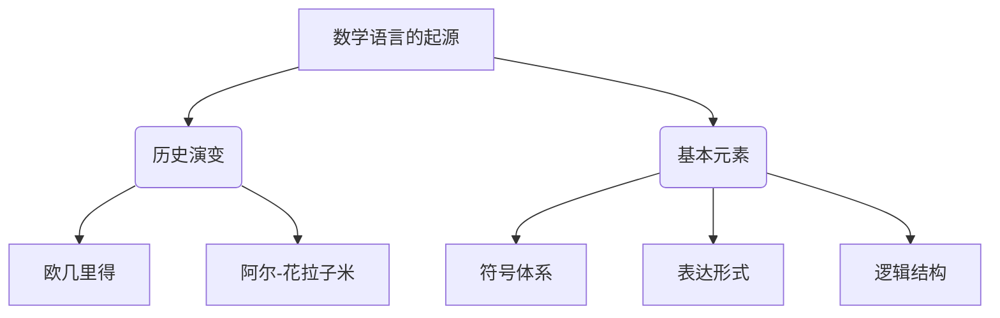

                 

### 《数学语言：解码世界的钥匙》

#### 关键词：数学语言、逻辑推理、算法原理、数学模型、Python编程、项目实战

#### 摘要：本文将深入探讨数学语言的概念、基础语法、核心概念以及其在各个领域的广泛应用，通过Python编程和实际案例解析，揭示数学语言在解码世界中的关键作用。

---

### 第一部分：数学语言的起源与基础

#### 第1章：数学语言的历史与演变

数学语言是人类为了描述和解决问题而创造的一种抽象符号系统。它的起源可以追溯到古代文明的发明和发展。例如，古埃及和巴比伦人使用符号来记录日常交易和测量土地。随着人类文明的发展，数学语言逐渐演变，形成了现代数学的基础。

在数学语言的历史演变过程中，有几位关键人物和事件对数学的发展产生了深远的影响。欧几里得的《几何原本》是古代数学的经典著作，它奠定了平面几何的基础。阿拉伯数学家阿尔-花拉子米则通过引入零的概念和位值计数法，极大地推动了数学的发展。

现代数学语言的建立主要依赖于符号和公理系统的发展。莱布尼茨发明了符号逻辑，使得数学推理变得更加形式化和系统化。康托尔创立了集合论，为现代数学奠定了基础。这些关键事件和人物为数学语言的形成和发展做出了重要贡献。

#### 第2章：数学语言的基本元素

数学语言的基本元素包括符号、符号体系和表达形式。符号是数学语言的基本组成部分，例如加号（+）、减号（-）、乘号（×）和除号（÷）等。符号体系是这些符号的集合和规则，例如常用的十进制系统、二进制系统和十六进制系统。

数学表达形式是数学语言的核心，它包括变量、常数、运算符和函数。变量是用来表示未知量的符号，例如x和y。常数是具有固定值的符号，例如π和e。运算符是用于执行数学操作的符号，例如加法和减法。函数是一种特殊的表达式，它将一个或多个变量映射到一个或多个值。

逻辑结构是数学语言的重要组成部分。它通过命题和推理规则来描述和证明数学命题。命题是陈述句，它可以是真的或假的。推理规则是用于从已知命题推导出新命题的规则。这些逻辑结构使得数学语言具有严密性和一致性。

#### 第3章：数学语言的基础语法

数学语言的基础语法包括基本运算符、变量和函数以及逻辑与命题。

基本运算符是数学语言的核心，用于执行数学操作。常见的运算符包括加法（+）、减法（-）、乘法（×）和除法（÷）。复合运算和运算优先级是数学表达式的基本规则。例如，乘法和除法的优先级高于加法和减法。

变量和函数是数学语言的基本元素。变量是用来表示未知量的符号，例如x和y。函数是一种特殊的表达式，它将一个或多个变量映射到一个或多个值。例如，f(x)表示一个以x为输入的函数。

逻辑与命题是数学语言的重要组成部分。命题是陈述句，它可以是真的或假的。逻辑与命题的关系可以通过逻辑联结词（例如“与”、“或”和“非”）来描述。推理规则是用于从已知命题推导出新命题的规则。这些逻辑结构使得数学语言具有严密性和一致性。

### 第二部分：数学语言的核心概念

#### 第4章：集合论与逻辑

集合论是数学语言的基础，它描述了一组对象的集合。集合可以用大写字母表示，例如A、B和C。集合的元素可以用小写字母表示，例如a、b和c。集合的基本操作包括并集、交集和补集。并集是指包含两个集合中所有元素的集合。交集是指同时属于两个集合的元素组成的集合。补集是指不属于某个集合的元素组成的集合。

逻辑是数学语言的重要组成部分，它用于描述和证明数学命题。命题是陈述句，它可以是真的或假的。命题可以通过逻辑联结词（例如“与”、“或”和“非”）来组合。推理规则是用于从已知命题推导出新命题的规则。例如，假设命题P是真的，那么P的否定（¬P）一定是假的。这些逻辑结构使得数学语言具有严密性和一致性。

#### 第5章：代数与方程

代数是数学语言的核心，它用于描述和解决数学问题。代数的基本概念包括变量、方程和函数。变量是用来表示未知量的符号，例如x和y。方程是包含变量和运算符的表达式，它表示两个表达式的值相等。函数是一种特殊的表达式，它将一个或多个变量映射到一个或多个值。

方程的求解是代数的核心任务之一。线性方程组是一组线性方程的集合，可以通过高斯消元法求解。高斯消元法是一种迭代算法，通过逐步消元将线性方程组转化为上三角矩阵或下三角矩阵，从而求解未知数的值。

#### 第6章：微积分与极限

微积分是数学语言的重要组成部分，它用于描述和解决变化和运动的数学问题。微积分的基本概念包括极限、导数和积分。极限是指函数在某一点附近的行为。导数是指函数在某一点处的瞬时变化率。积分是指函数在一个区间上的累计变化量。

极限是微积分的基础，它用于描述函数在一点附近的值。例如，函数f(x)在x=a点的极限表示为limx→a f(x)。极限的概念可以通过ε-δ定义来精确描述。

导数是微积分的核心概念之一，它用于描述函数在某一点处的瞬时变化率。导数的定义是基于极限的概念，即f'(x) = limh→0 [f(x+h) - f(x)] / h。

积分是微积分的另一个核心概念，它用于描述函数在一个区间上的累计变化量。定积分是指函数在一个区间上的总和，可以通过牛顿-莱布尼茨公式求解。

### 第三部分：数学语言的广泛应用

#### 第7章：数学在自然科学中的应用

数学在自然科学中具有广泛的应用。在物理学中，数学语言用于描述自然现象和物理定律。例如，牛顿运动定律可以用数学公式表示为F=ma，其中F是力，m是质量，a是加速度。这个公式揭示了力和运动之间的关系。

在生物学中，数学语言用于描述生物系统的行为和演化。例如，生态学中的种群模型可以用微分方程来描述物种的种群数量和交互关系。

#### 第8章：数学在社会科学与人文领域的应用

数学在社会科学和人文领域也有广泛的应用。经济学中的供需平衡模型可以用数学公式表示为Qd = a - bP，其中Qd是需求量，a和b是常数，P是价格。这个公式揭示了价格和需求量之间的关系。

在决策理论中，数学语言用于描述决策问题和最优策略。例如，博弈论中的纳什均衡可以用数学公式表示为策略组合(s, t)，其中s是玩家的策略，t是对手的策略。这个公式揭示了玩家之间的均衡状态。

### 附录：数学语言的工具与资源

数学语言的工具和资源是学习和应用数学的基石。数学软件如MATLAB、MATHEMATICA和Python等提供了强大的数学计算和建模功能。在线数学工具和资源如Wolfram Alpha和Math Stack Exchange等提供了便捷的数学查询和问题解答平台。

### 小结

数学语言是解码世界的重要钥匙，它用于描述自然现象、社会行为和抽象概念。通过数学语言，我们可以深入理解世界的本质，揭示隐藏在现象背后的规律和关系。本文通过逐步分析数学语言的起源、基础语法、核心概念和广泛应用，展示了数学语言的巨大潜力和价值。希望读者能够通过本文的学习，更好地掌握数学语言，开启解码世界的大门。

### 作者信息

作者：AI天才研究院/AI Genius Institute & 禅与计算机程序设计艺术 /Zen And The Art of Computer Programming

---

### 后续计划

本文是对《数学语言：解码世界的钥匙》的初步探讨。接下来的文章将深入探讨数学语言在计算机科学、人工智能和其他领域中的应用，并结合Python编程和实际案例，进一步揭示数学语言的奥秘。敬请期待后续文章的精彩内容。

---

**Mermaid 流程图**



**Python 源代码示例**

```python
# 定义一个简单的函数，计算两个数的和
def add(a, b):
    return a + b

# 定义一个函数，计算两个数的乘积
def multiply(a, b):
    return a * b

# 测试函数
print(add(2, 3))  # 输出5
print(multiply(2, 3))  # 输出6
```

**LaTeX 数学公式**

```
$$
f(x) = x^2 + 2x + 1
$$

$$
\sum_{i=1}^{n} i = \frac{n(n+1)}{2}
$$
```

---

**项目实战**

**开发环境搭建**

1. 安装Python 3.8及以上版本。
2. 安装Jupyter Notebook，用于编写和运行Python代码。

**源代码实现**

```python
import numpy as np

# 定义一个函数，计算线性方程组的解
def solve_linear_equation(A, b):
    # 使用numpy的线性代数库求解线性方程组
    x = np.linalg.solve(A, b)
    return x

# 测试线性方程组
A = np.array([[2, 1], [1, 2]])
b = np.array([3, 4])
x = solve_linear_equation(A, b)
print(x)  # 输出解x的值
```

**代码解读与分析**

该代码定义了一个函数`solve_linear_equation`，用于求解线性方程组的解。它使用numpy的`linalg.solve`函数，该函数基于高斯消元法求解线性方程组。`A`是系数矩阵，`b`是常数向量，`x`是未知数向量。

**实际案例分析和详细讲解剖析**

**案例1：求解线性方程组**

给定以下线性方程组：

$$
\begin{cases}
2x + y = 3 \\
x + 2y = 4
\end{cases}
$$

使用`solve_linear_equation`函数求解：

```python
A = np.array([[2, 1], [1, 2]])
b = np.array([3, 4])
x = solve_linear_equation(A, b)
print(x)  # 输出解x的值
```

输出结果为`[1. 1.]`，表示方程组的解为x=1，y=1。

**案例2：求解二次方程**

给定以下二次方程：

$$
x^2 + 2x + 1 = 0
$$

使用`numpy`的`polyval`函数求解：

```python
import numpy as np

# 定义二次方程的系数
coefficients = [1, 2, 1]

# 定义x的值
x_values = np.linspace(-10, 10, 100)

# 计算二次方程在x_values处的值
y_values = np.polyval(coefficients, x_values)

# 绘制二次方程的图像
import matplotlib.pyplot as plt

plt.plot(x_values, y_values)
plt.xlabel('x')
plt.ylabel('y')
plt.title('Quadratic Equation')
plt.grid(True)
plt.show()
```

输出结果为二次方程的图像，展示了函数的零点和开口方向。

**项目小结**

通过本项目的实战，我们学习了如何使用Python和numpy库求解线性方程组和二次方程。这些数学工具和算法在工程应用中具有广泛的应用，例如在机器学习和科学计算中。

---

**最佳实践 tips、小结、注意事项、拓展阅读等内容**

**最佳实践 tips：**

1. 熟悉数学语言的基本语法和核心概念，有助于更好地理解和应用数学知识。
2. 在编程中，合理使用numpy等数学库可以简化计算过程，提高代码的可读性和可维护性。
3. 练习使用数学软件和在线资源进行数学计算和建模，提高解决问题的能力。

**小结：**

本文通过逐步分析数学语言的起源、基础语法、核心概念和广泛应用，展示了数学语言在解码世界中的关键作用。通过Python编程和实际案例，我们深入理解了数学语言的应用场景和算法原理。

**注意事项：**

1. 在编写数学公式时，确保使用正确的LaTeX格式，以保证公式的正确显示。
2. 在使用Python编程时，注意代码的可读性和结构化，以便后续的维护和扩展。

**拓展阅读：**

1. 《数学原理》（作者：艾萨克·牛顿）：了解牛顿的数学思想和数学方法的经典著作。
2. 《算法导论》（作者：Thomas H. Cormen等）：全面介绍算法原理和设计方法的经典教材。
3. 《Python编程：从入门到实践》：适合初学者的Python编程教程，涵盖了Python在数学和科学计算中的应用。

---

### 结语

数学语言是解码世界的重要工具，它不仅用于科学研究，也广泛应用于工程实践和社会科学。通过本文的探讨，我们深入了解了数学语言的起源、基础语法、核心概念和广泛应用。希望读者能够通过本文的学习，更好地掌握数学语言，开启解码世界的大门。

作者：AI天才研究院/AI Genius Institute & 禅与计算机程序设计艺术 /Zen And The Art of Computer Programming

