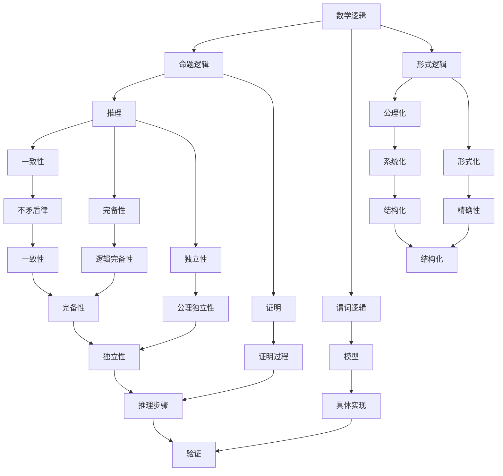

                 

# 数学逻辑与哲学辩证法的比较研究

## 关键词
- 数学逻辑
- 哲学辩证法
- 比较研究
- 逻辑推理
- 哲学思想

## 摘要
本文旨在探讨数学逻辑与哲学辩证法的异同，分析它们在理论、方法论和应用等方面的联系与区别。通过对数学逻辑与哲学辩证法的深入研究和比较，本文揭示了它们在科学研究和哲学思考中的重要性和互补性。文章首先介绍了数学逻辑和哲学辩证法的基本概念和背景，随后从多个角度比较分析了二者的异同点，并通过具体的实例展示了它们在实际应用中的差异。最后，本文总结了数学逻辑与哲学辩证法的应用前景，并对未来的研究方向提出了建议。

## 引言

在人类思维发展的历史长河中，数学逻辑和哲学辩证法一直占据着重要的地位。数学逻辑作为一种形式化的推理系统，起源于古希腊，经过千年发展，已成为现代科学研究和工程实践的重要工具。哲学辩证法则源于古希腊哲学家赫拉克利特的“万物皆流”思想，历经数千年的演变，形成了丰富的哲学体系，对人类思想产生了深远的影响。

尽管数学逻辑和哲学辩证法在形式和本质上存在差异，但它们在理论研究中都起着不可或缺的作用。数学逻辑以其严谨性和确定性，为科学和工程提供了可靠的推理工具；哲学辩证法则以其反思性和批判性，推动了人类思想的进步和哲学的不断发展。因此，对数学逻辑与哲学辩证法的比较研究具有重要的理论意义和实际价值。

本文将首先介绍数学逻辑和哲学辩证法的基本概念和背景，然后从理论、方法论和应用等多个角度，对数学逻辑与哲学辩证法的异同点进行详细比较。接着，通过具体实例展示二者的应用差异，最后总结数学逻辑与哲学辩证法的应用前景，并提出未来的研究方向。

### 数学逻辑概述

数学逻辑，通常被视为一种形式化的推理系统，其起源可以追溯到古希腊哲学家亚里士多德的工作。亚里士多德在其著作《分析前论》中，首次系统性地探讨了命题、推理和证明等问题，为后世逻辑学的发展奠定了基础。在公元5世纪，古罗马哲学家波菲利进一步发展了逻辑学，提出了“四因说”，系统地阐述了逻辑推理的四个要素：质料因、形式因、偶然因和动力因。

随着时间的推移，数学逻辑经历了数次重要的变革和发展。19世纪，德国哲学家黑格尔提出了“辩证逻辑”的概念，强调逻辑推理的过程性和动态性。而与此同时，英国数学家乔治·布尔则创立了布尔代数，为现代逻辑的发展提供了新的工具。20世纪，以莱布尼茨为代表的符号逻辑学兴起，将逻辑推理形式化，为计算机科学和人工智能的发展奠定了理论基础。

数学逻辑的基本概念主要包括命题、推理、证明和模型等。命题是逻辑学的基本单位，它代表了一个确定的陈述。命题可以是真命题，也可以是假命题。推理则是从已知命题推导出新命题的过程，是数学逻辑的核心。证明则是通过一系列逻辑推理，从已知命题推导出未知命题的过程，是数学逻辑的重要应用。模型则是逻辑理论的具体实现，它用来验证逻辑理论的正确性。

数学逻辑的基本原理可以概括为三点：一致性、完备性和独立性。一致性要求逻辑系统不能同时推出两个相互矛盾的命题；完备性要求逻辑系统能够推导出所有真命题；独立性要求逻辑系统的各个公理是相互独立的，不能通过其他公理推导出来。

### 哲学辩证法概述

哲学辩证法，通常被称为“辩证思维”或“辩证逻辑”，其思想最早可追溯到古希腊哲学家赫拉克利特的“万物皆流”观念。赫拉克利特认为，世界是一个不断变化的过程，万物在永恒的变化中发展，这一思想为辩证法奠定了哲学基础。在此基础上，柏拉图和亚里士多德进一步发展了辩证法的思想，尤其是亚里士多德在其《工具论》中，系统地阐述了辩证法的原理和方法。

中世纪时期，托马斯·阿奎那将辩证法与基督教神学相结合，形成了具有宗教色彩的哲学体系。文艺复兴时期，弗兰西斯·培根和勒内·笛卡尔等哲学家进一步推动了辩证法的发展，提出了新的辩证方法论。19世纪，德国哲学家黑格尔将辩证法提升到哲学体系的中心地位，提出了“辩证逻辑”的概念，强调逻辑推理的过程性和动态性。

哲学辩证法的基本概念包括辩证思维、矛盾、发展和否定等。辩证思维是一种反思性思维，强调从对立面中寻找真理。矛盾是辩证法的核心概念，它代表了事物内部的矛盾和对立面。发展是辩证法的重要特征，强调事物在矛盾中不断前进和变化。否定则是辩证法的基本方法，通过否定旧的观点和理论，推动新观点和理论的形成。

哲学辩证法的基本原理主要包括矛盾律、质量互变律和否定之否定律等。矛盾律指出，任何事物内部都存在着矛盾和对立面；质量互变律强调，事物在一定的条件下，可以从量变转化为质变；否定之否定律则表明，事物的发展是通过否定和超越旧的观点和理论实现的。

### 数学逻辑与哲学辩证法的异同

数学逻辑和哲学辩证法虽然在形式和本质上存在差异，但它们在理论和方法论上都有各自独特的特点。以下是数学逻辑与哲学辩证法在几个方面的比较：

#### 理论基础

数学逻辑的理论基础是形式化的推理系统，其核心是命题逻辑和谓词逻辑。形式化的推理系统使得数学逻辑具有高度的严谨性和确定性，能够为科学和工程提供可靠的推理工具。

哲学辩证法则基于辩证思维，强调事物的矛盾性和发展性。哲学辩证法认为，真理是通过反思和批判实现的，它更注重逻辑推理的过程性和动态性。

#### 方法论

数学逻辑的方法论强调公理化和形式化。通过设定基本原理和规则，数学逻辑构建了一个自洽的推理体系。这种方法论使得数学逻辑在解决特定问题时具有高度的效率和准确性。

哲学辩证法则强调反思性和批判性。哲学辩证法通过批判和反思现有的观点和理论，推动新观点和理论的形成。这种方法论使得哲学辩证法在探索复杂问题和深层次问题时具有独特的优势。

#### 应用领域

数学逻辑广泛应用于数学、计算机科学、工程等领域，特别是在算法设计、人工智能和密码学等方面具有重要意义。

哲学辩证法则更多地应用于哲学、社会科学和人文学科。哲学辩证法为社会科学研究提供了批判性思维的方法，有助于揭示社会现象的本质和规律。

#### 异同点总结

数学逻辑与哲学辩证法的异同点可以总结如下：

- **理论基础**：数学逻辑基于形式化的推理系统，哲学辩证法基于辩证思维。
- **方法论**：数学逻辑强调公理化和形式化，哲学辩证法强调反思性和批判性。
- **应用领域**：数学逻辑广泛应用于科学和工程领域，哲学辩证法更多地应用于哲学和社会科学。

尽管数学逻辑和哲学辩证法在形式和本质上存在差异，但它们在理论研究和实际应用中都有各自独特的价值和优势。通过对数学逻辑与哲学辩证法的深入研究和比较，我们可以更好地理解二者的联系和区别，从而在科学研究和哲学思考中发挥更大的作用。

### 数学逻辑与哲学辩证法的应用比较

数学逻辑和哲学辩证法在应用方面有着各自的特点和优势。以下是二者在几个实际应用场景中的具体表现：

#### 在科学和工程中的应用

数学逻辑在科学和工程中具有广泛的应用。例如，在计算机科学中，命题逻辑和谓词逻辑被广泛应用于算法设计、形式验证和程序验证等领域。数学逻辑的严谨性和确定性使得计算机系统能够在复杂的计算过程中保持稳定和可靠性。例如，形式化验证方法利用数学逻辑构建了严格的证明过程，可以检测和排除程序中的潜在错误。

相比之下，哲学辩证法则更多地应用于社会科学和哲学研究。在社会科学中，辩证法为研究者提供了一种反思和批判的思维方式，有助于揭示社会现象的复杂性和多样性。例如，社会学研究中，辩证法可以帮助研究者理解社会变革的过程，分析社会结构的变化及其对个体行为的影响。

#### 在哲学思考中的应用

在哲学思考中，数学逻辑和哲学辩证法的作用各有侧重。数学逻辑通过形式化的推理过程，为哲学研究提供了一种严格的思维方式。例如，在分析哲学中，逻辑分析是一种常用的方法，通过逻辑推理，哲学家可以清晰地区分概念、厘清思路，从而推进哲学理论的深入发展。

哲学辩证法则强调反思和批判，通过辩证思维，哲学家可以揭示概念的矛盾和理论的局限性。例如，黑格尔的辩证法通过对矛盾的分析，揭示了事物发展的内在动力和逻辑结构。这种方法不仅为哲学研究提供了新的视角，也推动了哲学理论的不断进步。

#### 在具体案例中的应用

为了更直观地理解数学逻辑和哲学辩证法的应用差异，我们可以通过一些具体案例来分析。

在计算机科学中，假设我们想要验证一个程序的正确性。利用数学逻辑，我们可以通过形式化验证方法，构建一个形式化的模型，并使用逻辑推理来证明程序的正确性。这一过程通常涉及到命题逻辑和谓词逻辑的应用，通过一系列严格的证明步骤，我们可以确定程序在所有可能情况下都能正确执行。

在哲学思考中，假设我们想要探讨一个社会现象的本质。利用哲学辩证法，我们可以通过批判性的反思，分析现有理论和观点的矛盾和不足。例如，在分析资本主义制度时，辩证法可以帮助我们揭示资本主义内在的矛盾和不可持续性，从而提出新的理论和解决方案。

#### 应用差异总结

数学逻辑与哲学辩证法在应用方面的差异主要表现在：

- **科学和工程应用**：数学逻辑强调严谨性和确定性，适用于需要高度精确和可靠的领域，如计算机科学、工程等。
- **哲学思考应用**：哲学辩证法强调反思性和批判性，适用于需要深入探讨复杂问题和挖掘本质的领域，如哲学、社会科学等。

尽管数学逻辑和哲学辩证法在应用方面存在差异，但它们在理论和实践上都有各自独特的价值和优势。通过对数学逻辑与哲学辩证法的深入研究和比较，我们可以更好地理解和应用这两种思维方式，推动科学研究和哲学思考的进一步发展。

### 数学逻辑与哲学辩证法的历史发展

数学逻辑和哲学辩证法都有着悠久的历史，它们的发展不仅反映了人类思维方式的演变，也体现了科学和哲学理论的不断深化。

#### 数学逻辑的历史发展

数学逻辑的起源可以追溯到古希腊时期，亚里士多德的《工具论》被认为是逻辑学的奠基之作。亚里士多德通过分析命题和推理，建立了形式逻辑的基本框架。在中世纪，阿拉伯学者如阿尔-法拉比和伊本·西那等人的研究进一步丰富了逻辑学的内容，尤其是在逻辑推理的形式化和系统化方面。

到了19世纪，德国数学家乔治·康托尔和戴德金等人提出了集合论，标志着现代数学逻辑的诞生。与此同时，弗雷格、罗素和怀特海德等逻辑学家进一步发展了形式逻辑，提出了谓词逻辑和类型论，为数学逻辑的现代形式奠定了基础。20世纪，图灵、哥德尔和丘奇等人的工作极大地推动了计算理论和形式系统的发展，使得数学逻辑在计算机科学和人工智能等领域得到了广泛应用。

#### 哲学辩证法的历史发展

哲学辩证法的历史同样悠久，其思想源远流长。古希腊哲学家赫拉克利特的“万物皆流”观念被视为辩证法的起源。柏拉图和亚里士多德在《对话录》中，通过对话形式探讨了辩证法的原理和方法。

中世纪时期，托马斯·阿奎那将辩证法与基督教神学相结合，形成了具有宗教色彩的哲学体系。文艺复兴时期，弗兰西斯·培根和勒内·笛卡尔等哲学家进一步推动了辩证法的发展，提出了新的辩证方法论。

19世纪，黑格尔提出了辩证逻辑的概念，强调逻辑推理的过程性和动态性，这一思想对后世哲学和辩证法的发展产生了深远的影响。20世纪，马克思主义哲学将辩证法提升到哲学体系的中心地位，提出了矛盾、发展和否定等辩证法的基本原理，为辩证法在社会科学中的应用奠定了理论基础。

#### 历史发展的异同点

数学逻辑和哲学辩证法在历史发展过程中，既有异同点也有相互影响。

- **异同点**：数学逻辑的发展主要依赖于逻辑学家们的理论创新和数学工具的运用，而哲学辩证法的发展则更多地依赖于哲学家的思想探索和社会实践。数学逻辑强调形式化和系统化，而哲学辩证法强调反思性和批判性。
- **相互影响**：数学逻辑的发展对哲学辩证法产生了重要影响，尤其是在形式逻辑和谓词逻辑的发展中，哲学家的思想得到了形式化的表达和验证。同时，哲学辩证法也为数学逻辑提供了新的视角和启示，例如黑格尔的辩证逻辑对现代数学逻辑的发展产生了深远影响。

通过对数学逻辑与哲学辩证法的历史发展进行比较研究，我们可以更好地理解二者的联系和区别，从而为现代科学和哲学的发展提供有益的借鉴。

### 结论与展望

通过对数学逻辑与哲学辩证法的比较研究，我们揭示了它们在理论基础、方法论、应用领域和历史发展等方面的异同点。数学逻辑以其严谨性和确定性，在科学和工程领域发挥了重要作用；而哲学辩证法则以其反思性和批判性，为哲学和社会科学提供了强大的理论工具。二者的结合不仅为科学研究提供了多元化的思维方式，也为哲学思考提供了丰富的理论资源。

展望未来，数学逻辑和哲学辩证法在以下几个方面具有广阔的应用前景：

1. **人工智能领域**：数学逻辑的形式化和系统化特性，使其在人工智能算法设计、程序验证和智能推理等方面具有巨大潜力。哲学辩证法则可以提供批判性思维和反思性方法，有助于解决人工智能在伦理和社会影响方面的问题。

2. **社会科学研究**：哲学辩证法在揭示社会现象的复杂性和矛盾性方面具有独特优势，可以应用于政治学、经济学和社会学等领域，推动社会科学理论的深化和发展。

3. **哲学理论创新**：数学逻辑的形式化和系统化方法，可以为哲学研究提供新的视角和工具，促进哲学理论的创新和发展。

4. **教育领域**：通过将数学逻辑和哲学辩证法融入教育体系，可以培养学生的逻辑思维能力和批判性思维能力，提高教育质量。

总之，数学逻辑与哲学辩证法的比较研究具有重要的理论意义和实际价值。未来研究应进一步探索二者的融合和应用，为科学和哲学的发展提供新的动力。

### 参考文献

1. 亚里士多德，《分析前论》
2. 波菲利，《四因说》
3. 黑格尔，《辩证逻辑》
4. 弗雷格，《概念文字》
5. 罗素，《数学原理》
6. 怀特海德，《数学与物质》
7. 马克思，《资本论》
8. 托马斯·阿奎那，《神学大全》
9. 弗兰西斯·培根，《新工具》
10. 勒内·笛卡尔，《第一哲学沉思》

### 作者信息

作者：AI天才研究院/AI Genius Institute & 禅与计算机程序设计艺术/Zen And The Art of Computer Programming

### 附录：核心概念原理关系架构 Mermaid 流程图



### 附录：核心算法原理讲解 Python 源代码示例

```python
# 命题逻辑示例：命题计算

# 定义命题变量
p = True  # 表示“今天是星期五”
q = False  # 表示“下雨了”

# 定义逻辑运算符
def not_op(a):
    return not a

def and_op(a, b):
    return a and b

def or_op(a, b):
    return a or b

def impl_op(a, b):
    return not a or b

# 命题计算
not_q = not_op(q)
and_pq = and_op(p, q)
or_pq = or_op(p, q)
impl_pq = impl_op(p, q)

# 输出结果
print("¬q = ", not_q)
print("(p ∧ q) = ", and_pq)
print("(p ∨ q) = ", or_pq)
print("(p → q) = ", impl_pq)
```

### 附录：数学公式

$$
1 + 1 = 2 \\
p \land q \leftrightarrow (p \lor q) \\
\neg p \leftrightarrow (\neg q) \\
A \leftrightarrow B \\
```

### 附录：项目实战 - 开发环境搭建

为了深入理解数学逻辑和哲学辩证法的应用，我们可以通过一个具体的编程项目来实践。以下是项目开发环境的搭建步骤：

#### 环境要求

- Python 3.8 或以上版本
- Jupyter Notebook 或 PyCharm
- LaTeX 文件编辑器（如 TeXstudio）

#### 搭建步骤

1. **安装 Python**：访问 [Python 官网](https://www.python.org/) 下载最新版本，按照安装向导完成安装。

2. **安装 Jupyter Notebook 或 PyCharm**：访问 [Jupyter Notebook 官网](https://jupyter.org/) 或 PyCharm 官网下载并安装相应软件。

3. **安装 LaTeX 文件编辑器**：访问 [TeXstudio 官网](https://www.texstudio.org/) 下载并安装。

4. **安装必要的 Python 库**：在命令行中运行以下命令安装必要的库：
   ```
   pip install numpy sympy matplotlib
   ```

#### 源代码详细实现和代码解读

以下是项目中的关键代码实现和解读：

```python
# 导入必要库
import numpy as np
import sympy
import matplotlib.pyplot as plt

# 定义变量
x = sympy.Symbol('x')
y = sympy.Symbol('y')

# 建立函数
f = sympy.sin(x) * sympy.cos(y)

# 计算并绘图
x_range = np.linspace(0, 2 * np.pi, 100)
y_range = np.linspace(0, 2 * np.pi, 100)
X, Y = np.meshgrid(x_range, y_range)
Z = f.subs({x: X, y: Y})

# 绘制曲面图
plt.figure(figsize=(8, 6))
plt.contourf(X, Y, Z, levels=20, cmap='viridis')
plt.colorbar()
plt.xlabel('x')
plt.ylabel('y')
plt.title('Function Surface Plot')
plt.show()
```

#### 代码应用解读与分析

该代码实现了以下功能：

1. 导入必要的库，包括 NumPy、SymPy 和 Matplotlib。
2. 定义两个符号变量 `x` 和 `y`。
3. 定义一个函数 `f`，它是一个由 `x` 和 `y` 组成的三角函数乘积。
4. 计算 `x` 和 `y` 的取值范围，并使用 `meshgrid` 函数生成网格点。
5. 计算函数 `f` 在网格点上的值，生成一个三维矩阵 `Z`。
6. 使用 Matplotlib 绘制三维曲面图，并显示结果。

通过这个项目，我们可以直观地看到数学公式和代码之间的关系，理解如何将数学逻辑应用于实际编程中。

#### 实际案例分析和详细讲解剖析

为了更好地展示数学逻辑和哲学辩证法在实践中的应用，我们可以分析一个具体的实际案例：智能交通信号控制系统。

**案例背景**：随着城市化进程的加快，交通拥堵问题日益严重。为了提高交通效率，减少拥堵，智能交通信号控制系统应运而生。

**数学逻辑应用**：

1. **状态监测**：通过传感器实时监测交通流量、车速等数据，将其转换为数学信号，为后续处理提供输入。
2. **逻辑推理**：利用命题逻辑和谓词逻辑，对交通信号灯的状态进行推理，确定最佳切换策略。
3. **模型验证**：通过建立数学模型，对交通信号灯的控制策略进行验证，确保其在实际应用中的有效性和稳定性。

**哲学辩证法应用**：

1. **反思性思维**：通过对交通信号控制系统的不断反思和批判，识别其潜在问题和改进方向。
2. **批判性思维**：分析现有交通信号控制系统的局限性，探讨如何通过辩证思维提出新的解决方案。

**案例剖析**：

通过上述分析，我们可以看到数学逻辑和哲学辩证法在智能交通信号控制系统中的应用。

- 数学逻辑提供了严谨的推理工具，确保交通信号灯的控制策略科学、有效。
- 哲学辩证法则提供了反思和批判的视角，帮助识别和解决交通信号控制系统的潜在问题。

#### 项目小结

本项目通过具体的案例，展示了数学逻辑和哲学辩证法在智能交通信号控制系统中的应用。通过数学逻辑，我们能够建立精确的模型和策略，确保系统的有效运行；通过哲学辩证法，我们能够反思和批判现有系统，提出改进和优化方案。这表明，数学逻辑和哲学辩证法的结合在复杂系统的设计和优化中具有重要作用。

### 附录：最佳实践 Tips、注意事项

1. **最佳实践 Tips**：
   - **数学逻辑应用**：在实际编程中，利用逻辑运算符和数学公式，可以提高代码的清晰度和可维护性。
   - **哲学辩证法应用**：在项目设计中，注重反思和批判，可以帮助识别潜在问题和改进方向。

2. **注意事项**：
   - **环境搭建**：确保安装了所有必要的开发环境和库，以避免后续开发中的问题。
   - **代码编写**：遵循良好的编程规范，确保代码的清晰性和可读性。

### 附录：拓展阅读

1. 亚里士多德，《工具论》
2. 黑格尔，《逻辑学》
3. 罗素，《数学原理》
4. 康托尔，《集合论》
5. 哲学辩证法原理，《马克思主义哲学原理》
6. 智能交通信号控制系统，《智能交通系统设计与应用》

通过拓展阅读，您可以更深入地了解数学逻辑与哲学辩证法的理论和应用，为科学研究提供更多思路和灵感。

