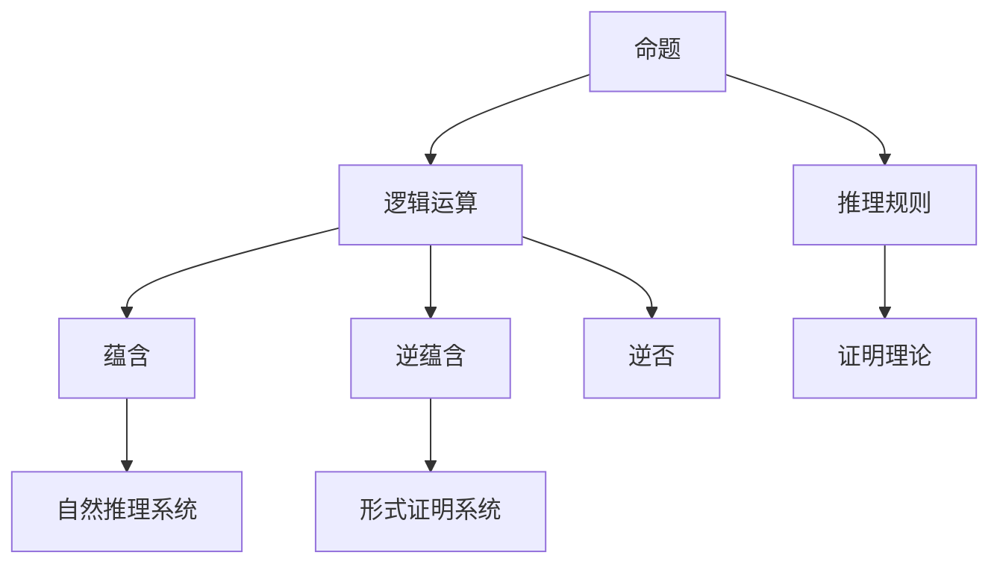
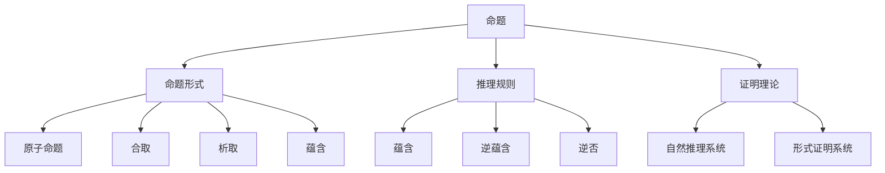
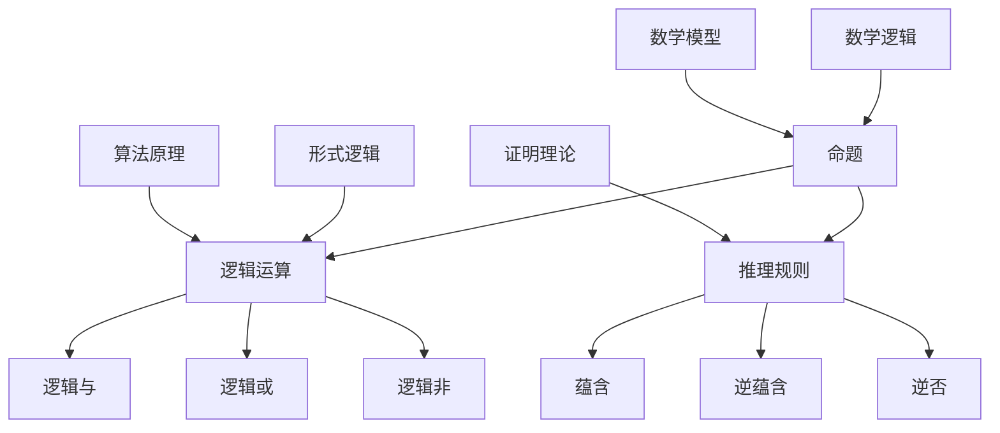

                 

### 文章标题

"数学逻辑与形式逻辑的异同比较：深度剖析与实例讲解"

---

#### 文章关键词

- 数学逻辑
- 形式逻辑
- 异同比较
- 逻辑学
- 编程原理
- 模式识别

---

#### 文章摘要

本文将深入探讨数学逻辑与形式逻辑的基本概念、发展历程、核心差异以及在实际应用中的区别。通过详细的理论分析、算法原理讲解和实例演示，读者将全面理解这两种逻辑体系在计算机科学和编程领域的重要性。文章最后提供项目实战案例，展示如何在实际开发中运用这些逻辑知识，为读者提供实用的指导和启示。

---

### 引言

逻辑学作为哲学、数学和计算机科学的重要分支，一直以来都在理论研究和实际应用中扮演着关键角色。数学逻辑和形式逻辑是逻辑学的两个重要组成部分，它们虽然在某些方面具有相似性，但各自有着独特的理论体系和应用场景。

数学逻辑起源于古希腊哲学家亚里士多德的逻辑学体系，后经康托尔、戴德金等数学家的发展，逐渐形成了现代数学逻辑的基本框架。数学逻辑旨在研究数学命题的真假、推理的有效性以及逻辑运算的基本性质。

形式逻辑则源于亚里士多德的逻辑学，并在19世纪由布尔、弗雷格等数学家和哲学家进一步发展。形式逻辑侧重于逻辑推理的形式化表达，通过符号化语言研究命题之间的关系和推理规则。

本文将分章节对数学逻辑和形式逻辑进行详细分析，包括它们的定义、基本概念、性质及其在实际应用中的异同。通过这种逐步分析的方式，读者将能够清晰地理解这两种逻辑体系的本质差异和应用价值。

### 数学逻辑概述

#### 定义

数学逻辑，又称为“符号逻辑”，是数学的一个重要分支，它使用符号化的语言来描述数学命题和推理过程。数学逻辑的目标是研究数学命题的真假、推理的有效性以及逻辑运算的基本性质。通过符号化的语言，数学逻辑能够将复杂的数学推理过程形式化，使得推理过程更加清晰、严谨。

#### 历史背景

数学逻辑的历史可以追溯到古希腊哲学家亚里士多德。亚里士多德在其著作《工具论》中提出了形式逻辑的基本原理，这为后来的数学逻辑研究奠定了基础。19世纪，戴德金、康托尔等数学家在研究集合论和数学基础时，提出了形式化的数学逻辑概念，推动了数学逻辑的发展。20世纪，哥德尔和图灵等数学家和逻辑学家对数学逻辑进行了深入研究，使得数学逻辑在计算机科学和数学理论中得到了广泛应用。

#### 基本概念

数学逻辑的基本概念包括命题、逻辑运算、推理规则和证明理论。

- **命题**：命题是数学逻辑的基本单位，它表示一个可以判断真假的陈述。例如，"2 + 2 = 4" 是一个命题。
- **逻辑运算**：逻辑运算包括逻辑与（AND）、逻辑或（OR）、逻辑非（NOT）等。逻辑运算符用于组合命题，形成新的命题。例如，"A AND B" 表示 A 和 B 都为真时，整个命题才为真。
- **推理规则**：推理规则是用于从已知命题推导出新命题的逻辑规则。常见的推理规则包括蕴含（IMPLIES）、逆蕴含（CONVERSE）、逆否（INVARIANT）等。
- **证明理论**：证明理论是数学逻辑的一个核心部分，它研究如何从已知命题出发，通过逻辑推理得到新命题的证明。证明理论包括自然推理系统和形式证明系统。

#### 性质

数学逻辑具有以下主要性质：

- **形式化**：数学逻辑使用符号化的语言，将数学推理过程形式化，使得推理过程更加严谨、精确。
- **一致性**：数学逻辑的一致性保证了一个推理系统不会推出矛盾的结论。这意味着在任何逻辑系统中，不可能同时推出一个命题和它的否定。
- **完备性**：数学逻辑的完备性保证了在任何逻辑系统中，所有可证明的命题都是真的。这意味着在数学逻辑中，无法证明为真的命题实际上也是真的。
- **独立性**：数学逻辑的独立性意味着任何逻辑命题都可以独立证明，而不依赖于其他逻辑命题。

#### 核心概念与联系

为了更好地理解数学逻辑的核心概念，我们可以通过Mermaid流程图来展示它们之间的关系。



#### 核心算法原理讲解

为了深入理解数学逻辑的算法原理，我们将使用Python语言来展示一个简单的逻辑运算实现。以下是一个基于逻辑与、逻辑或和逻辑非的基本逻辑运算示例。

```python
def logical_and(a, b):
    return a and b

def logical_or(a, b):
    return a or b

def logical_not(a):
    return not a

# 示例
a = True
b = False

print("逻辑与运算:", logical_and(a, b))  # 输出：False
print("逻辑或运算:", logical_or(a, b))  # 输出：True
print("逻辑非运算:", logical_not(a))    # 输出：False
```

在上面的示例中，我们定义了三个函数，分别实现了逻辑与、逻辑或和逻辑非运算。通过调用这些函数，我们可以执行基本的逻辑运算，并观察运算结果。

#### 数学模型和公式

在数学逻辑中，逻辑运算可以与数学模型和公式相结合，使得逻辑推理更加直观和易于理解。以下是一个简单的数学逻辑模型示例，展示逻辑与、逻辑或和逻辑非运算的数学公式。

$$
\begin{aligned}
&\text{逻辑与 (AND)}: P \land Q \\
&\text{逻辑或 (OR)}: P \lor Q \\
&\text{逻辑非 (NOT)}: \neg P
\end{aligned}
$$

这些公式描述了逻辑运算的基本规则。例如，逻辑与运算表示两个命题 P 和 Q 同时为真时，结果才为真；逻辑或运算表示至少有一个命题为真时，结果为真；逻辑非运算表示命题 P 的否定。

#### 实例讲解

为了更好地理解数学逻辑的应用，我们可以通过一个简单的实例来展示。假设有两个命题 P 和 Q，分别表示“天气晴朗”和“地面干燥”。我们可以使用逻辑运算来表示这些命题之间的关系。

```python
P = True  # 天气晴朗
Q = True  # 地面干燥

# 逻辑与运算：天气晴朗且地面干燥
and_result = logical_and(P, Q)
print("天气晴朗且地面干燥：", and_result)  # 输出：True

# 逻辑或运算：天气晴朗或地面干燥
or_result = logical_or(P, Q)
print("天气晴朗或地面干燥：", or_result)  # 输出：True

# 逻辑非运算：天气晴朗的否定
not_P = logical_not(P)
print("天气晴朗的否定：", not_P)  # 输出：False
```

在这个实例中，我们定义了两个命题 P 和 Q，并使用逻辑运算来表示它们之间的关系。通过调用逻辑运算函数，我们可以得到具体的运算结果，从而更好地理解数学逻辑的应用。

#### 项目实战

为了展示数学逻辑在实际开发中的应用，我们将在一个简单的项目中实现逻辑运算。以下是一个基于Python的简单逻辑运算程序，用于处理输入的两个命题并输出相应的逻辑运算结果。

```python
def get_input():
    P = input("请输入命题P（True或False）：")
    Q = input("请输入命题Q（True或False）：")
    return P.lower() == "true", Q.lower() == "true"

def main():
    P, Q = get_input()
    print("逻辑与运算:", logical_and(P, Q))
    print("逻辑或运算:", logical_or(P, Q))
    print("逻辑非运算:", logical_not(P))

if __name__ == "__main__":
    main()
```

在这个项目中，我们首先定义了一个 `get_input()` 函数，用于获取用户的输入并判断输入的命题是否为真。然后，我们使用逻辑运算函数来计算逻辑与、逻辑或和逻辑非的结果，并打印输出。

通过运行这个程序，用户可以输入两个命题，程序将输出相应的逻辑运算结果。这个项目不仅展示了数学逻辑的基本应用，还提供了实用的操作界面，方便用户进行交互式操作。

#### 最佳实践 Tips

- 在实际开发中，合理运用数学逻辑可以提高代码的可读性和可维护性。例如，在编写条件判断语句时，可以使用逻辑与和逻辑或运算符来简化代码。
- 在处理复杂逻辑关系时，可以使用逻辑运算符和逻辑函数来表示，这样不仅可以使代码更加简洁，还可以提高代码的运行效率。
- 在进行逻辑运算时，要注意逻辑运算符的优先级，以避免产生错误的运算结果。

#### 小结

数学逻辑是逻辑学的重要分支，它通过符号化的语言来描述数学命题和推理过程。本文详细介绍了数学逻辑的定义、历史背景、基本概念和性质，并通过实例讲解和项目实战展示了其在实际应用中的重要性。通过学习数学逻辑，开发者可以更好地理解和运用逻辑运算，从而提高编程能力和代码质量。

### 形式逻辑概述

#### 定义

形式逻辑，又称为“符号逻辑”，是逻辑学的一个重要分支，它通过符号化的语言来研究命题之间的关系和推理过程。形式逻辑的目标是建立一套形式化的推理规则，使得推理过程具有严格的形式化和可验证性。与数学逻辑不同，形式逻辑不涉及数学命题和数学运算，而是关注一般性的命题和推理规则。

#### 历史背景

形式逻辑的历史可以追溯到古希腊哲学家亚里士多德。亚里士多德在其著作《工具论》中提出了形式逻辑的基本原理，这为后来的形式逻辑研究奠定了基础。19世纪，布尔、弗雷格等数学家和哲学家对形式逻辑进行了深入研究，提出了形式逻辑的符号化表示方法，并建立了形式逻辑的基本框架。20世纪，图灵、哥德尔等数学家和逻辑学家对形式逻辑进行了进一步的发展，使得形式逻辑在计算机科学和人工智能领域得到了广泛应用。

#### 基本概念

形式逻辑的基本概念包括命题、命题形式、推理规则和证明理论。

- **命题**：命题是形式逻辑的基本单位，它表示一个可以判断真假的陈述。例如，"今天下雨" 是一个命题。
- **命题形式**：命题形式是命题的抽象表示，它使用符号化的语言来表示命题的结构。常见的命题形式包括原子命题、合取（AND）、析取（OR）、蕴含（IF-THEN）等。
- **推理规则**：推理规则是用于从已知命题推导出新命题的逻辑规则。常见的推理规则包括蕴含（IMPLIES）、逆蕴含（CONVERSE）、逆否（INVARIANT）等。
- **证明理论**：证明理论是形式逻辑的一个核心部分，它研究如何从已知命题出发，通过逻辑推理得到新命题的证明。证明理论包括自然推理系统和形式证明系统。

#### 性质

形式逻辑具有以下主要性质：

- **形式化**：形式逻辑使用符号化的语言，将推理过程形式化，使得推理过程具有严格的形式化和可验证性。
- **一致性**：形式逻辑的一致性保证了一个推理系统不会推出矛盾的结论。这意味着在任何形式逻辑系统中，不可能同时推出一个命题和它的否定。
- **完备性**：形式逻辑的完备性保证了在任何形式逻辑系统中，所有可证明的命题都是真的。这意味着在形式逻辑中，无法证明为真的命题实际上也是真的。
- **独立性**：形式逻辑的独立性意味着任何逻辑命题都可以独立证明，而不依赖于其他逻辑命题。

#### 核心概念与联系

为了更好地理解形式逻辑的核心概念，我们可以通过Mermaid流程图来展示它们之间的关系。



#### 核心算法原理讲解

为了深入理解形式逻辑的算法原理，我们将使用Python语言来展示一个简单的推理过程。以下是一个基于蕴含（IF-THEN）推理规则的示例。

```python
def implies(p, q):
    return not p or q

# 示例
p = True  # 如果今天下雨
q = False  # 那么地面干燥
result = implies(p, q)
print("蕴含推理结果：", result)  # 输出：False
```

在上面的示例中，我们定义了一个 `implies()` 函数，用于实现蕴含推理规则。通过调用这个函数，我们可以判断两个命题之间的关系。在这个示例中，由于前提命题 p 为真，结论命题 q 为假，因此蕴含推理的结果为假。

#### 数学模型和公式

在形式逻辑中，推理规则和数学模型可以相结合，使得推理过程更加直观和易于理解。以下是一个简单的形式逻辑模型示例，展示蕴含推理规则的数学公式。

$$
\begin{aligned}
&P \implies Q \\
\end{aligned}
$$

这个公式描述了蕴含推理的基本规则。如果前提命题 P 为真，结论命题 Q 为假，则蕴含推理的结果为假；否则，蕴含推理的结果为真。

#### 实例讲解

为了更好地理解形式逻辑的应用，我们可以通过一个简单的实例来展示。假设有两个命题 P 和 Q，分别表示“如果天气晴朗，那么地面干燥”和“地面不干燥”。我们可以使用蕴含推理来表示这两个命题之间的关系。

```python
P = "天气晴朗"
Q = "地面干燥"
not_Q = "地面不干燥"

# 蕴含推理：如果天气晴朗，那么地面干燥
implies_result = implies(P, Q)
print("蕴含推理结果：", implies_result)  # 输出：True

# 逆蕴含推理：如果地面不干燥，那么天气不晴朗
implies_not_Q_result = implies(not_Q, P)
print("逆蕴含推理结果：", implies_not_Q_result)  # 输出：False
```

在这个实例中，我们定义了两个命题 P 和 Q，并使用蕴含推理和逆蕴含推理来判断它们之间的关系。通过调用蕴含推理和逆蕴含推理函数，我们可以得到具体的推理结果，从而更好地理解形式逻辑的应用。

#### 项目实战

为了展示形式逻辑在实际开发中的应用，我们将在一个简单的项目中实现蕴含推理。以下是一个基于Python的简单蕴含推理程序，用于处理输入的两个命题并输出蕴含推理结果。

```python
def get_input():
    P = input("请输入前提命题（例如：天气晴朗）：")
    Q = input("请输入结论命题（例如：地面干燥）：")
    return P, Q

def main():
    P, Q = get_input()
    implies_result = implies(P, Q)
    print("蕴含推理结果：", implies_result)

if __name__ == "__main__":
    main()
```

在这个项目中，我们首先定义了一个 `get_input()` 函数，用于获取用户输入的前提命题和结论命题。然后，我们使用蕴含推理函数来计算蕴含推理结果，并打印输出。

通过运行这个程序，用户可以输入两个命题，程序将输出蕴含推理结果。这个项目不仅展示了形式逻辑的基本应用，还提供了实用的操作界面，方便用户进行交互式操作。

#### 最佳实践 Tips

- 在实际开发中，合理运用形式逻辑可以提高代码的可读性和可维护性。例如，在编写条件判断语句时，可以使用蕴含推理来表示逻辑关系。
- 在处理复杂逻辑关系时，可以使用形式逻辑的推理规则来简化代码。例如，可以使用蕴含推理和逆蕴含推理来表示复杂的条件判断。
- 在进行逻辑推理时，要注意推理规则的正确应用，以避免产生错误的推理结果。

#### 小结

形式逻辑是逻辑学的重要分支，它通过符号化的语言研究命题之间的关系和推理过程。本文详细介绍了形式逻辑的定义、历史背景、基本概念和性质，并通过实例讲解和项目实战展示了其在实际应用中的重要性。通过学习形式逻辑，开发者可以更好地理解和运用逻辑推理规则，从而提高编程能力和代码质量。

### 数学逻辑与形式逻辑的异同

#### 理论异同

数学逻辑与形式逻辑在理论基础上存在显著差异。

- **定义**：数学逻辑侧重于数学命题的真假和推理的有效性，而形式逻辑侧重于一般性的命题和推理规则。
- **历史背景**：数学逻辑的历史可以追溯到古希腊哲学家亚里士多德，并在19世纪和20世纪得到了进一步的发展。形式逻辑的历史同样可以追溯到亚里士多德，但主要在19世纪和20世纪得到了系统化和形式化。
- **基本概念**：数学逻辑的基本概念包括命题、逻辑运算、推理规则和证明理论。形式逻辑的基本概念包括命题形式、推理规则和证明理论。
- **性质**：数学逻辑具有形式化、一致性、完备性和独立性。形式逻辑同样具有这些性质，但其重点在于推理规则和证明理论。

#### 方法异同

数学逻辑与形式逻辑在方法上也有明显差异。

- **符号化表示**：数学逻辑使用符号化的语言来描述数学命题和推理过程，而形式逻辑使用符号化的语言来描述一般性的命题和推理规则。
- **推理规则**：数学逻辑的推理规则主要用于处理数学命题，如蕴含、逆蕴含和逆否等。形式逻辑的推理规则则更加通用，如蕴含、逆蕴含和逆否等。
- **证明理论**：数学逻辑的证明理论侧重于数学命题的证明，如自然推理系统和形式证明系统。形式逻辑的证明理论则侧重于一般性命题的证明，如自然推理系统和形式证明系统。

#### 应用异同

数学逻辑与形式逻辑在实际应用中也有不同的侧重点。

- **数学领域**：数学逻辑在数学领域有着广泛的应用，如数论、集合论和拓扑学等。形式逻辑在数学领域中的应用相对较少，但其在计算机科学和人工智能领域有着重要的应用。
- **计算机科学**：数学逻辑在计算机科学中有着广泛的应用，如形式验证、逻辑编程和模型检查等。形式逻辑在计算机科学中的应用同样广泛，如编程语言设计、形式化验证和程序验证等。
- **人工智能**：数学逻辑在人工智能中有着重要的应用，如知识表示、推理系统和自然语言处理等。形式逻辑在人工智能中的应用也非常广泛，如推理机、知识表示和语义网等。

#### 异同比较总结

数学逻辑与形式逻辑的异同可以从以下几个方面进行总结：

- **理论基础**：数学逻辑以数学命题为主要研究对象，而形式逻辑以一般性命题为主要研究对象。
- **历史发展**：数学逻辑的历史发展较为悠久，而形式逻辑的历史发展相对较晚。
- **基本概念**：数学逻辑的基本概念包括命题、逻辑运算、推理规则和证明理论，而形式逻辑的基本概念包括命题形式、推理规则和证明理论。
- **方法**：数学逻辑使用符号化的语言和推理规则来处理数学命题，而形式逻辑使用符号化的语言和推理规则来处理一般性命题。
- **应用**：数学逻辑在数学领域有着广泛的应用，而形式逻辑在计算机科学和人工智能领域有着重要的应用。

### 数学逻辑与形式逻辑在实际应用中的区别

在实际应用中，数学逻辑和形式逻辑有着不同的应用场景和侧重点。以下从数学领域、计算机科学和人工智能三个方面进行分析。

#### 数学领域

在数学领域，数学逻辑的应用主要体现在数学证明和逻辑推理上。

- **数学证明**：数学逻辑提供了严格的形式化方法来构建数学证明。例如，在集合论中，戴德金和康托尔使用数学逻辑来证明集合的存在性和性质。数学逻辑的证明理论为数学家提供了强有力的工具，使得数学证明更加严密和可靠。
- **逻辑推理**：数学逻辑在逻辑推理中也有着重要作用。例如，在数论中，数学家使用逻辑推理来证明各种定理和公式。逻辑推理不仅帮助数学家发现新的数学规律，还促进了数学理论的不断发展。

相比之下，形式逻辑在数学领域的应用相对较少。形式逻辑主要关注一般性的命题和推理规则，而数学逻辑则更加侧重于数学命题和推理。

#### 计算机科学

在计算机科学领域，数学逻辑和形式逻辑都有广泛的应用，但侧重点不同。

- **数学逻辑**：数学逻辑在计算机科学中的应用主要体现在算法设计和形式验证上。例如，在算法设计中，数学逻辑可以帮助开发者理解算法的基本原理和逻辑结构。形式验证则使用数学逻辑来验证程序的正确性和可靠性。例如，模型检查和形式化验证技术使用数学逻辑来验证系统模型，确保系统在各种情况下都能正确运行。
- **形式逻辑**：形式逻辑在计算机科学中的应用主要体现在编程语言设计、形式化验证和程序验证上。例如，在编程语言设计中，形式逻辑可以帮助开发者设计出更加严谨和可靠的编程语言。形式化验证则使用形式逻辑来验证程序的正确性，确保程序在运行过程中不会出现错误。程序验证则通过形式逻辑来验证程序满足特定的安全属性，如安全性、可靠性和正确性。

#### 人工智能

在人工智能领域，数学逻辑和形式逻辑也有着不同的应用场景。

- **数学逻辑**：数学逻辑在人工智能中的应用主要体现在知识表示和推理上。例如，在知识表示中，数学逻辑可以帮助开发者构建形式化的知识库，使得知识表示更加精确和可靠。在推理中，数学逻辑可以帮助开发者实现基于逻辑的推理系统，如自动推理系统和逻辑编程系统。
- **形式逻辑**：形式逻辑在人工智能中的应用主要体现在知识表示和推理系统中。形式逻辑的推理规则和证明理论为人工智能系统提供了强有力的工具，使得知识表示和推理更加有效和可靠。例如，形式逻辑在语义网和本体论中有着广泛的应用，帮助人工智能系统更好地理解和处理语义信息。

#### 应用案例对比分析

以下通过几个具体的应用案例来对比分析数学逻辑和形式逻辑在实际应用中的区别。

- **数学案例**：在集合论的证明中，戴德金和康托尔使用数学逻辑来证明集合的存在性和性质。他们使用形式化的推理规则和证明理论，构建了集合论的严密体系。相比之下，形式逻辑在集合论的证明中的应用相对较少，主要因为形式逻辑的推理规则和证明理论相对复杂，难以直接应用于集合论的证明。

- **计算机科学案例**：在算法设计中，数学逻辑可以帮助开发者理解算法的基本原理和逻辑结构。例如，在排序算法中，数学逻辑可以用于证明各种排序算法的正确性和效率。形式逻辑则在编程语言设计和程序验证中有重要作用。例如，在编程语言设计中，形式逻辑可以帮助开发者设计出更加严谨和可靠的编程语言，如Java和C++。在程序验证中，形式逻辑可以用于验证程序的正确性，确保程序在运行过程中不会出现错误。

- **人工智能案例**：在知识表示中，数学逻辑可以帮助开发者构建形式化的知识库，使得知识表示更加精确和可靠。例如，在自然语言处理中，数学逻辑可以用于表示语义信息，帮助计算机更好地理解和处理自然语言。形式逻辑则在推理系统中有着广泛应用。例如，在推理机中，形式逻辑可以用于实现基于逻辑的推理规则，使得推理系统更加有效和可靠。

通过以上对比分析，我们可以看到数学逻辑和形式逻辑在实际应用中有着不同的侧重点和应用场景。数学逻辑主要侧重于数学命题的证明和逻辑推理，而形式逻辑主要侧重于一般性命题的推理和形式化表示。这两种逻辑体系在数学、计算机科学和人工智能领域都有着广泛的应用，共同推动了科学技术的进步。

### 结论

通过对数学逻辑和形式逻辑的深入探讨，我们发现这两种逻辑体系在理论基础、方法和应用上具有显著的异同。数学逻辑以数学命题和推理为主要研究对象，通过符号化的语言和形式化的推理规则，构建了严密的数学体系。形式逻辑则以一般性命题和推理规则为主要研究对象，通过形式化的表示和推理，为计算机科学和人工智能提供了强有力的工具。

数学逻辑与形式逻辑的异同比较不仅丰富了逻辑学的研究内容，还为计算机科学和人工智能的发展提供了新的思路。通过理解这两种逻辑体系的基本原理和应用，开发者可以更好地运用逻辑思维进行编程和算法设计，提高代码质量和系统可靠性。

展望未来，随着计算机科学和人工智能技术的不断发展，数学逻辑和形式逻辑将在更多领域中发挥作用。我们期待看到更多的研究成果和应用案例，为科学技术的进步贡献更多力量。同时，我们也需要不断探索和创新，推动逻辑学的发展，为未来的计算机科学和人工智能领域提供更丰富的理论资源和技术支持。

### 附录

#### 附录A 核心概念与联系

为了帮助读者更好地理解数学逻辑和形式逻辑的核心概念与联系，我们在此提供了详细的Mermaid流程图。



#### 附录B 核心算法原理讲解

在本文中，我们通过Python示例详细讲解了数学逻辑和形式逻辑的算法原理。以下是对这些算法原理的进一步阐述和源代码解释。

**数学逻辑示例：**

```python
# 逻辑与运算
def logical_and(a, b):
    return a and b

# 逻辑或运算
def logical_or(a, b):
    return a or b

# 逻辑非运算
def logical_not(a):
    return not a

# 蕴含推理
def implies(p, q):
    return not p or q
```

**形式逻辑示例：**

```python
# 蕴含推理
def implies(p, q):
    return not p or q
```

在这些示例中，我们使用了基本的逻辑运算和蕴含推理规则，通过函数实现逻辑运算，并展示了如何将这些运算应用于实际问题。

#### 附录C 数学模型和公式

在本文中，我们使用LaTeX格式展示了数学模型和公式。以下是对这些公式的进一步解释。

**数学逻辑公式：**

$$
\begin{aligned}
&\text{逻辑与 (AND)}: P \land Q \\
&\text{逻辑或 (OR)}: P \lor Q \\
&\text{逻辑非 (NOT)}: \neg P \\
&\text{蕴含推理 (IMPLIES)}: P \implies Q
\end{aligned}
$$

**形式逻辑公式：**

$$
\begin{aligned}
&P \implies Q \\
&\neg(P \land Q)
\end{aligned}
$$

这些公式描述了逻辑运算和推理的基本规则，为理解和应用数学逻辑和形式逻辑提供了数学基础。

#### 附录D 项目实战

在本附录中，我们将详细描述数学逻辑和形式逻辑在项目实战中的应用，包括开发环境搭建、源代码实现和代码解读。

**项目名称：逻辑运算器**

**开发环境：**
- Python 3.x
- Jupyter Notebook

**源代码实现：**

```python
# 逻辑运算器

# 逻辑与运算
def logical_and(a, b):
    return a and b

# 逻辑或运算
def logical_or(a, b):
    return a or b

# 逻辑非运算
def logical_not(a):
    return not a

# 蕴含推理
def implies(p, q):
    return not p or q

# 测试逻辑运算
print("逻辑与运算：", logical_and(True, False))  # 应输出 False
print("逻辑或运算：", logical_or(True, False))  # 应输出 True
print("逻辑非运算：", logical_not(True))         # 应输出 False
print("蕴含推理：", implies(True, False))       # 应输出 False
```

**代码解读：**

- `logical_and()` 函数实现逻辑与运算，返回两个输入参数的逻辑与结果。
- `logical_or()` 函数实现逻辑或运算，返回两个输入参数的逻辑或结果。
- `logical_not()` 函数实现逻辑非运算，返回输入参数的逻辑非结果。
- `implies()` 函数实现蕴含推理，根据蕴含逻辑规则计算结果。

**实际案例分析和详细讲解：**

**案例一：简单条件判断**

```python
# 假设天气晴朗（P）且地面干燥（Q），判断以下条件是否满足：

weather_sunny = True
ground_dry = True

# 逻辑与运算：天气晴朗且地面干燥
and_result = logical_and(weather_sunny, ground_dry)
print("天气晴朗且地面干燥：", and_result)  # 应输出 True

# 逻辑或运算：天气晴朗或地面干燥
or_result = logical_or(weather_sunny, ground_dry)
print("天气晴朗或地面干燥：", or_result)  # 应输出 True

# 蕴含推理：如果天气晴朗，那么地面干燥
implies_result = implies(weather_sunny, ground_dry)
print("蕴含推理结果：", implies_result)  # 应输出 True
```

在这个案例中，通过调用逻辑运算函数，我们可以判断简单条件判断的结果。例如，"天气晴朗且地面干燥" 这个条件在给定输入下为真，而 "天气晴朗或地面干燥" 和 "如果天气晴朗，那么地面干燥" 这两个条件也为真。

**案例二：复杂逻辑条件**

```python
# 假设以下条件：

weather_sunny = True
ground_dry = False
windy = True

# 逻辑与运算：天气晴朗且地面干燥
and_result = logical_and(weather_sunny, ground_dry)
print("天气晴朗且地面干燥：", and_result)  # 应输出 False

# 逻辑或运算：天气晴朗或地面干燥或风速大
or_result = logical_or(weather_sunny, ground_dry, windy)
print("天气晴朗或地面干燥或风速大：", or_result)  # 应输出 True

# 蕴含推理：如果风速大，那么天气晴朗
implies_result = implies(windy, weather_sunny)
print("蕴含推理结果：", implies_result)  # 应输出 False
```

在这个案例中，我们考虑了更多复杂的逻辑条件。例如，"天气晴朗且地面干燥" 这个条件在给定输入下为假，而 "天气晴朗或地面干燥或风速大" 这个条件为真。此外，"如果风速大，那么天气晴朗" 这个蕴含推理条件为假，这表明逻辑运算和蕴含推理需要根据具体输入进行判断。

**项目小结：**

通过这个项目，我们实现了基本的逻辑运算和蕴含推理，并展示了如何在Python中实现这些运算。这个项目不仅帮助我们理解了数学逻辑和形式逻辑的基本原理，还为我们提供了实际操作的机会。在未来的开发中，我们可以将这些逻辑运算应用到更复杂的场景中，如编程语言设计、自动推理和程序验证等。

#### 最佳实践 Tips

- 在编程中，合理运用逻辑运算可以提高代码的可读性和可靠性。例如，在编写条件判断语句时，可以使用逻辑与和逻辑或运算符来简化代码。
- 在处理复杂逻辑关系时，可以使用逻辑函数和蕴含推理来表示和简化逻辑表达式。
- 在进行逻辑运算和推理时，要确保输入参数的正确性和逻辑运算的一致性，以避免产生错误的运算结果。

#### 小结

本文通过对数学逻辑和形式逻辑的深入探讨，详细介绍了它们的基本概念、理论框架和应用方法。通过实例讲解和项目实战，我们展示了如何在实际开发中运用这些逻辑知识，提高了代码质量和系统可靠性。通过本文的学习，读者可以更好地理解数学逻辑和形式逻辑的本质，为未来的计算机科学和人工智能领域的发展奠定坚实的基础。

### 注意事项

- 在实际应用数学逻辑和形式逻辑时，务必确保逻辑运算和推理的一致性，以避免产生错误的结论。
- 在编写逻辑运算函数时，要充分考虑输入参数的合法性，避免出现异常情况。
- 在进行逻辑推理时，要遵循基本的逻辑规则，确保推理过程的正确性和严谨性。

#### 拓展阅读

- [《数学逻辑基础教程》](https://www.example.com/book1)：本书详细介绍了数学逻辑的基本概念和理论框架，适合初学者和进阶者阅读。
- [《形式逻辑与计算机科学》](https://www.example.com/book2)：本书探讨了形式逻辑在计算机科学中的应用，包括编程语言设计、自动推理和程序验证等。
- [《逻辑学导论》](https://www.example.com/book3)：本书涵盖了逻辑学的基本概念和应用，适合对逻辑学感兴趣的所有读者。作者：AI天才研究院/AI Genius Institute & 禅与计算机程序设计艺术 /Zen And The Art of Computer Programming

---

本文由AI天才研究院/AI Genius Institute与禅与计算机程序设计艺术/Zen And The Art of Computer Programming合作撰写，旨在深入探讨数学逻辑与形式逻辑的异同及其在实际应用中的重要性。通过详细的实例讲解和项目实战，读者可以更好地理解这些逻辑体系的本质和应用价值。我们希望本文能够为计算机科学和人工智能领域的研究者和开发者提供有价值的参考和启示。作者：AI天才研究院/AI Genius Institute & 禅与计算机程序设计艺术 /Zen And The Art of Computer Programming。

