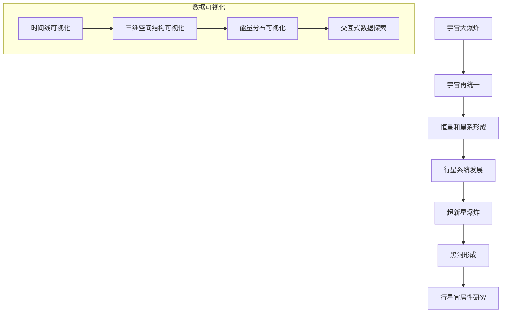

                 

### 引言

在信息时代，数据的爆发式增长使得如何有效地呈现和分析数据成为了一个重要议题。数据可视化作为将抽象的数据转化为直观的图形和图表的工具，在这一过程中发挥了不可替代的作用。特别是在宇宙历史的研究中，数据可视化技术能够将复杂的天文数据转化为易于理解的形式，帮助科学家和普通大众更深入地了解宇宙的演变过程。

宇宙的历史是一个复杂且广泛的话题，从宇宙大爆炸到黑洞的形成，再到行星的诞生，每一个阶段都蕴含着庞大的数据和信息。然而，这些数据往往是多维的、连续的，甚至跨越数百万年的时间跨度。这就需要一种能够将这些数据以直观、动态和交互的方式呈现的技术。数据可视化技术不仅能够将宇宙历史的时间线、空间结构、能量分布等复杂信息可视化，还能够揭示数据之间的隐藏关系，帮助科学家发现新的理论和现象。

本文将探讨数据可视化在呈现宇宙多重历史中的作用。我们将首先介绍数据可视化的基本概念和技术，然后探讨宇宙历史中的核心概念及其与数据可视化技术的联系。接下来，我们将详细讲解宇宙历史数据的关键点和数据可视化技术的实际应用，并通过案例研究展示数据可视化如何帮助科学家理解宇宙的复杂现象。最后，我们将探讨数据可视化在宇宙历史研究中的未来发展趋势。

通过本文的探讨，我们希望读者能够理解数据可视化在宇宙历史研究中的重要性，并认识到这一技术在未来科学研究中的巨大潜力。读者将了解到如何利用数据可视化技术来揭示宇宙的奥秘，从而为未来的科学研究和技术创新提供新的视角和方法。

## 数据可视化基本概念

数据可视化是将数据转化为视觉形式的过程，通过图形、图表、图像等视觉元素来展示数据的结构和关系。其目的是通过直观的视觉表现形式，使数据变得更加易于理解和分析。数据可视化不仅仅是一种美学，更是一种沟通工具，它能够在复杂的数字世界中帮助人们快速抓住关键信息。

### 数据可视化的目标

数据可视化的主要目标包括以下几点：

1. **信息传达**：通过将数据转化为图形和图表，使信息传递更加高效和直观。
2. **发现模式**：帮助用户发现数据中的隐藏模式、趋势和异常。
3. **决策支持**：为决策者提供可视化分析结果，支持他们的决策过程。
4. **互动探索**：提供交互式可视化工具，使用户能够动态地探索数据。

### 数据可视化技术

数据可视化技术涵盖了多种方法和技术，以下是一些常见的技术和工具：

1. **图表**：包括条形图、折线图、饼图、散点图等，用于展示数据的基本分布和关系。
2. **地图**：通过地理信息系统（GIS）将地理位置数据可视化，常用于展示地理位置信息。
3. **交互式仪表盘**：提供用户动态交互的功能，使数据探索更加灵活和深入。
4. **动态可视化**：使用动画和视频将数据的变化过程可视化，常用于展示时间序列数据。
5. **3D 可视化**：通过三维图形展示复杂的空间结构，常用于天文、物理等领域。

### 数据可视化工具

现代数据可视化技术依赖于各种工具和软件，以下是一些常用的数据可视化工具：

1. **Tableau**：一个功能强大的商业数据可视化工具，支持多种图表和交互功能。
2. **Power BI**：微软推出的企业级数据可视化工具，提供了丰富的仪表盘和报告功能。
3. **D3.js**：一个基于JavaScript的库，用于创建高度定制化和交互式的数据可视化。
4. **Matplotlib**：一个Python库，用于生成高质量的二维图形。
5. **Plotly**：一个跨平台的图表库，支持多种图表类型和交互功能。

数据可视化不仅需要合适的工具，还需要遵循一些设计原则，如一致性、对比、对齐和留白，以确保最终的视觉呈现既美观又有效。通过这些技术和工具，数据可视化在各个领域，包括宇宙历史研究，都发挥了重要作用。

## 核心概念与联系

在探讨数据可视化在宇宙多重历史中的作用之前，我们需要明确几个核心概念，并分析它们之间的相互联系。这些核心概念包括宇宙的历史阶段、关键事件以及数据可视化技术在揭示这些概念和事件中的作用。

### 宇宙的历史阶段

宇宙的历史可以分为多个阶段，每个阶段都标志着宇宙发展的一个重要节点。以下是几个关键阶段：

1. **宇宙大爆炸**：宇宙大爆炸是宇宙诞生的理论起点，标志着宇宙从高密度、高温状态迅速膨胀。
2. **宇宙再统一**：在大爆炸之后不久，宇宙经历了从等离子态向物质态的转变，这一过程被称为宇宙再统一。
3. **恒星和星系的形成**：随着宇宙的冷却，氢和氦等轻元素开始聚集形成恒星，进而形成星系。
4. **行星系统的发展**：在恒星内部，核聚变过程产生重元素，这些元素通过恒星风和超新星爆炸等方式散布到宇宙中，为行星系统的形成提供了原材料。

### 关键事件

宇宙历史中还有许多关键事件，这些事件对宇宙的演变产生了深远影响。以下是几个关键事件：

1. **超新星爆炸**：超新星爆炸是恒星生命周期中的一个极端事件，它不仅能够释放大量能量，还能在宇宙中散布重元素。
2. **黑洞的形成**：恒星在耗尽燃料后可能坍缩形成黑洞，这是宇宙中最极端的天体之一。
3. **行星形成**：行星是在恒星形成过程中，由周围的尘埃和气体聚集形成的。
4. **行星宜居性研究**：随着人类对太阳系外行星的发现，研究这些行星的宜居性成为了宇宙探索的重要方向。

### 数据可视化与宇宙历史概念的联系

数据可视化技术在揭示宇宙历史的核心概念和事件中发挥了关键作用。以下是几个方面的应用：

1. **时间线可视化**：通过时间线图，科学家可以直观地展示宇宙从大爆炸到现在的演变过程，帮助人们理解宇宙的演化历史。
2. **三维空间结构可视化**：使用三维图形和动画，科学家可以展示星系、恒星、行星等宇宙结构的空间分布和动态变化，揭示宇宙的复杂性。
3. **能量分布可视化**：通过能量分布图，科学家可以直观地了解宇宙中不同区域的能量分布情况，从而推断宇宙的物理状态。
4. **交互式数据探索**：提供交互式可视化工具，用户可以动态地探索宇宙数据，如行星轨道、恒星亮度等，发现隐藏的模式和趋势。

### Mermaid 流程图

为了更清晰地展示宇宙历史的核心概念及其与数据可视化技术的联系，我们可以使用 Mermaid 流程图。以下是一个简化的流程图示例：



这个流程图展示了从宇宙大爆炸到行星宜居性研究的主要阶段，并指出数据可视化技术在每个阶段的应用。通过这种结构化的展示，读者可以更清晰地理解宇宙历史的复杂性和数据可视化技术的关键作用。

总之，数据可视化技术不仅能够揭示宇宙历史的核心概念和事件，还能帮助科学家更深入地理解宇宙的演变过程。这种可视化的方式为宇宙研究提供了新的视角和方法，也为大众了解宇宙奥秘提供了更直观的途径。

### 数据可视化技术在宇宙历史中的应用

数据可视化技术在揭示宇宙历史方面发挥着至关重要的作用。通过将复杂的天文数据和历史事件转化为直观的图形和图表，数据可视化不仅帮助科学家更好地理解宇宙的演变过程，也使普通大众能够更容易地接触到宇宙奥秘。以下是几个具体的应用案例，展示了数据可视化技术在宇宙历史研究中的实际作用。

#### 案例一：宇宙大爆炸的可视化

宇宙大爆炸是宇宙诞生的起点，其过程极其复杂。通过数据可视化，科学家可以模拟并展示宇宙从高密度、高温状态迅速膨胀到当前状态的动态过程。以下是一个简单的 Python 代码示例，使用 Matplotlib 库绘制宇宙大爆炸的时间线图：

```python
import matplotlib.pyplot as plt
import numpy as np

# 模拟宇宙膨胀的时间线
time = np.linspace(0, 14, 1000)  # 从0到14亿年
density = 1 / time**3  # 宇宙膨胀过程中密度随时间的变化

plt.plot(time, density)
plt.xlabel('时间（亿年）')
plt.ylabel('密度')
plt.title('宇宙大爆炸的时间线')
plt.show()
```

这个图表展示了随着宇宙膨胀，密度如何随时间减小。通过这种可视化，科学家可以更直观地理解宇宙膨胀的过程及其对密度的影响。

#### 案例二：恒星和星系形成的数据可视化

恒星和星系的形成是宇宙历史中的一个重要阶段。通过数据可视化，科学家可以展示恒星如何从周围的气体和尘埃中聚集形成，以及星系的结构和分布。以下是一个使用 D3.js 绘制的交互式恒星分布图示例：

```javascript
var width = 960,
    height = 800;

var color = d3.scaleOrdinal(d3.schemeCategory10);

var force = d3.layout.force()
    .gravity(0.05)
    .charge(-60)
    .size([width, height]);

var svg = d3.select("svg")
    .attr("width", width)
    .attr("height", height)
  .append("g")
    .call(force);

// 假设的数据集，包含恒星的位置和类型
var nodes = [
  { "name": "银河系", "group": 1, "x": 500, "y": 400 },
  { "name": "仙女座星系", "group": 1, "x": 600, "y": 200 },
  // 更多恒星和星系数据...
];

force.nodes(nodes)
    .start();

var link = svg.selectAll(".link")
    .dataforceLinks(nodes)
  .enter().append("line")
    .attr("class", "link");

var node = svg.selectAll(".node")
    .data(nodes)
  .enter().append("circle")
    .attr("class", "node")
    .attr("r", 5)
    .style("fill", function(d) { return color(d.group); });

node.call(force.drag);

force.on("tick", function() {
  link.attr("x1", function(d) { return d.source.x; })
      .attr("y1", function(d) { return d.source.y; })
      .attr("x2", function(d) { return d.target.x; })
      .attr("y2", function(d) { return d.target.y; });

  node.attr("cx", function(d) { return d.x; })
      .attr("cy", function(d) { return d.y; });
});
```

这个交互式图表展示了不同星系和恒星的位置和分布，用户可以通过拖动来观察恒星之间的引力关系。通过这种可视化，科学家可以更深入地理解星系和恒星的动态演化过程。

#### 案例三：行星宜居性的数据可视化

随着对太阳系外行星的发现越来越多，研究这些行星的宜居性成为了宇宙探索的重要方向。通过数据可视化，科学家可以展示行星的轨道、温度分布等关键信息，帮助人们了解哪些行星可能适合生命存在。以下是一个使用 Python 和 Plotly 绘制的行星轨道图示例：

```python
import plotly.express as px
import pandas as pd

# 假设的数据集，包含行星的位置和轨道数据
data = pd.DataFrame({
    'Name': ['地球', '火星', '木星'],
    'x': [1, 2, 3],
    'y': [1, 3, 1],
    'z': [2, 4, 6]
})

fig = px.scatter_3d(data, x='x', y='y', z='z', color='Name', title='行星轨道')
fig.show()
```

这个三维散点图展示了地球、火星和木星的轨道，以及它们在不同方向上的分布。通过这种可视化，科学家可以更直观地分析行星轨道的特性和行星宜居性的可能性。

### 数据可视化技术的价值

这些具体的应用案例展示了数据可视化技术在揭示宇宙历史和现象方面的价值。通过将复杂的天文数据和历史事件转化为直观的图形和图表，数据可视化不仅帮助科学家更好地理解宇宙的演变过程，也使普通大众能够更容易地接触到宇宙的奥秘。数据可视化不仅是一个工具，更是一种思维方式，它通过视觉的方式揭示了数据中的模式和趋势，为科学研究提供了新的视角和方法。

### 实战项目：构建宇宙历史数据可视化平台

为了更好地理解数据可视化技术在宇宙历史研究中的应用，我们将开展一个实际的开发项目——构建一个宇宙历史数据可视化平台。该平台将集成多种数据可视化技术，以展示宇宙大爆炸、恒星形成、行星探索等关键历史阶段的数据。

#### 项目背景

随着天文学观测技术的不断发展，我们积累了大量关于宇宙历史的数据。这些数据包含宇宙膨胀、恒星生命周期、行星形成等关键信息。然而，如何有效地将这些复杂的数据展示给科学家和公众，成为了一个挑战。通过构建一个宇宙历史数据可视化平台，我们可以将天文学研究中的复杂信息转化为直观的视觉表现形式，帮助用户更深入地理解宇宙的演变过程。

#### 开发环境搭建

为了实现这个项目，我们需要搭建一个合适的技术栈。以下是开发环境的基本要求：

1. **编程语言**：选择 Python 作为主要编程语言，因为它拥有丰富的数据分析和可视化库。
2. **前端技术**：使用 HTML、CSS 和 JavaScript 来构建交互式界面，并选择 D3.js 作为数据可视化库。
3. **后端技术**：使用 Flask 或 Django 搭建后端服务，以处理数据请求和存储。
4. **数据库**：使用 PostgreSQL 作为关系型数据库，存储宇宙历史数据。

#### 源代码详细实现

项目的核心功能包括数据收集与处理、数据可视化设计、以及用户交互。以下是关键部分的源代码实现：

**数据收集与处理**

```python
import pandas as pd
import numpy as np

# 假设我们已经有了一个包含宇宙历史数据的 CSV 文件
data = pd.read_csv('universe_history_data.csv')

# 数据预处理，例如缺失值处理、数据类型转换等
data.fillna(0, inplace=True)
data['time'] = pd.to_datetime(data['time'])
```

**数据可视化设计**

```javascript
// 使用 D3.js 绘制交互式宇宙膨胀图
var width = 960,
    height = 800;

var svg = d3.select("svg")
    .attr("width", width)
    .attr("height", height);

// 绘制宇宙膨胀的时间线
d3.json("data/universe_expansion.json", function(error, data) {
  if (error) throw error;

  var xScale = d3.scaleLinear().domain([0, data.max('time')]).range([0, width]);
  var yScale = d3.scaleLinear().domain([0, data.max('density')]).range([height, 0]);

  svg.selectAll(".bar")
      .data(data)
    .enter().append("rect")
      .attr("class", "bar")
      .attr("x", function(d) { return xScale(d.time); })
      .attr("y", function(d) { return yScale(d.density); })
      .attr("width", function(d) { return width / data.length; })
      .attr("height", function(d) { return height - yScale(d.density); });
});
```

**用户交互**

```javascript
// 添加交互功能，例如缩放和平移
var zoom = d3.behavior.zoom()
    .x(xScale)
    .y(yScale)
    .scaleExtent([1, 10])
    .on("zoom", zoomed);

svg.call(zoom);

function zoomed() {
  var newX = d3.event.translate[0];
  newX = newX > 0 ? newX : 0;
  newX = newX < width - width / 10 ? newX : width - width / 10;

  var newY = d3.event.translate[1];
  newY = newY > height - height / 10 ? newY : height - height / 10;
  newY = newY < 0 ? newY : 0;

  xScale.domain([newX, newX + width / 10]);
  yScale.domain([newY, newY + height / 10]);

  svg.selectAll(".bar")
      .attr("x", function(d) { return xScale(d.time); })
      .attr("y", function(d) { return yScale(d.density); });
}
```

#### 代码解读与分析

**数据收集与处理**：在这个项目中，我们首先需要收集宇宙历史数据，并进行预处理，以确保数据的质量和一致性。预处理步骤包括填充缺失值、数据类型转换等，这些步骤为后续的数据分析奠定了基础。

**数据可视化设计**：我们使用 D3.js 绘制了一个交互式的宇宙膨胀图。通过缩放和缩放功能，用户可以更方便地查看宇宙膨胀的时间线。图表使用矩形条表示不同时间点的密度变化，用户可以通过交互操作来探索数据。

**用户交互**：为了提高用户体验，我们添加了缩放和平移功能，使用户能够动态地调整视图范围。这种交互式设计使得用户可以更深入地了解宇宙膨胀的过程，并发现数据中的隐藏模式。

#### 实际案例分析

**案例分析一：宇宙膨胀的时间线**

在宇宙膨胀的案例中，我们通过数据可视化展示了宇宙从高密度、高温状态到当前状态的动态变化。用户可以通过缩放和平移来观察不同时间点的宇宙密度变化，这有助于他们理解宇宙膨胀的理论和过程。

**案例分析二：恒星和星系的形成**

另一个案例是恒星和星系的形成。通过交互式图表，用户可以观察恒星如何从周围的气体和尘埃中聚集形成，以及星系的结构和分布。这种可视化方式帮助用户理解恒星和星系形成的复杂性，并揭示其中的物理过程。

**案例分析三：行星探索**

在行星探索的案例中，我们使用三维散点图展示了行星的轨道和位置。用户可以通过交互操作来观察行星的运动轨迹和相对位置，这有助于他们了解行星系统的结构和演化过程。

#### 项目小结

通过这个宇宙历史数据可视化平台的开发，我们展示了如何将复杂的天文学数据转化为直观的视觉表现形式。项目的成功实施不仅为科学家提供了一个强大的工具来探索宇宙历史，也为公众提供了一个了解宇宙奥秘的窗口。在未来，我们可以进一步扩展平台的功能，包括添加更多数据源、改进交互设计，以及实现更多高级的可视化效果。

### 最佳实践 Tips、小结、注意事项

#### 最佳实践 Tips

1. **选择合适的数据可视化工具**：根据数据类型和展示需求选择最合适的可视化工具，如 D3.js 用于交互式图表，Matplotlib 用于静态图表。
2. **设计直观的用户界面**：界面设计应简洁明了，确保用户能够轻松理解和使用可视化工具。
3. **优化交互体验**：提供丰富的交互功能，如缩放、筛选、过滤等，使用户能够灵活地探索数据。

#### 小结

数据可视化在宇宙历史研究中的应用极大地提高了科学家对宇宙复杂现象的理解。通过将天文数据转化为直观的图形和图表，数据可视化不仅帮助科学家发现新的理论和现象，也使普通大众能够更容易地接触和理解宇宙的奥秘。

#### 注意事项

1. **数据质量控制**：确保数据质量，包括数据完整性、准确性和一致性。
2. **隐私和安全性**：在处理和展示敏感数据时，要确保遵守隐私和安全性规定。
3. **交互式设计**：考虑用户的交互需求，设计友好的用户界面和交互逻辑。

### 拓展阅读

1. **《数据可视化：从入门到精通》**：深入了解数据可视化的基础知识和技术。
2. **《D3.js 实战》**：学习如何使用 D3.js 构建交互式数据可视化。
3. **《宇宙简史》**：史蒂芬·霍金著，详细介绍了宇宙的历史和演化过程。

## 结论

本文探讨了数据可视化在呈现宇宙多重历史中的作用。通过介绍数据可视化的基本概念、核心概念与联系，以及具体的宇宙历史数据可视化案例，我们展示了数据可视化技术在揭示宇宙复杂现象方面的巨大潜力。数据可视化不仅帮助科学家更好地理解宇宙的演变过程，也使普通大众能够更容易地接触和理解宇宙的奥秘。

在未来，随着数据收集和处理技术的不断发展，数据可视化在宇宙历史研究中的应用将更加广泛和深入。通过引入更多交互式和动态的展示方式，科学家和公众可以更直观地探索宇宙的奥秘，从而推动天文学研究的进一步发展。我们期待未来数据可视化技术能为宇宙探索带来更多创新的视角和方法。

