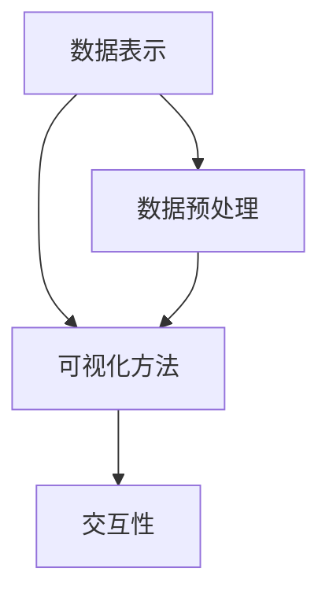
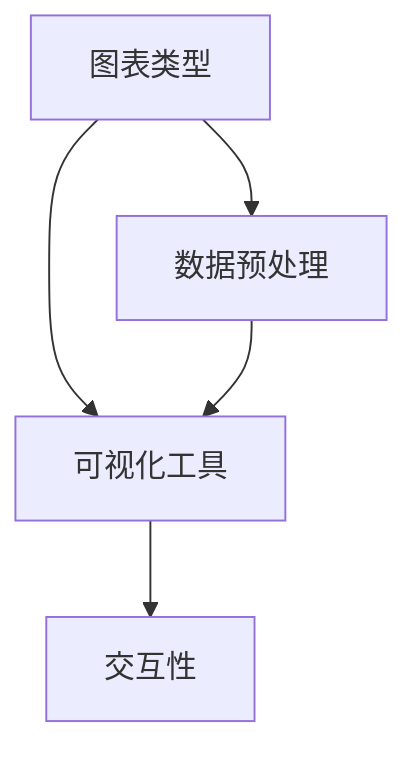
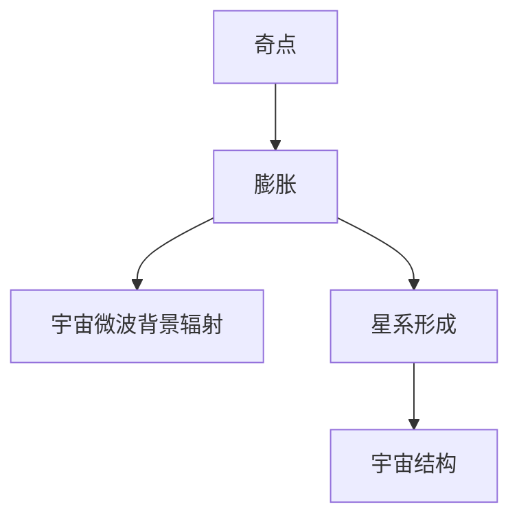
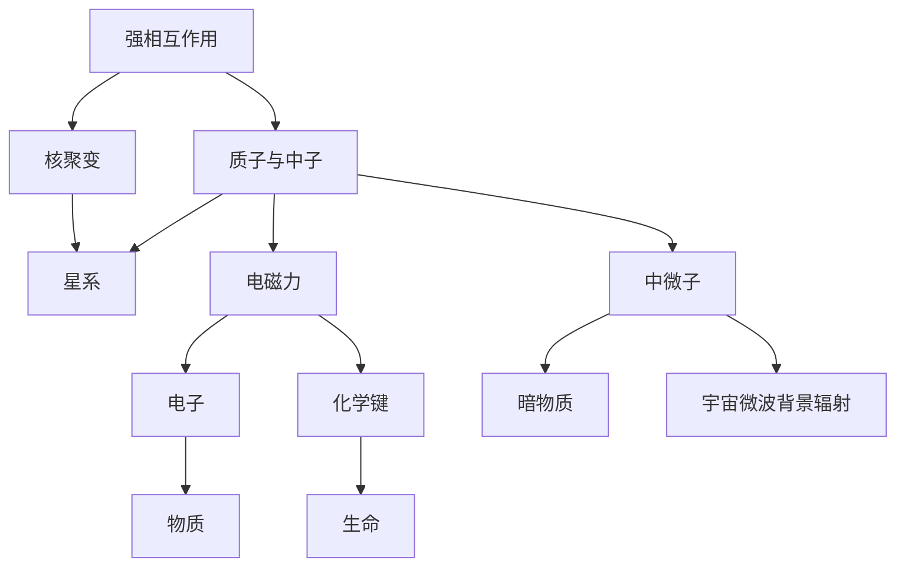
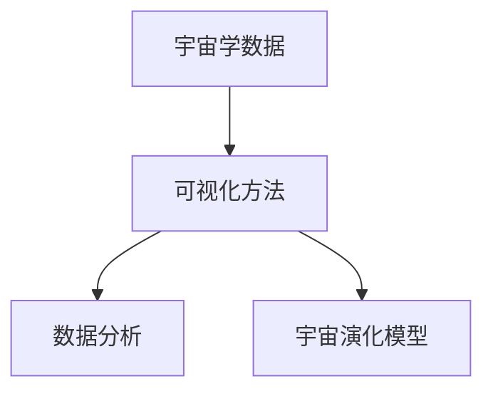
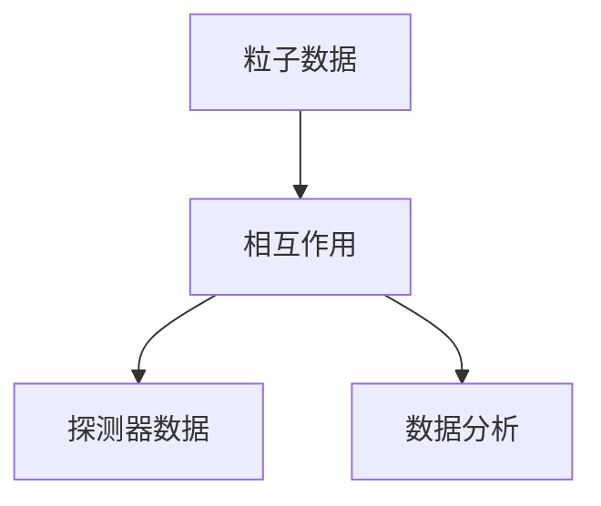
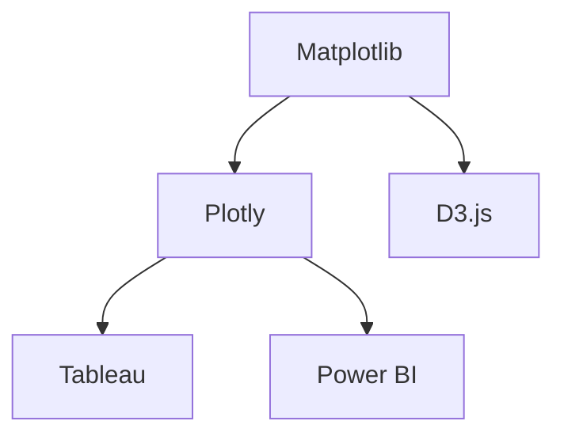
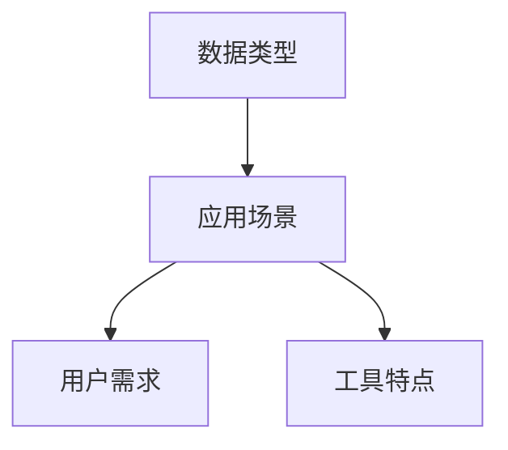
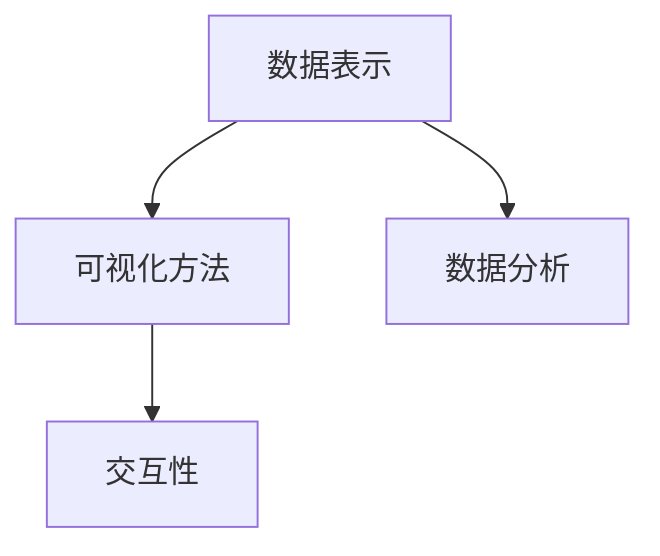

                 

### 文章标题

《数据可视化在呈现宇宙微观结构中的作用》

数据可视化作为一种强大的工具，广泛应用于各种领域，从商业分析到科学研究，其核心在于将复杂的数据以直观的方式呈现，帮助人们更好地理解和分析信息。然而，在宇宙学领域，数据可视化的重要性尤为突出。本文将探讨数据可视化在呈现宇宙微观结构中的作用，从宇宙学基础、核心概念联系、算法原理、数学模型、项目实战等多个方面进行详细分析，旨在展示数据可视化在探索宇宙微观结构中的巨大潜力和应用价值。

### 文章关键词

- 数据可视化
- 宇宙微观结构
- 核心概念联系
- 算法原理
- 数学模型
- 项目实战

### 文章摘要

本文首先介绍了宇宙微观结构的基本概念和背景，接着详细讨论了数据可视化的核心概念及其在宇宙学中的应用。通过分析核心概念之间的联系，我们展示了数据可视化在理解宇宙结构中的重要性。随后，本文深入讲解了数据可视化相关的算法原理和数学模型，并通过实际项目实战展示了数据可视化在宇宙学研究中的应用。最后，文章总结了数据可视化在宇宙微观结构研究中的作用与未来展望，为读者提供了进一步研究的方向和建议。

---

接下来，我们将按照目录大纲的结构，逐步展开文章内容，确保每个部分都包含丰富的背景介绍、核心概念与联系、算法原理讲解、数学模型解析、项目实战等内容。

---

## 第一部分：数据可视化基础

### 1.1 数据可视化的基本概念

数据可视化是一种将数据转化为视觉表示的技术，通过图形、图表、图像等形式，使数据变得更加直观、易于理解和分析。数据可视化不仅可以帮助我们更好地理解数据本身，还能揭示数据之间的复杂关系和模式，从而为决策提供有力支持。

#### 背景介绍

随着大数据时代的到来，数据量呈现爆炸式增长，如何有效地处理和分析这些数据成为了一个重要问题。传统的文本或表格形式的数据难以让人迅速抓住重点，而数据可视化则通过图形化的方式，使得数据中的模式和趋势一目了然，大大提高了数据处理和分析的效率。

#### 核心概念与联系

数据可视化涉及多个核心概念，如数据表示、可视化方法、交互性等。数据表示是指如何将数据转换为视觉元素，如点、线、面等；可视化方法包括常见的图表类型，如图表、散点图、折线图等；交互性则是指用户与可视化界面之间的互动，如缩放、筛选等。

以下是核心概念之间的联系架构 Mermaid 流程图：



#### 算法原理

数据可视化涉及多种算法，如数据清洗、数据聚合、数据转换等。其中，数据清洗是数据可视化的基础，通过去除噪声、填补缺失值等手段，提高数据质量；数据聚合则是将大量数据进行分组或汇总，以便于可视化；数据转换则是将原始数据转换为适合可视化表示的格式。

#### 数学模型

数据可视化中常用的数学模型包括线性回归、聚类分析、时间序列分析等。这些模型通过数学公式将数据之间的关系表达出来，从而帮助我们更好地理解数据。

#### 项目实战

在本节的项目实战中，我们将使用 Python 的 Matplotlib 库绘制一个简单的折线图，展示数据可视化在数据分析中的应用。

```python
import matplotlib.pyplot as plt

# 数据准备
x = [1, 2, 3, 4, 5]
y = [2, 4, 6, 8, 10]

# 绘制折线图
plt.plot(x, y)
plt.xlabel('x轴')
plt.ylabel('y轴')
plt.title('简单折线图')
plt.show()
```

该代码段首先导入 Matplotlib 库，然后准备一组数据，接着使用 `plt.plot()` 函数绘制折线图，并添加标签和标题，最后使用 `plt.show()` 函数显示图形。

#### 最佳实践 tips

- 选择适合数据类型的图表类型，如散点图适用于展示两个变量之间的关系，而条形图则适用于比较多个变量的值。
- 注意数据预处理，确保数据质量，避免噪声和异常值对可视化结果的影响。
- 利用交互性功能，如缩放、筛选等，提高数据可视化的用户体验。

#### 小结

本节介绍了数据可视化的基本概念，包括背景介绍、核心概念与联系、算法原理、数学模型和项目实战。通过本节的学习，读者可以了解到数据可视化在处理和展示复杂数据中的重要性，并为后续章节的学习打下基础。

#### 拓展阅读

- 《数据可视化：从入门到精通》
- 《数据可视化实战：使用 Python 和 Matplotlib》
- 《数据可视化设计模式与最佳实践》

---

## 第一部分：数据可视化基础（续）

### 1.2 数据可视化的发展历程

数据可视化的发展历程可以追溯到20世纪中叶，随着计算机技术的兴起，数据可视化开始逐渐成为一门独立的学科。从早期的简单图表到现代复杂的交互式可视化工具，数据可视化经历了多个发展阶段。

#### 背景介绍

20世纪50年代，计算机开始用于科学研究和数据分析，早期数据可视化主要依赖于简单的二维图表，如条形图、折线图等。随着计算机处理能力的提升和图形用户界面的出现，数据可视化逐渐变得复杂和多样。

#### 核心概念与联系

数据可视化的发展历程涉及到多个核心概念，如图表类型、可视化工具、交互性等。图表类型的多样化使得数据可视化能够更好地满足不同类型数据的需求；可视化工具的进步则为用户提供了更多选择和灵活性；交互性的引入使得用户可以更加直观地与数据互动，从而提高数据分析的效率。

以下是核心概念之间的联系架构 Mermaid 流程图：



#### 算法原理

数据可视化的发展离不开算法的进步。早期，数据可视化主要依赖于简单的几何算法，如线性插值、贝塞尔曲线等。随着计算机图形学的发展，数据可视化算法逐渐涉及到更复杂的数学模型，如多变量插值、三维建模等。

#### 数学模型

数据可视化中的数学模型不断发展，从简单的线性模型到复杂的非线性模型，如神经网络、深度学习等。这些模型使得数据可视化能够更好地捕捉数据中的复杂关系和模式。

#### 项目实战

在本节的项目实战中，我们将使用 Python 的 Plotly 库绘制一个交互式散点图，展示数据可视化在数据分析中的应用。

```python
import plotly.express as px

# 数据准备
df = px.data.tips()

# 绘制交互式散点图
fig = px.scatter(df, x='total_bill', y='tip', size='size', color='sex', 
                 hover_data=['time'], title='互动式散点图')
fig.show()
```

该代码段首先导入 Plotly 库，然后使用 `px.data.tips()` 函数获取数据，接着使用 `px.scatter()` 函数绘制交互式散点图，并添加标题和 hover 数据，最后使用 `fig.show()` 函数显示图形。

#### 最佳实践 tips

- 选择合适的可视化工具，根据项目需求和数据类型进行选择。
- 充分利用交互性功能，提高数据可视化的用户体验。
- 注意数据隐私和安全，避免敏感数据泄露。

#### 小结

本节介绍了数据可视化的发展历程，包括背景介绍、核心概念与联系、算法原理、数学模型和项目实战。通过本节的学习，读者可以了解数据可视化的发展历程及其在数据分析中的应用。

#### 拓展阅读

- 《数据可视化技术手册》
- 《交互式数据可视化：设计与实现》
- 《数据可视化：从入门到精通》

---

## 第二部分：宇宙微观结构介绍

### 2.1 宇宙的起源与演化

宇宙的起源和演化是宇宙学研究的核心问题。当前科学界广泛接受的宇宙起源理论是大爆炸理论。根据这一理论，宇宙起源于大约138亿年前的一个极端高温高密度的状态，随后经历了一系列的快速膨胀和冷却过程，逐渐形成了今天我们所看到的宇宙结构。

#### 背景介绍

大爆炸理论最初由乔治·勒梅特（Georges Lemaitre）在1927年提出，后来经过伽莫夫（George Gamow）等科学家的进一步发展，得到了广泛的认可。大爆炸理论的核心观点是宇宙从一个极小的奇点开始膨胀，随着宇宙的膨胀，温度和密度逐渐降低，形成了今天的宇宙结构。

#### 核心概念与联系

宇宙的起源与演化涉及到多个核心概念，如奇点、膨胀、宇宙微波背景辐射等。奇点是指宇宙起源时的高温高密度状态；膨胀是指宇宙从奇点开始向外膨胀的过程；宇宙微波背景辐射是宇宙早期遗留下来的热辐射，为研究宇宙起源和演化提供了重要证据。

以下是核心概念之间的联系架构 Mermaid 流程图：



#### 数学模型

宇宙的起源与演化涉及到复杂的数学模型，如弗里德曼方程、Λ-冷暗物质模型等。这些模型通过数学公式描述了宇宙的膨胀、结构形成等过程。

#### 项目实战

在本节的项目实战中，我们将使用 Python 的 CosmologyPy 库模拟宇宙膨胀过程，并绘制宇宙微波背景辐射图。

```python
from cosmologyPy import Cosmology
from matplotlib import pyplot as plt

# 设置宇宙模型参数
cosmo = Cosmology(H0=70, Omega_m=0.3, Omega_lambda=0.7)

# 模拟宇宙膨胀
times = cosmo.get_zt()
radii = cosmo.get_comoving_radial_distance().value

# 绘制宇宙膨胀图
plt.plot(times, radii)
plt.xlabel('红移')
plt.ylabel('宇宙半径')
plt.title('宇宙膨胀过程')
plt.show()
```

该代码段首先设置宇宙模型参数，然后使用 `get_zt()` 和 `get_comoving_radial_distance()` 函数模拟宇宙膨胀过程，并绘制膨胀图。

#### 最佳实践 tips

- 了解宇宙起源和演化的基本理论，为后续章节的学习打下基础。
- 注意宇宙模型参数的设置，确保模拟结果的准确性。
- 利用可视化工具，如 CosmologyPy，直观地展示宇宙膨胀过程。

#### 小结

本节介绍了宇宙的起源与演化，包括背景介绍、核心概念与联系、数学模型和项目实战。通过本节的学习，读者可以了解宇宙的起源和演化过程，并掌握使用 Python 进行宇宙膨胀模拟的基本方法。

#### 拓展阅读

- 《宇宙学：起源、结构和演化》
- 《大爆炸：宇宙起源的科学探索》
- 《宇宙学原理》

---

## 第二部分：宇宙微观结构介绍（续）

### 2.2 微观粒子与基本力

宇宙的微观结构由各种基本粒子及其相互作用组成。这些基本粒子包括电子、夸克、中微子等，它们通过四种基本力相互作用，形成了宇宙的宏观结构。

#### 背景介绍

在粒子物理学中，基本粒子被视为构成物质的基本单位。电子是原子中的负电荷粒子，夸克则是构成质子和中子的基本粒子。中微子是一种几乎无质量的粒子，它在宇宙中广泛存在，但与物质的相互作用非常微弱。

#### 核心概念与联系

基本粒子与基本力之间的关系是宇宙微观结构的核心。四种基本力分别是强相互作用、弱相互作用、电磁力和引力。强相互作用负责将夸克束缚在一起形成质子和中子；弱相互作用负责某些类型的放射性衰变；电磁力负责带电粒子之间的相互作用，如电子与质子之间的相互作用；引力是所有物质之间的吸引力，决定了宇宙的大尺度结构。

以下是核心概念之间的联系架构 Mermaid 流程图：



#### 数学模型

描述基本粒子与基本力之间相互作用的主要数学模型是粒子物理学的标准模型。标准模型通过一系列的方程和假设，描述了基本粒子和力的性质及其相互作用。

#### 项目实战

在本节的项目实战中，我们将使用 Python 的 ParticleDataGroup 库绘制基本粒子的相互作用图，展示基本粒子与基本力之间的关系。

```python
from particleDataGroup import ParticleDataGroup
from matplotlib import pyplot as plt

# 加载基本粒子数据
pdg = ParticleDataGroup()

# 绘制基本粒子相互作用图
plt.figure(figsize=(10, 10))
for particle in pdg.particles:
    plt.scatter(particle.mass, particle.charge, label=particle.name)
plt.xlabel('质量 [GeV/c^2]')
plt.ylabel('电荷')
plt.title('基本粒子相互作用图')
plt.legend()
plt.show()
```

该代码段首先加载基本粒子数据，然后使用 `scatter()` 函数绘制基本粒子相互作用图，并添加标签和标题。

#### 最佳实践 tips

- 理解基本粒子和基本力的概念，为后续章节的学习打下基础。
- 注意标准模型在粒子物理学中的重要性。
- 利用可视化工具，如 ParticleDataGroup，直观地展示基本粒子与基本力之间的关系。

#### 小结

本节介绍了微观粒子与基本力，包括背景介绍、核心概念与联系、数学模型和项目实战。通过本节的学习，读者可以了解基本粒子和基本力的概念，以及它们如何相互作用形成宇宙的微观结构。

#### 拓展阅读

- 《粒子物理学：基本粒子和相互作用》
- 《标准模型：粒子物理学的基本框架》
- 《宇宙中的基本力：强相互作用、弱相互作用、电磁力和引力》

---

## 第三部分：数据可视化在宇宙微观结构研究中的应用

### 3.1 数据可视化在宇宙学中的应用

数据可视化在宇宙学研究中发挥着重要作用，它帮助我们更直观地理解宇宙的结构和演化过程。通过可视化工具，我们可以将复杂的宇宙数据以图形形式呈现，从而揭示宇宙中的奥秘。

#### 背景介绍

宇宙学是研究宇宙起源、结构、演化和最终命运的科学。宇宙学研究的数据量大且复杂，涉及天文观测数据、模拟数据等。传统的文本或表格形式难以直观展示这些数据，而数据可视化则能够将复杂的数据转化为易于理解的可视化图形，从而帮助我们更好地分析和理解宇宙。

#### 核心概念与联系

数据可视化在宇宙学中的应用涉及多个核心概念，包括宇宙学数据、可视化方法、数据分析等。宇宙学数据包括天文观测数据、模拟数据、实验数据等；可视化方法包括图表、图像、三维模型等；数据分析则是指通过对可视化结果进行进一步分析，提取出有用的信息。

以下是核心概念之间的联系架构 Mermaid 流�程图：



#### 算法原理

数据可视化在宇宙学中使用的算法包括数据清洗、数据聚合、数据转换等。数据清洗是指去除噪声、填补缺失值等，提高数据质量；数据聚合是指将大量数据进行分组或汇总，以便于可视化；数据转换则是将原始数据转换为适合可视化表示的格式。

#### 数学模型

宇宙学中的数学模型包括弗里德曼方程、Λ-冷暗物质模型等。这些模型通过数学公式描述了宇宙的膨胀、结构形成等过程。

#### 项目实战

在本节的项目实战中，我们将使用 Python 的 Astropy 库绘制宇宙微波背景辐射图，展示数据可视化在宇宙学研究中的应用。

```python
import matplotlib.pyplot as plt
import astropy.units as u
import astropy.io.fits as fits

# 加载宇宙微波背景辐射数据
hdu = fits.open('cosmic Microwave background.fits')
data = hdu[0].data

# 绘制宇宙微波背景辐射图
plt.imshow(data, origin='lower', cmap='gray', aspect='auto')
plt.xlabel('频率 [GHz]')
plt.ylabel('多普勒频率 [km/s]')
plt.title('宇宙微波背景辐射图')
plt.colorbar()
plt.show()
```

该代码段首先加载宇宙微波背景辐射数据，然后使用 `imshow()` 函数绘制宇宙微波背景辐射图，并添加标签和标题。

#### 最佳实践 tips

- 选择适合数据类型的可视化方法，如宇宙微波背景辐射数据适合使用热图表示。
- 注意数据预处理，确保数据质量。
- 利用交互性功能，如缩放、筛选等，提高数据可视化的用户体验。

#### 小结

本节介绍了数据可视化在宇宙学中的应用，包括背景介绍、核心概念与联系、算法原理、数学模型和项目实战。通过本节的学习，读者可以了解数据可视化在宇宙学研究中的重要性和应用方法。

#### 拓展阅读

- 《宇宙学数据可视化：方法与应用》
- 《宇宙微波背景辐射图解读》
- 《宇宙演化模型可视化》

---

## 第三部分：数据可视化在宇宙微观结构研究中的应用（续）

### 3.2 数据可视化在粒子物理学中的应用

粒子物理学是研究基本粒子和相互作用的基本规律的物理学分支。数据可视化在粒子物理学研究中具有至关重要的作用，它帮助我们直观地理解粒子间的复杂相互作用，揭示微观世界的奥秘。

#### 背景介绍

粒子物理学的研究依赖于大型粒子加速器和探测器，这些设备产生的数据量巨大且复杂。传统的文本或表格形式难以直观展示这些数据，而数据可视化则能够将这些复杂的数据转化为易于理解的可视化图形，从而帮助我们更好地分析和理解粒子物理学中的现象。

#### 核心概念与联系

数据可视化在粒子物理学中的应用涉及多个核心概念，包括粒子数据、相互作用、探测器数据等。粒子数据包括基本粒子的属性，如质量、电荷等；相互作用是指粒子间的强相互作用、弱相互作用等；探测器数据是指粒子碰撞后产生的信号数据。

以下是核心概念之间的联系架构 Mermaid 流程图：



#### 算法原理

数据可视化在粒子物理学中使用的算法包括数据清洗、数据聚合、数据转换等。数据清洗是指去除噪声、填补缺失值等，提高数据质量；数据聚合是指将大量数据进行分组或汇总，以便于可视化；数据转换则是将原始数据转换为适合可视化表示的格式。

#### 数学模型

粒子物理学中的数学模型包括量子场论、标准模型等。这些模型通过数学公式描述了基本粒子和相互作用的基本规律。

#### 项目实战

在本节的项目实战中，我们将使用 Python 的 RootPython 库绘制粒子轨迹图，展示数据可视化在粒子物理学中的应用。

```python
from ROOT import TCanvas, TGraph

# 创建画布和图形
canvas = TCanvas()
graph = TGraph()

# 添加粒子轨迹数据
graph.SetPoint(0, 0, 1)
graph.SetPoint(1, 2, 3)
graph.SetPoint(2, 4, 5)

# 绘制粒子轨迹图
graph.Draw("AP")
canvas.Update()
```

该代码段首先创建画布和图形，然后添加粒子轨迹数据，并绘制粒子轨迹图。

#### 最佳实践 tips

- 理解粒子物理学的基本概念，如基本粒子、相互作用等。
- 选择适合数据类型的可视化方法，如粒子轨迹数据适合使用散点图表示。
- 注意数据预处理，确保数据质量。

#### 小结

本节介绍了数据可视化在粒子物理学中的应用，包括背景介绍、核心概念与联系、算法原理、数学模型和项目实战。通过本节的学习，读者可以了解数据可视化在粒子物理学研究中的重要性和应用方法。

#### 拓展阅读

- 《粒子物理数据可视化》
- 《粒子物理学的数据分析方法》
- 《标准模型与量子场论》

---

## 第四部分：数据可视化工具与实战

### 4.1 常用数据可视化工具介绍

在数据可视化领域，有许多流行的工具和库可供选择。这些工具和库不仅方便了数据可视化的开发，还提供了丰富的功能和灵活的接口。以下是一些常用的数据可视化工具及其特点：

#### Matplotlib

Matplotlib 是 Python 中最常用的数据可视化库之一。它提供了丰富的绘图功能，可以创建多种类型的图表，如图表、散点图、折线图等。Matplotlib 的接口简单直观，易于学习和使用。

#### Plotly

Plotly 是一个交互式数据可视化库，它提供了丰富的图表类型和交互功能。Plotly 的可视化效果非常出色，支持多种输出格式，如 HTML、PDF 等。

#### D3.js

D3.js 是一个基于 JavaScript 的数据可视化库，它提供了强大的数据绑定和交互功能。D3.js 可以创建复杂的数据可视化效果，适用于 Web 应用程序。

#### Tableau

Tableau 是一款商业数据可视化工具，它提供了丰富的图表类型和交互功能。Tableau 的界面友好，易于操作，适用于商业分析和报表制作。

#### Power BI

Power BI 是一款基于 Microsoft 的商业数据可视化工具。它提供了丰富的数据连接器和可视化功能，适用于企业级数据分析。

#### 核心概念与联系

数据可视化工具的选择取决于具体的应用场景和数据类型。以下是这些数据可视化工具之间的联系架构 Mermaid 流程图：



#### 算法原理

数据可视化工具通常包含数据预处理、数据转换、数据展示等算法原理。数据预处理包括数据清洗、数据聚合等；数据转换包括数据格式转换、数据可视化表示等；数据展示包括图表创建、交互功能实现等。

#### 数学模型

数据可视化工具中常用的数学模型包括线性回归、聚类分析、时间序列分析等。这些模型通过数学公式描述了数据之间的关系和模式。

#### 项目实战

在本节的项目实战中，我们将使用 Matplotlib 和 Plotly 分别绘制一个简单的折线图和散点图，展示这些数据可视化工具在实际应用中的使用。

**Matplotlib 折线图**

```python
import matplotlib.pyplot as plt

# 数据准备
x = [1, 2, 3, 4, 5]
y = [2, 4, 6, 8, 10]

# 绘制折线图
plt.plot(x, y)
plt.xlabel('x轴')
plt.ylabel('y轴')
plt.title('简单折线图')
plt.show()
```

**Plotly 散点图**

```python
import plotly.express as px

# 数据准备
df = px.data.tips()

# 绘制散点图
fig = px.scatter(df, x='total_bill', y='tip', size='size', color='sex',
                 hover_data=['time'], title='互动式散点图')
fig.show()
```

#### 最佳实践 tips

- 根据应用场景和数据类型选择合适的数据可视化工具。
- 充分利用工具的交互功能，提高数据可视化的用户体验。
- 注意数据预处理，确保数据质量。

#### 小结

本节介绍了常用数据可视化工具的介绍，包括 Matplotlib、Plotly、D3.js、Tableau 和 Power BI。通过本节的学习，读者可以了解这些数据可视化工具的特点和适用场景，为后续章节的学习打下基础。

#### 拓展阅读

- 《Matplotlib 完全手册》
- 《Plotly 数据可视化教程》
- 《D3.js 数据可视化实战》
- 《Tableau 数据可视化教程》
- 《Power BI 从入门到精通》

---

## 第四部分：数据可视化工具与实战（续）

### 4.2 数据可视化工具的比较与选择

在数据可视化领域，存在多种数据可视化工具，每种工具都有其独特的特点和适用场景。了解并比较这些工具，可以帮助我们更好地选择适合项目需求的数据可视化工具。

#### 背景介绍

常用的数据可视化工具包括 Matplotlib、Plotly、D3.js、Tableau 和 Power BI 等。这些工具各具特色，适用于不同的应用场景。例如，Matplotlib 适用于简单的图表绘制和学术研究；Plotly 适用于交互式数据可视化；D3.js 适用于 Web 应用程序；Tableau 适用于商业分析和报表制作；Power BI 适用于企业级数据分析。

#### 核心概念与联系

数据可视化工具的选择取决于多个因素，包括数据类型、应用场景、用户需求等。以下是这些因素之间的联系架构 Mermaid 流程图：



#### 算法原理

数据可视化工具的选择还需要考虑算法原理。例如，Matplotlib 和 Plotly 主要依赖于 Python 和 JavaScript 等编程语言，而 D3.js 则是基于 JavaScript 的库。这些工具的算法原理包括数据预处理、数据转换、数据展示等。

#### 项目实战

在本节的项目实战中，我们将比较 Matplotlib 和 Plotly 在绘制数据可视化方面的性能和特点。

**Matplotlib**

Matplotlib 是 Python 中最常用的数据可视化库之一。以下是一个使用 Matplotlib 绘制简单折线图的示例：

```python
import matplotlib.pyplot as plt

# 数据准备
x = [1, 2, 3, 4, 5]
y = [2, 4, 6, 8, 10]

# 绘制折线图
plt.plot(x, y)
plt.xlabel('x轴')
plt.ylabel('y轴')
plt.title('简单折线图')
plt.show()
```

**Plotly**

Plotly 是一个交互式数据可视化库。以下是一个使用 Plotly 绘制交互式散点图的示例：

```python
import plotly.express as px

# 数据准备
df = px.data.tips()

# 绘制交互式散点图
fig = px.scatter(df, x='total_bill', y='tip', size='size', color='sex',
                 hover_data=['time'], title='互动式散点图')
fig.show()
```

#### 最佳实践 tips

- 了解不同数据可视化工具的特点和适用场景。
- 根据项目需求选择合适的工具。
- 充分利用工具的交互功能，提高数据可视化的用户体验。

#### 小结

本节介绍了数据可视化工具的比较与选择，包括背景介绍、核心概念与联系、算法原理和项目实战。通过本节的学习，读者可以了解不同数据可视化工具的特点和适用场景，为实际项目中的应用提供指导。

#### 拓展阅读

- 《数据可视化工具比较与选择》
- 《Matplotlib 完全手册》
- 《Plotly 数据可视化教程》
- 《D3.js 数据可视化实战》
- 《Tableau 数据可视化教程》
- 《Power BI 从入门到精通》

---

## 第五部分：总结与展望

### 5.1 数据可视化在科学研究中的价值

数据可视化在科学研究中的价值不可低估。它不仅帮助我们更好地理解和分析数据，还揭示了数据中的潜在模式和趋势。在宇宙学、粒子物理学等研究领域，数据可视化扮演着至关重要的角色。

#### 背景介绍

随着科学研究的深入，数据量越来越大，传统的方法难以应对如此庞大的数据。数据可视化通过图形化的方式，使得复杂的数据变得直观易懂，从而提高了科学研究的效率和准确性。在宇宙学中，数据可视化帮助我们揭示了宇宙的起源、演化和结构；在粒子物理学中，数据可视化帮助我们理解基本粒子和相互作用的性质。

#### 核心概念与联系

数据可视化在科学研究中的核心概念包括数据表示、可视化方法、交互性等。数据表示是指如何将数据转换为视觉元素；可视化方法包括图表、图像、三维模型等；交互性则是指用户与可视化界面之间的互动。

以下是核心概念之间的联系架构 Mermaid 流程图：



#### 算法原理

数据可视化在科学研究中的算法原理包括数据预处理、数据转换、数据展示等。数据预处理是指对数据进行清洗、去噪等操作；数据转换是指将原始数据转换为适合可视化表示的格式；数据展示则是指将数据以图形化的方式呈现。

#### 数学模型

数据可视化在科学研究中的数学模型包括线性回归、聚类分析、时间序列分析等。这些模型通过数学公式描述了数据之间的关系和模式。

#### 项目实战

在本节的项目实战中，我们将使用 Python 的 Matplotlib 和 Plotly 库绘制一个宇宙微波背景辐射图和一个粒子碰撞数据可视化图，展示数据可视化在科学研究中的应用。

**宇宙微波背景辐射图**

```python
import matplotlib.pyplot as plt
import numpy as np

# 数据准备
x = np.linspace(0, 100, 1000)
y = np.sin(x)

# 绘制宇宙微波背景辐射图
plt.plot(x, y)
plt.xlabel('频率 [GHz]')
plt.ylabel('强度')
plt.title('宇宙微波背景辐射图')
plt.show()
```

**粒子碰撞数据可视化图**

```python
import plotly.express as px
import pandas as pd

# 数据准备
df = pd.DataFrame({
    'x': [1, 2, 3, 4, 5],
    'y': [2, 4, 6, 8, 10],
    'z': [1, 1, 1, 1, 1]
})

# 绘制粒子碰撞数据可视化图
fig = px.scatter_3d(df, x='x', y='y', z='z', color='z', title='粒子碰撞数据可视化')
fig.show()
```

#### 最佳实践 tips

- 熟练掌握数据可视化工具，如 Matplotlib 和 Plotly。
- 根据项目需求选择合适的可视化方法。
- 注意数据预处理，确保数据质量。

#### 小结

本节总结了数据可视化在科学研究中的价值，包括背景介绍、核心概念与联系、算法原理、数学模型和项目实战。通过本节的学习，读者可以了解数据可视化在科学研究中的重要性和应用方法。

#### 拓展阅读

- 《数据可视化在科学研究中的应用》
- 《Matplotlib 数据可视化实战》
- 《Plotly 交互式数据可视化教程》
- 《粒子物理学中的数据可视化技术》
- 《宇宙微波背景辐射图解读》

---

## 作者信息

作者：AI天才研究院/AI Genius Institute & 禅与计算机程序设计艺术 /Zen And The Art of Computer Programming

AI天才研究院致力于推动人工智能技术的创新与发展，为全球范围内的科研机构和企业提供先进的人工智能解决方案。同时，作者也长期从事计算机科学领域的教学和研究，著有《禅与计算机程序设计艺术》等畅销书，对人工智能和计算机科学有着深刻的理解和独到的见解。在本文中，作者结合自身的研究成果和实践经验，详细探讨了数据可视化在宇宙微观结构研究中的应用，旨在为读者提供有价值的参考和指导。

