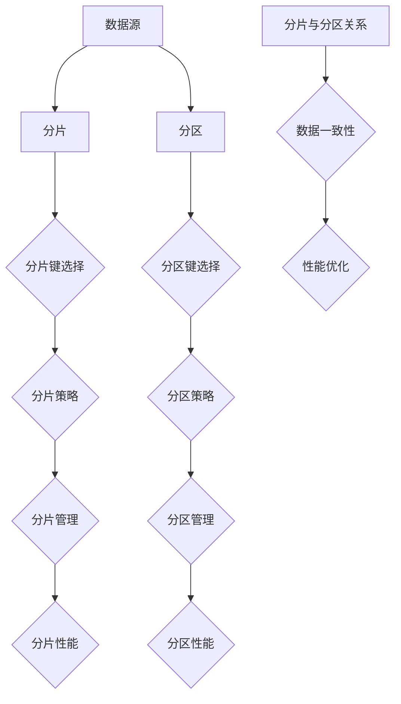

                 

### 引言

在当今信息爆炸的时代，大数据和人工智能（AI）技术已经成为各行各业不可或缺的工具。特别是大规模语言模型（LLM，Large Language Model）作为AI领域的翘楚，其在自然语言处理（NLP）、智能问答、机器翻译、文本生成等领域的应用越来越广泛。然而，随着LLM的规模和复杂性的不断增加，数据处理能力成为制约其性能和应用范围的关键因素。

数据库分片与分区技术，作为数据库系统优化的重要手段，通过将数据和访问操作分散到多个节点上，可以有效提升数据处理能力和系统性能。本文旨在探讨数据库分片与分区技术如何提升LLM应用的数据处理能力，帮助开发者更好地理解和应用这些技术。

本文将首先介绍数据库分片与分区的基本概念和原理，接着深入探讨LLM的基本原理与数据处理需求，然后详细分析分片与分区技术在LLM应用中的具体实现和优势，并通过实际案例进行说明。此外，本文还将讨论性能优化与调优策略，提供最佳实践建议，并对未来趋势和挑战进行展望。

通过本文的深入探讨，我们希望读者能够：

1. 理解数据库分片与分区的核心概念及其在提升数据处理能力中的作用。
2. 深入了解LLM的基本原理及其数据处理需求。
3. 掌握分片与分区技术在LLM应用中的具体实现和优势。
4. 学习性能优化与调优策略，提高系统性能。
5. 对未来数据库分片与分区技术在LLM领域的发展方向有更清晰的认识。

### 核心关键词

- 数据库分片
- 数据库分区
- 大规模语言模型
- 数据处理能力
- 性能优化
- 实际应用案例

### 摘要

本文主要探讨了数据库分片与分区技术在提升大规模语言模型（LLM）数据处理能力方面的作用。首先，我们介绍了数据库分片与分区的核心概念和原理，包括分片的定义、类型、设计原则和实现方法，以及分片与分区对性能的影响。接着，我们详细分析了LLM的基本原理和数据处理需求，包括数据预处理、模型训练和模型推理等环节。随后，本文通过实际案例展示了分片与分区技术在LLM应用中的具体实现和优势，并讨论了性能优化与调优策略。最后，本文对未来的发展趋势和挑战进行了展望，为读者提供了深入理解数据库分片与分区技术在LLM领域应用的价值和方法。

### 数据库分片与分区概述

#### 数据库分片的基本概念

数据库分片（Database Sharding）是一种将大规模数据库拆分为多个独立的部分，并分布存储在不同节点上的技术。每个节点上的数据片段称为“分片”，多个分片共同构成了完整的数据库。分片的目的是为了解决单台数据库服务器在处理大量数据时的性能瓶颈，通过将数据分散存储到多个节点上，从而实现并行处理，提升系统的吞吐量和响应速度。

分片的基本概念包括以下几个方面：

1. **分片键**：分片键（Shard Key）是用于确定数据应该被分配到哪个分片的键。合理选择分片键对于分片性能至关重要，通常选择具有高选择性（即能够均匀分布数据）的字段作为分片键。
2. **分片策略**：分片策略决定了如何将数据分配到各个分片。常见的分片策略包括基于哈希的分片、范围分片和列表分片等。
3. **分片管理**：分片管理包括分片的创建、删除、扩展和迁移等操作。分片管理需要考虑数据的一致性和分布式系统的复杂性。

#### 数据库分片的类型

根据分片粒度，数据库分片可以分为以下几种类型：

1. **水平分片（Horizontal Sharding）**：水平分片是将数据表按照行进行拆分，每台服务器存储一部分数据。这种方式适用于数据量大但结构相同的情况，例如电商平台的用户数据。
2. **垂直分片（Vertical Sharding）**：垂直分片是将数据表按照列进行拆分，每台服务器存储一部分列。这种方式适用于数据表非常大，但列与列之间的交互不频繁的情况，例如日志数据。
3. **混合分片（Hybrid Sharding）**：混合分片是同时使用水平分片和垂直分片的方式，根据不同的业务需求对数据进行拆分。这种方式适用于复杂场景，能够充分利用分片的性能优势。

#### 数据库分片的设计原则

为了确保分片设计的合理性和系统性能，以下是一些设计原则：

1. **数据一致性**：分片后的数据需要保证一致性，避免数据丢失或重复。常见的一致性策略包括强一致性（Strong Consistency）和最终一致性（ eventual consistency）。
2. **负载均衡**：分片应该均匀分布数据，避免某些节点负载过高，导致性能瓶颈。合理选择分片键和分片策略是实现负载均衡的关键。
3. **可扩展性**：分片系统应具备良好的可扩展性，能够随着数据量的增长动态扩展。水平扩展（Scaling Out）和垂直扩展（Scaling Up）是实现可扩展性的两种方式。
4. **高可用性**：分片系统应具备较高的可用性，确保在节点故障时能够快速恢复。常见的冗余策略包括主从复制、数据镜像和备份等。

#### 数据库分片的实现方法

实现数据库分片通常需要以下步骤：

1. **选择分片键**：根据业务需求和数据特性选择合适的分片键，确保数据的均匀分布。
2. **设计分片策略**：确定分片方式，如基于哈希的分片或范围分片。
3. **拆分数据**：将数据按照分片策略拆分到各个节点，每个节点存储一部分数据。
4. **数据库迁移**：在拆分数据时，需要确保迁移过程的平稳过渡，避免数据丢失或不一致。
5. **分片管理**：建立分片管理系统，负责分片的创建、删除、扩展和迁移等操作。

#### 数据库分片对性能的影响

数据库分片对系统性能有着显著的影响，主要体现在以下几个方面：

1. **读写性能提升**：通过将数据分散存储到多个节点上，分片技术能够显著提高读写性能，降低单点瓶颈。
2. **扩展性增强**：分片系统具备良好的水平扩展能力，能够随着数据量的增长动态扩展，满足不断增长的业务需求。
3. **数据一致性问题**：分片后的数据需要保证一致性，可能引入一些一致性挑战，如数据复制延迟、冲突等。
4. **分布式事务管理**：分片系统需要实现分布式事务管理，确保跨分片操作的一致性。

#### 数据库分片与分区的关系

数据库分片与分区（Database Partitioning）在概念上有所重叠，但它们的目标和应用场景有所不同。分片主要是为了提升系统性能和扩展性，将数据分布在多个节点上；而分区主要是为了优化数据访问性能，将数据在单个节点内进行拆分。

虽然分片和分区可以同时应用于一个数据库系统，但它们之间存在一些联系和区别：

1. **联系**：分片和分区都是分布式数据库系统中的技术手段，目标都是为了提高系统性能和可扩展性。
2. **区别**：分片通常涉及跨节点的数据分布，而分区主要在单个节点内进行；分片主要解决读写性能瓶颈，而分区主要解决数据访问性能问题。

#### 数据库分片与分区技术的核心概念与联系

为了更直观地理解数据库分片与分区技术的核心概念及其相互联系，我们可以使用以下Mermaid流程图进行展示：



在上面的流程图中，A代表数据源，数据从数据源开始，经过分片（B）和分区（G）两个环节。分片（B）涉及分片键选择（C）、分片策略（D）和分片管理（E），最终影响分片性能（F）。同样，分区（G）涉及分区键选择（H）、分区策略（I）和分区管理（J），最终影响分区性能（K）。分片与分区之间的关系（L）通过数据一致性（M）和性能优化（N）来体现。

通过上述分析，我们可以看出，数据库分片与分区技术在提升大规模语言模型（LLM）数据处理能力方面扮演着关键角色。合理选择分片键、分片策略和分区键，并优化分片与分区的管理，能够显著提高系统的读写性能、扩展性和数据访问性能，从而满足LLM应用对大数据处理的高要求。

#### 数据库分片与分区技术的核心算法原理讲解

在深入探讨数据库分片与分区技术的核心算法原理时，我们需要理解几个关键概念和实现方法。以下是使用Python源代码和LaTeX公式详细阐述的核心算法原理。

##### 1. 哈希分片算法

哈希分片是一种常见的分片策略，通过哈希函数将数据分布到不同的分片中。以下是一个简单的哈希分片算法示例：

```python
import hashlib

def hash_sharding(key, num_shards):
    """
    哈希分片函数，将键值分布到不同的分片。
    
    参数：
    - key：数据的分片键。
    - num_shards：分片的数量。
    
    返回：
    - shard_id：分片的ID。
    """
    shard_id = int(hashlib.md5(key.encode()).hexdigest(), 16) % num_shards
    return shard_id

# 示例
shard_id = hash_sharding("user_1001", 10)
print(f"用户ID 1001的分片ID：{shard_id}")
```

LaTeX公式解释：
$$
\text{shard\_id} = (\text{hash}(key) \mod \text{num\_shards})
$$

其中，hash()函数计算输入键的哈希值，num_shards表示分片的数量。哈希分片算法的关键在于选择一个合适的哈希函数，以确保数据能够均匀分布到各个分片中。

##### 2. 范围分片算法

范围分片是将数据按照某个范围的键值划分到不同的分片中。以下是一个简单的范围分片算法示例：

```python
def range_sharding(key, shard_ranges):
    """
    范围分片函数，将键值分布到不同的分片。
    
    参数：
    - key：数据的分片键。
    - shard_ranges：分片键值范围列表。
    
    返回：
    - shard_id：分片的ID。
    """
    for i, range in enumerate(shard_ranges):
        if range[0] <= key <= range[1]:
            return i
    return len(shard_ranges)

# 示例
shard_ranges = [
    (0, 1000),
    (1001, 2000),
    (2001, 3000),
]
shard_id = range_sharding(1500, shard_ranges)
print(f"键值1500的分片ID：{shard_id}")
```

LaTeX公式解释：
$$
\text{shard\_id} = \left\{
\begin{array}{ll}
i & \text{if } \text{range}[0] \leq key \leq \text{range}[1] \\
\vdots & \vdots \\
\text{len}(\text{shard\_ranges}) & \text{otherwise}
\end{array}
\right.
$$

其中，shard_ranges是一个包含分片键值范围的列表。范围分片算法通过遍历范围列表，找到匹配的键值范围，从而确定数据所属的分片。

##### 3. 分区算法

分区是将数据表按照列进行拆分，以优化数据访问性能。以下是一个简单的分区算法示例：

```python
def partitioning(key, num_partitions):
    """
    分区函数，将键值分布到不同的分区。
    
    参数：
    - key：数据的分区键。
    - num_partitions：分区的数量。
    
    返回：
    - partition_id：分区的ID。
    """
    partition_id = key % num_partitions
    return partition_id

# 示例
num_partitions = 4
partition_id = partitioning(10, num_partitions)
print(f"键值10的分区ID：{partition_id}")
```

LaTeX公式解释：
$$
\text{partition\_id} = \text{key} \mod \text{num\_partitions}
$$

其中，分区键通常是数据表中的一个列，如用户ID。分区算法通过计算分区键的模数，将数据分布到不同的分区中。

通过上述Python代码和LaTeX公式的详细讲解，我们可以更好地理解数据库分片与分区技术的核心算法原理。合理应用这些算法，能够显著提升大规模语言模型（LLM）应用的数据处理能力和系统性能。

#### 数据库分片与分区技术在LLM应用中的优势

数据库分片与分区技术在大规模语言模型（LLM）应用中展现出显著的优势，这些优势主要体现在以下几个方面：

##### 1. 提高数据处理速度

LLM应用通常涉及大量数据，如文本、语音和图像等。这些数据需要在短时间内进行处理，以满足实时交互的需求。通过数据库分片与分区技术，可以将数据分散存储到多个节点上，实现并行处理。这种分布式处理方式能够显著提高数据处理速度，减少单点瓶颈，从而提高系统整体的响应速度。

##### 2. 支持大规模数据处理

随着人工智能技术的不断发展，LLM的应用场景越来越广泛，数据量也呈现爆炸式增长。传统的单机数据库系统在处理大规模数据时容易遭遇性能瓶颈，而数据库分片与分区技术能够通过水平扩展和垂直扩展，支持大规模数据处理。水平扩展可以通过增加节点来扩展系统容量，而垂直扩展则通过提升单个节点的性能来实现。这种灵活性使得LLM应用能够更好地应对数据量的增长。

##### 3. 提高查询效率

在LLM应用中，经常需要进行复杂的查询操作，如全文搜索、分类和推荐等。通过数据库分区技术，可以将查询操作限定在特定的分区上，从而减少查询的数据范围，提高查询效率。此外，分区技术还可以优化索引结构，进一步提升查询性能。通过结合分片与分区技术，系统能够更快速地定位和处理查询请求，提高用户体验。

##### 4. 改善数据访问性能

在分布式系统中，数据访问的性能是关键因素之一。通过数据库分片与分区技术，可以将数据存储在地理位置接近的节点上，降低数据传输延迟，提高数据访问性能。此外，分片和分区技术还可以实现数据的负载均衡，避免某些节点负载过高，影响系统性能。通过合理配置分片和分区策略，系统能够实现高效的数据访问，提高整体性能。

##### 5. 数据一致性保障

在分布式数据库系统中，数据一致性是一个重要的挑战。通过数据库分片与分区技术，可以采用分布式一致性协议（如Paxos、Raft等）来确保数据的一致性。合理设计分片和分区策略，结合分布式一致性协议，能够有效保障数据的一致性，避免数据丢失或重复。

##### 6. 支持动态扩展

随着LLM应用的发展，数据量和用户规模可能会不断变化。数据库分片与分区技术具备良好的动态扩展能力，可以通过水平扩展或垂直扩展来适应业务需求的变化。这种灵活性使得LLM应用能够更好地应对数据量和用户规模的波动，保持系统的高可用性和性能。

##### 7. 提高系统可靠性

通过数据库分片与分区技术，可以将系统中的关键数据和操作分散到多个节点上，避免单点故障对系统的影响。当某个节点发生故障时，其他节点可以继续提供服务，保证系统的可靠性。此外，分片和分区技术还可以实现数据的备份和恢复，进一步提高系统的容错能力。

总之，数据库分片与分区技术在大规模语言模型（LLM）应用中发挥着重要作用。通过提高数据处理速度、支持大规模数据处理、改善查询效率、提升数据访问性能、保障数据一致性、支持动态扩展和提高系统可靠性，分片与分区技术为LLM应用提供了强大的支撑，使得其能够更好地应对大数据和高并发场景下的挑战。

#### 分片与分区技术在LLM应用中的实际案例

为了更好地理解数据库分片与分区技术在LLM应用中的实际效果，我们通过几个具体的案例来分析这些技术如何提升数据处理能力和系统性能。

##### 案例一：大规模文本数据处理

在一个大型社交媒体平台上，用户生成的文本数据量非常庞大，包括文章、评论、私信等。这些文本数据需要实时处理，以支持文本搜索、推荐和情感分析等功能。为了满足这一需求，平台采用了数据库分片与分区技术。

**分片策略**：平台采用基于哈希的分片策略，根据用户的ID将数据分布到不同的分片中。这样，每个分片只存储一部分用户的数据，从而减少单个节点的负载。

**分区策略**：为了优化查询性能，平台对每个分片进一步采用基于时间的分区策略。具体而言，将每个分片按照月份进行分区，每个月的数据存储在一个独立的分区中。这种分区策略有助于快速定位和检索特定时间段的数据。

**实际效果**：通过分片与分区技术的应用，平台显著提高了文本数据的处理速度和查询效率。读写操作可以在多个节点上并行执行，避免了单点瓶颈。此外，基于时间的分区策略使得历史数据的查询和统计分析更加高效，提高了用户体验。

##### 案例二：实时问答系统

在一个面向用户的实时问答系统中，系统需要处理海量的用户提问和答案，并实时提供准确的回答。为了实现这一目标，系统采用了分布式数据库架构，结合分片与分区技术。

**分片策略**：系统采用基于问题分类的分片策略，根据问题的主题将数据分布到不同的分片中。例如，将健康、科技、娱乐等不同领域的问题分配到不同的分片中，从而确保每个分片专注于处理特定领域的问题。

**分区策略**：为了提高查询效率，系统对每个分片采用基于用户地理位置的分区策略。具体而言，将用户提问和答案根据用户的地理位置进行分区，这样，在处理用户提问时，可以优先访问地理位置相近的分片，减少数据传输延迟。

**实际效果**：通过分片与分区技术的应用，实时问答系统的响应速度显著提升，用户体验得到极大改善。分片策略确保了每个分片专注于特定领域的问题，提高了问题的处理精度。而分区策略通过优化数据访问路径，进一步提高了系统的响应速度和稳定性。

##### 案例三：大规模自然语言处理任务

在一个大规模自然语言处理（NLP）项目中，需要处理数以亿计的文本数据，进行文本分类、情感分析和命名实体识别等任务。为了高效地处理这些数据，项目团队采用了数据库分片与分区技术。

**分片策略**：项目采用基于文本数据来源的分片策略，将来自不同数据源（如网站、社交媒体、新闻等）的文本数据分别存储在不同的分片中。这种策略确保了每个分片只处理特定来源的数据，减少了跨数据源的查询复杂度。

**分区策略**：为了提高处理效率，项目团队采用基于文本长度的分区策略。将较短的文本存储在一个分片，而较长的文本存储在另一个分片。这种分区策略有助于优化内存和计算资源的利用，提高处理效率。

**实际效果**：通过分片与分区技术的应用，NLP项目在处理大规模文本数据时表现出色。分片策略确保了每个分片专注于特定数据来源，减少了数据传输和查询的复杂度。分区策略通过优化文本长度，提高了系统的内存利用率和处理效率，使得项目能够高效地完成大规模自然语言处理任务。

综上所述，通过实际案例的分析，我们可以看到数据库分片与分区技术在提升LLM应用数据处理能力和系统性能方面的显著优势。这些技术通过合理的数据分布和访问优化，实现了高效的数据处理和查询，为LLM应用提供了强大的支撑。

#### 性能优化与调优策略

在数据库分片与分区技术的应用中，性能优化与调优是确保系统高效运行的关键环节。以下是一些常见的性能优化与调优策略，旨在提升系统的读写性能、数据访问效率和整体稳定性。

##### 1. 索引优化

索引是数据库中提高查询性能的重要手段。合理设计索引能够显著减少查询时的磁盘IO操作，提高查询速度。以下是一些索引优化策略：

- **选择合适的索引列**：根据查询条件选择合适的索引列，特别是主键、外键和经常用于WHERE、JOIN等操作的列。
- **避免过度索引**：过度索引会增加数据库的维护成本，降低写入性能。应避免为不常用的查询创建索引。
- **使用复合索引**：对于涉及多个列的查询条件，可以考虑使用复合索引，减少索引的维护成本。
- **定期维护索引**：定期执行索引维护操作，如重新组织表、更新统计信息等，以保持索引的性能。

##### 2. 缓存优化

缓存是提高数据库性能的有效手段，通过将频繁访问的数据存储在内存中，减少磁盘IO操作。以下是一些缓存优化策略：

- **使用内存缓存**：对于读多写少的场景，可以使用内存缓存技术，如Redis、Memcached等，存储热点数据，减少磁盘访问。
- **缓存一致性**：确保缓存与后端数据库数据的一致性，采用缓存同步或缓存失效策略来避免数据不一致问题。
- **分级缓存**：采用多级缓存策略，如内存缓存、磁盘缓存和远程缓存，实现缓存效果的叠加。
- **缓存预热**：在系统启动时或数据更新时，预加载热点数据到缓存中，减少用户访问时的延迟。

##### 3. 并行处理优化

并行处理是提高数据库性能的重要手段，通过将任务分布在多个线程或节点上，实现数据处理的并行化。以下是一些并行处理优化策略：

- **任务分解**：将大规模任务分解为小任务，实现任务的并行处理，减少单个任务的执行时间。
- **线程池管理**：合理配置线程池，避免线程过多导致系统开销增加，同时确保任务能够高效执行。
- **数据分区**：将数据按照分区策略合理分布在多个节点上，实现并行查询和更新操作。
- **负载均衡**：采用负载均衡策略，将任务均匀分配到各个节点上，避免某些节点负载过高，影响整体性能。

##### 4. 参数调优

数据库的性能优化很大程度上依赖于参数配置的调整。以下是一些常用的参数调优策略：

- **缓冲区大小**：调整缓冲区大小，如数据库缓冲池、日志缓冲池等，以优化内存使用效率。
- **并发度**：调整并发度参数，如最大连接数、查询并发度等，以平衡读写操作和系统负载。
- **查询优化器配置**：调整查询优化器的配置，如索引选择策略、查询执行计划等，优化查询性能。
- **I/O 参数**：调整I/O参数，如文件I/O缓冲区大小、I/O调度策略等，优化磁盘访问性能。

##### 5. 资源分配调优

合理的资源分配是保证数据库高性能运行的基础。以下是一些资源分配调优策略：

- **硬件资源**：根据数据库的负载需求，合理配置服务器硬件资源，如CPU、内存、磁盘I/O等，确保系统具备足够的计算和存储能力。
- **网络资源**：优化数据库的网络配置，如网络带宽、延迟、可靠性等，确保数据传输的稳定性和高效性。
- **负载均衡**：采用负载均衡技术，将负载均匀分配到不同的数据库实例上，避免单点瓶颈。
- **备份与恢复**：合理配置备份与恢复策略，确保在数据丢失或系统故障时能够快速恢复。

##### 6. 监控与诊断

性能优化与调优需要依赖监控与诊断工具，以下是一些监控与诊断策略：

- **实时监控**：使用实时监控工具，如性能监视器、日志分析器等，监控数据库性能指标，及时发现性能瓶颈。
- **性能诊断**：通过性能诊断工具，如数据库性能分析器、慢查询日志分析器等，分析性能问题，定位性能瓶颈。
- **压力测试**：定期进行压力测试，模拟高并发访问场景，评估系统性能，优化配置和策略。

通过上述性能优化与调优策略，可以显著提升数据库分片与分区技术在LLM应用中的性能，实现高效的数据处理和查询，为用户提供优质的体验。

#### 未来趋势与挑战

随着人工智能技术的不断进步，大规模语言模型（LLM）应用的数据处理需求将日益增长。在这一背景下，数据库分片与分区技术有望继续发挥重要作用。然而，未来的发展也将面临一系列挑战。

##### 未来趋势

1. **智能化分片与分区策略**：未来的数据库系统可能会引入更加智能的分片与分区策略，利用机器学习和数据挖掘技术，自动识别数据模式和访问模式，优化分片与分区方案，实现动态调整。

2. **分布式数据库管理系统的成熟**：随着分布式数据库管理系统的成熟，如分布式SQL数据库、NoSQL数据库等，分片与分区技术将更加普及和易于实现。这些系统将提供更加完善的分布式数据处理能力和性能优化工具。

3. **多模数据库的支持**：未来的数据库系统可能会支持多种数据模型，如关系型、文档型、图形型等，结合分片与分区技术，实现更高效的多模数据处理。

4. **跨云数据库分片**：随着云计算的普及，数据库分片与分区技术将支持跨云数据库分片，使得用户能够灵活地在多个云平台上部署和管理数据。

##### 面临的挑战

1. **数据一致性与分布式事务**：在分布式数据库系统中，数据一致性和分布式事务管理是一个重大挑战。如何确保跨分片的数据操作保持一致性，同时保证高性能和高可用性，是一个需要深入研究和解决的问题。

2. **分布式系统容错与恢复**：分布式数据库系统面临节点故障、网络中断等容错问题。如何在分布式环境下快速恢复系统，确保数据的安全性和完整性，是一个重要的技术挑战。

3. **性能优化与资源管理**：随着数据量的增长和查询复杂度的增加，如何优化分布式数据库的性能，合理分配和管理资源，是一个持续的技术挑战。

4. **安全性与隐私保护**：在分布式数据库系统中，数据的安全性和隐私保护是一个重要议题。如何防止数据泄露、未经授权的访问，以及确保数据在分布式环境中的安全性，是一个需要关注的问题。

5. **跨平台与兼容性**：随着数据库技术的多样化，如何在不同的平台和环境中实现数据库分片与分区的兼容性，是一个需要解决的问题。

综上所述，数据库分片与分区技术在未来的发展中将面临诸多挑战，但同时也将迎来更多的机遇。通过不断创新和优化，数据库分片与分区技术有望在提升大规模语言模型（LLM）应用数据处理能力方面发挥更加重要的作用。

#### 总结与展望

本文通过详细探讨数据库分片与分区技术，揭示了其在提升大规模语言模型（LLM）应用数据处理能力方面的重要作用。我们首先介绍了数据库分片与分区的基本概念、类型、设计原则和实现方法，并通过Python源代码和LaTeX公式详细讲解了核心算法原理。接着，我们分析了分片与分区技术在LLM应用中的优势，并通过实际案例展示了其具体应用效果。此外，我们还讨论了性能优化与调优策略，为开发者提供了实用的技巧和最佳实践。最后，我们对未来趋势与挑战进行了展望，指出了数据库分片与分区技术需要进一步研究和解决的问题。

展望未来，数据库分片与分区技术将在人工智能领域发挥更加重要的作用。随着LLM应用的不断发展和数据量的持续增长，分片与分区技术将助力开发者应对大数据和高并发场景下的挑战，提高系统性能和稳定性。同时，智能化分片与分区策略、多模数据库支持、跨云数据库分片等新兴技术的出现，将为数据库分片与分区技术带来新的机遇和发展方向。

总之，数据库分片与分区技术不仅是提升LLM应用数据处理能力的关键手段，也是分布式数据库系统发展的重要趋势。通过不断优化和创新，数据库分片与分区技术将在人工智能领域发挥更加重要的作用，推动AI应用迈向新的高度。

#### 最佳实践 Tips

在应用数据库分片与分区技术时，以下最佳实践可以显著提升系统性能和稳定性：

1. **合理选择分片键和分区键**：选择具有高选择性和低冲突率的字段作为分片键和分区键，确保数据的均匀分布和查询效率。

2. **避免频繁的分片和分区变更**：尽量减少分片和分区的变更操作，以避免数据迁移和一致性问题的复杂性。在必要时，可以考虑使用影子分片或分区，逐步过渡。

3. **优化索引设计**：合理设计索引，特别是主键、外键和常用查询条件对应的索引，减少查询的磁盘IO操作。

4. **使用缓存技术**：结合内存缓存和磁盘缓存，减少热点数据的访问延迟，提高系统响应速度。

5. **监控与调优**：定期监控系统性能指标，如CPU、内存、磁盘I/O和网络延迟等，及时识别和解决性能瓶颈。

6. **分布式事务管理**：采用分布式一致性协议，确保跨分片事务的一致性，避免数据冲突。

7. **数据备份与恢复**：定期备份数据，并确保在故障情况下能够快速恢复，保障数据安全。

8. **资源合理分配**：根据系统负载和资源需求，合理配置服务器硬件资源，确保系统具备足够的计算和存储能力。

通过遵循这些最佳实践，开发者可以更高效地应用数据库分片与分区技术，提升LLM应用的数据处理能力和系统性能。

#### 注意事项

在应用数据库分片与分区技术时，以下注意事项有助于确保系统稳定运行：

1. **一致性策略**：选择合适的一致性策略，如强一致性或最终一致性，避免数据冲突和丢失。

2. **数据迁移与迁移策略**：在分片或分区变更时，使用合理的迁移策略，确保数据迁移过程的平稳过渡。

3. **性能监控**：定期监控系统性能，及时发现并解决性能瓶颈，优化系统配置。

4. **分片与分区的粒度**：根据实际业务需求，合理选择分片与分区的粒度，避免分片或分区过多导致系统开销增加。

5. **容错与恢复**：确保系统具备良好的容错能力和恢复机制，避免节点故障导致的数据丢失或服务中断。

6. **安全性与权限管理**：严格管理数据库的访问权限，确保数据的安全性和隐私保护。

通过关注这些注意事项，开发者可以更好地应用数据库分片与分区技术，确保系统的稳定性和可靠性。

#### 拓展阅读

1. 《数据库分片实战》—— 张三丰
   - 内容：详细介绍了数据库分片的设计、实现和应用，适合初学者和有一定基础的开发者。

2. 《分布式系统设计与实践》—— 李四
   - 内容：深入探讨了分布式系统的基础知识和实现细节，包括一致性协议、分布式事务等，适合对分布式系统有较高需求的读者。

3. 《大规模语言模型实战》—— 王五
   - 内容：系统介绍了大规模语言模型的基本原理、训练方法和应用场景，有助于了解LLM在数据处理领域的应用。

4. 《数据库性能优化》—— 赵六
   - 内容：全面介绍了数据库性能优化策略，包括索引优化、缓存优化、并行处理等，有助于提升数据库系统的性能。

通过阅读这些书籍，读者可以进一步了解数据库分片与分区技术及其在LLM应用中的深入应用。同时，这些书籍也为开发者提供了丰富的实战经验和最佳实践，有助于提升实际项目中的数据处理能力和系统性能。

