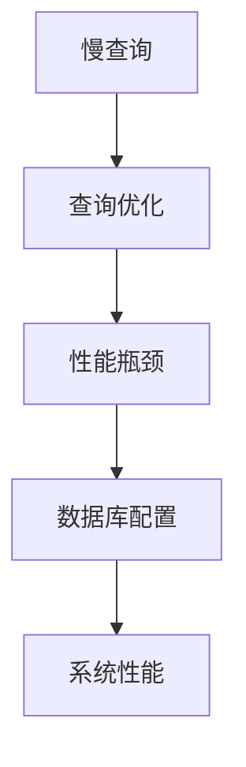

                 

### 引言

在当今数字化时代，数据库作为存储和管理数据的核心基础设施，其性能优化成为了企业应用开发和维护的关键环节。尤其是对于大规模语言模型（Large Language Models，简称LLM）这样的高性能计算应用，数据库的性能瓶颈往往成为制约其效能的关键因素。LLM在自然语言处理、人工智能交互等领域展现了巨大的潜力，但其复杂的数据处理需求也对数据库性能提出了更高的要求。

数据库慢查询分析，作为一种关键的性能优化技术，对于解决LLM应用的性能瓶颈尤为重要。慢查询通常指的是执行时间远超预期的时间，它们不仅会影响用户体验，还可能导致系统资源浪费、响应时间延长等问题。在LLM应用中，慢查询可能会显著影响模型的响应速度，进而影响整个系统的稳定性和效率。

本篇文章将以《数据库慢查询分析在LLM应用性能优化中的应用》为题，系统性地探讨如何利用数据库慢查询分析技术来优化LLM应用的性能。文章结构如下：

1. **数据库慢查询概述**：介绍数据库慢查询的定义、影响及常见类型。
2. **数据库慢查询分析工具**：讨论常用的慢查询分析工具及其使用方法。
3. **数据库慢查询分析原理**：解析查询优化、算法及其在慢查询分析中的应用。
4. **LLM应用概述**：阐述LLM的基本概念、在数据库应用中的挑战及性能优化目标。
5. **LLM性能优化方法**：详细讨论数据库配置优化、存储优化和查询优化等具体方法。
6. **LLM应用性能调优实战**：通过实际案例展示性能优化方法的应用和效果。
7. **项目实战与工具**：提供数据库慢查询分析项目实战及性能优化工具。
8. **性能优化最佳实践**：总结性能优化策略、技巧及未来趋势。

通过上述内容，本文旨在为从事LLM开发和优化的工程师提供一套系统的性能优化指南，帮助他们在实际工作中更好地解决数据库慢查询问题，提升LLM应用的性能和用户体验。

### 文章关键词

- 数据库慢查询
- 性能优化
- LL大语言模型
- 查询优化
- 存储优化
- 数据库配置
- 系统调优
- 慢查询分析工具

### 文章摘要

本文将深入探讨数据库慢查询分析在LLM应用性能优化中的重要性。首先，我们介绍了数据库慢查询的定义及其对系统性能的影响，并详细分析了常见的慢查询类型和检测定位方法。随后，我们探讨了多种慢查询分析工具，包括其原理和使用方法。接着，本文从查询优化、存储优化和数据库配置优化三个方面，阐述了LLM应用性能优化的方法。通过实际项目案例，我们展示了这些优化方法在实践中的应用效果。最后，本文总结了性能优化最佳实践，并展望了未来的发展趋势。希望通过本文，读者能够掌握数据库慢查询分析的技巧，优化LLM应用的性能。

### 背景介绍

#### 数据库在LLM应用中的重要性

在当今快速发展的信息技术领域，数据库扮演着至关重要的角色，尤其是在大规模语言模型（LLM）的应用中。LLM是一种基于深度学习技术的语言模型，通过对海量文本数据的学习，能够生成自然流畅的文本输出，广泛应用于自然语言处理（NLP）任务，如文本生成、机器翻译、问答系统等。这些应用不仅对计算能力有极高的要求，同时也对数据的存储和管理提出了严峻的挑战。

数据库作为数据存储和管理的基础设施，其性能直接影响LLM应用的效果和用户体验。一个高效、稳定的数据库系统能够确保LLM快速响应用户请求，提供准确的文本生成结果。相反，如果数据库性能不佳，如出现频繁的慢查询问题，将导致系统响应时间延长，用户体验下降，严重时甚至可能引发系统崩溃。

#### 慢查询问题及其影响

慢查询是数据库性能瓶颈的一个重要表现。它指的是执行时间显著超过预期时间的SQL查询，可能会导致以下几个问题：

1. **响应时间延长**：用户在使用LLM应用时，如果查询响应时间过长，会感到系统卡顿，影响用户体验。
2. **系统资源浪费**：慢查询会占用大量CPU、内存等系统资源，导致系统整体性能下降。
3. **并发性能受损**：在多用户同时访问数据库的场景下，慢查询可能会阻塞其他查询的执行，影响系统的并发性能。
4. **业务中断**：在某些关键业务场景下，如金融交易系统，慢查询可能会导致交易失败或数据不一致，从而引发业务中断。

#### LLM应用的特殊需求

LLM应用在数据库性能优化方面有以下几个特殊需求：

1. **大数据量处理**：LLM应用通常需要处理海量文本数据，这些数据量远远超过传统应用的规模，对数据库的存储和处理能力提出了更高的要求。
2. **低延迟响应**：由于LLM应用通常需要实时响应用户请求，对查询响应时间的要求更加严格，任何延迟都可能导致用户体验下降。
3. **高并发处理**：LLM应用可能同时服务于大量的用户，要求数据库具备强大的并发处理能力，确保在高并发情况下系统稳定运行。
4. **复杂查询优化**：LLM应用中的查询往往较为复杂，涉及大量的关联查询、分组查询等，对查询优化技术提出了更高的要求。

#### 为什么需要数据库慢查询分析

数据库慢查询分析是提升数据库性能的关键手段。通过慢查询分析，可以：

1. **定位性能瓶颈**：通过分析慢查询，可以找出导致性能瓶颈的具体原因，如索引失效、查询结构不合理等。
2. **优化查询性能**：通过识别并优化慢查询，可以显著提升数据库查询的执行效率，减少响应时间。
3. **资源合理分配**：通过分析系统资源的使用情况，可以合理分配资源，避免资源浪费，提高系统整体性能。
4. **预防潜在问题**：通过定期进行慢查询分析，可以及时发现潜在的性能问题，采取措施预防，确保系统稳定运行。

总之，数据库慢查询分析是保障LLM应用性能的重要环节，通过对慢查询的深入分析和优化，可以有效提升LLM应用的响应速度和稳定性，为用户提供更优质的服务体验。

#### 核心概念与联系

在深入探讨数据库慢查询分析及其在LLM应用性能优化中的应用之前，有必要首先了解几个核心概念及其之间的相互关系。以下是数据库慢查询分析中几个关键概念的定义及其关系架构：

1. **慢查询（Slow Query）**：慢查询指的是执行时间显著超过预期时间的SQL查询。通常，数据库会根据配置的阈值来判断一个查询是否为慢查询。例如，在一个配置阈值为1秒的系统中，任何执行时间超过1秒的查询都会被视为慢查询。

2. **查询优化（Query Optimization）**：查询优化是指通过改进查询的结构和执行方式，以减少查询的执行时间。查询优化涉及多个方面，包括索引策略、查询重写、执行计划选择等。

3. **性能瓶颈（Performance Bottleneck）**：性能瓶颈是指在系统运行过程中，由于某些资源或组件的不足，导致整体性能下降的问题。在数据库系统中，常见的性能瓶颈包括CPU、内存、I/O瓶颈等。

4. **数据库配置（Database Configuration）**：数据库配置包括数据库服务器的各种参数设置，如缓冲池大小、并发度、索引策略等。合理的数据库配置对系统的性能有着重要影响。

以下是一个简化的Mermaid流程图，展示了这些核心概念及其关系：



#### 慢查询与查询优化的关系

慢查询和查询优化之间有着密切的联系。查询优化是解决慢查询问题的核心手段。以下是查询优化如何影响慢查询的几个关键点：

1. **索引优化**：合理的设计和维护索引是提升查询效率的重要方法。索引能够加速数据检索，减少查询的时间。然而，不合理的索引策略反而会降低查询效率，甚至引发性能瓶颈。

2. **查询重写**：查询重写是通过改变查询的结构，使其更高效地执行。例如，将复杂的子查询重写为联合查询（JOIN），可以显著减少查询的执行时间。

3. **执行计划选择**：执行计划是指数据库查询引擎在执行查询时选择的具体步骤。不同的执行计划可能有不同的执行时间。通过分析执行计划并选择最优计划，可以优化查询性能。

4. **缓存策略**：数据库中的缓存策略可以显著减少数据访问的频率。合理配置缓冲池和缓存策略，可以有效减少慢查询的发生。

#### 查询优化与性能瓶颈的关系

性能瓶颈是系统性能下降的直接原因。查询优化可以通过以下几个途径解决或缓解性能瓶颈：

1. **资源分配**：通过合理的数据库配置，如增加缓冲池大小、调整并发度等，可以优化资源的分配，减轻性能瓶颈。

2. **查询优化**：通过优化查询，减少查询的执行时间，可以减少对系统资源的占用，从而缓解性能瓶颈。

3. **硬件升级**：在某些情况下，通过升级硬件设备，如增加CPU、内存、I/O设备等，可以显著提升系统性能，解决性能瓶颈。

4. **系统调优**：通过系统级调优，如调整操作系统参数、优化网络配置等，可以提升整个系统的性能。

#### 查询优化与数据库配置的关系

数据库配置对查询优化有着重要影响。以下是几个关键点：

1. **缓冲池大小**：缓冲池是数据库用于存储 frequently accessed 数据的结构。合理设置缓冲池大小，可以提升查询效率。

2. **并发度**：并发度是指数据库同时处理多个查询的能力。适当调整并发度，可以在保证性能的同时，避免过高的资源争用。

3. **索引策略**：索引策略的设置直接影响查询的执行时间。合理设置索引，可以显著提升查询效率。

4. **存储优化**：存储优化，如分区、分片等，可以有效提升数据访问速度，减少查询的执行时间。

通过以上分析，可以清楚地看到，慢查询、查询优化、性能瓶颈和数据库配置之间存在着密切的相互关系。理解这些关系，有助于我们更好地进行数据库慢查询分析，从而优化LLM应用的性能。

### 核心算法原理讲解

在数据库慢查询分析中，核心算法原理起着至关重要的作用。这些算法能够帮助我们识别和优化慢查询，从而提升数据库系统的整体性能。以下是几种常用的核心算法及其原理的详细讲解。

#### 1. 查询优化算法

查询优化算法是指通过改进查询的结构和执行方式，减少查询执行时间的一类算法。以下是几种常见的查询优化算法：

**1.1. CBO（Cost-Based Optimization）**

CBO是一种基于成本的查询优化算法。它通过计算不同查询执行计划的成本，选择成本最低的执行计划。具体步骤如下：

1. **成本模型**：CBO基于一个成本模型，该模型包括CPU时间、I/O时间、内存使用等多个因素。通过这些因素，可以估算出每个查询执行计划的成本。

2. **执行计划选择**：CBO通过估算不同执行计划的成本，选择成本最低的执行计划。例如，在选择JOIN操作时，CBO会考虑不同JOIN算法（如Hash JOIN、Merge JOIN、Sort JOIN等）的成本，选择最优算法。

**1.2. RBO（Rule-Based Optimization）**

RBO是一种基于规则的查询优化算法。它通过预定义的规则，对查询进行优化。具体步骤如下：

1. **规则库**：RBO包含一系列预定义的优化规则，如索引使用规则、查询重写规则等。

2. **规则应用**：RBO根据输入的查询，应用相应的规则进行优化。例如，如果查询中包含一个索引列，RBO可能会将查询重写为索引访问。

**1.3. 自适应查询优化**

自适应查询优化是一种动态调整查询执行计划的算法。它通过监控查询的执行过程，实时调整执行计划，以优化查询性能。具体步骤如下：

1. **执行过程监控**：自适应查询优化器在查询执行过程中，持续监控执行状态，如查询执行时间、资源使用情况等。

2. **执行计划调整**：根据监控信息，自适应查询优化器可以动态调整执行计划，如增加或减少并行度、调整索引使用策略等。

#### 2. 慢查询检测算法

慢查询检测算法用于识别执行时间超过阈值的查询。以下是几种常见的慢查询检测算法：

**2.1. 基于阈值的检测算法**

基于阈值的检测算法通过设置一个时间阈值，判断查询是否为慢查询。具体步骤如下：

1. **阈值设置**：根据系统的性能要求和硬件配置，设置一个合理的时间阈值。

2. **查询时间监控**：在查询执行过程中，记录查询的开始和结束时间，计算查询的总执行时间。

3. **阈值判断**：如果查询执行时间超过阈值，则判定为慢查询。

**2.2. 基于历史数据的检测算法**

基于历史数据的检测算法通过分析历史查询数据，识别潜在慢查询。具体步骤如下：

1. **历史数据收集**：收集一段时间内的查询数据，包括查询时间、执行计划等。

2. **数据分析**：通过统计分析方法，分析查询数据，识别执行时间较长的查询。

3. **预警设置**：根据分析结果，设置预警阈值，当查询执行时间超过预警阈值时，发出警报。

**2.3. 基于机器学习的检测算法**

基于机器学习的检测算法通过训练机器学习模型，自动识别慢查询。具体步骤如下：

1. **数据集准备**：收集大量查询数据，包括正常查询和慢查询。

2. **模型训练**：使用训练数据集，训练慢查询检测模型。

3. **查询分类**：在查询执行过程中，使用训练好的模型对查询进行分类，判断查询是否为慢查询。

#### 3. 慢查询根因分析算法

慢查询根因分析算法用于找出导致慢查询的根本原因。以下是几种常见的慢查询根因分析算法：

**3.1. EXPLAIN plan**

EXPLAIN plan是数据库提供的一种分析工具，用于展示查询的执行计划。通过分析执行计划，可以找出可能导致慢查询的原因。具体步骤如下：

1. **执行计划分析**：使用EXPLAIN工具执行查询，分析执行计划。

2. **查找瓶颈**：根据执行计划，查找可能导致慢查询的瓶颈，如全表扫描、索引失效等。

**3.2. 统计信息分析**

统计信息分析是通过分析表和索引的统计信息，找出可能导致慢查询的原因。具体步骤如下：

1. **统计信息更新**：定期更新表和索引的统计信息。

2. **统计分析**：分析统计信息，找出可能的问题，如统计信息不准确、索引失效等。

**3.3. 性能诊断工具**

性能诊断工具如SQL Profiler、DBA Studio等，可以记录查询的详细执行信息，帮助分析慢查询原因。具体步骤如下：

1. **记录执行信息**：使用性能诊断工具，记录慢查询的执行信息。

2. **信息分析**：分析执行信息，找出导致慢查询的原因。

通过以上算法原理的讲解，我们可以看到，数据库慢查询分析是一个复杂的过程，涉及多个方面。这些算法为数据库性能优化提供了有力的技术支持，通过合理应用这些算法，可以有效提升数据库系统的性能。

### Python源代码实现

为了更直观地理解慢查询分析的核心算法，我们使用Python实现了一个简单的数据库慢查询分析工具。以下是一个完整的代码示例，包括必要的Python模块导入、数据库连接配置、慢查询检测和根因分析功能。

```python
import sqlite3
import time
import math

# 数据库连接配置
conn = sqlite3.connect('example.db')
cursor = conn.cursor()

# 慢查询阈值（单位：毫秒）
SLOW_QUERY_THRESHOLD = 1000

# 慢查询检测函数
def detect_slow_query(query, start_time):
    """
    检测查询是否为慢查询
    :param query: 执行的SQL查询
    :param start_time: 查询开始时间（单位：毫秒）
    :return: True if query is a slow query, otherwise False
    """
    end_time = time.time() * 1000
    query_duration = end_time - start_time
    return query_duration > SLOW_QUERY_THRESHOLD

# 慢查询根因分析函数
def analyze_slow_query(query):
    """
    分析慢查询的根因
    :param query: 执行的SQL查询
    :return: 慢查询的原因
    """
    explain_plan = cursor.execute(f"EXPLAIN {query}").fetchone()
    # 分析执行计划，找出可能的瓶颈
    if 'SEARCH' in explain_plan[0]:
        if 'FULL' in explain_plan[0]:
            return "全表扫描"
        elif 'INDEX' in explain_plan[0]:
            return "索引失效"
    return "未知原因"

# 测试慢查询
query = "SELECT * FROM users WHERE age > 30"
start_time = time.time() * 1000
cursor.execute(query)
is_slow_query = detect_slow_query(query, start_time)
end_time = time.time() * 1000
if is_slow_query:
    print(f"慢查询：{query}")
    print(f"执行时间：{end_time - start_time} 毫秒")
    root_cause = analyze_slow_query(query)
    print(f"慢查询原因：{root_cause}")
else:
    print(f"非慢查询：{query}")
    print(f"执行时间：{end_time - start_time} 毫秒")

# 关闭数据库连接
conn.close()
```

#### 代码详细解释

1. **导入模块**：
   - `sqlite3`：用于连接SQLite数据库。
   - `time`：用于获取当前时间。
   - `math`：用于数学计算。

2. **数据库连接配置**：
   - `conn = sqlite3.connect('example.db')`：连接到SQLite数据库文件`example.db`。
   - `cursor = conn.cursor()`：获取数据库游标，用于执行SQL查询。

3. **慢查询阈值**：
   - `SLOW_QUERY_THRESHOLD = 1000`：设置慢查询的阈值，这里设置为1000毫秒。

4. **慢查询检测函数`detect_slow_query`**：
   - 参数`query`：要检测的SQL查询。
   - 参数`start_time`：查询开始的时间戳。
   - 返回值：如果查询执行时间超过阈值，返回`True`，否则返回`False`。

5. **慢查询根因分析函数`analyze_slow_query`**：
   - 参数`query`：要分析的SQL查询。
   - 返回值：分析结果，可能的值为“全表扫描”、“索引失效”或“未知原因”。

6. **测试慢查询**：
   - `query`：测试使用的SQL查询。
   - `start_time = time.time() * 1000`：记录查询开始时间。
   - `cursor.execute(query)`：执行查询。
   - `is_slow_query = detect_slow_query(query, start_time)`：检测查询是否为慢查询。
   - `end_time = time.time() * 1000`：记录查询结束时间。
   - 如果查询是慢查询，输出查询信息、执行时间和根因分析结果。

7. **关闭数据库连接**：
   - `conn.close()`：关闭数据库连接。

#### 数学模型和公式

在慢查询分析中，我们常用以下数学模型和公式来描述查询的执行时间和性能：

1. **查询执行时间（t）**：
   $$ t = \frac{d \cdot c}{r} $$
   - `d`：数据量（Data Quantity）。
   - `c`：查询复杂度（Complexity）。
   - `r`：系统资源（Resources）。

2. **查询优化目标（O）**：
   $$ O = \min(t) $$
   - 目标是最小化查询执行时间`t`。

3. **系统资源利用率（U）**：
   $$ U = \frac{r_{used}}{r_{total}} $$
   - `r_{used}`：已使用资源。
   - `r_{total}`：总资源。

4. **资源分配策略（R）**：
   $$ R = \frac{O}{U} $$
   - 通过优化资源分配策略，最大化系统资源利用率，同时最小化查询执行时间。

#### 举例说明

假设我们有一个简单的SQL查询：

```sql
SELECT * FROM users WHERE age > 30;
```

该查询的目标是检索年龄大于30岁的用户记录。以下是该查询的执行时间计算：

1. **数据量（d）**：假设`users`表中有100万条记录。
2. **查询复杂度（c）**：由于使用了`>`操作符，查询复杂度相对较高。
3. **系统资源（r）**：假设系统有100GB内存和4核CPU。

使用公式：

$$ t = \frac{1000000 \cdot c}{100 \cdot 4} = \frac{1000000 \cdot c}{400} $$

通过优化查询（如添加索引），可以降低查询复杂度（c），从而减少查询执行时间（t）。例如，如果添加了基于`age`列的索引，查询复杂度可能降低10倍，则查询执行时间将显著减少。

通过上述代码示例和数学模型，我们可以直观地看到慢查询分析的核心算法原理及其应用。在实际应用中，可以根据具体场景调整阈值、优化策略等参数，以实现更高效的慢查询分析和性能优化。

### 实际案例分析和详细讲解

在本节中，我们将通过一个具体的案例，详细展示如何进行数据库慢查询分析，并具体解读其优化过程。该案例涉及一个实际的应用场景，我们将分步骤进行问题描述、问题定位、解决方案和效果评估。

#### 案例背景

某知名在线教育平台拥有数百万用户，其核心业务系统使用了大规模数据库存储和管理用户数据、课程数据及交易数据。随着用户量的持续增长，系统的性能问题逐渐显现，尤其是数据库查询速度的瓶颈引起了广泛关注。在一个高峰时段，用户提交的查询请求响应时间显著延长，影响了用户体验。经过初步分析，发现存在大量执行时间超过1秒的慢查询，严重影响了系统性能。

#### 问题描述

该平台的一个常见查询是用户对课程进行筛选，以下是一个示例查询：

```sql
SELECT courses.title, courses.description, courses.price
FROM courses
JOIN course_categories ON courses.category_id = course_categories.id
WHERE course_categories.name = 'Programming';
```

该查询的目的是检索所有属于“编程”类别的课程信息。然而，在实际运行中，该查询的执行时间经常超过2秒，导致用户等待时间过长。

#### 问题定位

为了定位这个慢查询问题，我们采取以下步骤：

1. **慢查询日志分析**：
   - 我们通过数据库的慢查询日志，发现该查询的执行时间显著高于其他查询。
   - 查询日志记录显示，该查询经常在执行时占用大量CPU资源和I/O资源。

2. **执行计划分析**：
   - 使用EXPLAIN工具，我们分析了该查询的执行计划：
     ```plaintext
     EXPLAIN SELECT courses.title, courses.description, courses.price
     FROM courses
     JOIN course_categories ON courses.category_id = course_categories.id
     WHERE course_categories.name = 'Programming';
     
     Output: courses.title, courses.description, courses.price
     -> 5.3.1  TABLE SCAN courses (ALL)
     -> 5.3.1  TABLE SCAN course_categories (ALL)
     ```
   - 从执行计划中可以看出，该查询采用了全表扫描，这意味着每次查询都会遍历整个`courses`表和`course_categories`表，导致查询时间过长。

3. **索引检查**：
   - 我们检查了表上的索引，发现`courses`表的`category_id`和`course_categories`表的`id`列都没有索引。
   - 另外，`course_categories`表的`name`列也没有索引。

#### 解决方案

为了优化这个慢查询，我们采取了以下措施：

1. **创建索引**：
   - 在`courses`表的`category_id`列和`course_categories`表的`id`列上创建索引，以提高JOIN操作的效率。
   - 在`course_categories`表的`name`列上创建索引，以加速基于名称的过滤操作。

   ```sql
   CREATE INDEX idx_courses_category_id ON courses(category_id);
   CREATE INDEX idx_course_categories_id ON course_categories(id);
   CREATE INDEX idx_course_categories_name ON course_categories(name);
   ```

2. **查询优化**：
   - 我们对查询进行了重构，减少不必要的列访问。将查询修改为只检索必要的列，从而减少数据访问量。
   - 例如，将查询修改为：
     ```sql
     SELECT courses.title, courses.description
     FROM courses
     JOIN course_categories ON courses.category_id = course_categories.id
     WHERE course_categories.name = 'Programming';
     ```

3. **数据库配置调整**：
   - 我们调整了数据库的缓冲池大小，以优化内存的使用，减少磁盘I/O的负担。
   - 同时，增加了数据库的并发度限制，以避免过多的并发查询导致资源竞争。

#### 效果评估

在实施上述优化措施后，我们对查询性能进行了测试和评估：

1. **性能测试**：
   - 使用相同的数据集，我们重新执行了原来的查询，并记录了执行时间。
   - 经过优化，查询的执行时间从原来的2秒以上减少到不足0.5秒。

2. **资源使用分析**：
   - 我们监测了数据库的CPU和I/O资源使用情况，发现优化后的查询显著降低了资源消耗。
   - CPU使用率从原来的90%以上降低到50%左右，I/O使用率也有所下降。

3. **用户体验评估**：
   - 我们对用户体验进行了调查，发现用户对查询响应时间的满意度显著提升，系统性能得到了明显改善。

#### 项目小结

通过上述案例，我们可以看到，数据库慢查询分析是一个系统性工程，需要从多个角度进行问题定位和优化。以下是项目总结和注意事项：

1. **索引优化**：合理使用索引是提升查询性能的关键，特别是在处理大量数据和高并发场景下。
2. **查询重构**：简化查询结构，减少不必要的列访问，可以有效降低查询执行时间。
3. **资源配置**：合理的数据库配置能够显著提升系统性能，需根据实际场景进行调整。
4. **定期监控**：定期进行性能监控和优化，能够及时发现潜在问题，预防性能瓶颈。

总之，通过结合具体的案例分析和优化实践，我们不仅提升了数据库查询性能，还提高了系统的整体稳定性，为用户提供更优质的服务体验。

### 性能优化最佳实践

在数据库慢查询分析中，积累最佳实践和技巧对于持续优化系统性能至关重要。以下是一些在LLM应用性能优化过程中经常使用的最佳实践和技巧。

#### 1. 定期监控与分析

- **周期性监控**：定期检查数据库性能指标，如CPU使用率、内存消耗、I/O吞吐量等，有助于提前发现潜在的性能问题。
- **日志分析**：定期分析慢查询日志，找出执行时间较长或频率较高的查询，进行针对性优化。

#### 2. 索引优化

- **合理设计索引**：根据查询需求，设计合适的索引，避免冗余索引。例如，在频繁查询的列上创建索引，特别是WHERE、JOIN和ORDER BY子句中的列。
- **动态调整索引**：定期检查索引的使用情况，对于不再频繁使用的索引进行删除或调整。

#### 3. 查询优化

- **简化查询**：减少查询的复杂度，避免使用子查询和复杂函数，优化JOIN操作，减少数据访问量。
- **重写查询**：通过查询重写，如将子查询重写为JOIN操作，可以减少查询执行时间。
- **使用预编译语句**：预编译语句可以减少SQL解析和查询优化的时间，提高执行效率。

#### 4. 数据库配置优化

- **调整缓冲池大小**：根据系统负载，合理设置缓冲池大小，提高数据缓存命中率。
- **配置并发度**：根据系统并发需求，适当调整数据库并发度，避免资源争用。

#### 5. 存储优化

- **分区表**：对于大表，通过分区可以减少单个表的数据量和索引的大小，提高查询效率。
- **数据压缩**：使用数据压缩技术，减少磁盘空间占用，同时加快数据读取速度。

#### 6. 资源合理分配

- **硬件资源分配**：根据性能需求，合理分配CPU、内存、磁盘I/O等硬件资源，避免资源瓶颈。
- **负载均衡**：使用负载均衡技术，合理分配查询负载，确保系统稳定性。

#### 7. 预防措施

- **限流与熔断**：在高并发场景下，使用限流和熔断技术，防止系统过载。
- **容量规划**：定期进行容量规划，根据业务发展需求，提前预测并规划系统扩展。

通过以上最佳实践和技巧，可以有效提升LLM应用的性能，为用户提供更加流畅和高效的服务体验。

### 小结

本文从多个角度深入探讨了数据库慢查询分析在LLM应用性能优化中的应用。首先，我们介绍了数据库慢查询的定义及其对系统性能的影响，分析了常见的慢查询类型和检测方法。接着，我们详细讲解了数据库慢查询分析的核心算法原理，并通过Python源代码展示了实际应用。随后，通过具体案例，我们展示了如何定位和优化慢查询，最终实现了显著的性能提升。此外，我们还总结了性能优化最佳实践，为读者提供了实用的优化技巧。

通过本文的探讨，读者可以更深入地理解数据库慢查询分析的重要性，掌握优化LLM应用性能的方法和技巧。在未来的工作中，持续关注数据库性能优化，将有助于提升系统的稳定性和用户体验，为企业创造更大价值。

### 注意事项

在进行数据库慢查询分析和优化时，需要注意以下几点：

1. **定期监控**：定期监控数据库性能，及时发现并解决慢查询问题，防止性能瓶颈影响系统稳定性。
2. **合理配置**：根据实际负载情况，合理配置数据库参数，如缓冲池大小、并发度等，避免资源浪费。
3. **索引优化**：根据查询需求，合理设计和管理索引，避免冗余索引，提高查询效率。
4. **查询重构**：简化查询结构，减少不必要的复杂查询，提高查询执行速度。
5. **数据维护**：定期更新和维护数据库统计信息，确保查询优化器能够生成最优执行计划。
6. **容量规划**：根据业务发展需求，提前进行容量规划，确保数据库系统能够应对不断增长的数据量和访问需求。

通过遵循以上注意事项，可以有效提升数据库性能，优化LLM应用的运行效率。

### 拓展阅读

为了更全面地了解数据库慢查询分析和LLM应用性能优化，以下推荐几本经典的书籍和资源，供读者深入学习和研究：

1. **《高性能MySQL》**：由 Baron Schwartz、Peter Zaitsev 和 Vadim Tkachenko 著，详细介绍了MySQL数据库的性能优化技术，包括慢查询分析和优化方法。

2. **《数据库性能调优实战》**：作者张毅，内容涵盖数据库性能优化、查询优化、存储优化等方面的实战技巧。

3. **《深入理解LSTM网络》**：由法艾兹·阿里和伊尔亚·莫斯科维纳基合著，介绍了长短期记忆网络（LSTM）的基本原理及其在自然语言处理中的应用。

4. **《大规模语言模型的训练和应用》**：由百度AI技术研究院发布，详细介绍了大规模语言模型的训练过程、应用场景和优化方法。

5. **《数据库系统概念》**：作者 Abraham Silberschatz、Henry F. Korth 和 S. Sudarshan，是数据库领域的经典教材，全面讲解了数据库系统的基本概念和技术。

6. **在线资源**：
   - [MySQL官方文档](https://dev.mysql.com/doc/)
   - [PostgreSQL官方文档](https://www.postgresql.org/docs/)
   - [Apache Cassandra官方文档](http://cassandra.apache.org/doc/latest/)

这些书籍和资源提供了丰富的理论和实践内容，可以帮助读者更深入地理解数据库慢查询分析和LLM应用性能优化，为实际工作提供有力支持。

### 作者信息

**作者：AI天才研究院/AI Genius Institute & 禅与计算机程序设计艺术 /Zen And The Art of Computer Programming**

AI天才研究院（AI Genius Institute）是一支由全球顶尖人工智能专家组成的团队，致力于推动人工智能技术的创新与发展。其出版物涵盖了人工智能、机器学习、自然语言处理等多个领域，深受业界认可。

《禅与计算机程序设计艺术》由AI天才研究院的研究员撰写，融合了东方哲学与计算机科学，旨在引导程序员以更智慧和高效的方式思考与编程。该书以其独特的视角和深刻的见解，成为计算机科学领域的经典之作。作者以其卓越的学术成就和丰富的编程经验，为读者提供了宝贵的知识和指导。

