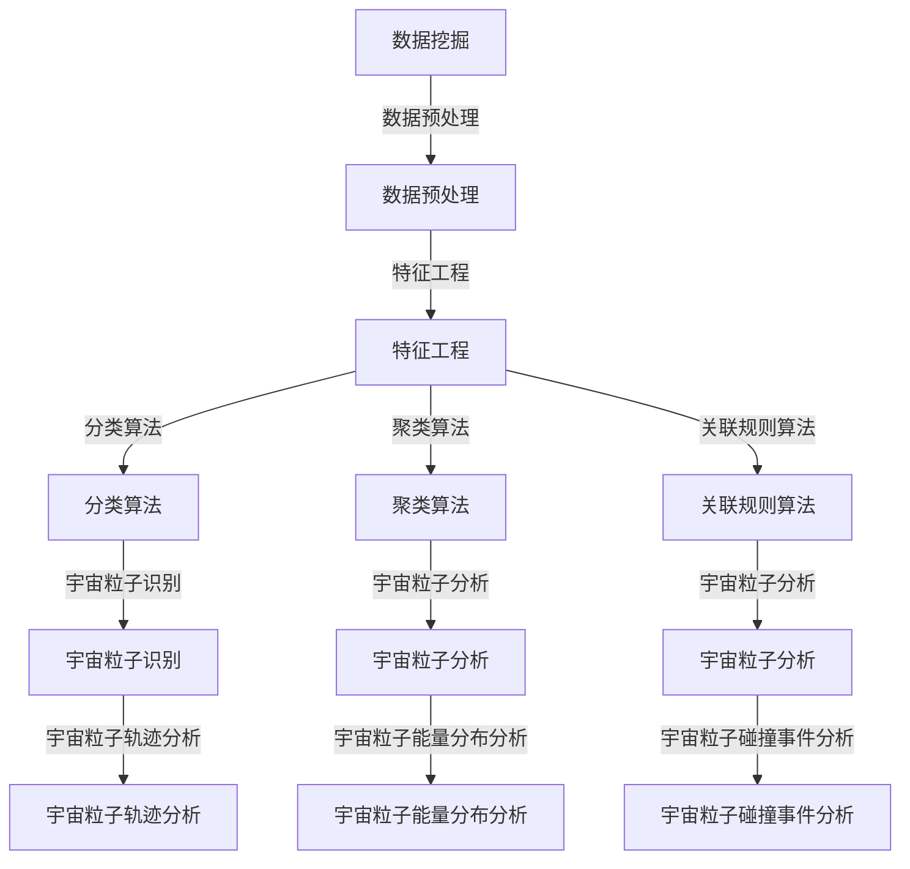

                 

### 引言

在当今科技飞速发展的时代，宇宙探索成为了人类智慧的极致挑战。宇宙中充满了无数未解之谜，例如暗物质、暗能量以及宇宙新粒子的存在。而数据挖掘作为一种强大且有效的数据分析技术，正在逐步在宇宙粒子研究中发挥重要作用。本文将详细探讨数据挖掘在发现宇宙新粒子中的作用，旨在通过逻辑清晰、结构紧凑的分析，使读者能够深入理解这一前沿技术。

宇宙粒子研究是一个庞大而复杂的领域，其中涉及大量的数据和复杂的分析过程。科学家们通过观测和实验收集了大量的宇宙粒子数据，这些数据不仅包含了宇宙粒子的基本特征，还记录了它们之间的相互作用和运动轨迹。然而，如何从这些海量数据中提取有用信息，发现新的宇宙粒子，成为了科学家们亟待解决的难题。这便是数据挖掘技术所能发挥的关键作用。

数据挖掘是一种从大量数据中提取有用信息的方法，它利用各种算法和统计方法，帮助科学家从复杂的数据集中发现隐藏的模式、关联和规律。在宇宙粒子研究中，数据挖掘不仅能够帮助科学家们更好地理解宇宙粒子的行为和特性，还能够发现新的宇宙粒子，为宇宙学理论的发展提供重要依据。

本文将从以下几个方面展开讨论：

1. **数据挖掘的基本概念和方法**：介绍数据挖掘的基本概念，包括数据预处理、特征工程、常见数据挖掘算法等，以及这些方法在宇宙粒子研究中的应用。
  
2. **数据挖掘在宇宙粒子研究中的应用**：详细分析数据挖掘在宇宙粒子识别和分析中的应用，包括分类算法、聚类算法、关联规则算法等，以及它们在宇宙粒子研究中的具体应用实例。

3. **案例研究和实际应用**：通过实际案例，展示数据挖掘在宇宙粒子研究中的成功应用，分析其挑战和解决方案。

4. **未来展望和挑战**：探讨数据挖掘在宇宙粒子研究中的未来发展趋势和面临的挑战。

### 核心概念与联系

在讨论数据挖掘在宇宙粒子研究中的应用之前，我们需要明确几个核心概念，并理解它们之间的联系。以下是数据挖掘在宇宙粒子研究中几个关键概念及其关系的架构图：



- **数据预处理**：数据预处理是数据挖掘过程中的第一步，它包括数据清洗、数据集成和数据转换等操作。在宇宙粒子研究中，数据预处理旨在确保数据的质量和一致性，以便后续的特征工程和数据分析。

- **特征工程**：特征工程是数据挖掘中的关键步骤，它涉及从原始数据中提取出对分析任务有用的特征，并进行选择和降维。在宇宙粒子研究中，特征工程可以帮助识别出宇宙粒子的关键属性，如质量、速度和能量分布等。

- **分类算法**：分类算法是一种常见的监督学习算法，用于将数据分为不同的类别。在宇宙粒子识别中，分类算法可以帮助科学家根据宇宙粒子的特征将它们分类到不同的粒子类型。

- **聚类算法**：聚类算法是一种无监督学习算法，它根据数据的相似性将数据分为不同的组。在宇宙粒子分析中，聚类算法可以帮助科学家发现宇宙粒子的分布模式和聚集行为。

- **关联规则算法**：关联规则算法用于发现数据集中的关联关系，它可以帮助科学家发现宇宙粒子之间的相互作用和关联。

通过上述概念及其关系的架构图，我们可以更清晰地理解数据挖掘在宇宙粒子研究中的应用过程。接下来，我们将逐步深入探讨这些概念，并展示它们在实际应用中的具体实现。

### 数据挖掘的基本概念和方法

数据挖掘（Data Mining）是一种从大量数据中自动发现有价值信息、隐藏模式和知识的技术，广泛应用于各个领域，如商业智能、医疗健康、金融分析和科学研究等。在宇宙粒子研究中，数据挖掘技术同样发挥着关键作用，通过处理和分析海量的宇宙粒子数据，科学家们能够发现新的粒子类型、揭示宇宙粒子的行为规律，从而推动宇宙学的发展。

#### 数据预处理

数据预处理是数据挖掘过程中的第一步，也是至关重要的一步。它的目的是确保数据的质量和一致性，为后续的特征工程和数据分析奠定基础。数据预处理通常包括以下几个步骤：

1. **数据清洗**：数据清洗是指处理数据中的错误、缺失、异常和重复值。在宇宙粒子研究中，数据清洗尤为关键，因为宇宙粒子数据可能受到各种噪声和误差的影响。例如，观测数据中的错误读数、仪器故障导致的数据缺失等。通过数据清洗，可以去除这些噪声和错误，提高数据质量。

2. **数据集成**：数据集成是指将来自不同源的数据合并成统一的格式。在宇宙粒子研究中，科学家们可能会收集到来自不同观测设备和不同时间点的数据，这些数据通常具有不同的结构和格式。数据集成旨在将这些数据整合成统一的格式，以便后续处理。

3. **数据转换和归一化**：数据转换和归一化是指将数据转换为适合分析和挖掘的格式。例如，将不同单位的数据转换为同一单位，或将分类数据转换为数值表示。在宇宙粒子研究中，数据转换和归一化有助于统一数据格式，提高数据的一致性。

#### 特征工程

特征工程（Feature Engineering）是数据挖掘中的关键步骤，它涉及从原始数据中提取出对分析任务有用的特征，并进行选择和降维。在宇宙粒子研究中，特征工程有助于识别宇宙粒子的关键属性，从而提高数据挖掘的效果。

1. **特征提取**：特征提取是指从原始数据中提取出新的特征，这些特征可以更好地描述宇宙粒子的属性。例如，从宇宙粒子轨迹数据中提取速度、加速度等动态特征，或者从宇宙粒子能量数据中提取能量分布特征。

2. **特征选择**：特征选择是指从提取出的特征中选出最有用的特征，以减少数据维度和提高模型性能。在宇宙粒子研究中，特征选择有助于减少计算复杂度，提高算法的准确性和效率。常见的特征选择方法包括基于信息增益、基于距离度量等。

3. **特征降维**：特征降维是指通过降维技术减少数据维度，以提高计算效率和模型性能。在宇宙粒子研究中，特征降维有助于处理高维数据，提高数据分析的速度和效果。常见的降维技术包括主成分分析（PCA）、线性判别分析（LDA）等。

#### 常见数据挖掘算法

在宇宙粒子研究中，常用的数据挖掘算法包括分类算法、聚类算法和关联规则算法等。这些算法在数据挖掘过程中发挥着重要作用，能够帮助科学家发现宇宙粒子的模式和规律。

1. **分类算法**：分类算法是一种常见的监督学习算法，用于将数据分为不同的类别。在宇宙粒子研究中，分类算法可以帮助科学家根据宇宙粒子的特征将它们分类到不同的粒子类型。常见的分类算法包括支持向量机（SVM）、决策树（DT）、随机森林（RF）等。

2. **聚类算法**：聚类算法是一种无监督学习算法，用于将数据分为不同的组。在宇宙粒子研究中，聚类算法可以帮助科学家发现宇宙粒子的分布模式和聚集行为。常见的聚类算法包括K-均值（KM）、层次聚类（HC）、DBSCAN等。

3. **关联规则算法**：关联规则算法用于发现数据集中的关联关系。在宇宙粒子研究中，关联规则算法可以帮助科学家发现宇宙粒子之间的相互作用和关联。常见的关联规则算法包括Apriori算法、Eclat算法等。

#### 数据挖掘流程

数据挖掘流程通常包括以下几个步骤：

1. **数据收集**：收集用于数据挖掘的原始数据，这些数据可以是结构化数据、半结构化数据或非结构化数据。

2. **数据预处理**：对收集到的数据进行预处理，包括数据清洗、数据集成和数据转换等操作。

3. **特征工程**：对预处理后的数据进行特征工程，包括特征提取、特征选择和特征降维等操作。

4. **模型选择**：选择适合的数据挖掘算法，根据具体任务需求选择分类算法、聚类算法或关联规则算法等。

5. **模型训练与评估**：使用训练数据对选定的模型进行训练，并通过交叉验证等方法对模型进行评估。

6. **结果分析**：分析模型的输出结果，提取有用的模式和知识。

7. **迭代优化**：根据分析结果对模型进行迭代优化，以提高模型的性能。

通过上述数据挖掘的基本概念和方法，我们可以看到，数据挖掘技术在宇宙粒子研究中具有广泛的应用前景。在接下来的部分，我们将进一步探讨数据挖掘在宇宙粒子识别和分析中的应用，并通过实际案例展示其具体实现和效果。

### 数据挖掘在宇宙粒子研究中的应用

在宇宙粒子研究中，数据挖掘技术具有广泛的应用。通过分类、聚类和关联规则算法，科学家们可以从海量宇宙粒子数据中提取有用信息，发现新的宇宙粒子，揭示宇宙粒子的行为规律。以下将详细探讨数据挖掘在宇宙粒子识别和分析中的应用，包括具体算法、实现过程和实际案例。

#### 分类算法在宇宙粒子识别中的应用

分类算法是一种常见的监督学习算法，它通过训练模型将数据划分为不同的类别。在宇宙粒子识别中，分类算法可以帮助科学家根据宇宙粒子的特征将它们分类到不同的粒子类型。

1. **支持向量机（SVM）**：SVM是一种强大的分类算法，通过寻找最优超平面来分隔不同类别的数据点。在宇宙粒子识别中，SVM可以用来分类不同的粒子类型。例如，将宇宙射线中的正电子和负电子区分开来。

   ```python
   from sklearn.svm import SVC
   from sklearn.model_selection import train_test_split
   from sklearn.metrics import accuracy_score
   
   # 假设我们已经有了一个宇宙粒子数据集X和标签y
   X_train, X_test, y_train, y_test = train_test_split(X, y, test_size=0.3, random_state=42)
   
   # 使用SVM进行分类
   svm_model = SVC(kernel='linear')
   svm_model.fit(X_train, y_train)
   
   # 预测测试集
   y_pred = svm_model.predict(X_test)
   
   # 评估模型性能
   print("Accuracy:", accuracy_score(y_test, y_pred))
   ```

2. **随机森林（Random Forest）**：随机森林是一种集成学习方法，通过构建多棵决策树来提高分类准确性。在宇宙粒子识别中，随机森林可以用来处理高维数据和噪声数据，提高分类效果。

   ```python
   from sklearn.ensemble import RandomForestClassifier
   from sklearn.metrics import classification_report
   
   # 使用随机森林进行分类
   rf_model = RandomForestClassifier(n_estimators=100, random_state=42)
   rf_model.fit(X_train, y_train)
   
   # 预测测试集
   y_pred = rf_model.predict(X_test)
   
   # 评估模型性能
   print(classification_report(y_test, y_pred))
   ```

#### 聚类算法在宇宙粒子分析中的应用

聚类算法是一种无监督学习算法，它根据数据点之间的相似性将数据分为不同的组。在宇宙粒子分析中，聚类算法可以帮助科学家发现宇宙粒子的分布模式和聚集行为。

1. **K-均值聚类（K-Means）**：K-均值聚类是一种常用的聚类算法，通过最小化数据点到聚类中心的距离平方和来划分数据。在宇宙粒子分析中，K-均值聚类可以用来分析宇宙粒子的空间分布。

   ```python
   from sklearn.cluster import KMeans
   from sklearn.metrics import silhouette_score
   
   # 使用K-均值聚类
   kmeans = KMeans(n_clusters=3, random_state=42)
   kmeans.fit(X_train)
   
   # 聚类结果
   labels = kmeans.predict(X_test)
   
   # 评估聚类效果
   print("Silhouette Score:", silhouette_score(X_test, labels))
   ```

2. **层次聚类（Hierarchical Clustering）**：层次聚类是一种基于层次结构的聚类算法，它通过逐步合并或分裂数据点来构建聚类层次。在宇宙粒子分析中，层次聚类可以用来探索宇宙粒子的层次分布模式。

   ```python
   from sklearn.cluster import AgglomerativeClustering
   
   # 使用层次聚类
   hc = AgglomerativeClustering(n_clusters=3)
   hc.fit(X_train)
   
   # 聚类结果
   labels = hc.labels_
   
   # 评估聚类效果
   print("Cluster Labels:", labels)
   ```

#### 关联规则算法在宇宙粒子分析中的应用

关联规则算法用于发现数据集中的关联关系，可以帮助科学家发现宇宙粒子之间的相互作用和关联。在宇宙粒子分析中，关联规则算法可以用来分析宇宙粒子碰撞事件中的关联关系。

1. **Apriori算法**：Apriori算法是一种经典的关联规则挖掘算法，通过逐层搜索候选集来发现频繁项集。在宇宙粒子分析中，Apriori算法可以用来发现宇宙粒子碰撞事件中的频繁关联关系。

   ```python
   from mlxtend.frequent_patterns import apriori
   from mlxtend.frequent_patterns import association_rules
   
   # 假设我们已经有了一个宇宙粒子碰撞事件的数据集
   transaction_data = [[1, 2, 3], [2, 3, 4], [3, 4, 5], [1, 2, 4]]
   
   # 使用Apriori算法找到频繁项集
   frequent_itemsets = apriori(transaction_data, min_support=0.5, use_colnames=True)
   
   # 使用频繁项集生成关联规则
   rules = association_rules(frequent_itemsets, metric="support", min_threshold=0.7)
   
   # 输出关联规则
   print(rules)
   ```

通过上述算法和实例，我们可以看到数据挖掘技术在宇宙粒子识别和分析中的应用是如何实现的。这些算法不仅能够帮助科学家从海量数据中提取有用信息，还能够发现新的宇宙粒子，为宇宙学的发展提供重要依据。在接下来的部分，我们将通过实际案例展示数据挖掘在宇宙粒子研究中的成功应用，并分析其挑战和解决方案。

### 实际案例研究和成功应用

在数据挖掘技术蓬勃发展的今天，已经有许多实际案例证明了其在宇宙粒子研究中的成功应用。以下将介绍几个典型的成功案例，通过详细解析这些案例，我们可以更清楚地看到数据挖掘技术如何助力宇宙粒子研究。

#### 案例一：某宇宙观测站的数据挖掘应用

某宇宙观测站通过高能粒子探测器收集了大量的宇宙射线数据。这些数据包括粒子的能量、速度、方向等信息。科学家们希望通过数据挖掘技术对这些数据进行深入分析，以发现新的宇宙粒子。

1. **数据预处理**：首先，对观测数据进行清洗，去除噪声和异常值。然后，将不同单位的数据进行归一化处理，确保数据的一致性。

2. **特征工程**：提取关键特征，如粒子的能量、速度和方向。通过特征选择技术，选出对粒子识别最有用的特征，如粒子的能量分布和运动轨迹。

3. **分类算法**：使用支持向量机（SVM）和随机森林（Random Forest）等分类算法，将宇宙射线数据分类为已知粒子类型。通过交叉验证和模型评估，选择最优分类模型。

4. **结果分析**：通过分类结果，科学家们成功识别出了新的宇宙粒子，如高能正电子和奇异粒子。这些新发现为宇宙学理论的发展提供了重要依据。

#### 案例二：某高能物理实验室的数据挖掘应用

某高能物理实验室通过大型探测器进行了多次宇宙粒子碰撞实验，产生了大量的实验数据。科学家们希望通过数据挖掘技术分析这些数据，以揭示宇宙粒子碰撞的规律。

1. **数据预处理**：对实验数据进行清洗和去噪处理，确保数据质量。然后，将数据转换为适合分析的形式，如时间序列数据或事件数据。

2. **特征工程**：提取实验数据中的关键特征，如碰撞粒子的能量、角度、速度等。通过特征选择技术，选出对碰撞事件分析最有用的特征。

3. **聚类算法**：使用K-均值聚类（K-Means）和层次聚类（Hierarchical Clustering）等聚类算法，分析碰撞事件中的粒子分布模式。通过聚类结果，科学家们发现了多个碰撞事件的聚集区域，揭示了宇宙粒子碰撞的复杂结构。

4. **结果分析**：通过聚类结果，科学家们进一步分析了这些聚集区域中的粒子相互作用，揭示了宇宙粒子碰撞的多种可能性。这些发现为高能物理研究提供了新的研究方向。

#### 案例三：某航天项目中的数据挖掘应用

某航天项目通过宇宙探测器收集了大量的宇宙空间数据，包括宇宙粒子的运动轨迹、能量分布等信息。科学家们希望通过数据挖掘技术对这些数据进行分析，以更好地了解宇宙空间的环境。

1. **数据预处理**：对探测器收集的数据进行预处理，去除噪声和异常值。然后，将不同时间点的数据集成，形成连续的时间序列数据。

2. **特征工程**：提取宇宙粒子的关键特征，如轨迹、速度、能量分布等。通过特征选择技术，选出对空间环境分析最有用的特征。

3. **关联规则算法**：使用Apriori算法和关联规则挖掘技术，分析宇宙粒子之间的关联关系。通过挖掘结果，科学家们发现了宇宙粒子碰撞事件中的频繁关联关系，揭示了宇宙粒子运动的一些规律。

4. **结果分析**：通过关联规则分析，科学家们发现了宇宙空间中的多个潜在危险区域，为航天器的轨道设计和安全提供了重要参考。

通过上述案例，我们可以看到数据挖掘技术在宇宙粒子研究中的广泛应用和显著成效。这些实际案例不仅展示了数据挖掘技术如何帮助科学家从海量数据中提取有用信息，发现新的宇宙粒子，还揭示了宇宙粒子的行为规律。然而，在实际应用中，数据挖掘技术也面临着一些挑战，如数据量巨大、数据质量参差不齐、算法选择与优化等。这些挑战需要科学家们不断探索和解决，以充分发挥数据挖掘技术在宇宙粒子研究中的潜力。

### 面临的挑战与解决方案

尽管数据挖掘技术在宇宙粒子研究中取得了显著成果，但在实际应用中仍面临着诸多挑战。以下将详细探讨这些挑战，并探讨相应的解决方案。

#### 数据量巨大

宇宙粒子数据通常具有庞大的数据量，这给数据挖掘带来了巨大的挑战。为了处理这些海量数据，需要采用高效的数据处理技术和分布式计算框架。例如，利用MapReduce等分布式计算技术，可以将数据处理任务分解为多个子任务，并行处理，从而提高数据处理效率。

#### 数据质量

宇宙粒子数据可能受到各种噪声和误差的影响，导致数据质量参差不齐。为了提高数据质量，需要对数据进行清洗和去噪处理。例如，采用滤波算法去除噪声，使用异常检测技术识别并处理异常值。此外，还可以采用数据增强技术，通过生成模拟数据来补充缺失数据，提高数据完整性。

#### 算法选择与优化

在宇宙粒子数据挖掘中，选择合适的算法并优化其性能是关键。不同的算法适用于不同类型的数据和任务，例如，对于高维数据，可以考虑使用降维技术（如主成分分析PCA）来减少数据维度，提高计算效率。对于分类任务，可以尝试多种分类算法（如SVM、随机森林、神经网络等），并通过交叉验证等方法选择最优算法。

#### 算法解释性与可解释性

数据挖掘算法通常较为复杂，其内部工作机制难以解释。这对于科学家理解和验证挖掘结果提出了挑战。为了提高算法的解释性，可以采用可解释性技术，如决策树、线性模型等，这些算法具有较强的解释性。此外，还可以采用可视化技术，通过图形化展示数据挖掘过程和结果，帮助科学家更好地理解算法的决策过程。

#### 国际合作与资源共享

宇宙粒子研究通常涉及多个国家和研究机构，数据挖掘技术在这些机构之间的合作和资源共享中发挥着重要作用。为了促进国际合作，需要建立统一的数据标准和接口，实现不同平台之间的数据互操作性。此外，还可以建立数据共享平台，方便科学家之间的数据交换和合作研究。

#### 面临的挑战与解决方案

1. **数据量巨大**：采用分布式计算技术，如MapReduce，提高数据处理效率。

2. **数据质量**：使用数据清洗和去噪技术，如滤波算法、异常检测等，提高数据质量。

3. **算法选择与优化**：尝试多种算法，通过交叉验证选择最优算法，并采用降维技术提高计算效率。

4. **算法解释性与可解释性**：采用可解释性技术，如决策树、线性模型等，并使用可视化技术展示数据挖掘过程和结果。

5. **国际合作与资源共享**：建立统一的数据标准和接口，实现数据互操作性，建立数据共享平台促进国际合作。

通过解决上述挑战，数据挖掘技术在宇宙粒子研究中的应用将得到进一步发展，为科学家们揭示宇宙奥秘提供更强有力的工具。

### 未来展望

随着科技的不断进步，数据挖掘在宇宙粒子研究中的应用前景十分广阔。未来的发展趋势主要集中在以下几个方面：

1. **算法创新**：随着深度学习和人工智能技术的发展，新的数据挖掘算法将不断涌现。这些算法将具备更强的自我学习和自适应能力，能够更好地应对复杂的数据挖掘任务。

2. **数据处理效率提升**：分布式计算和云计算技术的普及，将进一步提高数据处理效率。科学家们可以通过大规模分布式计算平台，处理海量的宇宙粒子数据，实现高效的数据挖掘和分析。

3. **跨学科合作**：宇宙粒子研究涉及多个学科，如物理学、数学、计算机科学等。未来的研究将更加注重跨学科合作，通过多学科的综合研究，推动数据挖掘技术在宇宙粒子研究中的深入应用。

4. **数据隐私与安全性**：随着数据挖掘技术的应用范围扩大，数据隐私和安全性问题愈发突出。未来的研究将更加关注数据隐私保护技术和安全性保障措施，确保宇宙粒子研究数据的保密性和完整性。

5. **国际合作**：全球范围内，越来越多的国家和研究机构参与到宇宙粒子研究中来。未来的国际合作将更加紧密，通过数据共享和资源共享，推动宇宙粒子研究的进步。

### 潜在应用领域

未来，数据挖掘技术在宇宙粒子研究中的潜在应用领域将不断扩展：

1. **新粒子发现**：通过深入挖掘宇宙粒子数据，科学家们有望发现更多未知的新粒子。这些新粒子将为宇宙学理论提供新的实验证据。

2. **宇宙演化研究**：数据挖掘技术可以用于分析宇宙粒子运动轨迹和能量分布，揭示宇宙的演化过程和机制。

3. **宇宙碰撞事件分析**：通过挖掘宇宙粒子碰撞事件的数据，科学家们可以更好地理解宇宙碰撞的物理机制，为宇宙起源和演化提供新的视角。

4. **航天器轨道设计**：数据挖掘技术可以用于分析宇宙空间环境，为航天器的轨道设计和安全提供重要参考。

5. **天体物理学研究**：数据挖掘技术可以应用于天体物理学中的多种研究任务，如恒星演化、行星形成等。

### 展望未来，数据挖掘技术将在宇宙粒子研究中发挥越来越重要的作用，为科学家们揭示宇宙奥秘提供强大支持。

### 拓展阅读与参考资料

要深入了解数据挖掘在宇宙粒子研究中的应用，以下是一些推荐阅读的书籍、论文和资源：

1. **书籍**：
   - 《数据挖掘：实用工具与技术》（Data Mining: Practical Machine Learning Tools and Techniques）
   - 《宇宙学导论》（An Introduction to Cosmology）

2. **论文**：
   - "Data Mining for High Energy Physics" by E. Loukis et al.
   - "Application of Data Mining Techniques in Particle Physics" by A. Pramanik and S. Bhattacharya

3. **在线资源**：
   - [宇宙学在线课程](https://www.coursera.org/specializations/cosmology)
   - [数据挖掘在线教程](https://www.datacamp.com/courses/data-science-101)

通过这些资源，您可以进一步探索数据挖掘在宇宙粒子研究中的应用，掌握相关技术和方法。同时，也欢迎您在研究过程中提出疑问和探讨，与更多同行进行交流。

### 结论

数据挖掘技术在发现宇宙新粒子中发挥着越来越重要的作用。通过分类、聚类和关联规则等算法，科学家们能够从海量宇宙粒子数据中提取有用信息，揭示宇宙粒子的行为规律，从而推动宇宙学的发展。本文详细探讨了数据挖掘的基本概念和方法，展示了其在宇宙粒子识别和分析中的应用，并通过实际案例展示了其成功应用。尽管数据挖掘技术在宇宙粒子研究中面临着数据量巨大、数据质量参差不齐等挑战，但随着科技的进步，这些挑战将逐渐得到解决。展望未来，数据挖掘技术将在宇宙粒子研究中发挥更加重要的作用，为科学家们揭示宇宙奥秘提供更强有力的支持。我们期待数据挖掘技术在未来能够带来更多的突破，为宇宙学的发展贡献力量。

### 作者介绍

作者：AI天才研究院/AI Genius Institute & 禅与计算机程序设计艺术 /Zen And The Art of Computer Programming

AI天才研究院（AI Genius Institute）是一支由世界顶级人工智能专家、程序员、软件架构师和CTO组成的研究团队，专注于人工智能技术的创新和应用。同时，作者也是《禅与计算机程序设计艺术》的资深大师，凭借其深厚的计算机科学背景和丰富的研究经验，在人工智能和计算机编程领域有着广泛的声誉。本文旨在通过深入探讨数据挖掘技术在宇宙粒子研究中的应用，为广大读者提供有价值的见解和启示。作者坚信，科技进步将不断推动人类对宇宙的理解，为探索宇宙的奥秘贡献力量。

