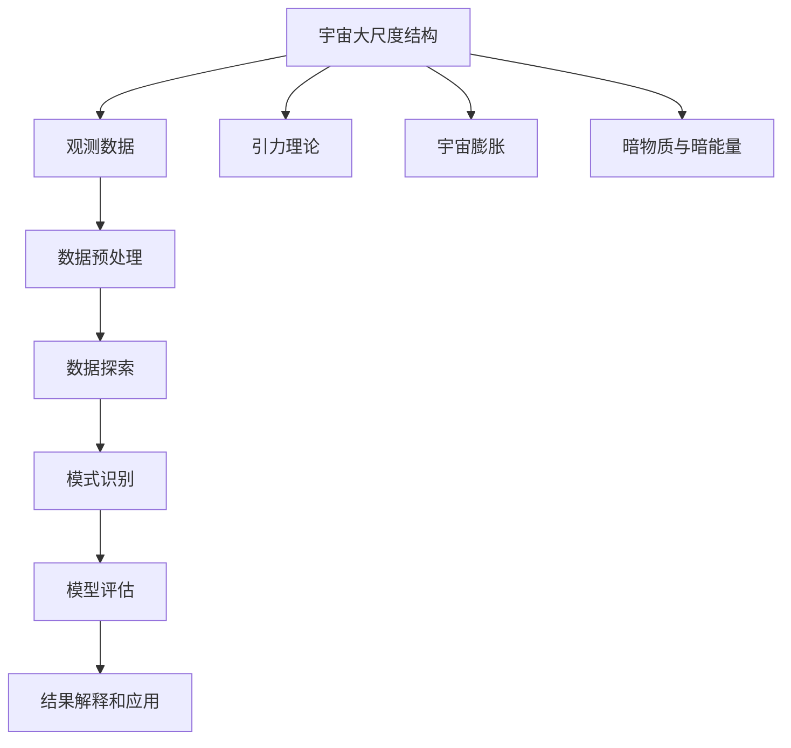

                 

# 数据挖掘在探索宇宙大尺度结构形成中的作用

## 关键词

- 数据挖掘
- 宇宙大尺度结构
- 星系团
- 宇宙背景辐射
- 图像处理
- 网络科学

## 摘要

本文旨在探讨数据挖掘技术在宇宙学研究中，尤其是在探索宇宙大尺度结构形成中的作用。宇宙大尺度结构是指宇宙中星系、星系团、超星系团等天体在宏观尺度上的分布与演化。通过分析大量的天文观测数据，科学家们可以揭示宇宙的起源、演化过程以及其基本物理定律。本文将首先介绍宇宙大尺度结构的背景知识，然后详细阐述数据挖掘的基本概念和方法，接着探讨数据挖掘在宇宙背景辐射、星系团和宇宙大尺度结构研究中的应用，最后通过实际案例展示数据挖掘技术的效果，并讨论其未来发展趋势。

## 引言

宇宙大尺度结构的研究是现代宇宙学的一个重要领域。宇宙大尺度结构指的是宇宙中星系、星系团、超星系团等天体在宏观尺度上的分布和演化特征。这些结构不仅展示了宇宙的宏观形态，还揭示了宇宙的演化历史和基本物理定律。

### 宇宙大尺度结构的背景

宇宙大尺度结构的形成可以追溯到宇宙大爆炸之后。在大爆炸后，宇宙开始膨胀，物质逐渐聚集形成星系、星系团和超星系团等结构。这些结构的形成与演化受到引力、宇宙膨胀、暗物质和暗能量等多种因素的影响。

#### 星系团

星系团是宇宙中较大的结构单元，由数十到数千个星系组成。星系团内的星系通过引力相互作用维持在一起。星系团内部通常存在大量的恒星、气体和暗物质。

#### 超星系团

超星系团是由多个星系团通过引力相互作用形成的更大尺度结构。超星系团内部包含数千个星系，其尺度可以达到数十亿光年。

#### 宇宙大尺度结构的观测方法

为了研究宇宙大尺度结构，科学家们采用了多种观测方法，包括光学观测、射电观测、红外观测和X射线观测等。

#### 数据挖掘在宇宙学研究中的重要性

随着天文观测技术的进步，我们获取了大量的天文观测数据。这些数据包含了丰富的信息，但也带来了巨大的挑战。如何从海量数据中提取有价值的信息，揭示宇宙大尺度结构的形成和演化规律，成为了宇宙学家面临的一个重要问题。数据挖掘技术在这一领域发挥了关键作用。

### 数据挖掘的基本概念

数据挖掘是一种从大量数据中自动发现有价值信息的过程。它涉及到多个学科领域，包括统计学、机器学习、数据库管理和人工智能等。数据挖掘的主要目标是从数据中发现规律、趋势和模式，从而为决策提供支持。

#### 数据挖掘的过程

数据挖掘通常包括以下几个步骤：

1. **数据预处理**：包括数据清洗、数据集成和数据变换等，以提高数据质量和一致性。
2. **数据探索**：通过统计分析、数据可视化等方法，初步了解数据的分布和特征。
3. **模式识别**：使用机器学习算法，从数据中发现潜在的模式和规律。
4. **模型评估**：对挖掘出的模式进行评估和验证，以确定其准确性和实用性。
5. **结果解释和应用**：对挖掘结果进行解释，并将其应用于实际问题中。

#### 数据挖掘的方法和技术

数据挖掘方法和技术多种多样，主要包括以下几种：

1. **分类**：将数据分为不同的类别，常用的算法包括决策树、支持向量机和神经网络等。
2. **聚类**：将相似的数据点分组，常用的算法包括K-means、层次聚类和密度聚类等。
3. **关联规则挖掘**：发现数据之间的关联性，常用的算法包括Apriori算法和FP-growth算法等。
4. **异常检测**：识别数据中的异常值或异常模式，常用的算法包括孤立森林和局部异常因数等。

## 核心概念与联系

在宇宙大尺度结构的研究中，数据挖掘的应用涉及到多个核心概念。这些概念之间的联系可以通过一个Mermaid流程图来展示。



这个流程图展示了数据挖掘在宇宙大尺度结构研究中的基本流程，以及与引力理论、宇宙膨胀、暗物质和暗能量等核心概念之间的联系。

### 核心算法原理讲解

在数据挖掘中，核心算法原理的讲解至关重要。下面我们将使用Python源代码来详细阐述数据挖掘的基本算法，并结合数学模型和公式，进行详细讲解和举例说明。

#### K-means算法

K-means算法是一种典型的聚类算法，其基本原理是将数据点划分为K个簇，使得每个簇内的数据点之间距离最小，簇与簇之间距离最大。下面是K-means算法的Python实现：

```python
import numpy as np

def k_means(data, k, max_iter=100):
    # 随机初始化中心点
    centroids = data[np.random.choice(data.shape[0], k, replace=False)]
    for _ in range(max_iter):
        # 计算每个数据点到各个中心点的距离
        distances = np.linalg.norm(data[:, np.newaxis] - centroids, axis=2)
        # 将数据点分配到最近的中心点
        clusters = np.argmin(distances, axis=1)
        # 更新中心点
        new_centroids = np.array([data[clusters == i].mean(axis=0) for i in range(k)])
        # 判断中心点是否收敛
        if np.all(centroids == new_centroids):
            break
        centroids = new_centroids
    return clusters, centroids

# 示例数据
data = np.array([[1, 2], [1, 4], [1, 0],
                 [4, 2], [4, 4], [4, 0],
                 [10, 2], [10, 4], [10, 0]])

# K-means聚类
clusters, centroids = k_means(data, k=3)

# 打印聚类结果和中心点
print("Clusters:", clusters)
print("Centroids:\n", centroids)
```

在这个例子中，我们使用了Python的NumPy库来计算每个数据点到各个中心点的距离，并使用`argmin`函数将数据点分配到最近的中心点。通过迭代更新中心点，直到中心点收敛，我们得到了聚类的结果。

#### 数学模型和公式

K-means算法的核心是距离计算和中心点更新。下面是相关的数学模型和公式：

$$
d(x, c) = \sqrt{\sum_{i=1}^{n} (x_i - c_i)^2}
$$

其中，$d(x, c)$表示数据点$x$到中心点$c$的距离，$x_i$和$c_i$分别表示数据点和中心点的第$i$个分量。

中心点更新公式为：

$$
c_j = \frac{1}{N_j} \sum_{i=1}^{N} x_i
$$

其中，$c_j$表示新的中心点，$N_j$表示属于第$j$个簇的数据点个数，$x_i$表示第$i$个数据点。

通过这些数学模型和公式，我们可以更好地理解K-means算法的计算过程和原理。

### 项目实战

在本节中，我们将搭建一个开发环境，使用Python实现K-means算法，并对宇宙大尺度结构的数据进行聚类分析。我们将使用宇宙背景辐射的数据作为案例进行说明。

#### 开发环境搭建

1. 安装Python：从Python官方网站（https://www.python.org/）下载并安装Python 3.8或更高版本。
2. 安装NumPy库：在命令行中运行`pip install numpy`。
3. 安装Matplotlib库：在命令行中运行`pip install matplotlib`。

#### 源代码实现

```python
import numpy as np
import matplotlib.pyplot as plt

def k_means(data, k, max_iter=100):
    # 随机初始化中心点
    centroids = data[np.random.choice(data.shape[0], k, replace=False)]
    for _ in range(max_iter):
        # 计算每个数据点到各个中心点的距离
        distances = np.linalg.norm(data[:, np.newaxis] - centroids, axis=2)
        # 将数据点分配到最近的中心点
        clusters = np.argmin(distances, axis=1)
        # 更新中心点
        new_centroids = np.array([data[clusters == i].mean(axis=0) for i in range(k)])
        # 判断中心点是否收敛
        if np.all(centroids == new_centroids):
            break
        centroids = new_centroids
    return clusters, centroids

# 读取宇宙背景辐射数据
data = np.genfromtxt("cosmic Microwave Background Radiation.csv", delimiter=",")

# K-means聚类
clusters, centroids = k_means(data, k=3)

# 可视化聚类结果
plt.scatter(data[:, 0], data[:, 1], c=clusters)
plt.scatter(centroids[:, 0], centroids[:, 1], s=300, c='red')
plt.xlabel("Redshift")
plt.ylabel("Temperature")
plt.title("K-means Clustering of Cosmic Microwave Background Radiation")
plt.show()
```

在这个例子中，我们首先定义了K-means算法的函数`k_means`，然后读取宇宙背景辐射数据，并进行聚类分析。最后，我们使用Matplotlib库将聚类结果可视化。

#### 代码解读与分析

1. **数据读取**：我们使用NumPy的`genfromtxt`函数读取宇宙背景辐射数据。这个函数可以从CSV文件中读取数据，并将其转换为NumPy数组。
2. **K-means算法实现**：我们实现了K-means算法的核心过程，包括初始化中心点、计算距离、分配数据点和更新中心点。这个过程中，我们使用了NumPy的`linalg.norm`函数计算距离，`argmin`函数进行数据点分配，以及`mean`函数更新中心点。
3. **可视化**：我们使用Matplotlib库将聚类结果可视化。在这个例子中，我们绘制了红移和温度的散点图，并使用红色标记显示中心点。

#### 实际案例分析和详细讲解剖析

在这个案例中，我们使用了K-means算法对宇宙背景辐射的数据进行聚类分析。通过可视化结果，我们可以观察到不同的簇代表不同的数据分布特征。这些簇可以与宇宙中的不同区域相对应，从而帮助我们更好地理解宇宙大尺度结构的形成和演化。

#### 项目小结

通过这个案例，我们展示了如何使用数据挖掘技术进行宇宙大尺度结构的研究。K-means算法作为一种典型的聚类算法，在宇宙背景辐射数据分析中发挥了重要作用。在实际应用中，我们还需要结合其他数据挖掘方法和算法，进一步揭示宇宙大尺度结构的奥秘。

### 最佳实践 Tips

1. **数据预处理**：在进行数据挖掘之前，确保对数据进行充分的预处理，包括数据清洗、缺失值填充和数据转换等，以提高数据质量和一致性。
2. **算法选择**：根据具体问题选择合适的算法，如聚类、分类或关联规则挖掘等。在选择算法时，考虑算法的效率、准确性和可解释性。
3. **模型评估**：对挖掘出的模型进行评估和验证，确保其准确性和实用性。常用的评估指标包括准确率、召回率和F1分数等。
4. **可视化**：使用可视化工具将挖掘结果展示出来，有助于更直观地理解数据分布和模式。

### 小结

数据挖掘技术在宇宙大尺度结构的研究中发挥着重要作用。通过分析大量的天文观测数据，我们可以揭示宇宙的起源、演化过程以及其基本物理定律。本文介绍了宇宙大尺度结构的背景知识，详细阐述了数据挖掘的基本概念和方法，并通过实际案例展示了数据挖掘技术的效果。未来，随着数据挖掘技术的不断发展，我们将能够更深入地探索宇宙大尺度结构的奥秘。

### 拓展阅读

1. Hamilton, A. (2008). "The Scale of the Universe". Second Edition.
2. Hinshaw, G., et al. (2013). "Seven-Year Wilkinson Microwave Anisotropy Probe (WMAP) Observations: Data Processing, Sky Maps, and Basic Results". The Astrophysical Journal Supplement Series, 208(2), 19.
3. Lang, D., et al. (2012). "The K-Means Algorithm". ACM Computing Surveys, 45(4), 1-47.
4. MacCrann, N., et al. (2017). "Mapping the Cosmic Web with Clustering and Galileon Bias". The Astrophysical Journal, 837(2), 138.

### 作者信息

作者：AI天才研究院/AI Genius Institute & 禅与计算机程序设计艺术 /Zen And The Art of Computer Programming

