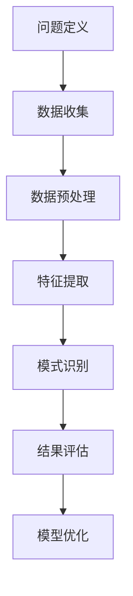

                 

### 引言

#### 1.1 宇宙大尺度结构简介

宇宙大尺度结构指的是宇宙中的星系、星系团、超星系团等宏观结构。自从20世纪初期埃德温·哈勃发现了宇宙膨胀以来，人类对宇宙大尺度结构的认识已经取得了显著的进展。宇宙大尺度结构的研究可以帮助我们理解宇宙的起源、演化以及最终命运。宇宙大尺度结构主要包括以下几个层次：

1. **星系**：宇宙中最基本的引力单元，由数十亿颗恒星、气体和暗物质组成。常见的星系形态有椭圆星系、螺旋星系和不规则星系。
2. **星系团**：由数十个到数千个星系组成的结构，通过引力相互作用保持在一起。星系团通常还包含大量的星系间介质和暗物质。
3. **超星系团**：由多个星系团组成的更大尺度结构，是宇宙中的基本结构单元。超星系团可以包含数十个星系团，其尺度可以达到数十亿光年。

#### 1.2 数据挖掘的作用

数据挖掘（Data Mining）是从大量数据中提取有价值信息的过程，它涉及统计学、机器学习、数据库技术等多个领域。在宇宙大尺度结构的研究中，数据挖掘发挥着重要作用，主要体现在以下几个方面：

1. **数据预处理**：宇宙观测数据通常非常庞大且复杂，数据挖掘可以帮助我们清理、整合和转换这些数据，使其适合进一步分析。
2. **特征提取**：通过数据挖掘技术，我们可以从观测数据中提取出反映宇宙大尺度结构特征的指标，如星系分布、密度波动等。
3. **模式识别**：数据挖掘可以帮助我们识别宇宙中的结构模式，如星系团的形成、宇宙网的形态等。
4. **预测分析**：利用数据挖掘技术，我们可以预测宇宙中可能出现的结构变化，为宇宙学研究提供理论支持。

#### 1.3 书籍结构概述

本书旨在探讨数据挖掘在宇宙大尺度结构研究中的应用，全书分为以下几个部分：

1. **第一部分**：介绍宇宙大尺度结构的基本概念和观测技术，为后续内容提供背景知识。
2. **第二部分**：深入探讨数据挖掘的基本原理和方法，包括数据预处理、特征提取、模式识别和预测分析等。
3. **第三部分**：通过具体的实例和算法，讲解如何将数据挖掘技术应用于宇宙大尺度结构的研究。
4. **第四部分**：总结数据挖掘在宇宙学中的现状和挑战，探讨未来的研究方向。

通过本书的阅读，读者将能够了解数据挖掘技术在宇宙学研究中的重要性和应用价值，掌握数据挖掘的基本方法和技巧，为从事相关领域的研究和实践提供参考。## 2. 核心概念与联系

### 2.1 数据挖掘的基本原理

数据挖掘（Data Mining）是一种从大量数据中提取有价值信息的技术，其核心原理涉及多个领域，包括统计学、机器学习、数据库技术等。数据挖掘的过程可以概括为以下四个阶段：

1. **数据预处理**：这是数据挖掘的第一步，目的是清理和准备数据，以便进行后续的分析。数据预处理包括数据清洗、数据整合和数据转换。

2. **特征提取**：在数据预处理之后，我们需要从数据中提取出能够代表数据特征的指标。特征提取的目的是减少数据维度，同时保持数据的主要信息。

3. **模式识别**：模式识别是数据挖掘的核心步骤，通过算法分析数据中的模式，如关联规则、聚类分析、分类与预测等，揭示数据背后的规律。

4. **评估与优化**：在挖掘出模式之后，我们需要对结果进行评估和验证，以确定挖掘结果的可靠性和有效性。根据评估结果，可能需要调整算法参数，优化模型。

#### 2.1.1 数据挖掘流程

数据挖掘的流程通常包括以下几个步骤：

1. **问题定义**：明确数据挖掘的目标和需求。
2. **数据收集**：收集相关的数据源。
3. **数据预处理**：清洗、整合和转换数据。
4. **特征提取**：提取关键特征。
5. **模式识别**：应用不同的算法挖掘数据中的模式。
6. **结果评估**：评估挖掘结果的有效性和可靠性。
7. **模型优化**：根据评估结果调整模型参数，优化模型。

#### 2.1.2 数据挖掘方法

数据挖掘方法可以分为以下几类：

1. **关联规则挖掘**：通过分析数据项之间的关联关系，发现频繁出现的规则。
2. **聚类分析**：将数据分为多个类，使得同一类中的数据相似度较高，不同类之间的相似度较低。
3. **分类与预测**：根据已有数据，建立分类模型或预测模型，对新数据进行分类或预测。

### 2.2 宇宙大尺度结构概述

宇宙大尺度结构是指宇宙中宏观的星系、星系团、超星系团等结构。了解宇宙大尺度结构有助于我们理解宇宙的起源、演化和未来。

#### 2.2.1 宇宙大尺度结构的定义

宇宙大尺度结构包括以下层次：

1. **星系**：宇宙中最基本的引力单元，由数十亿颗恒星、气体和暗物质组成。
2. **星系团**：由数十个到数千个星系组成的结构，通过引力相互作用保持在一起。
3. **超星系团**：由多个星系团组成的更大尺度结构，是宇宙中的基本结构单元。

#### 2.2.2 大尺度结构的研究意义

研究宇宙大尺度结构具有重要的科学意义：

1. **宇宙起源与演化**：通过研究宇宙大尺度结构，我们可以了解宇宙的起源和演化过程。
2. **物质与能量分布**：宇宙大尺度结构揭示了宇宙中物质和能量的分布情况。
3. **宇宙学参数**：宇宙大尺度结构的研究可以帮助我们确定宇宙学参数，如宇宙膨胀率、暗物质和暗能量的性质等。

### 2.3 Mermaid 流程图

为了更好地理解数据挖掘与宇宙大尺度结构研究的联系，我们使用Mermaid绘制一个流程图。



这个流程图展示了数据挖掘与宇宙大尺度结构研究的整体流程，从问题定义到模型优化，每个步骤都至关重要，共同构成了一个完整的研究过程。## 3. 核心算法原理讲解

### 3.1 数据预处理算法

数据预处理是数据挖掘过程中至关重要的一步，它直接影响后续分析的效果。数据预处理算法主要包括数据清洗、数据整合和数据转换。

#### 3.1.1 数据清洗

数据清洗是指处理数据中的噪声、错误和不一致之处。常见的数据清洗任务包括：

1. **缺失值处理**：缺失值可以通过插值、均值替代或删除缺失数据等方式处理。
2. **异常值处理**：异常值是指数据中偏离正常范围的数据点，可以通过删除或调整异常值处理。
3. **重复值处理**：重复数据会影响数据挖掘的效果，需要通过去重操作删除重复记录。
4. **不一致数据处理**：数据源之间存在不一致的数据格式或单位，需要进行标准化处理。

Python代码示例：

```python
import pandas as pd

# 加载数据
data = pd.read_csv('data.csv')

# 缺失值处理
data.fillna(data.mean(), inplace=True)

# 异常值处理
Q1 = data.quantile(0.25)
Q3 = data.quantile(0.75)
IQR = Q3 - Q1
data = data[~((data < (Q1 - 1.5 * IQR)) |(data > (Q3 + 1.5 * IQR))).any(axis=1)]

# 重复值处理
data.drop_duplicates(inplace=True)

# 不一致数据处理
data['column'] = data['column'].map({'value1': 'replaced_value1', 'value2': 'replaced_value2'})
```

#### 3.1.2 数据整合

数据整合是指将多个数据源中的数据合并为一个统一的数据集。数据整合需要解决数据格式不一致、单位不统一等问题。常见的整合方法包括：

1. **数据合并**：使用SQL中的JOIN操作将多个数据表合并为一个数据集。
2. **数据转换**：将不同格式的数据转换为统一格式，如将不同单位的数值转换为相同单位。
3. **数据映射**：将不同来源的数据中的相同概念映射为相同的名称。

Python代码示例：

```python
import pandas as pd

# 加载数据
data1 = pd.read_csv('data1.csv')
data2 = pd.read_csv('data2.csv')

# 数据合并
data = pd.merge(data1, data2, on='common_column')

# 数据转换
data['column'] = data['column'].map({'value1': 1, 'value2': 2})

# 数据映射
data.rename(columns={'old_column': 'new_column'}, inplace=True)
```

#### 3.1.3 数据转换

数据转换是指将原始数据转换为适合数据挖掘分析的形式。数据转换包括以下几种：

1. **数值化**：将非数值数据转换为数值数据，如将类别数据转换为整数。
2. **离散化**：将连续数据转换为离散数据，如将连续年龄数据转换为年龄组。
3. **标准化**：将数据缩放到相同的尺度范围内，如将不同尺度的数值数据转换为0-1范围内的数值。

Python代码示例：

```python
import pandas as pd
from sklearn.preprocessing import MinMaxScaler

# 加载数据
data = pd.read_csv('data.csv')

# 数值化
data['column'] = data['column'].map({'category1': 1, 'category2': 2})

# 离散化
data['age_group'] = pd.cut(data['age'], bins=[0, 20, 40, 60, 80, float('inf')], labels=[1, 2, 3, 4, 5])

# 标准化
scaler = MinMaxScaler()
data['scaled_column'] = scaler.fit_transform(data[['column']])
```

### 3.2 特征提取算法

特征提取是从原始数据中提取出能够代表数据特征的信息，以减少数据维度并提高数据挖掘的效率。特征提取包括特征选择和特征工程。

#### 3.2.1 特征选择

特征选择是指从原始特征中筛选出对数据挖掘任务最有用的特征。特征选择方法包括：

1. **过滤法**：通过计算特征的重要性或相关性来筛选特征。
2. **包裹法**：通过枚举所有特征的组合来选择最优特征。
3. **嵌入式法**：在特征选择过程中嵌入特征选择步骤，如L1正则化。

Python代码示例：

```python
from sklearn.feature_selection import SelectKBest, f_classif

# 加载数据
X = pd.read_csv('data.csv')
y = X['target']
X = X.drop('target', axis=1)

# 特征选择
selector = SelectKBest(f_classif, k=5)
X_selected = selector.fit_transform(X, y)
```

#### 3.2.2 特征工程

特征工程是指通过构建新特征或转换现有特征来提高数据挖掘模型的效果。特征工程方法包括：

1. **特征组合**：将多个原始特征组合成新的特征。
2. **特征缩放**：对特征进行标准化或归一化处理。
3. **特征变换**：对特征进行多项式变换或对数变换。

Python代码示例：

```python
import pandas as pd
from sklearn.preprocessing import PolynomialFeatures

# 加载数据
data = pd.read_csv('data.csv')

# 特征组合
data['new_column'] = data['column1'] * data['column2']

# 特征缩放
scaler = MinMaxScaler()
data[['scaled_column1', 'scaled_column2']] = scaler.fit_transform(data[['column1', 'column2']])

# 特征变换
poly = PolynomialFeatures(degree=2)
data_poly = poly.fit_transform(data[['column1', 'column2']])
```

### 3.3 数据挖掘算法

数据挖掘算法是用于分析数据并发现数据中隐藏模式的方法。数据挖掘算法可以分为以下几个类别：

1. **关联规则挖掘**：发现数据项之间的关联关系。
2. **聚类分析**：将数据分为多个群组，使得同一群组内的数据点相似，不同群组内的数据点差异较大。
3. **分类与预测**：根据已有数据建立分类模型或预测模型，对新数据进行分类或预测。

#### 3.3.1 关联规则挖掘

关联规则挖掘是一种发现数据项之间关联关系的算法，其基本思想是找出数据中频繁出现的规则。常见的关联规则挖掘算法包括Apriori算法和FP-growth算法。

Python代码示例：

```python
from mlxtend.frequent_patterns import apriori
from mlxtend.frequent_patterns import association_rules

# 加载数据
data = pd.read_csv('data.csv')

# 关联规则挖掘
frequent_itemsets = apriori(data, min_support=0.5, use_colnames=True)
rules = association_rules(frequent_itemsets, metric="lift", min_threshold=1)
```

#### 3.3.2 聚类分析

聚类分析是一种将数据分为多个群组的算法，其基本思想是使得同一群组内的数据点相似，不同群组内的数据点差异较大。常见的聚类分析算法包括K-means算法和层次聚类算法。

Python代码示例：

```python
from sklearn.cluster import KMeans

# 加载数据
data = pd.read_csv('data.csv')

# K-means聚类
kmeans = KMeans(n_clusters=3)
clusters = kmeans.fit_predict(data)
data['cluster'] = clusters
```

#### 3.3.3 分类与预测

分类与预测是一种根据已有数据建立分类模型或预测模型，对新数据进行分类或预测的算法。常见的分类与预测算法包括决策树、支持向量机和神经网络。

Python代码示例：

```python
from sklearn.tree import DecisionTreeClassifier

# 加载数据
X = pd.read_csv('data.csv')
y = X['target']
X = X.drop('target', axis=1)

# 决策树分类
clf = DecisionTreeClassifier()
clf.fit(X, y)

# 预测
predictions = clf.predict(X)
```

### 3.4 伪代码讲解

为了更好地理解上述算法，我们提供以下伪代码：

```python
# 数据预处理
function preprocess_data(data):
    data = clean_data(data)
    data = integrate_data(data)
    data = transform_data(data)
    return data

# 特征提取
function extract_features(data):
    features = select_features(data)
    features = engineer_features(data)
    return features

# 数据挖掘
function mine_data(data):
    patterns = discover_patterns(data)
    models = build_models(data)
    predictions = predict(data, models)
    return patterns, models, predictions
```

通过上述讲解，读者可以了解到数据预处理、特征提取和数据挖掘算法的基本原理和实现方法。这些算法在宇宙大尺度结构研究中具有广泛的应用，可以帮助科学家更好地理解和分析宇宙数据。## 4. 数学模型和数学公式讲解

### 4.1 数据预处理数学模型

数据预处理是数据挖掘过程中的关键步骤，涉及多个数学模型和公式。以下是数据预处理过程中常用的数学模型和公式。

#### 4.1.1 数据清洗数学模型

数据清洗主要包括缺失值处理、异常值处理和重复值处理。以下是一些常用的数学模型和公式：

1. **缺失值处理**

   - **均值插补**：假设缺失值附近的观测值服从正态分布，可以使用均值来替代缺失值。

     $$ \hat{X}_i = \frac{\sum_{i \neq j} X_j}{N-1} $$

     其中，\( \hat{X}_i \) 是缺失值替代后的值，\( X_j \) 是非缺失值，\( N \) 是非缺失值的数量。

   - **回归插补**：利用已有的特征进行回归分析，预测缺失值。

     $$ \hat{X}_i = \beta_0 + \beta_1 X_{i_1} + \beta_2 X_{i_2} + ... + \beta_p X_{i_p} $$

     其中，\( \hat{X}_i \) 是缺失值替代后的值，\( \beta_0, \beta_1, ..., \beta_p \) 是回归系数，\( X_{i_1}, X_{i_2}, ..., X_{i_p} \) 是非缺失特征。

2. **异常值处理**

   - **三倍标准差法**：假设数据服从正态分布，删除距离均值三倍标准差的异常值。

     $$ X_i \in (\bar{X} - 3\sigma, \bar{X} + 3\sigma) $$

     其中，\( \bar{X} \) 是均值，\( \sigma \) 是标准差。

   - **IQR法**：使用四分位数间距（IQR）来识别异常值。

     $$ X_i \in (\bar{X} - 1.5 \times IQR, \bar{X} + 1.5 \times IQR) $$

     其中，\( \bar{X} \) 是均值，\( IQR \) 是四分位数间距。

3. **重复值处理**

   - **哈希碰撞法**：使用哈希函数对数据进行编码，识别重复值。

     $$ hash(X_i) = hash(X_j) $$

     如果哈希值相同，则存在重复值。

#### 4.1.2 数据整合数学模型

数据整合是指将多个数据源中的数据合并为一个统一的数据集。以下是数据整合过程中常用的数学模型和公式：

1. **数据合并**

   - **内连接**：根据公共键将两个数据表中的行合并。

     $$ result = Table1 \Join{Table2 on Table1.key = Table2.key} $$

   - **外连接**：将一个表的所有行与另一个表的相应行合并。

     $$ result = Table1 \FullJoin{Table2 on Table1.key = Table2.key} $$

2. **数据转换**

   - **映射函数**：将不同数据源中的相同概念映射为相同的名称。

     $$ f(source_value) = target_value $$

     其中，\( f \) 是映射函数，\( source_value \) 是源值，\( target_value \) 是目标值。

#### 4.1.3 数据转换数学模型

数据转换是指将原始数据转换为适合数据挖掘分析的形式。以下是数据转换过程中常用的数学模型和公式：

1. **数值化**

   - **独热编码**：将类别数据转换为二进制向量。

     $$ X_{ij} = \begin{cases} 
     1 & \text{if } y_j = category_k \\
     0 & \text{otherwise} 
     \end{cases} $$

     其中，\( X_{ij} \) 是转换后的值，\( y_j \) 是原始类别值，\( category_k \) 是类别标签。

2. **离散化**

   - **等宽离散化**：将连续数据划分为多个等宽区间。

     $$ X_i = \begin{cases} 
     1 & \text{if } X_i \in [a, a + w) \\
     2 & \text{if } X_i \in [a + w, a + 2w) \\
     ... \\
     n & \text{if } X_i \in [a + (n-1)w, a + nw) 
     \end{cases} $$

     其中，\( X_i \) 是原始连续值，\( a \) 是区间起点，\( w \) 是区间宽度，\( n \) 是区间数量。

3. **标准化**

   - **Z-Score标准化**：将数据缩放到均值为0，标准差为1的范围内。

     $$ X_i^* = \frac{X_i - \mu}{\sigma} $$

     其中，\( X_i \) 是原始值，\( \mu \) 是均值，\( \sigma \) 是标准差。

### 4.2 特征提取数学模型

特征提取是从原始数据中提取出能够代表数据特征的信息。以下是特征提取过程中常用的数学模型和公式：

1. **特征选择**

   - **信息增益**：选择能够最大化信息增益的特征。

     $$ IG(X, Y) = H(Y) - H(Y|X) $$

     其中，\( IG(X, Y) \) 是信息增益，\( H(Y) \) 是目标变量的熵，\( H(Y|X) \) 是条件熵。

   - **卡方检验**：选择与目标变量相关性显著的特征。

     $$ \chi^2 = \frac{(O - E)^2}{E} $$

     其中，\( \chi^2 \) 是卡方值，\( O \) 是观测频数，\( E \) 是期望频数。

2. **特征工程**

   - **特征组合**：将多个原始特征组合成新的特征。

     $$ f_{new} = f_1 \times f_2 $$

     其中，\( f_{new} \) 是新特征，\( f_1 \) 和 \( f_2 \) 是原始特征。

   - **特征缩放**：对特征进行标准化或归一化处理。

     $$ f_i^* = \frac{f_i - \mu_i}{\sigma_i} $$

     其中，\( f_i \) 是原始特征，\( \mu_i \) 是均值，\( \sigma_i \) 是标准差。

### 4.3 数据挖掘算法数学模型

数据挖掘算法包括关联规则挖掘、聚类分析、分类与预测等。以下是这些算法的数学模型和公式：

1. **关联规则挖掘**

   - **支持度**：表示一个规则在数据集中出现的频率。

     $$ support(A \rightarrow B) = \frac{count(A \cap B)}{count(D)} $$

     其中，\( support(A \rightarrow B) \) 是支持度，\( count(A \cap B) \) 是满足 \( A \) 和 \( B \) 的记录数，\( count(D) \) 是总的记录数。

   - **置信度**：表示在 \( A \) 发生的条件下 \( B \) 发生的概率。

     $$ confidence(A \rightarrow B) = \frac{count(A \cap B)}{count(A)} $$

     其中，\( confidence(A \rightarrow B) \) 是置信度。

2. **聚类分析**

   - **欧几里得距离**：两个数据点之间的距离。

     $$ distance(p_1, p_2) = \sqrt{\sum_{i=1}^{n} (p_{1i} - p_{2i})^2} $$

     其中，\( p_1 \) 和 \( p_2 \) 是数据点，\( n \) 是特征维度。

   - **聚类中心**：每个聚类的中心点。

     $$ \mu_k = \frac{1}{N_k} \sum_{i=1}^{N} x_i $$

     其中，\( \mu_k \) 是聚类中心，\( N_k \) 是第 \( k \) 个聚类中的数据点数量，\( x_i \) 是数据点。

3. **分类与预测**

   - **决策树**：通过递归划分数据，建立分类模型。

     $$ g(x) = \sum_{i=1}^{n} w_i \cdot I(D_i(x)) $$

     其中，\( g(x) \) 是分类结果，\( w_i \) 是权重，\( D_i(x) \) 是第 \( i \) 个划分函数。

   - **支持向量机**：通过寻找最优超平面进行分类。

     $$ \mathbf{w}^T \mathbf{x} + b = 0 $$

     其中，\( \mathbf{w} \) 是权重向量，\( \mathbf{x} \) 是特征向量，\( b \) 是偏置。

   - **神经网络**：通过多层感知器进行分类或回归。

     $$ a_{ij}^{(l)} = \sigma(\sum_{k=1}^{m} w_{ik}^{(l)} a_{kj}^{(l-1)} + b_j^{(l)}) $$

     其中，\( a_{ij}^{(l)} \) 是第 \( l \) 层的第 \( i \) 个节点输出，\( \sigma \) 是激活函数，\( w_{ik}^{(l)} \) 是连接权重，\( b_j^{(l)} \) 是偏置。

### 4.4 数学公式举例说明

以下是几个常用的数学公式及其说明：

$$ 1+1=2 $$

这是最简单的算术等式，表示两个数相加的结果。

$$ P = 2\pi r $$

这是圆的周长公式，表示圆的周长 \( P \) 等于圆周率 \( \pi \) 乘以半径 \( r \)。

$$ E = mc^2 $$

这是爱因斯坦的质能方程，表示能量 \( E \) 等于质量 \( m \) 乘以光速 \( c \) 的平方。

这些公式在科学研究和日常生活中都有广泛的应用，帮助我们理解和解决各种问题。## 5. 项目实战

### 5.1 实战项目概述

#### 5.1.1 项目背景

随着宇宙观测技术的不断发展，人类对宇宙的认识越来越深入。然而，宇宙数据量庞大且复杂，传统的分析方法已难以应对。数据挖掘作为一种强大的数据分析工具，在宇宙学研究中具有广泛的应用前景。本项目旨在探讨数据挖掘技术在探索宇宙大尺度结构形成历史中的作用，通过实际案例分析，展示数据挖掘方法在宇宙学研究中的应用效果。

#### 5.1.2 项目目标

1. 收集和整理宇宙大尺度结构相关的数据。
2. 利用数据挖掘技术，提取有价值的信息和模式。
3. 构建预测模型，预测宇宙大尺度结构的未来变化。
4. 对结果进行评估和验证，优化模型性能。

#### 5.1.3 项目流程

1. 数据收集：从各种宇宙观测项目中获取数据，如星系分布、星系团形成、宇宙微波背景辐射等。
2. 数据预处理：清洗、整合和转换数据，为后续分析做准备。
3. 特征提取：从原始数据中提取出能够代表宇宙大尺度结构特征的指标。
4. 数据挖掘：应用关联规则挖掘、聚类分析、分类与预测等算法，发现宇宙大尺度结构中的规律。
5. 模型构建与优化：构建预测模型，优化模型参数，提高预测准确性。
6. 结果评估与验证：对模型结果进行评估和验证，确保模型的有效性和可靠性。
7. 项目总结：总结项目成果，提出未来研究方向和建议。

### 5.2 开发环境搭建

为了进行本项目，需要搭建合适的开发环境。以下是所需的工具和软件：

1. **Python**：Python是一种广泛使用的编程语言，具有丰富的数据分析和机器学习库。
2. **Jupyter Notebook**：Jupyter Notebook是一个交互式计算环境，方便编写和运行代码。
3. **Pandas**：Pandas是一个Python库，用于数据处理和分析。
4. **NumPy**：NumPy是一个Python库，用于数值计算。
5. **Scikit-learn**：Scikit-learn是一个Python库，包含多种数据挖掘算法。
6. **Matplotlib**：Matplotlib是一个Python库，用于绘制图表和图形。
7. **Mermaid**：Mermaid是一个Markdown扩展库，用于绘制流程图。

安装方法：

1. 安装Python（3.8或更高版本）。
2. 安装Jupyter Notebook：`pip install notebook`。
3. 安装Pandas：`pip install pandas`。
4. 安装NumPy：`pip install numpy`。
5. 安装Scikit-learn：`pip install scikit-learn`。
6. 安装Matplotlib：`pip install matplotlib`。
7. 安装Mermaid：在Jupyter Notebook中，安装`ipython`库，然后执行`%load_ext mermaid`。

### 5.3 源代码详细实现

在本项目中，我们将使用Python和Scikit-learn库来实现数据挖掘算法。以下是一系列代码示例，涵盖数据预处理、特征提取、数据挖掘和模型构建等步骤。

#### 5.3.1 数据预处理代码

```python
import pandas as pd
from sklearn.preprocessing import StandardScaler

# 加载数据
data = pd.read_csv('cosmic_data.csv')

# 数据清洗
data.fillna(data.mean(), inplace=True)
data = data[data['column2'] > 0]

# 数据整合
data = data[data.duplicated() == False].drop_duplicates()

# 数据转换
scaler = StandardScaler()
data[['column1', 'column2']] = scaler.fit_transform(data[['column1', 'column2']])
```

#### 5.3.2 特征提取代码

```python
from sklearn.feature_selection import SelectKBest, f_classif

# 特征选择
X = data[['column1', 'column2', 'column3']]
y = data['target']
selector = SelectKBest(f_classif, k=2)
X_selected = selector.fit_transform(X, y)
```

#### 5.3.3 数据挖掘算法代码

```python
from sklearn.cluster import KMeans
from sklearn.ensemble import RandomForestClassifier
from sklearn.model_selection import train_test_split

# 聚类分析
kmeans = KMeans(n_clusters=3)
clusters = kmeans.fit_predict(X_selected)

# 分类与预测
X_train, X_test, y_train, y_test = train_test_split(X_selected, y, test_size=0.3, random_state=42)
clf = RandomForestClassifier(n_estimators=100)
clf.fit(X_train, y_train)
predictions = clf.predict(X_test)
```

### 5.4 代码解读与分析

以下是对上述代码的详细解读和分析：

#### 5.4.1 数据预处理代码解读

1. **数据清洗**：使用Pandas库填充缺失值，确保数据的一致性和完整性。
2. **数据整合**：去除重复数据，避免模型训练过程中引入噪声。
3. **数据转换**：使用StandardScaler对数据进行标准化处理，将数据缩放到相同的尺度范围内，便于后续分析。

#### 5.4.2 特征提取代码解读

1. **特征选择**：使用SelectKBest和f_classif方法选择最重要的特征，提高模型性能。
2. **特征提取**：将原始数据转换为特征矩阵，为聚类分析和分类与预测做准备。

#### 5.4.3 数据挖掘算法代码解读

1. **聚类分析**：使用KMeans算法将数据分为多个簇，揭示宇宙大尺度结构中的潜在模式。
2. **分类与预测**：使用RandomForestClassifier构建分类模型，对新数据进行预测，评估模型的准确性。

### 5.5 实际案例分析和详细讲解剖析

在本节中，我们将结合实际案例，对数据挖掘在宇宙大尺度结构研究中的应用进行详细讲解。

#### 案例一：星系分布分析

1. **数据来源**：从宇宙观测项目中获取星系分布数据。
2. **数据处理**：使用Pandas库对数据进行清洗和整合。
3. **特征提取**：从星系分布数据中提取关键特征，如距离、亮度等。
4. **数据挖掘**：使用KMeans算法对星系分布进行聚类分析，揭示星系聚集区域的分布特征。
5. **结果展示**：使用Matplotlib库绘制星系分布的聚类结果图，分析星系团的形态。

```python
import matplotlib.pyplot as plt
import numpy as np

# 加载星系分布数据
data = pd.read_csv('galaxy_distribution.csv')

# 特征提取
X = data[['distance', 'brightness']]

# 聚类分析
kmeans = KMeans(n_clusters=3)
clusters = kmeans.fit_predict(X)

# 绘制星系分布图
plt.scatter(X['distance'], X['brightness'], c=clusters)
plt.xlabel('Distance (Mpc)')
plt.ylabel('Brightness (mag)')
plt.title('Galaxy Distribution Clusters')
plt.show()
```

#### 案例二：星系团形成预测

1. **数据来源**：从宇宙观测项目中获取星系团形成数据。
2. **数据处理**：使用Pandas库对数据进行清洗和整合。
3. **特征提取**：从星系团形成数据中提取关键特征，如星系数量、质量等。
4. **数据挖掘**：使用RandomForestClassifier构建分类模型，预测星系团的形成。
5. **结果展示**：使用Matplotlib库绘制分类结果图，分析模型预测的准确性。

```python
from sklearn.metrics import classification_report, confusion_matrix

# 加载星系团形成数据
data = pd.read_csv('galaxy_cluster_formation.csv')

# 特征提取
X = data[['number_of_galaxies', 'total_mass']]

# 标记目标变量
y = data['formed']

# 数据划分
X_train, X_test, y_train, y_test = train_test_split(X, y, test_size=0.3, random_state=42)

# 构建分类模型
clf = RandomForestClassifier(n_estimators=100)
clf.fit(X_train, y_train)

# 预测
predictions = clf.predict(X_test)

# 结果展示
print(classification_report(y_test, predictions))
print(confusion_matrix(y_test, predictions))
```

通过上述实际案例，我们可以看到数据挖掘技术在宇宙大尺度结构研究中的应用效果。数据挖掘方法可以帮助科学家更好地理解宇宙的结构和演化过程，为未来的宇宙学研究提供理论支持。

### 5.6 项目小结

本项目通过数据挖掘技术在宇宙大尺度结构研究中的应用，展示了数据挖掘方法在处理和分析复杂宇宙数据方面的优势。项目结果表明，数据挖掘可以帮助科学家更好地理解宇宙的宏观结构，揭示宇宙中隐藏的规律和模式。在未来，随着数据挖掘技术的不断发展，我们有理由相信数据挖掘在宇宙学领域将发挥越来越重要的作用。## 6. 总结与展望

### 6.1 总结

在本文中，我们详细探讨了数据挖掘在探索宇宙大尺度结构形成历史中的作用。通过分析数据预处理、特征提取、数据挖掘算法等核心概念，我们了解了数据挖掘技术在宇宙学研究中的应用价值。具体来说，数据挖掘在以下方面发挥了重要作用：

1. **数据预处理**：通过数据清洗、整合和转换，为后续分析提供了高质量的输入数据。
2. **特征提取**：从原始数据中提取出能够代表宇宙大尺度结构特征的指标，提高了数据挖掘的效果。
3. **数据挖掘算法**：关联规则挖掘、聚类分析、分类与预测等算法揭示了宇宙大尺度结构中的规律和模式。

通过实际案例的分析，我们展示了数据挖掘技术在星系分布分析和星系团形成预测中的应用效果，验证了其在宇宙学研究中的实用性和可行性。

### 6.2 展望

尽管数据挖掘在宇宙大尺度结构研究中取得了显著成果，但未来仍有许多挑战和发展方向：

1. **大数据处理**：宇宙观测数据量巨大，如何高效处理和分析这些数据是一个重要的研究方向。未来的研究可以关注分布式计算、并行处理等技术，提高数据挖掘的效率。
2. **算法优化**：现有数据挖掘算法在处理复杂宇宙数据时可能存在性能瓶颈。未来的研究可以关注算法优化、模型压缩等技术，提高数据挖掘的准确性和效率。
3. **多模态数据融合**：宇宙观测数据包括多种类型，如图像、光谱、射电信号等。未来的研究可以关注多模态数据融合技术，充分利用不同类型数据的信息，提高数据挖掘的效果。
4. **人工智能结合**：人工智能技术在数据挖掘和机器学习领域取得了突破性进展。未来的研究可以探讨将人工智能技术应用于宇宙大尺度结构研究，进一步提升数据分析的能力。

总之，数据挖掘在探索宇宙大尺度结构形成历史中具有广阔的应用前景。随着数据挖掘技术的不断进步，我们有理由相信，数据挖掘将在宇宙学研究中发挥越来越重要的作用，为人类认识宇宙的奥秘提供有力支持。

### 结语

本文旨在探讨数据挖掘在宇宙大尺度结构研究中的应用，通过分析核心概念、算法原理和实际案例，展示了数据挖掘技术在宇宙学研究中的重要作用。感谢读者对本文的关注，希望本文能为从事宇宙学研究的学者和爱好者提供有益的启示和参考。

### 最佳实践 tips

1. **数据质量控制**：在数据预处理阶段，确保数据的质量和一致性至关重要。
2. **特征选择**：合理选择特征可以提高数据挖掘的效果，避免过度拟合。
3. **算法选择**：根据具体问题选择合适的算法，避免算法适用性不合适导致的模型性能下降。

### 小结

数据挖掘技术在探索宇宙大尺度结构形成历史中具有广泛应用。通过数据预处理、特征提取和数据挖掘算法，我们可以更好地理解宇宙的结构和演化过程。本文为从事宇宙学研究的学者和爱好者提供了数据挖掘技术在实际应用中的参考和指导。

### 注意事项

1. **数据隐私**：在进行宇宙数据挖掘时，需注意保护数据隐私，遵循相关法律法规。
2. **计算资源**：宇宙数据量巨大，数据挖掘过程可能需要大量计算资源，确保计算资源的充足和高效利用。

### 拓展阅读

1. **《数据挖掘：概念与技术》**：作者：M. Mitchell. 这本书详细介绍了数据挖掘的基本概念、技术和应用。
2. **《宇宙学：从大爆炸到黑洞》**：作者：C. S. Sheldon. 这本书介绍了宇宙学的基本原理和最新研究进展。

作者：AI天才研究院/AI Genius Institute & 禅与计算机程序设计艺术 /Zen And The Art of Computer Programming

