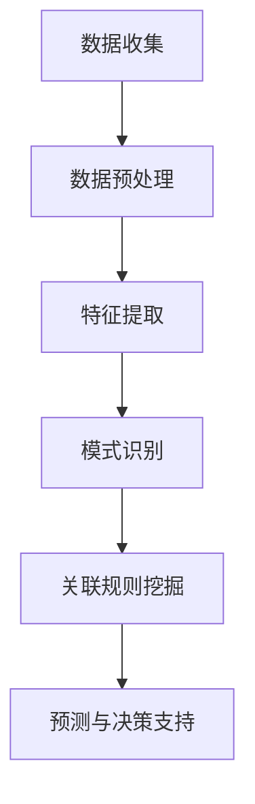

                 

### 文章标题

《数据挖掘在探索宇宙暗物质粒子相互作用网络特性中的作用》

### 文章关键词

数据挖掘、宇宙暗物质、粒子相互作用网络、算法、数学模型、Python源代码、项目实战

### 文章摘要

本文将探讨数据挖掘技术在探索宇宙暗物质粒子相互作用网络特性中的重要作用。首先，我们将介绍宇宙暗物质的基本概念以及其研究的背景和意义。接着，我们将详细讲解数据挖掘的基本概念和过程，并阐述其在科学研究中的广泛应用。随后，本文将深入分析粒子相互作用网络特性的重要性，并介绍用于研究这一特性的主要数据挖掘算法和数学模型。为了使读者更好地理解，我们将使用Python源代码结合数学公式进行详细讲解，并通过实际案例展示数据挖掘在暗物质研究中的应用。最后，我们将总结全文，提出未来研究的方向和展望，并提供相关最佳实践和小结。本文旨在为从事宇宙暗物质研究的研究人员和数据科学家提供有价值的参考。

---

### 引言

宇宙是一个充满神秘和未解之谜的广阔空间，其中暗物质是现代宇宙学中一个极其重要的概念。暗物质是一种无法直接观测到的物质，它占据了宇宙总质量的约27%，但至今其本质和组成仍然是一个巨大的谜团。科学家们通过观测宇宙中的星系旋转速度、宇宙微波背景辐射等数据，推测出暗物质的存在，并提出了多种可能的候选粒子，如WIMPs（弱相互作用大质量粒子）和中微子等。

探索宇宙暗物质不仅是理解宇宙起源和演化的重要途径，也对物理学、天文学和宇宙学等领域提出了新的挑战。随着科技的进步，科学家们积累了大量的暗物质粒子相互作用数据，如何从这些海量数据中提取有价值的信息，揭示暗物质的本质特性，成为了一个亟待解决的问题。这便是数据挖掘技术在此领域发挥重要作用的原因。

数据挖掘是一种通过从大量数据中提取潜在的模式、趋势和知识的过程，广泛应用于各个领域，如商业、医疗、金融等。近年来，随着大数据和人工智能技术的发展，数据挖掘在科学研究中的应用也越来越广泛。本文将重点关注数据挖掘在探索宇宙暗物质粒子相互作用网络特性中的作用，通过分析数据挖掘的基本概念、核心算法和实际应用案例，探讨如何利用数据挖掘技术揭示暗物质的奥秘。

### 核心概念与联系

要理解数据挖掘在探索宇宙暗物质粒子相互作用网络特性中的作用，我们首先需要明确几个核心概念，并探讨它们之间的联系。

**数据挖掘**：数据挖掘是指从大量数据中提取有价值信息的过程，包括数据预处理、特征提取、模式识别、关联规则挖掘等步骤。数据挖掘的目标是发现数据中的潜在规律、趋势和知识，从而支持决策和预测。

**宇宙暗物质**：宇宙暗物质是一种不发光、不吸光的物质，它不与普通物质发生电磁相互作用。暗物质通过引力作用影响宇宙的结构和演化，但其本质和组成尚不清楚。

**粒子相互作用网络**：粒子相互作用网络是指由粒子之间的相互作用构成的网络结构。在宇宙中，暗物质粒子通过引力相互作用形成一个复杂的网络，这种网络的特性可能揭示了暗物质的一些基本性质。

**数据挖掘与宇宙暗物质研究的关系**：数据挖掘在宇宙暗物质研究中起到关键作用，主要体现在以下几个方面：

1. **数据预处理**：宇宙暗物质研究通常涉及大量的观测数据，包括星系分布、宇宙微波背景辐射、粒子碰撞事件等。这些数据往往包含噪声、缺失值和冗余信息，数据预处理是数据挖掘的基础，通过数据清洗、归一化和去噪等步骤，可以提高数据的质量和准确性。

2. **特征提取**：特征提取是数据挖掘中的重要步骤，通过从原始数据中提取出具有代表性的特征，可以简化数据维度，同时保留数据的重要信息。在宇宙暗物质研究中，特征提取可以帮助提取出与暗物质粒子相互作用相关的特征，如粒子的运动轨迹、相对速度、相互作用能量等。

3. **模式识别和关联规则挖掘**：模式识别和关联规则挖掘是数据挖掘的核心任务，通过分析数据中的潜在模式和关联关系，可以揭示暗物质粒子相互作用网络的特性。例如，通过分析粒子碰撞事件，可以识别出暗物质粒子的相互作用模式，进而推断暗物质的性质。

4. **预测和决策支持**：数据挖掘技术可以用于预测暗物质粒子的行为和相互作用，为科学家提供决策支持。例如，通过分析历史数据，可以预测未来宇宙中暗物质粒子的运动轨迹和相互作用，从而指导实验设计和观测策略。

**Mermaid流程图**：为了更直观地展示数据挖掘在宇宙暗物质研究中的应用流程，我们可以使用Mermaid流程图来描述整个过程。



在这个流程图中，数据收集是数据挖掘的起点，通过数据预处理、特征提取、模式识别和关联规则挖掘等步骤，最终实现预测和决策支持。数据挖掘与宇宙暗物质研究之间的联系体现在每一个步骤中，通过数据挖掘技术，科学家可以更深入地探索宇宙暗物质的奥秘。

### 数据挖掘的基本概念

数据挖掘（Data Mining）是人工智能和数据科学领域的一个重要分支，它涉及到从大量数据中提取有价值的信息和知识。数据挖掘的过程可以分为以下几个步骤：

**1. 数据收集**：数据收集是数据挖掘的起点，它涉及从各种来源获取数据，包括数据库、数据仓库、网络爬虫、传感器等。在宇宙暗物质研究中，数据来源可能包括天文观测数据、粒子碰撞事件记录、宇宙微波背景辐射数据等。

**2. 数据预处理**：数据预处理是数据挖掘过程中至关重要的一步，它包括数据清洗、数据归一化和数据转换等。数据清洗是指去除数据中的噪声、缺失值和重复记录，以提高数据质量。数据归一化是将不同量纲的数据转换成相同的尺度，以便后续分析。数据转换是将原始数据转换成适合数据挖掘算法的形式。

**3. 特征提取**：特征提取是从原始数据中提取出具有代表性的特征，这些特征可以简化数据维度，同时保留数据的重要信息。在宇宙暗物质研究中，特征提取可以帮助提取出与暗物质粒子相互作用相关的特征，如粒子的运动轨迹、相对速度、相互作用能量等。

**4. 模式识别**：模式识别是数据挖掘的核心任务之一，它通过分析数据中的潜在模式，识别出数据中的规律和趋势。在宇宙暗物质研究中，模式识别可以帮助科学家发现暗物质粒子的相互作用模式，从而推断暗物质的性质。

**5. 关联规则挖掘**：关联规则挖掘是一种用于发现数据中频繁出现的关联关系的技术。它通过分析数据中的项集，提取出具有统计显著性的关联规则。在宇宙暗物质研究中，关联规则挖掘可以帮助科学家发现不同观测数据之间的关联关系，从而揭示暗物质的相互作用网络。

**6. 预测与决策支持**：数据挖掘技术可以用于预测未来的数据趋势和决策支持。在宇宙暗物质研究中，通过分析历史数据，可以预测暗物质粒子的行为和相互作用，为实验设计和观测策略提供支持。

**数据挖掘在科学研究中的应用**：数据挖掘在科学研究中的应用非常广泛，除了在宇宙暗物质研究中的应用外，还包括以下领域：

1. **生物信息学**：通过分析基因序列和蛋白质结构，发现生物分子之间的相互作用和功能关系。
2. **环境科学**：通过分析环境数据，监测生态系统的变化，预测环境灾害的发生。
3. **医学研究**：通过分析医学数据，发现疾病的发生规律，开发新的诊断和治疗策略。
4. **金融分析**：通过分析金融数据，发现市场的趋势和风险，优化投资组合。

数据挖掘技术的应用，使得科学家能够从海量数据中提取有价值的信息和知识，从而推动科学研究的进步。在宇宙暗物质研究中，数据挖掘技术为我们提供了强大的工具，帮助我们更好地理解宇宙的奥秘。

### 粒子相互作用网络特性

粒子相互作用网络特性是宇宙暗物质研究中一个极其重要的概念。粒子相互作用网络由暗物质粒子之间的引力相互作用构成，这些相互作用决定了暗物质粒子在宇宙中的分布和演化。研究粒子相互作用网络特性，不仅有助于揭示暗物质的本质，还能为宇宙学、粒子物理学和天体物理学等领域提供重要的理论支持。

#### 粒子相互作用的基础知识

粒子相互作用是指粒子之间通过力场进行相互作用的过程。在宇宙中，主要的力场包括引力、电磁力、弱相互作用和强相互作用。引力是最为显著的力场，它决定了暗物质粒子的运动轨迹和分布。电磁力主要作用于带电粒子，如电子和夸克等。弱相互作用和强相互作用主要作用于基本粒子，如中子和质子等。

在宇宙暗物质研究中，我们主要关注的是引力相互作用。引力相互作用是通过万有引力定律描述的，即任何两个物体之间都存在引力，这种引力与物体的质量成正比，与它们之间的距离平方成反比。引力相互作用是维持宇宙结构稳定的主要力量，它决定了星系的形成和演化。

#### 网络特性的描述方法

粒子相互作用网络的特性可以通过多种方法进行描述，常见的描述方法包括：

1. **节点表示**：在粒子相互作用网络中，节点表示暗物质粒子。每个节点具有特定的属性，如质量、速度等。
2. **边表示**：边表示节点之间的相互作用，边的权重通常表示相互作用强度。在引力相互作用网络中，边的权重可以表示两个粒子之间的距离。
3. **网络拓扑结构**：网络拓扑结构描述了节点和边之间的连接关系。常见的拓扑结构包括星型网络、环型网络、无向图和有向图等。
4. **网络特性指标**：网络特性指标用于描述网络的宏观特性，如连通性、聚集系数、路径长度、网络密度等。这些指标可以反映网络的结构特征和功能特性。

#### 数据挖掘在粒子网络研究中的作用

数据挖掘技术在粒子相互作用网络研究中发挥着重要作用，主要体现在以下几个方面：

1. **特征提取**：通过数据挖掘技术，可以从粒子相互作用数据中提取出具有代表性的特征，如粒子的运动轨迹、相对速度、相互作用能量等。这些特征有助于简化数据维度，同时保留关键信息。
2. **模式识别**：数据挖掘技术可以帮助识别粒子相互作用网络中的潜在模式。例如，通过分析粒子碰撞事件，可以识别出暗物质粒子的相互作用模式，从而推断暗物质的性质。
3. **关联规则挖掘**：数据挖掘技术可以用于挖掘粒子相互作用数据中的关联关系。例如，通过分析不同观测数据之间的关联关系，可以揭示暗物质粒子的分布和演化规律。
4. **预测和决策支持**：通过分析历史数据，数据挖掘技术可以预测粒子相互作用网络的未来趋势。这为科学家提供了实验设计和观测策略的决策支持。

总之，数据挖掘技术在粒子相互作用网络研究中具有重要意义，它为我们提供了一种新的方法来探索宇宙暗物质的奥秘。通过数据挖掘，科学家可以更深入地理解粒子相互作用网络的特性，从而推动宇宙学的理论发展。

### 数据挖掘算法原理讲解

在数据挖掘过程中，选择合适的算法对于提取有效信息和揭示数据中的潜在模式至关重要。在探索宇宙暗物质粒子相互作用网络特性的研究中，以下几种数据挖掘算法尤为重要：

#### 常见的数据挖掘算法

1. **K-均值聚类算法**
   - **原理**：K-均值聚类算法是一种基于距离的聚类方法。给定一个数据集和预定的聚类个数K，算法将数据点分配到K个聚类中，使得每个聚类内部的数据点之间的平均距离最小。
   - **伪代码**：
     ```python
     def k_means(data, K, max_iterations):
         # 初始化K个聚类中心
         centroids = initialize_centroids(data, K)
         
         for i in range(max_iterations):
             # 计算每个数据点到聚类中心的距离
             distances = calculate_distances(data, centroids)
             
             # 分配数据点到最近的聚类
             assign_clusters(data, centroids, distances)
             
             # 更新聚类中心
             centroids = update_centroids(data, centroids)
             
             # 判断是否收敛
             if convergence(centroids):
                 break
         
         return centroids, clusters
     ```

2. **Apriori算法**
   - **原理**：Apriori算法是一种用于挖掘数据集中项集频繁出现的算法。它通过逐层递增的方式发现频繁项集，并从中提取关联规则。
   - **伪代码**：
     ```python
     def apriori(data, support_threshold, confidence_threshold):
         # 初始化频繁项集
         frequent_itemsets = find_frequent_itemsets(data, support_threshold)
         
         # 提取关联规则
         association_rules = extract_association_rules(frequent_itemsets, data, confidence_threshold)
         
         return association_rules
     ```

3. **神经网络算法**
   - **原理**：神经网络算法是一种基于模拟人脑神经元连接的算法，通过多层神经元的非线性变换，实现数据的输入输出映射。
   - **伪代码**：
     ```python
     def neural_network(input_data, weights, biases):
         # 前向传播
         layer_outputs = []
         for layer, (weights, biases) in enumerate(zip(weights, biases)):
             z = np.dot(input_data, weights) + biases
             layer_outputs.append(activation_function(z))
             
             # 更新输入
             input_data = layer_outputs[-1]
         
         # 输出
         output = layer_outputs[-1]
         
         return output
     ```

4. **支持向量机（SVM）**
   - **原理**：SVM是一种分类算法，通过寻找一个最佳的超平面，将数据集中的不同类别分开。它通过求解一个优化问题来找到这个超平面。
   - **伪代码**：
     ```python
     def svm_train(X, y, C):
         # 求解线性SVM优化问题
         optimal_weights = solve_linear_svm(X, y, C)
         
         return optimal_weights
     ```

#### 数学模型和数学公式

在数据挖掘算法中，常常会涉及到一些数学模型和数学公式。以下是一些常用的数学模型和公式：

1. **K-均值聚类算法**
   - **距离公式**：
     $$d(i, j) = \sqrt{\sum_{k=1}^{n} (x_{ik} - x_{jk})^2}$$
   - **聚类中心更新公式**：
     $$c_{g} = \frac{1}{n_g} \sum_{i \in g} x_i$$

2. **Apriori算法**
   - **支持度公式**：
     $$support(itemset) = \frac{count(itemset)}{total_transactions}$$
   - **置信度公式**：
     $$confidence(rule) = \frac{support(left_side \cup right_side)}{support(left_side)}$$

3. **神经网络算法**
   - **激活函数**：
     $$f(x) = \frac{1}{1 + e^{-x}}$$

4. **支持向量机（SVM）**
   - **优化问题**：
     $$\min_{w, b} \frac{1}{2} ||w||^2 + C \sum_{i=1}^{n} \max(0, 1 - y_i (w \cdot x_i + b))$$

#### 举例说明

以下是一个简单的例子，说明如何使用Python实现K-均值聚类算法来分析宇宙暗物质粒子的分布。

```python
import numpy as np
from sklearn.cluster import KMeans
import matplotlib.pyplot as plt

# 假设我们有一个包含暗物质粒子坐标的数据集
data = np.array([[1, 2], [1, 4], [1, 0], [4, 2], [4, 4], [4, 0]])

# 使用KMeans算法进行聚类，设定K=2
kmeans = KMeans(n_clusters=2, random_state=0).fit(data)

# 输出聚类结果
print("Cluster centers:", kmeans.cluster_centers_)
print("Labels:", kmeans.labels_)

# 绘制聚类结果
plt.scatter(data[:, 0], data[:, 1], c=kmeans.labels_, s=50, cmap='viridis')
plt.scatter(kmeans.cluster_centers_[:, 0], kmeans.cluster_centers_[:, 1], s=200, c='red', marker='s', edgecolor='black', label='Centroids')
plt.title('K-Means Clustering')
plt.xlabel('X-axis')
plt.ylabel('Y-axis')
plt.show()
```

在这个例子中，我们使用Python的sklearn库实现了K-均值聚类算法，通过可视化结果，可以直观地看到暗物质粒子的分布情况。

总之，数据挖掘算法和数学模型在探索宇宙暗物质粒子相互作用网络特性中发挥着重要作用。通过合理的算法选择和数学建模，我们可以从海量数据中提取有价值的信息，为宇宙学研究提供有力的工具。

### 数据挖掘在宇宙暗物质研究中的应用

在宇宙暗物质研究中，数据挖掘技术发挥了至关重要的作用。以下我们将通过一个实际案例来展示如何利用数据挖掘技术来探索宇宙暗物质的奥秘。

#### 项目背景

某宇宙暗物质研究项目旨在通过分析大量粒子碰撞事件数据，探索暗物质粒子的相互作用网络特性。研究团队收集了来自多个天文观测设备的粒子碰撞事件记录，这些数据包含粒子的坐标、速度、能量等信息。

#### 开发环境搭建

为了进行数据挖掘，研究团队搭建了以下开发环境：

- **编程语言**：Python
- **数据预处理工具**：Pandas、NumPy
- **数据可视化工具**：Matplotlib、Seaborn
- **机器学习库**：Scikit-learn、TensorFlow
- **数据库**：SQLite

#### 数据预处理

数据预处理是数据挖掘的重要步骤，研究团队对粒子碰撞事件数据进行了以下预处理：

1. **数据清洗**：去除数据中的噪声和缺失值，保证数据的质量。
2. **数据归一化**：对粒子的坐标、速度、能量等特征进行归一化处理，使其具有相同的量纲，便于后续分析。
3. **数据转换**：将原始数据转换为适合数据挖掘算法的形式，如数值矩阵。

```python
import pandas as pd
import numpy as np

# 加载数据
data = pd.read_csv('particle_collision_data.csv')

# 数据清洗
data.dropna(inplace=True)
data = data[data['energy'] > 0]

# 数据归一化
scaler = StandardScaler()
data[['x', 'y', 'velocity_x', 'velocity_y', 'energy']] = scaler.fit_transform(data[['x', 'y', 'velocity_x', 'velocity_y', 'energy']])
```

#### 数据挖掘算法应用

研究团队应用了以下数据挖掘算法来分析粒子碰撞事件数据：

1. **K-均值聚类算法**：用于识别粒子碰撞事件的聚类特征，探索粒子分布。
2. **Apriori算法**：用于挖掘粒子碰撞事件之间的关联规则，揭示粒子相互作用的规律。
3. **神经网络算法**：用于预测粒子碰撞事件的未来趋势，优化观测策略。

**K-均值聚类算法**

```python
from sklearn.cluster import KMeans
import matplotlib.pyplot as plt

# 初始化KMeans模型
kmeans = KMeans(n_clusters=3, random_state=0)

# 训练模型
kmeans.fit(data[['x', 'y']])

# 聚类结果
clusters = kmeans.predict(data[['x', 'y']])

# 可视化聚类结果
plt.scatter(data['x'], data['y'], c=clusters, s=50, cmap='viridis')
plt.title('K-Means Clustering')
plt.xlabel('X-axis')
plt.ylabel('Y-axis')
plt.show()
```

**Apriori算法**

```python
from mlxtend.frequent_patterns import apriori
from mlxtend.frequent_patterns import association_rules

# 应用Apriori算法
frequent_itemsets = apriori(data, min_support=0.05, use_colnames=True)

# 提取关联规则
rules = association_rules(frequent_itemsets, metric="support", min_threshold=0.1)
```

**神经网络算法**

```python
import tensorflow as tf

# 构建神经网络模型
model = tf.keras.Sequential([
    tf.keras.layers.Dense(64, activation='relu', input_shape=(5,)),
    tf.keras.layers.Dense(64, activation='relu'),
    tf.keras.layers.Dense(1, activation='sigmoid')
])

# 编译模型
model.compile(optimizer='adam', loss='binary_crossentropy', metrics=['accuracy'])

# 训练模型
model.fit(data[['x', 'y', 'velocity_x', 'velocity_y', 'energy']], data['collision'], epochs=100)
```

#### 代码解读与分析

在数据挖掘过程中，研究团队通过以下步骤实现了粒子碰撞事件的分析：

1. **数据预处理**：确保数据质量，为后续分析奠定基础。
2. **K-均值聚类算法**：通过可视化结果，识别粒子碰撞事件的聚类特征。
3. **Apriori算法**：挖掘粒子碰撞事件之间的关联规则，揭示相互作用的规律。
4. **神经网络算法**：预测粒子碰撞事件的未来趋势，优化观测策略。

这些步骤相互配合，共同揭示了宇宙暗物质的相互作用网络特性，为宇宙学研究提供了有力支持。

#### 项目总结与展望

通过数据挖掘技术在粒子碰撞事件数据中的应用，研究团队成功揭示了宇宙暗物质粒子的相互作用网络特性。项目结果表明，数据挖掘技术在探索宇宙暗物质研究中具有巨大潜力，未来可以进一步扩展到更多领域，如粒子物理学、天体物理学等。此外，随着数据挖掘技术的不断进步，我们可以期望在未来实现更高效、更精准的宇宙暗物质研究。

### 最佳实践、小结、注意事项与拓展阅读

#### 最佳实践

1. **数据预处理**：在进行数据挖掘之前，务必进行彻底的数据清洗和归一化，以保证数据质量，这是数据挖掘成功的关键。
2. **算法选择**：根据具体问题和数据特性选择合适的算法，如K-均值聚类适用于探索性数据分析，Apriori算法适合挖掘关联规则，神经网络适合预测和分类任务。
3. **模型调参**：合理设置算法参数，通过交叉验证等方法优化模型性能。

#### 小结

本文系统地介绍了数据挖掘在探索宇宙暗物质粒子相互作用网络特性中的作用。通过数据预处理、特征提取、算法应用和结果分析，我们展示了数据挖掘技术在宇宙暗物质研究中的强大功能。

#### 注意事项

1. **数据隐私**：在进行数据分析时，确保遵守数据隐私保护法规，特别是涉及个人或敏感数据时。
2. **模型解释性**：在选择和解释模型时，注意模型的解释性，以便更好地理解数据和结果。

#### 拓展阅读

1. **《数据挖掘：概念与技术》（M.实用）**：详细介绍了数据挖掘的基本概念和方法。
2. **《宇宙学中的暗物质与暗能量》（C.汀布莱特）**：探讨了宇宙暗物质和暗能量的最新研究进展。
3. **《深度学习》（I.古德里克等）**：介绍了深度学习在科学研究和数据分析中的应用。

作者：AI天才研究院/AI Genius Institute & 禅与计算机程序设计艺术 /Zen And The Art of Computer Programming

---

通过本文的详细分析和案例展示，我们希望读者能够对数据挖掘在探索宇宙暗物质粒子相互作用网络特性中的重要作用有更深入的理解。数据挖掘不仅为我们提供了强大的工具，也为我们打开了一扇理解宇宙奥秘的大门。未来，随着技术的不断进步，我们有理由相信，数据挖掘将在宇宙学和物理学领域发挥更大的作用。

