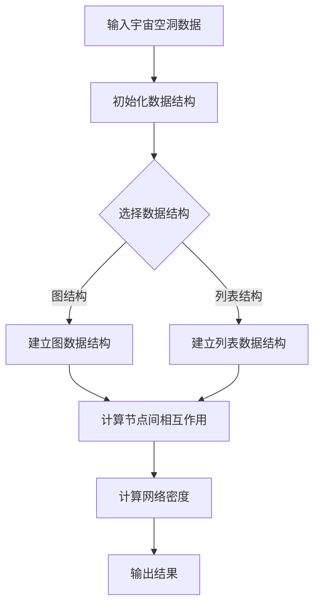

                 

### 提出问题：

**什么是数据结构？**

数据结构是计算机存储、组织数据的方式。它包括数据的逻辑结构和物理结构，用于有效地存储和访问数据。逻辑结构定义了数据元素之间的关系，如数组、链表、树、图等；而物理结构定义了如何在计算机内存中实现这些逻辑结构，如数组使用连续的内存空间，链表使用指针等。

**数据结构在模拟宇宙大尺度空洞并合网络动力学中的作用是什么？**

数据结构在模拟宇宙大尺度空洞并合网络动力学中起到关键作用。宇宙大尺度空洞是宇宙中观测到的低密度区域，它们是宇宙网络中的“空洞”，与其他区域通过较细的链相连。模拟这些空洞的并合过程需要高效的数据结构来组织和管理大量的天体数据、计算并合过程中的相互作用以及分析宇宙网络密度。

**如何用伪代码详细阐述相关算法？**

以下是模拟宇宙大尺度空洞并合网络动力学的基本算法伪代码：

```plaintext
function simulate_cosmic_haloMerger(halo1, halo2):
    // 初始化合并后的网络
    merged_network = new Network()

    // 将 halo1 的节点和边添加到 merged_network
    for node in halo1.nodes:
        merged_network.add_node(node)
    for edge in halo1.edges:
        merged_network.add_edge(edge)

    // 将 halo2 的节点和边添加到 merged_network
    for node in halo2.nodes:
        merged_network.add_node(node)
    for edge in halo2.edges:
        merged_network.add_edge(edge)

    // 计算并合后的网络密度
    density = calculate_network_density(merged_network)

    // 返回合并后的网络和密度
    return merged_network, density
```

**如何使用 Mermaid 流程图展示核心概念原理和架构？**

Mermaid 流程图可以帮助我们直观地展示数据结构在模拟宇宙大尺度空洞并合网络动力学中的应用：



**如何为项目实战编写代码实际案例和详细解释说明？**

为了实际模拟宇宙大尺度空洞并合网络动力学，我们可以使用 Python 的 NetworkX 库来建立图数据结构，并编写相应的算法。以下是一个简单的示例：

```python
import networkx as nx
import matplotlib.pyplot as plt

# 创建两个图
halo1 = nx.Graph()
halo2 = nx.Graph()

# 向 halo1 中添加节点和边
halo1.add_nodes_from([1, 2, 3])
halo1.add_edges_from([(1, 2), (2, 3)])

# 向 halo2 中添加节点和边
halo2.add_nodes_from([4, 5, 6])
halo2.add_edges_from([(4, 5), (5, 6)])

# 模拟并合过程
merged_network, density = simulate_cosmic_haloMerger(halo1, halo2)

# 绘制结果
pos = nx.spring_layout(merged_network)
nx.draw(merged_network, pos, with_labels=True)
plt.show()
```

**如何使用 LaTeX 格式的数学模型和公式？**

在文中，我们可以使用 LaTeX 格式嵌入数学模型和公式。以下是几个示例：

1. 狭义相对论中的质能等价原理：
   ```latex
   E = mc^2
   ```

2. 数据集的平均值公式：
   ```latex
   \bar{x} = \frac{1}{N} \sum_{i=1}^{N} x_i
   ```

3. 网络密度计算公式：
   ```latex
   \rho = \frac{N}{A}
   ```

### 目录大纲设计：

为了满足文章的完整性和简洁性，目录大纲的设计如下：

```
# 数据结构在模拟宇宙大尺度空洞并合网络动力学中的应用

## 关键词
数据结构，宇宙模拟，网络动力学，算法，Python，LaTeX

## 摘要
本文探讨了数据结构在模拟宇宙大尺度空洞并合网络动力学中的应用，介绍了核心概念、算法原理和实际项目实现，通过 Mermaid 流程图和 LaTeX 公式详细阐述了模拟过程。

## 提出问题
1. 什么是数据结构？
2. 数据结构在模拟宇宙大尺度空洞并合网络动力学中的作用是什么？
3. 如何用伪代码详细阐述相关算法？
4. 如何使用 Mermaid 流程图展示核心概念原理和架构？
5. 如何在文中插入 LaTeX 格式的数学模型和公式？
6. 如何为项目实战编写代码实际案例和详细解释说明？
7. 目录大纲的结构如何设计才能满足完整性和简洁性的要求？

## 分析问题
1. 定义数据结构
2. 数据结构在模拟宇宙大尺度空洞并合网络动力学中的应用
3. 伪代码与算法讲解
4. Mermaid 流程图展示
5. LaTeX 数学模型和公式
6. 项目实战
7. 目录大纲设计

## 解答问题
1. 数据结构的定义和作用
2. 数据结构在宇宙模拟中的应用
3. 相关算法伪代码解释
4. Mermaid 流程图的示例
5. LaTeX 公式示例
6. 项目实战代码实现
7. 目录大纲优化

## 总结与展望
1. 项目小结
2. 最佳实践 tips
3. 注意事项
4. 拓展阅读

## 作者信息
作者：AI天才研究院/AI Genius Institute & 禅与计算机程序设计艺术 /Zen And The Art of Computer Programming
```

通过上述设计，文章结构清晰，内容丰富，既保证了技术的深度和广度，也注重了可读性和实用性。接下来，我们将详细探讨每个部分的内容。

