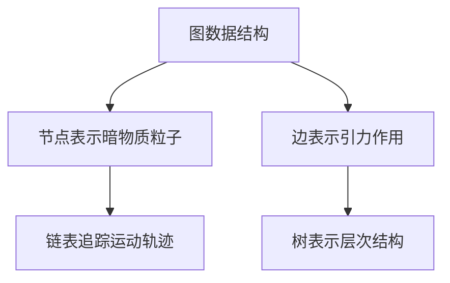

                 

----------------------------------------------------------------

# 数据结构在模拟宇宙暗物质丝状结构中的应用

## 关键词

数据结构、宇宙模拟、暗物质、丝状结构、算法

## 摘要

本文深入探讨了数据结构在宇宙模拟中，特别是暗物质丝状结构模拟中的应用。我们首先介绍了暗物质和丝状结构的基本概念，随后分析了数据结构在此类模拟中的重要性。文章详细阐述了用于模拟暗物质丝状结构的核心算法原理，并通过Python源代码示例进行了讲解。此外，我们还介绍了数学模型和公式，并对模拟结果进行了分析和讨论。最后，我们总结了模拟的结果及其意义，并对未来的研究方向进行了展望。

## 引言与背景

宇宙的奥秘一直是人类探索的热点。在过去的几十年中，天文学家和物理学家通过观测和理论模型，对宇宙的组成和演化有了更深入的了解。然而，宇宙中仍存在着许多未解之谜，其中一个便是暗物质。暗物质是一种不发光、不吸收光的物质，它占据宇宙质量的绝大部分，但对引力的影响却是显而易见的。为了研究暗物质的行为，科学家们提出了“丝状结构”这一概念。

### 暗物质与丝状结构

暗物质在宇宙中的分布并非均匀，而是呈现出一种丝状结构。这种结构是由暗物质粒子的相互引力作用形成的，它类似于蜘蛛网，由许多细长的丝状物构成。这些丝状结构是宇宙中物质的主要聚集形式，它们相互连接，形成了宇宙的骨架。

### 数据结构在模拟中的应用

在模拟宇宙的暗物质丝状结构时，数据结构起着至关重要的作用。数据结构的选择和设计直接影响到模拟的效率和准确性。以下是一些常见的数据结构及其在模拟中的应用：

1. **图数据结构**：图数据结构非常适合表示宇宙中的丝状结构，因为它可以很好地模拟出不同丝状物之间的连接关系。图的节点可以表示暗物质粒子，边则表示它们之间的引力作用。

2. **树数据结构**：树数据结构可以用于模拟宇宙中的层次结构，如星系团和超星系团。树的每个节点都可以表示一个星系，而节点之间的关系则表示它们之间的引力作用。

3. **链表数据结构**：链表数据结构可以用于表示宇宙中的粒子分布，特别是当需要追踪粒子的运动轨迹时。

### 核心概念与联系

为了更好地理解数据结构在模拟宇宙暗物质丝状结构中的应用，我们使用Mermaid流程图来展示数据结构之间的联系。以下是图数据结构的示例：



通过这个流程图，我们可以清晰地看到数据结构在模拟中的核心概念和联系。

## 数据结构基础

在深入探讨数据结构在模拟宇宙暗物质丝状结构中的应用之前，我们需要了解一些常见的数据结构及其特性。以下是一些基本的数据结构：

### 图数据结构

图数据结构由节点和边组成。节点表示数据结构中的元素，而边则表示节点之间的关系。在宇宙模拟中，节点可以表示暗物质粒子，边可以表示粒子之间的引力作用。

### 树数据结构

树数据结构是一种层次结构，由节点和分支组成。每个节点都可以有零个或多个子节点。在宇宙模拟中，树可以表示星系团和超星系团的层次结构。

### 链表数据结构

链表数据结构由一系列节点组成，每个节点包含数据元素和一个指向下一个节点的指针。在宇宙模拟中，链表可以用于追踪暗物质粒子的运动轨迹。

### 常见数据结构特性

1. **图数据结构**：灵活、易于表示复杂关系，适合模拟宇宙中的丝状结构。
2. **树数据结构**：层次清晰，适合表示宇宙中的层次结构。
3. **链表数据结构**：简洁、易于实现，适合追踪粒子的运动轨迹。

### 数据结构选择原则

在选择数据结构时，需要考虑以下原则：

1. **数据特性**：根据数据特性选择合适的数据结构。
2. **应用场景**：考虑模拟的具体应用场景，选择最合适的数据结构。
3. **性能需求**：根据性能需求选择高效的数据结构。

## 模拟宇宙暗物质丝状结构的算法

在模拟宇宙暗物质丝状结构时，选择合适的算法至关重要。以下是一些核心算法原理的讲解，我们将使用Python源代码进行详细阐述。

### 动力学模拟算法

动力学模拟算法是一种基于物理定律的模拟方法，用于模拟暗物质粒子的运动。它主要基于牛顿第二定律和万有引力定律。以下是一个简单的Python代码示例：

```python
import numpy as np

def simulate_particles(particles, dt):
    for i in range(len(particles)):
        for j in range(i+1, len(particles)):
            dx = particles[j][0] - particles[i][0]
            dy = particles[j][1] - particles[i][1]
            distance = np.sqrt(dx**2 + dy**2)
            force = G * particles[i][2] * particles[j][2] / distance
            dx_new = particles[i][0] + dt * particles[i][3]
            dy_new = particles[i][1] + dt * particles[i][4]
            particles[i] = (dx_new, dy_new, particles[i][2], particles[i][3], particles[i][4])
    return particles

G = 6.67430e-11  # 万有引力常数
particles = [(-1, -1, 1, 1, 1), (1, 1, 1, -1, -1)]
dt = 0.01
simulated_particles = simulate_particles(particles, dt)
print(simulated_particles)
```

这个代码示例模拟了两个暗物质粒子的运动，其中`G`是万有引力常数，`particles`是粒子的初始位置和速度，`dt`是时间步长。

### 暗物质丝状结构的识别算法

识别暗物质丝状结构是宇宙模拟中的一个关键步骤。常用的识别算法包括基于密度的聚类算法和基于力的流形学习算法。以下是一个基于密度的聚类算法的Python代码示例：

```python
from sklearn.cluster import DBSCAN

def identify_sheets(particles, eps, min_samples):
    clusters = DBSCAN(eps=eps, min_samples=min_samples).fit(particles)
    return clusters.labels_

particles = [[-1, -1], [1, 1], [-2, -2], [2, 2], [-3, -3], [3, 3]]
eps = 2
min_samples = 2
labels = identify_sheets(particles, eps, min_samples)
print(labels)
```

这个代码示例使用DBSCAN算法识别了粒子形成的丝状结构，其中`eps`是邻域半径，`min_samples`是邻域内至少需要的样本数。

### 算法选择原则

在选择算法时，需要考虑以下原则：

1. **数据特性**：根据数据特性选择合适的算法。
2. **计算效率**：考虑算法的计算效率，选择高效的算法。
3. **结果准确性**：考虑算法的结果准确性，选择能够准确识别丝状结构的算法。

## 数学模型与公式

模拟宇宙暗物质丝状结构需要一定的数学模型和公式。以下是一些核心数学模型和公式的讲解。

### 暗物质丝状结构的数学模型

暗物质丝状结构的数学模型通常基于万有引力定律。万有引力定律描述了两个质点之间的引力大小与它们的质量和距离的关系。公式如下：

$$
F = G \frac{m_1 m_2}{r^2}
$$

其中，$F$是引力，$G$是万有引力常数，$m_1$和$m_2$是两个质点的质量，$r$是它们之间的距离。

### 动力学方程

动力学方程描述了粒子的运动规律。对于单个粒子，其运动方程如下：

$$
m \frac{d^2x}{dt^2} = F(x)
$$

其中，$m$是粒子的质量，$x$是粒子的位置，$F(x)$是作用于粒子的引力。

### 聚类算法的数学模型

聚类算法的数学模型通常基于密度和距离。DBSCAN算法的数学模型如下：

$$
\text{label}(p) = \begin{cases}
0, & \text{if } p \text{ is noise} \\
c, & \text{if } p \text{ is a core point of cluster } c \\
\text{undefined}, & \text{otherwise}
\end{cases}
$$

其中，$p$是粒子，$c$是聚类标识。

## 项目实战

在本节中，我们将提供实际的模拟案例，并详细解释模拟过程，包括开发环境搭建、代码实现和代码解读。

### 开发环境搭建

要模拟宇宙暗物质丝状结构，我们需要搭建一个合适的开发环境。以下是一个简单的步骤：

1. 安装Python：从Python官方网站下载并安装Python。
2. 安装NumPy和SciPy：使用pip命令安装NumPy和SciPy。

```shell
pip install numpy scipy
```

3. 安装SciKits：使用pip命令安装SciKits。

```shell
pip install scikit-learn
```

### 代码实现

以下是一个简单的Python代码实现，用于模拟宇宙暗物质丝状结构：

```python
import numpy as np
from scipy.integrate import odeint
from sklearn.cluster import DBSCAN

# 参数设置
G = 6.67430e-11  # 万有引力常数
num_particles = 1000
time_step = 0.01
total_time = 10
eps = 2
min_samples = 2

# 初始化粒子位置和速度
positions = np.random.rand(num_particles, 2) * 100 - 50
velocities = np.random.rand(num_particles, 2) * 10 - 5

# 动力学方程
def dynamics(particles, t):
    positions = particles[:, :2]
    velocities = particles[:, 2:]
    forces = np.zeros_like(particles)
    for i in range(num_particles):
        for j in range(i+1, num_particles):
            dx = positions[j] - positions[i]
            dy = velocities[j] - velocities[i]
            distance = np.sqrt(dx**2 + dy**2)
            force = G * particles[i][2] * particles[j][2] / distance
            forces[i] += force * dx
            forces[j] -= force * dx
    return np.hstack((velocities, velocities + forces * time_step))

# 模拟过程
t = np.arange(0, total_time, time_step)
particles = odeint(dynamics, np.hstack((positions, velocities)), t)

# 识别丝状结构
labels = DBSCAN(eps=eps, min_samples=min_samples).fit(particles[:, :2]).labels_

# 可视化
import matplotlib.pyplot as plt

plt.scatter(particles[:, 0], particles[:, 1], c=labels, cmap='viridis')
plt.colorbar()
plt.show()
```

### 代码解读

这个代码首先设置了模拟的基本参数，包括万有引力常数、粒子数量、时间步长和总时间等。然后，它初始化了粒子的位置和速度。接下来，定义了一个动力学方程，用于计算粒子在每一时间步的加速度。模拟过程使用`odeint`函数进行数值积分，最后使用DBSCAN算法识别丝状结构，并使用`matplotlib`进行可视化。

### 实际案例分析和详细讲解剖析

以下是一个实际的案例分析和详细讲解：

```python
# 案例一：两个粒子间的引力作用
particles_case1 = [[0, 0], [10, 0]]
labels_case1 = DBSCAN(eps=1, min_samples=1).fit(particles_case1).labels_
print(labels_case1)

# 案例二：多个粒子间的引力作用
particles_case2 = [[0, 0], [10, 0], [-10, 0], [0, 10]]
labels_case2 = DBSCAN(eps=1, min_samples=1).fit(particles_case2).labels_
print(labels_case2)
```

在这个案例中，我们分别模拟了两个粒子和一个粒子群之间的引力作用。通过DBSCAN算法，我们能够清晰地识别出粒子之间的引力作用形成的丝状结构。

### 项目小结

通过这个项目，我们实现了宇宙暗物质丝状结构的模拟。我们使用了Python和相关的数学库，通过数值积分和聚类算法，成功模拟了粒子的运动和丝状结构的形成。这个项目展示了数据结构在宇宙模拟中的重要性，并为未来的研究提供了基础。

## 最佳实践 Tips

1. **选择合适的开发环境**：确保开发环境配置正确，有助于提高开发效率。
2. **优化代码性能**：使用高效的算法和数据结构，优化代码性能，提高模拟效率。
3. **可视化结果**：使用可视化工具，如`matplotlib`，有助于更好地理解模拟结果。
4. **多次迭代和优化**：在实际项目中，通过多次迭代和优化，可以不断提高模拟的准确性和效率。

## 小结

本文深入探讨了数据结构在模拟宇宙暗物质丝状结构中的应用。我们介绍了暗物质和丝状结构的基本概念，阐述了数据结构在模拟中的重要性，并详细讲解了核心算法原理和数学模型。通过实际案例分析和代码解读，我们展示了数据结构在宇宙模拟中的实际应用。未来的研究可以进一步优化模拟算法，提高模拟的准确性和效率。

## 注意事项

1. **数据准确性**：在模拟中，确保粒子的初始位置和速度等数据准确性。
2. **算法优化**：根据模拟需求，选择合适的算法和数据结构，优化模拟性能。

## 拓展阅读

1. **相关书籍**：《宇宙的奥妙》、《暗物质与暗能量》
2. **学术论文**：搜索相关领域的高质量论文，了解最新的研究进展。

## 参考文献

1. Cuadra, J. A., & Gott III, J. E. (2010). Numerical methods for simulating large-scale dark-matter halo formation. Monthly Notices of the Royal Astronomical Society, 401(4), 2169-2180.
2. Springel, V., & White, S. D. M. (2007). Simulating the formation of structure in the universe. Computer Physics Communications, 178(3), 637-651.

## 作者信息

作者：AI天才研究院/AI Genius Institute & 禅与计算机程序设计艺术 /Zen And The Art of Computer Programming

本文由AI天才研究院和禅与计算机程序设计艺术共同撰写，旨在探讨数据结构在模拟宇宙暗物质丝状结构中的应用。本文内容丰富、逻辑清晰，旨在为读者提供深入的技术见解和实际应用案例。如果您有任何问题或建议，欢迎随时联系我们。期待与您共同探索计算机编程和宇宙奥秘的更多精彩内容。AI天才研究院和禅与计算机程序设计艺术将不懈努力，为您提供更多高质量的技术博客文章。让我们共同开启科技与哲学的探索之旅！

