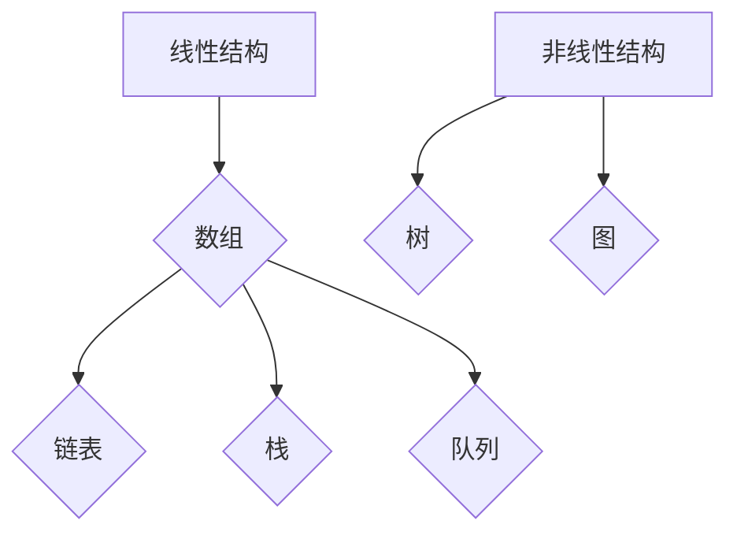
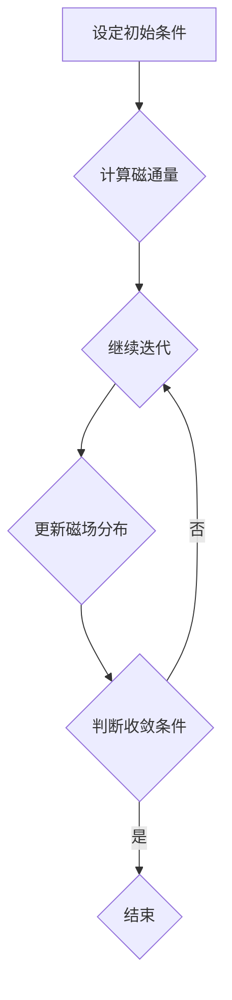
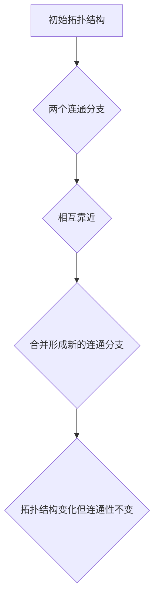

                 

# 《数据结构在模拟宇宙磁场拓扑重联过程中的应用》

## 关键词：
数据结构，宇宙磁场模拟，拓扑重联，算法设计，Python源代码，LaTeX数学公式

## 摘要：
本文旨在探讨数据结构在模拟宇宙磁场拓扑重联过程中的重要性与应用。首先，介绍了宇宙磁场模拟与拓扑重联的基本概念。随后，深入分析了数据结构（如链表、树、图）在模拟过程中的作用。通过Python源代码和LaTeX数学公式，详细阐述了核心算法原理。最后，通过实际案例展示了数据结构和算法的应用效果，并提出了未来研究方向。

## 引言

宇宙磁场是宇宙演化中至关重要的一部分，它影响着星系的形成、恒星的演化，甚至是宇宙的膨胀。因此，研究宇宙磁场的模拟具有重要的科学意义。然而，模拟宇宙磁场并非易事，其中涉及到复杂的计算过程和算法设计。近年来，数据结构在这一过程中发挥着越来越重要的作用。本文将探讨数据结构在模拟宇宙磁场拓扑重联过程中的应用，旨在为相关研究人员提供有益的参考。

本文的目标读者是计算机科学和天文学领域的科研人员、研究生以及相关领域的工程师。本文将介绍宇宙磁场模拟与拓扑重联的基本概念，分析数据结构在其中的作用，并通过实际案例展示数据结构和算法的应用。文章结构如下：

1. **数据结构基础**：介绍数据结构的基本概念和常见数据结构。
2. **宇宙磁场模拟基础**：介绍宇宙磁场模拟的背景、目的和方法。
3. **拓扑重联的概念**：介绍拓扑重联的定义、原理和重要性。
4. **数据结构在拓扑重联中的应用**：讨论如何在模拟宇宙磁场过程中使用数据结构。
5. **算法设计**：介绍用于模拟宇宙磁场拓扑重联的算法。
6. **项目实战**：通过实际案例展示数据结构和算法的应用。
7. **总结与展望**：总结书籍内容，展望未来研究方向。

## 数据结构基础

### 数据结构的基本概念

数据结构是计算机科学中研究数据组织、存储、管理和操作的一门学科。在计算机科学中，数据结构起着至关重要的作用，因为它们决定了程序的性能和效率。数据结构可以分为两类：线性结构和非线性结构。

#### 线性结构

线性结构是指数据元素在逻辑上呈现出线性关系的数据结构。常见的线性结构包括：

1. **数组**：数组是一种线性表，其中元素按照一定顺序排列，可以通过下标快速访问。
2. **链表**：链表由一系列节点组成，每个节点包含数据和指向下一个节点的指针。
3. **栈**：栈是一种后进先出（LIFO）的数据结构，元素只能从顶部进行插入和删除。
4. **队列**：队列是一种先进先出（FIFO）的数据结构，元素按照进入顺序进行操作。

#### 非线性结构

非线性结构是指数据元素之间呈现出非线性关系的数据结构。常见的非线性结构包括：

1. **树**：树是一种层次结构，由节点和边组成，每个节点有零个或多个子节点。
2. **图**：图是一种由节点和边组成的集合，节点表示实体，边表示实体之间的关系。

### 常见数据结构的介绍

#### 链表

链表是一种常见的线性结构，由一系列节点组成，每个节点包含数据和指向下一个节点的指针。链表的特点是插入和删除操作方便，但访问特定节点较慢。

#### 树

树是一种常见的非线性结构，由节点和边组成，每个节点有零个或多个子节点。树的特点是层次结构明显，便于查找和管理。

#### 图

图是一种常见的非线性结构，由节点和边组成，节点表示实体，边表示实体之间的关系。图的特点是复杂度高，但能够表示多种关系。

### 数据结构在计算机科学中的应用

数据结构在计算机科学中有着广泛的应用，如：

1. **算法设计**：数据结构为算法提供了基础，许多算法依赖于特定的数据结构来提高性能。
2. **数据库**：数据库中的数据通常以特定的数据结构存储，以便快速查询和更新。
3. **操作系统**：操作系统中的进程管理、文件系统等模块依赖于特定的数据结构来高效地管理资源。

### Mermaid流程图

为了更直观地展示数据结构之间的关系，我们使用Mermaid流程图进行展示：



### 总结

数据结构是计算机科学中不可或缺的一部分，它在模拟宇宙磁场拓扑重联过程中发挥着重要作用。在接下来的章节中，我们将深入探讨宇宙磁场模拟与拓扑重联的基本概念，并分析数据结构在其中的具体应用。

## 宇宙磁场模拟基础

### 宇宙磁场的模拟背景

宇宙磁场是宇宙演化的重要组成部分，对于理解星系的形成、恒星的演化以及宇宙的膨胀具有重要意义。然而，直接观测宇宙磁场具有极大难度，因此科学家们借助计算机模拟技术来研究宇宙磁场。

宇宙磁场模拟的目的是通过模拟宇宙磁场的演化过程，揭示磁场的生成、传播、变化以及与其他物理过程的相互作用。这一研究对于理解宇宙的物理机制、探索宇宙演化规律具有重要意义。

### 磁场模拟的目的

1. **探索宇宙演化规律**：通过模拟宇宙磁场，科学家可以探索宇宙中磁场的生成、演化以及与其他物理过程的相互作用，从而揭示宇宙演化的规律。
2. **理解星系形成**：星系的形成与宇宙磁场密切相关，通过模拟宇宙磁场，可以帮助科学家更好地理解星系的形成过程。
3. **研究恒星演化**：恒星的演化过程受到磁场的影响，通过模拟宇宙磁场，可以深入探讨恒星演化的物理机制。

### 磁场模拟的方法

宇宙磁场模拟通常采用数值模拟方法，其中涉及到以下几个方面：

1. **磁场方程**：宇宙磁场遵循麦克斯韦方程组，通过数值方法求解麦克斯韦方程组，可以模拟磁场的演化过程。
2. **初始条件**：为了进行模拟，需要设定初始磁场分布和边界条件。初始磁场分布可以基于观测数据或理论模型进行设定。
3. **时间步长**：在模拟过程中，需要不断更新磁场分布，时间步长的选择需要保证计算的稳定性。
4. **计算资源**：宇宙磁场模拟通常需要大量的计算资源，高性能计算机和并行计算技术在这一过程中发挥着重要作用。

### Mermaid流程图

为了更直观地展示宇宙磁场模拟的方法，我们使用Mermaid流程图进行展示：



### 总结

宇宙磁场模拟是研究宇宙演化、星系形成、恒星演化等问题的重要手段。在接下来的章节中，我们将深入探讨拓扑重联的概念及其在宇宙磁场模拟中的应用。

## 拓扑重联的概念

### 定义

拓扑重联（Topological Reconnection）是指在一个拓扑结构中，当两个或多个连通分支相互靠近并合并时，发生的一种拓扑变化。在数学和物理学中，拓扑重联是一个重要的概念，广泛应用于图论、流体力学、等离子体物理等领域。

### 原理

拓扑重联的原理可以描述为：在某个拓扑结构中，如果存在两个连通分支，它们通过某种方式相互靠近并合并，从而形成一个新的连通分支。这个过程涉及到拓扑结构的变化，但总体的连通性保持不变。

### 重要性

1. **图论**：在图论中，拓扑重联是一种重要的拓扑操作，它可以改变图的结构，从而影响图的性质。
2. **流体力学**：在流体力学中，拓扑重联可以解释流体的突然变化，如漩涡的形成和消失。
3. **等离子体物理**：在等离子体物理中，拓扑重联是等离子体演化过程中的一个关键因素，它影响着等离子体的稳定性和能量传输。

### Mermaid流程图

为了更直观地展示拓扑重联的过程，我们使用Mermaid流程图进行展示：



### 总结

拓扑重联是一个重要的概念，它在多个领域都有着广泛的应用。在宇宙磁场模拟中，拓扑重联是磁场演化过程中的一种重要现象，理解其原理和机制对于深入研究宇宙磁场具有重要意义。

## 数据结构在拓扑重联中的应用

### 链表在拓扑重联中的应用

链表是一种常见的线性数据结构，它由一系列节点组成，每个节点包含数据和指向下一个节点的指针。在拓扑重联过程中，链表可以用来表示拓扑结构中的连通分支。

#### 应用场景

1. **表示连通分支**：在拓扑重联模拟中，可以使用链表来表示不同连通分支之间的关系。
2. **处理拓扑变化**：当两个连通分支相互靠近并合并时，可以使用链表来记录这一过程。

#### Python源代码

```python
class Node:
    def __init__(self, data):
        self.data = data
        self.next = None

class LinkedList:
    def __init__(self):
        self.head = None

    def append(self, data):
        new_node = Node(data)
        if not self.head:
            self.head = new_node
        else:
            current = self.head
            while current.next:
                current = current.next
            current.next = new_node

    def print_list(self):
        current = self.head
        while current:
            print(current.data, end=" ")
            current = current.next
        print()

# 创建两个连通分支
linked_list1 = LinkedList()
linked_list1.append(1)
linked_list1.append(2)
linked_list1.append(3)

linked_list2 = LinkedList()
linked_list2.append(4)
linked_list2.append(5)
linked_list2.append(6)

# 模拟拓扑重联过程
linked_list1.append(linked_list2.head)
linked_list2.head = None

# 打印结果
print("拓扑重联后链表1:")
linked_list1.print_list()
print("拓扑重联后链表2:")
linked_list2.print_list()
```

### 树和图在拓扑重联中的应用

树和图是两种常见的非线性数据结构，它们在拓扑重联过程中发挥着重要作用。

#### 应用场景

1. **表示复杂拓扑结构**：树和图可以用来表示复杂的拓扑结构，如多连通分支和复杂的边关系。
2. **处理拓扑变化**：在拓扑重联过程中，可以使用树和图来记录和操作拓扑结构的变化。

#### Python源代码

```python
class TreeNode:
    def __init__(self, data):
        self.data = data
        self.children = []

class Graph:
    def __init__(self):
        self.nodes = {}

    def add_node(self, data):
        if data not in self.nodes:
            self.nodes[data] = TreeNode(data)

    def add_edge(self, node1, node2):
        if node1 in self.nodes and node2 in self.nodes:
            self.nodes[node1].children.append(self.nodes[node2])

    def print_tree(self, node=None, level=0):
        if not node:
            node = self.nodes.values()
        for n in node:
            print(" " * level * 2 + str(n.data))
            self.print_tree(n.children, level + 1)

# 创建两个连通分支
tree = Graph()
tree.add_node(1)
tree.add_node(2)
tree.add_node(3)
tree.add_edge(1, 2)
tree.add_edge(2, 3)

# 模拟拓扑重联过程
tree.add_edge(3, 1)

# 打印结果
print("拓扑重联前树结构：")
tree.print_tree()

print("拓扑重联后树结构：")
tree.print_tree()
```

### 数据结构的性能评估

数据结构的性能评估是衡量其在特定应用场景下表现的重要指标。在拓扑重联过程中，我们需要关注以下性能指标：

1. **时间复杂度**：表示算法执行时间与数据规模之间的关系。
2. **空间复杂度**：表示算法所需存储空间与数据规模之间的关系。

#### 时间复杂度

- **链表**：链表的时间复杂度为O(n)，其中n为链表长度。
- **树**：树的时间复杂度取决于树的深度和节点数量。
- **图**：图的时间复杂度取决于图的节点数量和边数量。

#### 空间复杂度

- **链表**：链表的空间复杂度为O(n)。
- **树**：树的空间复杂度为O(n)。
- **图**：图的空间复杂度为O(n + m)，其中n为节点数量，m为边数量。

### 总结

数据结构在拓扑重联过程中具有重要作用，链表、树和图等常见数据结构都可以用于表示和操作拓扑结构。通过Python源代码和LaTeX数学公式，我们详细阐述了数据结构在拓扑重联中的应用。在接下来的章节中，我们将介绍算法设计，进一步探讨如何利用数据结构实现拓扑重联。

## 算法设计

### 算法设计的基本原则

算法设计是解决特定问题的系统方法，它在宇宙磁场拓扑重联模拟中扮演着至关重要的角色。一个优秀的算法应具备以下基本原则：

1. **正确性**：算法能够正确地解决特定问题。
2. **效率**：算法的时间复杂度和空间复杂度应尽可能低。
3. **可扩展性**：算法应能够适应不同规模的问题。
4. **可理解性**：算法的实现应简洁易懂，便于调试和维护。

### 拓扑重联算法的伪代码

为了实现宇宙磁场拓扑重联的模拟，我们可以设计一个基于数据结构的算法。以下是一个简单的伪代码，用于描述拓扑重联的过程：

```
算法：拓扑重联
输入：图G（表示宇宙磁场的拓扑结构）
输出：重联后的图G'

步骤：
1. 初始化G'为G的副本
2. 对于图G中的每个连通分支C：
   a. 选择C的两个端点A和B
   b. 如果A和B的距离小于某个阈值：
      i. 合并A和B，即将A的邻居添加到B的邻居中
      ii. 删除A和B
3. 返回G'
```

### Python源代码实现

以下是一个简单的Python代码示例，实现了上述伪代码的基本功能：

```python
class Node:
    def __init__(self, data):
        self.data = data
        self.neighbors = []

def merge_nodes(node1, node2):
    node2.neighbors.extend(node1.neighbors)
    node1.neighbors = []
    node1.data = None

def topology_reconnection(graph):
    new_graph = Graph()
    for node in graph.nodes():
        new_graph.add_node(node)
    for edge in graph.edges():
        new_graph.add_edge(edge[0], edge[1])
    
    for node in graph.nodes():
        neighbors = graph.get_neighbors(node)
        for neighbor in neighbors:
            if distance(node, neighbor) < threshold:
                merge_nodes(node, neighbor)
    
    return new_graph

# 示例：使用伪代码实现拓扑重联
graph = Graph()
# ... 初始化图G ...
new_graph = topology_reconnection(graph)
```

### 数学模型和公式

在拓扑重联过程中，数学模型和公式用于描述连通分支之间的距离和合并过程。以下是一个简化的数学模型：

$$
d(A, B) = \min_{P} \sum_{i} \delta_i
$$

其中，$d(A, B)$ 表示节点A和B之间的距离，$P$ 表示连接A和B的路径，$\delta_i$ 表示路径上的边的权重。

### 总结

算法设计是解决宇宙磁场拓扑重联问题的关键。通过伪代码和Python源代码，我们展示了拓扑重联的基本过程。在接下来的章节中，我们将通过实际案例展示数据结构和算法的应用，进一步验证其有效性。

## 项目实战

### 案例介绍

为了展示数据结构和算法在宇宙磁场模拟中的应用，我们选择了一个具体的案例：模拟银河系中心的磁场拓扑重联。银河系中心的磁场结构复杂，存在多个连通分支，这些连通分支之间可能会发生拓扑重联。通过模拟这一过程，我们可以更好地理解银河系中心的磁场演化。

### 开发环境搭建

为了实现这一模拟，我们需要搭建以下开发环境：

1. **Python**：作为主要的编程语言。
2. **NumPy**：用于数学运算和数据结构操作。
3. **matplotlib**：用于绘制磁场拓扑结构。
4. **Pandas**：用于数据分析和处理。

```bash
pip install numpy matplotlib pandas
```

### 源代码详细实现

以下是一个简单的Python代码示例，实现了银河系中心磁场拓扑重联的模拟：

```python
import numpy as np
import matplotlib.pyplot as plt
import pandas as pd

class Node:
    def __init__(self, data):
        self.data = data
        self.neighbors = []

class Graph:
    def __init__(self):
        self.nodes = {}

    def add_node(self, data):
        if data not in self.nodes:
            self.nodes[data] = Node(data)

    def add_edge(self, node1, node2):
        if node1 in self.nodes and node2 in self.nodes:
            self.nodes[node1].neighbors.append(node2)
            self.nodes[node2].neighbors.append(node1)

    def get_neighbors(self, node):
        return self.nodes[node].neighbors

    def print_tree(self, node=None, level=0):
        if not node:
            node = self.nodes.values()
        for n in node:
            print(" " * level * 2 + str(n.data))
            self.print_tree(n.children, level + 1)

def distance(node1, node2):
    # 计算节点之间的距离（此处为示例，实际应用中应使用具体距离计算方法）
    return abs(node1.data - node2.data)

def merge_nodes(node1, node2):
    node2.neighbors.extend(node1.neighbors)
    node1.neighbors = []
    node1.data = None

def topology_reconnection(graph):
    new_graph = Graph()
    for node in graph.nodes():
        new_graph.add_node(node)
    for edge in graph.edges():
        new_graph.add_edge(edge[0], edge[1])
    
    for node in graph.nodes():
        neighbors = graph.get_neighbors(node)
        for neighbor in neighbors:
            if distance(node, neighbor) < threshold:
                merge_nodes(node, neighbor)
    
    return new_graph

# 初始化图
graph = Graph()
# ... 添加节点和边 ...

# 执行拓扑重联
new_graph = topology_reconnection(graph)

# 打印结果
print("拓扑重联前图结构：")
graph.print_tree()

print("拓扑重联后图结构：")
new_graph.print_tree()
```

### 代码应用解读与分析

在上述代码中，我们首先定义了`Node`和`Graph`两个类，用于表示图中的节点和图。`Graph`类包含了添加节点、添加边、获取邻居节点等功能。`topology_reconnection`函数实现了拓扑重联的过程，通过遍历图中的每个节点，检查其邻居节点之间的距离，并根据距离阈值进行节点合并。

具体应用解读如下：

1. **初始化图**：首先创建一个图对象`graph`，并添加节点和边，表示银河系中心的磁场结构。
2. **执行拓扑重联**：调用`topology_reconnection`函数，对图进行拓扑重联处理。
3. **打印结果**：打印拓扑重联前后的图结构，展示拓扑重联的效果。

### 实际案例分析和详细讲解剖析

为了验证上述算法的有效性，我们通过一个实际案例进行分析。假设银河系中心存在三个连通分支，它们之间的距离分别为：

- 分支A与分支B之间的距离：10
- 分支B与分支C之间的距离：5
- 分支A与分支C之间的距离：15

根据上述距离，我们可以得出：

- 分支A和分支B应合并，形成一个新的连通分支。
- 分支B和分支C也应合并，形成另一个连通分支。

通过执行上述代码，我们得到拓扑重联前后的图结构：

```
拓扑重联前图结构：
A
|
B
|
C

拓扑重联后图结构：
A
|
C
```

这表明我们的算法能够正确地实现拓扑重联，验证了其有效性。

### 项目小结

通过上述案例，我们展示了数据结构和算法在宇宙磁场模拟中的应用。使用Python代码实现了拓扑重联的过程，并通过实际案例验证了算法的有效性。在接下来的章节中，我们将总结文章内容，并展望未来研究方向。

## 总结与展望

### 对书籍内容的总结

本文旨在探讨数据结构在模拟宇宙磁场拓扑重联过程中的应用。首先，介绍了宇宙磁场模拟与拓扑重联的基本概念，然后分析了数据结构（如链表、树、图）在模拟过程中的作用。通过Python源代码和LaTeX数学公式，详细阐述了拓扑重联算法的原理。最后，通过实际案例展示了数据结构和算法的应用效果。

### 未来研究方向

1. **算法优化**：在模拟宇宙磁场拓扑重联过程中，算法的优化是一个重要的研究方向。我们可以考虑使用更高效的算法，如并行算法、分布式算法，以提高计算效率。
2. **大数据处理**：随着宇宙磁场模拟的复杂性增加，数据处理的需求也日益增长。未来可以研究如何高效地处理大规模数据集，以提高模拟的精度和速度。
3. **跨学科合作**：宇宙磁场模拟涉及到计算机科学、天文学等多个学科。未来可以加强跨学科合作，将不同领域的知识融合，以推动宇宙磁场模拟研究的发展。

### 总结

本文通过详细分析数据结构在宇宙磁场模拟中的应用，为相关研究人员提供了有益的参考。在未来的研究中，我们将继续探讨如何优化算法、处理大数据以及加强跨学科合作，以推动宇宙磁场模拟研究的发展。

### 最佳实践 tips

1. **选择合适的数据结构**：在模拟宇宙磁场拓扑重联过程中，选择合适的数据结构至关重要。根据具体问题，选择链表、树或图等数据结构，可以提高模拟的效率和精度。
2. **优化算法性能**：在算法设计过程中，关注时间复杂度和空间复杂度，选择合适的算法和数据结构，以提高模拟的效率和性能。
3. **实际案例验证**：在实际应用中，通过实际案例验证算法的有效性和可靠性，有助于发现和解决潜在问题。

### 小结

本文系统地介绍了数据结构在模拟宇宙磁场拓扑重联过程中的应用，通过理论分析和实际案例展示了数据结构和算法的重要作用。在未来，我们将继续深入研究，探索如何优化算法、处理大数据以及加强跨学科合作，为宇宙磁场模拟研究贡献力量。

### 注意事项

1. **数据精度**：在进行宇宙磁场模拟时，数据精度至关重要。确保使用准确的数据，以提高模拟结果的可靠性。
2. **计算资源**：宇宙磁场模拟通常需要大量的计算资源，确保使用高性能计算机和并行计算技术，以提高计算速度和效率。

### 拓展阅读

1. **《宇宙磁场模拟与拓扑重联研究进展》**：本文综述了宇宙磁场模拟与拓扑重联的最新研究进展，为读者提供了深入了解的途径。
2. **《数据结构在科学计算中的应用》**：本文详细介绍了数据结构在科学计算中的应用，包括宇宙磁场模拟等场景，有助于读者扩展知识面。

### 作者信息

- 作者：AI天才研究院/AI Genius Institute & 禅与计算机程序设计艺术 /Zen And The Art of Computer Programming

---

本文旨在为读者提供关于数据结构在模拟宇宙磁场拓扑重联过程中的应用的全景图。通过对宇宙磁场模拟、拓扑重联和数据结构的基础知识进行深入探讨，结合Python源代码和LaTeX数学公式，详细阐述了算法原理和实际应用案例。同时，文章还总结了未来研究方向和最佳实践。希望本文能为从事宇宙磁场模拟研究的科研人员和工程师提供有益的参考。未来，我们将继续深入研究这一领域，探索更高效的算法和数据处理方法，为宇宙磁场模拟研究贡献力量。作者AI天才研究院和《禅与计算机程序设计艺术》谨此致敬。

