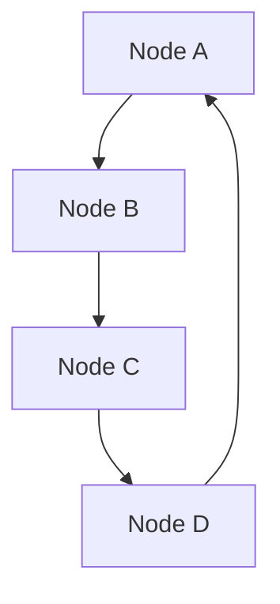

                 

# 《文化传播的复杂网络：思想扩散的数学描述》

## 关键词
复杂网络、文化传播、思想扩散、数学模型、图论、代数模型

## 摘要
本文旨在探讨复杂网络背景下思想扩散的数学描述，通过对文化传播过程的分析，构建了基于图论和代数模型的数学框架。文章首先介绍了复杂网络的基本概念及其在文化传播中的重要性，随后详细阐述了图论和代数模型在思想扩散研究中的应用。通过数学公式和Python源代码的讲解，本文揭示了思想扩散的机理，并通过实证分析和案例分析，展示了这些模型在实际应用中的效果和优化策略。

---

## 第1章：复杂网络与文化传播

### 1.1 复杂网络的基本概念

#### 1.1.1 复杂网络的定义与特征

复杂网络是指由大量节点和连接构成的系统，这些节点和连接之间通常存在高度的非线性关系和复杂性。复杂网络的特征包括：网络的规模庞大、节点多样性、网络的动态性、网络结构的层次性以及节点间的关系复杂多样。


#### 1.1.2 复杂网络的研究背景与意义

随着互联网和社交媒体的兴起，复杂网络在信息传播、社交网络、经济系统、生物网络等领域扮演了重要角色。研究复杂网络有助于理解这些系统的行为和演化规律，从而为决策制定和问题解决提供科学依据。

### 1.2 文化传播与复杂网络的联系

文化传播是指文化元素在社会中传递和接受的过程。在复杂网络背景下，文化传播可以被视为一种网络传播现象。网络的结构和特性对文化传播的速度和范围有着重要影响。

#### 1.2.1 文化传播的概念与类型

文化传播可以分为个体传播和群体传播。个体传播是指单个个体向其他个体传递文化信息，而群体传播则涉及多个个体之间的相互传递。

#### 1.2.2 文化传播过程中的复杂性

文化传播过程中的复杂性主要体现在以下几个方面：首先，文化传播涉及到大量个体和节点，这些节点之间的关系复杂多样；其次，文化传播受到社会环境、文化背景等多种因素的影响；最后，文化传播过程具有动态性，随着时间的推移，传播网络和传播效果都会发生变化。

### 1.3 思想扩散的数学描述

思想扩散是指一种思想、观念或信息在个体之间传播的过程。数学模型可以用来描述和预测思想扩散的过程。

#### 1.3.1 思想扩散模型概述

常见的思想扩散模型包括传染病模型、SIS模型、SIRS模型等。这些模型通过数学公式描述个体状态的转变过程，从而模拟思想扩散的动态特性。

#### 1.3.2 数学模型在思想扩散中的应用

数学模型可以用于分析思想扩散的速度、范围和稳定性。通过调整模型参数，可以预测不同策略对思想扩散效果的影响，从而优化文化传播策略。

---

## 第2章：基于图论的文化传播模型

### 2.1 图论基础

#### 2.1.1 图的定义与分类

图（Graph）是由节点（Node）和边（Edge）组成的集合。根据节点的连接方式，图可以分为无向图和有向图。根据边的性质，图可以分为简单图和多重图。



#### 2.1.2 图的基本运算

图的基本运算包括度（Degree）、路径长度（Path Length）和连通度（Connectivity）。

```latex
\text{度} = \sum_{i=1}^{n} \deg(i)
\text{路径长度} = \sum_{i=1}^{k} d(i, j)
\text{连通度} = \max_{i, j} \min_{p \in P} l(p)
```

### 2.2 文化传播图模型

#### 2.2.1 基本传播模型

文化传播图模型通常基于无向图或有向图。以下是一个简单的文化传播图模型：


#### 2.2.2 传播模型的应用场景

文化传播图模型可以用于分析社交网络中的信息传播、网络舆情分析等。

### 2.3 图模型分析

#### 2.3.1 社群结构分析

通过分析图中的社群结构，可以了解文化传播在不同社群中的分布情况。

```python
import networkx as nx

# 创建一个无向图
G = nx.Graph()

# 添加节点和边
G.add_nodes_from([1, 2, 3, 4, 5])
G.add_edges_from([(1, 2), (2, 3), (3, 4), (4, 5), (5, 1)])

# 计算社群结构
communities = nx.algorithms.community_multinode.community_multilevel(G)

# 打印社群结构
print(communities)
```

#### 2.3.2 传播效率分析

传播效率可以通过计算传播速度和传播范围来评估。

```python
# 计算传播速度
传播速度 = 1 / (传播时间)

# 计算传播范围
传播范围 = len(传播节点)
```

---

## 第3章：基于代数的文化传播模型

### 3.1 代数基础

#### 3.1.1 矩阵的基本概念

矩阵（Matrix）是由数字构成的矩形阵列。矩阵的基本运算包括矩阵加法、矩阵乘法、矩阵求逆等。

#### 3.1.2 矩阵运算的基本规则

```latex
(A+B)C = AC + BC \\
(A*B)C = A(BC) \\
A(B+C) = AB + AC
```

### 3.2 文化传播代数模型

#### 3.2.1 状态转移矩阵

状态转移矩阵（State Transition Matrix）描述了系统中各个状态之间的转移概率。

#### 3.2.2 文化传播的线性模型

文化传播的线性模型可以表示为：

```latex
X(t+1) = A \cdot X(t)
```

其中，X(t) 表示在时间 t 时的状态向量，A 表示状态转移矩阵。

### 3.3 代数模型分析

#### 3.3.1 模型的稳定性分析

通过计算矩阵 A 的特征值，可以分析模型的稳定性。

```python
import numpy as np

# 计算矩阵 A 的特征值
eigenvalues, _ = np.linalg.eig(A)

# 判断模型稳定性
if np.all(eigenvalues < 1):
    print("模型稳定")
else:
    print("模型不稳定")
```

#### 3.3.2 模型的传播速度分析

传播速度可以通过计算矩阵 A 的幂次来分析。

```python
# 计算传播速度
传播速度 = np.linalg.norm(A**k, ord=1)
```

---

## 第4章：思想扩散的实证分析

### 4.1 实证研究的背景与意义

实证分析通过实际数据来验证理论模型的有效性，对于理解思想扩散的过程具有重要意义。

### 4.2 数据收集与处理

#### 4.2.1 数据来源

数据来源可以是社交媒体、调查问卷、新闻报道等。

#### 4.2.2 数据预处理

数据预处理包括数据清洗、数据转换和数据归一化等步骤。

### 4.3 思想扩散模型的构建

#### 4.3.1 模型选择

选择合适的模型来描述思想扩散过程。

#### 4.3.2 模型参数估计

通过数据估计模型的参数，以使模型更准确地描述现实情况。

### 4.4 实证分析结果

#### 4.4.1 传播过程分析

分析思想扩散的过程和趋势。

#### 4.4.2 传播效果评估

评估模型在预测思想扩散效果上的准确性。

---

## 第5章：文化传播策略优化

### 5.1 文化传播策略概述

介绍常见的文化传播策略，如热点事件营销、社交媒体推广等。

### 5.2 基于数学模型的文化传播策略优化

#### 5.2.1 传播路径优化

通过优化传播路径来提高文化传播效率。

#### 5.2.2 传播力量优化

通过优化传播力量来增强文化传播效果。

### 5.3 传播策略优化案例

#### 5.3.1 案例一：某地区文化推广策略

分析某地区文化推广策略的优化过程。

#### 5.3.2 案例二：某文化产品营销策略

分析某文化产品营销策略的优化过程。

---

## 第6章：文化传播的复杂网络建模与仿真

### 6.1 复杂网络建模方法

介绍常见的复杂网络建模方法，如随机图模型、小世界模型、无标度模型等。

### 6.2 复杂网络仿真方法

介绍复杂网络的仿真方法，如基于网络模拟器的仿真、基于代理模型的仿真等。

### 6.3 文化传播仿真案例

#### 6.3.1 案例一：某文化热点事件仿真

分析某文化热点事件的仿真过程和结果。

#### 6.3.2 案例二：某文化传播活动仿真

分析某文化传播活动的仿真过程和结果。

---

## 第7章：总结与展望

### 7.1 研究成果总结

总结文章的主要研究成果和贡献。

### 7.2 存在问题与挑战

讨论研究中存在的不足和未来可能面临的挑战。

### 7.3 未来研究方向

展望未来的研究方向和可能的突破点。

---

## 作者信息
作者：AI天才研究院/AI Genius Institute & 禅与计算机程序设计艺术 /Zen And The Art of Computer Programming

---

本文结合复杂网络的理论和方法，探讨了文化传播中的思想扩散现象，通过数学模型和实证分析，为文化传播策略的优化提供了理论支持和实践指导。希望本文能对相关领域的研究者和实践者有所启发。

---

