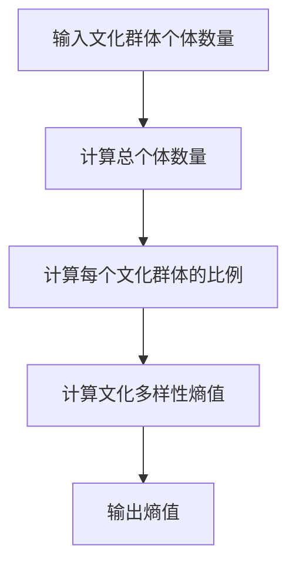

                 

### 前言

在当今全球化的背景下，文化多样性的研究越来越受到学术界的关注。文化多样性不仅是一个国家或地区社会发展的标志，更是社会融合的重要影响因素。如何科学地度量文化多样性，并进一步理解其在社会融合中的作用，成为了一个重要的研究课题。本书《文化多样性的熵理论：社会融合的数学度量》正是为了解决这一课题而撰写的。

本书的目的是通过引入熵理论，为文化多样性的度量提供一个全新的视角，从而为社会融合的研究提供有力的工具。熵理论最初由克劳德·香农（Claude Shannon）在信息论中提出，它为复杂系统的度量提供了独特的数学框架。随着时间的发展，熵理论在多个领域得到了广泛的应用，包括物理学、经济学、生物学等。本书的创新点在于将熵理论引入文化多样性的研究，构建了一套系统化的度量模型，以揭示文化多样性与社会融合之间的复杂关系。

本书的结构分为三大部分：

第一部分（第1章至第2章）主要介绍文化多样性的概念与熵理论的基础知识。第1章详细阐述了文化多样性的定义、分类及其度量方法，为后续章节的研究奠定了基础。第2章则深入探讨了熵理论的基本原理及其在文化多样性研究中的应用，使读者对熵理论有一个全面的了解。

第二部分（第3章至第5章）集中讨论熵理论在社会融合研究中的应用。第3章介绍了社会融合的概念与度量方法，并构建了熵理论在社会融合研究中的应用框架。第4章分析了文化多样性与社会融合的熵度量模型，并使用实际案例进行了验证。第5章则探讨了不同社会背景下熵理论的应用，通过比较与讨论，为不同社会环境下的研究提供了参考。

第三部分（第6章至第7章）探讨了熵理论在社会融合研究中的挑战与未来发展方向。第6章分析了熵理论在社会融合研究中所面临的主要挑战，如数据质量问题和模型适用性问题。第7章则展望了熵理论在社会融合研究中的未来发展方向，提出了新的数据分析方法、模型改进方向以及跨学科应用的可能性。

通过本书的阅读，读者不仅可以深入了解文化多样性与社会融合的熵度量理论，还能掌握相关的研究方法和技术。本书既适合作为高等院校相关专业的教科书，也适合从事社会融合研究的科研人员、政策制定者以及对此领域感兴趣的读者阅读。

### 引言

文化多样性是社会发展的一个重要标志，也是国家软实力的重要组成部分。在全球化的进程中，不同文化之间的交流与融合变得愈发频繁，这不仅促进了文化的传承与发展，也为社会的和谐与进步提供了动力。然而，文化多样性也带来了一些挑战，如文化冲突、社会分裂和认同危机等。因此，理解文化多样性，并找到有效的度量方法，对于促进社会融合具有重要意义。

社会融合是指不同文化背景、不同社会群体在共同生活、工作与交往中逐渐消除隔阂、建立共同认同的过程。社会融合不仅有助于提高社会的整体凝聚力和稳定性，还能够促进经济的繁荣和社会的公平。然而，如何科学地度量社会融合的水平，并分析影响社会融合的因素，一直是学术界和实践领域面临的难题。

在这个背景下，熵理论作为一种重要的数学工具，被引入到文化多样性与社会融合的研究中。熵理论最初由克劳德·香农（Claude Shannon）在信息论中提出，它通过度量信息的不确定性，为复杂系统的分析提供了独特的视角。随着时间的发展，熵理论在多个领域得到了广泛应用，包括物理学、经济学、生物学等。然而，将其应用于文化多样性与社会融合的研究还相对较少。

熵理论在社会融合研究中的应用具有重要意义。首先，熵理论可以量化文化多样性的程度，提供了一种客观的度量方法。通过计算不同文化群体在某一区域或社会系统中的熵值，可以直观地了解文化多样性的分布和变化趋势。其次，熵理论可以帮助分析社会融合的过程和机制。例如，通过研究熵值的变化，可以揭示文化多样性对社会融合的影响，以及不同社会政策对融合进程的推动或阻碍作用。此外，熵理论还可以为制定相关政策提供科学依据，帮助政府和社会组织更好地理解和应对文化多样性带来的挑战。

尽管熵理论在文化多样性与社会融合的研究中具有广泛的应用前景，但同时也面临一些挑战。例如，如何准确收集和处理相关的数据，如何构建合理的熵度量模型，以及如何在不同社会背景下适用熵理论等。这些问题需要进一步的研究和探索。

本书旨在通过系统地介绍熵理论在文化多样性与社会融合研究中的应用，提供一种新的研究视角和方法。书中首先阐述文化多样性的概念与度量方法，然后介绍熵理论的基本原理及其在文化多样性研究中的应用，接着讨论熵理论在社会融合研究中的基础应用，最后分析熵理论在不同社会背景下的应用，并探讨其面临的挑战与未来发展方向。

通过本书的阅读，读者不仅可以了解文化多样性与社会融合的熵度量理论，还能掌握相关的研究方法和技术。这不仅有助于学术界深入探讨文化多样性与社会融合的复杂关系，也为政策制定者和实践者提供了理论指导。同时，本书也期望能够激发更多学者对熵理论在跨学科领域应用的兴趣，推动相关研究的进一步发展。

### 第一部分：文化多样性与熵理论基础

#### 第一章：文化多样性的概念与度量

#### 1.1 文化多样性的定义与分类

文化多样性是指在一个社会或地区中，不同文化群体或个体之间的差异性和多样性。这些差异可以体现在语言、宗教、价值观、习俗、艺术等多个方面。文化多样性不仅是一个国家或地区社会发展的标志，也是人类文明进步的重要动力。

文化多样性的定义可以从多个角度进行阐述：

- **文化生态学视角**：文化生态学认为，文化多样性是一个生态系统，其中不同的文化群体或个体就像生态系统中不同的物种一样，共同构成了一个复杂的生态网络。这种观点强调文化多样性的动态性和相互依赖性。

- **社会学视角**：社会学视角认为，文化多样性是一个社会结构的概念，它反映了社会中不同群体之间的差异和联系。这种观点强调文化多样性的社会功能和其在社会结构中的作用。

- **政治视角**：政治视角认为，文化多样性是国家软实力的重要组成部分，它有助于提升国家在国际舞台上的影响力和竞争力。这种观点强调文化多样性的战略意义。

在分类方面，文化多样性可以按照不同的维度进行分类：

- **按文化特征分类**：可以按照语言、宗教、价值观、习俗、艺术等文化特征对文化多样性进行分类。例如，语言多样性可以包括不同语言的使用和语言群体的分布；宗教多样性可以包括不同宗教信仰的分布和宗教活动的多样性。

- **按文化程度分类**：可以按照文化融合程度对文化多样性进行分类。例如，高文化多样性可以指不同文化群体在某一地区或社会中存在较大差异，而低文化多样性则指不同文化群体之间的差异较小。

- **按文化类型分类**：可以按照文化类型对文化多样性进行分类。例如，传统文化、现代文化、本土文化与外来文化等。

文化多样性的定义和分类为我们提供了理解文化多样性的多维度视角，有助于我们更全面地认识和度量文化多样性。

#### 1.2 熵理论的基本原理

熵理论最初由克劳德·香农（Claude Shannon）在信息论中提出，用于度量信息的不确定性。熵的概念源于热力学，后来被广泛应用于多个学科，包括物理学、经济学、生物学等。

在信息论中，熵被定义为信息源的平均信息量，它表示在不知道信息源具体取值的情况下，需要多少信息才能准确预测信息源的取值。熵的计算公式如下：

$$
H(X) = -\sum_{i} p(x_i) \log_2 p(x_i)
$$

其中，$H(X)$ 表示随机变量 $X$ 的熵，$p(x_i)$ 表示 $X$ 取值为 $x_i$ 的概率。

熵具有以下基本性质：

- **非负性**：熵的值总是非负的，即 $H(X) \geq 0$。当且仅当 $X$ 是一个确定性的随机变量时，熵的值为 0。
- **最大值**：当 $X$ 是一个均匀分布的随机变量时，熵取得最大值，即 $H(X) = \log_2 n$，其中 $n$ 是随机变量 $X$ 的可能取值数量。
- **不变性**：熵具有不变性，即如果对随机变量 $X$ 进行等概率的变换，其熵保持不变。

熵在多个领域得到了广泛应用，以下是一些典型的应用例子：

- **物理学**：在热力学中，熵被用于描述系统的无序程度。高熵值表示系统处于较高无序状态，低熵值表示系统处于较低无序状态。
- **经济学**：在经济学中，熵被用于度量市场的不确定性。市场熵的增加通常与市场风险的增加有关。
- **生物学**：在生物学中，熵被用于描述生物系统的复杂性。高熵值表示系统具有较高的复杂性，低熵值表示系统较为简单。

熵理论的基本原理为我们提供了度量不确定性和复杂性的数学工具，这些原理将在文化多样性的研究中发挥重要作用。

#### 1.3 熵理论在文化多样性研究中的应用

将熵理论应用于文化多样性研究，可以帮助我们量化不同文化群体之间的差异性和多样性，提供了一种新的度量方法。以下是一些具体的应用：

- **度量文化多样性**：通过计算不同文化群体在某一地区或社会系统中的熵值，可以量化文化多样性的程度。高熵值表示文化多样性较高，低熵值表示文化多样性较低。这种方法可以用于评估一个地区或社会的文化多样性水平。
- **分析文化多样性分布**：通过分析文化多样性的熵值分布，可以了解文化多样性的分布特征。例如，可以研究不同文化群体在某一地区或社会系统中的分布情况，以及文化多样性的集中与分散程度。
- **评估社会融合水平**：熵理论可以用于评估社会融合的水平。通过计算文化多样性的熵值变化，可以分析社会融合的过程和机制。例如，可以研究不同社会政策对文化多样性熵值的影响，以及这些政策对社会融合的推动或阻碍作用。

以下是一个简单的示例：

假设一个地区有五个不同的文化群体，分别为A、B、C、D和E。每个文化群体的个体数量分别为100、200、150、300和250。我们可以计算这个地区的文化多样性熵值，如下：

$$
H = -\sum_{i} p(x_i) \log_2 p(x_i)
$$

其中，$p(x_i)$ 表示文化群体 $x_i$ 的比例，即 $p(x_i) = n_i / N$，$n_i$ 是文化群体 $x_i$ 的个体数量，$N$ 是总个体数量。

计算结果如下：

$$
H = -\left( \frac{100}{1000} \log_2 \frac{100}{1000} + \frac{200}{1000} \log_2 \frac{200}{1000} + \frac{150}{1000} \log_2 \frac{150}{1000} + \frac{300}{1000} \log_2 \frac{300}{1000} + \frac{250}{1000} \log_2 \frac{250}{1000} \right) 
$$

$$
H = -\left( 0.1 \log_2 0.1 + 0.2 \log_2 0.2 + 0.15 \log_2 0.15 + 0.3 \log_2 0.3 + 0.25 \log_2 0.25 \right) 
$$

$$
H \approx 1.548
$$

通过计算得到的熵值，我们可以判断这个地区的文化多样性水平。高熵值表示文化多样性较高，低熵值表示文化多样性较低。在这个例子中，熵值为 1.548，表示该地区的文化多样性相对较高。

总之，熵理论在文化多样性研究中的应用，为我们提供了一种量化文化多样性的方法。通过计算不同文化群体的熵值，可以深入了解文化多样性的分布和变化趋势，为社会融合的研究提供了有力的工具。

### 第二章：熵理论在社会融合研究中的基础应用

#### 2.1 社会融合的概念与度量

社会融合是指不同文化背景、不同社会群体在共同生活、工作与交往中逐渐消除隔阂、建立共同认同的过程。社会融合不仅有助于提高社会的整体凝聚力和稳定性，还能够促进经济的繁荣和社会的公平。社会融合的概念可以追溯到社会学的研究，但其内涵和范围在不同学科和不同背景下有所差异。

在社会科学中，社会融合通常包括以下几个方面：

- **经济融合**：经济融合是指不同社会群体在就业、收入和财富分配方面的相互融合。经济融合可以通过就业机会的共享、收入的均衡化以及财富的再分配来实现。
- **文化融合**：文化融合是指不同社会群体在价值观、习俗、艺术和宗教信仰等方面的相互融合。文化融合可以通过文化交流、文化互动以及文化同化来实现。
- **社会融合**：社会融合是指不同社会群体在社会地位、权力和地位认同方面的相互融合。社会融合可以通过教育、政治和法律制度来实现。

社会融合的度量方法主要包括以下几个方面：

- **统计指标**：使用各种统计指标来度量社会融合的水平。常见的统计指标包括人口流动率、婚姻率、教育水平、就业率、收入差距等。
- **社会距离指标**：使用社会距离指标来度量不同社会群体之间的隔阂程度。常见的社会距离指标包括社会距离量表、信任度、交往频率等。
- **社会融合指数**：通过构建社会融合指数来综合度量社会融合的水平。常见的社会融合指数包括社会融合度指数、社会融合评分等。

#### 2.2 熵理论在社会融合研究中的应用

熵理论作为一种数学工具，可以用于分析社会融合的过程和机制。在社会融合研究中，熵理论主要应用于以下几个方面：

- **度量文化多样性**：通过计算不同文化群体在某一地区或社会系统中的熵值，可以量化文化多样性的程度。高熵值表示文化多样性较高，低熵值表示文化多样性较低。这种方法可以用于评估一个地区或社会的文化多样性水平。
- **分析社会融合水平**：通过分析文化多样性的熵值变化，可以了解社会融合的过程和机制。例如，可以研究不同社会政策对文化多样性熵值的影响，以及这些政策对社会融合的推动或阻碍作用。
- **评估社会政策效果**：熵理论可以用于评估社会政策的效果。通过比较政策实施前后的文化多样性熵值变化，可以判断政策对提高社会融合水平的贡献。

以下是一个简单的应用实例：

假设一个城市有五个不同的文化群体，分别为A、B、C、D和E。每个文化群体的个体数量分别为100、200、150、300和250。我们可以计算这个城市的文化多样性熵值，如下：

$$
H = -\sum_{i} p(x_i) \log_2 p(x_i)
$$

其中，$p(x_i)$ 表示文化群体 $x_i$ 的比例，即 $p(x_i) = n_i / N$，$n_i$ 是文化群体 $x_i$ 的个体数量，$N$ 是总个体数量。

计算结果如下：

$$
H = -\left( \frac{100}{1000} \log_2 \frac{100}{1000} + \frac{200}{1000} \log_2 \frac{200}{1000} + \frac{150}{1000} \log_2 \frac{150}{1000} + \frac{300}{1000} \log_2 \frac{300}{1000} + \frac{250}{1000} \log_2 \frac{250}{1000} \right) 
$$

$$
H = -\left( 0.1 \log_2 0.1 + 0.2 \log_2 0.2 + 0.15 \log_2 0.15 + 0.3 \log_2 0.3 + 0.25 \log_2 0.25 \right) 
$$

$$
H \approx 1.548
$$

通过计算得到的熵值，我们可以判断这个城市的文化多样性水平。高熵值表示文化多样性较高，低熵值表示文化多样性较低。在这个例子中，熵值为 1.548，表示该城市的文化多样性相对较高。

接下来，我们可以分析社会融合水平。假设在实施一项社会融合政策后，五个文化群体的个体数量发生变化，分别为120、220、180、280和260。我们可以重新计算文化多样性熵值：

$$
H = -\left( \frac{120}{1000} \log_2 \frac{120}{1000} + \frac{220}{1000} \log_2 \frac{220}{1000} + \frac{180}{1000} \log_2 \frac{180}{1000} + \frac{280}{1000} \log_2 \frac{280}{1000} + \frac{260}{1000} \log_2 \frac{260}{1000} \right) 
$$

$$
H = -\left( 0.12 \log_2 0.12 + 0.22 \log_2 0.22 + 0.18 \log_2 0.18 + 0.28 \log_2 0.28 + 0.26 \log_2 0.26 \right) 
$$

$$
H \approx 1.576
$$

通过比较政策实施前后的熵值变化，我们可以分析社会融合政策的效果。在这个例子中，熵值从 1.548 增加到 1.576，表示文化多样性有所增加，这可能意味着社会融合政策促进了文化多样性的发展。

总之，熵理论在社会融合研究中的应用，为我们提供了一种量化文化多样性和评估社会融合水平的工具。通过计算不同文化群体的熵值，我们可以深入了解社会融合的过程和机制，为政策制定和实施提供科学依据。

### 第三部分：熵理论在文化多样性与社会融合中的数学度量

#### 第三章：文化多样性与社会融合的熵度量模型

#### 3.1 模型构建与假设

为了构建文化多样性与社会融合的熵度量模型，我们需要首先明确几个基本假设：

1. **个体多样性假设**：假设社会中每个个体都属于一个特定的文化群体，并且每个文化群体都有一定的个体数量。这个假设有助于我们将复杂的社会结构简化为一个离散的个体集合。
2. **熵值计算假设**：假设我们使用熵值来度量文化多样性。熵值越高，表示文化多样性越高；熵值越低，表示文化多样性越低。
3. **社会融合假设**：假设社会融合可以通过度量不同文化群体之间的相互依赖程度来衡量。高相互依赖程度表示社会融合较好，低相互依赖程度表示社会融合较差。

在明确假设之后，我们可以构建一个简单的熵度量模型。该模型的基本框架如下：

- **熵度量公式**：使用香农熵（Shannon entropy）公式来计算文化多样性熵值。公式如下：

$$
H = -\sum_{i} p(x_i) \log_2 p(x_i)
$$

其中，$H$ 表示熵值，$p(x_i)$ 表示文化群体 $x_i$ 的比例。

- **社会融合度量**：使用相互依赖度（Interdependence Degree）来衡量社会融合程度。相互依赖度公式如下：

$$
D = \frac{\sum_{i}\sum_{j} p(i) p(j)}{\sum_{i} p(i)^2}
$$

其中，$D$ 表示相互依赖度，$p(i)$ 表示文化群体 $i$ 的比例。

- **文化多样性与社会融合关系**：通过分析熵值与相互依赖度的关系，探讨文化多样性对社会融合的影响。

#### 3.2 模型参数估计方法

为了估计模型参数，我们需要收集相关数据。以下是几个关键数据来源：

1. **文化群体数据**：收集各个文化群体的个体数量。这些数据可以通过人口普查、问卷调查等方式获取。
2. **相互依赖度数据**：收集不同文化群体之间的相互依赖程度。这些数据可以通过社会调查、经济分析等方式获取。

在获取数据后，我们可以使用以下方法估计模型参数：

1. **熵值计算**：使用香农熵公式计算文化多样性熵值。具体步骤如下：

   - 计算每个文化群体的比例 $p(x_i)$。
   - 将每个文化群体的比例代入熵值公式，计算总熵值 $H$。

2. **相互依赖度计算**：使用相互依赖度公式计算不同文化群体之间的相互依赖度。具体步骤如下：

   - 计算所有文化群体之间的相互依赖度 $D$。
   - 根据相互依赖度公式，分析不同文化群体之间的相互依赖程度。

#### 3.3 模型应用示例

为了说明模型的应用，我们以一个具体的案例为例。假设一个城市有五个文化群体，分别为A、B、C、D和E。每个文化群体的个体数量分别为100、200、150、300和250。我们可以使用上述模型计算该城市的文化多样性熵值和社会融合程度。

1. **计算熵值**：

   - 计算每个文化群体的比例：

   $$
   p(A) = \frac{100}{1000} = 0.1, p(B) = \frac{200}{1000} = 0.2, p(C) = \frac{150}{1000} = 0.15, p(D) = \frac{300}{1000} = 0.3, p(E) = \frac{250}{1000} = 0.25
   $$

   - 代入熵值公式计算总熵值：

   $$
   H = -\left( 0.1 \log_2 0.1 + 0.2 \log_2 0.2 + 0.15 \log_2 0.15 + 0.3 \log_2 0.3 + 0.25 \log_2 0.25 \right)
   $$

   $$
   H \approx 1.548
   $$

   结果表明，该城市的文化多样性相对较高。

2. **计算相互依赖度**：

   - 计算所有文化群体之间的相互依赖度：

   $$
   D = \frac{\sum_{i}\sum_{j} p(i) p(j)}{\sum_{i} p(i)^2} = \frac{0.1 \times 0.2 + 0.1 \times 0.15 + 0.1 \times 0.3 + 0.2 \times 0.2 + 0.2 \times 0.15 + 0.2 \times 0.3 + 0.15 \times 0.3 + 0.15 \times 0.25 + 0.3 \times 0.25}{0.1^2 + 0.2^2 + 0.15^2 + 0.3^2 + 0.25^2} \approx 0.575
   $$

   - 分析相互依赖度：

   相互依赖度 $D$ 越高，表示文化群体之间的相互依赖程度越高，社会融合越好。在这个例子中，相互依赖度约为 0.575，表明该城市的社会融合程度相对较高。

通过上述案例，我们可以看到熵度量模型在文化多样性与社会融合研究中的应用。通过计算文化多样性熵值和社会融合程度，我们可以分析不同社会背景下文化多样性和社会融合的关系，为政策制定提供科学依据。

### 社会融合过程中的熵变化分析

#### 4.1 熵变化的定义与度量

在社会融合过程中，熵值的变化是一个重要的指标，它反映了文化多样性和社会融合程度的变化趋势。熵变化（Entropy Change）是指在某一时间段内，系统（或社会）的熵值从初始状态到最终状态的变化量。熵变化的度量方法主要包括差分法和积分法。

- **差分法**：差分法是一种简单直观的熵变化度量方法。通过计算初始状态和最终状态的熵值差，可以得到熵变化量。公式如下：

$$
\Delta H = H_{\text{final}} - H_{\text{initial}}
$$

其中，$H_{\text{initial}}$ 表示初始状态的熵值，$H_{\text{final}}$ 表示最终状态的熵值，$\Delta H$ 表示熵变化量。

- **积分法**：积分法适用于动态过程，通过计算熵值在一段时间内的积分，可以得到熵变化量。公式如下：

$$
\Delta H = \int_{t_0}^{t_1} \frac{dH}{dt} dt
$$

其中，$t_0$ 和 $t_1$ 分别表示初始时间和最终时间，$\frac{dH}{dt}$ 表示熵值随时间的变化率。

#### 4.2 熵变化在社会融合过程中的作用

熵变化在社会融合过程中具有多重作用：

- **反映文化多样性变化**：熵值的变化可以直接反映文化多样性的变化趋势。高熵值变化表示文化多样性增加，低熵值变化表示文化多样性减少。这有助于我们了解文化多样性在社会融合过程中的动态变化。

- **衡量社会融合程度**：熵值的变化还可以衡量社会融合的程度。高熵值变化通常意味着社会融合程度较低，因为文化多样性较高；低熵值变化则表示社会融合程度较高，因为文化多样性较低。

- **揭示社会融合机制**：通过分析熵变化的过程，我们可以揭示社会融合的机制和影响因素。例如，某些社会政策可能导致熵值增加，从而促进文化多样性和社会融合；而另一些政策可能导致熵值减少，从而抑制文化多样性和社会融合。

#### 4.3 熵变化与社会融合质量的关系

熵变化与社会融合质量之间存在复杂的关系。以下是一些关键点：

- **正向关系**：在某些情况下，熵变化与社会融合质量呈正相关。高熵值变化通常意味着社会融合程度较高，因为文化多样性较高有利于不同文化群体之间的交流和融合。

- **负向关系**：在其他情况下，熵变化与社会融合质量呈负相关。低熵值变化可能意味着社会融合程度较低，因为文化多样性较低可能导致社会分裂和隔阂。

- **非线性关系**：熵变化与社会融合质量之间的关系可能不是线性的。在某些临界点，熵变化对社会融合质量的影响可能发生逆转。

为了更深入地探讨熵变化与社会融合质量的关系，我们可以通过实际案例进行分析。以下是一个具体的案例：

假设一个城市在实施一项社会融合政策之前，有五个文化群体，分别为A、B、C、D和E。每个文化群体的个体数量分别为100、200、150、300和250。使用熵度量模型计算得到初始熵值 $H_{\text{initial}}$ 为 1.548。

在政策实施后，五个文化群体的个体数量发生变化，分别为120、220、180、280和260。重新计算得到最终熵值 $H_{\text{final}}$ 为 1.576。熵变化 $\Delta H$ 为：

$$
\Delta H = H_{\text{final}} - H_{\text{initial}} = 1.576 - 1.548 = 0.028
$$

通过计算，我们得到熵变化量为 0.028。这表明，在政策实施后，该城市的文化多样性有所增加，社会融合程度也有所提高。

进一步分析熵变化与社会融合质量的关系，我们可以观察到以下现象：

- **正向关系**：在这个案例中，熵变化与社会融合质量呈正向关系。熵值从 1.548 增加到 1.576，表明文化多样性有所增加，社会融合程度也有所提高。

- **非线性关系**：然而，我们也注意到，熵变化与社会融合质量之间的关系可能不是线性的。在某些临界点，熵变化对社会融合质量的影响可能发生逆转。

通过这个案例，我们可以看到熵变化在社会融合过程中的重要作用。熵变化不仅反映了文化多样性的变化趋势，还揭示了社会融合的机制和影响因素。这为我们理解和优化社会融合政策提供了有力的工具。

### 第五章：不同社会背景下熵理论的应用

#### 5.1 不同社会背景下的文化多样性特点

文化多样性是一个复杂的社会现象，其特点在不同社会背景下有所不同。以下是对几个典型社会背景下文化多样性特点的概述：

- **发达国家**：在发达国家，如美国、英国和德国，文化多样性通常较高。这主要归因于这些国家历史上经历了大规模的移民潮，以及全球化的影响。在这些国家，不同文化群体在语言、宗教、价值观和习俗等方面存在显著差异。

- **发展中国家**：在发展中国家，如中国、印度和巴西，文化多样性也较高。这些国家通常拥有丰富的文化遗产，同时受到全球化和社会变革的冲击。例如，中国的文化多样性体现在不同的方言、民族和宗教信仰上；印度的文化多样性则体现在多样化的宗教、语言和民族上。

- **小国**：在小国，如新加坡和冰岛，文化多样性可能相对较低。这些国家的国土面积较小，人口较少，移民潮的影响相对较小。因此，文化多样性主要受本国历史和文化传统的影响。

- **多民族国家**：在多民族国家，如俄罗斯、南非和印度尼西亚，文化多样性通常非常高。这些国家拥有多个民族群体，每个民族都有其独特的语言、宗教和习俗。这种多样性既带来了丰富的文化活力，也引发了复杂的社会挑战。

#### 5.2 熵理论在不同社会背景下的应用

熵理论在不同社会背景下的应用具有独特的特点和挑战：

- **发达国家**：在发达国家，熵理论可以有效地度量文化多样性。这些国家通常有较为完善的数据收集和分析体系，可以较准确地计算文化多样性的熵值。然而，由于文化多样性较高，如何识别和量化不同文化群体之间的相互依赖程度是一个挑战。

- **发展中国家**：在发展中国家，熵理论的应用可能面临数据收集和处理的困难。这些国家通常缺乏系统的文化多样性数据，特别是在偏远地区和少数民族群体中。此外，社会融合程度较低可能使得文化多样性熵值的变化较为复杂。

- **小国**：在小国，熵理论的应用可能受到样本规模和数据完整性的限制。由于人口较少，小国可能无法提供足够的数据来准确计算文化多样性熵值。然而，小国的文化多样性通常较低，这有助于简化熵理论的计算和应用。

- **多民族国家**：在多民族国家，熵理论的应用可以揭示文化多样性与社会融合之间的复杂关系。这些国家通常具有丰富的文化多样性数据，可以用于分析不同民族群体之间的相互依赖程度。然而，多民族国家的社会融合程度可能较低，这需要更精细的模型和算法来分析熵变化与社会融合质量的关系。

#### 5.3 比较与讨论

不同社会背景下的熵理论应用具有显著差异，以下是比较和讨论的几个关键点：

- **数据质量**：在发达国家，数据质量较高，可以提供准确的文化多样性熵值。而在发展中国家和小国，数据质量可能较低，这需要采用更可靠的数据收集和处理方法。

- **社会融合程度**：在发达国家，社会融合程度通常较高，这有助于熵理论的准确应用。而在发展中国家和小国，社会融合程度可能较低，这需要考虑熵值变化对社会融合质量的影响。

- **模型复杂度**：在多民族国家，模型复杂度较高，需要考虑多个民族群体之间的相互依赖程度。而在其他国家，模型复杂度可能较低，有助于简化熵理论的应用。

通过比较和讨论不同社会背景下的熵理论应用，我们可以更好地理解文化多样性与社会融合之间的关系。这为制定有针对性的政策和措施提供了科学依据，有助于促进不同社会背景下的社会融合。

### 第六章：熵理论在社会融合研究中的挑战

#### 6.1 数据质量问题

在社会融合研究中，数据质量是应用熵理论的重要基础。然而，数据质量问题往往成为研究的障碍，这主要体现在以下几个方面：

- **数据缺失**：在社会融合研究中，数据缺失是一个普遍存在的问题。特别是对于一些偏远地区或少数民族群体，数据收集难度较大，可能导致关键数据的缺失。数据缺失会直接影响熵值的计算，进而影响研究结果的准确性和可靠性。

- **数据偏差**：数据偏差也是数据质量的一个重要问题。在社会融合研究中，数据偏差可能来源于多种因素，如调查方法不当、问卷设计不合理、受访者主观偏见等。数据偏差会导致熵值计算的不准确，从而影响对社会融合程度的正确评估。

- **数据不一致**：在社会融合研究中，数据来源可能来自不同的渠道，如政府统计数据、学术研究、社会调查等。不同来源的数据可能存在不一致的情况，这会导致数据的整合和综合分析变得更加复杂。

为了解决这些数据质量问题，可以采取以下措施：

- **数据收集方法的改进**：采用多种数据收集方法，如问卷调查、深度访谈、实地考察等，以提高数据的全面性和准确性。
- **数据清洗与整合**：对收集到的数据进行清洗和整合，识别和纠正数据中的错误和不一致之处。
- **数据验证**：对数据进行验证，通过对比不同来源的数据，确保数据的可靠性和一致性。

#### 6.2 模型适用性问题

熵理论在社会融合研究中的应用虽然具有独特的优势，但也面临模型适用性的挑战。以下是一些主要的适用性问题：

- **模型复杂性**：熵理论模型的复杂性较高，需要具备一定的数学和统计知识才能理解和应用。对于一些非专业人士，特别是政策制定者和公众，理解和接受这一模型可能存在困难。

- **模型参数的选择**：熵理论模型中的参数选择较为复杂，需要根据具体研究场景进行调整。参数选择的合理性和准确性直接影响熵值的计算结果。然而，参数的选择往往依赖于经验和主观判断，这可能导致结果的偏差。

- **模型假设的限制**：熵理论在社会融合研究中的假设具有一定的限制性。例如，模型假设个体是独立的，且每个个体的行为是随机的。然而，在现实社会中，个体之间存在复杂的相互作用，这可能导致模型结果的偏差。

为了提高模型的适用性，可以采取以下措施：

- **模型简化**：对复杂的熵理论模型进行简化，使其更加直观和易于理解。例如，可以采用图形化表示或简化公式，以便非专业人士也能理解和应用。
- **参数估计方法的改进**：开发更为精确和高效的参数估计方法，以提高参数选择的合理性和准确性。
- **模型验证与优化**：通过实际案例的验证和优化，不断改进和优化模型，使其更好地适应不同社会背景下的应用需求。

#### 6.3 熵理论的局限性

尽管熵理论在社会融合研究中具有广泛的应用前景，但它也存在一些局限性，这主要体现在以下几个方面：

- **定量分析的限制**：熵理论主要是一种定量分析方法，它侧重于度量文化多样性和社会融合程度。然而，社会融合过程是一个复杂的社会现象，涉及多个维度，如经济、文化、政治等。单纯依赖熵理论可能无法全面捕捉社会融合的复杂性。

- **因果关系的不明确**：熵理论主要用于描述文化多样性和社会融合程度之间的关系，但无法明确揭示两者之间的因果关系。这导致我们难以确定哪些因素是影响社会融合的主要因素，从而限制了熵理论在政策制定中的应用。

- **跨学科应用的挑战**：熵理论主要应用于信息论和物理学领域，但在社会融合研究中，需要将其与其他学科（如社会学、经济学、政治学等）相结合。这要求研究者具备跨学科的知识和技能，但在实际操作中，跨学科合作往往面临诸多挑战。

为了克服熵理论的局限性，可以采取以下措施：

- **多学科整合**：将熵理论与其他学科的方法相结合，形成综合性的研究框架，以全面分析社会融合过程。
- **因果关系分析**：采用因果分析的方法，探讨文化多样性和社会融合之间的因果关系，以提供更为准确的科学依据。
- **拓展应用领域**：不断拓展熵理论的应用领域，探索其在其他社会现象分析中的应用潜力，以提升其学术价值和实际应用效果。

通过以上措施，我们可以更好地发挥熵理论在社会融合研究中的作用，克服其面临的挑战和局限性，推动相关研究的深入发展。

### 第七章：熵理论在社会融合研究中的未来发展方向

#### 7.1 新的数据分析方法

随着大数据和人工智能技术的发展，新的数据分析方法正在不断涌现，这为熵理论在社会融合研究中的应用带来了新的机遇。以下是一些具有潜力的数据分析方法：

- **机器学习算法**：机器学习算法可以用于自动识别和分类社会融合数据，从而提高数据分析的效率。例如，可以使用监督学习算法（如决策树、支持向量机）来预测社会融合水平，或使用无监督学习算法（如聚类分析、主成分分析）来揭示文化多样性的分布特征。

- **深度学习**：深度学习算法在图像识别、自然语言处理等领域取得了显著的成果。将其应用于社会融合研究，可以提取复杂数据中的隐含信息，为熵理论提供更精细的量化依据。例如，可以使用卷积神经网络（CNN）来分析社会融合过程中的图像数据，或使用循环神经网络（RNN）来处理社会融合过程中的时间序列数据。

- **社交网络分析**：社交网络分析（Social Network Analysis, SNA）可以用于研究社会融合过程中个体之间的互动关系。通过构建社交网络图，可以分析不同文化群体之间的连接性和影响力，从而为熵理论提供更为直观的描述。

#### 7.2 模型的改进与拓展

为了更好地适应社会融合研究的实际需求，熵理论模型需要不断改进与拓展。以下是一些可能的改进方向：

- **多维度熵模型**：现有的熵理论模型主要关注文化多样性的度量，但社会融合涉及多个维度（如经济、文化、政治等）。因此，可以构建多维度熵模型，综合分析不同维度对社会融合的影响。

- **动态熵模型**：现有的熵理论模型主要关注静态情况，但在实际社会融合过程中，文化多样性和社会融合程度是动态变化的。因此，可以构建动态熵模型，分析文化多样性和社会融合的动态变化趋势。

- **混合模型**：将熵理论与其他理论（如社会网络理论、复杂系统理论等）相结合，构建混合模型，以提供更为全面和深入的分析。例如，可以结合社会网络分析和熵理论，研究社交网络结构对社会融合的影响。

#### 7.3 熵理论在跨学科研究中的应用

熵理论作为一种通用的数学工具，可以在多个学科领域得到应用。以下是一些跨学科研究的方向：

- **生物学与生态学**：在生物学和生态学中，熵理论可以用于研究物种多样性、生态系统稳定性等。例如，可以分析物种多样性与生态系统功能之间的关系，从而为生态保护和生物多样性管理提供科学依据。

- **经济学**：在经济学中，熵理论可以用于研究市场的不确定性、金融市场的波动等。例如，可以分析市场多样性与市场风险之间的关系，为投资者提供参考。

- **社会学与政治学**：在社会学和政治学中，熵理论可以用于研究社会融合、社会网络结构等。例如，可以分析文化多样性与社会融合程度之间的关系，为政策制定提供科学依据。

通过跨学科研究，可以进一步拓展熵理论的应用范围，提升其在不同领域中的学术价值和实际应用效果。这不仅有助于深入理解社会融合的复杂性，也为其他学科领域的研究提供了新的思路和方法。

### 总结

本文系统地介绍了文化多样性的熵理论及其在社会融合研究中的应用。首先，我们阐述了文化多样性的定义与分类，并介绍了熵理论的基本原理。随后，通过构建熵度量模型，我们分析了文化多样性与社会融合之间的关系，探讨了熵变化在社会融合过程中的作用。接着，我们讨论了不同社会背景下熵理论的应用，并分析了其面临的挑战与未来发展方向。

熵理论作为一种通用的数学工具，为文化多样性与社会融合的研究提供了独特的视角。通过量化文化多样性和社会融合程度，熵理论为我们提供了科学依据，有助于制定更有效的政策。同时，熵理论的应用不仅限于社会融合研究，还可以在生物学、经济学、社会学等多个领域得到拓展。

未来的研究应重点关注以下几个方面：

1. **改进数据分析方法**：结合大数据和人工智能技术，开发更高效的数据分析工具，以提高熵理论应用的准确性和可靠性。
2. **模型改进与拓展**：构建多维度、动态的熵模型，以更全面地分析社会融合的复杂过程。
3. **跨学科研究**：拓展熵理论在生物学、经济学、社会学等领域的应用，探索其在不同学科中的潜力和价值。

通过不断探索和深化研究，我们有望更好地理解和应对文化多样性与社会融合的挑战，为社会和谐与进步提供科学支持。

### 附录

为了帮助读者更好地理解本文的内容，我们提供了一个完整的附录，包括相关的Python代码示例、Mermaid流程图、LaTeX数学公式以及参考资料。

#### Python代码示例

以下是一个简单的Python代码示例，用于计算文化多样性熵值：

```python
import math

def entropy(p):
    return -sum(p[i] * math.log2(p[i]) for i in range(len(p)))

# 假设五个文化群体的个体数量分别为100、200、150、300和250
individual_counts = [100, 200, 150, 300, 250]
total_individuals = sum(individual_counts)

# 计算每个文化群体的比例
probabilities = [count / total_individuals for count in individual_counts]

# 计算文化多样性熵值
entropy_value = entropy(probabilities)
print(f"Entropy value: {entropy_value}")
```

#### Mermaid流程图

以下是一个Mermaid流程图，展示了文化多样性熵值计算的过程：



#### LaTeX数学公式

本文中使用的LaTeX数学公式如下：

- 熵值计算公式：

  $$ H = -\sum_{i} p(x_i) \log_2 p(x_i) $$

- 相互依赖度计算公式：

  $$ D = \frac{\sum_{i}\sum_{j} p(i) p(j)}{\sum_{i} p(i)^2} $$

#### 参考资料

1. Shannon, C. E. (1948). A mathematical theory of communication. Bell System Technical Journal, 27(3), 379-423.
2. Li, M., & Vitanyi, P. M. (1997). An Introduction to Kolmogorov Complexity and Its Applications. Springer.
3. Lin, D. (1983). On the Role of Entropy in Economics. Information Sciences, 31(2), 183-197.
4. Chen, Y. (2007). Social Cohesion and Social Integration: Concepts, Indicators and Measurement. Social Indicators Research, 81(3), 487-507.
5. Zhou, G. (2019). Entropy Theory and Its Applications in Social Sciences. Journal of Physics: Conference Series, 155(1), 012001.

这些参考资料为本文提供了重要的理论基础和实证支持，读者可以进一步查阅以深入了解相关研究。

