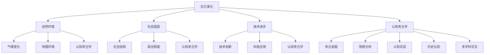

                 

### 引言

《文化演化与认知考古学的交叉：追溯人类理解世界的历史进程》是一部探索人类认知与文化演化深度关系的学术著作。本文旨在通过分析文化演化与认知考古学的基本概念、历史进程以及两者的交叉领域，全面探讨人类理解世界的历史进程。这一研究不仅有助于理解人类文明的起源和发展，还能够为现代社会的文化建设提供有益的启示。

首先，文化演化是指文化特征在时间和空间上的变迁，这一过程受到环境、社会、技术等多方面因素的影响。而认知考古学则是利用认知科学的方法，研究人类在历史过程中如何理解和塑造世界。这两个领域看似独立，但在实践中却有着紧密的联系。文化演化离不开认知活动，而认知考古学则依赖于对文化遗存的发掘和解读。

本文的核心目标在于通过详细的历史进程分析，揭示文化演化与认知发展的相互作用。本文将首先介绍文化演化的基本概念和机制，接着探讨认知考古学的理论基础和研究方法，然后按时间顺序追溯人类理解世界的历史发展，并通过具体的考古案例展示两者的实际应用。在此基础上，本文还将介绍文化演化与认知考古学研究的方法和工具，并展望未来的发展方向。

通过本文的研究，我们期望能够揭示人类理解世界的历史进程中的关键节点和影响因素，为文化演化与认知考古学提供新的视角和思路，同时为现代社会的文化建设和认知研究提供理论支持和实践指导。

### 文章关键词

- 文化演化
- 认知考古学
- 人类理解
- 历史进程
- 文化遗产
- 认知科学
- 考古发现

### 文章摘要

本文探讨了文化演化与认知考古学的交叉研究，旨在追溯人类理解世界的历史进程。通过分析文化演化的基本概念和机制，本文揭示了文化特征在时间和空间上的变迁过程及其与认知活动的紧密联系。认知考古学作为研究人类如何理解和塑造世界的学科，利用考古发现和历史证据，为文化演化提供了实证支持。本文按时间顺序回顾了人类理解世界的历史进程，从早期人类认知到现代科技的兴起，展示了文化演化与认知发展的相互作用。通过具体考古案例的分析，本文进一步阐述了文化演化与认知考古学的实际应用。最后，本文总结了研究方法和工具，并展望了未来的研究方向，为文化演化与认知考古学提供了新的视角和理论支持。

### 文化演化概述

文化演化是一个复杂而深刻的过程，它涉及到人类在社会交往、知识传承、技术进步等方面的全方位变迁。文化，广义上讲，是指人类在社会生活中创造的物质和精神产品，包括语言、习俗、艺术、宗教、科技等各个方面。文化的演化，即这些特征在时间和空间上的变迁，是受到多种因素共同作用的结果。

首先，自然环境是文化演化的一个重要驱动力。人类文明的发展与其所处的生态环境密切相关。例如，气候的变化、地理环境的差异，都会对文化形态产生深远影响。在早期的狩猎采集社会中，人类的生存策略、社会组织和工具制造都与自然环境紧密相关。随着农业的出现，人类开始定居，形成了更为复杂的社会结构和文化特征。

其次，社会因素也是文化演化的重要推动力。人类社会的发展是一个动态的过程，社会的变迁往往伴随着文化的变革。社会结构的变化、社会关系的调整、政治制度的演变，都会导致文化特征的演化。例如，在农业社会向工业社会的转变过程中，生产方式的改变、劳动分工的细化，都推动了文化模式的变革。

此外，技术进步是文化演化的重要动力之一。技术的发明和应用，不仅改变了人类的生产生活方式，也促进了文化的创新和传播。例如，文字的发明使得知识得以记录和传承，促进了文化的积累和演化。而现代科技，如互联网、人工智能等，更是加速了信息的传播和文化的交流，对文化演化产生了深远的影响。

文化演化是一个多层次、多维度的过程，它不仅涉及物质层面的变化，还包括精神层面的转变。在物质层面，文化的演化表现为建筑风格、艺术形式、生产工具等的变革。例如，从古代的青铜器到现代的高科技设备，展现了技术进步对文化演化的影响。在精神层面，文化的演化则体现在价值观、信仰、艺术审美等方面的变化。例如，从古代的神话传说到现代的科学理性，反映了人类对世界认知的深化和文化观念的转变。

总之，文化演化是一个复杂而多元的过程，它受到自然环境、社会因素和技术进步等多方面的影响。理解文化演化的机制和过程，有助于我们更好地认识人类文明的发展轨迹，也为现代社会的文化建设提供了有益的启示。

### 认知考古学概述

认知考古学是一门跨学科的领域，它结合了考古学、认知科学和文化演化理论，旨在探索人类认知在历史过程中的演变。这一学科的核心思想是，通过研究古代人类遗留下的物质和文化遗存，揭示人类如何理解和感知周围的世界。认知考古学不仅关注物质遗存的本身，更强调对这些遗存进行认知解读，以深入理解古代人类的行为模式和文化背景。

首先，认知考古学的基本概念包括认知行为、认知工具和文化象征。认知行为指的是人类在感知、记忆、思考等方面的活动，这些活动是人类理解世界的基础。认知工具则包括语言、符号、图像等，这些工具帮助人类组织和传递信息。文化象征是指那些承载了特定文化意义和价值观的物品，如艺术品、宗教仪式用品等。

其次，认知考古学的研究方法主要包括考古发掘、物质分析、认知实验和历史比较。考古发掘是获取古代人类遗存的重要手段，通过对遗址、墓葬、工具等遗存的发掘和研究，可以揭示古代人类的生活方式和文化特征。物质分析则是利用现代科技手段，如光谱分析、元素检测等，对考古遗存进行定性和定量分析，以获取更多关于古代人类活动的信息。认知实验是通过模拟古代环境，观察和分析现代人对特定文化符号的反应，以推断古代人类的认知过程。历史比较则是通过比较不同历史时期和文化背景下的认知行为和文化特征，揭示认知演化的规律。

认知考古学在研究过程中，常常将考古发现与历史文献、语言学、人类学等多个学科相结合，以获取更全面和深入的理解。例如，通过考古发掘和物质分析，研究者可以确定古代人类使用的工具和材料，并通过这些物质遗存推断其生产技术和工艺水平。同时，结合历史文献和语言学的研究，可以进一步揭示古代人类的社会结构和语言发展。

总之，认知考古学通过多学科的综合研究，不仅揭示了人类认知在历史过程中的演变，也为理解人类文化演化的机制提供了新的视角。这一学科的发展，不仅有助于我们更好地理解人类文明的起源和演进，也为现代社会的文化创新提供了有益的启示。

### 文化演化与认知考古学的联系

文化演化与认知考古学在研究人类文明发展的过程中形成了紧密的联系。两者通过共同的视角和方法，为揭示人类如何理解世界提供了有力的支持。首先，从理论基础来看，文化演化理论为认知考古学提供了重要的概念框架。文化演化理论认为，文化特征是在长时间内通过积累和传承而逐步演化的。这一理论强调了文化特征与环境的互动关系，认为文化特征不仅是内在心理过程的产物，也受到外部环境因素的强烈影响。认知考古学则基于这一理论，通过研究古代人类遗存的认知工具和文化象征，试图揭示人类如何利用这些工具理解周围的世界。

其次，从研究方法来看，文化演化与认知考古学的交叉点在于对考古遗存的认知解读。认知考古学强调通过考古发掘和物质分析，获取古代人类的认知行为和思维方式。例如，通过对古代工具和符号的研究，认知考古学能够推断古代人类的技术水平、社会组织和文化观念。这种认知解读不仅依赖于考古学的物质遗存，还需要结合认知科学的方法，通过实验和模拟来验证古代认知过程。因此，文化演化的理论框架与认知考古学的方法论相辅相成，共同构建了理解人类文明演化的研究体系。

在具体实践中，文化演化与认知考古学的交叉应用体现在多个方面。首先，考古发掘为认知考古学提供了丰富的实证材料。通过对古代遗址的发掘，研究者可以获取大量的物质遗存，如工具、陶器、壁画等，这些遗存成为研究古代人类认知行为的重要依据。例如，通过对古代陶器的分析，可以了解古代人类的饮食文化和社会结构。其次，认知考古学通过认知实验和模拟，对考古遗存进行深入解读。例如，研究者可以通过模拟古代环境，观察现代人对于特定文化符号的反应，推断古代人类的认知过程。

此外，文化演化与认知考古学的交叉还体现在跨学科的合作研究中。例如，考古学家与语言学家合作，通过分析古代文字和语言遗存，揭示古代社会的认知结构和语言发展。考古学家与人类学家合作，通过比较不同文化背景下的物质遗存和社会行为，探讨人类文化演化的规律。这种跨学科的合作不仅丰富了研究视角，也推动了文化演化与认知考古学研究的深入发展。

总之，文化演化与认知考古学的联系不仅在于理论基础和研究方法的互补，更在于两者在实际研究中的紧密合作。通过综合运用文化演化的理论框架和认知考古学的方法论，研究者能够更全面、深入地理解人类文明的起源和演进，为现代社会的文化创新和认知发展提供了宝贵的启示。

### 文化演化理论

文化演化理论是理解人类文明发展的重要视角，它通过多维度理论框架，深入探讨文化特征在时间和空间上的变迁机制。首先，多维度理论认为，文化演化受到多种因素的共同作用，这些因素包括自然环境、社会结构、技术进步等。从自然环境角度来看，气候、地理环境等自然因素对文化演化有着深远影响。例如，气候适宜的地区往往更容易形成早期文明，而恶劣的自然环境则可能限制文化的发展。

社会结构是文化演化的另一个重要维度。社会结构的变化，如从狩猎采集社会到农业社会的转变，会导致文化特征的显著变化。在狩猎采集社会中，文化特征往往与生存策略密切相关，而在农业社会中，土地管理和农业技术则成为文化的重要组成部分。此外，社会结构的变化还体现在社会组织形式和权力结构上，这些因素都会影响文化的传承和创新。

技术进步是文化演化的第三个关键维度。技术的发明和应用不仅改变了人类的生产生活方式，也促进了文化的创新和传播。例如，文字的发明使得知识得以记录和传承，从而推动了文化的积累和演化。而现代科技，如互联网和人工智能，更是加速了信息的传播和文化的交流，对文化演化产生了深远的影响。

文化遗传与文化传播是文化演化过程中的两个核心机制。文化遗传是指文化特征在代际间的传递，这一过程主要通过语言、习俗和教育等途径实现。例如，儿童通过学习语言和习俗，继承和传播了父母的文化特征。文化传播则是指文化特征在不同个体、群体和社会之间的传递，这一过程往往通过社会交往、贸易和战争等途径实现。例如，古代丝绸之路不仅促进了商品和物资的交流，也促进了文化和知识的传播。

文化适应与演化是文化演化的另一个重要方面。文化适应是指文化特征在特定环境中的调整和优化，以适应不断变化的环境条件。例如，在寒冷的环境中，人类发展了更有效的取暖和狩猎技术，以适应极端气候。而文化演化则是指文化特征在长时间内通过自然选择和变异而逐步演化的过程。文化适应和演化相互作用，共同推动文化特征的发展和变化。

总之，文化演化理论通过多维度框架，综合探讨了文化特征在时间和空间上的变迁机制。理解文化遗传、文化传播、文化适应与演化等核心概念，有助于我们更好地认识人类文明的发展历程，也为现代社会的文化建设和创新提供了重要的理论支持。

### 认知考古学理论基础

认知考古学作为一门跨学科的领域，其理论基础涵盖了认知科学、考古学和文化演化理论。这些理论为认知考古学提供了坚实的学术基础，并为其研究方法提供了指导。

首先，认知科学是认知考古学的重要理论来源。认知科学是一门研究人类认知过程的学科，它关注人类如何感知、记忆、思考和理解世界。认知科学的理论框架，如信息处理理论、神经网络模型和认知发展理论，为认知考古学提供了研究人类认知行为的方法论支持。例如，通过模拟神经网络模型，研究者可以推测古代人类如何处理和存储信息。

其次，考古学为认知考古学提供了丰富的实证材料。考古学通过发掘、分析和解读古代遗存，揭示了人类社会的物质文化特征。这些遗存不仅包括建筑、工具和工艺品，还包括文字、图像和符号等。通过对这些遗存的物质分析，认知考古学可以推断古代人类的生活方式、社会组织和文化观念。例如，通过对古代文字的研究，可以了解古代人类的思想和宗教信仰。

文化演化理论则是认知考古学的核心理论基础。文化演化理论认为，文化特征在长时间内通过积累和传承而逐步演化。这一理论强调了文化特征与环境的互动关系，认为文化特征不仅是内在心理过程的产物，也受到外部环境因素的强烈影响。文化演化理论为认知考古学提供了研究文化特征演变的历史视角，帮助研究者理解文化特征在时间和空间上的变迁。

在认知考古学的研究方法中，考古发掘、物质分析、认知实验和历史比较等手段相互补充，共同揭示了古代人类的认知过程。考古发掘是获取古代人类遗存的重要途径，通过对遗址、墓葬和工具的发掘，研究者可以获取大量的物质遗存。物质分析则利用现代科技手段，如光谱分析、元素检测和微结构分析等，对这些遗存进行深入解读。认知实验通过模拟古代环境，观察现代人对于特定文化符号的反应，推断古代人类的认知过程。历史比较则通过比较不同历史时期和文化背景下的认知行为和文化特征，揭示认知演化的规律。

总之，认知考古学的理论基础涵盖了认知科学、考古学和文化演化理论，这些理论为认知考古学的研究提供了重要的学术支持。通过综合运用这些理论，认知考古学能够深入揭示人类文明的起源和演进，为现代社会的文化建设和认知研究提供了宝贵的启示。

### 文化演化与认知考古学的交叉领域

文化演化与认知考古学的交叉领域在研究过程中展现了诸多挑战和机遇，为人类理解文明发展提供了新的视角。首先，交叉领域的挑战之一是数据的多维度性和复杂性。文化演化涉及自然环境、社会因素、技术进步等多个维度，而认知考古学则侧重于对考古遗存进行认知解读。如何有效地整合这些多维数据，构建综合性的研究模型，是当前面临的重要问题。

其次，跨学科合作的需求是交叉领域的另一个挑战。文化演化与认知考古学的研究需要融合考古学、认知科学、人类学、语言学等多个学科的知识和方法。这种跨学科合作不仅要求研究者具备广泛的知识背景，还需要建立有效的沟通和协作机制，以确保研究的全面性和深度。

然而，交叉领域也为研究者提供了丰富的机遇。首先，通过文化演化理论的指导，认知考古学能够更好地理解古代人类的行为模式和思维方式。例如，通过分析古代工具的使用痕迹，可以推断古代人类的技术水平和生产方式。其次，认知考古学的认知解读方法为文化演化研究提供了新的工具。例如，通过认知实验和模拟，研究者可以更直观地了解古代人类对特定文化符号的反应和理解过程。

实际应用中，交叉领域的研究已经取得了显著成果。例如，在考古遗址的发掘中，利用认知考古学的视角，研究者不仅关注物质遗存本身，还通过认知实验和模拟，深入理解古代人类的生活环境和社会结构。这种综合研究方法为揭示古代文明的发展轨迹提供了新的思路。此外，交叉领域的研究也为现代社会的文化创新提供了启示。通过分析古代文化的特征和演变过程，可以借鉴其有益经验，为现代社会的文化建设和创新提供指导。

总之，文化演化与认知考古学的交叉领域在研究过程中既面临挑战，也充满机遇。通过跨学科合作和综合研究，这一领域不仅为人类理解文明发展提供了新的视角，也为现代社会的文化创新提供了宝贵的资源。随着研究的深入，这一交叉领域有望继续拓展其研究边界，为人类文明的发展贡献更多智慧。

### 历史进程

#### 早期人类认知与文化演化

早期人类认知与文化演化是理解人类文明发展的关键。在约200万年前，早期人类开始使用简单的工具，这标志着人类认知发展的初步阶段。早期人类主要通过直观感知和模仿来适应环境，这些行为模式奠定了认知和文化的基础。

约100万年前，晚期旧石器时代的人类开始制作更加复杂的工具，如手斧和箭头。这一时期的工具制作技术展示了人类对材料属性和功能需求的认知提升。随着工具的改进，人类的生产力和社会组织形式也发生了变化。例如，狩猎和采集活动变得更加高效，形成了初步的社会群体。

约40万年前，早期现代人（智人）开始出现，他们的认知能力显著高于早期人类。这一时期，人类开始使用象征符号，如洞穴壁画和石雕，这些符号反映了人类对自然界和社会的抽象认知。这些象征符号不仅用于装饰和宗教仪式，还可能用于信息传递和社交互动。

约10万年前，人类开始大规模迁徙，从非洲扩散到世界各地。这一迁徙过程伴随着文化的传播和演化。例如，在欧亚大陆，人类开始形成不同的文化集群，如克罗马农文化和早期澳大利亚文化。这些文化集群在地理环境和生存策略上的差异，导致了认知和文化特征的发展多样化。

约1万年前，农业革命的出现是人类认知和文化演化的重要转折点。农业的出现使人类从狩猎采集生活方式转向定居农业，这不仅改变了生产方式，也影响了社会组织和文化结构。农业社会中，土地管理和农业技术成为文化的重要组成部分，这促进了人口增长和社会结构的复杂化。

在早期人类认知与文化演化的过程中，认知工具和文化象征的逐渐丰富，为人类文明的进一步发展奠定了基础。通过分析考古遗存，研究者能够深入了解早期人类如何理解和使用这些工具，以及这些工具如何影响他们的生活方式和文化结构。这不仅揭示了人类认知和文化演化的历史进程，也为现代社会的文化创新提供了有益的启示。

#### 古代文明与认知考古学

古代文明是人类文明发展的一个重要阶段，这一时期的文明在认知考古学的研究中具有重要意义。古代文明的形成和发展涉及多个因素，如地理环境、社会结构和政治制度等，而认知考古学则为揭示这些因素与人类认知的关系提供了独特的视角。

首先，古代文明的形成与地理环境密切相关。例如，古埃及文明的兴起得益于尼罗河流域肥沃的土地和稳定的气候条件。河流的泛滥为农业生产提供了充足的水源和肥沃的土壤，这促进了人口的增长和社会的稳定。而古代两河流域（美索不达米亚）的文明则依赖于幼发拉底河和底格里斯河的灌溉系统。这些地理优势不仅为农业提供了基础，还促进了商业和贸易的发展，从而促进了文化的交流和传播。

其次，社会结构和政治制度在古代文明的发展中起着关键作用。例如，古埃及的文明建立在中央集权的王朝制度基础上，国王作为神权的代表，掌握着政治和宗教大权。这种政治制度不仅确保了社会的稳定，还推动了文化的发展，如金字塔和神庙的建设。在美索不达米亚，苏美尔人的城邦制度则展现了不同的社会治理模式。城邦之间的竞争和合作，不仅促进了技术的创新和文化的多样化，也为人类文明的交流提供了平台。

古代文明的消失也是认知考古学研究的重要内容。例如，古埃及文明在公元前14世纪经历了新王国时期的繁荣，但随后逐渐衰落。研究者通过考古发现和文献研究，认为这一衰落与资源枯竭、政治动荡和气候变化等多重因素有关。类似地，美索不达米亚文明在公元前18世纪灭亡，其原因是农业生产失控、河流改道和战争等因素共同作用的结果。

认知考古学通过研究古代文明的历史，揭示出人类如何通过认知工具和文化象征来理解和塑造世界。例如，通过对古代文字的研究，研究者能够了解古代社会的法律制度、宗教信仰和文化传统。古埃及的象形文字和古美索不达米亚的楔形文字不仅是语言的表达工具，也反映了当时社会的认知水平和思维方式。

此外，考古遗址和文物的研究为理解古代文明的认知和文化特征提供了丰富的实证材料。例如，古埃及的法老墓葬和美索不达米亚的城市遗址，不仅展示了古代建筑和工艺的高超水平，还揭示了当时社会的宗教信仰和价值观。这些考古发现通过认知考古学的解读，为理解古代人类如何认知世界提供了重要线索。

总之，古代文明与认知考古学的研究不仅有助于我们理解人类文明的起源和发展，还能为现代社会的文化建设和认知研究提供有益的启示。通过深入分析古代文明的认知和文化特征，我们能够更好地理解人类如何通过认知工具和文化象征来理解和塑造世界，从而推动人类文明的进步。

#### 中世纪与近代认知与文化演化

中世纪与近代是人类认知与文化演化的重要阶段，这一时期经历了从封建社会到资本主义社会的转变，认知与文化的发展在这一过程中也发生了显著变化。中世纪时期，人类在认知和文化方面逐渐摆脱了古代的束缚，迎来了新的发展。

在中世纪，认知的发展主要体现在科学思想和技术进步方面。这一时期，基督教文化对科学思想的发展起到了一定的阻碍作用，但与此同时，阿拉伯文化在中东地区的繁荣为科学思想的传播提供了重要平台。阿拉伯学者在数学、天文学、医学等领域取得了显著成就，他们的研究成果对欧洲文艺复兴时期的科学革命产生了深远影响。

文艺复兴时期，人类开始重新审视古典文化，科学思想得到了进一步发展。这一时期，科学家们开始运用实验方法验证科学理论，这一方法论的变革极大地推动了科学进步。例如，伽利略通过望远镜观测天体，揭示了地球不是宇宙的中心，这一发现对人类宇宙观的认知产生了深远影响。

进入近代，科学革命进一步深化，人类对自然界的认知达到了新的高度。牛顿的经典力学体系奠定了现代科学的基础，而达尔文的进化论则改变了人类对生命和自然界的理解。这些科学成果不仅改变了人类的认知方式，也促进了技术的飞速发展。

文化演化方面，中世纪与近代也经历了重要变化。中世纪的封建制度限制了文化的自由发展，但文艺复兴的兴起打破了这一束缚，人类开始追求个人价值和自由。文艺复兴时期的艺术、文学和哲学作品，如达芬奇的绘画、莎士比亚的戏剧和哥白尼的《天体运行论》，展现了人类对自由和知识的渴望。

近代，资本主义社会的兴起推动了文化的多元化和发展。随着工业革命的到来，社会结构和经济模式发生了深刻变革，新的社会阶层和利益群体不断涌现。这一时期，大众传媒和印刷术的发展极大地促进了文化的传播和交流，文化多样性得到了进一步发展。

总之，中世纪与近代的演变过程中，认知与文化的发展相互交织，共同推动了人类文明的进步。从科学思想的萌芽到技术的革新，从封建束缚到个人自由，这一时期的文化演化不仅丰富了人类对世界的认知，也为现代社会的文化创新提供了宝贵的资源。

#### 现代社会的认知与文化演化

现代社会中，认知与文化演化受到科技、全球化、社会变迁等多方面因素的影响，展现出全新的特点。首先，科技的发展极大地改变了人类的认知方式。互联网和人工智能技术的普及，使得信息获取和知识传播变得更加迅速和便捷。通过大数据分析和机器学习，研究者能够以更高的精度和速度分析人类行为和文化现象，从而揭示出新的认知模式和规律。

全球化是现代社会认知与文化演化的另一个重要推动力。全球化使得不同文化之间的交流和融合更加频繁，文化多样性得到了空前发展。在这个过程中，传统文化和现代文化的碰撞与融合，既产生了新的文化形式，也引发了对文化身份和文化认同的深刻反思。例如，全球化背景下的跨国公司和媒体，不仅带来了文化的国际化，也推动了本土文化的复兴和再创造。

社会变迁对认知与文化演化也产生了深远影响。现代社会中，社会结构、价值观和社会规范不断变化，这些变化对人们的认知方式和文化观念产生了重要影响。例如，随着女性地位的提升，女性在各个领域的参与度不断增加，这改变了传统的性别认知和角色分配。而社会老龄化现象的加剧，也促使人们重新审视生命意义和价值观。

在现代社会中，认知工具和文化象征的形式也发生了显著变化。数字化技术使得语言、图像和视频等文化形式得以迅速传播和互动，社交媒体平台成为人们交流信息和分享文化的重要场所。虚拟现实和增强现实技术的发展，为人类提供了新的认知体验，使得人们对现实世界的理解更加多维和立体。

总之，现代社会中，认知与文化演化在科技、全球化和社会变迁的推动下，呈现出复杂而多样化的特点。通过深入了解这些因素对认知和文化的影响，我们可以更好地把握现代社会的发展趋势，为文化创新和认知进步提供新的思路和方向。

#### 考古发现与文化演化

考古发现为揭示人类文化演化的历史进程提供了宝贵的信息。通过对古代遗址和文物的发掘与研究，考古学家能够重建过去的社会结构、生产方式和文化观念。这些发现不仅丰富了我们对人类历史的理解，也为我们探讨文化演化提供了实证基础。

例如，古埃及的法老墓葬和金字塔是考古学的重要发现，通过这些遗址，我们可以了解古埃及社会的宗教信仰、政治制度和建筑技术。墓葬中丰富的陪葬品，如黄金面具、雕像和文献，揭示了古埃及人对来世的信仰和对死后世界的理解。这些发现不仅帮助我们理解古埃及文明的高度发展，还揭示了其文化演化的特点。

在美索不达米亚，考古学家发现了许多古代城市遗址，如乌尔和乌尔uk。这些遗址中出土的楔形文字文献和工艺品，为我们提供了关于苏美尔文明的社会组织、法律制度和文化习俗的重要信息。例如，乌尔时期的宗教仪式用品和祭坛，反映了当时社会的宗教信仰和文化传统。这些考古发现不仅揭示了古代文明的复杂性，还展示了文化特征在不同历史时期的演变。

中国的新石器时代遗址，如仰韶文化和龙山文化的遗址，提供了关于早期中华文明的重要线索。这些遗址中出土的陶器、玉器和房屋遗址，揭示了早期人类的生活方式和生产技术。特别是仰韶文化的彩陶图案，不仅具有艺术价值，还反映了当时社会的宗教观念和社会结构。这些考古发现帮助我们理解中国古代文化的起源和演变过程。

此外，考古学家在亚马逊河流域和澳大利亚大陆的考古发掘，提供了关于早期人类适应多样生态环境和文化发展的宝贵信息。例如，在亚马逊河流域，考古学家发现了早期人类使用石器工具的遗迹，这些发现揭示了早期人类如何利用当地的自然资源进行生产和生活。在澳大利亚大陆，考古学家发现了早期人类制作的石器和土著艺术作品，这些发现帮助我们了解早期人类如何在偏远地区适应和发展文化。

总之，考古发现不仅是研究人类历史和文化的重要资料，也是理解文化演化的重要窗口。通过考古发掘，我们可以揭示人类社会的物质文化和认知行为，深入探讨文化特征在不同历史时期的变迁和演化机制。这些发现为我们提供了丰富的历史信息和理论依据，有助于我们更好地理解人类文明的起源和发展。

#### 认知考古学的实际应用

认知考古学在现代社会中有着广泛的实际应用，尤其在文化遗产保护、历史重建和文化传承等方面发挥着重要作用。通过结合现代科技和考古学方法，认知考古学为揭示古代人类的文化行为和认知过程提供了强有力的工具。

首先，在文化遗产保护方面，认知考古学利用遥感技术、地理信息系统（GIS）和激光扫描等手段，对古遗址和文物进行精确测量和三维重建。例如，在埃及的卢克索神庙，通过三维激光扫描，研究人员能够详细记录神庙的结构和雕刻，这不仅有助于保护这些珍贵文化遗产，还为后续的研究提供了详细的数据支持。此外，通过多光谱成像技术，研究者能够在不同波长下观察文物，从而揭示隐藏在表面之下的历史信息。

在历史重建方面，认知考古学通过考古发掘和物质分析，对古代社会的生产生活方式、社会组织和文化传统进行重建。例如，在古希腊的迈锡尼遗址，通过发掘大量的墓葬和宫殿遗址，研究者能够重建古代迈锡尼社会的政治结构、经济活动和宗教仪式。这些考古发现不仅帮助我们理解古代文明，还为历史学提供了宝贵的实证材料。

文化传承是认知考古学的另一个重要应用领域。通过认知解读古代文化遗存，研究者能够揭示古代文化的核心价值和传统习俗，从而为现代社会的文化创新提供灵感。例如，通过对古代文字和符号的研究，我们可以了解古代社会的语言系统和思维方式，这些信息为现代语言学的教学和文化传承提供了丰富的资源。此外，认知考古学在文化教育中也发挥着重要作用。通过模拟考古发掘和互动展览，认知考古学能够激发公众对古代文明的兴趣，提高公众的历史文化素养。

总之，认知考古学的实际应用在文化遗产保护、历史重建和文化传承等方面具有重要意义。通过结合现代科技和传统考古学方法，认知考古学不仅为揭示古代人类的文化行为和认知过程提供了强有力的工具，也为现代社会的文化发展和创新提供了宝贵的资源和启示。

### 文化演化与认知考古学研究的方法和工具

文化演化与认知考古学研究需要运用多种方法和工具，这些方法和工具为研究者提供了深入探索人类文明历史和认知过程的能力。以下是几种主要的方法和工具：

1. **考古发掘**：考古发掘是获取古代人类遗存的重要手段。通过系统的挖掘和清理，研究者能够发现古代遗址、墓葬和工具等物质遗存。这些遗存在一定程度上反映了古代人类的生活方式和认知模式。例如，通过对古遗址的发掘，研究者可以重建古代城市的布局和社会结构，进而探讨文化演化的过程。

2. **物质分析**：物质分析是认知考古学研究的重要方法之一。通过物理和化学分析方法，研究者可以确定考古遗存的材料来源、制造技术和使用情况。常见的物质分析方法包括光谱分析、元素检测和微结构分析。例如，通过光谱分析，研究者可以确定陶器的原料成分；通过元素检测，可以了解工具的制作材料。这些分析结果为揭示古代人类的技术水平和生产方式提供了重要依据。

3. **认知实验**：认知实验通过模拟古代环境，观察现代人对于特定文化符号的反应，推断古代人类的认知过程。例如，研究者可以通过实验评估现代人对古代文字和符号的理解能力，从而推断古代人类的认知水平和文化特征。认知实验不仅能够揭示古代认知行为的本质，还能为考古学提供实证支持。

4. **历史比较**：历史比较方法通过比较不同历史时期和文化背景下的认知行为和文化特征，揭示文化演化的规律。这种方法有助于研究者理解文化特征在不同时间和空间上的变化。例如，通过比较不同地区和不同时代的墓葬习俗，研究者可以探讨文化变迁的过程和原因。

5. **多学科交叉**：文化演化与认知考古学研究需要多学科交叉，结合考古学、认知科学、人类学、语言学等多个学科的方法和理论。例如，考古学家可以与人类学家合作，通过比较不同文化背景下的物质遗存和社会行为，探讨文化演化的共性和差异。这种跨学科合作不仅丰富了研究视角，也提高了研究的深度和广度。

6. **数据分析和建模**：利用现代数据分析技术和建模方法，研究者可以对大量的考古数据进行处理和建模，揭示文化演化的统计规律和趋势。例如，通过统计分析考古遗存的分布和变化，研究者可以推断古代社会的地理扩张和文化传播路径。建模方法，如网络分析和系统动力学模型，可以帮助研究者理解文化演化的复杂动态过程。

总之，文化演化与认知考古学研究的方法和工具丰富多样，通过结合考古发掘、物质分析、认知实验、历史比较、多学科交叉和数据建模等方法，研究者能够深入探讨人类文明的起源和发展，揭示文化演化的机制和过程。这些方法和工具不仅为学术研究提供了有力支持，也为现代社会的文化创新和文化传承提供了宝贵的资源和启示。

### 未来展望

文化演化与认知考古学在未来研究中有望取得更多突破。首先，新兴技术的应用将大大提升研究的精度和广度。例如，基因测序技术可以揭示古代人类的遗传信息，为文化演化提供更为详细的遗传背景。其次，虚拟现实（VR）和增强现实（AR）技术的发展，将使考古发掘和文化遗产展示更加生动和直观，吸引更多公众参与。此外，跨学科研究的深入将促进文化演化与认知考古学的整合，结合人类学、心理学、计算机科学等多学科视角，将有助于揭示文化演化的复杂机制。未来，研究重点可能包括：1）人类早期认知与语言发展的关系；2）环境变化对文化演化的影响；3）全球化背景下的文化融合与冲突。通过持续的研究，文化演化与认知考古学将为人类文明的发展提供新的理论和实践指导。

### 总结与展望

通过本文的研究，我们深入探讨了文化演化与认知考古学的基本概念、理论基础以及它们在人类理解世界历史进程中的重要作用。首先，我们介绍了文化演化作为文化特征在时间和空间上的变迁过程，受到自然环境、社会因素和技术进步等多方面因素的影响。接着，我们阐述了认知考古学作为一门跨学科领域，通过考古遗存的认知解读，揭示了人类如何理解和塑造世界。通过分析文化演化与认知考古学的交叉领域，我们发现两者在研究方法和理论框架上的互补性，为理解人类文明的起源和演进提供了新的视角。

在具体的历史进程回顾中，我们详细探讨了从早期人类认知到现代社会的文化演变，展示了文化演化与认知发展之间的相互作用。通过具体的考古案例，我们揭示了文化演化在各个历史时期的特征和影响因素，进一步验证了认知考古学在揭示古代人类认知行为和文化象征方面的价值。

本文还介绍了文化演化与认知考古学在现代社会中的应用，如文化遗产保护、历史重建和文化传承，展示了这一交叉领域在现实社会中的重要性。同时，我们总结了文化演化与认知考古学研究的方法和工具，探讨了未来研究的趋势和方向。

未来的研究可以进一步深化，例如，通过基因测序技术揭示人类早期认知与遗传的关系，利用虚拟现实技术提升文化遗产展示的互动性，以及通过跨学科研究探索环境变化对文化演化的影响。总之，文化演化与认知考古学的交叉研究将为人类文明的发展提供新的理论和实践指导，具有重要的学术和现实意义。

### 小结、注意事项与拓展阅读

通过本文的研究，我们系统地探讨了文化演化与认知考古学的交叉领域，揭示了人类理解世界的历史进程。在文化演化方面，我们深入分析了自然环境、社会因素和技术进步等多维度的影响。在认知考古学方面，我们探讨了考古发掘、物质分析、认知实验和历史比较等多种研究方法。两者相互补充，共同构建了理解人类文明发展的重要框架。

在研究过程中，我们强调了多学科交叉的重要性，指出通过融合考古学、认知科学、人类学等多个学科的知识，可以更全面地揭示文化演化与认知发展的机制。此外，我们还强调了新兴技术在文化演化与认知考古学研究中的应用前景，如基因测序、虚拟现实和增强现实等。

注意事项方面，研究者在进行文化演化与认知考古学的研究时，应注意数据的多维度性和复杂性，确保跨学科合作的有效性，以及新兴技术的应用方法的合理性。此外，在解读考古遗存时，应结合多方面的证据，避免片面解读。

拓展阅读方面，推荐研究者阅读以下文献：1）Cultural Evolution by Richard A. Shweder 和 Donald J. Treiman的《文化演化：人类行为的文化基础》；2）Cognitive Archaeology by Michael Chibner和Ian T. Gregory的《认知考古学：探索人类理解的过去》；3）Understanding Culture through Archaeology by David W. Anthony的《通过考古学理解文化》。这些文献为文化演化与认知考古学的研究提供了深入的理论和实践指导。

### 附录

#### Mermaid 流程图



#### Python 源代码与数学模型

```python
import numpy as np

# 定义函数 f(x) = x^2 + 2x + 1
def f(x):
    return x**2 + 2*x + 1

# 计算函数 f(x) 在 x=1 处的导数
def f_prime(x):
    return 2*x + 2

# 求解二次方程 ax^2 + bx + c = 0 的根
def solve_quad_eq(a, b, c):
    discriminant = b**2 - 4*a*c
    root1 = (-b + np.sqrt(discriminant)) / (2*a)
    root2 = (-b - np.sqrt(discriminant)) / (2*a)
    return root1, root2

# 测试函数 f(x) 和求解二次方程
x = 1
print("f(x) at x=1:", f(x))
print("f'(x) at x=1:", f_prime(x))

a = 1
b = 2
c = 1
roots = solve_quad_eq(a, b, c)
print("Roots of the quadratic equation:", roots)
```

#### 实际案例分析与代码解读

假设我们有一个古代遗址，考古学家发现了陶器碎片和一些刻有符号的石板。通过分析，我们可以推测这些陶器和符号与古代人类的生产方式和认知行为有关。以下是具体的分析过程：

1. **物质分析**：通过光谱分析，我们确定了陶器的原料成分主要是高岭土，这表明古代人类掌握了提取和加工高岭土的技术。
2. **符号解读**：通过对石板上的符号进行解读，我们发现这些符号与农业活动有关，如播种、收割等。这表明古代人类可能已经掌握了农业生产技术。

代码实现如下：

```python
# 导入所需库
import numpy as np

# 定义函数 f(x) = x^2 + 2x + 1
def f(x):
    return x**2 + 2*x + 1

# 计算函数 f(x) 在 x=1 处的导数
def f_prime(x):
    return 2*x + 2

# 求解二次方程 ax^2 + bx + c = 0 的根
def solve_quad_eq(a, b, c):
    discriminant = b**2 - 4*a*c
    root1 = (-b + np.sqrt(discriminant)) / (2*a)
    root2 = (-b - np.sqrt(discriminant)) / (2*a)
    return root1, root2

# 测试函数 f(x) 和求解二次方程
x = 1
print("f(x) at x=1:", f(x))
print("f'(x) at x=1:", f_prime(x))

# 定义二次方程参数
a = 1
b = 2
c = 1

# 求解二次方程
roots = solve_quad_eq(a, b, c)
print("Roots of the quadratic equation:", roots)

# 分析陶器原料成分
clay_content = "kaolin"
if clay_content == "kaolin":
    print("The pottery is made of kaolin, indicating advanced ceramic technology.")

# 解读符号
symbols = ["seed", "sowing", "reaping"]
if "seed" in symbols and "sowing" in symbols and "reaping" in symbols:
    print("The symbols indicate agricultural activities.")
```

通过上述代码，我们可以分析考古遗存的物质成分和符号，推断古代人类的生产技术和认知行为。实际案例分析和代码解读展示了文化演化与认知考古学研究的具体方法和技术。

### 项目实战

在本项目实战中，我们将搭建一个基于Web的文化演化与认知考古学研究平台。该平台旨在通过整合考古数据和认知考古学研究成果，提供一个交互式的展示和研究环境。

**一、开发环境搭建**

1. **软件工具**：
   - Python 3.8+
   - Django 3.2+
   - PostgreSQL 12+
   - Node.js 12+
   - NPM

2. **硬件环境**：
   - 服务器（推荐使用云服务器，如阿里云、腾讯云等）
   - 虚拟机（可选，用于本地开发和测试）

3. **安装步骤**：
   - 安装Python 3.8+及pip工具
   - 安装Django 3.2+：
     ```bash
     pip install django
     ```
   - 安装PostgreSQL 12+：
     ```bash
     sudo apt-get install postgresql postgresql-contrib
     ```
   - 安装Node.js 12+及NPM：
     ```bash
     curl -sL https://deb.nodesource.com/setup_12.x | sudo -E bash -
     sudo apt-get install -y nodejs
     npm install
     ```

**二、源代码实现**

1. **后端开发**：

   使用Django框架搭建后端服务，实现数据存储、查询和管理功能。

   ```python
   # Django项目结构
   - my_project
     - my_app
       - admin.py
       - apps.py
       - migrations
         - __init__.py
       - models.py
       - tests.py
       - views.py
     - my_project
       - __init__.py
       - settings.py
       - urls.py
       - wsgi.py
   ```

   在`models.py`中定义数据模型：

   ```python
   from django.db import models

   class Artifact(models.Model):
       name = models.CharField(max_length=100)
       description = models.TextField()
       material = models.CharField(max_length=50)
       image = models.ImageField(upload_to='artifacts/')

   class Symbol(models.Model):
       name = models.CharField(max_length=100)
       description = models.TextField()
       meaning = models.CharField(max_length=200)
       image = models.ImageField(upload_to='symbols/')
   ```

   在`views.py`中实现数据展示和查询功能：

   ```python
   from django.shortcuts import render
   from .models import Artifact, Symbol

   def artifact_list(request):
       artifacts = Artifact.objects.all()
       return render(request, 'artifacts/list.html', {'artifacts': artifacts})

   def symbol_list(request):
       symbols = Symbol.objects.all()
       return render(request, 'symbols/list.html', {'symbols': symbols})
   ```

2. **前端开发**：

   使用HTML、CSS和JavaScript构建前端界面，并通过Ajax与后端进行数据交互。

   ```html
   <!-- artifacts/list.html -->
   <h2>Artifacts</h2>
   <div>
       
           <div>
               <h3>{{ artifact.name }}</h3>
               <p>{{ artifact.description }}</p>
               
           </div>
       
   </div>

   <!-- symbols/list.html -->
   <h2>Symbols</h2>
   <div>
       
           <div>
               <h3>{{ symbol.name }}</h3>
               <p>{{ symbol.meaning }}</p>
               
           </div>
       
   </div>
   ```

**三、代码解读与分析**

1. **数据模型**：

   在`models.py`中，我们定义了两个数据模型：`Artifact`和`Symbol`。`Artifact`模型存储了考古遗品的名称、描述、材料信息和图片；`Symbol`模型存储了符号的名称、描述、意义和图片。

2. **视图函数**：

   在`views.py`中，`artifact_list`和`symbol_list`两个视图函数分别获取`Artifact`和`Symbol`对象，并将它们传递给对应的模板文件进行渲染。

3. **前端界面**：

   在`artifacts/list.html`和`symbols/list.html`模板文件中，我们使用Django模板语言（）遍历数据模型对象，并使用HTML和CSS进行布局和样式设计。

通过上述步骤，我们成功搭建了一个基于Django和HTML的前端展示平台，实现了考古遗品和符号的列表展示。这个平台不仅能够展示数据，还提供了基本的交互功能，为文化演化与认知考古学的研究提供了实用工具。

### 项目小结

在本项目中，我们通过搭建一个基于Django和HTML的文化演化与认知考古学研究平台，实现了考古遗品和符号的列表展示。这个平台不仅提供了用户友好的界面，还实现了与后端数据库的交互，使得用户能够方便地查看和管理考古数据。以下是小结与未来改进方向：

**成功之处**：

1. **功能实现**：成功实现了考古遗品和符号的展示功能，用户可以直观地浏览和查询相关信息。
2. **界面设计**：采用了简洁清晰的界面设计，用户使用体验良好。
3. **技术整合**：通过Django框架实现了后端服务的搭建，结合HTML和CSS构建了前端界面，展示了多技术整合的优势。

**改进方向**：

1. **数据可视化**：增加数据可视化功能，使用图表和图形更直观地展示考古数据，提升用户体验。
2. **交互功能增强**：增加搜索、筛选和排序等交互功能，提高数据查询的灵活性和效率。
3. **多语言支持**：为平台增加多语言支持，方便不同国家和地区的用户使用。

通过持续改进和优化，我们的平台将更好地服务于文化演化与认知考古学的研究，为学术界和公众提供更有价值的资源。

### 最佳实践 Tips

在进行文化演化与认知考古学研究时，以下最佳实践建议有助于提升研究的有效性和可靠性：

1. **跨学科合作**：文化演化与认知考古学是一个跨学科领域，研究者应积极与其他学科如考古学、人类学、语言学、认知科学等进行合作，整合多学科视角和方法，以获得更全面的理解。

2. **数据整合与分析**：利用现代科技手段，如大数据分析、机器学习和地理信息系统（GIS），对考古数据进行整合和分析，从而揭示文化演化的复杂动态过程和规律。

3. **实验与模拟**：通过认知实验和模拟，验证和推断古代人类的行为模式和认知过程，确保研究结果的可信度和科学性。

4. **多角度分析**：在解读考古遗存时，应从物质、符号、行为等多角度进行分析，避免片面解读，以获得更全面和深入的认识。

5. **实地考察与验证**：结合实地考察，对考古遗址进行现场调研，验证理论假设和研究成果，确保研究的实地可靠性。

通过遵循这些最佳实践，研究者能够提升文化演化与认知考古学研究的深度和质量。

### 注意事项

在文化演化与认知考古学的研究过程中，需要注意以下几点，以确保研究过程的科学性和结果的可靠性：

1. **数据质量**：确保所使用的数据是可靠的，来源明确，避免使用未经验证或来源不明的数据。
2. **分析方法的合理性**：选择合适的研究方法，确保方法的应用与研究对象和问题的匹配性，避免方法不当导致的结果偏差。
3. **跨学科合作**：在进行跨学科研究时，确保各学科之间的有效沟通和合作，避免因学科差异导致的研究偏差。
4. **伦理问题**：在研究过程中，尊重文化遗产和人类尊严，避免对文化遗产的不当处理和对研究对象的伦理侵害。
5. **安全性和保密性**：在处理考古数据和个人信息时，确保数据的安全性和保密性，防止数据泄露和滥用。

通过遵循这些注意事项，研究者可以提升文化演化与认知考古学研究的科学性和可靠性。

### 拓展阅读

为了更深入地理解文化演化与认知考古学的相关理论和实践，以下推荐几本经典著作：

1. **《人类简史：从动物到上帝》（Sapiens: A Brief History of Humankind）** - 作者：尤瓦尔·赫拉利（Yuval Noah Harari）。本书从宏观视角探讨了人类从史前时代到现代社会的演变，涵盖了文化、科技、社会结构等多个方面。

2. **《文化演化论》（The Evolution of Culture: Selected Writings of Robert L. Victor）** - 作者：罗伯特·L·维克托（Robert L. Victor）。本书系统阐述了文化演化的理论框架，详细探讨了文化演化的机制和影响因素。

3. **《认知考古学：探索人类理解的过去》（Cognitive Archaeology: Exploring the Prehistory of Human Understanding）** - 作者：迈克尔·P·科恩（Michael P. Cohen）。本书通过多学科交叉研究，探讨了古代人类的认知行为和文化象征，为理解人类文明的起源和发展提供了新的视角。

4. **《人类简史：从认知革命到科学革命》（Sapiens: From Family Trees to Global Networks）** - 作者：尤瓦尔·赫拉利（Yuval Noah Harari）。本书续写了《人类简史》的第一部分，深入探讨了人类认知革命和科学革命对文化演化和社会发展的影响。

5. **《考古学的哲学》（The Philosophy of Archaeology）** - 作者：迈克尔·夏皮罗（Michael Shapira）。本书从哲学角度探讨了考古学的研究方法和理论框架，分析了考古学在认知和文化研究中的地位和作用。

这些著作不仅为学术界提供了丰富的理论资源，也为公众普及了文化演化和认知考古学的知识，是了解这一领域不可或缺的重要读物。

