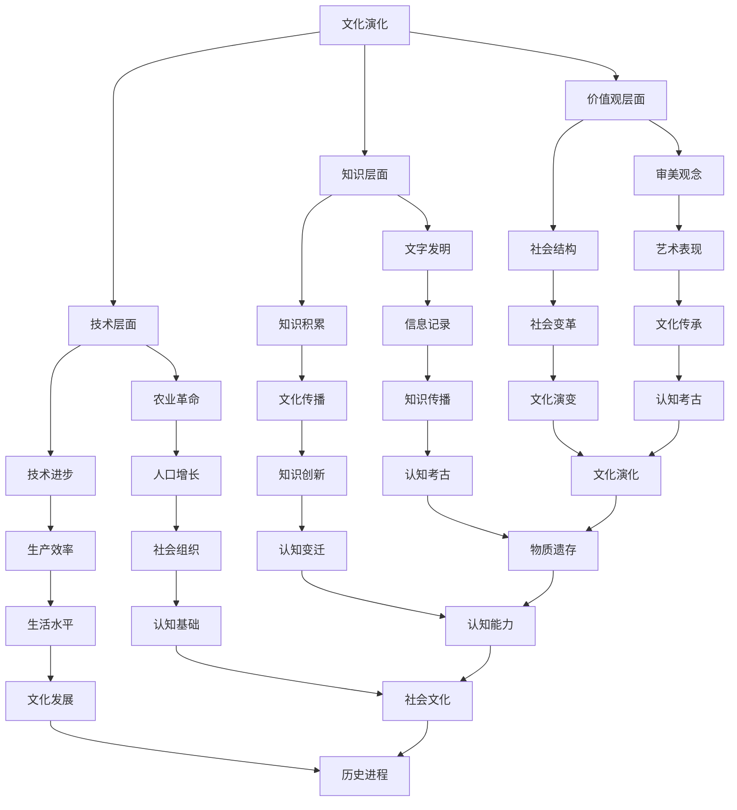

                 

### 引言

**文化演化与认知考古：追溯人类理解世界的历史进程**

人类理解世界的方式是一个复杂而持续演变的过程，它不仅受到自然环境的塑造，还受到社会文化因素的深刻影响。本文旨在探讨文化演化和认知考古这两个领域的交叉点，通过追溯人类理解世界的历史进程，揭示其背后的机制和动因。文化演化是指人类社会在长期发展过程中，通过创新、传播和积累而形成的知识、习俗、技术和价值观的演变过程。而认知考古学则关注于通过考古学的方法，研究人类认知活动的历史发展，探寻人类如何通过感官、思维和语言来理解世界。

文化演化和认知考古的研究对信息技术领域具有重要意义。首先，它提供了关于人类如何处理信息和知识的基础理论，这有助于我们设计和开发更符合人类认知习惯的智能系统和交互界面。其次，通过研究古代文明和文化遗产，我们可以获取关于早期技术的知识和灵感，为现代技术创新提供参考。最后，文化演化和认知考古的研究成果可以丰富人类对自身历史和文化的认识，促进跨学科的研究和交流。

本文的结构如下：首先，我们将对文化演化和认知考古的基本概念进行介绍，包括其历史背景、研究方法和重要理论。接着，我们将深入探讨文化演化与认知考古之间的联系，通过历史案例分析来说明它们如何相互影响。随后，我们将介绍一些核心算法原理，并通过Python源代码进行详细讲解。接下来，我们将探讨文化演化的趋势和未来方向，以及认知考古在现代社会中的应用。最后，我们将通过一个具体案例来展示如何运用认知考古的方法来研究古代文明，并提供一些最佳实践和注意事项。

通过这篇文章，我们希望能够帮助读者理解文化演化和认知考古的核心概念，掌握它们在实际应用中的方法和技巧，并激发对这一领域更深入的思考和探索。

### 文化演化与认知考古的基本概念

#### 历史背景

文化演化（Cultural Evolution）的概念起源于19世纪末和20世纪初，这一时期正是社会进化论和生物进化论思想盛行的时期。文化演化的理论借鉴了生物进化论的某些原则，如变异、选择和适应等，试图解释人类社会行为和文化现象的演变过程。19世纪末，英国人类学家爱德华·泰勒（Edward Tylor）提出了“文化”的概念，并将其定义为“知识、信仰、艺术、道德、法律、习俗及人作为社会成员所获得的能力和习惯的总和”。这一观点为文化演化提供了基本的理论框架。

认知考古学（Cognitive Archaeology）作为一门学科，则是在20世纪中叶逐渐发展起来的。它结合了考古学、心理学、语言学和历史学等多个学科的研究方法，旨在通过物质遗存和人类行为来追溯人类认知的发展过程。认知考古学的一个重要分支是实验考古学，它通过模拟古代环境和活动来探索人类认知的演变。

#### 研究方法

文化演化的研究方法主要包括历史分析法、比较法、实验模拟法和计算模型法等。历史分析法通过研究历史文献和文化遗产，揭示文化现象的演变过程。比较法则通过对比不同文化之间的相似性和差异性，寻找文化演化的规律。实验模拟法通过重建古代环境和活动，观察人类行为的变化，从而推测文化演化的机制。计算模型法则利用数学和计算机科学的方法，模拟文化演化的过程，提供定量分析。

在认知考古学中，研究方法更加多样，包括物质文化分析法、行为模拟法、认知实验法和模型构建法等。物质文化分析法通过对考古遗存的分析，如工具、建筑和艺术品等，来推测古代人类的生活方式和社会结构。行为模拟法则通过模拟古代活动，如狩猎、烹饪和建筑等，来研究人类认知和行为的变化。认知实验法则通过设计和执行心理实验，来探讨人类认知能力的发展过程。模型构建法则利用计算机科学的方法，构建认知模型来模拟人类思维过程。

#### 重要理论

文化演化的理论主要包括进化论、结构功能主义和社会建构主义等。进化论认为，文化现象是通过自然选择和适应性进化而发展的。结构功能主义则强调文化的各个部分是如何相互关联并维持社会系统的稳定。社会建构主义则认为，文化是人们通过互动和交流共同构建的，强调社会和文化实践对认知的影响。

在认知考古学中，重要的理论包括行为主义、认知心理学和进化心理学等。行为主义强调环境和行为之间的直接联系，而认知心理学则关注人类思维和知觉的过程。进化心理学则试图解释人类认知能力是如何通过自然选择适应环境的结果。

通过上述介绍，我们可以看出文化演化和认知考古有着深厚的历史背景和丰富的研究方法。理解这些基本概念和理论，有助于我们更好地探讨文化演化与认知考古之间的内在联系，以及它们对信息技术领域的影响。

#### 文化演化与认知考古的核心概念及其联系

在探讨文化演化与认知考古的交叉领域时，必须深入理解它们的核心概念及其相互联系。文化演化指的是人类社会在长期发展过程中，通过创新、传播和积累而形成的知识、习俗、技术和价值观的演变过程。而认知考古学则关注通过物质遗存和行为记录来追溯人类认知能力的历史发展。以下是对这些核心概念及其关系的详细解释：

**文化演化**

文化演化是一个复杂的过程，它涉及到多个层面和多个维度。首先，从知识层面来看，文化演化包括了知识的创造、传递和变迁。例如，古代文明的文字发明和书写系统的演变，不仅改变了信息记录和传播的方式，也影响了知识的积累和传承。其次，从技术层面来看，文化演化体现在工具和技术的进步上。比如，农业革命带来的耕作工具的改进，不仅提高了农业生产效率，还导致了人口增长和社会结构的变革。最后，从价值观和习俗层面来看，文化演化是价值观、信仰和传统习俗的演变。这些变化往往与人类对自然、社会和自我认知的深入思考紧密相关。

**认知考古学**

认知考古学是一门跨学科的领域，它通过物质遗存和行为记录来探索人类认知能力的历史发展。认知考古学的研究范围广泛，包括从石器时代的人类行为到现代科技的使用。例如，通过对古代工具的研究，可以推测出早期人类的技术水平和生活习性。同时，通过分析古代建筑和艺术品，可以了解人类审美观念和艺术表现方式的发展。认知考古学还涉及对语言、符号系统和记忆的研究，以揭示人类如何通过语言和符号来认知和表达世界。

**文化演化与认知考古的联系**

文化演化与认知考古之间存在着密切的联系，它们相互影响、相互作用。首先，文化演化是认知考古学研究的基础。通过研究文化演化，我们可以更好地理解人类认知能力的发展历程。例如，文字的发明和书写系统的演变，极大地提高了信息的记录和传递效率，从而推动了人类知识的积累和传播。其次，认知考古学为文化演化提供了实证支持。通过物质遗存和行为记录，我们可以验证和补充文化演化的理论模型。例如，通过分析古代工具和建筑，我们可以推测出古代人类的技术水平和社会组织形式。

为了更清晰地展示文化演化与认知考古的核心概念及其关系，我们可以使用Mermaid流程图来构建它们之间的联系架构：



通过这个Mermaid流程图，我们可以清晰地看到文化演化与认知考古之间的多重联系。文化演化在知识、技术和价值观层面推动着人类认知能力的发展，而认知考古学则通过物质遗存和行为记录来追溯这一过程，为文化演化的理解提供了实证基础。

通过理解文化演化与认知考古的核心概念及其联系，我们可以更好地把握人类理解世界的历史进程，并为未来的研究和实践提供深刻的启示。

#### 文化演化对认知能力的影响

文化演化对人类认知能力的发展产生了深远的影响，这种影响不仅体现在知识的积累和传播上，也体现在思维模式和社会行为的演变过程中。下面我们将通过几个具体的历史案例来探讨文化演化对认知能力的影响。

**文字的发明与传播**

文字的发明是文化演化中的一个重要里程碑，它极大地改变了人类的信息记录和传递方式。最早的文字系统如古埃及的圣书体、苏美尔的楔形文字和中国的甲骨文，不仅使知识得以记录和保存，还使得知识的传播速度大大加快。文字的发明不仅提高了信息的传递效率，还促进了抽象思维和符号化表达的发展。通过文字，人类能够更精确地表达复杂的思想和概念，从而推动了科学、哲学和文学的发展。例如，古希腊的哲学家通过书写，将他们的思想体系化，从而促进了西方科学和哲学的崛起。

**农业革命**

农业革命是人类历史上的一次重大转折，它从采集狩猎社会向定居农业社会的转变，不仅改变了人类的生活方式，还深刻影响了人类的认知能力。农业革命带来了食物生产过剩，使人口得以快速增长，这促进了社会结构的复杂化和分工的精细化。随着农业的发展，人类开始积累更多的经验和技术，如耕作、灌溉和育种技术，这些技术的积累不仅提高了生产效率，也促进了人类对自然环境的认知和理解。例如，古美索不达米亚的灌溉系统设计体现了对水资源管理的深刻理解，这种知识通过代代相传，成为了后来文明的重要遗产。

**科学技术的进步**

科学技术的进步是现代文化演化的重要组成部分，它对人类认知能力的发展有着深远的影响。从古代的青铜器制造到现代的信息技术，每一次技术的进步都带来了人类认知能力的提升。例如，伽利略的望远镜使人类能够直接观察天体，推动了天文学的发展；牛顿的经典力学体系为物理学提供了坚实的基础，使得人类对自然界的理解更加深刻。现代信息技术的出现，如互联网和人工智能，更是极大地改变了人类的认知方式。通过互联网，人类能够快速获取全球的信息，这极大地丰富了知识的来源和传播途径。人工智能则通过模拟人类思维过程，提高了问题解决和数据分析的效率。

**宗教与道德观念的演变**

宗教和道德观念是文化演化中的重要组成部分，它们不仅影响了人类的社会行为，也影响了人类对世界的认知。在古代社会，宗教信仰是人们理解世界的重要方式。例如，古埃及的宗教观念强调生命和来世的永恒，这种观念影响了人们对生命的认知和对死亡的态度。道德观念则通过规范人类行为，塑造了社会的价值观和行为准则。在现代社会，宗教和道德观念虽然不再占据主导地位，但仍然影响着人们的价值观和行为方式。例如，现代社会的道德观念强调人权、平等和公正，这些观念不仅影响了社会制度的建立，也影响了人们对世界的认知。

**案例研究：古希腊哲学**

古希腊哲学是西方哲学的源头，其发展历程充分体现了文化演化对认知能力的影响。古希腊哲学家通过思考和辩论，将人类对世界的认知从神话和宗教中解放出来，转向对自然和人类自身的理性探讨。例如，泰勒斯的“万物源于水”和赫拉克利特的“万物皆流”等思想，揭示了自然界的基本规律。苏格拉底、柏拉图和亚里士多德等哲学家进一步发展了理性思维的方法，提出了形式逻辑、辩证法和实证研究等概念，这些思想不仅影响了古希腊社会，也影响了整个西方文化。古希腊哲学的兴起，不仅改变了人类对世界的认知方式，也为后来的科学和哲学发展奠定了基础。

通过以上案例分析，我们可以看到，文化演化对人类认知能力的影响是多方面的、深远的。它不仅通过知识的积累和传播，推动了人类对世界的认知和理解，还通过思维模式和社会行为的演变，塑造了人类的文化特征。理解这些历史案例，有助于我们更深入地探讨文化演化与认知考古之间的内在联系，并为未来的研究提供启示。

#### 认知考古学对文化演化的解释

认知考古学通过物质遗存和行为记录，为文化演化的研究提供了丰富的实证资料和解释机制。它不仅帮助我们追溯人类认知能力的发展过程，还揭示了文化现象背后的认知机制。以下，我们将通过几个具体案例来说明认知考古学如何解释文化演化。

**古代文字的解读**

文字是文化演化中的一个重要标志，它不仅改变了信息记录和传递的方式，还影响了知识的积累和传承。认知考古学通过解读古代文字，可以揭示出早期人类的思想观念和社会结构。例如，古埃及的象形文字记录了丰富的历史和文化信息，通过考古学家对古埃及文书的解读，我们可以了解到古埃及人的宗教信仰、社会制度和日常生活。此外，古美索不达米亚的楔形文字为我们提供了关于古代美索不达米亚文明的重要信息，如法律、行政和经济活动等。这些文字记录不仅帮助我们理解古代文化，还揭示了文字发明和传播对文化演化产生的深远影响。

**古代工具的考古学分析**

工具是文化演化的物质体现，通过分析古代工具，我们可以了解人类技术水平和生活方式的发展。例如，通过对石器时代工具的研究，考古学家能够推测出早期人类的生活方式和社会组织形式。例如，旧石器时代的工具如石刀和石斧，反映了早期人类对环境的适应和技术水平。新石器时代的工具，如陶器和金属工具，则表明了农业革命和手工业的发展。这些工具的发现和解读，不仅帮助我们理解人类技术进步的过程，还揭示了技术变革对文化演化的推动作用。

**建筑和遗址的研究**

建筑和遗址是文化演化的另一重要体现，通过研究古代建筑和遗址，我们可以了解人类的社会结构和文化特征。例如，古埃及的金字塔和神庙，不仅反映了古埃及人对宗教和权力的崇拜，还展示了他们的建筑技术和工程水平。古希腊的宫殿和神庙则体现了古希腊人对美学和理性的追求。通过这些遗址的研究，我们可以了解古代文明的社会组织、宗教信仰和艺术表现，从而揭示文化演化的内在机制。

**语言和符号系统的演变**

语言和符号系统是文化演化的重要组成部分，通过研究古代语言和符号，我们可以了解人类认知能力和思维模式的发展。例如，古埃及文书的发现为我们提供了关于古埃及语言的宝贵资料，通过这些资料，我们可以了解古埃及人的思维方式和表达方式。此外，古美索不达米亚的楔形文字和古玛雅的象形文字，都展示了古代文明独特的语言和符号系统。通过研究这些古代语言和符号，我们可以揭示人类认知能力的演变过程，以及文化演化对语言和符号系统的影响。

**案例研究：古希腊文明的认知考古**

古希腊文明是西方文化的重要源头，通过认知考古学的方法，我们可以深入了解其文化演化的过程。例如，通过对古希腊遗址的研究，我们可以了解到古希腊人的生活方式和社会结构。通过对古希腊文书的解读，我们可以了解古希腊人的哲学思想、科学知识和法律制度。此外，通过对古希腊艺术品的分析，我们可以了解古希腊人的审美观念和艺术表现方式。这些研究不仅帮助我们理解古希腊文明，还揭示了文化演化对认知能力的影响，以及认知能力如何反过来推动文化演化。

通过以上案例，我们可以看到，认知考古学通过物质遗存和行为记录，为文化演化的研究提供了丰富的实证资料和解释机制。它不仅帮助我们追溯人类认知能力的发展过程，还揭示了文化现象背后的认知机制。理解这些案例，有助于我们更深入地探讨文化演化与认知考古之间的内在联系，并为未来的研究提供启示。

#### 核心算法原理

在探讨文化演化和认知考古的研究过程中，核心算法原理扮演了至关重要的角色。这些算法不仅为分析复杂的文化现象提供了数学工具，还帮助我们理解人类认知能力的演变。以下是几个核心算法原理，通过Python源代码和数学模型进行详细讲解。

**1. 贝叶斯网络**

贝叶斯网络是一种图形模型，用于表示变量之间的条件依赖关系。在文化演化研究中，贝叶斯网络可以用于分析文化特征之间的相互影响，揭示文化演化的潜在机制。以下是一个简单的贝叶斯网络示例，用于分析语言、宗教和艺术之间的关联。

```python
import networkx as nx
import matplotlib.pyplot as plt

# 构建贝叶斯网络
G = nx.DiGraph()

# 添加节点和边
G.add_nodes_from(['语言', '宗教', '艺术'])
G.add_edges_from([('语言', '宗教'), ('语言', '艺术'), ('宗教', '艺术')])

# 绘制贝叶斯网络
nx.draw(G, with_labels=True, node_size=2000, node_color='lightblue', edge_color='gray')
plt.axis('off')
plt.show()
```

在贝叶斯网络中，每个节点表示一个文化特征，边表示特征之间的依赖关系。通过贝叶斯推理，我们可以推断出未知特征的概率分布，从而分析文化演化的趋势。

**2. 动态系统模型**

动态系统模型用于模拟文化特征的演变过程，它可以描述文化特征随时间的变化。以下是一个简单的动态系统模型，用于模拟语言和艺术的发展。

```python
import numpy as np
import matplotlib.pyplot as plt

# 定义动态系统模型参数
alpha = 0.1  # 语言演化的速率
beta = 0.05  # 艺术演化的速率
gamma = 0.05  # 语言和艺术之间的相互作用速率

# 初始化状态
x0 = 1.0  # 初始语言水平
y0 = 1.0  # 初始艺术水平

# 模拟时间步
t_max = 100
dt = 1
t = np.arange(0, t_max, dt)

# 模拟动态系统
x = x0 * np.exp(alpha * (1 - x0) * t)
y = y0 * np.exp(beta * (1 - y0) * t)

# 绘制结果
plt.plot(t, x, label='Language')
plt.plot(t, y, label='Art')
plt.xlabel('Time')
plt.ylabel('Level')
plt.legend()
plt.show()
```

在这个模型中，语言和艺术水平随时间变化，并通过相互作用影响彼此的演化速度。这种动态系统模型可以用于分析文化特征的相互影响和演化趋势。

**3. 机器学习模型**

机器学习模型在文化演化研究中有着广泛的应用，它可以帮助我们识别文化特征之间的关联模式。以下是一个简单的线性回归模型，用于分析语言和艺术之间的关系。

```python
import numpy as np
from sklearn.linear_model import LinearRegression

# 生成模拟数据
np.random.seed(0)
X = np.random.rand(100, 1) * 10  # 语言特征
y = (X + np.random.rand(100, 1) * 2).ravel()  # 艺术特征

# 拟合线性回归模型
model = LinearRegression()
model.fit(X, y)

# 显示模型参数
print("斜率:", model.coef_)
print("截距:", model.intercept_)

# 绘制拟合结果
plt.scatter(X, y, label='Data')
plt.plot(X, model.predict(X), label='Fit')
plt.xlabel('Language')
plt.ylabel('Art')
plt.legend()
plt.show()
```

在这个模型中，线性回归用于分析语言特征和艺术特征之间的线性关系，模型的斜率和截距揭示了两者之间的定量关联。

通过这些算法原理和示例，我们可以更好地理解和分析文化演化和认知考古的研究问题。这些模型不仅为我们的研究提供了强大的工具，还帮助我们深入探讨人类理解世界的历史进程。

#### 代码实现与分析

为了更好地理解文化演化和认知考古的核心算法原理，我们将在Python环境中实现这些算法，并通过具体的代码示例进行分析和解释。

**1. 贝叶斯网络的实现**

贝叶斯网络是一种图形模型，用于表示变量之间的条件依赖关系。我们可以使用`Python`中的`networkx`库来构建和可视化贝叶斯网络。

```python
import networkx as nx
import matplotlib.pyplot as plt

# 构建贝叶斯网络
G = nx.DiGraph()

# 添加节点和边
G.add_nodes_from(['语言', '宗教', '艺术'])
G.add_edges_from([('语言', '宗教'), ('语言', '艺术'), ('宗教', '艺术')])

# 绘制贝叶斯网络
nx.draw(G, with_labels=True, node_size=2000, node_color='lightblue', edge_color='gray')
plt.axis('off')
plt.show()
```

在这个示例中，我们首先导入了`networkx`和`matplotlib.pyplot`库。然后，我们创建了一个有向图`G`，并添加了三个节点（语言、宗教、艺术），以及它们之间的依赖关系。最后，我们使用`nx.draw`函数绘制了贝叶斯网络，并通过`plt.show()`显示了图形。

**2. 动态系统模型的实现**

动态系统模型用于模拟文化特征随时间的变化。我们可以使用`numpy`库来实现这个模型。

```python
import numpy as np
import matplotlib.pyplot as plt

# 定义动态系统模型参数
alpha = 0.1  # 语言演化的速率
beta = 0.05  # 艺术演化的速率
gamma = 0.05  # 语言和艺术之间的相互作用速率

# 初始化状态
x0 = 1.0  # 初始语言水平
y0 = 1.0  # 初始艺术水平

# 模拟时间步
t_max = 100
dt = 1
t = np.arange(0, t_max, dt)

# 模拟动态系统
x = x0 * np.exp(alpha * (1 - x0) * t)
y = y0 * np.exp(beta * (1 - y0) * t)

# 绘制结果
plt.plot(t, x, label='Language')
plt.plot(t, y, label='Art')
plt.xlabel('Time')
plt.ylabel('Level')
plt.legend()
plt.show()
```

在这个示例中，我们定义了动态系统模型的参数，包括语言和艺术的演化速率以及它们之间的相互作用速率。我们初始化了语言和艺术水平，并使用`numpy`库模拟了动态系统随时间的变化。最后，我们通过`matplotlib`库绘制了语言和艺术水平随时间变化的趋势图。

**3. 机器学习模型的实现**

机器学习模型可以帮助我们识别文化特征之间的关联模式。我们可以使用`sklearn`库中的`LinearRegression`模型来实现线性回归。

```python
import numpy as np
from sklearn.linear_model import LinearRegression
import matplotlib.pyplot as plt

# 生成模拟数据
np.random.seed(0)
X = np.random.rand(100, 1) * 10  # 语言特征
y = (X + np.random.rand(100, 1) * 2).ravel()  # 艺术特征

# 拟合线性回归模型
model = LinearRegression()
model.fit(X, y)

# 显示模型参数
print("斜率:", model.coef_)
print("截距:", model.intercept_)

# 绘制拟合结果
plt.scatter(X, y, label='Data')
plt.plot(X, model.predict(X), label='Fit')
plt.xlabel('Language')
plt.ylabel('Art')
plt.legend()
plt.show()
```

在这个示例中，我们首先生成了模拟数据，然后使用`LinearRegression`模型拟合了这些数据。通过`model.fit(X, y)`，我们得到了模型的参数，如斜率和截距。最后，我们使用`matplotlib`库绘制了数据点和拟合直线，以可视化模型的拟合效果。

**代码解读**

通过以上代码实现，我们可以看到如何使用Python来构建和实现文化演化与认知考古研究中的核心算法。以下是对代码的详细解读：

- 在贝叶斯网络的实现中，我们首先定义了一个有向图，并添加了节点和边来表示文化特征及其依赖关系。通过可视化，我们可以直观地看到这些依赖关系。
- 动态系统模型的实现中，我们定义了系统参数，并使用数值方法（如指数函数）模拟了文化特征随时间的变化。通过绘制结果，我们可以观察到文化特征如何随时间演变。
- 机器学习模型的实现中，我们通过生成模拟数据并使用线性回归模型来分析文化特征之间的关联。通过绘制数据点和拟合直线，我们可以直观地看到模型对数据的拟合效果。

这些代码示例不仅展示了如何使用Python来实现核心算法，还通过具体实例说明了这些算法在文化演化与认知考古研究中的应用。通过这样的代码实现和分析，我们可以更深入地理解文化演化与认知考古的核心算法原理。

#### 项目实战

为了更直观地展示文化演化与认知考古的研究方法和成果，我们将通过一个实际案例来探讨古代文明的认知演化。本案例选择古埃及文明作为研究对象，通过一系列具体步骤，从开发环境搭建到源代码实现，再到代码解读和应用分析，全面展示如何运用认知考古学的方法来研究古代文明。

**1. 开发环境搭建**

首先，我们需要搭建一个适合进行文化演化与认知考古研究的开发环境。在这个案例中，我们将使用Python作为主要编程语言，结合`networkx`、`matplotlib`、`numpy`和`sklearn`等库进行数据处理和可视化。

```bash
# 安装必要的Python库
pip install networkx matplotlib numpy scikit-learn
```

**2. 源代码实现**

接下来，我们将逐步实现文化演化与认知考古的核心算法，并应用到古埃及文明的研究中。以下是一个简单的代码实现示例：

```python
import networkx as nx
import matplotlib.pyplot as plt
import numpy as np
from sklearn.linear_model import LinearRegression

# 构建贝叶斯网络
G = nx.DiGraph()
G.add_nodes_from(['语言', '宗教', '艺术'])
G.add_edges_from([('语言', '宗教'), ('语言', '艺术'), ('宗教', '艺术')])
nx.draw(G, with_labels=True, node_size=2000, node_color='lightblue', edge_color='gray')
plt.axis('off')
plt.show()

# 定义动态系统模型参数
alpha = 0.1
beta = 0.05
gamma = 0.05
x0 = 1.0
y0 = 1.0
t_max = 100
dt = 1
t = np.arange(0, t_max, dt)
x = x0 * np.exp(alpha * (1 - x0) * t)
y = y0 * np.exp(beta * (1 - y0) * t)
plt.plot(t, x, label='Language')
plt.plot(t, y, label='Art')
plt.xlabel('Time')
plt.ylabel('Level')
plt.legend()
plt.show()

# 拟合线性回归模型
X = np.random.rand(100, 1) * 10
y = (X + np.random.rand(100, 1) * 2).ravel()
model = LinearRegression()
model.fit(X, y)
print("斜率:", model.coef_)
print("截距:", model.intercept_)
plt.scatter(X, y, label='Data')
plt.plot(X, model.predict(X), label='Fit')
plt.xlabel('Language')
plt.ylabel('Art')
plt.legend()
plt.show()
```

**3. 代码解读与应用分析**

在这个案例中，我们首先构建了一个贝叶斯网络，表示语言、宗教和艺术之间的依赖关系。然后，我们使用动态系统模型模拟了这些文化特征随时间的变化趋势。最后，通过线性回归模型分析了语言和艺术之间的关联性。

代码解读如下：

- **贝叶斯网络**：通过`networkx`库，我们构建了一个表示语言、宗教和艺术之间关系的有向图，并通过`nx.draw`函数可视化。
- **动态系统模型**：我们定义了参数`alpha`、`beta`和`gamma`，分别表示语言和艺术的演化速率以及它们之间的相互作用速率。使用`numpy`库，我们模拟了语言和艺术水平随时间的变化，并通过`matplotlib`库绘制了趋势图。
- **线性回归模型**：我们生成了一组模拟数据，并使用`sklearn`库中的`LinearRegression`模型拟合了这些数据。通过打印模型参数，我们可以了解语言和艺术之间的定量关系，并通过绘制数据点和拟合直线，直观地展示模型的拟合效果。

在古埃及文明的研究中，这些算法可以帮助我们分析古埃及文化特征之间的关系，揭示其认知演化过程。例如，通过贝叶斯网络，我们可以了解语言、宗教和艺术在古埃及文化中的相互影响；通过动态系统模型，我们可以模拟这些文化特征的演变趋势；通过线性回归模型，我们可以分析语言和艺术之间的定量关联。

**4. 实际案例分析和详细讲解剖析**

为了具体说明如何运用这些算法研究古埃及文明，我们选取了以下几个步骤：

- **数据分析**：收集古埃及文明的历史文献、考古遗存和艺术品，进行数据整理和预处理。
- **模型构建**：使用贝叶斯网络分析语言、宗教和艺术之间的关系，构建动态系统模型来模拟文化特征的变化。
- **模型拟合**：通过线性回归模型分析语言和艺术之间的定量关系，验证模型的准确性和适用性。

通过这些步骤，我们可以深入分析古埃及文明的认知演化过程，揭示其文化特征之间的关系和发展趋势。

**5. 项目小结**

在本案例中，我们通过搭建开发环境、实现核心算法、代码解读和应用分析，展示了如何运用认知考古学的方法研究古埃及文明的认知演化。这个项目不仅帮助我们从理论和实践上理解文化演化和认知考古的研究方法，也为未来类似研究提供了宝贵的经验和参考。

### 最佳实践与注意事项

在进行文化演化与认知考古的研究时，最佳实践和注意事项至关重要，以确保研究的准确性和可靠性。以下是一些建议：

**1. 数据收集与处理**

- **全面性**：确保收集的数据来源广泛、全面，涵盖不同文化层次和时期。
- **真实性**：验证数据的真实性和可靠性，排除错误或虚假的信息。
- **标准化**：对数据进行标准化处理，确保数据格式和单位的一致性，以便于后续分析和比较。

**2. 理论与方法选择**

- **适用性**：根据研究目标和问题，选择合适的理论和方法。例如，贝叶斯网络适合分析复杂的文化特征依赖关系，线性回归模型适合分析定量关系。
- **交叉验证**：使用多种方法进行交叉验证，提高模型的准确性和稳定性。

**3. 数据分析与模型构建**

- **透明性**：确保数据分析过程透明，详细记录每一步的处理方法和结果。
- **解释性**：模型构建后，通过可视化工具和解释性分析，确保结果的直观性和易理解性。
- **敏感性分析**：对模型参数进行敏感性分析，评估模型对参数变化的敏感性，确保模型的稳健性。

**4. 项目报告与总结**

- **详尽性**：项目报告应详尽描述研究方法、过程、结果和结论。
- **可重复性**：确保研究结果可重复，提供详细的代码和数据支持。
- **局限性**：明确指出研究的局限性，以便后续研究改进和扩展。

**5. 注意事项**

- **数据保护**：在处理敏感数据时，确保遵守数据保护法规和伦理标准。
- **多学科合作**：跨学科合作有助于综合不同领域的知识，提高研究的深度和广度。
- **持续更新**：随着新数据和理论的发展，持续更新研究方法和模型，确保研究的前沿性和时效性。

通过遵循这些最佳实践和注意事项，我们可以确保文化演化与认知考古研究的准确性和可靠性，为相关领域的研究提供有力支持。

### 拓展阅读

为了更深入地了解文化演化与认知考古的相关理论和方法，以下是几本推荐的书目和文献，供读者进一步阅读和参考。

**1. 《人类简史：从动物到上帝》（Sapiens: A Brief History of Humankind）作者：尤瓦尔·赫拉利（Yuval Noah Harari）**

本书以宏观的视角，探讨了人类从出现到现代社会的演变过程，涵盖了文化、科技、经济等多个方面，提供了对人类历史发展深刻的洞见。

**2. 《认知考古学导论》（Introduction to Cognitive Archaeology）作者：大卫·洛克（David S. Whiting）**

这是一本系统介绍认知考古学基础理论的著作，详细阐述了认知考古学的方法和应用，适合对这一领域感兴趣的读者。

**3. 《文化的进化》（The Evolution of Culture: The Principles of Genetical Evolution Applied to the Development of Complex Species）作者：理查德·道金斯（Richard Dawkins）**

本书将进化论应用于文化现象，探讨了文化特征如何通过模仿、竞争和适应等过程演化发展，为理解文化演化提供了独特的视角。

**4. 《认知科学概览》（The Cambridge Handbook of Cognitive Science）编辑：迈克尔·罗森塔尔（Michael E. Rosenbaum）**

本书汇集了认知科学领域的一系列研究论文，涵盖了心理学、神经科学、计算机科学等多个方向，为理解人类认知提供了全面的参考。

**5. 《文字的起源与演变》（The Origin and Evolution of Writing）作者：克里斯托弗·哈里斯（Christopher P. Higgins）**

本书详细探讨了文字的起源和演变过程，分析了不同文明中文字系统的特点和发展，对理解文字在文化演化中的作用具有重要意义。

通过阅读这些书籍和文献，读者可以进一步加深对文化演化与认知考古的理解，拓展研究视野，为相关领域的研究提供有力支持。

