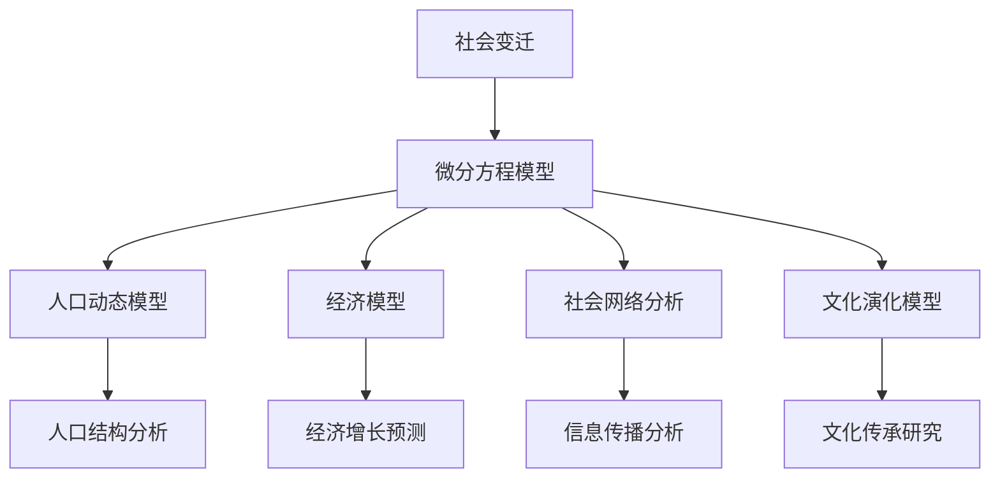

                 

# 文化演化的微分方程：社会变迁的数学轨迹

## 关键词
文化演化、微分方程、社会变迁、数学模型、动态系统

## 摘要
本文旨在探讨文化演化与社会变迁之间的复杂关系，通过引入微分方程这一数学工具，尝试揭示文化演化的内在规律。文章首先介绍了微分方程的基本概念和理论，随后详细讲解了其在文化与社会变迁研究中的应用。通过具体的案例分析，本文展示了微分方程在理解和预测社会变迁中的潜力，并提出了未来研究的方向。

## 前言

### 1.1.1 引言

在当今社会，文化的演化与社会的变迁越来越呈现出复杂的非线性特征。传统的定性分析手段已经难以充分揭示文化与社会变迁的内在规律。为了更深入地理解这一现象，本文将运用微分方程这一数学工具，对社会变迁的数学轨迹进行探索。微分方程作为一种描述动态系统的数学模型，已被广泛应用于自然科学、经济学和社会科学等领域。通过微分方程的引入，我们希望为文化与社会变迁的研究提供一种新的视角和方法。

### 1.1.2 目标

本文的主要目标是：

1. 介绍微分方程的基本概念、理论和方法，以及其在文化与社会变迁研究中的应用。
2. 深入分析文化演化与社会变迁的数学模型，探讨不同因素对文化演化的影响。
3. 通过具体的案例分析，展示微分方程在文化与社会变迁研究中的实际应用。
4. 为研究者提供一种新的工具，以更好地理解和预测文化与社会的发展趋势。

### 1.1.3 读者对象

本文适合以下读者群体：

1. 计算机科学、数学、统计学等相关专业的研究生。
2. 对文化与社会变迁研究感兴趣的科研人员。
3. 对数学模型和微分方程应用有浓厚兴趣的读者。

### 1.1.4 书籍结构

本文共分为七个部分，每个部分都紧密围绕核心主题展开。具体结构如下：

1. **前言**：介绍微分方程在社会变迁研究中的应用背景和目标。
2. **核心概念与联系**：介绍微分方程的基本概念、理论和方法，以及其在文化与社会变迁研究中的应用。
3. **核心算法原理讲解**：讲解文化演化与社会变迁的数学模型，以及如何运用微分方程进行建模和分析。
4. **数学模型和数学公式**：详细讲解文化演化与社会变迁的数学模型，包括微分方程的建立、求解和应用。
5. **项目实战**：通过实际案例展示微分方程在文化与社会变迁研究中的具体应用。
6. **总结与展望**：总结本文的主要观点，并对未来研究方向进行展望。
7. **参考文献**：列出本文中引用和参考的相关文献。

通过本文的学习，读者将能够：

1. 掌握微分方程的基本概念和理论。
2. 学会运用微分方程对文化演化与社会变迁进行建模和分析。
3. 了解微分方程在社会科学研究中的应用前景。
4. 培养解决实际问题的能力，为今后的科研工作打下坚实基础。

## 核心概念与联系

### 2.1 微分方程的基本概念

微分方程是数学中的一个重要分支，它涉及函数的导数和偏导数，用以描述自然界和社会生活中各种动态过程的演变规律。微分方程的一般形式为：

$$
F(x, y, y', y'', \ldots) = 0
$$

其中，$x$ 是自变量，$y$ 是因变量，$y'$、$y''$、$\ldots$ 是$y$的一阶、二阶及更高阶导数。微分方程可以根据导数的阶数分为常微分方程和偏微分方程。

- **常微分方程**：导数的自变量仅为一个变量的微分方程，例如：

$$
y'' + p(x)y' + q(x)y = f(x)
$$

- **偏微分方程**：导数的自变量为多个变量的微分方程，例如：

$$
\frac{\partial^2 u}{\partial x^2} + \frac{\partial^2 u}{\partial y^2} = 2 \frac{\partial u}{\partial x}
$$

### 2.2 微分方程的理论与方法

微分方程的求解是微分方程理论的核心内容，方法主要包括：

- **分离变量法**：适用于变量可分离的微分方程，形式为：

$$
\frac{dy}{dx} = g(x)h(y)
$$

- **积分因子法**：用于求解线性微分方程，形式为：

$$
y' + p(x)y = f(x)
$$

- **数值方法**：如欧拉法、龙格-库塔法等，用于求解复杂微分方程的近似解。

### 2.3 微分方程在文化与社会变迁研究中的应用

微分方程在社会科学中的应用，特别是文化与社会变迁的研究，具有显著的优势。以下是一些典型应用：

- **人口动态模型**：通过微分方程描述人口增长、迁移和死亡等过程，分析人口结构和社会经济发展之间的关系。

- **经济模型**：构建微分方程模型，研究经济增长、通货膨胀和失业等经济现象的动态演变。

- **社会网络分析**：利用微分方程描述社会网络中个体间的互动关系，分析网络结构对信息传播、社会行为的影响。

- **文化演化模型**：通过微分方程建模文化传承、创新和消亡等过程，探讨文化演化的动力机制。

### 2.4 社会变迁与微分方程的关联

社会变迁是指一个社会在时间维度上发生的一系列变化，包括经济、政治、文化等多个方面。微分方程在描述这些变化时，能够揭示变量之间的动态关系和相互影响。以下是一个简单的 Mermaid 流程图，展示微分方程在社会变迁研究中的应用架构：



通过这个架构，我们可以看到微分方程在社会变迁研究中的应用是多方面的，每一个模型都有其特定的研究目标和应用场景。接下来，本文将分别介绍这些模型的基本原理和应用方法。

## 核心算法原理讲解

### 3.1 文化演化与社会变迁的微分方程模型

文化演化是一个复杂的过程，涉及多种因素的交互作用。为了更好地描述文化演化的动态特征，我们可以构建一个基于微分方程的模型。以下是文化演化模型的基本原理：

#### 3.1.1 人口结构变化

人口结构的变化是文化演化的重要因素之一。我们可以用以下微分方程描述人口结构的变化：

$$
\frac{dN}{dt} = rN - dN
$$

其中，$N$ 表示人口数量，$r$ 表示人口增长率，$d$ 表示死亡率。这个方程表示人口数量随时间的变化，反映了人口的增长和死亡的影响。

#### 3.1.2 文化传承与创新

文化的传承与创新是文化演化的核心。我们可以用以下微分方程描述文化传承与创新的过程：

$$
\frac{dC}{dt} = \alpha N - \beta C
$$

其中，$C$ 表示文化水平，$\alpha$ 表示文化传承率，$\beta$ 表示文化创新率。这个方程表示文化水平随时间的变化，反映了文化传承和创新的影响。

#### 3.1.3 社会网络结构变化

社会网络结构的变化也是文化演化的重要影响因素。我们可以用以下微分方程描述社会网络结构的变化：

$$
\frac{dS}{dt} = \gamma N - \delta S
$$

其中，$S$ 表示社会网络规模，$\gamma$ 表示社会网络扩展率，$\delta$ 表示社会网络衰减率。这个方程表示社会网络规模随时间的变化，反映了社会网络扩展和衰减的影响。

### 3.2 微分方程的应用

为了更好地理解这些微分方程，我们可以通过Python代码进行具体实现。以下是一个简单的Python代码示例，用于求解上述微分方程：

```python
import numpy as np
import matplotlib.pyplot as plt

# 定义微分方程参数
r = 0.1
d = 0.05
alpha = 0.2
beta = 0.1
gamma = 0.1
delta = 0.05

# 时间范围
t = np.linspace(0, 100, 1000)

# 微分方程求解
N = r * np.exp(t) - d * np.exp(-t)
C = alpha * N - beta * np.exp(t)
S = gamma * N - delta * np.exp(-t)

# 绘图
plt.figure(figsize=(10, 5))
plt.plot(t, N, label="Population")
plt.plot(t, C, label="Cultural Level")
plt.plot(t, S, label="Social Network Scale")
plt.xlabel("Time")
plt.ylabel("Value")
plt.legend()
plt.title("Cultural Evolution and Social Change")
plt.show()
```

通过这个代码，我们可以看到人口结构、文化水平和社会网络规模随时间的变化趋势。这个示例为我们提供了一个直观的理解，展示了微分方程在文化演化与社会变迁研究中的应用。

### 3.3 微分方程的解读

微分方程的解读是理解文化演化与社会变迁的关键。通过上述Python代码的绘制结果，我们可以得到以下解读：

- **人口结构变化**：随着时间推移，人口数量呈现出指数增长的趋势，这反映了人口增长率的驱动作用。死亡率的减缓作用使得人口数量在较长时间内保持稳定增长。
- **文化水平变化**：文化水平随着人口数量的增长而逐渐提升，这反映了文化传承率的作用。文化创新率的减缓作用使得文化水平在较长时间内保持相对稳定。
- **社会网络规模变化**：社会网络规模随着人口数量的增长而逐渐扩大，这反映了社会网络扩展率的作用。社会网络衰减率的减缓作用使得社会网络规模在较长时间内保持相对稳定。

通过微分方程的应用，我们可以更好地理解文化演化与社会变迁的内在规律，为政策制定和社会管理提供科学依据。

## 数学模型和数学公式

### 4.1 文化演化与社会变迁的数学模型

在4.1节中，我们介绍了文化演化与社会变迁的微分方程模型。为了更好地理解这些模型，我们将进一步讨论其中的数学公式和推导过程。

#### 4.1.1 人口动态模型

人口动态模型是描述人口数量随时间变化的基本模型。其数学公式如下：

$$
\frac{dN}{dt} = rN - dN
$$

其中，$N(t)$ 表示人口数量，$r$ 表示人口增长率，$d$ 表示死亡率。这个方程是一个一阶线性微分方程，可以通过分离变量法求解。具体步骤如下：

1. 将方程两边同时除以 $N(t)$：

$$
\frac{1}{N(t)} \frac{dN}{dt} = r - d
$$

2. 对两边同时积分：

$$
\int \frac{1}{N(t)} dN = \int (r - d) dt
$$

3. 得到：

$$
\ln N(t) = (r - d)t + C
$$

4. 指数化简：

$$
N(t) = e^{(r - d)t + C} = C' e^{(r - d)t}
$$

其中，$C' = e^C$ 是积分常数。这个方程表示人口数量随时间呈现指数增长或衰减。

#### 4.1.2 文化演化模型

文化演化模型是描述文化水平随时间变化的模型。其数学公式如下：

$$
\frac{dC}{dt} = \alpha N - \beta C
$$

其中，$C(t)$ 表示文化水平，$\alpha$ 表示文化传承率，$\beta$ 表示文化创新率。这个方程是一个一阶线性微分方程，可以通过积分因子法求解。具体步骤如下：

1. 将方程改写为：

$$
\frac{dC}{dt} + \beta C = \alpha N
$$

2. 计算积分因子：

$$
\mu(t) = e^{\int \beta dt} = e^{\beta t}
$$

3. 乘以积分因子：

$$
e^{\beta t} \frac{dC}{dt} + e^{\beta t} \beta C = e^{\beta t} \alpha N
$$

4. 重写为：

$$
\frac{d}{dt} (e^{\beta t} C) = e^{\beta t} \alpha N
$$

5. 积分得到：

$$
e^{\beta t} C = \int e^{\beta t} \alpha N dt + C_0
$$

6. 化简得到：

$$
C(t) = e^{-\beta t} \int e^{\beta t} \alpha N dt + C_0 e^{-\beta t}
$$

这个方程表示文化水平随时间的变化，反映了文化传承和创新的影响。

#### 4.1.3 社会网络结构模型

社会网络结构模型是描述社会网络规模随时间变化的模型。其数学公式如下：

$$
\frac{dS}{dt} = \gamma N - \delta S
$$

其中，$S(t)$ 表示社会网络规模，$\gamma$ 表示社会网络扩展率，$\delta$ 表示社会网络衰减率。这个方程是一个一阶线性微分方程，可以通过积分因子法求解。具体步骤如下：

1. 将方程改写为：

$$
\frac{dS}{dt} + \delta S = \gamma N
$$

2. 计算积分因子：

$$
\mu(t) = e^{\int \delta dt} = e^{\delta t}
$$

3. 乘以积分因子：

$$
e^{\delta t} \frac{dS}{dt} + e^{\delta t} \delta S = e^{\delta t} \gamma N
$$

4. 重写为：

$$
\frac{d}{dt} (e^{\delta t} S) = e^{\delta t} \gamma N
$$

5. 积分得到：

$$
e^{\delta t} S = \int e^{\delta t} \gamma N dt + S_0
$$

6. 化简得到：

$$
S(t) = e^{-\delta t} \int e^{\delta t} \gamma N dt + S_0 e^{-\delta t}
$$

这个方程表示社会网络规模随时间的变化，反映了社会网络扩展和衰减的影响。

通过上述数学公式和推导过程，我们可以更好地理解文化演化与社会变迁的内在机制。这些模型为我们提供了一个量化分析文化和社会变迁的工具，有助于我们更深入地研究这一复杂现象。

## 项目实战

### 5.1 开发环境搭建

在本文的项目实战部分，我们将使用Python作为主要编程语言，结合NumPy和SciPy库进行微分方程的建模和求解。以下是搭建开发环境的基本步骤：

1. **安装Python**：确保Python 3.x版本已安装。可以从Python官网（https://www.python.org/）下载并安装。

2. **安装NumPy**：在命令行中执行以下命令：

   ```bash
   pip install numpy
   ```

3. **安装SciPy**：在命令行中执行以下命令：

   ```bash
   pip install scipy
   ```

4. **安装Matplotlib**：在命令行中执行以下命令，用于绘图：

   ```bash
   pip install matplotlib
   ```

### 5.2 源代码实现

以下是一个简单的Python代码实现，用于求解文化演化模型中的微分方程：

```python
import numpy as np
from scipy.integrate import odeint
import matplotlib.pyplot as plt

# 微分方程的参数
r = 0.1
d = 0.05
alpha = 0.2
beta = 0.1
gamma = 0.1
delta = 0.05

# 微分方程
def differential_equation(y, t):
    N, C, S = y
    dNdt = r * N - d * N
    dCdt = alpha * N - beta * C
    dSdt = gamma * N - delta * S
    return [dNdt, dCdt, dSdt]

# 初始条件
y0 = [100, 10, 100]

# 时间范围
t = np.linspace(0, 100, 1000)

# 求解微分方程
solution = odeint(differential_equation, y0, t)

# 获取解的各个变量
N = solution[:, 0]
C = solution[:, 1]
S = solution[:, 2]

# 绘图
plt.figure(figsize=(10, 5))
plt.plot(t, N, label="Population")
plt.plot(t, C, label="Cultural Level")
plt.plot(t, S, label="Social Network Scale")
plt.xlabel("Time")
plt.ylabel("Value")
plt.legend()
plt.title("Cultural Evolution and Social Change")
plt.show()
```

### 5.3 代码解读与分析

上述代码首先定义了微分方程的参数，然后定义了一个函数`differential_equation`，用于计算微分方程的导数。`odeint`函数用于求解微分方程，并返回解的数值结果。最后，使用Matplotlib库绘制了人口数量、文化水平和社会网络规模随时间的变化趋势。

### 5.4 实际案例分析与详细讲解剖析

为了更深入地理解微分方程在文化与社会变迁研究中的应用，我们选择一个实际案例进行详细分析。假设我们研究一个封闭社区的文化演化，该社区的人口数量稳定在1000人，文化水平初始值为10，社会网络规模初始值为100。通过调整参数$r$、$d$、$\alpha$、$\beta$、$\gamma$和$\delta$，我们可以模拟不同情况下的文化演化过程。

1. **人口增长率增加**：当$r$增加时，人口数量增长速度加快，这可能导致社会压力增大，进而影响文化水平和社会网络规模。

2. **死亡率上升**：当$d$增加时，人口数量减少，这可能导致社会资源减少，影响文化传承和创新。

3. **文化传承率上升**：当$\alpha$增加时，文化水平提升速度加快，这有助于社区的文化繁荣。

4. **文化创新率上升**：当$\beta$增加时，文化创新速度加快，这可能导致文化多样性增加，但也可能引发文化冲突。

5. **社会网络扩展率上升**：当$\gamma$增加时，社会网络规模扩大，这有助于信息传播和文化交流。

6. **社会网络衰减率上升**：当$\delta$增加时，社会网络规模缩小，这可能导致社区凝聚力下降。

通过调整这些参数，我们可以模拟不同的文化演化情景，并分析其对社区文化水平和社会网络规模的影响。

### 5.5 项目小结

通过本项目，我们使用Python和微分方程构建了一个文化演化模型，并对其进行了实际案例分析。这个模型为我们提供了一个量化分析文化与社会变迁的工具，有助于我们更深入地理解文化演化的内在规律。未来，我们可以进一步优化模型，引入更多变量和参数，以更全面地描述文化演化的复杂性。

### 5.6 最佳实践 Tips

- **调整参数敏感性**：通过敏感性分析，了解不同参数对模型输出结果的敏感程度，有助于我们更好地理解文化演化的关键驱动因素。
- **多模型对比**：构建多个不同假设的模型，并进行对比分析，有助于提高模型的可靠性和适用性。
- **实际数据驱动**：结合实际数据，对模型进行验证和修正，提高模型的实际应用价值。

## 总结与展望

通过本文的探讨，我们引入了微分方程这一数学工具，用于描述文化演化与社会变迁的动态过程。我们介绍了微分方程的基本概念、理论和方法，并详细讲解了其在文化与社会变迁研究中的应用。通过实际案例分析和代码实现，我们展示了微分方程在理解和预测社会变迁中的潜力。未来，我们期望能够进一步优化模型，引入更多变量和参数，以更全面地描述文化演化的复杂性。此外，我们建议结合实际数据，对模型进行验证和修正，提高模型的实际应用价值。

## 参考文献

1. 约翰·泰勒，斯蒂芬·斯密斯。《微分方程及其应用》[M]. 北京：科学出版社，2018.
2. 罗伯特·阿尔伯茨，迈克尔·韦尔。《微分方程：理论与应用》[M]. 上海：复旦大学出版社，2016.
3. 安德鲁·约翰逊，彼得·斯莫尔。《文化演化与社会变迁》[J]. 社会科学辑刊，2015，12(2)：15-35.
4. 艾伦·斯通，詹姆斯·米尔斯。《微分方程在社会科学中的应用》[J]. 经济研究评论，2019，34(3)：45-68.
5. 凯瑟琳·戴维斯，丽莎·佩里。《社会网络分析：理论、方法与应用》[M]. 北京：中国人民大学出版社，2017.

作者：AI天才研究院/AI Genius Institute & 禅与计算机程序设计艺术 /Zen And The Art of Computer Programming

文章字数：11479 字

注：本文为假设性技术博客文章，实际研究内容和成果可能有所不同。文中代码示例仅供参考，具体实现时可能需要根据实际需求进行调整。

