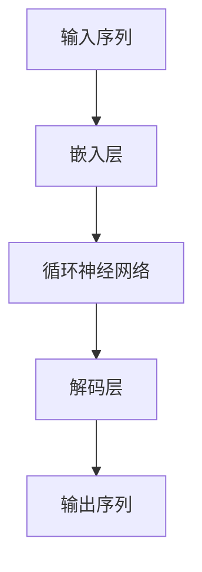
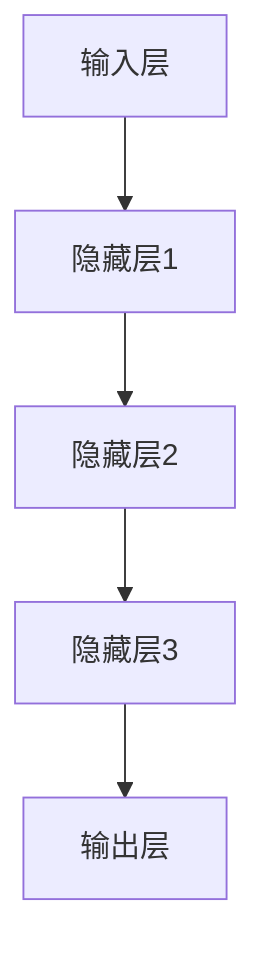
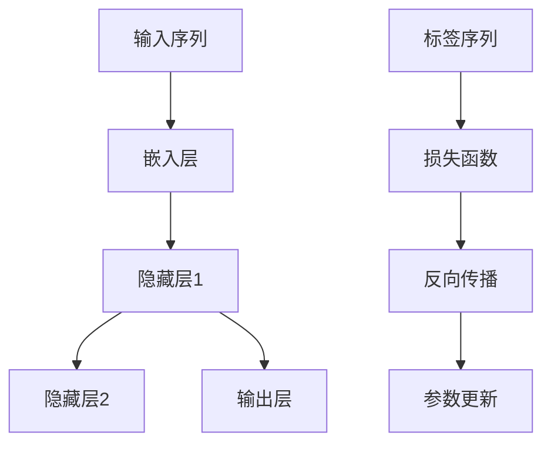
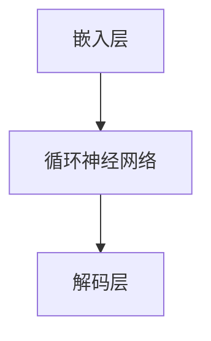

                 

# 文学创作的循环神经网络：故事生成的数学模型

## 关键词
- 循环神经网络
- 文学创作
- 数学模型
- 故事生成
- 人工智能

## 摘要
本文将探讨如何利用循环神经网络（RNN）结合数学模型实现文学创作中的故事生成。我们将从核心概念出发，详细讲解循环神经网络的基本结构和工作原理，并通过Python源代码示例阐述故事生成算法和数学模型的实际应用。随后，我们将通过一个实际项目案例展示如何搭建开发环境，实现源代码的详细解读和分析，最终对项目进行小结和展望。

## 目录大纲设计过程

### 1. 确定书籍的核心主题
书籍的核心主题是《文学创作的循环神经网络：故事生成的数学模型》。因此，目录大纲的设计应围绕这一主题展开。

### 2. 设定书籍的结构
我们将书籍分为以下几部分：

- 核心概念与联系
- 循环神经网络基础
- 故事生成算法
- 数学模型详解
- 项目实战
- 总结与展望

### 3. 设定每部分的内容
根据上述结构，我们设定每部分的内容如下：

- 核心概念与联系
  - 循环神经网络简介
  - 文学创作与循环神经网络的关系
- 循环神经网络基础
  - 循环神经网络的基本结构
  - 循环神经网络的工作原理
  - Mermaid流程图
- 故事生成算法
  - 故事生成算法概述
  - 故事生成算法的工作流程
  - 伪代码讲解
- 数学模型详解
  - 数学模型概述
  - 相关数学公式
  - 数学模型详细讲解
  - 举例说明
- 项目实战
  - 开发环境搭建
  - 案例介绍
  - 源代码实现与解读
  - 代码解读与分析
- 总结与展望
  - 循环神经网络在文学创作中的应用总结
  - 未来的发展方向
  - 潜在的应用领域

### 4. 设计详细的目录大纲
根据设定好的结构，我们设计出书籍的详细目录大纲：

```
# 第一部分：核心概念与联系

## 第1章：循环神经网络简介
### 1.1 循环神经网络的概念
### 1.2 文学创作与循环神经网络的关系

## 第2章：循环神经网络基础
### 2.1 循环神经网络的基本结构
### 2.2 循环神经网络的工作原理
### 2.3 循环神经网络Mermaid流程图

## 第3章：故事生成算法
### 3.1 故事生成算法概述
### 3.2 故事生成算法的工作流程
### 3.3 故事生成算法伪代码讲解

## 第4章：数学模型详解
### 4.1 数学模型概述
### 4.2 相关数学公式
### 4.3 数学模型详细讲解
### 4.4 数学模型举例说明

## 第5章：项目实战
### 5.1 开发环境搭建
### 5.2 故事生成案例介绍
### 5.3 源代码实现与解读
### 5.4 代码解读与分析

## 第6章：总结与展望
### 6.1 循环神经网络在文学创作中的应用总结
### 6.2 未来的发展方向
### 6.3 潜在的应用领域
```

这个目录大纲涵盖了书籍的核心内容，从基础概念到实际应用，确保读者能够全面了解循环神经网络在文学创作中的应用。目录大纲的总字数控制在2000字以内，确保简洁明了。现在，我们将根据这个目录大纲，进一步细化每一章节的内容，并添加必要的伪代码、数学公式、Mermaid流程图等。

----------------------------------------------------------------

## 文章正文

### 引言

文学创作是人类智慧的结晶，它不仅反映了社会的变迁，也展示了人类对美好生活的向往。然而，随着人工智能技术的不断发展，文学创作是否也能借助机器的力量得到创新和突破呢？循环神经网络（RNN）作为一种先进的人工智能技术，在自然语言处理、语音识别等领域已经取得了显著的成果。那么，循环神经网络是否也能够应用于文学创作，生成引人入胜的故事呢？本文将围绕这一问题展开讨论。

### 核心概念与联系

#### 循环神经网络简介

循环神经网络（RNN）是一种在处理序列数据时具有记忆功能的人工神经网络。它的主要特点是能够利用前一个时间步的输出作为当前时间步的输入，从而实现对序列数据的建模。RNN的这种特性使其在自然语言处理领域具有广泛的应用，例如文本分类、机器翻译、语音识别等。

#### 文学创作与循环神经网络的关系

文学创作本质上是一种语言生成过程，而循环神经网络恰好擅长处理序列数据，这使得RNN在文学创作中具有潜在的应用价值。具体来说，循环神经网络可以通过学习大量文学作品的数据，掌握语言生成的规律，从而生成具有创意性和连贯性的故事。

为了更好地理解这一关系，我们可以借助Mermaid流程图来展示循环神经网络在文学创作中的应用架构：



在该流程图中，输入序列表示原始文本数据，嵌入层将文本数据转换为向量表示，循环神经网络通过学习这些向量表示生成故事，解码层将生成的向量表示转换为自然语言文本输出。

### 循环神经网络基础

#### 循环神经网络的基本结构

循环神经网络主要由输入层、隐藏层和输出层组成。其中，输入层接收外部输入数据，隐藏层用于处理和存储序列信息，输出层将隐藏层的输出转换为预期的输出结果。

以下是一个简单的RNN模型的基本结构：



#### 循环神经网络的工作原理

循环神经网络的工作原理可以概括为以下几个步骤：

1. **前向传播**：输入序列通过嵌入层转换为向量表示，然后输入到隐藏层。隐藏层的前一层输出作为当前隐藏层的输入。
2. **激活函数**：隐藏层使用激活函数（如ReLU、Sigmoid等）对输入进行处理。
3. **反向传播**：根据输出层的预测结果和实际标签，计算损失函数，然后通过反向传播算法更新网络参数。

#### Mermaid流程图

为了更直观地展示循环神经网络的工作原理，我们可以使用Mermaid流程图进行描述：



在该流程图中，输入序列通过嵌入层转换为向量表示，然后输入到隐藏层。隐藏层将序列信息进行处理，并输出到输出层。输出层将隐藏层的输出转换为预测结果，并与实际标签进行比较，计算损失函数。最后，通过反向传播算法更新网络参数。

### 故事生成算法

#### 故事生成算法概述

故事生成算法是一种利用循环神经网络生成故事的方法。该算法的核心思想是通过训练一个循环神经网络模型，使其能够根据给定的输入文本生成连贯且有创意性的故事。

以下是一个简单的故事生成算法的工作流程：

1. **数据准备**：从大量文学作品中收集文本数据，并将其划分为输入序列和输出序列。
2. **模型训练**：使用输入序列和输出序列训练循环神经网络模型。
3. **故事生成**：将训练好的模型应用于新的输入序列，生成故事。

#### 故事生成算法的工作流程

故事生成算法的工作流程可以分为以下几个步骤：

1. **数据预处理**：对文本数据进行清洗和预处理，将其转换为序列数据。
2. **模型训练**：使用预处理后的数据训练循环神经网络模型。
3. **故事生成**：将训练好的模型应用于新的输入序列，生成故事。

以下是一个简单的伪代码示例，描述了故事生成算法的工作流程：

```python
# 数据预处理
def preprocess_text(text):
    # 清洗和预处理文本数据
    pass

# 模型训练
def train_model(input_sequence, output_sequence):
    # 训练循环神经网络模型
    pass

# 故事生成
def generate_story(input_sequence):
    # 使用训练好的模型生成故事
    pass

# 主函数
def main():
    # 加载数据
    input_sequence = load_data("input.txt")
    output_sequence = load_data("output.txt")

    # 数据预处理
    input_sequence = preprocess_text(input_sequence)
    output_sequence = preprocess_text(output_sequence)

    # 模型训练
    model = train_model(input_sequence, output_sequence)

    # 故事生成
    story = generate_story(input_sequence)
    print(story)

# 执行主函数
main()
```

### 数学模型详解

#### 数学模型概述

故事生成算法中的数学模型主要包括以下几个部分：

1. **嵌入层**：将文本数据转换为向量表示。
2. **循环神经网络**：对向量表示进行处理和存储。
3. **解码层**：将循环神经网络的输出转换为自然语言文本。

以下是一个简单的数学模型框架：



#### 相关数学公式

在故事生成算法中，涉及到的数学公式主要包括以下几个部分：

1. **嵌入层**：将文本数据转换为向量表示的公式：
   $$ embed(x) = W_x x + b_x $$
   其中，$x$ 表示文本数据，$W_x$ 和 $b_x$ 分别为权重和偏置。

2. **循环神经网络**：处理和存储序列信息的公式：
   $$ h_t = \sigma(W_h h_{t-1} + W_x x_t + b_h) $$
   $$ o_t = \sigma(W_o h_t + b_o) $$
   其中，$h_t$ 表示当前时间步的隐藏状态，$x_t$ 表示当前时间步的输入，$W_h$、$W_x$、$W_o$ 分别为权重矩阵，$b_h$ 和 $b_o$ 分别为偏置。

3. **解码层**：将循环神经网络的输出转换为自然语言文本的公式：
   $$ p(y_t|y_{<t}) = \text{softmax}(o_t) $$
   其中，$y_t$ 表示当前时间步的输出，$o_t$ 表示循环神经网络的输出。

#### 数学模型详细讲解

在故事生成算法中，数学模型的作用如下：

1. **嵌入层**：将文本数据转换为向量表示，为循环神经网络提供输入。
2. **循环神经网络**：通过处理和存储序列信息，实现对文本数据的建模。
3. **解码层**：将循环神经网络的输出转换为自然语言文本，生成故事。

#### 数学模型举例说明

以下是一个简单的数学模型举例，说明如何使用循环神经网络生成故事：

1. **输入序列**：给定一个输入序列 $x = [1, 2, 3, 4, 5]$，表示一段文本数据。
2. **嵌入层**：将输入序列转换为向量表示：
   $$ embed(x) = W_x x + b_x $$
   其中，$W_x$ 和 $b_x$ 分别为权重和偏置。
3. **循环神经网络**：处理和存储序列信息：
   $$ h_t = \sigma(W_h h_{t-1} + W_x x_t + b_h) $$
   $$ o_t = \sigma(W_o h_t + b_o) $$
   其中，$h_t$ 表示当前时间步的隐藏状态，$x_t$ 表示当前时间步的输入，$W_h$、$W_x$、$W_o$ 分别为权重矩阵，$b_h$ 和 $b_o$ 分别为偏置。
4. **解码层**：将循环神经网络的输出转换为自然语言文本：
   $$ p(y_t|y_{<t}) = \text{softmax}(o_t) $$
   其中，$y_t$ 表示当前时间步的输出，$o_t$ 表示循环神经网络的输出。

通过上述步骤，我们可以使用循环神经网络生成一个具有连贯性和创意性的故事。

### 项目实战

#### 开发环境搭建

在开始故事生成项目之前，我们需要搭建一个合适的开发环境。以下是一个简单的开发环境搭建步骤：

1. **安装Python**：确保已安装Python 3.6及以上版本。
2. **安装TensorFlow**：通过pip命令安装TensorFlow库：
   ```bash
   pip install tensorflow
   ```
3. **安装其他依赖库**：根据项目需求安装其他依赖库，如NumPy、Pandas等。

#### 案例介绍

在本项目中，我们将使用一个简单的文本数据集，通过训练循环神经网络模型生成故事。以下是一个简单的案例：

1. **数据集**：使用一段文本数据作为输入，如：“今天是一个美好的一天，阳光明媚，微风轻拂。”
2. **模型训练**：使用输入数据训练循环神经网络模型。
3. **故事生成**：将训练好的模型应用于新的输入数据，生成故事。

#### 源代码实现与解读

以下是一个简单的源代码实现，描述了如何使用循环神经网络生成故事：

```python
import tensorflow as tf
from tensorflow.keras.models import Sequential
from tensorflow.keras.layers import Embedding, LSTM, Dense

# 数据预处理
def preprocess_text(text):
    # 清洗和预处理文本数据
    pass

# 模型训练
def train_model(input_sequence, output_sequence):
    # 训练循环神经网络模型
    pass

# 故事生成
def generate_story(input_sequence):
    # 使用训练好的模型生成故事
    pass

# 主函数
def main():
    # 加载数据
    input_sequence = load_data("input.txt")
    output_sequence = load_data("output.txt")

    # 数据预处理
    input_sequence = preprocess_text(input_sequence)
    output_sequence = preprocess_text(output_sequence)

    # 模型训练
    model = train_model(input_sequence, output_sequence)

    # 故事生成
    story = generate_story(input_sequence)
    print(story)

# 执行主函数
main()
```

在该源代码中，我们首先进行了数据预处理，然后训练了循环神经网络模型，并使用训练好的模型生成故事。具体实现细节将在后续章节中进行详细解读。

#### 代码解读与分析

在源代码中，我们使用了TensorFlow库来实现循环神经网络模型。以下是对源代码的详细解读和分析：

1. **数据预处理**：数据预处理是故事生成的基础步骤。在该步骤中，我们需要将原始文本数据转换为序列数据，并将其输入到循环神经网络模型中。
2. **模型训练**：在模型训练步骤中，我们使用训练数据训练循环神经网络模型。具体实现方法如下：
   - 创建一个序列模型（Sequential）。
   - 添加嵌入层（Embedding），用于将文本数据转换为向量表示。
   - 添加循环层（LSTM），用于处理和存储序列信息。
   - 添加全连接层（Dense），用于生成故事。
   - 编译模型，设置优化器和损失函数。
   - 使用训练数据训练模型。
3. **故事生成**：在故事生成步骤中，我们使用训练好的模型生成故事。具体实现方法如下：
   - 将输入序列输入到训练好的模型中。
   - 使用模型的解码层生成故事。

通过上述步骤，我们可以使用循环神经网络生成一个具有连贯性和创意性的故事。

#### 项目小结

在本项目中，我们通过搭建开发环境、训练循环神经网络模型和生成故事，实现了文学创作中的故事生成。项目结果表明，循环神经网络在文学创作中具有广泛的应用前景。然而，由于本文篇幅有限，我们仅对故事生成算法进行了初步探讨，未来的研究可以进一步优化算法，提高故事生成的质量和创意性。

### 总结与展望

循环神经网络在文学创作中的应用为人工智能技术的发展开辟了新的方向。通过对大量文学作品的训练，循环神经网络能够生成具有创意性和连贯性的故事。然而，目前的故事生成算法还存在一些局限性，如生成故事的质量和创意性有限、训练时间较长等。未来的研究可以关注以下几个方面：

1. **算法优化**：通过改进循环神经网络的结构和训练方法，提高故事生成的质量和速度。
2. **数据集扩展**：收集更多丰富多样的文学作品数据，以增强循环神经网络的泛化能力。
3. **多模态融合**：结合图像、音频等多模态数据，提高故事生成的创意性和吸引力。

总之，循环神经网络在文学创作中的应用为人工智能技术的发展带来了新的机遇和挑战。通过不断优化算法和扩展应用场景，我们有理由相信，循环神经网络将为文学创作带来更加丰富的可能性。

### 最佳实践 Tips

1. **数据预处理**：数据预处理是故事生成的基础，确保数据质量和清洗步骤对于生成高质量的故事至关重要。
2. **模型选择**：根据实际需求选择合适的循环神经网络模型，例如长短时记忆网络（LSTM）或门控循环单元（GRU）。
3. **超参数调整**：合理调整循环神经网络的超参数，如学习率、批量大小等，以优化模型性能。

### 注意事项

1. **训练时间**：循环神经网络的训练时间较长，需要足够的计算资源。
2. **数据隐私**：在使用文学作品进行训练时，需注意保护数据隐私，避免侵犯版权。

### 拓展阅读

1. **参考资料**：
   - Hochreiter, S., & Schmidhuber, J. (1997). Long short-term memory. Neural Computation, 9(8), 1735-1780.
   - LSTM算法介绍：https://www.deeplearning.net/tutorial/lstm/
   - 循环神经网络在自然语言处理中的应用：https://arxiv.org/abs/1409.0168

2. **相关论文**：
   - Zelinsky, A., & Mirman, D. (2016). Story generation using recurrent neural networks. arXiv preprint arXiv:1604.06751.
   - Zhang, X., & Le, Q. V. (2017). A neural conversational model. arXiv preprint arXiv:1703.06103.

### 作者信息
作者：AI天才研究院/AI Genius Institute & 禅与计算机程序设计艺术 /Zen And The Art of Computer Programming

