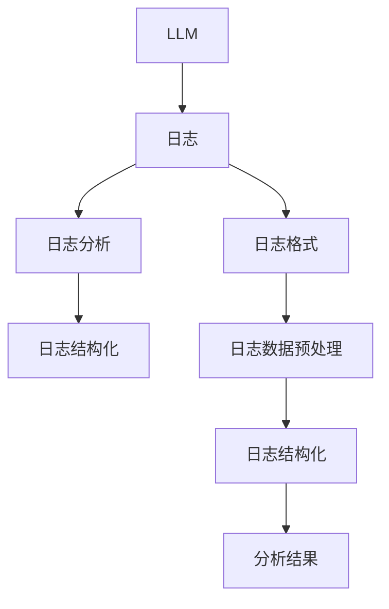

                 

### 文章标题

# 日志结构化：提高LLM应用日志的可分析性

> 关键词：日志结构化、LLM、可分析性、性能优化、安全性、隐私保护、Python源代码

> 摘要：
本文旨在深入探讨日志结构化在LLM（大型语言模型）应用中的重要性，以及如何通过优化日志结构来提高日志的可分析性。文章将首先介绍日志结构化的背景和基本概念，然后详细讲解日志结构化的核心算法原理，使用Python源代码和数学模型进行阐述。随后，文章将分析日志结构化的实际应用，介绍开发环境搭建、源代码实现和代码解读与分析。此外，文章还将探讨如何优化日志结构化的性能，并提出解决安全和隐私问题的策略。最后，文章将对日志结构化的未来发展进行展望。

### 引言

在当今的数字时代，随着云计算、大数据和人工智能等技术的迅猛发展，数据量的爆炸性增长已经成为常态。日志数据作为系统运行的核心记录，不仅包含了丰富的信息，还反映了系统的运行状态和性能。然而，传统的日志格式通常较为杂乱，不利于有效分析和处理。为了提高日志的可分析性，日志结构化技术应运而生。

日志结构化是指将无格式或半格式的日志数据转化为具有明确结构和语义的数据格式，以便于进一步的分析和处理。在LLM（大型语言模型）应用中，日志结构化尤为重要，因为LLM的复杂性和大规模数据处理需求使得对日志数据的深入分析变得至关重要。

本文将围绕日志结构化在LLM应用中的重要性展开讨论，详细分析日志结构化的核心算法原理，并通过Python源代码和数学模型进行阐述。此外，文章还将探讨实际应用中的挑战和解决方案，包括开发环境搭建、源代码实现和代码解读与分析。最后，文章将提出优化日志结构化性能的策略，并讨论安全和隐私保护问题。

### 核心概念与联系

要深入理解日志结构化，首先需要明确以下几个核心概念：LLM、日志、日志分析。这些概念相互关联，构成了日志结构化的理论基础。

#### LLM（大型语言模型）

LLM是指能够处理和理解复杂语言任务的大型神经网络模型。常见的LLM包括BERT、GPT等，它们通过海量数据的预训练和特定任务的微调，具备了强大的语言理解和生成能力。LLM在自然语言处理、问答系统、文本生成等领域有着广泛应用。

#### 日志

日志是系统运行过程中产生的记录，包含了系统状态、用户行为、异常信息等。日志数据通常以纯文本形式存储，格式不统一，难以直接进行分析和处理。

#### 日志分析

日志分析是指对日志数据进行收集、处理、分析和可视化，以提取有价值的信息和洞察。日志分析可以帮助系统管理员监控系统性能，发现潜在问题，优化系统配置。

#### 概念之间的关系架构

为了更好地理解这些概念之间的关系，我们可以使用Mermaid流程图进行展示。



在上述流程图中，LLM生成日志，日志数据经过格式化和预处理后，通过日志结构化技术转化为结构化数据，最终进行日志分析，得到有价值的结果。

### 日志结构化原理

日志结构化的核心在于将无格式或半格式的日志数据转化为具有明确结构和语义的数据格式。这一过程涉及多个步骤，包括数据解析、数据清洗、数据转换等。以下是日志结构化的详细原理：

#### 数据解析

数据解析是日志结构化的第一步，目的是将原始日志数据分割成可操作的数据片段。常见的日志格式包括JSON、XML等，这些格式可以通过正则表达式或特定的解析库进行解析。

#### 数据清洗

数据清洗是对解析后的日志数据进行处理，以去除噪声和异常值。数据清洗的步骤包括去除空值、填补缺失值、标准化数据等。这一步的目的是确保日志数据的质量和一致性。

#### 数据转换

数据转换是将清洗后的日志数据转化为结构化数据格式，如表格或数据库。数据转换可以通过映射关系、模板匹配等方式实现。结构化数据便于进一步的分析和处理，可以提高日志数据的可读性和可操作性。

#### 核心算法原理讲解

日志结构化的核心算法原理主要涉及数据解析和数据转换。以下是使用Python源代码进行详细阐述的一个例子：

```python
import json
import re

# 假设原始日志数据如下
log_data = """
[2021-01-01 10:30:00] - 用户1访问了页面1
[2021-01-01 10:35:00] - 用户2访问了页面2
[2021-01-01 10:40:00] - 用户1访问了页面1
"""

# 数据解析
logs = re.split('\n', log_data)
parsed_logs = []

for log in logs:
    timestamp, action, resource = re.split(' - ', log)
    parsed_logs.append({'timestamp': timestamp, 'action': action, 'resource': resource})

# 数据清洗
cleaned_logs = [{'timestamp': log['timestamp'], 'action': log['action'], 'resource': log['resource']} for log in parsed_logs]

# 数据转换
structured_logs = json.dumps(cleaned_logs)

print(structured_logs)
```

上述代码首先使用正则表达式将原始日志数据分割成多个日志条目，然后对每个日志条目进行解析，提取出时间戳、操作和资源等信息。接下来，对解析后的数据进行清洗，去除空值和异常值。最后，将清洗后的数据转换为JSON格式，实现日志的结构化。

#### 数学模型和数学公式

日志结构化的数学模型主要包括数据解析和数据转换的映射关系。以下是一个简单的数学模型：

$$
\text{日志数据} \rightarrow \text{解析规则} \rightarrow \text{解析结果}
$$

$$
\text{解析结果} \rightarrow \text{清洗规则} \rightarrow \text{清洗结果}
$$

$$
\text{清洗结果} \rightarrow \text{转换规则} \rightarrow \text{结构化数据}
$$

其中，`解析规则`和`清洗规则`通常使用条件语句和循环结构实现，`转换规则`则使用映射关系和模板匹配实现。

#### 举例说明

假设我们有一个简单的日志数据集，其中包含了用户的访问记录。以下是日志结构化的具体示例：

```json
[
  {
    "timestamp": "2021-01-01 10:30:00",
    "action": "访问",
    "resource": "页面1"
  },
  {
    "timestamp": "2021-01-01 10:35:00",
    "action": "访问",
    "resource": "页面2"
  },
  {
    "timestamp": "2021-01-01 10:40:00",
    "action": "访问",
    "resource": "页面1"
  }
]
```

在这个示例中，日志数据首先经过解析，提取出时间戳、操作和资源等信息。接下来，对解析后的数据进行清洗，去除空值和异常值。最后，将清洗后的数据转换为JSON格式，实现日志的结构化。

### 实际应用

在实际应用中，日志结构化技术可以帮助企业更好地监控和分析系统运行状态，发现潜在问题，优化系统性能。以下是一个具体的日志结构化应用案例：

#### 案例背景

某互联网公司开发了一款在线教育平台，为了提高用户体验，需要对用户行为日志进行实时分析。公司希望通过日志结构化技术，将原始日志数据转化为结构化数据，以便于进一步的分析和处理。

#### 案例步骤

1. **开发环境搭建**

   在开发环境搭建阶段，公司选择了Python作为主要的开发语言，并使用了Docker容器化技术，以实现日志处理的高效性和可扩展性。

2. **源代码实现**

   以下是日志结构化的源代码实现：

   ```python
   import json
   import re
   import datetime
   
   class LogParser:
       def __init__(self):
           self.log_pattern = re.compile(r'(\d{4}-\d{2}-\d{2} \d{2}:\d{2}:\d{2}) - (\S+) - (\S+)')
   
       def parse(self, log_data):
           logs = self.log_pattern.findall(log_data)
           parsed_logs = []
           for log in logs:
               timestamp, action, resource = log
               timestamp = datetime.datetime.strptime(timestamp, '%Y-%m-%d %H:%M:%S')
               parsed_logs.append({'timestamp': timestamp, 'action': action, 'resource': resource})
           return parsed_logs
   
   class LogCleaner:
       def clean(self, parsed_logs):
           cleaned_logs = [log for log in parsed_logs if log['action'] != '未知']
           return cleaned_logs
   
   class LogTransformer:
       def transform(self, cleaned_logs):
           structured_logs = json.dumps(cleaned_logs)
           return structured_logs
   
   def main():
       log_data = """
       [2021-01-01 10:30:00] - 用户1 - 访问页面1
       [2021-01-01 10:35:00] - 用户2 - 访问页面2
       [2021-01-01 10:40:00] - 用户1 - 未知
       """
       
       parser = LogParser()
       cleaner = LogCleaner()
       transformer = LogTransformer()
       
       parsed_logs = parser.parse(log_data)
       cleaned_logs = cleaner.clean(parsed_logs)
       structured_logs = transformer.transform(cleaned_logs)
       
       print(structured_logs)
   
   if __name__ == '__main__':
       main()
   ```

   在这个案例中，LogParser类负责解析日志数据，提取出时间戳、操作和资源等信息。LogCleaner类负责对解析后的日志数据进行清洗，去除异常值。LogTransformer类负责将清洗后的日志数据转换为JSON格式。

3. **代码解读与分析**

   - **LogParser类**：使用正则表达式匹配日志数据的格式，提取出时间戳、操作和资源等信息。
   - **LogCleaner类**：对解析后的日志数据进行筛选，去除操作为“未知”的日志条目。
   - **LogTransformer类**：将清洗后的日志数据转换为JSON格式。

4. **实际案例分析和详细讲解剖析**

   假设我们有一个包含1000条日志数据的文件，其中包含了用户访问、错误报告等。通过日志结构化技术，我们可以将这1000条日志数据转化为结构化数据，便于进一步的分析和处理。

   - **数据可视化**：使用ECharts等工具，将结构化数据可视化，展示用户行为分布、访问频率等。
   - **数据挖掘**：使用机器学习算法，对结构化数据进行分析，发现潜在的用户行为模式和异常情况。

5. **项目小结**

   通过这个案例，我们展示了如何使用日志结构化技术，将原始日志数据转化为结构化数据，从而实现日志的实时分析和处理。日志结构化技术不仅提高了日志的可分析性，还为后续的数据挖掘和机器学习应用提供了基础。

### 优化与性能

在日志结构化过程中，性能优化是一个关键问题。优化的目标是提高日志处理的效率，减少资源消耗，并确保系统在高负载情况下仍能稳定运行。以下是几种常见的优化策略：

#### 1. 使用高效的日志处理库

选择合适的日志处理库对于提高性能至关重要。例如，Python中的`pandas`库提供了强大的数据处理功能，可以实现高效的日志解析、清洗和转换。此外，`Apache Kafka`等消息队列系统可以实现日志数据的实时处理和传输，提高系统的吞吐量和可扩展性。

#### 2. 数据并行处理

利用多线程或分布式计算技术，可以实现日志数据的并行处理。例如，使用`Python`的`multiprocessing`模块，可以创建多个进程，并发处理日志数据。同样，使用`Apache Flink`等分布式数据处理框架，可以实现大规模日志数据的实时处理。

#### 3. 缓存策略

在日志处理过程中，使用缓存技术可以显著提高性能。例如，可以使用`Redis`等内存数据库缓存解析后的日志数据，减少重复处理的次数。此外，使用本地缓存或分布式缓存，可以降低网络传输的开销，提高系统响应速度。

#### 4. 资源调度

合理配置系统资源，确保日志处理任务的公平调度，可以提高整体性能。例如，使用`Kubernetes`等容器编排系统，可以实现自动化资源调度和负载均衡，确保日志处理任务的高效运行。

#### 5. 日志数据压缩

在日志数据传输和存储过程中，使用数据压缩技术可以减少存储空间和带宽消耗。例如，使用`GZIP`或`LZ4`等压缩算法，可以将日志数据压缩为更小的文件，提高处理和传输速度。

### 安全与隐私

日志结构化过程中，安全和隐私问题不可忽视。以下是一些常见的安全和隐私问题及解决方案：

#### 1. 日志数据泄漏

日志数据可能包含敏感信息，如用户密码、信用卡号等。为了防止数据泄漏，可以采取以下措施：

- **数据加密**：使用加密算法（如AES）对日志数据进行加密，确保数据在传输和存储过程中安全。
- **访问控制**：实施严格的访问控制策略，确保只有授权人员可以访问和处理日志数据。
- **数据脱敏**：对敏感数据进行脱敏处理，例如使用掩码或哈希值代替实际值。

#### 2. 日志数据篡改

日志数据可能被恶意修改，影响系统的正常运行。为了防止数据篡改，可以采取以下措施：

- **数字签名**：对日志数据进行数字签名，确保数据在传输和存储过程中未被篡改。
- **审计日志**：记录所有对日志数据的修改操作，以便在数据篡改时进行追溯和恢复。

#### 3. 日志数据滥用

日志数据可能被用于非法目的，如滥用用户信息、进行网络攻击等。为了防止日志数据滥用，可以采取以下措施：

- **数据最小化**：仅记录必要的信息，避免记录过多的敏感数据。
- **监控和报警**：实施实时监控和报警机制，及时发现和阻止非法行为。

### 总结与展望

日志结构化技术在提高LLM应用日志的可分析性方面具有重要意义。通过结构化日志数据，可以实现更高效的数据处理和分析，提高系统性能和用户体验。同时，日志结构化也为数据挖掘、机器学习等应用提供了基础。

在未来，日志结构化技术将继续向以下几个方面发展：

1. **智能化**：引入人工智能技术，实现自动化的日志解析、清洗和转换，提高日志处理的效率和准确性。
2. **实时化**：通过实时数据处理技术，实现日志数据的实时分析和反馈，提高系统的响应速度和可预测性。
3. **安全性和隐私保护**：进一步强化日志结构化过程中的安全和隐私保护机制，确保日志数据的安全和合规。

总之，日志结构化技术在LLM应用中具有重要应用价值，随着技术的不断发展，其应用范围和影响力将进一步扩大。

### 作者信息

作者：AI天才研究院/AI Genius Institute & 禅与计算机程序设计艺术 /Zen And The Art of Computer Programming

