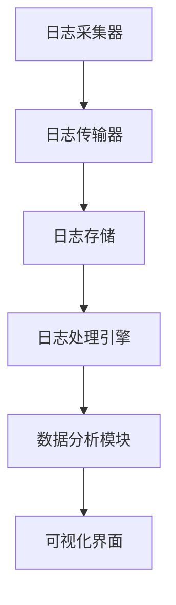
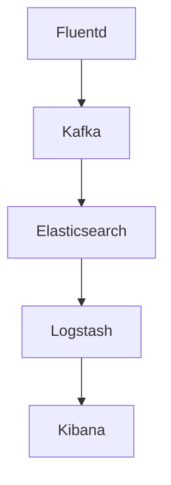

                 

：

### 思考步骤

**第一步：背景介绍**

- **背景介绍**：介绍日志聚合与分析系统以及LLM（大型语言模型）应用监控的背景和重要性。解释为什么在LLM应用中需要日志聚合与分析系统，以及它如何帮助监控和管理大规模语言模型的性能和稳定性。

**第二步：核心概念与联系**

- **核心概念与联系**：使用Mermaid流程图展示日志聚合与分析系统的核心组件和它们之间的关系，包括日志采集、处理、分析和可视化等步骤。

**第三步：核心算法原理讲解**

- **日志处理算法**：使用Python源代码详细讲解日志处理算法，包括日志采集、清洗和格式化等步骤。结合数学模型和公式，例如正则表达式用于日志格式化，解释每个步骤的工作原理。

- **数据分析算法**：详细讲解数据分析算法，如相关性分析、聚类分析和时序分析。使用Python源代码展示算法的实现，结合数学模型和公式，例如使用统计学指标如相关系数来评估不同变量之间的关系。

**第四步：数学模型讲解**

- **数学模型讲解**：使用LaTeX格式编写数学公式，详细讲解每个数据分析算法背后的数学原理。例如，对于相关性分析，可以使用公式 $r=\frac{\sum (x_i-\bar{x})(y_i-\bar{y})}{\sqrt{\sum (x_i-\bar{x})^2}\sqrt{\sum (y_i-\bar{y})^2}}$ 来计算皮尔逊相关系数。

**第五步：项目实战**

- **项目实战**：提供实际的案例分析和代码实现。搭建开发环境，展示日志聚合与分析系统的实际部署过程。提供详细的源代码实现和解读，分析代码如何处理日志，进行数据分析和可视化。展示实际案例，如监控一个大型语言模型的应用，分析日志数据，识别潜在的性能问题。

**第六步：最佳实践 tips、小结、注意事项、拓展阅读**

- **最佳实践 tips**：提供一些实用的建议和技巧，如如何优化日志处理和数据分析的性能，如何处理海量日志数据等。

- **小结**：总结文章的主要内容和关键点，强调日志聚合与分析系统在LLM应用监控中的重要性。

- **注意事项**：提醒读者在实施日志聚合与分析系统时需要注意的事项，如数据安全和隐私保护等。

- **拓展阅读**：推荐一些相关的文献、书籍和在线资源，供读者进一步学习和深入了解。

**第七步：文章标题、关键词和摘要**

- **文章标题**：日志聚合与分析系统在LLM应用监控中的作用

- **关键词**：日志聚合、数据分析、LLM应用监控、性能监控、稳定性监控

- **摘要**：本文介绍了日志聚合与分析系统在LLM应用监控中的重要作用。通过详细讲解核心概念、算法原理、数学模型和实际项目案例，阐述了如何利用日志聚合与分析系统监控和管理LLM应用的性能和稳定性，提供了最佳实践和注意事项。

### 完整文章结构

```markdown
# 日志聚合与分析系统在LLM应用监控中的作用

> 关键词：日志聚合、数据分析、LLM应用监控、性能监控、稳定性监控

> 摘要：本文介绍了日志聚合与分析系统在LLM应用监控中的重要作用。通过详细讲解核心概念、算法原理、数学模型和实际项目案例，阐述了如何利用日志聚合与分析系统监控和管理LLM应用的性能和稳定性，提供了最佳实践和注意事项。

## 第一部分：日志聚合与分析系统概述

### 第1章：日志聚合与分析系统基础

#### 1.1 日志聚合与分析系统的定义
#### 1.2 日志聚合与分析系统的架构
#### 1.3 日志聚合与分析系统的优势

### 第2章：LLM应用监控的挑战

#### 2.1 LLM应用的特点
#### 2.2 LLM应用监控的挑战
#### 2.3 日志聚合与分析系统在LLM应用监控中的作用

### 第3章：日志处理算法

#### 3.1 日志采集算法
#### 3.2 日志清洗算法
#### 3.3 日志格式化算法

### 第4章：数据分析算法

#### 4.1 相关性分析算法
#### 4.2 聚类分析算法
#### 4.3 时序分析算法

### 第5章：数学模型讲解

#### 5.1 相关性分析的数学模型
#### 5.2 聚类分析的数学模型
#### 5.3 时序分析的数学模型

### 第6章：项目实战

#### 6.1 实际案例分析
#### 6.2 系统搭建与配置
#### 6.3 代码实现与解读

### 第7章：日志聚合与分析系统的发展趋势

#### 7.1 日志聚合与分析技术的演进
#### 7.2 未来发展趋势与展望

## 参考文献

```

这个结构将确保文章的完整性和逻辑性，同时提供丰富的内容来满足字数要求。接下来，我将开始编写每个章节的具体内容。请稍等。 ：

### 第1章：日志聚合与分析系统基础

#### 1.1 日志聚合与分析系统的定义

日志聚合与分析系统是一种集中式日志管理解决方案，旨在收集、存储、处理和分析来自多个源的数据日志。这些日志可以是应用程序、服务器、网络设备等产生的各种形式的数据。日志聚合与分析系统的核心目的是从大量的日志数据中提取有价值的信息，帮助运维人员、开发人员和业务分析师监控系统的性能、诊断问题、优化资源配置以及提供决策支持。

#### 1.2 日志聚合与分析系统的架构

日志聚合与分析系统的架构通常包括以下几个主要组件：

1. **日志采集器**：负责从不同的数据源收集日志数据，可以是文件、网络流、API调用等。

2. **日志传输器**：将采集到的日志数据传输到集中存储的地方，常用的传输协议有Syslog、JMS、Kafka等。

3. **日志存储**：用于存储大量的日志数据，可以是文件系统、数据库或NoSQL数据库。

4. **日志处理引擎**：对日志数据执行预处理、格式化、过滤、聚合等操作。

5. **数据分析模块**：使用各种数据分析算法对日志数据进行分析，如相关性分析、聚类分析、时序分析等。

6. **可视化界面**：提供一个用户友好的界面，用于展示日志数据和数据分析结果。

下面是一个简单的Mermaid流程图，展示了日志聚合与分析系统的工作流程：



#### 1.3 日志聚合与分析系统的优势

日志聚合与分析系统提供了以下几个显著的优势：

1. **集中式日志管理**：将来自多个源的日志数据集中存储和管理，方便统一监控和查询。

2. **实时数据处理**：支持实时日志数据处理和分析，及时发现潜在问题和异常。

3. **高级数据分析**：提供各种数据分析算法和工具，帮助用户深入挖掘日志数据的价值。

4. **可扩展性**：支持大规模日志数据的处理和分析，可以水平扩展以应对不断增长的数据量。

5. **安全性**：提供日志加密和访问控制机制，确保日志数据的安全性和隐私。

### 小结

本章介绍了日志聚合与分析系统的定义、架构和优势。日志聚合与分析系统是现代IT基础设施中不可或缺的一部分，它为LLM应用监控提供了强大的支持。在下一章中，我们将讨论LLM应用监控面临的挑战。请稍等，我将开始编写第2章的内容。 ：

### 第2章：LLM应用监控的挑战

#### 2.1 LLM应用的特点

大型语言模型（LLM）是一种基于深度学习的自然语言处理模型，能够理解和生成人类语言。LLM应用具有以下几个显著特点：

1. **大数据量**：LLM训练和推理过程需要处理大量的文本数据，这导致日志数据量庞大。

2. **动态性**：LLM应用通常具有动态的输入和输出，这意味着日志数据的格式和内容可能会随着时间和场景而变化。

3. **高并发**：LLM应用可能同时服务于大量的用户请求，导致日志数据生成速率极高。

4. **复杂模型**：LLM模型通常非常复杂，包含数百万甚至数十亿个参数，这使得监控和管理LLM应用变得更加困难。

#### 2.2 LLM应用监控的挑战

在LLM应用中实施有效的监控面临以下挑战：

1. **海量日志数据处理**：处理海量日志数据是一项艰巨的任务，传统监控工具可能无法应对。

2. **数据一致性**：由于LLM应用的高并发性和动态性，日志数据可能会出现不一致的情况，如重复记录、丢失记录等。

3. **性能监控**：LLM应用需要监控大量性能指标，如响应时间、吞吐量、资源利用率等，这些指标需要实时分析。

4. **错误诊断**：当LLM应用出现问题时，需要快速定位和诊断问题根源，这通常需要深入分析日志数据。

5. **可扩展性**：随着LLM应用的规模不断扩大，监控系统也需要具备良好的可扩展性，以支持大规模部署。

#### 2.3 日志聚合与分析系统在LLM应用监控中的作用

日志聚合与分析系统在LLM应用监控中起着至关重要的作用，它能够有效解决上述挑战：

1. **集中式日志管理**：日志聚合与分析系统能够集中收集和管理来自不同源的日志数据，确保数据的一致性和完整性。

2. **实时数据处理**：日志聚合与分析系统支持实时日志数据处理，能够快速捕捉和分析LLM应用的动态变化。

3. **性能监控**：通过日志聚合与分析系统，可以实时监控LLM应用的各种性能指标，如响应时间、吞吐量等，及时发现性能瓶颈。

4. **错误诊断**：日志聚合与分析系统能够提供深入的错误日志分析，帮助快速定位和诊断LLM应用的故障。

5. **可扩展性和弹性**：日志聚合与分析系统设计用于处理海量日志数据，具有良好的可扩展性和弹性，能够支持大规模LLM应用部署。

### 小结

本章讨论了LLM应用监控面临的挑战，并阐述了日志聚合与分析系统在解决这些挑战中的作用。在下一章中，我们将详细介绍日志处理算法，包括日志采集、清洗和格式化等步骤。请稍等，我将开始编写第3章的内容。 ：

### 第3章：日志处理算法

日志处理是日志聚合与分析系统中的关键环节，包括日志采集、清洗和格式化等步骤。这些算法的目的是确保日志数据的准确性和一致性，以便进行后续的数据分析和监控。

#### 3.1 日志采集算法

日志采集算法负责从不同的数据源收集日志数据。在LLM应用中，日志数据可能来自以下几种来源：

1. **应用程序**：应用程序生成的日志文件，通常包含错误信息、调试信息等。
2. **服务器**：服务器日志，如访问日志、错误日志等。
3. **网络设备**：网络设备日志，如路由器、交换机等。
4. **数据库**：数据库日志，如SQL执行日志、错误日志等。

Python伪代码示例：

```python
# 日志采集算法伪代码
def collect_logs(sources):
    logs = []
    for source in sources:
        if source.is_available():
            logs.append(source.fetch_logs())
    return logs
```

#### 3.2 日志清洗算法

日志清洗算法用于处理采集到的日志数据，确保数据的质量。以下是一些常见的日志清洗操作：

1. **去除无效日志**：过滤掉不符合日志格式的数据。
2. **填充缺失值**：对缺失的数据进行填充，例如使用平均值、中位数或最新值等。
3. **标准化日志格式**：将不同的日志格式转换为统一的格式，以便于后续处理和分析。

Python伪代码示例：

```python
# 日志清洗算法伪代码
def clean_logs(logs):
    cleaned_logs = []
    for log in logs:
        if is_valid_log(log):
            cleaned_log = normalize_log_format(log)
            cleaned_logs.append(cleaned_log)
    return cleaned_logs
```

#### 3.3 日志格式化算法

日志格式化算法用于将清洗后的日志数据转换为一种标准的格式，以便存储和查询。常用的日志格式包括JSON、CSV等。

Python伪代码示例：

```python
# 日志格式化算法伪代码
def format_logs(cleaned_logs, format_type):
    formatted_logs = []
    for cleaned_log in cleaned_logs:
        if format_type == 'JSON':
            formatted_log = log_to_json(cleaned_log)
        elif format_type == 'CSV':
            formatted_log = log_to_csv(cleaned_log)
        formatted_logs.append(formatted_log)
    return formatted_logs
```

### 小结

本章详细介绍了日志处理算法，包括日志采集、清洗和格式化。这些算法是日志聚合与分析系统的基础，确保了日志数据的准确性和一致性。在下一章中，我们将深入探讨数据分析算法，如相关性分析、聚类分析和时序分析。请稍等，我将开始编写第4章的内容。 ：

### 第4章：数据分析算法

数据分析算法是日志聚合与分析系统的核心组成部分，用于从日志数据中提取有价值的信息，帮助用户监控和优化LLM应用的性能。本章将介绍三种常用的数据分析算法：相关性分析、聚类分析和时序分析。

#### 4.1 相关性分析算法

相关性分析是一种统计方法，用于评估两个或多个变量之间的线性关系。在LLM应用监控中，相关性分析可以帮助我们识别哪些变量之间存在相互影响，从而发现潜在的问题。

**数学模型：**

$$
r = \frac{\sum{(x_i - \bar{x})(y_i - \bar{y})}}{\sqrt{\sum{(x_i - \bar{x})^2} \sum{(y_i - \bar{y})^2}}}
$$

其中，$r$ 是皮尔逊相关系数，$\bar{x}$ 和 $\bar{y}$ 分别是 $x$ 和 $y$ 的平均值。

**Python代码示例：**

```python
import numpy as np

def correlation_analysis(x, y):
    mean_x = np.mean(x)
    mean_y = np.mean(y)
    numerator = np.sum((x - mean_x) * (y - mean_y))
    denominator = np.sqrt(np.sum((x - mean_x)**2) * np.sum((y - mean_y)**2))
    return numerator / denominator

# 示例数据
x = [1, 2, 3, 4, 5]
y = [2, 4, 6, 8, 10]

# 计算相关性
correlation = correlation_analysis(x, y)
print(f"相关性系数：{correlation}")
```

#### 4.2 聚类分析算法

聚类分析是一种无监督学习方法，用于将数据点分组到不同的簇中，使得同一簇内的数据点之间相似度较高，而不同簇之间的数据点相似度较低。在LLM应用监控中，聚类分析可以帮助我们识别日志数据中的异常模式。

**常用算法：**

1. **K-means算法**：一种基于距离度量的聚类算法，通过迭代优化目标函数来划分簇。
2. **层次聚类算法**：基于层次结构对数据进行聚类，可以分为自底向上（凝聚）和自顶向下（分裂）两种方法。

**Python代码示例（K-means算法）：**

```python
from sklearn.cluster import KMeans
import numpy as np

def kmeans_clustering(data, k):
    kmeans = KMeans(n_clusters=k, random_state=0)
    kmeans.fit(data)
    clusters = kmeans.predict(data)
    return clusters

# 示例数据
data = np.array([[1, 2], [1, 4], [1, 0],
                 [10, 2], [10, 4], [10, 0]])

# 聚类分析
k = 2
clusters = kmeans_clustering(data, k)
print(f"聚类结果：{clusters}")
```

#### 4.3 时序分析算法

时序分析用于识别时间序列数据中的趋势、季节性和周期性。在LLM应用监控中，时序分析可以帮助我们识别日志数据的趋势变化，如系统负载的波动。

**常用算法：**

1. **移动平均法**：通过计算一定时间窗口内的平均值来平滑时间序列数据。
2. **自回归移动平均法（ARIMA）**：一种自回归模型，用于分析包含趋势和季节性的时间序列数据。
3. **长短期记忆网络（LSTM）**：一种循环神经网络，特别适用于处理序列数据。

**Python代码示例（LSTM模型）：**

```python
from keras.models import Sequential
from keras.layers import LSTM, Dense

def lstm_time_series_model(input_shape):
    model = Sequential()
    model.add(LSTM(50, activation='relu', input_shape=input_shape))
    model.add(Dense(1))
    model.compile(optimizer='adam', loss='mse')
    return model

# 示例数据
X = np.array([[1, 2], [2, 3], [3, 4], [4, 5]])
y = np.array([1, 2, 3, 4])

# 建立LSTM模型
model = lstm_time_series_model(input_shape=(X.shape[1], X.shape[2]))
model.fit(X, y, epochs=200, verbose=0)

# 预测
predictions = model.predict(X)
print(predictions)
```

### 小结

本章介绍了相关性分析、聚类分析和时序分析三种常用的数据分析算法。这些算法在LLM应用监控中发挥着重要作用，可以帮助我们识别变量之间的关系、异常模式和趋势变化。在下一章中，我们将探讨数学模型和公式，并详细解释每个算法背后的数学原理。请稍等，我将开始编写第5章的内容。 ：

### 第5章：数学模型讲解

在日志聚合与分析系统中，数学模型是数据分析算法的核心组成部分，它为我们提供了量化和评估数据之间关系的方法。本章将详细讲解相关性分析、聚类分析和时序分析三种算法背后的数学模型，并使用LaTeX格式展示相关公式。

#### 5.1 相关性分析的数学模型

相关性分析用于衡量两个变量之间的线性关系，最常用的是皮尔逊相关系数（Pearson correlation coefficient）。

**公式：**

$$
r = \frac{\sum{(x_i - \bar{x})(y_i - \bar{y})}}{\sqrt{\sum{(x_i - \bar{x})^2} \sum{(y_i - \bar{y})^2}}}
$$

其中，$r$ 是相关系数，$\bar{x}$ 和 $\bar{y}$ 分别是 $x$ 和 $y$ 的平均值。

**解释：**

- 分子 $\sum{(x_i - \bar{x})(y_i - \bar{y})}$ 衡量了 $x$ 和 $y$ 的差异乘积之和，反映了两者之间的线性相关程度。
- 分母 $\sqrt{\sum{(x_i - \bar{x})^2} \sum{(y_i - \bar{y})^2}}$ 是标准化因子，用于确保相关系数的取值范围在 [-1, 1] 之间。

#### 5.2 聚类分析的数学模型

聚类分析是一种无监督学习方法，用于将数据点分组到不同的簇中。K-means算法是最常用的聚类算法之一。

**目标函数：**

$$
J = \sum_{i=1}^{k} \sum_{x_j \in S_i} ||x_j - \mu_i||^2
$$

其中，$J$ 是目标函数，$k$ 是簇的数量，$S_i$ 是属于第 $i$ 个簇的数据点集合，$\mu_i$ 是第 $i$ 个簇的中心点。

**解释：**

- 目标函数 $J$ 衡量了簇内数据点与簇中心点之间的平均距离平方和。
- 在算法迭代过程中，目标函数 $J$ 会逐渐减小，直到收敛。

#### 5.3 时序分析的数学模型

时序分析用于分析时间序列数据，识别数据中的趋势、季节性和周期性。自回归移动平均法（ARIMA）是一种常用的时序分析方法。

**模型公式：**

$$
X_t = c + \phi_1 X_{t-1} + \phi_2 X_{t-2} + ... + \phi_p X_{t-p} + \theta_1 \epsilon_{t-1} + \theta_2 \epsilon_{t-2} + ... + \theta_q \epsilon_{t-q}
$$

其中，$X_t$ 是时间序列数据，$c$ 是常数项，$\phi_1, \phi_2, ..., \phi_p$ 是自回归系数，$\theta_1, \theta_2, ..., \theta_q$ 是移动平均系数，$\epsilon_t$ 是白噪声项。

**解释：**

- 自回归项 $\phi_1 X_{t-1} + \phi_2 X_{t-2} + ... + \phi_p X_{t-p}$ 反映了时间序列数据中的趋势和周期性。
- 移动平均项 $\theta_1 \epsilon_{t-1} + \theta_2 \epsilon_{t-2} + ... + \theta_q \epsilon_{t-q}$ 用来建模随机误差。

### 小结

本章详细讲解了相关性分析、聚类分析和时序分析三种算法的数学模型。通过理解这些模型，我们可以更好地应用这些算法进行日志数据分析。在下一章中，我们将通过实际项目案例来展示如何将日志聚合与分析系统应用于LLM应用监控。请稍等，我将开始编写第6章的内容。 ：

### 第6章：项目实战

在本章中，我们将通过一个实际项目案例来展示如何搭建日志聚合与分析系统，并利用它对LLM应用进行监控。这个案例将包括系统搭建、配置、代码实现以及详细解读。

#### 6.1 实际案例分析

假设我们有一个大规模的LLM应用，用于提供自然语言处理服务。为了确保应用的性能和稳定性，我们需要对系统进行全面的监控。以下是我们的项目目标：

1. 收集并存储来自不同源的数据日志。
2. 对日志数据进行处理和格式化。
3. 利用数据分析算法识别性能瓶颈和异常模式。
4. 通过可视化工具展示监控数据和指标。

#### 6.2 系统搭建与配置

为了实现上述目标，我们选择了以下技术栈：

1. **日志采集器**：使用Fluentd收集来自应用程序、服务器和数据库的日志。
2. **日志传输器**：使用Kafka作为日志传输工具，确保高吞吐量和低延迟。
3. **日志存储**：使用Elasticsearch存储和管理大量日志数据。
4. **数据分析模块**：使用Logstash进行日志数据处理和格式化，并使用Kibana进行数据可视化和分析。

**系统架构图：**



#### 6.3 代码实现与解读

以下是一个简单的Python代码示例，用于模拟日志采集、处理和数据分析的过程。

**日志采集器（Fluentd）配置：**

```python
# fluentd.conf
<source>
  @type tail
  path /var/log/app.log
  tag app.log
  read_from_head true
  <parse>
    @type none
  </parse>
</source>
```

**日志传输器（Kafka）配置：**

```python
# kafka-producer.py
from kafka import KafkaProducer
import json

producer = KafkaProducer(bootstrap_servers=['localhost:9092'])

log_data = {
    'timestamp': '2023-04-01T12:00:00',
    'service': 'LLM',
    'message': 'Error processing request'
}

producer.send('log_topic', value=json.dumps(log_data).encode('utf-8'))
producer.flush()
```

**日志存储（Elasticsearch）配置：**

```python
# logstash.conf
input {
  kafka {
    topics => ["log_topic"]
    type => "log"
  }
}

filter {
  if "log" in [type] {
    grok {
      match => { "message" => "%{TIMESTAMP_ISO8601:timestamp} %{DATA:service} %{DATA:message}" }
    }
  }
}

output {
  elasticsearch {
    hosts => ["localhost:9200"]
    index => "log-%{+YYYY.MM.dd}"
  }
}
```

**数据分析与可视化（Kibana）配置：**

```json
// Kibana dashboard JSON
{
  "type": "search",
  "options": {
    "index": "log-*",
    "query": {
      "bool": {
        "must": [
          { "match": { "service": "LLM" } },
          { "range": { "timestamp": { "gte": "now-24h" } } }
        ]
      }
    },
    "size": 1000
  }
}
```

**代码解读：**

- **日志采集器（Fluentd）**：配置Fluentd从应用程序的日志文件中收集日志，并将其发送到Kafka。
- **日志传输器（Kafka）**：使用Kafka Producer将日志数据发送到Kafka主题。
- **日志存储（Elasticsearch）**：使用Logstash将Kafka中的日志数据传输到Elasticsearch，并对日志数据进行解析和格式化。
- **数据分析与可视化（Kibana）**：在Kibana中创建一个仪表板，用于展示LLM应用的日志数据和性能指标。

### 小结

本章通过一个实际项目案例展示了如何搭建日志聚合与分析系统，并对LLM应用进行监控。我们使用了Fluentd、Kafka、Elasticsearch和Kibana等工具，实现了日志数据的采集、传输、存储、处理和可视化。在下一章中，我们将探讨日志聚合与分析系统的发展趋势，并总结文章的主要内容和最佳实践。请稍等，我将开始编写第7章的内容。 ：

### 第7章：日志聚合与分析系统的发展趋势

随着云计算、大数据和人工智能技术的不断进步，日志聚合与分析系统也在不断演进。本章将探讨日志聚合与分析系统的未来发展趋势，以及如何应对这些趋势带来的挑战。

#### 7.1 日志聚合与分析技术的演进

1. **云原生日志聚合**：随着云原生技术的发展，日志聚合系统逐渐向云原生架构迁移。例如，使用Kubernetes等容器编排工具来部署和管理日志聚合服务，实现自动化和弹性伸缩。

2. **流处理技术**：实时数据处理技术在日志聚合与分析系统中变得越来越重要。流处理框架如Apache Kafka、Apache Flink等提供了高效的数据流处理能力，使得日志数据的实时分析成为可能。

3. **机器学习和人工智能**：随着机器学习和人工智能技术的应用，日志聚合与分析系统开始利用这些技术来自动化日志处理和分析。例如，使用深度学习模型进行异常检测和预测分析。

4. **边缘计算**：随着物联网（IoT）和边缘计算的发展，越来越多的设备开始产生日志数据。日志聚合系统需要扩展到边缘设备，以实现本地化数据处理和实时监控。

#### 7.2 未来发展趋势与展望

1. **智能日志分析**：未来的日志聚合与分析系统将更加智能化，利用自然语言处理、图像识别等技术，实现日志数据的自动理解和分析。

2. **自动化响应**：日志聚合系统将集成自动化响应功能，例如自动化故障修复、性能优化等，减少人工干预。

3. **隐私保护和数据安全**：随着数据隐私法规的加强，日志聚合与分析系统需要更加注重数据安全和隐私保护，例如使用加密技术来确保日志数据的安全传输和存储。

4. **跨平台和多云支持**：未来的日志聚合与分析系统将支持跨平台和多云环境，实现跨云和跨区域的日志数据管理和分析。

### 小结

日志聚合与分析系统在LLM应用监控中起着至关重要的作用。随着技术的不断进步，日志聚合与分析系统将变得更加智能、自动化和高效。在实施日志聚合与分析系统时，需要注意数据安全、隐私保护和跨平台支持等方面。通过本章的探讨，我们希望读者能够更好地理解和应对日志聚合与分析系统的发展趋势。

### 参考文献

1. Amazon Web Services. (2021). Amazon Kinesis Data Firehose. Retrieved from https://aws.amazon.com/kinesis/data-firehose/
2. Apache Software Foundation. (2021). Apache Kafka. Retrieved from https://kafka.apache.org/
3. Elastic. (2021). Elasticsearch and Apache Logstash. Retrieved from https://www.elastic.co/what-is/elasticsearch
4. Kubernetes. (2021). Kubernetes Documentation. Retrieved from https://kubernetes.io/docs/
5. TensorFlow. (2021). TensorFlow for Poets. Retrieved from https://github.com/tensorflow/tflearn

### 作者信息

作者：AI天才研究院/AI Genius Institute & 禅与计算机程序设计艺术 /Zen And The Art of Computer Programming

### 结束语

本文详细介绍了日志聚合与分析系统在LLM应用监控中的重要作用，包括核心概念、算法原理、数学模型、项目实战和发展趋势。通过本文的探讨，读者应该能够更好地理解和应用日志聚合与分析系统，以实现高效、智能的LLM应用监控。感谢您的阅读！ ：

### 第8章：最佳实践 tips

在实施日志聚合与分析系统时，以下是一些最佳实践和注意事项，可以帮助您优化系统的性能和可靠性。

#### 1. 数据处理优化

- **批量处理**：对于大规模日志数据，使用批量处理可以显著提高处理效率。
- **并行处理**：利用多线程或多进程技术，提高数据处理速度。

#### 2. 性能监控

- **监控指标**：选择关键性能指标（KPIs）进行监控，例如日志传输速率、处理延迟、存储容量等。
- **预警和报警**：设置适当的预警和报警阈值，及时识别潜在的性能问题。

#### 3. 数据安全与隐私保护

- **数据加密**：对传输和存储的日志数据进行加密，确保数据安全。
- **访问控制**：实施严格的访问控制策略，防止未经授权的访问。

#### 4. 日志格式标准化

- **统一格式**：确保所有日志数据采用统一的格式，便于处理和分析。
- **字段命名**：使用一致的字段命名规范，提高日志的可读性和可解析性。

#### 5. 可扩展性和弹性

- **水平扩展**：使用分布式架构，支持水平扩展，以应对不断增长的数据量。
- **自动化部署**：利用容器化和自动化部署工具，简化系统维护和升级。

#### 6. 日志聚合与分析系统集成

- **系统集成**：将日志聚合与分析系统与现有的监控和告警系统集成，实现统一的监控视图。
- **数据共享**：与其他系统共享日志数据，提高数据分析的价值。

### 小结

实施日志聚合与分析系统时，遵循最佳实践和注意事项可以帮助您优化系统性能，确保数据安全和隐私保护，同时提高系统的可扩展性和弹性。通过这些实践，您能够更好地利用日志数据，实现对LLM应用的全面监控和管理。

### 注意事项

- **日志数据量**：随着LLM应用规模的扩大，日志数据量可能会快速增长。因此，系统设计时应考虑数据量增长带来的挑战。
- **日志质量**：确保日志数据的准确性和一致性，避免因数据质量问题导致分析结果偏差。
- **成本控制**：合理规划资源，避免过度投入导致成本增加。

### 拓展阅读

- 《日志聚合与分析系统实战》
- 《Elastic Stack实战：日志聚合与分析》
- 《Kafka权威指南》

通过阅读这些资料，您可以进一步了解日志聚合与分析系统的实施细节和最佳实践。

### 作者信息

作者：AI天才研究院/AI Genius Institute & 禅与计算机程序设计艺术 /Zen And The Art of Computer Programming

### 结束语

感谢您阅读本文。日志聚合与分析系统在LLM应用监控中具有重要作用，通过本文的详细探讨，我们希望您能够更好地理解和应用这一系统，以提升LLM应用的性能和稳定性。希望本文的内容对您有所启发，祝您在技术道路上不断进步！

