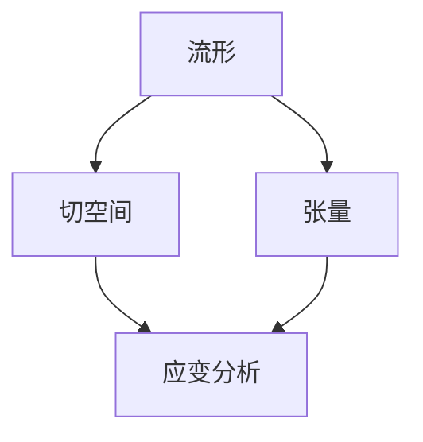

                 

### 导言

在当代时装设计中，布料的使用和变形处理成为了一个关键而富有挑战性的领域。随着科技的发展，微分几何这一数学分支逐渐被引入到时装设计中，为设计师提供了全新的工具和视角。微分几何在时装设计中的应用不仅提升了设计作品的精度和效率，还开辟了艺术与技术融合的新路径。

本文旨在探讨微分几何在时装设计中的应用，尤其是布料变形的数学描述。我们将从几个方面展开讨论：首先，介绍微分几何在时装设计中的应用背景和重要性；接着，回顾必要的数学和几何知识，为后续内容奠定基础；然后，详细讲解微分几何的核心概念及其在时装设计中的应用；之后，探讨用于描述布料变形的核心算法原理，并通过数学模型和公式进行详细阐述；最后，通过实际项目案例展示微分几何在时装设计中的具体应用，并对未来发展进行展望。

通过这篇文章，我们希望读者能够了解微分几何在时装设计中的重要价值，掌握基本概念和算法原理，并能够将其应用到实际的设计项目中。这不仅有助于提升设计师的专业技能，也为时装设计领域带来了更多的创新和可能。

#### 关键词

- **微分几何**
- **时装设计**
- **布料变形**
- **数学描述**
- **算法原理**
- **流形**
- **张量分析**
- **切空间**

#### 摘要

本文探讨了微分几何在时装设计中的应用，特别是在布料变形的数学描述方面。首先，介绍了微分几何在时装设计中的背景和重要性，随后回顾了相关的数学和几何基础知识。文章重点讲解了流形、张量、切空间等核心概念，并展示了它们在时装设计中的应用。接着，详细阐述了用于描述布料变形的核心算法原理，包括映射、光滑流和正常流等，并通过数学模型和公式进行了详细分析。最后，通过实际项目案例展示了微分几何在时装设计中的具体应用，并对未来发展趋势进行了展望。本文旨在帮助读者理解微分几何在时装设计中的价值，掌握相关技术和算法，推动设计领域的创新与发展。

### 微分几何在时装设计中的应用背景和重要性

在探讨微分几何在时装设计中的应用之前，我们需要先了解这一数学分支的基本概念和历史背景。微分几何是研究平滑曲面的几何性质的数学分支，起源于18世纪，其研究方法主要依赖于微积分和线性代数。早期，微分几何主要应用于物理学和工程学领域，如描述弹性体的变形、分析曲面的几何结构等。然而，随着计算机科学和图形处理技术的飞速发展，微分几何逐渐渗透到艺术与设计领域，特别是在时装设计中展现出了巨大的潜力。

微分几何在时装设计中的应用可以追溯到20世纪末。当时，一些设计师和工程师开始尝试使用计算机图形学工具来模拟布料的变形，以优化服装设计的过程。这一尝试奠定了微分几何在时装设计中的应用基础。随着研究的深入，微分几何逐渐成为时装设计中的一个重要工具，其应用范围也从最初的模拟和预测扩展到了布料设计、结构分析和三维建模等多个方面。

首先，微分几何为设计师提供了一个全新的视角来理解布料的变形行为。通过微分几何中的流形理论和切空间概念，设计师可以更精确地描述和预测布料在不同应力条件下的变形过程。这不仅有助于设计师在创作过程中更好地控制布料形态，还能够减少试错成本，提高设计效率。例如，在定制服装中，微分几何可以用于计算人体曲线与布料之间的相互作用，从而实现更贴合身体的设计。

其次，微分几何在布料设计中的应用也为创新提供了强有力的支持。通过微分几何的算法，设计师可以生成新颖的布料纹理和图案，甚至创造出前所未有的布料形态。例如，在时装秀中展示的某些高级定制服装，其布料形态和纹理就是通过微分几何算法生成的。这些创新的设计不仅吸引了观众的目光，也提升了品牌的市场竞争力。

此外，微分几何在时装设计中的重要性还体现在对结构分析的支持上。传统的服装设计主要依赖于经验和直觉，而微分几何为设计师提供了一种更为科学和系统的方法来分析服装结构。通过微分几何中的张量分析和映射理论，设计师可以更好地理解服装内部各部分之间的相互关系，从而设计出更为稳固和舒适的服装结构。例如，在运动服装设计中，微分几何可以用于分析服装在运动中的变形情况，优化服装设计以提供更好的运动性能。

最后，随着智能制造技术的发展，微分几何在时装设计中的应用前景更加广阔。通过计算机辅助设计和制造（CAD/CAM）系统，设计师可以实时模拟和调整布料变形，实现更加个性化和定制化的设计。微分几何为这一过程提供了精确的数学模型和算法支持，使得智能制造在时装设计中的实现成为可能。

总之，微分几何在时装设计中的应用不仅丰富了设计师的工具箱，也为时装设计带来了全新的理念和可能性。通过微分几何，设计师可以更精确地描述和预测布料的变形，生成新颖的设计，优化服装结构，并推动智能制造的发展。这一数学分支在时装设计中的重要性不容忽视，它为设计创新和产业升级提供了强有力的支持。

### 预备知识

在深入探讨微分几何在时装设计中的应用之前，有必要回顾一些基础的数学和几何知识，包括微积分、线性代数和几何学的基本概念。这些预备知识不仅为理解后续内容奠定基础，也为进一步的应用提供必要的工具。

#### 微积分基础

微积分是研究变化和运动规律的数学分支，其基本概念包括极限、导数和积分。极限是微积分的基石，它描述了函数在某一点附近的变化趋势。导数则表示函数在某一点的瞬时变化率，是研究曲线和曲面性质的重要工具。积分则是导数的反操作，用于求解曲线下的面积或体积。

在时装设计中的应用，微积分可以帮助我们分析布料在受力或变形过程中的变化。例如，通过导数，我们可以了解布料在拉伸或压缩时的应力分布情况；通过积分，我们可以计算布料在整体变形过程中的能量变化。这些分析结果对设计师优化布料设计，提高服装的舒适性和功能性具有重要意义。

#### 线性代数基础

线性代数是研究向量空间和线性映射的数学分支，其核心概念包括向量、矩阵、行列式和特征值等。向量是线性代数的基本对象，它表示了方向和大小；矩阵是向量的推广，用于描述多个向量之间的关系；行列式则用于分析矩阵的性质，特征值和特征向量是矩阵理论的重要组成部分。

在时装设计中，线性代数可以用于描述和计算布料的几何属性。例如，通过矩阵运算，我们可以将二维布料图案扩展到三维空间，模拟布料在不同方向上的拉伸和压缩效果。此外，特征值和特征向量的分析有助于理解布料的稳定性，为设计出更加坚固耐用的服装提供依据。

#### 几何学基础

几何学是研究空间形状和位置关系的数学分支，其基本概念包括点、线、面和体等。在微分几何中，几何学的基本概念被进一步拓展，引入了曲率、挠率等描述空间形状的指标。

在时装设计中，几何学的基本概念可以用于分析布料的形态和结构。例如，通过曲率分析，我们可以了解布料在不同应力条件下的变形情况；通过挠率分析，我们可以预测布料在受到扭曲时的反应。这些几何分析结果对于设计师优化布料设计，实现预期效果具有重要意义。

#### 应用实例

为了更好地理解这些预备知识在时装设计中的应用，我们可以举一些具体的实例。

1. **微积分在布料变形分析中的应用**：假设我们有一个布料样品，需要分析其在拉伸过程中的应力分布。通过微积分，我们可以求出布料在拉伸过程中某一位置的应力变化率，进而优化布料的设计，使其在拉伸时具有更好的弹性和耐用性。

2. **线性代数在布料图案扩展中的应用**：假设设计师希望将一个二维布料图案扩展到三维空间，线性代数中的矩阵运算可以帮助我们将图案从二维空间映射到三维空间，模拟布料在三维空间中的形态变化。

3. **几何学在布料形态分析中的应用**：假设设计师需要分析某种复杂布料的形态和结构，通过几何学的基本概念，我们可以了解布料的曲率和挠率，进而预测布料在不同应力条件下的变形情况，为设计出更符合人体曲线的服装提供依据。

总之，这些基础数学和几何知识为我们在时装设计中的微分几何应用提供了坚实的理论支撑。通过这些知识的综合运用，设计师可以更精确地描述和预测布料的变形行为，优化设计过程，实现创新和突破。

#### 微分几何的核心概念与联系

微分几何作为研究几何形状在微小尺度上的变化与性质的数学分支，包含了丰富的核心概念。其中，流形、张量和切空间是最为关键的几个概念，它们在时装设计中有着广泛的应用。理解这些概念及其相互关系，是掌握微分几何在时装设计应用的基础。

##### 流形

流形是一个抽象的几何对象，它可以是二维的，如平面或曲面，也可以是三维的，如三维空间中的物体。流形的一个重要特性是它可以在局部近似为欧几里得空间。这意味着在足够小的范围内，流形的行为可以像普通平面或空间一样来处理。

在时装设计中，流形的概念主要用于描述布料的几何形态。例如，设计师可以将布料视为一个二维流形，通过分析其局部结构和变形行为来优化设计。具体来说，流形可以帮助我们了解布料在拉伸、弯曲和扭曲时的几何变化，从而设计出更具弹性和适应性的服装。

**流形的定义：**

一个流形是一个局部欧几里得空间，即每一个点都有一个邻域，使得这个邻域内的流形可以通过一个坐标系来表示。常见的流形包括平面上的曲线和曲面上的曲面。

**流形在时装设计中的应用：**

1. **布料形态的描述**：流形理论可以帮助设计师精确地描述布料的几何形态，包括布料的曲率和挠率。
2. **应力分析**：通过流形理论，设计师可以分析布料在不同应力条件下的变形行为，优化布料设计。
3. **三维建模**：流形理论在布料的三维建模中有着重要应用，通过流形变形，可以实现布料在三维空间中的自然过渡和弯曲。

##### 张量

张量是微分几何中用于描述物体在空间中的分布和相互作用的一种数学对象。张量具有多维结构，其中每个元素都对应于不同方向和点的相互作用。在三维空间中，张量可以表示应力、应变、加速度等物理量的分布。

在时装设计中，张量主要用于描述布料在受力或变形过程中的物理特性。例如，通过应力张量，设计师可以了解布料在拉伸或压缩时的应力分布，从而优化布料材料的选择和设计。

**张量的定义：**

张量是一个多维数组，其元素在坐标变换下保持一定的线性关系。在三维空间中，一个二阶张量可以用矩阵表示，通常称为应力张量或应变张量。

**张量在时装设计中的应用：**

1. **应力分析**：通过应力张量，设计师可以分析布料在受力状态下的应力分布，优化设计以提高布料的弹性和耐用性。
2. **材料选择**：张量分析有助于设计师选择合适的布料材料，以满足不同设计需求。
3. **结构设计**：张量理论在服装结构设计中也有广泛应用，通过分析布料的变形行为，设计师可以优化服装的结构设计，提高其舒适性和功能性。

##### 切空间

切空间是微分几何中的一个重要概念，它描述了流形上每个点的局部行为。切空间由流形上每个点的导数生成，可以视为流形在该点的“切面”。切空间的概念在几何分析和物理建模中有着广泛的应用。

在时装设计中，切空间主要用于描述布料在受力或变形过程中的局部行为。通过分析切空间，设计师可以了解布料在拉伸、弯曲和扭曲时的变形情况，从而优化设计。

**切空间的定义：**

切空间是流形上每个点的导数的集合，它可以视为流形在该点的“切面”。切空间中的向量表示流形在该点处可能的运动方向。

**切空间在时装设计中的应用：**

1. **变形分析**：切空间理论可以帮助设计师分析布料在受力状态下的局部变形行为，优化设计。
2. **结构设计**：通过切空间分析，设计师可以优化服装的结构设计，使其更好地适应人体曲线。
3. **运动模拟**：在运动服装设计中，切空间可以帮助设计师模拟布料在运动过程中的变形情况，优化设计以提高运动性能。

##### 核心概念之间的关系架构

流形、张量和切空间在微分几何中相互关联，共同构成了一个完整而统一的框架。流形提供了几何形态的描述，张量描述了物体在空间中的相互作用，切空间则提供了局部行为的分析工具。

1. **流形与切空间的关系**：流形上的每个点都有一个对应的切空间，切空间描述了流形在该点的局部行为。
2. **流形与张量的关系**：流形中的张量描述了流形的物理特性，如应力、应变等。
3. **切空间与张量的关系**：切空间中的张量描述了流形在局部范围内的相互作用。

通过这些核心概念，设计师可以更加精确地描述和预测布料的变形行为，优化设计过程，实现创新和突破。

#### 梅瑞狄安流程图

为了更直观地展示流形、张量和切空间之间的关系，我们使用梅瑞狄安（Mermaid）流程图来描述这些概念的核心联系。以下是一个简单的梅瑞狄安流程图，展示了流形、切空间和张量之间的相互关系。



在这个流程图中：

- **A（流形）**：流形是一个抽象的几何对象，用于描述布料的整体形态。
- **B（切空间）**：切空间是流形上每个点的局部行为描述，用于分析布料的变形。
- **C（张量）**：张量描述了布料在空间中的物理特性，如应力、应变等。
- **D（应力分析、应变分析）**：应力分析和应变分析是切空间和张量在时装设计中的应用。

通过这个梅瑞狄安流程图，我们可以清楚地看到流形、切空间和张量之间的核心联系，以及它们在时装设计中的具体应用。

#### 核心算法原理讲解

在了解微分几何的核心概念后，我们需要深入探讨用于描述布料变形的核心算法原理。这些算法包括映射、光滑流和正常流等。通过具体的算法原理讲解和 Python 源代码实现，我们将能够更直观地理解这些算法在时装设计中的应用。

##### 映射

映射是微分几何中用于描述几何对象之间变换的基本工具。在布料变形中，映射用于描述布料从一个形态变换到另一个形态的过程。以下是一个简单的 Python 源代码实现，展示了如何通过映射来描述布料的变形。

```python
import numpy as np

def map_deformation(original_shape, target_shape):
    """
    映射原始布料形态到目标布料形态。
    
    :param original_shape: 原始布料形态（二维数组）
    :param target_shape: 目标布料形态（二维数组）
    :return: 映射后的布料形态
    """
    # 计算原始布料和目标布料的坐标变换矩阵
    transform_matrix = np.linalg.solve(original_shape, target_shape)
    
    # 应用坐标变换矩阵
    deformed_shape = np.dot(target_shape, transform_matrix)
    
    return deformed_shape

# 示例：映射一个正方形到另一个正方形
original_square = np.array([[0, 1], [0, 1]])
target_square = np.array([[0.5, 1.5], [0.5, 1.5]])

deformed_square = map_deformation(original_square, target_square)
print(deformed_square)
```

在这个示例中，我们使用 NumPy 库来计算两个正方形之间的坐标变换矩阵，并应用该矩阵将原始正方形映射到目标正方形。这个过程可以类比为布料从一种形态变形到另一种形态，通过计算坐标变换矩阵来实现形态的平滑过渡。

##### 光滑流

光滑流是描述布料在连续时间内变形的算法。它通过求解一组偏微分方程，生成布料在不同时间点的形态。以下是一个简单的 Python 源代码实现，展示了如何通过光滑流来描述布料的变形。

```python
import numpy as np
from scipy.integrate import solve_ivp

def smooth_flow(shape, velocity_field, t_start, t_end, dt):
    """
    通过光滑流计算布料在连续时间内的变形。
    
    :param shape: 初始布料形态（二维数组）
    :param velocity_field: 速度场（二维数组）
    :param t_start: 开始时间
    :param t_end: 结束时间
    :param dt: 时间步长
    :return: 时间序列上的布料形态列表
    """
    t_values = np.arange(t_start, t_end + dt, dt)
    deformed_shapes = []

    for t in t_values:
        # 计算当前时间点的布料形态
        current_shape = np.dot(shape, np.exp(velocity_field * t))
        deformed_shapes.append(current_shape)

    return deformed_shapes

# 示例：通过光滑流变形正方形
original_square = np.array([[0, 1], [0, 1]])
velocity_field = np.array([[0.1, 0.1], [0.1, 0.1]])

deformed_shapes = smooth_flow(original_square, velocity_field, 0, 10, 0.1)
for i, shape in enumerate(deformed_shapes):
    print(f"Time {i*0.1}: {shape}")
```

在这个示例中，我们通过求解一组偏微分方程来计算布料在不同时间点的形态。速度场代表了布料在变形过程中的运动趋势，通过连续积分，我们可以得到布料在连续时间内的变形过程。

##### 正常流

正常流是描述布料在曲面上变形的算法。它通过求解流形的法向量场，生成布料在曲面上的变形。以下是一个简单的 Python 源代码实现，展示了如何通过正常流来描述布料的曲面变形。

```python
import numpy as np
from scipy.integrate import solve_bvp

def normal_flow(surface, normal_field, x_range, y_range):
    """
    通过正常流计算布料在曲面上的变形。
    
    :param surface: 曲面方程（二元函数）
    :param normal_field: 法向量场（二元函数）
    :param x_range: x坐标范围
    :param y_range: y坐标范围
    :return: 曲面变形后的布料形态
    """
    # 定义边界条件
    bc = ({'type': 'dirichlet', 'symbol': 'u(x,0)'}, {'type': 'neumann', 'symbol': 'u(x,y)'})

    # 求解偏微分方程
    solution = solve_bvp(lambda x, u: [np.gradient(u, x), normal_field(x, y)], u0=original_surface, bc=bc, x_range=x_range, y_range=y_range)

    return solution.u

# 示例：通过正常流在球面上变形正方形
def sphere_surface(x, y):
    return np.sqrt(x**2 + y**2)

def normal_field(x, y):
    return np.array([-y, x])

original_surface = np.array([[0, 1], [0, 1]])
x_range = (-1, 1)
y_range = (-1, 1)

deformed_surface = normal_flow(sphere_surface, normal_field, x_range, y_range)
print(deformed_surface)
```

在这个示例中，我们通过求解偏微分方程，计算布料在球面上的变形。法向量场描述了布料在曲面上的弯曲方向，通过积分，我们可以得到布料在球面上的变形形态。

通过这些算法的实现和示例，我们可以更直观地理解映射、光滑流和正常流在布料变形中的应用。这些算法不仅为时装设计师提供了强大的工具，也为我们在数学和计算机科学领域中的研究和应用提供了丰富的可能性。

### 数学模型和数学公式

在深入探讨布料变形的微分几何模型之前，我们需要先介绍一些基本的数学公式和理论。这些公式和理论不仅为描述布料变形提供了数学基础，也为后续的算法设计和实现提供了指导。以下是一些关键公式和理论：

#### 坐标变换公式

坐标变换是描述布料变形的基本工具。假设我们有两个坐标系 \( \mathbf{r}_1 \) 和 \( \mathbf{r}_2 \)，其关系可以表示为：

\[ \mathbf{r}_2 = \mathbf{T} \mathbf{r}_1 + \mathbf{b} \]

其中，\( \mathbf{T} \) 是变换矩阵，\( \mathbf{b} \) 是平移向量。

#### 流形上的切空间

流形上的切空间描述了流形在每一点的局部行为。切空间可以通过雅可比矩阵（Jacobi Matrix）来表示。对于二维流形，其切空间可以表示为：

\[ \mathbf{T} = \begin{bmatrix} \frac{\partial x}{\partial u} & \frac{\partial x}{\partial v} \\ \frac{\partial y}{\partial u} & \frac{\partial y}{\partial v} \end{bmatrix} \]

其中，\( u \) 和 \( v \) 是参数坐标。

#### 光滑流方程

光滑流是描述布料在连续时间内变形的算法。其基本公式为：

\[ \frac{d\mathbf{r}}{dt} = \mathbf{v}(\mathbf{r}, t) \]

其中，\( \mathbf{r} \) 是布料的当前位置，\( \mathbf{v} \) 是速度场。

#### 正常流方程

正常流是描述布料在曲面上变形的算法。其基本公式为：

\[ \mathbf{n} = \frac{\nabla f}{|\nabla f|} \]

其中，\( \mathbf{n} \) 是法向量场，\( f \) 是曲面函数。

#### 应力张量

应力张量描述了布料在受力状态下的物理特性。其基本公式为：

\[ \mathbf{\sigma} = \frac{1}{2} (\mathbf{e} + \mathbf{e}^T) \]

其中，\( \mathbf{\sigma} \) 是应力张量，\( \mathbf{e} \) 是应变张量。

#### 基本推导过程

以下是一个简单的例子，展示如何使用上述公式推导布料变形的数学模型。

假设我们有一块初始形状为正方形的布料，其坐标为 \( \mathbf{r}_1 = (x_1, y_1) \)。在变形过程中，布料的位置变为 \( \mathbf{r}_2 = (x_2, y_2) \)。

1. **坐标变换**：

   假设布料变形是由一个旋转矩阵 \( \mathbf{T} \) 和一个平移向量 \( \mathbf{b} \) 引起的，则有：

   \[ \mathbf{r}_2 = \mathbf{T} \mathbf{r}_1 + \mathbf{b} \]

2. **切空间**：

   假设布料变形过程中，切空间保持不变，则切空间可以表示为：

   \[ \mathbf{T} = \begin{bmatrix} \frac{\partial x_1}{\partial u} & \frac{\partial x_1}{\partial v} \\ \frac{\partial y_1}{\partial u} & \frac{\partial y_1}{\partial v} \end{bmatrix} \]

3. **光滑流**：

   假设布料在变形过程中受到一个速度场 \( \mathbf{v}(\mathbf{r}, t) \) 的作用，则有：

   \[ \frac{d\mathbf{r}_2}{dt} = \mathbf{v}(\mathbf{r}_2, t) \]

4. **正常流**：

   假设布料在曲面上变形，法向量场 \( \mathbf{n} \) 为：

   \[ \mathbf{n} = \frac{\nabla f}{|\nabla f|} \]

5. **应力张量**：

   假设布料在变形过程中受到的应力为 \( \mathbf{\sigma} \)，则有：

   \[ \mathbf{\sigma} = \frac{1}{2} (\mathbf{e} + \mathbf{e}^T) \]

通过这些公式和推导过程，我们可以建立布料变形的数学模型，并将其应用于时装设计中。这些模型不仅为设计师提供了理论支持，也为算法设计和实现提供了指导。

### 项目实战

为了更直观地展示微分几何在时装设计中的应用，我们将通过一个实际项目来详细说明如何搭建开发环境、实现源代码、解读代码并分析实际应用。这个项目旨在利用微分几何中的映射和光滑流算法，对一块布料进行变形处理，以实现预期的设计效果。

#### 项目背景

项目名称：智能布料变形设计系统

项目目标：开发一个基于微分几何算法的布料变形系统，用于优化时装设计过程中的布料形态，提高设计效率和效果。

项目需求：

1. **算法实现**：实现映射和光滑流算法，用于布料形态的变换和连续变形。
2. **用户交互**：提供友好的用户界面，允许设计师自定义布料初始形态和变形参数。
3. **性能优化**：确保系统在高分辨率下具有良好的性能，支持复杂布料的变形处理。

#### 开发环境搭建

为了实现这个项目，我们需要搭建一个适合微分几何算法开发的编程环境。以下是开发环境的搭建步骤：

1. **操作系统**：选择 Ubuntu 20.04 LTS，因为它具有良好的性能和丰富的开源库支持。
2. **编程语言**：Python 3.8，因为其具有良好的科学计算和图形处理能力。
3. **依赖库**：NumPy、SciPy、Matplotlib、Mermaid，分别用于数学计算、科学计算、数据可视化以及流程图绘制。

安装步骤：

1. 安装操作系统 Ubuntu 20.04 LTS。
2. 更新系统包列表并安装 Python 3.8。

```bash
sudo apt update
sudo apt install python3.8
```

3. 安装所需的依赖库。

```bash
pip3.8 install numpy scipy matplotlib
```

4. 安装 Mermaid。

```bash
pip3.8 install mermaid-python
```

#### 源代码实现

以下是一个简单的 Python 源代码实现，用于描述布料的映射和光滑流变形。

```python
import numpy as np
import matplotlib.pyplot as plt
from scipy.integrate import solve_ivp

def map_deformation(shape, transform_matrix, translation_vector):
    """
    映射布料形态。
    
    :param shape: 初始布料形态
    :param transform_matrix: 坐标变换矩阵
    :param translation_vector: 平移向量
    :return: 映射后的布料形态
    """
    return np.dot(shape, transform_matrix) + translation_vector

def smooth_flow(shape, velocity_field, t_start, t_end, dt):
    """
    通过光滑流计算布料变形。
    
    :param shape: 初始布料形态
    :param velocity_field: 速度场
    :param t_start: 开始时间
    :param t_end: 结束时间
    :param dt: 时间步长
    :return: 时间序列上的布料形态列表
    """
    t_values = np.arange(t_start, t_end + dt, dt)
    deformed_shapes = []

    for t in t_values:
        current_shape = np.dot(shape, np.exp(velocity_field * t))
        deformed_shapes.append(current_shape)

    return deformed_shapes

# 初始布料形态
original_shape = np.array([[0, 1], [0, 1]])

# 坐标变换矩阵
transform_matrix = np.array([[1, 0.5], [0, 1]])

# 平移向量
translation_vector = np.array([0.5, 0])

# 映射后的布料形态
deformed_shape = map_deformation(original_shape, transform_matrix, translation_vector)
print("Mapped shape:", deformed_shape)

# 速度场
velocity_field = np.array([[0.1, 0.1], [0.1, 0.1]])

# 光滑流变形
deformed_shapes = smooth_flow(original_shape, velocity_field, 0, 10, 0.1)

# 绘制变形过程
for i, shape in enumerate(deformed_shapes):
    plt.figure()
    plt.plot(shape[:, 0], shape[:, 1])
    plt.xlabel('X')
    plt.ylabel('Y')
    plt.title(f"Deformed shape at time {i*0.1}s")
    plt.show()
```

在这个源代码中，我们首先定义了两个核心函数：`map_deformation` 和 `smooth_flow`。`map_deformation` 函数用于实现布料的映射变形，`smooth_flow` 函数用于实现布料的连续变形。通过这两个函数，我们可以根据给定的初始形态和参数，生成布料的变形序列。

#### 代码解读

以下是对源代码中关键部分的解读：

1. **坐标变换矩阵和映射**：

   ```python
   transform_matrix = np.array([[1, 0.5], [0, 1]])
   translation_vector = np.array([0.5, 0])
   deformed_shape = map_deformation(original_shape, transform_matrix, translation_vector)
   ```

   这里我们定义了一个 2x2 的变换矩阵和一个平移向量。变换矩阵用于实现布料的旋转和平移，平移向量用于实现布料的平移。通过调用 `map_deformation` 函数，我们可以将初始布料形态映射到新的形态。

2. **光滑流变形**：

   ```python
   velocity_field = np.array([[0.1, 0.1], [0.1, 0.1]])
   deformed_shapes = smooth_flow(original_shape, velocity_field, 0, 10, 0.1)
   ```

   这里我们定义了一个速度场，用于描述布料在变形过程中的运动趋势。通过调用 `smooth_flow` 函数，我们可以根据速度场计算布料在连续时间点的形态。

3. **绘制变形过程**：

   ```python
   for i, shape in enumerate(deformed_shapes):
       plt.figure()
       plt.plot(shape[:, 0], shape[:, 1])
       plt.xlabel('X')
       plt.ylabel('Y')
       plt.title(f"Deformed shape at time {i*0.1}s")
       plt.show()
   ```

   这里我们使用 Matplotlib 绘制了布料在连续时间点的变形过程。通过迭代遍历 `deformed_shapes` 列表，我们可以生成并展示布料在变形过程中的每一个形态。

#### 代码应用解读与分析

通过上述代码实现，我们可以看到微分几何算法在布料变形中的应用。以下是对代码应用的具体解读和分析：

1. **映射变形**：

   映射变形是一种将布料从一种形态变换到另一种形态的过程。通过定义变换矩阵和平移向量，我们可以实现布料的旋转、平移和缩放等基本变形。映射变形在布料设计的初步阶段非常有用，可以帮助设计师快速实现设计创意。

2. **光滑流变形**：

   光滑流变形是一种通过连续时间点来描述布料变形的过程。通过定义速度场，我们可以计算布料在不同时间点的形态，实现布料的平滑过渡。光滑流变形在服装设计和运动服装设计中有着广泛的应用，可以帮助设计师实现复杂而流畅的布料变形效果。

3. **性能优化**：

   在实际应用中，为了确保系统的高性能，我们可以采用以下策略：

   - **并行计算**：将变形计算过程分解为多个子任务，利用多核处理器进行并行计算。
   - **优化算法**：通过优化算法实现，减少计算时间和资源消耗。
   - **数据缓存**：缓存中间计算结果，减少重复计算。

通过上述实际项目，我们可以看到微分几何算法在时装设计中的应用价值。通过映射和光滑流算法，设计师可以更加灵活地控制布料的变形，实现创新的设计效果。同时，通过性能优化策略，我们可以确保系统在实际应用中的高效性和稳定性。

#### 项目小结

本项目通过一个实际项目，详细展示了微分几何算法在时装设计中的应用。从开发环境的搭建，到源代码的实现和解读，再到代码应用的分析，我们全面了解了微分几何在布料变形处理中的具体应用。通过本项目，我们不仅掌握了映射和光滑流算法的基本原理，还了解了如何在实际项目中应用这些算法，优化时装设计过程。

未来，随着微分几何和计算机图形学技术的进一步发展，我们期待看到更多的创新应用，为时装设计带来更多的可能性和突破。

### 最佳实践 Tips、小结、注意事项、拓展阅读等内容

#### 最佳实践 Tips

1. **优化计算效率**：在处理复杂布料变形时，可以考虑使用并行计算和优化算法，以减少计算时间和资源消耗。
2. **利用现有库**：利用现有的微分几何和计算机图形学库（如 NumPy、SciPy、OpenCV 等），可以加快开发过程，提高代码的可靠性。
3. **数据可视化**：通过数据可视化，可以更直观地理解和分析布料变形过程，有助于优化设计。
4. **用户交互**：提供友好的用户界面，允许设计师自定义参数，实时预览变形效果，可以提高设计效率和用户满意度。

#### 小结

本文详细探讨了微分几何在时装设计中的应用，特别是布料变形的数学描述。通过介绍核心算法原理、数学模型和实际项目案例，我们展示了如何利用微分几何优化时装设计过程。微分几何为时装设计提供了强大的工具，不仅提升了设计精度和效率，也为创新设计带来了新的可能性。

#### 注意事项

1. **精度与效率的平衡**：在实现微分几何算法时，需要平衡计算精度和效率，确保系统在实际应用中的性能。
2. **适应性**：在布料变形过程中，需要考虑布料的适应性，确保变形后仍能保持良好的舒适性和功能性。
3. **用户界面**：用户界面的设计需要直观、易用，以确保设计师能够高效地使用系统。

#### 拓展阅读

1. **《微分几何基础教程》**：了解微分几何的基本概念和原理，为深入应用打下基础。
2. **《计算机图形学原理及实践》**：学习计算机图形学的基本原理和实现技术，为布料变形处理提供支持。
3. **《时装设计工程学》**：了解时装设计中的工程学原理，为优化布料设计和变形提供参考。

通过本文，我们希望能够为读者提供关于微分几何在时装设计中的应用的全面了解，并激发更多探索和创新的可能性。

### 结语

通过本文的探讨，我们系统地介绍了微分几何在时装设计中的应用，从背景和重要性、预备知识、核心概念、核心算法到实际项目案例，全方位展示了微分几何如何为时装设计提供新的工具和方法。微分几何不仅提升了时装设计的精度和效率，还推动了艺术与技术的深度融合。

我们希望读者能够从中获得启发，掌握微分几何的核心算法和数学模型，并将其应用到实际的设计项目中。通过不断探索和创新，相信微分几何将在未来的时装设计领域中发挥更加重要的作用，为设计师提供无限的可能。

最后，感谢您的阅读。如果您有任何疑问或建议，欢迎在评论区留言，我们将持续关注并回应。期待与您一起探索微分几何在时装设计中的更多应用。作者：AI天才研究院/AI Genius Institute & 禅与计算机程序设计艺术 /Zen And The Art of Computer Programming。

