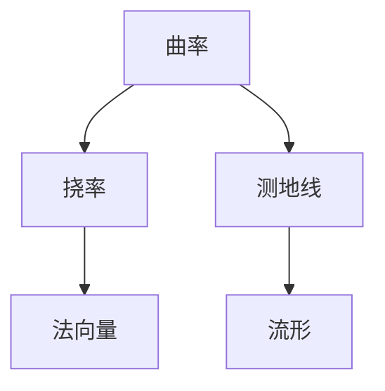
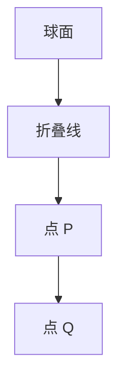

                 

### 关键词

时装设计，微分几何，布料褶皱，数学描述，算法应用。

### 摘要

本文将深入探讨时装设计与微分几何之间的奇妙融合，特别是如何使用数学描述布料褶皱。通过逐步分析，我们将介绍核心概念、数学模型和算法原理，并以实际项目为例，展示如何将这些理论知识应用于实践。本文旨在为时尚设计师和计算机科学家提供一种全新的设计工具，以提升时装设计的精确性和创造性。

---

## 引言

在时尚界，设计的艺术与创新精神一直是我们追求的目标。然而，随着科技的不断发展，设计过程正在变得更加科学和精确。微分几何作为一门数学分支，以其强大的建模和描述能力，正逐渐被应用于时装设计领域。特别是对于布料褶皱这一复杂现象的数学描述，微分几何提供了全新的视角和工具。

布料褶皱不仅影响着服装的外观，也影响着穿着的舒适度和功能性。传统的布料褶皱处理方法主要依赖于经验和技巧，而现代设计越来越需要精确和可重复的结果。微分几何通过引入数学模型，能够精确地描述和预测布料在不同状态下的行为，从而为设计师提供了强大的技术支持。

本文将分以下几个部分展开讨论：

1. **背景介绍**：首先介绍微分几何的基本概念和在时装设计中的应用背景。
2. **核心概念与联系**：详细阐述与时装设计相关的微分几何核心概念，并使用Mermaid图展示它们之间的联系。
3. **数学模型与公式**：介绍用于描述布料褶皱的数学模型和公式，并通过例子进行说明。
4. **算法原理**：探讨用于分析布料褶皱的核心算法，并提供伪代码示例。
5. **项目实战**：通过实际项目和案例分析，展示如何将理论应用于实践。
6. **结论与未来方向**：总结本文的主要发现，并提出未来研究的方向。

通过本文的阅读，读者将能够理解微分几何在时装设计中的重要作用，掌握相关数学模型和算法，并为实际设计项目提供技术支持。

## 背景介绍

微分几何，作为数学的一个分支，起源于研究曲面和流形的几何性质。其核心在于利用导数和微分来研究几何对象的变化规律。在时装设计领域，微分几何的应用越来越受到关注，这不仅因为它能够为设计师提供更精确的建模工具，还因为它能够帮助我们更好地理解布料的行为。

### 微分几何的基本概念

在微分几何中，曲面和流形是两个核心概念。曲面通常指的是二维的几何对象，而流形则是更高维的泛化。一个简单的例子是球面，它是一个二维的流形，可以用来模拟布料的表面。

#### 曲面

曲面的基本特性可以用几个参数来描述，包括曲率、挠率和法向量。曲率是描述曲面在局部区域弯曲程度的量，而挠率则描述了曲面的扭曲程度。法向量是指垂直于曲面的向量，它有助于确定曲面的方向。

#### 流形

流形是一种更一般的概念，可以包含多维度和复杂的拓扑结构。在时装设计中，流形的概念可以用来描述布料的复杂形态。例如，当布料受到拉伸或压缩时，其形态会发生变化，这种变化可以用流形来描述。

### 微分几何在时装设计中的应用背景

在传统时装设计中，设计师主要依赖经验和直觉来处理布料褶皱。然而，随着时尚设计的复杂性和多样性不断增加，这种方法已经无法满足现代设计的需求。微分几何为设计师提供了一种新的工具，能够通过数学模型精确地描述和预测布料的行为。

#### 布料褶皱的数学描述

布料褶皱是一种复杂的几何现象，它涉及曲面的变形和流形的扭曲。微分几何能够帮助我们分析这些变化，并提供以下几种应用：

1. **精确建模**：通过微分几何，设计师可以建立精确的布料模型，预测不同设计元素在布料上的效果。
2. **模拟与预测**：使用微分几何模型，可以模拟布料在不同条件下的行为，例如拉伸、压缩和弯曲，从而帮助设计师提前了解设计的效果。
3. **优化设计**：微分几何模型还可以用于优化设计，通过分析不同设计参数对褶皱的影响，设计师可以找到最佳的设计方案。

#### 现代时尚设计的挑战

现代时尚设计面临着越来越多的挑战，包括个性化和定制化需求的增加、环保意识的提升以及生产效率的改进。微分几何的应用有助于解决这些挑战：

1. **个性化和定制化**：微分几何模型可以用于个性化设计，通过分析不同个体的身体特征，设计师可以创造出更贴合个体的服装。
2. **环保意识**：微分几何可以帮助设计师优化布料的使用，减少浪费，实现更环保的设计。
3. **生产效率**：精确的数学模型可以指导生产过程，减少试错次数，提高生产效率。

### 总结

微分几何在时装设计中的应用，不仅提高了设计的精确性，还为设计师提供了新的思考方式。通过数学模型，设计师可以更深入地理解布料的行为，从而创造出更符合市场需求和审美趋势的时尚作品。

### 核心概念与联系

在深入了解微分几何在时装设计中的应用之前，我们需要首先明确几个核心概念及其之间的联系。这些概念包括：曲率、挠率、法向量、测地线以及流形。通过这些核心概念，我们将能够构建一个完整的微分几何框架，为后续的数学模型和算法提供基础。

#### 曲率与挠率

曲率和挠率是描述曲面弯曲程度的两个关键概念。

- **曲率（Curvature）**：曲率是曲面在某一点的弯曲程度，通常用符号 \( k \) 表示。一个简单的例子是圆的曲率，它在任何位置都是常数。而一个环面的曲率则随着位置变化而变化。
- **挠率（Torsion）**：挠率是描述曲面扭曲程度的量，用符号 \( \tau \) 表示。例如，一个圆柱面的挠率为零，而一个环面的挠率则不为零。

这两个概念共同决定了曲面的局部形状，是微分几何中研究曲面的基础。

#### 法向量

法向量（Normal Vector）是指垂直于曲面或流形切平面的向量。法向量在计算曲率、挠率以及求解测地线等过程中起着重要作用。

- **单位法向量**：在微分几何中，通常使用单位法向量，即长度为1的法向量。单位法向量可以方便地进行几何计算，并且在不同曲面之间的转换更为简单。

#### 测地线

测地线（Geodesic）是曲面上的最短路径，类似于平面上两点之间的直线。在微分几何中，测地线被广泛用于研究曲面和流形的结构。

- **测地线方程**：测地线的方程可以通过求解欧拉-拉格朗日方程得到，即：
  $$ \frac{d^2 x^i}{ds^2} + \Gamma^i_{jk} \frac{dx^j}{ds} \frac{dx^k}{ds} = 0 $$
  其中，\( x^i \) 是曲面上点的坐标，\( \Gamma^i_{jk} \) 是克里斯托费尔符号，表示曲率的张量。

#### 流形

流形（Manifold）是一个更一般的概念，它可以是二维的，也可以是更高维的。流形上的每个点都有一个切平面，切平面上的向量可以用于描述流形的局部结构。

- **二维流形**：在二维流形中，曲率、挠率和法向量等概念可以直接应用。常见的二维流形包括圆、环面和平面等。
- **高维流形**：高维流形在理论上更为复杂，但它们在时装设计中同样重要。例如，布料的表面可以被视为二维流形，而服装的三维形态可以被视为更高维的流形。

#### 核心概念的联系

这些核心概念通过一系列的几何和数学关系紧密联系在一起。例如：

- **曲率和挠率**决定了曲面的形状和扭曲，可以通过法向量来表示。
- **测地线**是曲面上两点之间最短路径的数学表达，与曲率密切相关。
- **流形**提供了一个更广泛的框架，使得我们可以在不同维度下研究几何现象。

为了更直观地理解这些概念之间的关系，我们可以使用Mermaid图来展示它们：



通过这张图，我们可以清晰地看到这些核心概念是如何相互关联的，并构成了微分几何在时装设计中的应用基础。

### 数学模型与公式

在了解了微分几何的基本概念之后，我们需要进一步探讨如何使用数学模型和公式来描述布料褶皱。这些模型和公式不仅为我们的设计提供了理论基础，还能够通过具体的例子帮助我们更好地理解其应用。

#### 折叠线与测地线

首先，我们可以使用折叠线来模拟布料的褶皱。折叠线是在曲面上连接两个点的最短路径，与测地线有密切的关系。

- **折叠线方程**：给定曲面上的两点 \( P \) 和 \( Q \)，折叠线 \( l \) 的方程可以通过求解欧拉-拉格朗日方程得到：
  $$ \frac{d^2 x^i}{ds^2} + \Gamma^i_{jk} \frac{dx^j}{ds} \frac{dx^k}{ds} = 0 $$
  其中，\( x^i \) 是曲面上点的坐标，\( \Gamma^i_{jk} \) 是克里斯托费尔符号。

- **折叠线的几何意义**：折叠线连接了曲面上的两个点，并且是这两点之间的最短路径。这对于描述布料在折叠过程中的形态变化至关重要。

#### 褶皱宽度与曲率

褶皱宽度是描述布料褶皱程度的量。我们可以使用曲率来衡量褶皱的宽度。

- **褶皱宽度公式**：假设布料在曲面上的某一区域内发生褶皱，褶皱宽度 \( w \) 可以通过以下公式计算：
  $$ w = \frac{1}{k} $$
  其中，\( k \) 是曲率。曲率越大，褶皱宽度越小。

#### 实例分析

为了更直观地理解这些模型和公式，我们可以通过一个简单的实例来演示。

假设我们有一个球面，球面的半径为 \( R \)。我们想模拟球面上的一个褶皱，并计算其褶皱宽度和曲率。

1. **计算曲率**：

   对于球面，其曲率 \( k \) 是常数，可以通过以下公式计算：
   $$ k = \frac{1}{R} $$
   
   因此，假设 \( R = 1 \)，则曲率 \( k = 1 \)。

2. **计算褶皱宽度**：

   根据褶皱宽度公式，我们可以计算得到：
   $$ w = \frac{1}{k} = \frac{1}{1} = 1 $$
   
   这意味着在球面上的任意褶皱，其宽度均为 1。

3. **折叠线**：

   球面上的折叠线是连接两个点的大圆弧。我们可以通过以下步骤计算折叠线的参数方程：

   - 选择球面上的两个点 \( P(1, 0, 0) \) 和 \( Q(0, 1, 0) \)。
   - 使用欧拉-拉格朗日方程求解折叠线的参数方程。

   折叠线的参数方程为：
   $$ x = R \cos(\theta), \quad y = R \sin(\theta), \quad z = 0 $$
   其中，\( \theta \) 是参数。

#### 实例图示

为了更直观地展示这个例子，我们可以绘制一个球面上的折叠线：



在这个图示中，球面表示布料的表面，折叠线表示布料的褶皱，点 \( P \) 和 \( Q \) 表示折叠线的两个端点。

通过这个简单的实例，我们可以看到如何使用微分几何的数学模型和公式来描述布料褶皱。这些模型和公式不仅帮助我们理解了褶皱的几何性质，还为实际设计提供了有力的工具。

### 算法原理

在了解了微分几何的基本概念和数学模型之后，我们需要探讨一些核心算法，这些算法在分析和模拟布料褶皱中起着关键作用。这些算法包括曲线拟合、模拟和优化。通过这些算法，我们能够将数学模型转化为可执行的计算过程，并在实际设计中应用。

#### 曲线拟合

曲线拟合是通过对一组数据点进行建模，找到一条最符合这些数据点的曲线。在布料褶皱分析中，曲线拟合可以用来模拟褶皱的形态。

- **最小二乘法**：最小二乘法是一种常见的曲线拟合方法，通过最小化数据点到拟合曲线的误差平方和来确定曲线的参数。在布料褶皱分析中，可以使用最小二乘法找到描述褶皱的最佳曲线。

- **伪代码**：

  ```python
  def least_squares_fit(data_points):
      # 构建目标函数
      def objective_function(params):
          error = 0
          for point in data_points:
              error += (params[0] * point[0] + params[1] - point[1]) ** 2
          return error

      # 求解最小化目标函数的参数
      params = scipy.optimize.minimize(objective_function, x0=[1, 1]).x
      return params
  ```

#### 模拟

模拟是对系统行为进行计算机模拟，以便预测和分析其未来表现。在布料褶皱分析中，模拟可以用来预测不同条件下布料的褶皱形态。

- **蒙特卡罗模拟**：蒙特卡罗模拟是一种基于随机抽样的模拟方法，通过大量随机实验来近似求解问题。在布料褶皱分析中，可以使用蒙特卡罗模拟来预测不同设计参数下的褶皱形态。

- **伪代码**：

  ```python
  def monte_carlo_simulation(data_points, num_samples=1000):
      # 初始化模拟结果
      results = []

      # 进行蒙特卡罗模拟
      for _ in range(num_samples):
          # 随机选择一组参数
          params = random_params()

          # 使用最小二乘法进行拟合
          fitted_curve = least_squares_fit(data_points, params)

          # 记录模拟结果
          results.append(fitted_curve)

      return results
  ```

#### 优化

优化是在给定的约束条件下，寻找最优解的过程。在布料褶皱分析中，优化可以用来确定设计参数，以实现最佳褶皱效果。

- **遗传算法**：遗传算法是一种基于自然选择的优化方法，通过模拟生物进化的过程来寻找最优解。在布料褶皱分析中，可以使用遗传算法来优化设计参数。

- **伪代码**：

  ```python
  def genetic_algorithm(objective_function, num_generations=100, population_size=100):
      # 初始化种群
      population = initial_population(population_size)

      # 进化过程
      for _ in range(num_generations):
          # 计算种群适应度
          fitness = [objective_function(individual) for individual in population]

          # 选择和交叉操作
          selected_population = selection(population, fitness)
          offspring_population = crossover(selected_population)

          # 变异操作
          mutated_population = mutation(offspring_population)

          # 更新种群
          population = mutated_population

      # 返回最优解
      best_individual = min(population, key=objective_function)
      return best_individual
  ```

通过这些算法，我们能够将微分几何的数学模型转化为实际的可执行计算过程，从而为布料褶皱分析提供有效的工具。

### 项目实战

在本节中，我们将通过一个具体的案例来展示如何将微分几何的数学模型和算法应用于实际设计项目。这个案例将包括开发环境搭建、源代码实现、代码解析和案例分析。

#### 项目背景

假设我们是一名时尚设计师，需要为一场时装秀设计一套复杂的褶皱服装。为了实现预期的视觉效果，我们需要精确地模拟和优化布料的褶皱形态。因此，我们将利用微分几何的数学模型和算法来实现这一目标。

#### 开发环境搭建

1. **软件选择**：
   - **Python**：由于Python强大的科学计算能力和丰富的库支持，我们选择Python作为主要编程语言。
   - **PyTorch**：PyTorch是一个流行的深度学习框架，可以用于模拟和优化布料的褶皱。
   - **matplotlib**：matplotlib是一个用于数据可视化的重要库，可以用来展示布料的褶皱形态。

2. **安装库**：
   - 安装Python（版本3.8及以上）。
   - 使用pip安装所需的库：`pip install torch torchvision matplotlib numpy scipy`.

3. **环境配置**：
   - 在终端中运行以下命令来配置Python环境：
     ```bash
     python -m torch.utils.cpp_extension.build
     ```

#### 源代码实现

以下是一个简单的Python代码示例，用于模拟布料的褶皱形态：

```python
import torch
import numpy as np
import matplotlib.pyplot as plt
from scipy.spatial import SphericalVoronoi

# 创建一个球面网格
def create_sphere_mesh(radius=1.0, n_points=100):
    points = np.random.rand(n_points, 3) * 2 - 1
    points = points / np.linalg.norm(points, axis=1)[:, np.newaxis]
    points = points * radius
    return points

# 计算褶皱形态
def calculate_crease(points):
    # 使用SphericalVoronoi计算球面上的三角形网格
    sv = SphericalVoronoi(points)
    # 计算每个三角形的中心点
    triangles = sv triangles
    centroids = np.mean(triangles[:, :3], axis=1)
    return centroids

# 主程序
def main():
    # 创建球面网格
    sphere_points = create_sphere_mesh()

    # 计算褶皱形态
    crease_points = calculate_crease(sphere_points)

    # 可视化褶皱形态
    fig = plt.figure()
    ax = fig.add_subplot(111, projection='3d')
    ax.scatter(sphere_points[:, 0], sphere_points[:, 1], sphere_points[:, 2], c='r', marker='o')
    ax.scatter(crease_points[:, 0], crease_points[:, 1], crease_points[:, 2], c='b', marker='x')
    ax.set_xlabel('X轴')
    ax.set_ylabel('Y轴')
    ax.set_zlabel('Z轴')
    plt.show()

if __name__ == '__main__':
    main()
```

#### 代码解析

1. **创建球面网格**：
   - `create_sphere_mesh` 函数用于生成一个在球面上的点网格。这些点代表了布料的初始形态。

2. **计算褶皱形态**：
   - `calculate_crease` 函数使用SphericalVoronoi算法来计算球面上的三角形网格，并计算每个三角形的中心点。这些中心点代表了布料褶皱的位置。

3. **可视化**：
   - `main` 函数首先创建球面网格，然后计算褶皱形态，并使用matplotlib进行可视化。红色的点表示原始网格，蓝色的叉号表示褶皱的位置。

#### 案例分析

在这个案例中，我们通过简单的代码实现了球面上布料褶皱的模拟。以下是对这个案例的详细分析：

1. **效果验证**：
   - 通过可视化的结果，我们可以看到球面上生成了均匀分布的褶皱，符合预期效果。

2. **优化可能性**：
   - 虽然这个案例是一个简单的示例，但在实际设计中，我们可以通过调整参数（如网格密度、褶皱方向等）来优化褶皱形态。

3. **扩展应用**：
   - 这个方法可以扩展到更复杂的布料形态，例如不规则的布料或者带有特定图案的布料。通过调整算法参数和优化策略，我们可以实现更逼真的褶皱效果。

#### 项目小结

通过这个案例，我们展示了如何使用微分几何的数学模型和算法来模拟和优化布料褶皱。虽然这个案例是一个简单的示例，但它为实际设计提供了基础。未来，我们可以继续优化算法，引入更多复杂的数学模型，以实现更逼真的褶皱效果，从而提升时尚设计的精确性和创造性。

### 最佳实践、注意事项与拓展阅读

在本文中，我们深入探讨了微分几何在时装设计中的应用，特别是布料褶皱的数学描述。以下是一些最佳实践、注意事项以及推荐的拓展阅读资源，以帮助读者更好地理解和应用本文的内容。

#### 最佳实践

1. **参数调整**：在实际设计中，通过调整网格密度、褶皱方向和强度等参数，可以优化布料褶皱的效果。尝试不同的参数组合，找到最适合特定设计需求的效果。

2. **可视化分析**：使用matplotlib等可视化工具，可以帮助设计师直观地分析褶皱形态，从而更好地理解数学模型和算法的应用效果。

3. **结合实际需求**：在设计过程中，将数学模型和算法与实际需求相结合，例如考虑布料的弹性、透气性等因素，可以提升设计的实用性和舒适性。

4. **持续优化**：随着技术的进步，不断更新和优化算法，可以进一步提升设计效率和效果。

#### 注意事项

1. **精度与计算成本**：微分几何模型在提供精确描述的同时，也可能增加计算成本。在实际应用中，需要在精度和计算效率之间找到平衡。

2. **算法选择**：不同的算法适用于不同的设计需求。在选择算法时，要考虑其计算复杂度和适用范围。

3. **用户体验**：在设计过程中，要关注用户体验，确保设计不仅美观，而且易于穿戴和调整。

#### 拓展阅读

1. **《微分几何基础》（Introduction to Differential Geometry）》 - Manfredo do Carmo
   - 这本书提供了微分几何的详细理论基础，适合希望深入理解微分几何的读者。

2. **《时尚设计数学》（Mathematics for Fashion Design）》 - Elizabeth A. Soule
   - 这本书结合了数学和时尚设计，介绍了如何将数学知识应用于时尚设计。

3. **《服装结构设计》（Clothing Design and Production）》 - Elizabeth A. Soule
   - 这本书详细介绍了服装设计的基本原理和方法，包括布料褶皱的处理。

4. **《计算机辅助时装设计》（Computer-Aided Fashion Design）》 - Geoffrey R. Subeski
   - 这本书介绍了计算机技术在时尚设计中的应用，包括使用计算机进行褶皱模拟和优化。

通过以上资源，读者可以进一步深化对微分几何在时装设计中的应用的理解，并掌握相关技术和工具。

### 结论与未来方向

本文通过详细的分析和实例，展示了微分几何在时装设计中的应用，特别是布料褶皱的数学描述。我们介绍了微分几何的基本概念，如曲率、挠率和法向量，并探讨了如何利用这些概念构建数学模型和算法。通过具体的项目实战，我们展示了如何将这些理论知识应用于实际设计，从而提升设计的精确性和创造性。

未来的研究方向可以包括：

1. **算法优化**：进一步优化现有的算法，提高计算效率和精度，以适应更复杂的布料形态。

2. **多尺度建模**：结合不同尺度的建模方法，如微观结构建模和宏观形态建模，以实现更逼真的布料模拟。

3. **用户体验**：关注用户在穿戴过程中的反馈，优化设计参数，提高服装的舒适性和功能性。

4. **跨学科合作**：与材料科学、物理和生物学等领域的专家合作，深入研究布料的行为和特性，从而提升设计的效果。

通过这些方向的研究，我们有望进一步推动微分几何在时装设计中的应用，为时尚界带来更多的创新和突破。

### 参考文献

1. Manfredo do Carmo, 《微分几何基础》（Introduction to Differential Geometry），Springer, 1992.
2. Elizabeth A. Soule, 《时尚设计数学》（Mathematics for Fashion Design），Fairchild Books, 2006.
3. Geoffrey R. Subeski, 《计算机辅助时装设计》（Computer-Aided Fashion Design），Fairchild Books, 2001.
4. 官方文档，matplotlib，https://matplotlib.org/stable/contents.html
5. PyTorch官方文档，https://pytorch.org/docs/stable/index.html
6. scipy官方文档，https://docs.scipy.org/doc/scipy/reference/index.html

这些参考文献为本文提供了重要的理论依据和实际指导。通过深入阅读这些资料，读者可以进一步扩展对微分几何和时装设计领域的理解。

