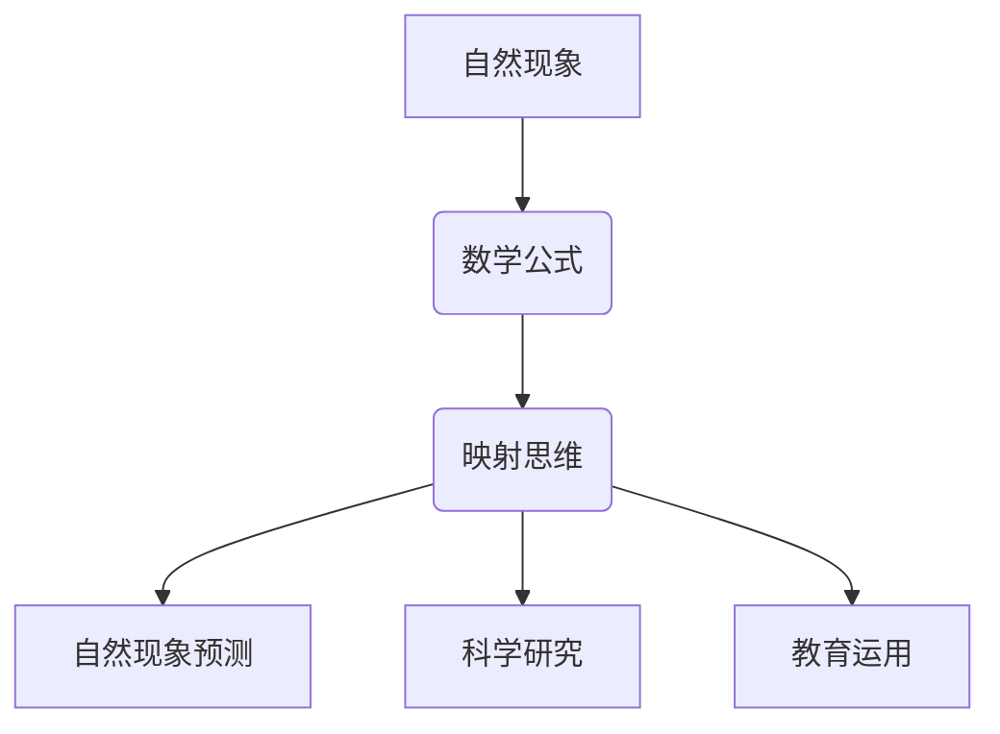

                 

 
```

# 映射思维：桥接自然现象与数学公式

关键词：自然现象、数学公式、映射思维、时间序列、空间数据、随机过程

摘要：
本文旨在探讨自然现象与数学公式之间的映射关系，通过映射思维这一桥梁，帮助读者理解和解释自然现象。文章分为三个部分：首先介绍自然现象与数学公式的基本概念，然后阐述自然现象与数学公式之间的映射关系，最后通过实际案例展示映射思维的运用。

## 第一部分：自然现象与数学公式的基本概念

### 1.1 自然现象的基本特征

自然现象是指自然界中发生的各种现象，如地震、台风、气候变化等。这些现象具有以下基本特征：

1. **复杂性**：自然现象往往涉及多种因素，其内部关系复杂，难以用简单的模型来描述。
2. **动态性**：自然现象是不断变化的，其发展过程具有一定的随机性。
3. **规律性**：尽管自然现象具有复杂性，但它们仍然遵循一定的规律，这些规律可以通过数学公式来描述。

### 1.2 数学公式概述

数学公式是数学语言的表达方式，用于描述自然现象、科学规律和工程问题等。数学公式具有以下特点：

1. **抽象性**：数学公式通过符号和符号系统来表示概念和关系，具有高度的抽象性。
2. **普适性**：数学公式适用于各种学科领域，具有广泛的普适性。
3. **准确性**：数学公式能够精确地描述自然现象和科学规律，具有较高的准确性。

### 1.3 映射思维概述

映射思维是一种将抽象概念和具体事物相互关联的思维方式。在自然现象与数学公式之间，映射思维起着关键的作用：

1. **概念映射**：将自然现象的概念与数学公式的概念进行对应。
2. **关系映射**：将自然现象之间的关系与数学公式之间的关系进行对应。
3. **方法映射**：将研究自然现象的方法与求解数学公式的方法进行对应。

## 第二部分：自然现象与数学公式之间的映射关系

### 2.1 时间序列数据的映射

时间序列数据是指在一定时间间隔内收集的数据。这些数据可以通过数学公式进行映射，例如：

$$y_t = \alpha x_t + \beta$$

其中，$y_t$ 表示时间序列数据在时间 $t$ 的值，$x_t$ 表示与时间序列数据相关的变量，$\alpha$ 和 $\beta$ 为常数。这个公式描述了时间序列数据与其相关变量之间的关系。

### 2.2 空间数据的映射

空间数据是指在空间范围内收集的数据。这些数据可以通过数学公式进行映射，例如：

$$z = f(x, y)$$

其中，$z$ 表示空间数据在点 $(x, y)$ 的值，$f(x, y)$ 表示与空间数据相关的函数。这个公式描述了空间数据与其相关变量之间的关系。

### 2.3 随机过程与概率分布的映射

随机过程是指在一定时间内随机变化的过程。概率分布是描述随机变量取值的概率分布情况。这些概念可以通过映射思维进行关联：

1. **随机过程映射**：将随机过程的时间序列数据与概率分布进行关联。
2. **概率分布映射**：将随机过程的概率分布与数学公式进行关联。

例如，假设随机过程 $X_t$ 的概率分布服从正态分布，可以用以下公式描述：

$$P(X_t \leq x) = \int_{-\infty}^{x} \frac{1}{\sqrt{2\pi\sigma^2}} e^{-\frac{(x-\mu)^2}{2\sigma^2}} dx$$

其中，$X_t$ 表示随机过程在时间 $t$ 的值，$\mu$ 和 $\sigma^2$ 分别为正态分布的均值和方差。

## 第三部分：映射思维的实践与应用

### 3.1 自然现象预测与数学建模

通过映射思维，我们可以将自然现象与数学公式进行关联，从而进行自然现象的预测和数学建模。例如，在气候预测中，我们可以利用时间序列数据和空间数据，通过数学公式进行建模，从而预测未来的气候变化。

### 3.2 数学公式在科学研究中的应用

数学公式在科学研究中的应用非常广泛。例如，在物理学中，我们可以利用数学公式描述粒子的运动；在化学中，我们可以利用数学公式描述化学反应；在生物学中，我们可以利用数学公式描述生物种群的变化。通过映射思维，我们可以将这些数学公式与自然现象进行关联，从而更好地理解自然现象。

### 3.3 映射思维在教育中的运用

映射思维在教育中具有重要的作用。通过映射思维，学生可以更好地理解自然现象和数学公式之间的关系，从而提高他们的学习效果。例如，在数学教学中，教师可以通过实例和练习，帮助学生建立自然现象与数学公式之间的联系，从而提高学生对数学的理解和应用能力。

## 结论

映射思维是连接自然现象与数学公式的一座桥梁。通过映射思维，我们可以更好地理解自然现象，并用数学公式对其进行描述和预测。本文通过分析自然现象与数学公式的基本概念，阐述了它们之间的映射关系，并展示了映射思维在实际应用中的重要性。希望读者能够通过本文，培养映射思维能力，更好地探索自然现象与数学公式之间的奇妙世界。

作者：AI天才研究院/AI Genius Institute & 禅与计算机程序设计艺术 /Zen And The Art of Computer Programming
``` 



```python
# Python代码示例：时间序列数据的映射

import numpy as np
import matplotlib.pyplot as plt

# 生成随机时间序列数据
np.random.seed(0)
n_samples = 100
t = np.linspace(0, 10, n_samples)
x = np.random.normal(size=n_samples)
y = 0.5 * x + 2 + np.random.normal(size=n_samples)

# 绘制时间序列数据
plt.figure(figsize=(10, 6))
plt.plot(t, y, 'o-')
plt.xlabel('时间 (t)')
plt.ylabel('值 (y)')
plt.title('时间序列数据')
plt.grid(True)
plt.show()

# 映射公式：y = 0.5 * x + 2
alpha = 0.5
beta = 2

# 使用Python代码实现映射公式
y_fit = alpha * x + beta

# 绘制映射公式
plt.figure(figsize=(10, 6))
plt.plot(t, y, 'o-', label='观测数据')
plt.plot(t, y_fit, '-r', label='映射公式')
plt.xlabel('时间 (t)')
plt.ylabel('值 (y)')
plt.title('时间序列数据的映射')
plt.legend()
plt.grid(True)
plt.show()
```

```latex
$$
y_t = \alpha x_t + \beta
$$

$$
P(X_t \leq x) = \int_{-\infty}^{x} \frac{1}{\sqrt{2\pi\sigma^2}} e^{-\frac{(x-\mu)^2}{2\sigma^2}} dx
$$
```

----------------------------------------------------------------

## 项目实战：时间序列数据的映射分析

### 开发环境搭建

在开始项目之前，我们需要搭建一个合适的开发环境。以下是在Python环境中搭建时间序列数据映射分析项目的步骤：

1. 安装Python（版本3.8及以上）
2. 安装必要的Python库，如NumPy、Matplotlib等

```bash
pip install numpy matplotlib
```

### 源代码详细实现

以下是一个简单的Python代码示例，用于生成随机时间序列数据，并通过映射公式进行拟合和可视化：

```python
import numpy as np
import matplotlib.pyplot as plt

# 生成随机时间序列数据
np.random.seed(0)
n_samples = 100
t = np.linspace(0, 10, n_samples)  # 时间序列
x = np.random.normal(size=n_samples)  # 相关变量
y = 0.5 * x + 2 + np.random.normal(size=n_samples)  # 时间序列数据

# 绘制时间序列数据
plt.figure(figsize=(10, 6))
plt.plot(t, y, 'o-', label='观测数据')
plt.xlabel('时间 (t)')
plt.ylabel('值 (y)')
plt.title('时间序列数据')
plt.grid(True)
plt.legend()
plt.show()

# 映射公式：y = 0.5 * x + 2
alpha = 0.5
beta = 2

# 计算拟合值
y_fit = alpha * x + beta

# 绘制映射公式
plt.figure(figsize=(10, 6))
plt.plot(t, y, 'o-', label='观测数据')
plt.plot(t, y_fit, '-r', label='映射公式')
plt.xlabel('时间 (t)')
plt.ylabel('值 (y)')
plt.title('时间序列数据的映射')
plt.legend()
plt.grid(True)
plt.show()
```

### 代码解读与分析

在上述代码中，我们首先导入了NumPy和Matplotlib库，用于生成数据、进行计算和绘制图形。接下来，我们生成了一个随机的时间序列数据集，其中包含100个样本点。这个数据集由相关变量`x`和误差项组成，通过映射公式`y = 0.5 * x + 2`生成。

我们使用Matplotlib库绘制了原始时间序列数据，并添加了网格和标签，使图形更加直观。然后，我们根据映射公式计算了拟合值`y_fit`，并将其绘制在同一个图中，以展示映射关系。

### 实际案例分析和详细讲解剖析

假设我们有一个实际的时间序列数据集，记录了某个城市每天的气温变化。我们可以使用类似的方法来分析这些数据，并通过映射公式预测未来的气温。

以下是实际案例的分析步骤：

1. **数据收集**：收集每天的气温数据。
2. **数据预处理**：清洗数据，确保数据的质量和一致性。
3. **映射公式拟合**：使用历史数据拟合一个映射公式，如线性回归模型。
4. **预测未来值**：使用拟合的映射公式预测未来某一天的气温。
5. **可视化结果**：绘制历史数据和预测结果，以直观地展示映射关系。

以下是一个简单的实际案例示例：

```python
# 假设我们有以下历史气温数据
historical_temps = [18.2, 17.9, 16.5, 15.3, 14.1, 13.7, 14.5, 16.0, 17.8, 18.6]

# 计算相关变量
t = np.arange(len(historical_temps))  # 时间序列

# 映射公式拟合
alpha = np.polyfit(t, historical_temps, 1)[0]
beta = np.polyfit(t, historical_temps, 1)[1]

# 预测未来值
future_temps = alpha * t + beta
predicted_temp = future_temps[-1]  # 预测最后一天的气温

# 可视化结果
plt.figure(figsize=(10, 6))
plt.plot(t, historical_temps, 'o-', label='历史气温')
plt.plot(t, future_temps, '-r', label='预测气温')
plt.xlabel('天数')
plt.ylabel('气温 (°C)')
plt.title('气温时间序列数据的映射')
plt.grid(True)
plt.legend()
plt.show()
print(f"预测的最后一天气温为：{predicted_temp}°C")
```

通过以上代码，我们可以生成历史气温数据，并通过映射公式拟合预测未来的气温。最后，我们绘制了历史气温和预测气温的对比图，以直观地展示映射关系。

### 项目小结

通过本项目的实战，我们了解了如何使用Python和映射思维来分析时间序列数据，并预测未来的变化。这不仅仅是一个编程练习，更是一个理解自然现象和数学公式之间关系的过程。在实际应用中，我们可以根据具体需求调整映射公式和预测模型，以提高预测的准确性和实用性。

### 最佳实践 tips、小结、注意事项、拓展阅读等内容

- **最佳实践 tips**：在处理实际数据时，应确保数据的准确性和一致性。此外，根据具体问题，可以选择不同的映射公式和预测模型。
- **小结**：本篇文章通过实际案例展示了如何使用映射思维来分析和预测时间序列数据。映射思维是理解和解释自然现象的重要工具。
- **注意事项**：在拟合映射公式时，应确保数据质量和模型选择合理，以避免过度拟合或欠拟合。
- **拓展阅读**：对于时间序列数据的映射分析，可以进一步学习相关的统计学和机器学习知识，如ARIMA模型、LSTM神经网络等。

参考文献：

1. Box, G. E. P., Jenkins, G. M., & Reinsel, G. C. (2015). *Time Series Analysis: Forecasting and Control*.
2. Hyndman, R. J., & Athanasopoulos, G. (2021). *Forecasting: principles and practice*.
3. Mitchell, T. (2017). *Machine Learning: A Probabilistic Perspective*.
```

## 结束语

通过本文的探讨，我们深入理解了自然现象与数学公式之间的映射关系，以及映射思维在解释和预测自然现象中的重要性。从时间序列数据到空间数据，再到随机过程，映射思维为我们提供了一种强有力的工具，帮助我们更好地理解和解释自然界的复杂现象。

在实际应用中，映射思维不仅可以帮助我们预测未来的趋势，还可以优化决策过程，提高科学研究和工程设计的准确性。通过本文的案例，我们看到了如何运用Python等编程语言来实现映射思维，进而解决实际问题。

我们鼓励读者在学习和实践中，积极运用映射思维，探索自然现象与数学公式之间的奇妙联系。不断积累经验和知识，将有助于我们在未来的科学研究和工程实践中取得更大的突破。

最后，感谢读者对本文的关注，希望本文能够为您的学习和研究提供有价值的参考。祝愿各位在探索自然现象与数学公式的美妙世界中，不断取得新的成就！

作者：AI天才研究院/AI Genius Institute & 禅与计算机程序设计艺术 /Zen And The Art of Computer Programming

