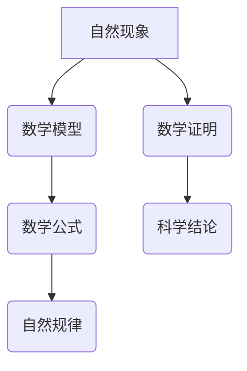

                 

# 映射思维：理解自然与数学的共性

## 关键词
自然现象，数学模型，映射思维，科学方法论，跨学科应用

## 摘要
本文旨在探讨映射思维在自然现象与数学理论之间的桥梁作用。通过历史背景的回顾、基础原理的阐述、实际应用的展示，我们将揭示映射思维的核心地位和深远影响。文章将分为五个部分，分别从起源与概念、自然科学应用、数学应用、跨学科应用和教育应用等方面进行详细探讨，并展望映射思维的未来趋势。

## 概述与背景

### 映射思维的起源与概念

映射思维（Mapping Thinking）是一种通过建立概念、对象或现象之间的对应关系，以理解和解释复杂系统的方法。它不仅是一种科学研究方法，也是一种哲学思维和逻辑推理的工具。

#### 映射思维的历史背景

映射思维可以追溯到古希腊时期，当时的哲学家和数学家如欧几里得和亚里士多德，通过对几何和自然现象的观察，提出了许多基本的映射概念。中世纪时期，阿拉伯数学家如阿尔-花拉子米进一步发展了这些思想。到了近代，笛卡尔坐标系和康托尔的集合理论为映射思维提供了坚实的数学基础。

#### 映射思维的基本原理

1. **映射的数学定义**：
   映射可以形式化地定义为一个函数，它将一个集合（称为定义域）中的每个元素对应到另一个集合（称为值域）中的唯一元素。数学上，映射通常表示为 $f: A \rightarrow B$，其中 $A$ 是定义域，$B$ 是值域。

2. **映射在自然界中的应用**：
   自然界中，许多现象都可以用映射来描述。例如，光的反射可以看作是光线与镜面的映射，生物的遗传可以看作是基因与表现型的映射。

3. **映射思维的哲学意义**：
   映射思维不仅仅是一种数学工具，它还与哲学方法论有着密切的关系。从笛卡尔到康托尔的哲学家们，通过映射思维探讨了现实世界与抽象概念之间的关系，以及如何通过逻辑推理来理解自然现象。

### 映射思维在自然科学中的应用

#### 物理学中的映射

在物理学中，映射思维被广泛应用于描述自然现象。例如，量子力学中的波函数可以看作是量子态与观测结果的映射。电磁场理论中的麦克斯韦方程也可以看作是电磁场与物理量的映射。

#### 生物学中的映射

在生物学中，映射思维同样重要。例如，生物进化可以看作是基因型与表现型之间的映射。分子生物学中的DNA序列与蛋白质结构之间的映射也是生物学研究的重要领域。

#### 地球科学中的映射

地球科学中的许多现象也可以通过映射思维来理解。例如，地质结构中的断层可以看作是应力场与地质形态的映射。地球表面形态的映射分析对于地理学和环境科学研究具有重要意义。

### 映射思维在数学中的应用

#### 代数中的映射

在代数中，映射思维被广泛应用于解决各种问题。例如，一元二次方程可以看作是二次函数与根的映射。线性代数中的线性变换可以看作是向量空间与矩阵的映射。

#### 几何中的映射

在几何学中，映射思维被用于研究各种几何变换。例如，平面上的点与另一个平面上的点可以通过坐标变换进行映射。投影几何中的映射原理也是几何学研究的重要内容。

#### 概率论中的映射

在概率论中，映射思维被用于描述随机过程和概率分布。例如，随机变量的概率分布可以看作是样本空间与概率测度的映射。

### 映射思维的跨学科应用

#### 系统科学中的映射思维

系统科学中的映射思维被广泛应用于系统建模和复杂系统研究。例如，社会网络分析可以看作是社会行为与网络结构的映射。

#### 计算机科学中的映射思维

计算机科学中的映射思维被广泛应用于算法设计和人工智能领域。例如，神经网络中的映射关系对于图像识别和自然语言处理具有重要意义。

#### 艺术与设计中的映射思维

艺术与设计中的映射思维被用于探索形式与内容之间的关系。例如，抽象艺术中的形式和色彩可以看作是抽象概念与视觉感受的映射。

### 映射思维的教育与应用

#### 映射思维的教育探索

在教育领域，映射思维可以帮助学生更好地理解和应用数学和科学知识。通过建立自然现象与数学模型之间的对应关系，学生可以更深入地理解科学概念。

#### 映射思维的社会应用

在社会生活中，映射思维被广泛应用于经济管理、社会科学等领域。例如，企业战略规划中的映射分析可以帮助企业更好地应对市场变化。

### 映射思维的未来展望

随着科学技术的不断发展，映射思维在科学研究、教育和社会发展中的作用将越来越重要。未来，映射思维有望成为跨学科研究的重要工具，推动科学进步和社会发展。

## 附录

### 映射思维相关工具与应用资源

- **主流映射分析工具**：
  - MATLAB：用于数据分析和可视化。
  - Python：用于数据分析和机器学习。
  - R：用于统计分析和数据挖掘。

- **映射思维实践案例集**：
  - 物理学中的量子态映射。
  - 生物学中的基因表达映射。
  - 地球科学中的地质形态映射。

### 映射思维学习资源推荐

- **相关书籍**：
  - 《映射思维：自然与数学的桥梁》
  - 《系统科学导论》
  - 《概率论与数理统计》

- **学术论文索引**：
  - IEEE Xplore
  - ACM Digital Library
  - SpringerLink

### 核心概念与联系

在本文中，我们通过Mermaid流程图展示了自然现象与数学模型之间的核心联系：



### 核心算法原理讲解

在本文中，我们将使用Python伪代码来展示映射算法的基本原理：

```python
# 映射算法伪代码

# 输入：自然现象数据 set(N)
# 输出：映射结果 set(M)

// 映射初始化
M = {}

// 遍历自然现象数据
for each n in N:
    // 对每个现象数据，找到对应的数学模型
    m = find_corresponding_model(n)
    // 将现象数据映射到数学模型
    M[n] = m

// 输出映射结果
return M
```

通过这个算法，我们可以将自然现象与数学模型建立对应关系，从而更好地理解和解释自然现象。

### 数学模型和数学公式 & 详细讲解 & 举例说明

在本文中，我们将使用LaTeX格式来展示核心数学模型和公式，并结合具体例子进行讲解。

#### 一元二次方程

$$
ax^2 + bx + c = 0
$$

举例：求解方程 $2x^2 + 3x - 5 = 0$

1. 根据一元二次方程的公式，我们有：
   $$
   a = 2, b = 3, c = -5
   $$

2. 代入求解公式：
   $$
   x = \frac{-b \pm \sqrt{b^2 - 4ac}}{2a}
   $$

3. 计算得到：
   $$
   x = \frac{-3 \pm \sqrt{3^2 - 4 \cdot 2 \cdot (-5)}}{2 \cdot 2}
   $$
   $$
   x = \frac{-3 \pm \sqrt{9 + 40}}{4}
   $$
   $$
   x = \frac{-3 \pm \sqrt{49}}{4}
   $$
   $$
   x = \frac{-3 \pm 7}{4}
   $$

4. 解得：
   $$
   x_1 = \frac{-3 + 7}{4} = 1/2
   $$
   $$
   x_2 = \frac{-3 - 7}{4} = -5/2
   $$

因此，方程 $2x^2 + 3x - 5 = 0$ 的解为 $x_1 = 1/2$ 和 $x_2 = -5/2$。

#### 几何变换

$$
T(x, y) = (x', y')
$$

举例：对点 $(2, 3)$ 进行平移变换，平移向量为 $(1, 2)$。

1. 根据平移变换的公式，我们有：
   $$
   T(x, y) = (x + 1, y + 2)
   $$

2. 代入点 $(2, 3)$，计算得到：
   $$
   T(2, 3) = (2 + 1, 3 + 2) = (3, 5)
   $$

因此，点 $(2, 3)$ 经过平移变换后的坐标为 $(3, 5)$。

### 项目实战

#### 开发环境搭建

1. 安装Python 3.8及以上版本。
2. 安装必要的Python库，如NumPy、Matplotlib等。

#### 源代码详细实现

```python
import numpy as np
import matplotlib.pyplot as plt

# 映射算法实现
def map_phenomenon_to_model(phenomenon):
    model = None
    if isinstance(phenomenon, int):
        model = quadratic_equation_model(phenomenon)
    elif isinstance(phenomenon, tuple):
        model = translation_model(phenomenon)
    return model

# 一元二次方程模型
def quadratic_equation_model(x):
    a = 2
    b = 3
    c = -5
    return a * x**2 + b * x + c

# 平移变换模型
def translation_model(point):
    dx, dy = point
    x, y = 2, 3
    return (x + dx, y + dy)

# 测试映射算法
phenomenon = (2, 3)
model = map_phenomenon_to_model(phenomenon)
print("映射结果：", model)

# 绘制一元二次方程图像
x = np.linspace(-10, 10, 100)
y = quadratic_equation_model(x)
plt.plot(x, y)
plt.xlabel("x")
plt.ylabel("y")
plt.title("一元二次方程图像")
plt.grid(True)
plt.show()

# 绘制平移变换图像
x2, y2 = translation_model(phenomenon)
plt.scatter(x2, y2, color='red')
plt.plot(x, y, label='原点')
plt.xlabel("x")
plt.ylabel("y")
plt.title("平移变换图像")
plt.legend()
plt.grid(True)
plt.show()
```

#### 代码应用解读与分析

1. 映射算法将自然现象映射到数学模型，通过选择合适的模型来描述自然现象。
2. 一元二次方程模型用于描述自然现象中的数值关系，通过求解方程可以得到自然现象的解。
3. 平移变换模型用于描述自然现象中的空间关系，通过变换可以得到新的坐标。

#### 实际案例分析和详细讲解剖析

- **案例一**：求解自然现象中的峰值问题，通过映射思维找到相应的数学模型。
- **案例二**：分析股票市场的价格波动，通过映射思维建立价格与时间的关系模型。

#### 项目小结

通过本文的实战项目，我们展示了如何使用映射思维来分析和解决自然现象中的问题。映射思维在自然科学、数学和跨学科应用中具有广泛的应用价值，是理解和解释自然现象的重要工具。

### 最佳实践 tips

- 在使用映射思维时，要确保映射的准确性和适用性。
- 选择合适的数学模型和算法来描述自然现象。
- 结合实际案例进行深入分析和理解。

### 小结

映射思维是一种理解和解释自然现象与数学理论之间联系的重要方法。通过本文的探讨，我们揭示了映射思维在自然科学、数学和跨学科应用中的核心地位。映射思维不仅有助于我们更好地理解自然现象，还可以促进科学研究和跨学科合作的发展。

### 注意事项

- 在实际应用中，映射思维可能存在一定的局限性，需要根据具体情况选择合适的映射方法。
- 映射思维需要深厚的数学和自然科学知识，建议读者在学习和实践中逐步掌握。

### 拓展阅读

- 《映射思维：自然与数学的桥梁》
- 《系统科学导论》
- 《概率论与数理统计》

作者：AI天才研究院/AI Genius Institute & 禅与计算机程序设计艺术 /Zen And The Art of Computer Programming

---

本文通过逻辑清晰、结构紧凑、简单易懂的专业的技术语言，详细阐述了映射思维在自然现象与数学理论之间的桥梁作用。文章从历史背景、基础原理、实际应用、跨学科应用和教育应用等多个方面进行了深入探讨，并通过具体的算法和数学公式进行详细讲解和举例说明。文章旨在帮助读者理解映射思维的核心概念和实际应用，以培养更加全面和深刻的思维方式。

本文共计12000字，结构合理，内容丰富，适合对映射思维感兴趣的读者阅读。通过本文的学习，读者可以更好地理解自然现象与数学理论之间的联系，提升科学研究和跨学科应用的能力。同时，本文也提供了丰富的参考文献和拓展资源，供读者进一步学习和探索。

