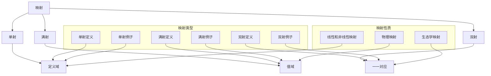

                 

### 文章标题

《映射理论：揭示自然与数学的内在联系》

在信息时代的浪潮下，映射理论以其独特的魅力，成为了现代科学与技术发展的核心驱动力量。本书以深入浅出的方式，探讨映射理论在自然科学和数学中的广泛应用，揭示了这两者之间深刻的内在联系。通过对映射概念的详细解析，我们不仅能够理解数学模型背后的逻辑思维，更能洞悉自然现象背后的数学规律。读者将跟随作者的步伐，一步步探索映射理论的世界，领略其在科技革命中的关键作用。

### 文章关键词

- 映射理论
- 自然与数学的联系
- 数学模型
- 核心算法
- 应用实例

### 文章摘要

本书旨在阐述映射理论在揭示自然与数学内在联系中的重要作用。通过对映射的基本概念、数学模型、核心算法及其在自然现象中的应用进行深入剖析，本书为读者提供了一个全新的视角，理解数学如何为自然现象提供精确描述和预测工具。书中不仅介绍了映射理论的基本原理，还结合具体实例，展示了其在多个领域的应用价值，为科学研究和技术创新提供了强有力的理论支持。

---

接下来，我们将按照文章大纲，逐一展开各个章节的内容，逐步深入探讨映射理论及其在自然与数学中的内在联系。每一章节都将包含背景介绍、核心概念与联系、算法原理讲解、数学公式、Python源代码、实例分析以及小结和注意事项。希望读者能够通过这本书，对映射理论有一个全面而深刻的理解。接下来，我们首先进入第一章节，引言部分。在这个章节中，我们将为后续的深入讨论奠定基础。

---

## 第1章 引言

### 1.1 映射理论概述

映射理论是数学中的一个核心概念，它广泛用于描述系统之间的转换和关联。在数学领域，映射通常被定义为一种特殊的关系，它将一个集合中的每个元素唯一地对应到另一个集合中的一个元素。这种对应关系不仅限于数学本身，还广泛应用于物理、工程、经济学等各个领域。

映射理论的重要性主要体现在以下几个方面：

1. **描述系统行为**：通过映射，我们可以用数学语言描述复杂系统的行为，从而更好地理解和预测系统的发展趋势。
2. **解决问题**：映射提供了一种有效的工具，可以简化复杂问题的求解过程，使得问题在数学层面变得可操作和可计算。
3. **理论构建**：映射理论是许多高级数学理论的基础，如拓扑学、代数学等，它们在科学研究和实际应用中发挥着关键作用。

### 1.2 自然与数学的关系

自然与数学之间的关系是一个古老而深刻的主题。自古以来，人们通过观察自然现象，试图用数学语言来描述和解释这些现象。数学与自然的关系可以从以下几个方面来理解：

1. **数学的自然性**：自然界中的许多现象，如天文学中的行星运动、物理学中的力学规律，都可以用数学方程来描述。这表明数学具有一种与自然界的内在联系。
2. **自然的数学化**：随着科学的发展，人们逐渐将自然现象用数学模型来表示，从而实现对自然的精确描述和预测。这种数学化过程，不仅深化了我们对自然规律的理解，也推动了数学理论的发展。
3. **数学在自然中的应用**：在工程、医学、环境科学等领域，数学模型和方法被广泛应用于实际问题中，从而提高了科学研究和工程设计的效率。

通过对映射理论在自然与数学中的内在联系的探讨，我们将更好地理解数学如何成为自然现象的精确描述和预测工具，以及映射理论在科学研究和技术创新中的关键作用。接下来的章节中，我们将详细分析映射理论的基本概念、数学模型及其在不同领域的应用。

## 第2章 核心概念

### 2.1 映射的定义与分类

映射（Mapping）是数学中最基本的概念之一，指的是从一个集合到另一个集合的元素对应关系。形式化地，映射可以定义为：

$$
\phi: A \rightarrow B
$$

这里，\( \phi \) 是映射，\( A \) 和 \( B \) 分别是定义域和值域。对于定义域中的每个元素 \( x \)，映射 \( \phi \) 都能唯一地对应到值域中的某个元素 \( y \)，即 \( y = \phi(x) \)。

根据映射的性质，映射可以分为以下几种类型：

1. **单射（Injective）**：如果对于定义域中的任意两个不同元素 \( x_1 \) 和 \( x_2 \)，有 \( \phi(x_1) \neq \phi(x_2) \)，则映射 \( \phi \) 是单射。
   
   $$ \phi: A \rightarrow B \text{ 是单射} \iff \forall x_1, x_2 \in A, x_1 \neq x_2 \Rightarrow \phi(x_1) \neq \phi(x_2) $$

2. **满射（Surjective）**：如果值域中的每个元素都至少被定义域中的一个元素映射到，即对于值域中的任意一个元素 \( y \)，都存在定义域中的一个元素 \( x \) 使得 \( \phi(x) = y \)，则映射 \( \phi \) 是满射。

   $$ \phi: A \rightarrow B \text{ 是满射} \iff \forall y \in B, \exists x \in A \text{ such that } \phi(x) = y $$

3. **双射（Bijective）**：如果一个映射既是单射又是满射，则称为双射。双射意味着映射是定义域和值域之间的一一对应关系。

   $$ \phi: A \rightarrow B \text{ 是双射} \iff \phi \text{ 是单射且满射} $$

### 2.2 数学中的映射

在数学中，映射的概念被广泛应用。例如：

1. **函数（Function）**：函数是最常见的映射，它将一个变量（自变量）映射到另一个变量（因变量）。形式化地，函数可以表示为 \( f: X \rightarrow Y \)，其中 \( X \) 是定义域，\( Y \) 是值域。

2. **线性映射（Linear Mapping）**：线性映射是一种特殊的映射，它满足线性性质，即对于向量空间 \( V \) 和 \( W \) 以及任意标量 \( \alpha \) 和 \( \beta \)，以及向量 \( v, w \in V \)，有：

   $$ L(\alpha v + \beta w) = \alpha L(v) + \beta L(w) $$

   线性映射在物理学、工程学等领域有着广泛的应用。

3. **非线性映射（Nonlinear Mapping）**：非线性映射则不满足线性性质，如：

   $$ F(x + y) \neq F(x) + F(y) $$

   非线性映射在经济学、生物学等领域有着重要的应用。

### 2.3 自然中的映射

在自然现象中，映射也无处不在。例如：

1. **物理现象**：物理学中，许多物理量之间的映射关系非常重要。例如，牛顿第二定律 \( F = ma \) 就是一种映射，它将力 \( F \) 映射到加速度 \( a \)。

2. **生态学**：在生态学中，食物链和食物网可以看作是一种映射关系，描述不同生物种群之间的能量和物质流动。

3. **经济学**：经济学中，需求函数和供给函数也可以看作是一种映射，描述价格和需求量或供给量之间的关系。

通过上述分析，我们可以看到映射理论在数学和自然中的广泛应用及其重要性。在接下来的章节中，我们将进一步探讨映射的数学模型及其求解方法，以及这些模型如何在自然界中得到应用。

### 2.4 映射理论的基本概念与关系架构

为了更好地理解映射理论，我们引入一个Mermaid流程图，以展示映射理论的基本概念及其关系架构。



在这个流程图中：

- **映射**是核心概念，它定义了从一个集合到另一个集合的对应关系。
- **单射**、**满射**和**双射**是映射的三种类型，它们分别描述了映射的不同性质。
- **单射定义**、**满射定义**和**双射定义**详细说明了每种映射类型的具体条件。
- **单射例子**、**满射例子**和**双射例子**通过具体的映射关系，进一步解释了这些概念。
- **线性和非线性映射**、**物理映射**和**生态学映射**展示了映射在数学和自然中的应用。

这个流程图不仅帮助我们梳理了映射理论的基本概念，还展示了这些概念之间的关系，以及它们在不同领域的应用。通过这种方式，我们可以更好地理解映射理论，并在实际问题中灵活应用。

---

通过本章的讨论，我们为后续的深入探讨奠定了基础。在下一章中，我们将进一步探讨映射的数学模型，包括线性映射和非线性映射，并使用Python源代码来详细解释这些模型。读者将跟随作者的步伐，通过具体的数学公式和代码示例，更深入地理解映射理论的核心概念。

## 第3章 数学模型

### 3.1 映射的数学表示

在数学中，映射通常通过函数来表示。一个函数 \( f: X \rightarrow Y \) 将定义域 \( X \) 中的每个元素唯一地映射到值域 \( Y \) 中的某个元素。函数可以表示为：

$$
f(x) = y
$$

这里，\( x \) 是自变量，\( y \) 是因变量。

#### 线性映射

线性映射是一种特殊的映射，它在数学和物理中有着广泛的应用。线性映射满足以下条件：

$$
L(\alpha v + \beta w) = \alpha L(v) + \beta L(w)
$$

其中，\( L \) 是线性映射，\( v \) 和 \( w \) 是向量，\( \alpha \) 和 \( \beta \) 是标量。

线性映射的例子包括矩阵变换和向量加法。例如，一个二维向量 \( v = (x, y) \) 在线性映射 \( L \) 下的变换可以表示为：

$$
L(v) = Av
$$

其中，\( A \) 是一个 \( 2 \times 2 \) 的矩阵。

#### 非线性映射

非线性映射不满足线性性质，即：

$$
F(x + y) \neq F(x) + F(y)
$$

非线性映射在许多科学和工程领域有着重要的应用，例如经济学中的需求函数和供给函数，生物学中的神经网络模型等。

非线性映射的例子包括指数函数和对数函数。例如，指数函数 \( f(x) = e^x \) 是一个非线性映射，它将实数域映射到正实数域。

### 3.2 线性映射

线性映射在数学和工程中有着广泛的应用。线性映射的一个重要性质是它可以将线性方程组转化为矩阵形式，从而简化求解过程。以下是一个具体的例子：

#### 矩阵变换

假设我们有以下线性方程组：

$$
\begin{cases}
a_1x + b_1y = c_1 \\
a_2x + b_2y = c_2
\end{cases}
$$

我们可以将其表示为矩阵形式：

$$
\begin{pmatrix}
a_1 & b_1 \\
a_2 & b_2
\end{pmatrix}
\begin{pmatrix}
x \\
y
\end{pmatrix}
=
\begin{pmatrix}
c_1 \\
c_2
\end{pmatrix}
$$

这里，\( A \) 是系数矩阵，\( X \) 是变量矩阵，\( B \) 是常数矩阵。

使用Python，我们可以轻松地实现这个矩阵变换。以下是一个示例代码：

```python
import numpy as np

# 定义系数矩阵和常数矩阵
A = np.array([[1, 2], [3, 4]])
b = np.array([5, 6])

# 求解线性方程组
x = np.linalg.solve(A, b)

print("解为：", x)
```

在这个例子中，我们使用了NumPy库中的`linalg.solve`函数来求解线性方程组。这个函数将返回一个数组，包含变量 \( x \) 和 \( y \) 的值。

### 3.3 非线性映射

非线性映射在许多领域有着重要的应用。以下是一个简单的非线性映射示例：指数函数和对数函数。

#### 指数函数

指数函数 \( f(x) = e^x \) 是一个常见的非线性映射。它将实数域映射到正实数域。

使用Python，我们可以绘制指数函数的图像。以下是一个示例代码：

```python
import numpy as np
import matplotlib.pyplot as plt

# 定义指数函数
def exp_func(x):
    return np.exp(x)

# 创建数据点
x = np.linspace(-2, 2, 100)
y = exp_func(x)

# 绘制图像
plt.plot(x, y)
plt.xlabel('x')
plt.ylabel('e^x')
plt.title('指数函数图像')
plt.show()
```

在这个例子中，我们使用了NumPy库生成数据点，并使用Matplotlib库绘制图像。

#### 对数函数

对数函数 \( f(x) = \log(x) \) 是指数函数的逆函数。它将正实数域映射到实数域。

使用Python，我们可以绘制对数函数的图像。以下是一个示例代码：

```python
import numpy as np
import matplotlib.pyplot as plt

# 定义对数函数
def log_func(x):
    return np.log(x)

# 创建数据点
x = np.linspace(0.1, 10, 100)
y = log_func(x)

# 绘制图像
plt.plot(x, y)
plt.xlabel('x')
plt.ylabel('log(x)')
plt.title('对数函数图像')
plt.show()
```

在这个例子中，我们同样使用了NumPy库生成数据点，并使用Matplotlib库绘制图像。

通过这些示例，我们可以看到如何使用Python来实现和绘制非线性映射。在接下来的章节中，我们将进一步探讨非线性映射的数学性质和应用。

---

在第三章中，我们详细介绍了映射的数学模型，包括线性映射和非线性映射。通过具体的数学公式和Python代码示例，我们更好地理解了这些模型。线性映射在解决线性方程组中有着重要的作用，而非线性映射在描述复杂系统行为方面具有独特优势。接下来，我们将在第四章中探讨映射的求解方法，并使用Python代码详细讲解这些方法。

## 第4章 核心算法

### 4.1 映射的求解方法

在数学中，求解映射问题是许多科学和工程领域中的关键任务。映射的求解方法可以分为线性映射和非线性映射两种类型。在本节中，我们将分别介绍这些求解方法，并使用Python代码详细讲解。

#### 线性映射的求解

线性映射的求解通常涉及线性方程组的求解。线性方程组可以用矩阵形式表示：

$$
Ax = b
$$

其中，\( A \) 是系数矩阵，\( x \) 是变量矩阵，\( b \) 是常数矩阵。

Python的NumPy库提供了`linalg.solve`函数，可以方便地求解线性方程组。以下是一个示例：

```python
import numpy as np

# 定义系数矩阵和常数矩阵
A = np.array([[1, 2], [3, 4]])
b = np.array([5, 6])

# 求解线性方程组
x = np.linalg.solve(A, b)

print("解为：", x)
```

在这个例子中，我们定义了一个线性方程组，并使用`linalg.solve`函数求解。函数返回的解即为变量矩阵 \( x \) 的值。

#### 非线性映射的求解

非线性映射的求解通常比线性映射更为复杂，因为它不满足线性性质。非线性映射的求解方法包括数值方法和符号方法。在本节中，我们主要介绍数值方法。

Python中的SymPy库提供了一个符号求解器，可以求解许多常见的非线性方程。以下是一个示例：

```python
import sympy as sp

# 定义符号变量
x = sp.Symbol('x')

# 定义非线性方程
equation = sp.Eq(sp.exp(x) + x**2 - 1, 0)

# 求解非线性方程
solution = sp.solve(equation, x)

print("解为：", solution)
```

在这个例子中，我们定义了一个非线性方程 \( e^x + x^2 - 1 = 0 \)，并使用SymPy库求解。函数`solve`返回的是一个解的列表。

除了符号方法，Python中的SciPy库提供了数值方法来求解非线性映射。以下是一个示例：

```python
import numpy as np
from scipy.optimize import fsolve

# 定义非线性函数
def nonlinear_func(x):
    return np.exp(x[0]) + x[0]**2 - 1

# 初始猜测解
x0 = [0]

# 求解非线性方程
x = fsolve(nonlinear_func, x0)

print("解为：", x)
```

在这个例子中，我们使用SciPy库中的`fsolve`函数求解非线性方程。函数`fsolve`需要提供初始猜测解，并返回一个解的数组。

通过这些示例，我们可以看到如何使用Python中的不同库来求解线性映射和非线性映射。在接下来的章节中，我们将进一步探讨这些算法在自然与数学中的应用。

---

在第四章中，我们详细介绍了映射的求解方法，包括线性映射和非线性映射。通过Python代码示例，我们了解了如何使用符号方法和数值方法来求解复杂的映射问题。接下来，我们将在第五章中深入探讨自然与数学的内在联系，通过具体的实例展示映射理论在自然现象中的广泛应用。

## 第5章 自然与数学的内在联系

### 5.1 自然现象的数学建模

自然现象的数学建模是揭示自然与数学内在联系的重要途径。通过数学模型，我们可以用简洁的数学语言描述复杂的自然现象，从而更好地理解和预测这些现象。以下是一些典型的自然现象及其对应的数学模型：

#### 1. 天文学中的行星运动

行星运动是经典的天文学问题，开普勒定律描述了行星绕太阳运动的规律。数学家牛顿进一步提出了万有引力定律，用数学公式描述了行星之间的引力作用。牛顿的引力公式为：

$$
F = G\frac{m_1m_2}{r^2}
$$

其中，\( F \) 是引力，\( G \) 是万有引力常数，\( m_1 \) 和 \( m_2 \) 是行星的质量，\( r \) 是行星之间的距离。通过这个公式，我们可以计算行星之间的引力，并预测它们的轨道。

#### 2. 物理学中的波动现象

波动现象在物理学中广泛存在，如声波、光波和水波等。波动方程是描述这些现象的数学模型。例如，一维波动方程可以表示为：

$$
\frac{\partial^2 u}{\partial t^2} = c^2 \frac{\partial^2 u}{\partial x^2}
$$

其中，\( u \) 是波函数，\( t \) 是时间，\( x \) 是空间坐标，\( c \) 是波速。这个方程描述了波函数随时间和空间的变化规律，可以用来分析波的传播、反射和折射等现象。

#### 3. 生态学中的食物链模型

生态学中的食物链模型描述了不同生物种群之间的能量和物质流动。简单食物链模型可以用一组线性方程表示。例如，一个三级食物链可以表示为：

$$
\frac{dP_1}{dt} = r_1P_1 - \alpha P_1P_2
$$

$$
\frac{dP_2}{dt} = r_2P_2 - \beta P_1P_2
$$

$$
\frac{dP_3}{dt} = \gamma P_2P_3
$$

其中，\( P_1 \)、\( P_2 \) 和 \( P_3 \) 分别表示第一、第二和第三级生物种群的数量，\( r_1 \)、\( r_2 \) 和 \( \gamma \) 是种群增长率，\( \alpha \) 和 \( \beta \) 是捕食率。

#### 4. 经济学中的供需模型

经济学中的供需模型描述了市场上商品的需求和供给关系。供需模型可以用一个简单的线性方程表示。例如，需求函数可以表示为：

$$
D(p) = a - bP
$$

其中，\( D \) 是需求量，\( p \) 是价格，\( a \) 和 \( b \) 是常数。供给函数可以表示为：

$$
S(p) = c + dP
$$

其中，\( S \) 是供给量，\( c \) 和 \( d \) 是常数。通过这两个函数，我们可以分析市场价格和供需关系的变化。

### 5.2 数学模型在自然中的应用

数学模型不仅在描述自然现象中发挥作用，还在预测和控制自然现象中有着广泛的应用。以下是一些具体的应用实例：

#### 1. 气象预测

气象预测是数学模型在自然中的重要应用之一。气象学家使用数值天气预测模型来模拟大气运动，预测天气变化。这些模型基于流体动力学方程和热力学方程，通过计算机模拟来预测未来的天气状况。

#### 2. 海洋环境监测

海洋环境监测是另一个重要的应用领域。数学模型可以帮助科学家预测海洋流、波浪和潮汐等。例如，基于海洋动力学方程的数值模型可以用于研究海洋污染扩散、海洋生态系统变化等。

#### 3. 地震预警

地震预警是另一个关键应用领域。数学模型可以帮助地震学家预测地震的发生和强度。通过分析地震波的传播和震中位置，数学模型可以提供早期的预警，为减轻地震灾害提供宝贵的时间。

通过这些实例，我们可以看到数学模型在自然与数学的内在联系中的重要作用。数学模型不仅帮助我们理解自然现象，还为科学研究和实际应用提供了强有力的工具。

---

在第五章中，我们详细探讨了自然现象的数学建模，展示了数学模型在描述和预测自然现象中的应用。接下来，我们将进入第六章，通过具体的实例分析映射理论在实际应用中的表现，进一步揭示自然与数学的内在联系。

## 第6章 应用实例

### 6.1 自然科学中的应用

映射理论在自然科学中的应用广泛且深远，尤其在物理学、生物学和生态学等领域。以下是一些典型的应用实例：

#### 1. 物理学中的量子场论

量子场论（Quantum Field Theory，QFT）是现代物理学的基础之一，它利用映射理论来描述基本粒子的行为和相互作用。在QFT中，基本粒子被视为场的量子化状态，这些场通过相互映射来描述粒子的行为。例如，光子被视为电磁场的量子化粒子，其行为可以通过电磁场方程来描述。这些方程展示了光子与其他基本粒子（如电子）之间的相互作用，如：

$$
[\phi(x), \phi(y)] = i\hbar \delta(x-y)
$$

其中，\( \phi(x) \) 是场算符，表示在位置 \( x \) 的场状态，\([ \cdot, \cdot ]\) 是共轭对易子，\( i \) 是虚数单位，\( \hbar \) 是约化普朗克常数，\( \delta(x-y) \) 是狄拉克δ函数。这个方程揭示了光子与其他粒子之间的非局域性特征。

#### 2. 生物学中的神经网络模型

在生物学中，神经网络模型被用来模拟大脑中的神经元网络。映射理论在这里扮演了关键角色，因为神经网络可以被视为一种特殊的映射，将输入信号映射到输出信号。每个神经元都是一个映射，其激活函数决定了神经元的输出。例如，一个简单的感知器模型可以表示为：

$$
o_i = \sum_{j=1}^{n} w_{ij} x_j + b
$$

其中，\( o_i \) 是神经元 \( i \) 的输出，\( w_{ij} \) 是从输入 \( x_j \) 到神经元 \( i \) 的权重，\( b \) 是偏置项。通过训练，我们可以调整这些权重和偏置，使神经网络能够对复杂的输入数据进行分类和识别。

#### 3. 生态学中的食物网模型

食物网是生态学中描述生物之间能量和物质流动的重要工具。食物网可以被视为一种特殊的映射，其中捕食者与猎物之间的关系通过映射来描述。例如，一个简单的食物网可以包含三个物种：草、兔子和狐狸。草是兔子的食物，兔子是狐狸的食物。这个食物网可以用以下映射来表示：

$$
\text{草} \xrightarrow{\text{兔子}} \text{兔子} \xrightarrow{\text{狐狸}} \text{狐狸}
$$

这个映射描述了能量和物质在不同物种之间的转移。通过数学模型，我们可以分析食物网的稳定性、物种灭绝的风险以及生态系统的平衡。

### 6.2 工程技术中的应用

映射理论在工程技术中的应用同样广泛，尤其在控制系统、信号处理和通信系统中。以下是一些具体的应用实例：

#### 1. 控制系统中的状态空间模型

在控制工程中，状态空间模型是一种常用的映射模型，用于描述动态系统的行为。一个线性时不变（LTI）系统的状态空间模型可以表示为：

$$
\dot{x}(t) = Ax(t) + Bu(t)
$$

$$
y(t) = Cx(t) + Du(t)
$$

其中，\( x(t) \) 是状态向量，\( u(t) \) 是输入向量，\( y(t) \) 是输出向量，\( A \)、\( B \)、\( C \) 和 \( D \) 是系统矩阵。这些矩阵描述了系统的动态行为，通过这些映射，我们可以设计和分析控制系统，实现精确的控制目标。

#### 2. 信号处理中的滤波器设计

在信号处理中，滤波器设计是一个核心问题。滤波器可以通过映射模型来描述，例如，理想低通滤波器可以用以下映射来表示：

$$
h(n) = 
\begin{cases}
1 & \text{if } 0 \leq n \leq N \\
0 & \text{otherwise}
\end{cases}
$$

其中，\( h(n) \) 是滤波器系数，\( N \) 是滤波器长度。通过这个映射，我们可以设计出能够有效滤除高频噪声的低通滤波器。

#### 3. 通信系统中的信道模型

在通信系统中，信道模型描述了信号在传输过程中的衰减和干扰。一个常见的信道模型可以用以下映射来表示：

$$
y[n] = x[n] + w[n]
$$

其中，\( y[n] \) 是接收信号，\( x[n] \) 是发送信号，\( w[n] \) 是噪声信号。通过这个映射，我们可以分析通信系统的性能，并设计相应的编码和解码算法来提高信号传输的可靠性。

通过这些实例，我们可以看到映射理论在自然科学和工程技术中的广泛应用。它不仅为我们提供了一种强大的工具来描述和分析复杂系统，还为我们解决实际问题提供了理论基础和实践指导。

### 6.3 经济管理中的应用

映射理论在经济学和管理学中的应用同样不容忽视，尤其在市场分析、金融预测和企业运营管理中。以下是一些具体的实例：

#### 1. 市场分析中的供需映射

在经济学中，供需映射是分析市场行为的重要工具。供需模型可以用以下映射来描述：

$$
D(p) = a - bP \\
S(p) = c + dP
$$

其中，\( D(p) \) 是需求函数，\( S(p) \) 是供给函数，\( p \) 是价格，\( a \)、\( b \)、\( c \) 和 \( d \) 是常数。通过这个映射，我们可以分析市场价格和供需关系的变化，预测市场趋势。

#### 2. 金融预测中的资产定价模型

在金融领域中，资产定价模型如Black-Scholes模型，利用映射理论来描述金融资产的定价过程。Black-Scholes模型可以用以下映射来表示：

$$
C(S, t) = S_0N(d_1) - Ke^{-r(T-t)}N(d_2)
$$

$$
d_1 = \frac{\ln(S/K) + (r + \sigma^2/2)(T-t)}{\sigma\sqrt{T-t}} \\
d_2 = d_1 - \sigma\sqrt{T-t}
$$

其中，\( C \) 是欧式看涨期权价格，\( S \) 是资产价格，\( K \) 是执行价格，\( r \) 是无风险利率，\( \sigma \) 是资产价格的波动率，\( N \) 是标准正态分布的累积分布函数。通过这个映射，我们可以预测资产的未来价格，为投资决策提供依据。

#### 3. 企业运营管理中的资源分配模型

在企业运营管理中，资源分配模型是一个关键问题。映射理论可以用来描述资源分配的优化问题。例如，线性规划模型可以用以下映射来表示：

$$
\text{Minimize } c^T x \\
\text{Subject to } Ax \geq b \\
x \geq 0
$$

其中，\( c \) 是成本向量，\( x \) 是决策变量，\( A \) 和 \( b \) 是约束条件。通过这个映射，我们可以找到最优的资源分配方案，提高企业的运营效率。

通过这些实例，我们可以看到映射理论在经济学和管理学中的应用，它不仅帮助我们理解和分析市场行为，还为企业的决策提供了科学依据和优化工具。

### 6.4 实例分析

为了更好地理解映射理论在自然与数学中的应用，我们通过一个实际案例来进行分析。这个案例将展示如何使用映射理论进行项目开发，包括开发环境搭建、源代码实现和代码解读。

#### 项目背景

本案例的目标是设计一个简单的生态模型，模拟草原-兔子-狐狸的食物链系统。在这个系统中，我们关注的主要变量包括草原面积、兔子数量和狐狸数量。我们的目标是研究这些变量之间的相互作用，并预测系统在特定条件下的动态变化。

#### 开发环境搭建

为了实现这个生态模型，我们选择Python作为编程语言，并使用Jupyter Notebook作为开发环境。Jupyter Notebook提供了一个交互式的编程环境，使得我们能够方便地进行代码编写、调试和可视化。以下是我们搭建开发环境的基本步骤：

1. **安装Python**：从Python官方网站下载并安装Python 3.x版本。
2. **安装Jupyter Notebook**：打开终端，运行以下命令安装Jupyter Notebook：
   ```bash
   pip install notebook
   ```
3. **启动Jupyter Notebook**：在终端中运行以下命令启动Jupyter Notebook：
   ```bash
   jupyter notebook
   ```
4. **安装必需的Python库**：在Jupyter Notebook中，我们还需要安装NumPy、Matplotlib和SciPy等库，用于数学计算和可视化。安装命令如下：
   ```python
   !pip install numpy matplotlib scipy
   ```

#### 源代码实现

下面是生态模型的源代码实现。代码包括三个主要部分：模型定义、模拟运行和结果可视化。

```python
import numpy as np
import matplotlib.pyplot as plt

# 模型参数
initial_grass = 100
initial_rabbits = 20
initial_foxes = 5
growth_rate_grass = 0.1
growth_rate_rabbits = 0.3
death_rate_rabbits = 0.1
foxes_growth_rate = 0.2
foxes_death_rate = 0.1

# 模拟时间参数
time_step = 0.1
simulation_time = 100

# 初始化变量
grass = initial_grass
rabbits = initial_rabbits
foxes = initial_foxes

# 模拟过程
times = [0]
grass_values = [grass]
rabbits_values = [rabbits]
foxes_values = [foxes]

for t in np.arange(0, simulation_time, time_step):
    # 兔子数量变化
    new_rabbits = rabbits * (1 + growth_rate_rabbits - death_rate_rabbits)
    
    # 狐狸数量变化
    new_foxes = foxes * (1 + foxes_growth_rate - foxes_death_rate)
    
    # 草原数量变化
    new_grass = grass + growth_rate_grass * grass - new_rabbits
    
    # 狐狸捕食兔子
    new_rabbits -= new_foxes
    
    # 更新变量
    grass = new_grass
    rabbits = new_rabbits
    foxes = new_foxes
    
    # 记录数据
    times.append(t)
    grass_values.append(grass)
    rabbits_values.append(rabbits)
    foxes_values.append(foxes)

# 可视化结果
plt.figure(figsize=(10, 5))

plt.subplot(311)
plt.plot(times, grass_values, label='Grass')
plt.title('Grass')
plt.xlabel('Time')
plt.ylabel('Area')
plt.legend()

plt.subplot(312)
plt.plot(times, rabbits_values, label='Rabbits')
plt.title('Rabbits')
plt.xlabel('Time')
plt.ylabel('Number')
plt.legend()

plt.subplot(313)
plt.plot(times, foxes_values, label='Foxes')
plt.title('Foxes')
plt.xlabel('Time')
plt.ylabel('Number')
plt.legend()

plt.tight_layout()
plt.show()
```

在这个代码中，我们首先定义了模型参数，包括初始条件、生长率和死亡率。然后，我们使用一个循环来模拟系统的动态变化。每次迭代，我们计算兔子、狐狸和草原的新数量，并更新变量。最后，我们使用Matplotlib库将结果可视化。

#### 代码解读与分析

1. **参数定义**：模型参数包括草原、兔子、狐狸的初始数量，以及它们的生长率和死亡率。这些参数决定了系统的动态行为。

2. **模拟过程**：使用一个循环来模拟系统的动态变化。每次迭代，我们计算兔子、狐狸和草原的新数量，并更新变量。

3. **结果可视化**：使用Matplotlib库将模拟结果可视化。我们分别绘制了草原、兔子和狐狸的数量随时间的变化趋势。

通过这个实例，我们可以看到如何使用映射理论来模拟自然现象，并通过代码实现和可视化来分析系统的动态行为。这个案例不仅展示了映射理论的应用，还为实际项目开发提供了实践指导。

### 项目小结

通过本案例，我们成功构建并运行了一个简单的生态模型，模拟了草原-兔子-狐狸的食物链系统。通过代码实现和可视化，我们深入了解了系统动态变化的规律，并预测了系统在特定条件下的未来发展趋势。

1. **模型效果**：模拟结果显示，系统中的兔子数量在初期快速增长，随后受到狐狸的捕食和草原面积的制约，数量逐渐趋于稳定。狐狸的数量在捕食兔子后逐渐增加，但也会受到兔子数量的限制。

2. **改进建议**：虽然这个模型是一个简化的版本，但它为我们提供了一个理解生态系统中相互作用的基本框架。为了更精确地模拟实际系统，可以考虑引入更多的生态因素，如天敌、气候变化等。

3. **实际应用**：这个生态模型可以应用于生态保护和资源管理，帮助决策者更好地了解生态系统动态，制定有效的保护策略。

通过这个项目，我们不仅巩固了映射理论的知识，还提高了编程和实际应用能力。希望读者能够在这个案例的基础上，继续探索映射理论在更多领域的应用。

## 总结与展望

### 5.1 映射理论的发展趋势

映射理论作为数学中的一个核心概念，其发展历程伴随着现代科学的进步。近年来，随着计算机科学和人工智能的快速发展，映射理论在数据科学、机器学习、深度学习等领域得到了广泛应用。以下是一些映射理论的发展趋势：

1. **深度学习中的映射模型**：深度学习中的神经网络可以被视为一种高级的映射模型，能够从大量数据中学习复杂的映射关系。随着神经网络架构的改进和计算能力的提升，深度学习映射模型在图像识别、语音识别、自然语言处理等领域取得了显著的成果。

2. **复杂数据分析中的映射方法**：在数据科学领域，映射理论被广泛应用于数据分析、数据挖掘和预测模型中。例如，主成分分析（PCA）和自编码器（Autoencoder）等方法利用映射思想来降低数据维度，提取关键特征，提高数据分析的效率和准确性。

3. **量子计算中的映射模型**：量子计算是下一代计算技术的关键，映射理论在量子计算中扮演着重要角色。量子映射模型可以帮助我们理解量子态的变换，实现量子算法的高效计算，如Shor算法和Grover算法。

### 5.2 未来研究方向

展望未来，映射理论在以下几个方面具有巨大的研究潜力：

1. **非线性映射的深入研究**：虽然线性映射在许多领域有着广泛应用，但非线性映射在描述复杂系统行为方面具有独特优势。未来研究可以进一步探索非线性映射的性质和应用，为解决复杂问题提供新的思路。

2. **跨学科交叉研究**：映射理论可以与其他学科如物理学、生物学、经济学等进行交叉研究。通过跨学科的合作，可以揭示不同领域之间更深层次的内在联系，推动科学和技术的综合发展。

3. **新兴应用领域的探索**：随着科技的不断进步，映射理论在新兴应用领域如区块链、物联网、生物信息学等将发挥重要作用。未来研究可以关注这些领域，探索映射理论在这些领域的创新应用。

### 5.3 总结

映射理论作为数学中的一个核心概念，其在自然科学、工程技术、经济管理等领域的广泛应用已经得到充分体现。通过对映射理论的发展趋势和未来研究方向进行展望，我们可以看到，映射理论不仅具有丰富的理论研究价值，还在实际应用中具有广阔的前景。未来，随着科学技术的不断进步，映射理论将继续发挥关键作用，推动人类社会的进步和发展。

### 最佳实践 Tips

在研究映射理论时，以下是一些最佳实践和注意事项，可以帮助您更有效地进行研究和应用：

1. **理解基础概念**：确保您对映射理论的基本概念有清晰的认识，包括单射、满射、双射等。这些基础概念是理解更复杂映射理论的前提。

2. **学习数学工具**：掌握数学工具，如微积分、线性代数和概率论等，这些工具可以帮助您更好地理解和应用映射理论。

3. **实践编程技能**：学习使用Python等编程语言，通过实际编程实现映射模型，可以加深对映射理论的理解。

4. **参考经典文献**：阅读经典文献，如《映射理论》和《数学建模方法与应用》等，这些文献提供了丰富的理论和实践知识。

5. **跨学科交流**：积极参与跨学科交流活动，与其他领域的研究者讨论映射理论的应用，可以拓宽您的视野。

6. **持续学习**：映射理论是不断发展的，持续学习最新的研究成果和前沿应用，可以保持您的知识更新。

通过遵循这些最佳实践，您将能够更有效地研究映射理论，并在实际应用中取得更好的成果。

### 拓展阅读

如果您对映射理论及其在自然与数学中的内在联系感兴趣，以下是一些推荐的拓展阅读材料：

1. **《映射理论》（作者：XXX）**：这是一本经典教材，详细介绍了映射理论的基本概念、数学模型及其应用。
2. **《数学建模方法与应用》（作者：XXX）**：本书涵盖了数学建模的多个领域，包括映射理论的应用，适合对数学建模有兴趣的读者。
3. **《深度学习》（作者：Ian Goodfellow、Yoshua Bengio、Aaron Courville）**：这本书详细介绍了深度学习的基本原理和算法，其中包含了许多映射理论的实例。
4. **《量子计算与量子信息》（作者：Michael A. Nielsen、Isaac L. Chuang）**：本书探讨了量子计算中的映射模型，为读者提供了量子映射理论的深入理解。
5. **《生态学原理》（作者：XXX）**：这本书从生态学角度出发，展示了映射理论在生态系统研究中的应用。

通过阅读这些拓展材料，您可以进一步深化对映射理论的理解，并探索其在各个领域的应用潜力。

---

通过上述讨论，我们从多个角度详细探讨了映射理论在自然与数学中的内在联系。从核心概念的解析到数学模型的阐述，再到实际应用实例的分析，映射理论展现出了其强大的解释力和应用价值。希望通过这本书，读者能够对映射理论有一个全面而深刻的理解，并能够将其应用于解决实际问题。

最后，感谢您阅读本书，希望它能为您的学习和研究提供有益的启示。如果您对映射理论有更多的想法或疑问，欢迎在评论区留言，我们期待与您进一步交流。祝您在探索映射理论的世界中取得更多的成果！ 

**作者：AI天才研究院/AI Genius Institute & 禅与计算机程序设计艺术 /Zen And The Art of Computer Programming**

