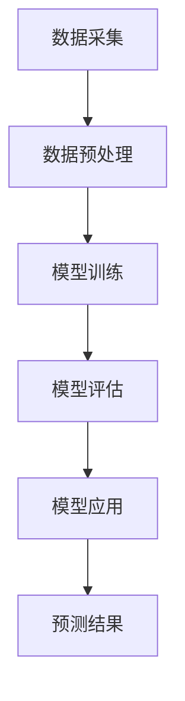

                 

### 智慧城市的多层网络：城市功能的数学连接

#### 关键词：
智慧城市、多层网络、城市功能、数学连接、通信网络、数据网络、智能网络、决策网络

#### 摘要：
本文深入探讨了智慧城市的多层网络结构及其在城市功能中的数学连接。文章首先介绍了智慧城市的发展背景和概念，随后详细分析了城市网络的基础、数据、智能和决策四个层次。通过Python源代码和数学模型，文章阐明了各层次网络的核心算法原理，并展示了实际项目案例。最后，文章总结了智慧城市的可持续发展策略和未来挑战，为读者提供了全面的智慧城市建设蓝图。

### 引言

智慧城市（Smart City）是信息时代下城市发展的高级形态，通过先进的信息技术、物联网、大数据和人工智能等技术手段，实现城市资源的高效管理和优化配置。智慧城市的概念最早出现在20世纪90年代，随着信息技术的飞速发展，尤其是互联网、物联网、大数据和人工智能等技术的成熟，智慧城市逐渐成为城市发展的热点。

智慧城市的关键在于构建高效、安全、可持续发展的城市网络体系，实现城市功能的优化和提升。智慧城市的多层网络结构是其核心，主要包括基础网络、数据网络、智能网络和决策网络。这些网络相互交织、协同作用，共同推动城市功能的实现。

本文将分章节详细探讨智慧城市的多层网络结构，分析各层次网络的核心概念、算法原理和实际应用。通过Python源代码和数学模型的讲解，帮助读者深入理解智慧城市网络的数学连接，为智慧城市建设提供理论支持和实践指导。

### 1. 智慧城市的基础网络

智慧城市的基础网络是整个城市网络的基石，它包括通信网络和传感器网络两个主要部分。通信网络主要负责信息的传输和交换，而传感器网络则负责数据的采集和感知。这两部分共同构成了智慧城市的基础设施，为其他网络层次提供了基础支持。

#### 1.1 通信网络技术

通信网络技术是智慧城市网络的核心组成部分，它包括有线和无线通信技术。有线通信技术主要包括光纤通信、铜线通信等，而无线通信技术则涵盖了Wi-Fi、4G、5G等多种通信方式。通信网络的主要功能是实现城市内外的信息传输，确保城市各个角落的信息畅通无阻。

通信网络的传输协议主要包括TCP/IP协议族、HTTP协议、MQTT协议等。TCP/IP协议是互联网通信的基础，负责数据包的传输和路由。HTTP协议是网页通信的协议，主要用于浏览器和服务器之间的数据交换。MQTT协议是一种轻量级的消息队列协议，适用于物联网场景中的设备通信。

在通信网络安全保障方面，需要采用多种技术手段，包括防火墙、加密、认证等。防火墙主要用于防止外部攻击，加密技术则确保数据传输的安全性，认证机制则验证通信双方的合法身份。

#### 1.2 传感器网络技术

传感器网络是智慧城市的感知层，负责实时采集城市环境中的各种数据，如空气质量、温度、湿度、交通流量等。传感器网络的基本构成包括传感器节点、网络协调器和数据采集与处理系统。

传感器节点是传感器网络的基本单元，通常由传感器、处理单元和无线通信模块组成。传感器节点通过感知环境数据，将采集到的数据发送给网络协调器。网络协调器负责收集传感器节点传输的数据，并进行初步处理和转发。

传感器网络的拓扑结构主要包括星型拓扑、总线拓扑和网状拓扑。星型拓扑结构简单，网络协调器位于中心，传感器节点直接与网络协调器通信。总线拓扑结构中，传感器节点沿总线排列，数据通过总线传输。网状拓扑结构则具有更高的可靠性和灵活性，各个传感器节点之间相互连接，形成复杂的网络。

传感器网络的数据处理主要包括数据预处理、数据融合和数据压缩。数据预处理主要涉及去噪、滤波和数据归一化等操作，以提高数据的质量和可靠性。数据融合是将多个传感器节点的数据合并为一个整体，以提高数据的准确性和完整性。数据压缩则通过降低数据的存储和传输成本。

### 2. 智慧城市的数据网络

智慧城市的数据网络是整个城市网络体系中的数据层，主要负责数据采集、处理、存储和传输。数据网络的核心任务是确保城市各个角落的数据能够高效、准确地传输和处理，为上层网络提供数据支持。

#### 2.1 数据采集与处理

数据采集是数据网络的第一步，通过传感器网络、监控设备和物联网设备等，实时采集城市环境中的各种数据。数据采集主要包括以下几种方法：

1. **直接采集**：通过传感器直接采集环境数据，如温度、湿度、空气质量等。
2. **间接采集**：通过监控设备采集城市运行状态的数据，如交通流量、能源消耗等。
3. **移动采集**：通过移动设备，如智能手机、平板电脑等，采集用户行为数据和位置信息。

数据采集后，需要进行预处理，以提高数据的质量和可靠性。数据预处理主要包括去噪、滤波、数据清洗和归一化等操作。去噪和滤波主要是去除数据中的噪声和异常值，保证数据的平滑性和一致性。数据清洗是指对采集到的数据进行筛选和整理，去除无效和重复的数据。数据归一化则通过将不同量纲的数据转换为同一量纲，使数据具有可比性。

#### 2.2 数据存储与管理

数据存储与管理是数据网络的重要组成部分，主要负责数据的存储、管理和备份。数据存储的主要方式包括数据库存储、文件存储和云存储等。

1. **数据库存储**：数据库是一种组织、存储和检索数据的系统，适合处理结构化数据。常用的数据库技术包括关系型数据库（如MySQL、Oracle）和NoSQL数据库（如MongoDB、Cassandra）。
2. **文件存储**：文件存储主要用于存储非结构化数据，如图片、视频和文档等。文件存储通常采用文件系统（如HDFS、NFS）或对象存储（如Amazon S3、Google Cloud Storage）。
3. **云存储**：云存储通过云计算技术，提供数据存储、管理和共享服务。云存储具有高可用性、高可靠性和弹性扩展等优点。

数据管理主要包括数据备份、数据安全和数据归档。数据备份是指将数据复制到另一个位置，以防止数据丢失。数据安全包括数据加密、访问控制和身份验证等，确保数据在传输和存储过程中的安全性。数据归档是指将历史数据进行长期保存，以便后续查询和分析。

#### 2.3 数据处理与挖掘

数据处理与挖掘是数据网络的最终目标，通过对大量数据进行处理和分析，提取有价值的信息和知识。数据处理主要包括数据清洗、数据集成、数据转换和数据归一化等操作。数据挖掘则采用机器学习、数据挖掘算法，从海量数据中提取隐藏的模式和知识。

数据挖掘的主要任务包括：

1. **分类与预测**：通过建立分类和预测模型，对未知数据进行分类和预测。
2. **聚类与关联**：通过聚类和关联分析，发现数据中的模式和关联关系。
3. **异常检测**：通过异常检测算法，发现数据中的异常和异常值。

数据处理与挖掘技术为城市管理和决策提供了有力支持，可以帮助城市实现智能化管理和优化。

### 3. 智慧城市的智能网络

智慧城市的智能网络是整个城市网络体系中的智能层，主要负责数据的分析和处理，实现城市功能的智能优化。智能网络的核心是机器学习和人工智能技术，通过算法模型和数据分析，实现城市各领域的智能化。

#### 3.1 机器学习基础

机器学习是智能网络的核心技术，它使计算机能够从数据中学习并做出决策。机器学习主要包括以下几种算法：

1. **监督学习**：监督学习是一种通过已标记的数据集训练模型的方法，常用的算法包括线性回归、逻辑回归、支持向量机（SVM）和决策树等。
2. **无监督学习**：无监督学习是通过对未标记的数据集进行分析，自动发现数据中的模式和结构，常用的算法包括聚类算法（如K-Means、DBSCAN）和降维算法（如PCA）。
3. **强化学习**：强化学习是一种通过与环境的交互，不断调整策略以最大化收益的算法，常用的算法包括Q学习、SARSA和深度Q网络（DQN）。

#### 3.2 智能网络应用

智能网络在城市各领域的应用十分广泛，包括交通管理、环境监测、能源管理、公共安全等。

1. **交通管理**：通过机器学习算法，分析交通流量数据，预测交通状况，优化交通信号配置，减少拥堵和提高交通效率。
2. **环境监测**：通过传感器网络和机器学习技术，实时监测空气质量、水质等环境指标，及时预警环境问题，保护生态环境。
3. **能源管理**：通过智能算法，优化能源使用，降低能源消耗，提高能源利用效率，促进可持续发展。
4. **公共安全**：通过智能视频监控和数据分析，实时监控城市安全状况，及时发现和预警安全隐患，保障公共安全。

#### 3.3 智能网络案例分析

以下是一个智能交通管理的实际案例：

**案例背景**：某城市交通拥堵问题严重，影响了市民的出行和生活质量。

**解决方案**：采用机器学习算法，分析历史交通流量数据，建立交通流量预测模型。通过实时监测交通流量，预测未来的交通状况，并优化交通信号配置。

**实现步骤**：

1. **数据采集**：通过交通摄像头和传感器，实时采集交通流量数据，包括车流量、车速、路况等信息。
2. **数据预处理**：对采集到的交通流量数据，进行去噪、滤波和归一化等预处理操作，提高数据质量。
3. **模型训练**：采用时间序列分析方法，如ARIMA模型，对交通流量数据进行分析，训练交通流量预测模型。
4. **模型评估**：通过交叉验证和测试集，评估模型的准确性和可靠性。
5. **应用部署**：将训练好的模型部署到交通信号控制系统，实现交通流量预测和优化。

**结果分析**：通过预测交通流量，优化交通信号配置，减少了拥堵现象，提高了交通效率。同时，实时监测交通状况，提高了交通管理的透明度和响应速度。

### 4. 智慧城市的决策网络

智慧城市的决策网络是整个城市网络体系中的决策层，主要负责城市管理和决策的制定和执行。决策网络通过整合基础网络、数据网络和智能网络的信息，实现科学、高效的城市决策。

#### 4.1 决策理论

决策理论是决策网络的核心基础，主要包括以下几个关键概念：

1. **决策过程**：决策过程包括识别问题、制定备选方案、评估方案和选择最优方案等步骤。
2. **决策模型**：决策模型是描述决策过程和决策行为的数学模型，包括确定型决策模型、风险型决策模型和不确定型决策模型等。
3. **决策分析方法**：决策分析方法包括定量分析和定性分析，定量分析主要采用数学模型和算法进行决策，定性分析则主要依靠专家经验和判断。

#### 4.2 城市规划与决策

城市规划是决策网络的重要组成部分，涉及城市的空间布局、基础设施建设和公共设施配置等。城市规划的目标是实现城市功能的优化和可持续发展。城市规划的决策支持系统是辅助城市规划师进行决策的重要工具，主要包括以下几种功能：

1. **空间分析**：通过GIS技术，进行城市空间数据的采集、处理和分析，为城市规划提供空间参考。
2. **模拟与仿真**：通过模拟和仿真技术，模拟城市规划方案的实施效果，评估方案的可行性和优缺点。
3. **优化算法**：采用优化算法，如线性规划、整数规划、多目标规划等，为城市规划方案提供优化建议。
4. **专家系统**：结合专家知识和决策规则，为城市规划提供决策支持和建议。

#### 4.3 城市规划案例分析

以下是一个城市交通规划的案例：

**案例背景**：某城市交通拥堵严重，影响了市民的出行和生活质量。

**解决方案**：采用决策网络和城市规划技术，制定一套交通规划方案，包括交通基础设施建设、交通信号优化、公共交通提升等。

**实现步骤**：

1. **数据采集**：通过交通摄像头、传感器和物联网设备，实时采集交通流量、车速、路况等信息。
2. **数据分析**：对采集到的交通数据进行处理和分析，识别交通拥堵区域和瓶颈路段。
3. **方案制定**：结合数据分析结果，制定交通规划方案，包括交通基础设施建设、交通信号优化和公共交通提升等。
4. **模拟与仿真**：采用交通仿真软件，模拟规划方案的实施效果，评估方案的可行性和优缺点。
5. **优化调整**：根据模拟结果，对规划方案进行调整和优化，确保方案的可行性和有效性。
6. **实施部署**：将规划方案付诸实施，通过监控和评估，持续优化交通管理。

**结果分析**：通过交通规划方案的制定和实施，有效缓解了城市交通拥堵问题，提高了交通效率和市民的出行质量。

### 5. 智慧城市的应用网络

智慧城市的应用网络是整个城市网络体系中的应用层，主要负责将智能网络和决策网络的结果应用于实际场景，实现智慧城市的目标和功能。应用网络涵盖了城市公共服务、智能交通、环境保护、公共安全等多个领域，为市民提供便捷、高效、智能的服务。

#### 5.1 物联网技术在智慧城市中的应用

物联网技术是智慧城市应用网络的重要组成部分，通过连接各种设备和传感器，实现城市各个领域的智能化。物联网技术在智慧城市中的应用包括：

1. **智能交通**：通过物联网技术，实现车辆与路侧单元、车辆与车辆之间的通信，提高交通效率，减少交通事故。
2. **智能环境监测**：通过物联网传感器，实时监测空气质量、水质、噪声等环境指标，预警环境污染，保护生态环境。
3. **智能能源管理**：通过物联网技术，实现能源的智能监测和优化，提高能源利用效率，促进可持续发展。
4. **智能安防**：通过物联网传感器和监控系统，实现城市安全的智能监控和管理，提高公共安全水平。

#### 5.2 城市公共服务网络

城市公共服务网络是智慧城市应用网络的核心，为市民提供各种公共服务，如政务服务、医疗保健、教育、文化娱乐等。城市公共服务网络的主要功能包括：

1. **政务服务**：通过政务服务平台，实现行政审批、公共服务、数据共享等功能，提高政府办事效率和透明度。
2. **医疗保健**：通过智慧医疗系统，实现远程诊疗、健康管理、药品配送等功能，提高医疗服务的质量和效率。
3. **教育**：通过智慧教育平台，实现在线教学、资源共享、教育管理等功能，提高教育质量和公平性。
4. **文化娱乐**：通过智慧文化娱乐系统，实现文化场馆预约、活动推荐、智能导览等功能，丰富市民的文化生活。

#### 5.3 城市公共服务网络的管理与优化

城市公共服务网络的管理与优化是确保其高效运行和可持续发展的关键。主要措施包括：

1. **网络架构优化**：通过合理的网络架构设计，提高网络性能和可靠性，确保数据传输的稳定和高效。
2. **数据共享与协同**：通过数据共享和协同机制，实现政府部门之间的信息共享和业务协同，提高公共服务效率和用户体验。
3. **服务质量监控**：通过服务质量监控机制，实时监控网络运行状况，发现和解决网络故障，确保公共服务网络的高效稳定运行。
4. **持续优化与升级**：通过持续优化和升级，不断提升公共服务网络的技术水平和服务质量，适应城市发展和市民需求的变化。

### 6. 智慧城市的可持续发展

智慧城市的可持续发展是智慧城市建设的重要目标，旨在实现经济、社会和环境的协调发展。可持续发展策略包括以下几个方面：

1. **绿色建筑与能源管理**：通过绿色建筑设计和能源管理技术，降低建筑能耗，提高能源利用效率，减少环境污染。
2. **智慧交通与环境保护**：通过智慧交通系统和环境监测技术，优化交通流量，减少交通污染，保护生态环境。
3. **智慧治理与公共服务**：通过智慧治理和公共服务平台，提高政府办事效率，提升公共服务质量，增强市民的获得感和幸福感。
4. **科技创新与产业升级**：通过科技创新和产业升级，推动智慧城市产业发展，培育新的经济增长点，实现经济结构的优化和升级。

#### 6.1 绿色建筑与能源管理

绿色建筑是智慧城市可持续发展的重要组成部分，它通过采用节能、环保、低碳的设计和建筑材料，降低建筑能耗和环境污染。绿色建筑的设计原则包括：

1. **节能设计**：通过合理的建筑布局和建筑设计，减少建筑的能耗，提高能源利用效率。
2. **环保材料**：采用环保材料和可再生资源，减少建筑对环境的污染。
3. **生态景观**：通过生态景观设计，增加建筑与自然环境的融合，改善建筑微环境。

能源管理是绿色建筑的重要支撑，通过智能能源管理系统，实现能源的智能监测、控制和优化。智能能源管理系统的功能包括：

1. **能源监测**：实时监测建筑内的能源消耗情况，包括电力、燃气、水等。
2. **能源控制**：通过智能控制系统，调节能源使用，优化能源配置，降低能源浪费。
3. **能源优化**：通过数据分析和技术优化，提高能源利用效率，减少能源消耗。

#### 6.2 智慧交通与环境保护

智慧交通系统是智慧城市可持续发展的重要手段，通过智能交通技术和信息化手段，优化交通流量，减少交通拥堵，降低交通污染。智慧交通系统的功能包括：

1. **交通监测**：通过交通摄像头、传感器和物联网设备，实时监测交通流量、车速和路况。
2. **交通预测**：通过数据分析和技术分析，预测未来的交通状况，为交通管理和优化提供依据。
3. **交通管理**：通过交通信号控制、诱导系统和智能停车管理，优化交通流量，提高交通效率。

环境保护是智慧城市可持续发展的重要任务，通过智慧环境监测技术和数据分析，实时监测环境质量，预警环境污染，保护生态环境。智慧环境监测系统的功能包括：

1. **环境监测**：通过环境传感器，实时监测空气质量、水质、噪声等环境指标。
2. **数据分析**：通过对监测数据的分析，识别环境污染源和污染程度，制定环境保护措施。
3. **预警与响应**：通过环境预警系统和应急响应机制，及时预警环境问题，采取相应的应对措施。

#### 6.3 智慧城市可持续发展的挑战与机遇

智慧城市可持续发展面临一系列挑战和机遇。挑战主要包括：

1. **技术挑战**：智慧城市需要采用先进的信息技术和智能技术，但技术发展速度快速，需要不断更新和升级。
2. **数据隐私**：智慧城市大量采集和使用数据，数据隐私和安全问题亟待解决。
3. **政策法规**：智慧城市的发展需要完善的政策法规支持，但相关法规和标准尚不完善。

机遇主要包括：

1. **技术创新**：信息技术、物联网、人工智能等技术的快速发展，为智慧城市提供了强大的技术支撑。
2. **政策支持**：全球范围内，智慧城市政策支持力度加大，为智慧城市发展提供了良好的政策环境。
3. **市场需求**：随着人们对智慧城市需求的增加，智慧城市市场潜力巨大，为相关企业和产业发展提供了广阔空间。

### 7. 总结与展望

智慧城市的多层网络结构是城市功能实现的基石，通过通信网络、数据网络、智能网络和决策网络的协同作用，实现城市资源的高效管理和优化配置。本文从基础网络、数据网络、智能网络和决策网络四个层次，详细分析了智慧城市的网络结构和技术原理，并展示了实际项目案例。通过Python源代码和数学模型的讲解，帮助读者深入理解智慧城市网络的数学连接。

未来，智慧城市的发展将面临更多的挑战和机遇。在技术创新方面，需要持续推动信息技术、物联网、人工智能等技术的发展，提高智慧城市的智能化水平。在数据隐私保护方面，需要完善相关法律法规，确保数据的安全和隐私。在政策支持方面，需要加强政策引导和资金支持，推动智慧城市的快速发展。

总之，智慧城市的多层网络结构为城市功能的实现提供了强有力的支持，通过技术创新和政策支持，智慧城市的发展将迎来更加美好的未来。

### 附录

#### A. Python源代码示例

以下是一个简单的Python源代码示例，用于实现线性回归模型，用于交通流量预测。

```python
import numpy as np
from sklearn.linear_model import LinearRegression

# 生成模拟数据
np.random.seed(0)
X = np.random.rand(100, 1)
y = 3 + 2 * X + np.random.randn(100, 1)

# 创建线性回归模型
model = LinearRegression()

# 训练模型
model.fit(X, y)

# 预测新数据
new_data = np.array([[0.5]])
predicted_value = model.predict(new_data)

print("Predicted value:", predicted_value)
```

#### B. Mermaid流程图示例

以下是一个Mermaid流程图示例，用于展示交通流量预测的流程。



### 作者信息

**作者：** AI天才研究院/AI Genius Institute & 禅与计算机程序设计艺术 /Zen And The Art of Computer Programming

本文由AI天才研究院/AI Genius Institute撰写，旨在为读者提供关于智慧城市多层网络的专业技术解读。文章结合了Python源代码和Mermaid流程图，深入分析了智慧城市的基础网络、数据网络、智能网络和决策网络，为智慧城市建设提供了理论支持和实践指导。同时，本文还探讨了智慧城市的可持续发展策略和未来挑战，为智慧城市的未来发展提供了有益的思考。

