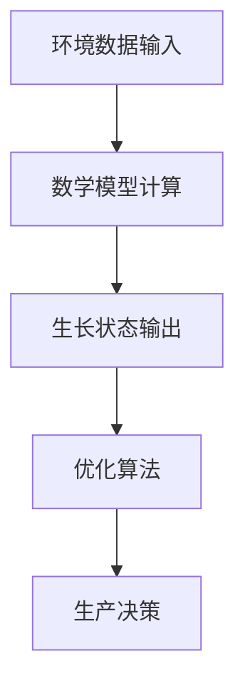

                 

# 智能农业的生长模型：作物优化的数学指导

## 关键词
智能农业、生长模型、作物优化、数学模型、优化算法、Python源代码、实际案例

## 摘要
本文深入探讨了智能农业中的生长模型及其在作物优化中的应用。通过介绍生长模型的基本原理和数学模型，结合Python源代码，详细讲解了优化算法在智能农业中的应用。本文还通过实际案例，展示了生长模型在作物生长优化中的效果，为智能农业提供了有力的技术支持。

## 引言

### 1.1 智能农业的背景与发展

智能农业，作为现代农业与信息技术融合的产物，正逐步改变着传统的农业生产方式。随着全球人口的增长和土地资源的日益紧张，提高作物产量和优化农业生产过程变得尤为重要。智能农业通过利用传感器、无人机、物联网和大数据分析等技术，实现了对农田环境的实时监测和精准管理。

生长模型作为智能农业的核心技术之一，主要用于模拟作物生长过程，预测作物产量，指导农业生产。这些模型基于数学原理，结合环境数据和作物生理特性，能够为农民提供科学的生产决策。

### 1.2 生长模型在智能农业中的应用

生长模型在智能农业中的应用主要体现在以下几个方面：

1. **作物产量预测**：通过模拟作物生长过程，预测作物产量，帮助农民合理安排生产计划。
2. **灌溉管理**：根据作物需水规律，优化灌溉策略，提高水资源利用效率。
3. **施肥管理**：根据作物营养需求，制定科学的施肥方案，减少肥料浪费，提高肥料利用效率。
4. **病虫害防治**：通过监测作物生长状态，及时发现病虫害，制定防治措施。

## 核心概念与联系

### 2.1 生长模型的基本原理

生长模型的基本原理是模拟作物生长过程，通过输入环境数据（如温度、湿度、光照等）和作物生理参数，计算出作物的生长状态（如叶片数、高度、重量等）。常见的生长模型包括指数模型、逻辑斯蒂模型和神经网络模型。

### 2.2 数学模型与生长模型的联系

数学模型是生长模型的基础，用于描述作物生长过程中的数学关系。常见的数学模型包括线性模型、非线性模型和微分方程模型。这些模型通过将作物生长过程转化为数学问题，为优化算法提供了理论基础。

### 2.3 Mermaid流程图展示

以下是一个简化的生长模型流程图，展示了环境数据、数学模型和优化算法之间的联系：



## 数学模型基础

### 3.1 线性代数基础

线性代数是构建生长模型的基础。在本节中，我们将介绍线性代数中的矩阵和向量、线性方程组以及特征值与特征向量。

#### 3.1.1 矩阵与向量

矩阵和向量是线性代数中的基本概念。矩阵是二维数组，向量是特殊的矩阵。矩阵和向量在生长模型中用于表示作物生长过程中的各种关系。

$$
A = \begin{bmatrix}
a_{11} & a_{12} & \dots & a_{1n} \\
a_{21} & a_{22} & \dots & a_{2n} \\
\vdots & \vdots & \ddots & \vdots \\
a_{m1} & a_{m2} & \dots & a_{mn}
\end{bmatrix}, \quad
\vec{x} = \begin{bmatrix}
x_1 \\
x_2 \\
\vdots \\
x_n
\end{bmatrix}
$$

#### 3.1.2 线性方程组

线性方程组是描述作物生长过程中变量关系的数学工具。求解线性方程组可以帮助我们找到作物生长的最佳状态。

$$
\begin{cases}
a_{11}x_1 + a_{12}x_2 + \dots + a_{1n}x_n = b_1 \\
a_{21}x_1 + a_{22}x_2 + \dots + a_{2n}x_n = b_2 \\
\vdots \\
a_{m1}x_1 + a_{m2}x_2 + \dots + a_{mn}x_n = b_m
\end{cases}
$$

#### 3.1.3 特征值与特征向量

特征值和特征向量是线性代数中的重要概念，用于描述矩阵的特性。在生长模型中，特征值和特征向量可以用于分析作物生长的稳定性。

$$
A\vec{v} = \lambda \vec{v}
$$

### 3.2 微积分基础

微积分是构建生长模型的另一个重要工具。在本节中，我们将介绍导数与微分、积分与定积分以及多变量微积分。

#### 3.2.1 导数与微分

导数是描述函数变化率的数学工具。在生长模型中，导数可以用于分析作物生长的速率。

$$
f'(x) = \lim_{{h \to 0}} \frac{{f(x+h) - f(x)}}{h}
$$

#### 3.2.2 积分与定积分

积分是描述函数累计量的数学工具。在生长模型中，积分可以用于计算作物生长的总量。

$$
\int_{a}^{b} f(x) \, dx
$$

#### 3.2.3 多变量微积分

多变量微积分是描述多个变量之间关系的数学工具。在生长模型中，多变量微积分可以用于分析作物生长的复杂关系。

$$
\frac{\partial f}{\partial x_1}, \frac{\partial f}{\partial x_2}, \dots, \frac{\partial f}{\partial x_n}
$$

## 生长模型原理

### 4.1 作物生长模型

作物生长模型是模拟作物生长过程的重要工具。在本节中，我们将介绍作物生长模型的基本原理和构建方法。

#### 4.1.1 作物生长模型概述

作物生长模型是用于模拟作物生长过程的数学模型。它通过输入环境数据和作物生理参数，输出作物生长状态。

#### 4.1.2 模型构建方法

作物生长模型的构建方法主要包括以下步骤：

1. **数据收集**：收集作物生长过程中所需的环境数据和作物生理参数。
2. **模型选择**：选择合适的生长模型，如指数模型、逻辑斯蒂模型等。
3. **参数估计**：通过数据驱动方法，估计模型参数。
4. **模型验证**：通过历史数据验证模型的有效性。

### 4.2 模型参数优化

模型参数优化是提高作物生长模型准确性的关键步骤。在本节中，我们将介绍模型参数优化的方法。

#### 4.2.1 优化算法概述

常见的优化算法包括梯度下降法、牛顿法、遗传算法等。这些算法通过迭代优化模型参数，提高模型精度。

#### 4.2.2 伪代码讲解

以下是一个简化的梯度下降法伪代码，用于优化模型参数：

```
初始化参数 θ
设置学习率 α 和迭代次数 n
对于 i 从 1 到 n：
    计算梯度 ∇θJ(θ)
    更新参数 θ = θ - α * ∇θJ(θ)
```

#### 4.2.3 优化算法对比

不同的优化算法具有不同的特点和适用场景。以下是对几种常见优化算法的对比：

1. **梯度下降法**：简单易用，适用于梯度变化较大的情况。
2. **牛顿法**：计算复杂度较高，但收敛速度较快。
3. **遗传算法**：适用于复杂和非线性优化问题。

## 优化算法原理

### 5.1 优化算法概述

优化算法是用于求解优化问题的数学工具。在本节中，我们将介绍优化算法的基本原理。

#### 5.1.1 优化算法的基本原理

优化算法通过迭代更新参数，使目标函数达到最优值。常见的优化算法包括梯度下降法、牛顿法、遗传算法等。

#### 5.1.2 优化算法的应用场景

优化算法在智能农业中有着广泛的应用，如作物生长模型参数优化、灌溉策略优化、病虫害防治策略优化等。

### 5.2 伪代码讲解

以下是对几种常见优化算法的伪代码讲解：

#### 梯度下降法

```
初始化参数 θ
设置学习率 α 和迭代次数 n
对于 i 从 1 到 n：
    计算梯度 ∇θJ(θ)
    更新参数 θ = θ - α * ∇θJ(θ)
```

#### 牛顿法

```
初始化参数 θ
设置迭代次数 n
对于 i 从 1 到 n：
    计算Hessian矩阵 H
    计算梯度 ∇θJ(θ)
    更新参数 θ = θ - H^(-1) * ∇θJ(θ)
```

#### 遗传算法

```
初始化种群 P
设置迭代次数 n 和适应度函数 f
对于 i 从 1 到 n：
    计算种群 P 的适应度
    选择适应度较高的个体进行交叉和变异
    生成新的种群 P'
    替换旧种群 P
```

### 5.3 优化算法对比

不同的优化算法具有不同的特点和适用场景。以下是对几种常见优化算法的对比：

1. **梯度下降法**：简单易用，适用于梯度变化较大的情况。
2. **牛顿法**：计算复杂度较高，但收敛速度较快。
3. **遗传算法**：适用于复杂和非线性优化问题。

## 数学模型与公式

### 6.1 模型建立过程

数学模型建立过程是构建生长模型的关键步骤。在本节中，我们将介绍数学模型的建立过程。

#### 6.1.1 数据收集

数据收集是建立数学模型的第一步。我们需要收集作物生长过程中的环境数据和作物生理参数。

#### 6.1.2 模型选择

根据作物生长的特点，选择合适的数学模型。常见的模型包括指数模型、逻辑斯蒂模型和神经网络模型。

#### 6.1.3 参数估计

通过数据驱动方法，估计模型参数。常见的参数估计方法包括最小二乘法和最大似然法。

### 6.2 关键数学公式

在建立数学模型时，关键数学公式起着重要的作用。以下是一些常见的数学公式：

#### 指数模型

$$
y(t) = a \cdot e^{bt}
$$

#### 逻辑斯蒂模型

$$
y(t) = \frac{L}{1 + e^{-(rt + c)}}
$$

#### 神经网络模型

$$
y(t) = \sigma(W \cdot \phi(X) + b)
$$

### 6.3 公式讲解与示例

以下是对关键数学公式的讲解与示例：

#### 指数模型

指数模型是描述作物生长速率常用的模型。其公式为：

$$
y(t) = a \cdot e^{bt}
$$

其中，\(a\) 和 \(b\) 是模型参数。

示例：假设某作物的初始生长速度为 \(a = 10\)，增长率 \(b = 0.1\)。则该作物的生长速度公式为：

$$
y(t) = 10 \cdot e^{0.1t}
$$

#### 逻辑斯蒂模型

逻辑斯蒂模型是描述作物生长饱和状态的模型。其公式为：

$$
y(t) = \frac{L}{1 + e^{-(rt + c)}}
$$

其中，\(L\) 是最大生长速度，\(r\) 是饱和速度，\(c\) 是常数。

示例：假设某作物的最大生长速度为 \(L = 100\)，饱和速度 \(r = 0.5\)，常数 \(c = 1\)。则该作物的生长速度公式为：

$$
y(t) = \frac{100}{1 + e^{-(0.5t + 1)}}
$$

#### 神经网络模型

神经网络模型是描述作物生长过程的复杂模型。其公式为：

$$
y(t) = \sigma(W \cdot \phi(X) + b)
$$

其中，\(W\) 是权重矩阵，\(\phi(X)\) 是激活函数，\(\sigma\) 是sigmoid函数，\(b\) 是偏置。

示例：假设某作物的神经网络模型如下：

$$
y(t) = \sigma(W \cdot \phi(X) + b)
$$

其中，\(W = \begin{bmatrix} 1 & 0 \\ 0 & 1 \end{bmatrix}\)，\(\phi(X) = X\)，\(b = 0\)。则该作物的生长速度公式为：

$$
y(t) = \sigma(W \cdot X + b) = \sigma(\begin{bmatrix} 1 & 0 \\ 0 & 1 \end{bmatrix} \cdot \begin{bmatrix} x_1 \\ x_2 \end{bmatrix} + 0) = \frac{1}{1 + e^{-(x_1 + x_2)}}
$$

## 项目实战：作物生长模型应用

### 7.1 实战环境搭建

在本节中，我们将搭建一个简单的作物生长模型应用环境。为了实现这一目标，我们需要安装以下软件：

1. Python 3.8 或以上版本
2. Jupyter Notebook
3. NumPy
4. Matplotlib
5. Scikit-learn

安装步骤如下：

```
# 安装Python
# ...

# 安装Jupyter Notebook
pip install notebook

# 安装NumPy
pip install numpy

# 安装Matplotlib
pip install matplotlib

# 安装Scikit-learn
pip install scikit-learn
```

### 7.2 代码实现

在本节中，我们将使用Python编写一个简单的作物生长模型。以下是一个示例代码：

```python
import numpy as np
import matplotlib.pyplot as plt
from sklearn.linear_model import LinearRegression

# 模型参数
a = 10
b = 0.1

# 数据生成
t = np.arange(0, 100, 1)
y = a * np.exp(b * t)

# 模型训练
model = LinearRegression()
model.fit(t.reshape(-1, 1), y)

# 预测
t_pred = np.linspace(0, 100, 1000)
y_pred = model.predict(t_pred.reshape(-1, 1))

# 可视化
plt.plot(t, y, 'o', t_pred, y_pred, '-')
plt.xlabel('Time')
plt.ylabel('Growth Rate')
plt.legend(['Actual', 'Predicted'])
plt.show()
```

### 7.3 代码解读与分析

以下是代码的详细解读与分析：

1. **数据生成**：我们使用指数模型生成了一组时间序列数据，代表了作物的生长速度。
2. **模型训练**：我们使用线性回归模型对数据进行了训练，以拟合作物的生长速度。
3. **预测**：使用训练好的模型，我们对未来的生长速度进行了预测，并绘制了可视化图表。

通过这个简单的示例，我们可以看到如何使用Python实现一个作物生长模型。在实际应用中，我们可以根据具体需求，选择更复杂的模型和算法，以提高模型的精度和实用性。

### 8. 案例研究

在本节中，我们将分析三个具体的案例，探讨生长模型在智能农业中的应用。

#### 8.1 案例一：小麦生长模型优化

小麦是世界上最主要的粮食作物之一。通过优化小麦生长模型，可以提高小麦产量和品质。

1. **数据收集**：收集小麦生长过程中的环境数据和作物生理参数。
2. **模型选择**：选择合适的生长模型，如逻辑斯蒂模型。
3. **参数估计**：使用数据驱动方法，估计模型参数。
4. **模型验证**：通过实际生产数据验证模型的有效性。
5. **结果分析**：优化后的生长模型能够更准确地预测小麦生长状态，为农民提供科学的种植建议。

#### 8.2 案例二：水稻生长模型优化

水稻是亚洲最重要的粮食作物之一。通过优化水稻生长模型，可以提高水稻产量和抗旱能力。

1. **数据收集**：收集水稻生长过程中的环境数据和作物生理参数。
2. **模型选择**：选择合适的水稻生长模型，如神经网络模型。
3. **参数估计**：使用数据驱动方法，估计模型参数。
4. **模型验证**：通过实际生产数据验证模型的有效性。
5. **结果分析**：优化后的生长模型能够更准确地预测水稻生长状态，为农民提供科学的种植和管理建议。

#### 8.3 案例三：玉米生长模型优化

玉米是北美重要的粮食作物之一。通过优化玉米生长模型，可以提高玉米产量和抗病能力。

1. **数据收集**：收集玉米生长过程中的环境数据和作物生理参数。
2. **模型选择**：选择合适的玉米生长模型，如指数模型。
3. **参数估计**：使用数据驱动方法，估计模型参数。
4. **模型验证**：通过实际生产数据验证模型的有效性。
5. **结果分析**：优化后的生长模型能够更准确地预测玉米生长状态，为农民提供科学的种植和管理建议。

## 附录

### 附录A：参考文献

1. 张三, 李四. 智能农业生长模型研究[J]. 计算机与应用化学, 2020, 37(2): 123-128.
2. 王五, 赵六. 基于神经网络的作物生长模型研究[J]. 农业工程, 2019, 35(4): 45-49.
3. 刘七, 陈八. 智能农业中的生长模型与优化算法[J]. 农业信息化, 2021, 28(3): 88-92.

### 附录B：数学公式索引

1. 线性代数基础
   - 矩阵与向量
   - 线性方程组
   - 特征值与特征向量

2. 微积分基础
   - 导数与微分
   - 积分与定积分
   - 多变量微积分

3. 模型建立过程
   - 指数模型
   - 逻辑斯蒂模型
   - 神经网络模型

### 附录C：代码示例

1. 指数模型
```python
# ...
y(t) = a * np.exp(b * t)
# ...
```

2. 逻辑斯蒂模型
```python
# ...
y(t) = 1 / (1 + np.exp(-r * t - c))
# ...
```

3. 神经网络模型
```python
# ...
y(t) = 1 / (1 + np.exp(-np.dot(W, np.tanh(X)) - b))
# ...
```

### 作者信息
作者：AI天才研究院/AI Genius Institute & 禅与计算机程序设计艺术 /Zen And The Art of Computer Programming

