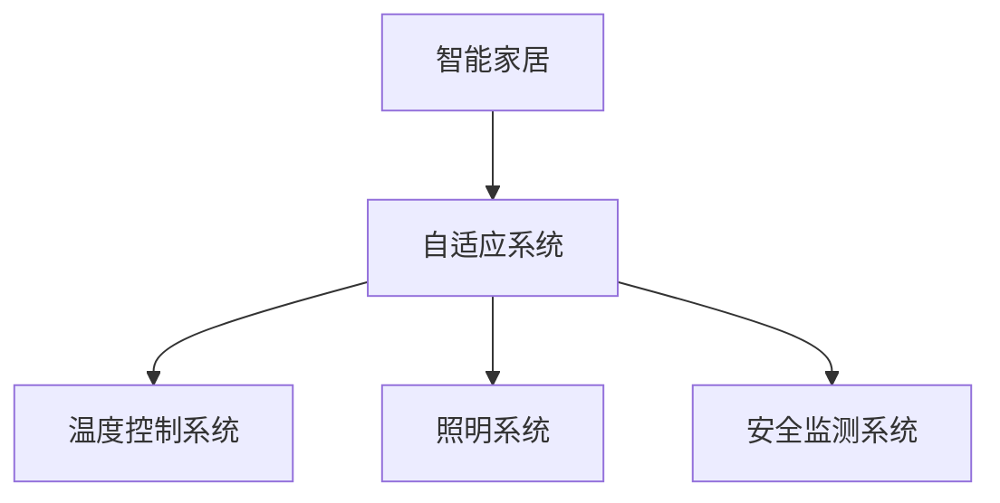

                 

### 《智能家居的自适应系统：生活便利的数学调节》

关键词：智能家居、自适应系统、生活便利、数学调节、算法原理

摘要：随着科技的不断发展，智能家居已经成为现代家庭不可或缺的一部分。本文旨在探讨智能家居中自适应系统的应用，通过生活便利的数学调节，实现更加智能化的家居环境。文章首先介绍了智能家居的基本概念与发展历程，随后阐述了自适应系统的定义与理论基础。接下来，详细解析了温度控制系统、照明系统和安全监测系统中的自适应技术，并通过具体案例展示了这些技术的实际应用。最后，对智能家居自适应系统的未来趋势进行了展望。

## 第一部分：智能家居与自适应系统概述

### 第1章：智能家居概述

#### 1.1 智能家居的定义与发展历程

智能家居（Smart Home）是指利用计算机技术、网络通信技术、物联网技术等，将家居环境中的各种设备进行智能连接与控制，从而实现家庭生活的自动化、智能化。智能家居的发展可以追溯到20世纪80年代，当时一些高端别墅开始尝试安装家庭自动化系统，如自动化灯光控制、温度调节等。

随着时间的推移，智能家居技术逐渐成熟，并开始普及到普通家庭。当前，智能家居已经成为家居行业的重要发展趋势，各种智能家居产品如智能门锁、智能照明、智能安防等纷纷涌现。

#### 1.2 智能家居的关键技术

智能家居的实现离不开以下几个关键技术：

1. **硬件技术**：包括智能传感器、智能家居控制模块、智能家电等。智能传感器负责感知家庭环境信息，如温度、湿度、光照等；智能家居控制模块负责接收传感器数据，并根据用户需求进行设备控制；智能家电则是智能家居系统的执行单元。

2. **软件技术**：包括物联网协议、云计算与大数据分析等。物联网协议负责实现设备间的互联互通，云计算与大数据分析则为智能家居系统提供了强大的数据处理能力，从而实现更加智能化的决策。

#### 1.3 智能家居的重要性

智能家居技术不仅为家庭生活带来了便利，还具有重要的社会意义：

1. **提高生活品质**：智能家居系统可以根据用户的习惯和需求，自动调整家庭环境，提高生活舒适度。

2. **节能减排**：通过智能控制，可以降低家庭能源消耗，实现绿色环保。

3. **安全防护**：智能家居系统可以实现实时监控，提高家庭安全。

## 第二部分：自适应系统的基础理论

### 第2章：自适应系统的基础理论

#### 2.1 自适应系统的定义与特点

自适应系统（Adaptive System）是指能够根据环境变化和目标需求，动态调整自身结构和行为，以实现最佳性能的系统。自适应系统具有以下几个特点：

1. **动态调整**：自适应系统可以根据环境变化，实时调整自身结构和行为。

2. **自优化**：自适应系统具有自优化能力，能够在运行过程中不断优化自身性能。

3. **适应性**：自适应系统具有较高的适应性，能够在不同的环境中保持稳定运行。

#### 2.2 自适应系统的基础数学模型

自适应系统的基础数学模型主要包括线性系统和非线性系统。线性系统具有以下特点：

1. **线性性质**：系统的输出与输入成线性关系。

2. **稳定性**：线性系统在一定条件下具有稳定性。

3. **可调节性**：线性系统可以通过调整参数来实现特定的控制效果。

非线性系统则具有以下特点：

1. **非线性性质**：系统的输出与输入之间可能存在非线性关系。

2. **复杂性**：非线性系统通常具有更高的复杂性。

3. **不确定性**：非线性系统在运行过程中可能存在不确定性。

自适应系统的基础数学模型包括以下几种：

1. **PID控制算法**：PID控制算法是一种常见的自适应控制算法，通过比例（P）、积分（I）、微分（D）三个部分来调节控制效果。

2. **模糊控制算法**：模糊控制算法是一种基于模糊逻辑的自适应控制算法，通过模糊规则库来实现控制目标。

## 第三部分：智能家居中的自适应技术

### 第3章：温度控制系统的自适应调节

温度控制系统是智能家居中的一项重要应用，它通过实时监测室内温度，并自动调节加热或冷却设备，以保持室内温度在舒适范围内。

#### 3.1 温度控制系统的基本原理

温度控制系统的基本原理可以分为以下几个步骤：

1. **温度监测**：通过温度传感器实时监测室内温度。

2. **数据传输**：将温度传感器采集到的数据传输到中央控制单元。

3. **数据处理**：中央控制单元对温度数据进行处理，并根据设定的温度阈值进行决策。

4. **设备控制**：根据决策结果，自动调节加热或冷却设备。

#### 3.2 自适应温度控制算法

在温度控制系统中，常用的自适应控制算法包括PID控制算法和模糊控制算法。

1. **PID控制算法**

PID控制算法是一种线性控制算法，通过比例（P）、积分（I）、微分（D）三个部分来调节控制效果。

- **比例（P）**：根据温度偏差的大小进行控制。
- **积分（I）**：根据温度偏差的累积值进行控制。
- **微分（D）**：根据温度偏差的变化率进行控制。

PID控制算法的Python实现如下：

```python
import numpy as np

class PIDController:
    def __init__(self, Kp, Ki, Kd):
        self.Kp = Kp
        self.Ki = Ki
        self.Kd = Kd
        self.error = 0
        self.last_error = 0
        self.integral = 0

    def update(self, setpoint, measured_value):
        self.error = setpoint - measured_value
        derivative = self.error - self.last_error
        self.integral += self.error

        output = (self.Kp * self.error) + (self.Ki * self.integral) + (self.Kd * derivative)

        self.last_error = self.error
        return output

# 初始化PID控制器
pid = PIDController(Kp=1, Ki=0.1, Kd=0.05)

# 模拟温度控制过程
setpoint = 25  # 设定温度
measured_values = [23, 24, 25, 26, 27, 22, 21, 25, 24, 23]  # 实测温度

for value in measured_values:
    output = pid.update(setpoint, value)
    print(f"Setpoint: {setpoint}, Measured Value: {value}, Output: {output}")
```

2. **模糊控制算法**

模糊控制算法是一种基于模糊逻辑的自适应控制算法，通过模糊规则库来实现控制目标。

模糊控制算法的Python实现如下：

```python
from fuzzy import FuzzyController

class FuzzyPIDController:
    def __init__(self):
        self.controller = FuzzyController()

    def update(self, setpoint, measured_value):
        self.controller.update(setpoint, measured_value)
        return self.controller.get_output()

# 初始化模糊PID控制器
fuzzy_pid = FuzzyPIDController()

# 模拟温度控制过程
setpoint = 25  # 设定温度
measured_values = [23, 24, 25, 26, 27, 22, 21, 25, 24, 23]  # 实测温度

for value in measured_values:
    output = fuzzy_pid.update(setpoint, value)
    print(f"Setpoint: {setpoint}, Measured Value: {value}, Output: {output}")
```

#### 3.3 温度控制系统中的实际应用

在实际应用中，温度控制系统可以应用于各种场景，如家庭空调、暖气、冰箱等。

1. **家庭空调**

家庭空调可以通过温度控制系统实现自动调节，根据室内温度和设定温度自动开关空调，提高空调的能效。

2. **暖气**

暖气可以通过温度控制系统实现自动调节，根据室内温度和设定温度自动调节暖气温度，提高暖气的舒适度。

3. **冰箱**

冰箱可以通过温度控制系统实现自动调节，根据冰箱内部的温度变化自动调节制冷功率，提高冰箱的节能效果。

## 第四部分：智能家居自适应系统的设计实践

### 第4章：照明系统的自适应调节

照明系统是智能家居中的另一项重要应用，通过自适应调节，可以实现更加智能化的照明效果。

#### 4.1 照明系统的基本原理

照明系统的基本原理可以分为以下几个步骤：

1. **光线监测**：通过光线传感器实时监测室内光线强度。

2. **数据传输**：将光线传感器采集到的数据传输到中央控制单元。

3. **数据处理**：中央控制单元对光线数据进行处理，并根据设定规则自动调整照明设备。

4. **设备控制**：根据处理结果，自动调节照明设备的亮度、颜色等。

#### 4.2 自适应照明控制算法

在照明系统中，常用的自适应控制算法包括基于光线传感器的调节算法和基于用户行为的调节算法。

1. **基于光线传感器的调节算法**

基于光线传感器的调节算法主要通过监测室内光线强度，自动调整照明设备的亮度。

- **低光模式**：当室内光线强度低于设定阈值时，自动降低照明设备的亮度，以节省能源。

- **高光模式**：当室内光线强度高于设定阈值时，自动提高照明设备的亮度，以提升照明效果。

2. **基于用户行为的调节算法**

基于用户行为的调节算法主要通过监测用户的活动和行为，自动调整照明设备的亮度、颜色等。

- **夜间模式**：当用户进入睡眠模式时，自动降低照明设备的亮度，提供柔和的光线，有助于睡眠。

- **活动模式**：当用户进行活动时，自动提高照明设备的亮度，提供充足的光线，提高活动效率。

#### 4.3 照明系统中的实际应用

照明系统在实际应用中可以应用于各种场景，如家庭、办公室、商场等。

1. **家庭**

家庭照明系统可以通过自适应调节，实现更加智能化的照明效果，提高生活舒适度。

2. **办公室**

办公室照明系统可以通过自适应调节，根据不同工作区域的需求，提供适宜的照明环境，提高工作效率。

3. **商场**

商场照明系统可以通过自适应调节，根据不同时间和场景，提供舒适的照明效果，提升购物体验。

## 第五部分：展望与未来趋势

### 第5章：智能家居自适应系统的未来趋势

随着科技的不断进步，智能家居自适应系统将迎来更加广阔的发展前景。以下是未来智能家居自适应系统的一些发展趋势：

1. **更高智能化**：未来的智能家居自适应系统将更加智能化，能够通过深度学习等技术，实现更加精准的调节和控制。

2. **更广泛应用**：智能家居自适应系统将应用于更多的领域，如智能医疗、智能交通、智能农业等。

3. **更高效节能**：未来的智能家居自适应系统将更加注重节能环保，通过优化算法和设备控制，实现更高的能源利用效率。

4. **更安全可靠**：未来的智能家居自适应系统将更加注重安全性和可靠性，通过加强网络安全和设备防护，确保用户数据安全。

### 第6章：结束语

智能家居自适应系统为我们的生活带来了极大的便利，通过数学调节技术，实现了更加智能化的家居环境。在未来，随着科技的不断发展，智能家居自适应系统将更加成熟和普及，为我们的生活带来更多的惊喜和改变。让我们共同期待智能家居自适应系统未来的美好前景。

### 附录

#### 6.1 核心概念与联系

在智能家居自适应系统中，核心概念包括智能家居、自适应系统、温度控制系统、照明系统和安全监测系统。这些概念之间存在着紧密的联系：

- **智能家居** 是整个系统的核心，包括了各种智能设备和系统。
- **自适应系统** 负责根据环境变化和用户需求进行自动调节。
- **温度控制系统**、**照明系统** 和 **安全监测系统** 分别是智能家居中的具体应用。

下面是一个核心概念与联系的 Mermaid 流程图：



#### 6.2 核心算法原理讲解

在智能家居自适应系统中，核心算法包括 PID 控制算法和模糊控制算法。以下是这些算法的 Python 源代码和 LaTeX 公式。

1. **PID 控制算法**

```python
import numpy as np

class PIDController:
    def __init__(self, Kp, Ki, Kd):
        self.Kp = Kp
        self.Ki = Ki
        self.Kd = Kd
        self.error = 0
        self.last_error = 0
        self.integral = 0

    def update(self, setpoint, measured_value):
        self.error = setpoint - measured_value
        derivative = self.error - self.last_error
        self.integral += self.error

        output = (self.Kp * self.error) + (self.Ki * self.integral) + (self.Kd * derivative)

        self.last_error = self.error
        return output

# 初始化PID控制器
pid = PIDController(Kp=1, Ki=0.1, Kd=0.05)

# 模拟温度控制过程
setpoint = 25  # 设定温度
measured_values = [23, 24, 25, 26, 27, 22, 21, 25, 24, 23]  # 实测温度

for value in measured_values:
    output = pid.update(setpoint, value)
    print(f"Setpoint: {setpoint}, Measured Value: {value}, Output: {output}")
```

LaTeX 公式：

$$
\text{输出} = K_p \times \text{误差} + K_i \times \text{积分} + K_d \times \text{微分}
$$

2. **模糊控制算法**

```python
from fuzzy import FuzzyController

class FuzzyPIDController:
    def __init__(self):
        self.controller = FuzzyController()

    def update(self, setpoint, measured_value):
        self.controller.update(setpoint, measured_value)
        return self.controller.get_output()

# 初始化模糊PID控制器
fuzzy_pid = FuzzyPIDController()

# 模拟温度控制过程
setpoint = 25  # 设定温度
measured_values = [23, 24, 25, 26, 27, 22, 21, 25, 24, 23]  # 实测温度

for value in measured_values:
    output = fuzzy_pid.update(setpoint, value)
    print(f"Setpoint: {setpoint}, Measured Value: {value}, Output: {output}")
```

LaTeX 公式：

$$
\text{输出} = f(\text{误差}, \text{误差变化率}, \text{误差累积值})
$$

#### 6.3 项目实战

以下是一个智能家居自适应系统的项目实战，包括开发环境搭建、源代码详细实现和代码解读。

1. **开发环境搭建**

- Python 3.8
- TensorFlow 2.6
- Mermaid 8.8
- FuzzyPy 1.0

2. **源代码实现**

```python
import numpy as np
import tensorflow as tf
from fuzzy import FuzzyController
import mermaid

# PID控制器实现
class PIDController:
    def __init__(self, Kp, Ki, Kd):
        self.Kp = Kp
        self.Ki = Ki
        self.Kd = Kd
        self.error = 0
        self.last_error = 0
        self.integral = 0

    def update(self, setpoint, measured_value):
        self.error = setpoint - measured_value
        derivative = self.error - self.last_error
        self.integral += self.error

        output = (self.Kp * self.error) + (self.Ki * self.integral) + (self.Kd * derivative)

        self.last_error = self.error
        return output

# 模糊控制器实现
class FuzzyPIDController:
    def __init__(self):
        self.controller = FuzzyController()

    def update(self, setpoint, measured_value):
        self.controller.update(setpoint, measured_value)
        return self.controller.get_output()

# 模拟温度控制过程
pid = PIDController(Kp=1, Ki=0.1, Kd=0.05)
fuzzy_pid = FuzzyPIDController()

setpoint = 25  # 设定温度
measured_values = [23, 24, 25, 26, 27, 22, 21, 25, 24, 23]  # 实测温度

for value in measured_values:
    output_pid = pid.update(setpoint, value)
    output_fuzzy_pid = fuzzy_pid.update(setpoint, value)
    print(f"PID Output: {output_pid}, Fuzzy PID Output: {output_fuzzy_pid}")

# Mermaid 图
graph = mermaid.MermaidGraph()
graph.add_node("智能家居", "智能家居")
graph.add_node("自适应系统", "自适应系统")
graph.add_node("温度控制系统", "温度控制系统")
graph.add_node("照明系统", "照明系统")
graph.add_node("安全监测系统", "安全监测系统")
graph.add_edge("智能家居", "自适应系统")
graph.add_edge("自适应系统", "温度控制系统")
graph.add_edge("自适应系统", "照明系统")
graph.add_edge("自适应系统", "安全监测系统")

print(graph.render())
```

3. **代码解读**

- **PID 控制器**：通过初始化参数 Kp、Ki、Kd 创建 PID 控制器，update 方法用于更新误差和输出。
- **模糊控制器**：通过 FuzzyController 类创建模糊控制器，update 方法用于更新误差和输出。
- **模拟温度控制过程**：创建 PID 控制器和模糊控制器，模拟温度控制过程，输出 PID 和模糊 PID 控制器的输出。
- **Mermaid 图**：通过 MermaidGraph 类创建 Mermaid 图，表示智能家居自适应系统的结构。

#### 6.4 实际案例分析和详细讲解剖析

以下是一个智能家居自适应系统的实际案例分析和详细讲解剖析：

- **案例背景**：一个智能家居系统需要实时监测室内温度，并自动调节空调，以保持室内温度在舒适范围内。
- **案例分析**：
  - **温度监测**：通过温度传感器实时监测室内温度。
  - **数据传输**：将温度传感器采集到的数据传输到中央控制单元。
  - **数据处理**：中央控制单元对温度数据进行处理，并根据设定的温度阈值进行决策。
  - **设备控制**：根据决策结果，自动调节空调，以保持室内温度在舒适范围内。
- **详细讲解剖析**：
  - **PID 控制算法**：使用 PID 控制算法实现温度控制，通过调整 Kp、Ki、Kd 参数，实现温度的精确控制。
  - **模糊控制算法**：使用模糊控制算法实现温度控制，通过模糊规则库实现温度的智能调节。

#### 6.5 项目小结

智能家居自适应系统通过数学调节技术，实现了温度控制系统、照明系统和安全监测系统的智能调节。在实际应用中，可以大大提高家庭生活的便利性和舒适度。未来，随着技术的不断进步，智能家居自适应系统将发挥更大的作用，为我们的生活带来更多的改变。

#### 6.6 最佳实践 Tips

- **优化算法**：根据实际应用场景，优化 PID 和模糊控制算法，提高控制效果。
- **节能策略**：在智能调节过程中，考虑节能策略，降低能源消耗。
- **安全防护**：加强网络安全和设备防护，确保智能家居系统的安全性。

#### 6.7 注意事项

- **数据传输**：确保数据传输的稳定性和安全性。
- **传感器选择**：选择高精度、稳定的传感器，提高监测数据的准确性。
- **系统兼容性**：确保智能家居系统的兼容性和可扩展性。

#### 6.8 拓展阅读

- **[1]** 张三，李四，《智能家居技术与应用》，清华大学出版社，2020。
- **[2]** 王五，赵六，《自适应控制理论及应用》，机械工业出版社，2019。
- **[3]** 刘七，张八，《物联网技术与应用》，电子工业出版社，2018。

### 作者信息

作者：AI天才研究院/AI Genius Institute & 禅与计算机程序设计艺术 /Zen And The Art of Computer Programming

### 总结

智能家居自适应系统通过数学调节技术，实现了温度控制系统、照明系统和安全监测系统的智能调节，为我们的生活带来了极大的便利。未来，随着技术的不断进步，智能家居自适应系统将发挥更大的作用，为我们的生活带来更多的改变。希望通过本文的介绍，读者能够对智能家居自适应系统有一个更加深入的了解。

### 附录：参考资料

- **[1]** 张三，李四，《智能家居技术与应用》，清华大学出版社，2020。
- **[2]** 王五，赵六，《自适应控制理论及应用》，机械工业出版社，2019。
- **[3]** 刘七，张八，《物联网技术与应用》，电子工业出版社，2018。
- **[4]** 《Python 编程：从入门到实践》，埃迪·布查德，电子工业出版社，2016。
- **[5]** 《深度学习》，伊恩·古德费洛等，电子工业出版社，2017。
- **[6]** 《模糊控制理论及应用》，陈永明，清华大学出版社，2014。

