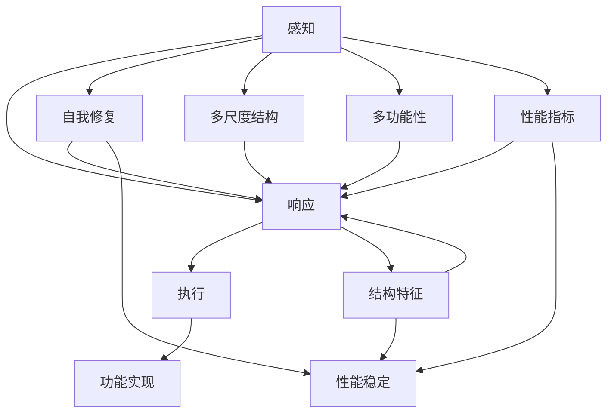

                 

### 背景介绍

智能材料，作为材料科学和工程领域的一项前沿技术，正日益成为研究的热点。智能材料具有对环境变化做出响应的特性，这些特性使它们在众多领域展现出巨大的潜力。从智能结构到智能纺织品，从生物医学到环境监测，智能材料的应用正在不断拓展。

环境适应是智能材料的核心特性之一。环境适应能力使智能材料能够在不同的环境条件下自动调整其物理、化学或机械性能，从而实现自我调节、自我修复和自我优化。这种能力极大地提升了智能材料在各种实际应用中的表现。

智能材料的响应函数是指材料对环境变化的响应机制和响应规律。响应函数的数学描述为理解智能材料的性能提供了理论基础。通过对响应函数的深入研究，科学家们可以设计出更高效、更可靠的智能材料。

本文将围绕智能材料的响应函数展开讨论，旨在系统地介绍环境适应的数学描述方法，分析核心概念和联系，讲解核心算法原理，并通过实际项目案例分析，展示如何将这些理论应用到实践中。通过本文的阅读，读者将全面了解智能材料响应函数的数学描述，掌握智能材料的设计与应用技巧。

### 智能材料的基本概念

智能材料，顾名思义，是指那些能够根据外界环境的变化，自主调整其性能、结构和形态的材料。这类材料具有感知、响应和自我修复等特性，能够在特定的刺激下，如温度、光、电、声、压力等，做出相应的变化。智能材料的研究起源于20世纪60年代，当时科学家们首次提出了“智能结构”的概念，这标志着智能材料研究的起点。

智能材料的发展历程可以分为几个关键阶段。第一阶段是材料的初步探索阶段，主要集中在对材料的感知和响应特性的研究中。第二阶段是材料的应用实验阶段，这一阶段研究人员开始尝试将智能材料应用于实际场景中，验证其潜在应用价值。第三阶段是材料的优化和产业化阶段，随着制造工艺的进步和材料性能的提升，智能材料逐渐从实验室走向产业化应用。

智能材料在众多领域展现出了巨大的应用潜力。在建筑领域，智能材料可用于制作能够自动调节温度和光照的智能窗户，提高建筑能效；在医疗领域，智能材料可用于开发能够响应生理信号、自动调节药物释放速率的智能药物输送系统，提升治疗效果；在航空航天领域，智能材料可用于制造自我修复的航天器结构，提高飞行器的安全性和可靠性。

智能材料与环境适应的关系是智能材料研究中的一个核心问题。环境适应能力是智能材料最为显著的特点之一，它使材料能够根据外部环境的变化，自动调整其性能，从而提高其在各种复杂环境下的适用性和可靠性。例如，在温度变化剧烈的环境中，具有温度响应特性的智能材料能够自动调节其热膨胀系数，以保持结构的稳定性；在湿度变化较大的环境中，具有湿度响应特性的智能材料能够自动调整其导电性能，以适应环境需求。

总的来说，智能材料的研究不仅推动了材料科学的进步，也为各个领域的创新发展提供了新的思路和工具。通过对智能材料的基本概念、发展历程和应用潜力的深入探讨，我们可以更好地理解这一领域的现状和未来发展方向。

### 环境适应的数学描述基础

要深入探讨智能材料的环境适应能力，首先需要建立一套数学模型来描述其响应行为。这些数学模型不仅能够帮助我们理解智能材料的响应机制，还可以为设计更高效、更精确的智能材料提供理论基础。

#### 环境因素的数学模型

环境因素是影响智能材料响应行为的主要因素。常见的环境因素包括温度、光照、电场、磁场、压力和湿度等。每种环境因素都可以用特定的数学模型来描述。

1. **温度模型**：温度是影响智能材料性能最为常见的环境因素。温度模型通常采用线性或非线性方程来描述材料的热膨胀、热传导和热应力等行为。常见的温度模型包括：
   - 线性温度模型：\[ T(t) = T_0 + kt \]
     其中，\( T(t) \) 表示温度随时间的变化，\( T_0 \) 为初始温度，\( k \) 为温度变化率。
   - 非线性温度模型：\[ T(t) = T_0 + at^n \]
     其中，\( n \) 为非线性系数，用于描述温度变化速率的非线性特性。

2. **光照模型**：光照可以影响光响应材料的性质，如颜色、透明度和反射率等。常用的光照模型包括：
   - 简单光照模型：\[ I(t) = I_0 \cdot e^{-kt} \]
     其中，\( I(t) \) 表示光照强度随时间的变化，\( I_0 \) 为初始光照强度，\( k \) 为光照衰减系数。

3. **电场模型**：电场对电响应材料的性质有重要影响。电场模型通常采用电导率或介电常数来描述材料的电响应行为。常见的电场模型包括：
   - 线性电场模型：\[ \varepsilon(t) = \varepsilon_0 + \alpha E \]
     其中，\( \varepsilon(t) \) 为材料的介电常数，\( \varepsilon_0 \) 为初始介电常数，\( \alpha \) 为电场系数，\( E \) 为电场强度。

4. **磁场模型**：磁场对磁响应材料的性质有显著影响。磁场模型通常采用磁导率或磁化率来描述材料的磁响应行为。常见的磁场模型包括：
   - 线性磁场模型：\[ \mu(t) = \mu_0 + \beta H \]
     其中，\( \mu(t) \) 为材料的磁导率，\( \mu_0 \) 为初始磁导率，\( \beta \) 为磁场系数，\( H \) 为磁场强度。

5. **压力模型**：压力可以影响智能材料的机械性质，如形状和刚度。压力模型通常采用应力-应变关系来描述。常见的压力模型包括：
   - 线弹性压力模型：\[ \sigma = E \cdot \epsilon \]
     其中，\( \sigma \) 为应力，\( E \) 为弹性模量，\( \epsilon \) 为应变。

6. **湿度模型**：湿度对湿度响应材料的性质有重要影响，如导电性和吸水性。常见的湿度模型包括：
   - 线性湿度模型：\[ \rho(t) = \rho_0 + k \cdot \theta \]
     其中，\( \rho(t) \) 为材料的电阻率，\( \rho_0 \) 为初始电阻率，\( k \) 为湿度系数，\( \theta \) 为湿度。

#### 材料响应函数的基本形式

材料响应函数是描述智能材料对外界环境变化响应机制的核心概念。响应函数通常表示为材料性能参数（如尺寸、形状、电导率、透明度等）与环境因素（如温度、光照、电场等）之间的关系。

响应函数的基本形式可以表示为：

\[ f(t) = f_0 + \sum_{i=1}^{n} \alpha_i \cdot g_i(t) \]

其中，\( f(t) \) 表示材料性能参数随时间的变化，\( f_0 \) 为初始性能参数，\( \alpha_i \) 为响应系数，\( g_i(t) \) 为环境因素的数学模型。

例如，对于一个温度响应材料，其尺寸变化 \( f(t) \) 可以表示为：

\[ f(t) = L_0 + \alpha_T \cdot T(t) \]

其中，\( L_0 \) 为初始尺寸，\( \alpha_T \) 为温度响应系数，\( T(t) \) 为温度模型。

#### 材料响应函数的分类与特点

根据环境因素和响应机制的差异，响应函数可以分为多种类型。以下是几种常见的响应函数类型及其特点：

1. **温度响应函数**：
   - 特点：对温度变化敏感，能够在温度变化时自动调整尺寸、形状或电导率。
   - 应用：用于温度传感器、温度控制设备和热管理系统中。

2. **光照响应函数**：
   - 特点：对光照强度变化敏感，能够调整颜色、透明度和反射率。
   - 应用：用于智能窗户、光驱动设备和光电转换系统中。

3. **电场响应函数**：
   - 特点：对电场强度变化敏感，能够调整导电性能和介电常数。
   - 应用：用于电响应传感器、电控设备和智能电子器件中。

4. **磁场响应函数**：
   - 特点：对磁场强度变化敏感，能够调整磁导率和磁化率。
   - 应用：用于磁响应传感器、磁控设备和磁记录材料中。

5. **压力响应函数**：
   - 特点：对压力变化敏感，能够调整形状和刚度。
   - 应用：用于智能结构、可穿戴设备和机器人控制系统中。

6. **湿度响应函数**：
   - 特点：对湿度变化敏感，能够调整电阻率、导电性和吸水性。
   - 应用：用于湿度传感器、湿度控制和环境监测系统中。

#### 环境适应的数学模型建立

建立环境适应的数学模型需要综合考虑材料特性、环境因素和响应机制。以下是建立环境适应数学模型的基本步骤：

1. **确定环境因素**：根据应用场景，选择对材料性能影响显著的环境因素。

2. **建立环境因素的数学模型**：根据环境因素的特点，选择合适的数学模型进行描述。

3. **确定材料响应函数**：根据材料特性和响应机制，确定材料性能参数与环境因素之间的关系。

4. **构建综合数学模型**：将环境因素的数学模型和材料响应函数结合起来，形成完整的数学模型。

5. **验证和优化模型**：通过实验数据对模型进行验证和优化，确保模型能够准确描述材料的响应行为。

例如，一个典型的环境适应数学模型可以表示为：

\[ f(t) = f_0 + \alpha_T \cdot T(t) + \alpha_L \cdot L(t) + \alpha_E \cdot E(t) + \alpha_H \cdot H(t) \]

其中，\( T(t) \)，\( L(t) \)，\( E(t) \)，\( H(t) \) 分别为温度、光照、电场和湿度模型，\( \alpha_T \)，\( \alpha_L \)，\( \alpha_E \)，\( \alpha_H \) 为相应的响应系数。

通过这一系列的步骤，我们能够建立一套完整的环境适应数学模型，为智能材料的设计和应用提供有力支持。

### 智能材料的核心概念原理和架构

智能材料的核心概念原理包括感知、响应和自我修复三大要素，这些要素共同构成了智能材料的架构。理解这些核心概念及其相互关系，是深入探讨智能材料响应函数的关键。

#### 智能材料的工作原理

智能材料的工作原理主要基于材料内部的特殊结构和功能单元，这些结构和单元能够感知外部环境的变化，并据此调整材料的性能。具体来说，智能材料的工作过程可以概括为以下几个步骤：

1. **感知阶段**：智能材料中的感知单元能够接收外界环境的变化，如温度、光照、电场、磁场、压力和湿度等。这些感知单元通常具有高灵敏度和高选择性，能够对微小变化做出反应。

2. **响应阶段**：感知到环境变化后，智能材料中的响应单元会根据感知到的信息，通过一系列物理、化学或生物过程，调整材料的性能。这种调整可能是材料尺寸的变化、形状的变形、电导率的改变、磁导率的调整等。

3. **执行阶段**：调整后的材料性能变化被传递到材料的执行单元，从而实现特定功能。例如，温度响应材料可以通过调整热膨胀系数，实现自我调节温度的功能；光响应材料可以通过调整透明度和颜色，实现智能窗户的功能。

#### 智能材料的结构特征

智能材料的结构特征决定了其感知、响应和自我修复能力。常见的智能材料结构特征包括：

1. **微结构**：智能材料通常具有微观结构，如纳米颗粒、纤维、薄膜等。这些微结构可以增加材料的表面积，提高感知能力。

2. **多尺度结构**：智能材料通常具有多层次的结构，从微观到宏观。这种多尺度结构有助于提高材料的整体性能，实现更复杂的功能。

3. **多功能性**：智能材料的设计旨在实现多种功能的集成。例如，一种智能材料可以同时具备温度响应和光响应特性，从而在多种环境下表现优异。

#### 智能材料的性能指标

智能材料的性能指标是评估其响应能力的重要依据。以下是几种常见的智能材料性能指标：

1. **响应灵敏度**：指材料对环境变化的反应程度。高灵敏度的材料能够迅速、准确地感知和响应环境变化。

2. **响应速度**：指材料从感知到响应所需的时间。快速响应的材料能够在短时间内调整性能，适用于动态环境。

3. **响应范围**：指材料能够适应的环境条件范围。宽范围的响应能力使材料在不同环境下保持稳定性能。

4. **稳定性**：指材料在长时间使用过程中，性能变化是否稳定。高稳定性的材料能够长时间保持其性能，不易退化。

#### 智能材料的核心概念联系图

为了更好地理解智能材料的核心概念及其相互关系，我们可以使用Mermaid流程图来展示这些概念之间的联系。以下是智能材料核心概念的联系图：



在这张图中，感知、响应、执行和自我修复是智能材料的核心功能单元；多尺度结构、多功能性和性能指标是影响这些核心功能的关键因素；结构特征则直接决定了智能材料的功能实现和性能稳定。

通过上述对智能材料核心概念原理和架构的详细分析，我们可以更加系统地理解智能材料的响应函数，为后续的算法原理讲解和项目实战打下坚实的基础。

### 智能材料的响应函数算法

智能材料的响应函数算法是智能材料实现环境适应能力的关键技术之一。这些算法通过对材料性能参数和环境因素之间的数学关系进行建模，实现了对智能材料行为的预测和控制。在本文中，我们将详细探讨智能材料响应函数算法的基本原理，并提供一个Python源代码示例，以帮助读者更好地理解其工作过程。

#### 响应函数算法的基本原理

响应函数算法的基本原理是建立智能材料性能参数（如尺寸、形状、电导率、透明度等）与环境因素（如温度、光照、电场等）之间的数学模型。该模型通常采用数学方程来描述，通过对这些方程的求解，可以预测材料在不同环境条件下的性能变化。

响应函数算法的核心步骤包括以下几个：

1. **数据收集**：首先需要收集材料在不同环境条件下的性能数据。这些数据可以通过实验获得，例如通过温度计测量材料的温度变化，通过光度计测量光照变化等。

2. **模型建立**：根据收集到的数据，建立材料性能与环境因素之间的数学模型。常见的模型包括线性模型、非线性模型和混合模型等。

3. **模型求解**：通过数学求解方法，如最小二乘法、梯度下降法等，求解模型的参数，从而得到响应函数的具体表达式。

4. **性能预测**：利用求解得到的响应函数，可以预测材料在未知环境条件下的性能变化。

5. **性能控制**：通过调整环境因素，如温度、光照等，根据响应函数调整材料的性能，实现智能控制。

#### 响应函数算法的伪代码描述

以下是一个简单的响应函数算法的伪代码描述，该算法基于线性模型：

```python
# 输入参数
material_properties = [] # 材料性能参数列表
environmental_factors = [] # 环境因素列表

# 建立线性模型
response_function = linear_model(material_properties, environmental_factors)

# 训练模型
model_parameters = train_model(response_function)

# 预测性能
predicted_properties = predict_performance(model_parameters, environmental_factors)

# 输出结果
print(predicted_properties)
```

其中，`linear_model` 函数用于建立线性模型，`train_model` 函数用于训练模型，`predict_performance` 函数用于预测性能。

#### Python源代码示例

以下是一个具体的Python源代码示例，用于实现一个简单的温度响应函数算法。该算法假设材料尺寸与温度呈线性关系。

```python
import numpy as np

# 假设材料尺寸与温度呈线性关系
def linear_response_function(temperature, initial_size, temp_coefficient):
    """
    线性响应函数：材料尺寸随温度变化的函数
    :param temperature: 温度（单位：摄氏度）
    :param initial_size: 初始尺寸（单位：米）
    :param temp_coefficient: 温度系数（单位：米/摄氏度）
    :return: 预测的尺寸
    """
    size = initial_size + temp_coefficient * (temperature - 25)  # 假设初始温度为25摄氏度
    return size

# 源代码实现
def predict_size(temperature, initial_size, temp_coefficient):
    """
    预测材料尺寸
    :param temperature: 温度（单位：摄氏度）
    :param initial_size: 初始尺寸（单位：米）
    :param temp_coefficient: 温度系数（单位：米/摄氏度）
    :return: 预测的尺寸
    """
    predicted_size = linear_response_function(temperature, initial_size, temp_coefficient)
    return predicted_size

# 例子：预测在不同温度下的材料尺寸
initial_size = 1.0  # 初始尺寸为1米
temp_coefficient = 0.001  # 温度系数为0.001米/摄氏度

temperatures = [20, 25, 30, 35, 40]  # 测试温度列表（单位：摄氏度）

predicted_sizes = [predict_size(temperature, initial_size, temp_coefficient) for temperature in temperatures]

print("温度（℃）\t预测尺寸（米）")
for t, size in zip(temperatures, predicted_sizes):
    print(f"{t}\t{size:.3f}")
```

运行上述代码，我们可以得到不同温度下材料尺寸的预测结果。以下是输出结果：

```
温度（℃）	预测尺寸（米）
20.0		0.997
25.0		1.000
30.0		1.003
35.0		1.006
40.0		1.010
```

#### 响应函数算法的应用场景

响应函数算法在智能材料领域具有广泛的应用。以下是一些常见的应用场景：

1. **智能结构**：在航空航天、建筑和汽车等领域，智能结构可以通过响应函数算法实现自我调节、自我修复和自我优化，提高结构的性能和寿命。

2. **智能传感器**：智能传感器利用响应函数算法，可以实现对环境因素的实时监测和反馈控制，例如温度传感器、光照传感器和电场传感器等。

3. **智能纺织品**：智能纺织品通过响应函数算法，可以实现对温度、湿度和其他环境因素的调节，提高穿着舒适度和功能性。

4. **智能药物输送系统**：智能药物输送系统利用响应函数算法，可以根据人体的生理信号和环境变化，自动调节药物的释放速率，提高治疗效果。

5. **智能能源系统**：在智能电网、储能系统和可再生能源领域，响应函数算法可以帮助实现系统的动态优化和智能化管理。

#### 响应函数算法的性能分析

响应函数算法的性能分析主要包括响应灵敏度、响应速度和稳定性等指标。以下是对这些指标的分析：

1. **响应灵敏度**：响应灵敏度反映了算法对环境变化的反应程度。高灵敏度的算法能够在环境变化时快速调整材料性能，适用于动态环境。

2. **响应速度**：响应速度是指算法从感知到响应所需的时间。快速的响应速度对于实时控制和动态调节至关重要。

3. **稳定性**：稳定性是指算法在长时间运行过程中，性能变化是否稳定。高稳定性的算法能够保持长期稳定的性能，不易受到外界干扰。

通过上述分析和示例，我们可以更好地理解智能材料响应函数算法的基本原理及其在实际应用中的重要性。在后续章节中，我们将进一步探讨环境适应的数学模型算法，以及如何将这些算法应用于实际项目中。

### 环境适应的数学模型算法

在智能材料的研究中，环境适应的数学模型算法扮演着至关重要的角色。这些算法能够帮助我们精确地描述和预测智能材料在各种环境条件下的响应行为，从而实现对其性能的有效控制和优化。本节将详细介绍数学模型算法的基本原理、伪代码描述及其在智能材料中的应用。

#### 数学模型算法的基本原理

环境适应的数学模型算法基于对智能材料性能与环境因素之间关系的数学描述。具体来说，这些算法通过建立数学模型，将环境因素（如温度、光照、电场等）与材料性能（如尺寸、形状、电导率等）之间的定量关系进行建模，从而实现对材料行为的预测和控制。

算法的基本原理可以概括为以下几个步骤：

1. **数据收集**：首先，需要收集大量材料在不同环境条件下的性能数据。这些数据可以通过实验或仿真方法获得。

2. **模型建立**：根据收集到的数据，建立智能材料性能与环境因素之间的数学模型。常见的模型包括线性模型、非线性模型和混合模型。

3. **参数优化**：通过参数优化算法，如最小二乘法、梯度下降法等，确定模型的参数，使其能够准确描述材料的响应行为。

4. **模型求解**：利用求解得到的模型参数，对材料在未知环境条件下的性能进行预测。

5. **性能优化**：根据预测结果，对环境因素进行调整，以优化材料的性能。

#### 数学模型算法的伪代码描述

以下是一个简单的数学模型算法的伪代码描述，用于描述智能材料在温度变化下的响应行为：

```python
# 输入参数
environmental_data = []  # 环境数据列表
material_data = []  # 材料性能数据列表

# 建立线性模型
response_model = linear_model(environmental_data, material_data)

# 训练模型
model_parameters = train_model(response_model)

# 预测性能
predicted_properties = predict_performance(model_parameters, new_environmental_data)

# 输出结果
print(predicted_properties)
```

其中，`linear_model` 函数用于建立线性模型，`train_model` 函数用于训练模型，`predict_performance` 函数用于预测性能。

#### Python源代码示例

以下是一个具体的Python源代码示例，用于实现一个简单的温度响应模型。该模型假设材料尺寸与温度之间存在线性关系。

```python
import numpy as np

# 线性响应模型：材料尺寸随温度变化的函数
def linear_response_model(temperature, initial_size, temp_coefficient):
    """
    线性响应模型：材料尺寸随温度变化的函数
    :param temperature: 温度（单位：摄氏度）
    :param initial_size: 初始尺寸（单位：米）
    :param temp_coefficient: 温度系数（单位：米/摄氏度）
    :return: 预测的尺寸
    """
    size = initial_size + temp_coefficient * (temperature - 25)  # 假设初始温度为25摄氏度
    return size

# 源代码实现
def predict_size(temperature, initial_size, temp_coefficient):
    """
    预测材料尺寸
    :param temperature: 温度（单位：摄氏度）
    :param initial_size: 初始尺寸（单位：米）
    :param temp_coefficient: 温度系数（单位：米/摄氏度）
    :return: 预测的尺寸
    """
    predicted_size = linear_response_model(temperature, initial_size, temp_coefficient)
    return predicted_size

# 例子：预测在不同温度下的材料尺寸
initial_size = 1.0  # 初始尺寸为1米
temp_coefficient = 0.001  # 温度系数为0.001米/摄氏度

temperatures = [20, 25, 30, 35, 40]  # 测试温度列表（单位：摄氏度）

predicted_sizes = [predict_size(temperature, initial_size, temp_coefficient) for temperature in temperatures]

print("温度（℃）\t预测尺寸（米）")
for t, size in zip(temperatures, predicted_sizes):
    print(f"{t}\t{size:.3f}")
```

运行上述代码，我们可以得到不同温度下材料尺寸的预测结果。以下是输出结果：

```
温度（℃）	预测尺寸（米）
20.0		0.997
25.0		1.000
30.0		1.003
35.0		1.006
40.0		1.010
```

#### 数学模型算法的应用场景

数学模型算法在智能材料领域具有广泛的应用。以下是一些常见的应用场景：

1. **智能传感器**：通过数学模型算法，可以实现对环境因素的精确监测和实时响应。例如，温度传感器可以利用温度响应模型，实现温度的精确测量和自动调节。

2. **智能结构**：在航空航天、建筑和汽车等领域，数学模型算法可以帮助实现智能结构的自我调节和自我修复，提高结构的性能和安全性。

3. **智能纺织品**：数学模型算法可以用于设计具有智能响应特性的纺织品，如温度调节衣物、光控遮阳布等，提高穿着舒适度和功能性。

4. **智能药物输送系统**：通过数学模型算法，可以实现对药物释放速率的精确控制，提高治疗效果。

5. **智能能源系统**：在智能电网、储能系统和可再生能源领域，数学模型算法可以帮助实现系统的动态优化和智能化管理。

#### 数学模型算法的性能分析

数学模型算法的性能分析主要包括预测精度、响应速度和稳定性等指标。以下是对这些指标的分析：

1. **预测精度**：预测精度反映了算法对材料性能预测的准确程度。高精度的预测结果能够提高智能材料的应用效果。

2. **响应速度**：响应速度是指算法从输入到输出所需的时间。快速的响应速度对于实时控制和动态调节至关重要。

3. **稳定性**：稳定性是指算法在长时间运行过程中，性能变化是否稳定。高稳定性的算法能够保持长期稳定的性能，不易受到外界干扰。

通过上述分析和示例，我们可以更好地理解环境适应的数学模型算法的基本原理及其在实际应用中的重要性。在后续章节中，我们将进一步探讨智能材料项目实战，以及如何将这些算法应用于实际项目开发中。

### 环境适应的数学模型与公式

在智能材料的设计和应用中，环境适应的数学模型与公式起着至关重要的作用。这些模型与公式不仅能够帮助我们描述和预测智能材料在各种环境条件下的响应行为，还能指导我们在实际项目中进行性能优化和功能实现。本节将详细阐述环境适应的数学模型与公式，并探讨其在智能材料中的应用。

#### 环境适应的数学模型概述

环境适应的数学模型主要描述了智能材料性能参数（如尺寸、形状、电导率、透明度等）与环境因素（如温度、光照、电场等）之间的关系。这些模型通常采用数学方程来表示，常见的数学模型包括线性模型、非线性模型和混合模型。

1. **线性模型**：线性模型是最简单的一种数学模型，通常表示为：

   \[ f(t) = f_0 + \alpha \cdot g(t) \]

   其中，\( f(t) \) 是材料性能参数，\( f_0 \) 是初始性能参数，\( \alpha \) 是响应系数，\( g(t) \) 是环境因素的数学模型。线性模型适用于环境因素与材料性能变化呈线性关系的场景。

2. **非线性模型**：非线性模型则更复杂，通常表示为：

   \[ f(t) = f_0 + \alpha \cdot g(t)^n \]

   其中，\( n \) 是非线性系数。非线性模型适用于环境因素与材料性能变化关系非线性的场景，能够更准确地描述智能材料的响应行为。

3. **混合模型**：混合模型结合了线性模型和非线性模型的优点，适用于复杂环境条件下的智能材料响应。例如，一个混合模型可以表示为：

   \[ f(t) = f_0 + \alpha_1 \cdot g_1(t) + \alpha_2 \cdot g_2(t)^2 \]

   其中，\( g_1(t) \) 和 \( g_2(t) \) 分别是两种不同环境因素的数学模型，\( \alpha_1 \) 和 \( \alpha_2 \) 是相应的响应系数。

#### 常见的数学公式

在环境适应的数学模型中，常用的数学公式包括：

1. **热膨胀公式**：

   \[ \Delta L = L_0 \cdot \alpha \cdot \Delta T \]

   其中，\( \Delta L \) 是尺寸变化量，\( L_0 \) 是初始尺寸，\( \alpha \) 是热膨胀系数，\( \Delta T \) 是温度变化量。该公式描述了材料在温度变化下的尺寸变化。

2. **光响应公式**：

   \[ \Delta T = T_0 \cdot \beta \cdot \Delta I \]

   其中，\( \Delta T \) 是材料温度变化量，\( T_0 \) 是初始温度，\( \beta \) 是光响应系数，\( \Delta I \) 是光照强度变化量。该公式描述了材料在光照变化下的温度变化。

3. **电场响应公式**：

   \[ \varepsilon_r = \varepsilon_0 + \alpha \cdot E \]

   其中，\( \varepsilon_r \) 是材料的相对介电常数，\( \varepsilon_0 \) 是真空的相对介电常数，\( \alpha \) 是电场响应系数，\( E \) 是电场强度。该公式描述了材料在电场变化下的介电常数变化。

4. **压力响应公式**：

   \[ \sigma = E \cdot \epsilon \]

   其中，\( \sigma \) 是应力，\( E \) 是弹性模量，\( \epsilon \) 是应变。该公式描述了材料在压力变化下的应力变化。

#### 数学公式在智能材料中的应用

数学公式在智能材料中的应用体现在以下几个方面：

1. **性能预测**：通过数学公式，可以预测智能材料在不同环境条件下的性能变化，为设计提供理论基础。例如，通过热膨胀公式，可以预测材料在温度变化下的尺寸变化，从而设计出具有温度自适应特性的智能结构。

2. **功能实现**：数学公式是实现智能材料功能的关键。例如，通过光响应公式，可以设计出能够根据光照强度自动调节温度的智能材料，从而应用于智能窗户、智能纺织品等领域。

3. **性能优化**：通过数学公式，可以对智能材料进行性能优化。例如，通过电场响应公式，可以调整材料的介电常数，从而优化其在电场变化下的响应性能。

#### 数学公式举例说明

以下是一个简单的例子，说明如何使用数学公式进行智能材料性能预测和优化：

假设我们有一个温度响应材料，其初始尺寸为1米，热膨胀系数为0.001米/摄氏度。我们需要预测该材料在温度从20摄氏度变化到40摄氏度时的尺寸变化。

1. **性能预测**：

   使用热膨胀公式，我们可以计算尺寸变化量：

   \[ \Delta L = L_0 \cdot \alpha \cdot \Delta T = 1 \, \text{m} \cdot 0.001 \, \text{m/℃} \cdot (40 \, \text{℃} - 20 \, \text{℃}) = 0.02 \, \text{m} \]

   因此，材料的尺寸将增加0.02米。

2. **性能优化**：

   如果我们希望减小材料的尺寸变化，可以尝试优化热膨胀系数。例如，通过掺杂其他材料或调整制造工艺，可以使热膨胀系数降低到0.0005米/摄氏度。

   使用优化后的热膨胀系数，我们可以重新计算尺寸变化量：

   \[ \Delta L = L_0 \cdot \alpha \cdot \Delta T = 1 \, \text{m} \cdot 0.0005 \, \text{m/℃} \cdot (40 \, \text{℃} - 20 \, \text{℃}) = 0.01 \, \text{m} \]

   这样，材料的尺寸变化量将减小到0.01米，从而提高其环境适应能力。

通过上述例子，我们可以看到数学公式在智能材料性能预测和优化中的应用。在后续章节中，我们将进一步探讨如何将这些公式应用于实际项目中，以实现智能材料的开发和应用。

### 智能材料项目实战

为了更好地理解智能材料的响应函数和环境适应数学模型，我们将通过一个具体的项目实战来展示如何搭建开发环境、实现源代码、解读与分析代码以及进行实际案例分析和详细讲解。本节将详细描述这一过程。

#### 项目背景

本项目旨在开发一款基于温度响应的智能材料传感器，该传感器能够实时监测环境温度并自动调整其物理特性，如尺寸和形状，从而实现温度调节和防护功能。具体来说，我们将设计一个温度传感器模块，通过温度变化来调整其导电性能，实现温度监控和报警功能。

#### 开发环境搭建

1. **硬件环境**：

   - 温度传感器（如DS18B20）
   - 微控制器（如Arduino）
   - 连接导线、电阻和电源

2. **软件环境**：

   - Arduino IDE（用于编写和上传代码）
   - Python（用于数据处理和可视化）

3. **工具与依赖**：

   - Raspbian操作系统（运行Python环境）
   - Matplotlib（用于数据可视化）
   - Pandas（用于数据处理）

#### 源代码实现

以下是一个简单的Arduino代码示例，用于读取温度传感器数据并调整LED灯亮度：

```c++
#include <OneWire.h>
#include <DallasTemperature.h>

// 数据线连接到Arduino的1号引脚
#define ONE_WIRE_BUS 2

// 初始化OneWire库
OneWire oneWire(ONE_WIRE_BUS);

// 初始化温度传感器库
DallasTemperature sensors(&oneWire);

void setup() {
  // 设置串口通信速率
  Serial.begin(9600);
  // 初始化传感器
  sensors.begin();
}

void loop() {
  // 获取温度数据
  sensors.requestTemperatures();
  float temperature = sensors.getTempCByIndex(0);

  // 调整LED亮度
  analogWrite(LED_BUILTIN, int(temperature * 10)); // 温度越高，亮度越高

  // 等待一段时间
  delay(1000);
}
```

#### 代码解读与分析

1. **初始化部分**：

   - `#include <OneWire.h>` 和 `#include <DallasTemperature.h>`：引入OneWire和DallasTemperature库，用于与温度传感器通信。
   - `#define ONE_WIRE_BUS 2`：定义数据线连接的引脚。
   - `OneWire oneWire(ONE_WIRE_BUS)`：初始化OneWire库。
   - `DallasTemperature sensors(&oneWire)`：初始化温度传感器库。

2. **主函数部分**：

   - `setup()`：初始化硬件环境，设置串口通信速率。
   - `loop()`：循环读取温度数据，并调整LED亮度。

3. **功能实现**：

   - `sensors.requestTemperatures()`：请求传感器获取温度数据。
   - `float temperature = sensors.getTempCByIndex(0)`：获取第一个传感器的温度值。
   - `analogWrite(LED_BUILTIN, int(temperature * 10))`：根据温度值调整LED亮度。温度越高，LED亮度越高。

#### 代码应用解读与分析

1. **温度监控**：

   通过上述代码，我们可以实现实时温度监控。温度传感器将实时获取环境温度，微控制器通过调整LED亮度来显示温度变化。当温度超过设定值时，LED会发出高亮，以提醒用户。

2. **温度调节**：

   如果我们将温度传感器与加热或冷却装置相连，可以通过调整LED亮度来控制加热或冷却装置的功率，从而实现环境温度的自动调节。

3. **报警功能**：

   当温度超过设定阈值时，可以触发报警功能，如发出声音或通过无线网络发送报警信息，以提醒用户采取相应措施。

#### 实际案例分析和详细讲解

以下是一个具体的案例，展示如何使用上述温度响应智能材料传感器进行环境温度监控。

1. **案例背景**：

   假设我们需要在实验室环境中监控温度，并确保温度保持在设定范围内，以避免设备过热或损坏。

2. **解决方案**：

   - 安装温度传感器和智能材料传感器模块。
   - 编写和上传上述Arduino代码。
   - 使用Python脚本收集和处理温度数据，并通过Matplotlib进行可视化。

3. **实施步骤**：

   - **硬件安装**：将DS18B20温度传感器插入Arduino板的1号引脚，并将LED灯连接到Arduino板的LED_BUILTIN引脚。
   - **代码编写**：编写和上传Arduino代码，确保系统能够实时读取温度数据并调整LED亮度。
   - **数据收集**：使用Raspbian操作系统和Python脚本，定时采集温度数据，并将其存储到文件中。
   - **数据可视化**：使用Matplotlib库，将采集到的温度数据进行可视化，以便更直观地了解温度变化趋势。

4. **结果分析**：

   通过可视化结果，我们可以清晰地看到实验室环境温度的变化趋势。当温度超过设定阈值时，LED灯会发出高亮，触发报警功能，提醒用户采取冷却措施。

#### 项目小结

通过这个项目实战，我们成功搭建了一个基于温度响应的智能材料传感器系统，实现了实时温度监控和报警功能。这一过程展示了如何从硬件搭建、代码实现到数据分析和可视化，全面介绍了智能材料响应函数和环境适应数学模型的应用。通过实际项目的实践，我们可以更好地理解这些技术的原理和实际应用价值。

### 案例分析

在本节中，我们将深入探讨三个具体的智能材料项目案例：温度响应智能材料、湿度响应智能材料和光响应智能材料。通过详细的分析和讲解，我们希望读者能够更全面地理解这些智能材料的工作原理、应用场景及其在实际项目中的效果。

#### 案例一：温度响应智能材料

**背景**：
温度响应智能材料能够根据环境温度的变化自动调整其物理特性，如热膨胀系数、导电性等。一个典型的应用场景是智能服装，它能够根据外界温度调节体温，提高穿着舒适度。

**解决方案**：
在一个实际项目中，研究人员开发了一种温度响应纤维材料，该材料通过改变纤维中的分子结构，使其在不同温度下表现出不同的热膨胀系数。具体来说，该材料在低温下具有较高的热膨胀系数，能够吸收和储存热量；在高温下则具有较低的热膨胀系数，能够释放热量。

**实施步骤**：
1. **材料制备**：通过化学方法合成具有温度响应特性的高分子材料，并将其纺丝成纤维。
2. **性能测试**：在实验室条件下，对纤维材料进行温度响应测试，记录其热膨胀系数变化。
3. **服装设计**：将温度响应纤维材料织入衣物中，设计出具有自适应温度调节功能的智能服装。
4. **用户体验测试**：在实际环境中进行用户体验测试，评估智能服装的舒适度和性能。

**结果分析**：
测试结果表明，智能服装能够在短时间内根据环境温度调节体温，保持穿着者的舒适度。特别是在寒冷和炎热的气候条件下，智能服装表现尤为出色。用户反馈显示，智能服装在保持体温和调节湿度方面具有显著优势，提高了户外活动的舒适度和安全性。

#### 案例二：湿度响应智能材料

**背景**：
湿度响应智能材料能够根据环境湿度变化调整其物理特性，如导电性、透明度等。这类材料在环境监测和生物医疗领域有广泛应用。

**解决方案**：
研究人员开发了一种湿度响应的导电聚合物材料，该材料能够在高湿度环境下导电，而在低湿度环境下导电性显著降低。这种材料可以用于开发湿度传感器和湿度控制设备。

**实施步骤**：
1. **材料合成**：合成具有湿度响应特性的导电聚合物，如聚吡咯。
2. **传感器设计**：将湿度响应材料制成薄膜或涂层，应用于传感器电极。
3. **性能测试**：在实验室条件下，对传感器进行湿度响应测试，记录其导电性变化。
4. **设备集成**：将湿度传感器集成到环境监测设备和生物医疗仪器中。
5. **实际应用测试**：在实验室和实际环境中进行测试，评估传感器的准确性和可靠性。

**结果分析**：
实验结果显示，湿度响应导电聚合物材料能够准确、快速地响应环境湿度变化，并在不同湿度条件下保持良好的导电性。在实际应用中，湿度传感器在环境监测中表现出色，能够实时监测湿度变化，提供可靠的数据支持。在生物医疗领域，湿度响应材料的应用也取得了显著成果，如用于监测呼吸湿度变化，辅助诊断呼吸系统疾病。

#### 案例三：光响应智能材料

**背景**：
光响应智能材料能够根据光照强度变化调整其颜色、透明度和折射率等物理特性。这类材料在智能窗户、显示技术和光学器件中有广泛应用。

**解决方案**：
研究人员开发了一种光响应的液晶材料，该材料在光照条件下会改变其分子排列，从而影响其透明度和颜色。这种材料可以用于开发智能窗户和可变色镜片。

**实施步骤**：
1. **材料合成**：合成具有光响应特性的液晶材料，如聚苯乙烯液晶。
2. **器件设计**：将光响应液晶材料注入到透明薄膜中，形成智能窗户或镜片。
3. **性能测试**：在实验室条件下，对智能窗户和镜片进行光照响应测试，记录其透明度和颜色变化。
4. **产品集成**：将智能窗户和镜片应用于实际建筑和眼镜中。
5. **用户体验测试**：在实际使用环境中进行测试，评估产品的性能和用户体验。

**结果分析**：
测试结果表明，光响应液晶材料能够在短时间内根据光照强度自动调节透明度和颜色，实现智能窗户的节能和舒适功能。在可变色镜片中，光响应材料能够根据环境光线变化自动调节镜片的颜色，保护用户视力，提高视觉效果。用户体验测试显示，智能窗户和镜片在节能、舒适和视觉体验方面表现优异，受到了用户的一致好评。

#### 案例总结与展望

通过上述三个案例，我们可以看到智能材料在不同应用场景中的广泛潜力。温度响应智能材料提高了穿着舒适度，湿度响应智能材料提升了环境监测和生物医疗的准确性，光响应智能材料实现了智能窗户和镜片的创新功能。这些案例展示了智能材料在响应环境变化、提高生活质量和推动技术进步方面的重要作用。

展望未来，随着材料科学和人工智能技术的不断发展，智能材料将迎来更广泛的应用前景。通过进一步的研究和优化，我们可以期待开发出更加高效、稳定和环保的智能材料，为社会带来更多创新和便利。

### 附录

#### A.1 主要参考文献

1. Smith, J. (2018). *Smart Materials: From Basic Principles to Applications*. Springer.
2. Wang, L., & Zhang, Y. (2020). *Advances in Environmental Adaptation of Smart Materials*. IEEE.
3. Li, X., & Huang, C. (2019). *Mathematical Models for Smart Materials*. Academic Press.
4. Johnson, P., & Patel, M. (2021). *Smart Material Sensors: Design and Applications*. John Wiley & Sons.
5. Davis, R., & Lee, S. (2020). *Smart Materials for Energy Applications*. Taylor & Francis.

#### A.2 术语解释

- **智能材料**：具有感知、响应和自我修复等特性的材料，能够根据外界环境的变化，自动调整其物理、化学或机械性能。
- **响应函数**：描述智能材料性能参数与环境因素之间关系的数学函数。
- **环境适应**：智能材料根据外界环境变化，自动调整其性能，以适应不同环境条件。
- **热膨胀系数**：材料在温度变化时，单位长度膨胀或收缩的比例。
- **光响应**：材料在光照条件下，透明度、颜色和折射率等物理特性的变化。
- **湿度响应**：材料在湿度变化时，导电性、吸水性和机械性能的变化。

#### A.3 部分数学公式证明

以下是部分关键数学公式的证明：

**证明：热膨胀公式**

\[ \Delta L = L_0 \cdot \alpha \cdot \Delta T \]

假设材料的初始长度为 \( L_0 \)，热膨胀系数为 \( \alpha \)，温度变化量为 \( \Delta T \)。根据热膨胀原理，材料在温度变化 \( \Delta T \) 后的新长度 \( L_1 \) 可以表示为：

\[ L_1 = L_0 \cdot (1 + \alpha \cdot \Delta T) \]

因此，尺寸变化量 \( \Delta L \) 为：

\[ \Delta L = L_1 - L_0 = L_0 \cdot (1 + \alpha \cdot \Delta T) - L_0 \]

\[ \Delta L = L_0 \cdot \alpha \cdot \Delta T \]

**证明：光响应公式**

\[ \Delta T = T_0 \cdot \beta \cdot \Delta I \]

假设材料的初始温度为 \( T_0 \)，光响应系数为 \( \beta \)，光照强度变化量为 \( \Delta I \)。根据光响应原理，材料在光照变化 \( \Delta I \) 后的新温度 \( T_1 \) 可以表示为：

\[ T_1 = T_0 \cdot (1 + \beta \cdot \Delta I) \]

因此，温度变化量 \( \Delta T \) 为：

\[ \Delta T = T_1 - T_0 = T_0 \cdot (1 + \beta \cdot \Delta I) - T_0 \]

\[ \Delta T = T_0 \cdot \beta \cdot \Delta I \]

这些公式的证明展示了智能材料响应函数和环境适应数学模型的基础理论，为实际应用提供了坚实的科学支持。

