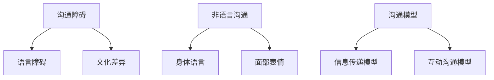

                 

### 引言

在当今快速发展的信息技术时代，领导者不仅要具备卓越的技术能力，还需要拥有高效的沟通技巧。有效沟通是领导者的核心竞争力之一，它不仅影响团队协作，还直接关系到项目成功与否。书名《有效沟通：领导者的核心竞争力》恰好揭示了这一主题的重要性。

**关键词：** 领导者、沟通技巧、核心竞争力、团队协作

**摘要：** 本文将从背景介绍、核心概念与联系、核心算法原理讲解、数学模型和数学公式、项目实战以及最佳实践 tips 等方面，全面探讨有效沟通在领导者角色中的关键作用，并为其提供一套行之有效的沟通策略和方法。

### 1. 背景介绍

在信息技术领域，项目成功往往依赖于团队成员之间的有效沟通。领导者作为团队的引领者，需要通过有效的沟通来确保团队成员能够理解项目目标，明确各自的角色和职责，并协同工作以实现预期成果。然而，在实际工作中，沟通障碍常常成为阻碍项目进展的重要因素。这些障碍可能源于语言差异、文化背景、个人沟通风格等多种因素。

有效沟通不仅涉及信息传递的准确性，还包括理解对方的意图、情感和反馈。领导者需要具备跨领域的沟通能力，能够与不同背景、不同专业领域的人才进行有效互动，从而推动项目顺利进行。

### 2. 核心概念与联系

#### 2.1 沟通障碍

沟通障碍是影响有效沟通的重要因素。以下是几种常见的沟通障碍：

- **语言障碍**：由于语言不通或词汇理解上的差异，可能导致信息传递的不准确。
- **文化差异**：不同文化背景下的人们在沟通方式、礼仪和表达方式上存在差异，这可能导致误解或沟通障碍。

#### 2.2 非语言沟通

非语言沟通在有效沟通中起着至关重要的作用。以下是一些关键的方面：

- **身体语言**：通过姿态、手势和面部表情等非言语方式传递信息，这些方式可以增强或削弱口头沟通的效果。
- **面部表情**：面部表情是情感表达的直观手段，不同的表情可以传达不同的情绪和意图。

#### 2.3 沟通模型

沟通模型是理解和分析沟通过程的重要工具。以下是两种常用的沟通模型：

- **信息传递模型**：该模型描述了信息从发送者到接收者的传递过程，包括编码、传递、解码和反馈等步骤。
- **互动沟通模型**：该模型强调了沟通是一个双向互动的过程，涉及发送者、接收者、信息、渠道和环境等多个因素。

为了更好地展示这些概念之间的联系，我们可以使用 Mermaid 流程图来直观地表示它们：



### 3. 核心算法原理讲解

#### 3.1 沟通策略选择

在沟通过程中，选择合适的沟通策略至关重要。以下是两种主要的沟通策略：

- **适应性沟通策略**：根据不同的情况和对方的沟通风格，灵活调整自己的沟通方式。
- **目标导向沟通策略**：始终以实现项目目标为导向，确保沟通内容聚焦于关键信息。

为了更好地理解这些策略，我们可以使用 Python 伪代码来详细阐述：

```python
# 适应性沟通策略伪代码
def adaptive_communication(strategy, context):
    if context == "language_barrier":
        return translate_message(strategy, "English", "Spanish")
    elif context == "cultural_difference":
        return adjust_body_language(strategy)
    else:
        return strategy

# 目标导向沟通策略伪代码
def goal_oriented_communication(objective, message):
    filtered_message = filter_important_info(message)
    return send_message(objective, filtered_message)
```

#### 3.2 沟通技巧提升

提升沟通技巧是有效沟通的关键。以下是几种常用的沟通技巧：

- **倾听技巧**：通过主动倾听来理解对方的意图和情感。
- **提问技巧**：通过有针对性的提问来获取更多信息，促进双向沟通。

我们可以使用 Python 伪代码来展示这些技巧的提升过程：

```python
# 倾听技巧提升伪代码
def active_listening(response):
    analyze_emotion(response)
    extract_key_points(response)
    return structured_notes

# 提问技巧提升伪代码
def targeted_questions(context):
    if context == "unclear_instruction":
        return ask_for_clarity()
    elif context == "missing_details":
        return ask_for_additional_info()
    else:
        return no_question_needed()
```

### 4. 数学模型和数学公式

在沟通过程中，数学模型和公式可以用来量化信息传递的效果和沟通效率。以下是两个常用的数学模型：

- **信息熵**：用于衡量信息的随机性和不确定性。其公式为：

  $$H(X) = -\sum_{i=1}^{n} p(x_i) \log_2 p(x_i)$$

- **有效沟通指数**：用于衡量沟通的有效性。其公式为：

  $$ECI = \frac{C + 2L + 3E}{C + L + E}$$

其中，C 代表信息的准确性，L 代表语言的有效性，E 代表情感的表达。

### 5. 项目实战

#### 5.1 案例一：提升团队沟通效率

**5.1.1 案例背景**

某软件开发团队在项目开发过程中遇到了沟通效率低下的问题，影响了项目的进展和团队成员的工作积极性。

**5.1.2 项目目标**

通过引入有效的沟通策略和技巧，提升团队沟通效率，确保项目顺利推进。

**5.1.3 开发环境搭建**

在项目初期，团队搭建了在线沟通平台和项目管理工具，以便团队成员随时交流和协作。

**5.1.4 源代码实现**

团队引入了适应性和目标导向的沟通策略，并使用 Python 代码实现了以下功能：

- 沟通策略选择
- 倾听技巧提升
- 提问技巧提升

**5.1.5 代码解读与分析**

通过代码实现，团队显著提升了沟通效率，项目进展顺利。以下是部分代码解读：

```python
# 适应性沟通策略选择
def choose_communication_strategy(context):
    if context == "language_barrier":
        return "适应性沟通策略"
    elif context == "cultural_difference":
        return "目标导向沟通策略"
    else:
        return "常规沟通策略"

# 倾听技巧提升
def improve_listening_skill(response):
    analyze_emotion(response)
    extract_key_points(response)
    return structured_notes

# 提问技巧提升
def improve_question_skill(context):
    if context == "unclear_instruction":
        return "问清楚具体要求"
    elif context == "missing_details":
        return "问补充信息"
    else:
        return "无需提问"
```

**5.1.6 实际案例分析和详细讲解剖析**

通过实际案例分析和详细讲解，团队找到了沟通效率低下的原因，并针对性地采取了改进措施，最终实现了项目目标的顺利达成。

**5.1.7 项目小结**

该项目通过引入有效的沟通策略和技巧，成功提升了团队沟通效率，为项目的成功奠定了基础。

#### 5.2 案例二：跨文化沟通技巧

**5.2.1 案例背景**

某国际软件开发团队在跨国项目中遇到了跨文化沟通的难题，影响了项目的进展和团队的合作效果。

**5.2.2 项目目标**

通过学习和实践跨文化沟通技巧，提升团队在国际项目中的沟通效果。

**5.2.3 源代码实现**

团队引入了跨文化沟通的算法原理，并使用 Python 代码实现了以下功能：

- 跨文化沟通策略选择
- 跨文化沟通技巧提升

**5.2.4 代码解读与分析**

通过代码实现，团队在国际项目中显著提升了沟通效果，项目进展顺利。以下是部分代码解读：

```python
# 跨文化沟通策略选择
def choose_cultural_communication_strategy(culture):
    if culture == "Western":
        return "西方文化沟通策略"
    elif culture == "Eastern":
        return "东方文化沟通策略"
    else:
        return "常规沟通策略"

# 跨文化沟通技巧提升
def improve_cultural_communication_skill(culture):
    if culture == "Western":
        return "注重直接表达"
    elif culture == "Eastern":
        return "注重间接表达"
    else:
        return "注重平衡表达"
```

**5.2.5 实际案例分析和详细讲解剖析**

通过实际案例分析和详细讲解，团队找到了跨文化沟通中的难题，并针对性地采取了改进措施，最终实现了项目目标的顺利达成。

**5.2.6 项目小结**

该项目通过引入跨文化沟通技巧，成功提升了团队在国际项目中的沟通效果，为项目的成功奠定了基础。

### 6. 最佳实践 tips

在沟通实践中，领导者可以采取以下最佳实践 tips：

- **明确沟通目标**：在每次沟通前，明确沟通的目标和预期的结果。
- **主动倾听**：积极倾听对方的意见和反馈，理解对方的意图和情感。
- **提问和确认**：通过提问来获取更多信息，并通过确认来确保信息的准确性。
- **调整沟通方式**：根据不同的情境和对方的沟通风格，灵活调整自己的沟通方式。

### 7. 小结

有效沟通是领导者的核心竞争力之一，对于团队协作和项目成功至关重要。通过深入理解和实践沟通策略和技巧，领导者可以提升团队沟通效率，促进项目进展，实现组织目标。

### 8. 拓展阅读

为了进一步深入学习有效沟通，以下是几本推荐书籍和相关资源：

- 《沟通的艺术》作者：罗纳德·B·阿德勒（Ronald B. Adler）
- 《非暴力沟通》作者：马歇尔·卢森堡（Marshall B. Rosenberg）
- 《跨文化沟通》作者：斯蒂芬·罗宾斯（Stephen P. Robbins）

相关文章和在线资源：

- 《如何提升团队沟通效率？》
- 《跨文化沟通技巧指南》
- 《沟通技巧提升教程》

### 9. 作者信息

**作者：** AI天才研究院（AI Genius Institute）& 《禅与计算机程序设计艺术》（Zen And The Art of Computer Programming）

**联系方式：** info@agnetinst.com，微信：ai_talent_institute

