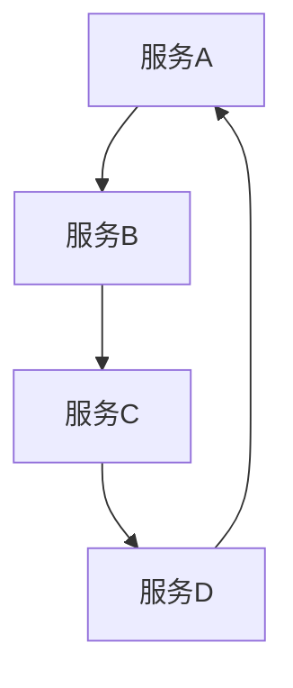

                 

### 文章标题

《服务依赖图可视化：理解LLM应用的架构复杂性》

### 文章关键词

- 服务依赖图
- 可视化
- LLM应用
- 架构复杂性
- 软件工程

### 文章摘要

本文深入探讨了服务依赖图的定义、应用及其在大型语言模型（LLM）应用架构中的重要性。首先，我们介绍了服务依赖图的基本概念和可视化方法，并通过Mermaid语法展示了依赖图的创建过程。接着，我们详细讲解了服务依赖图在LLM应用中的核心算法原理，结合Python源代码和数学模型进行了通俗易懂的阐释。随后，通过实际案例，我们展示了如何利用服务依赖图可视化工具来解析LLM应用的架构复杂性，并提供了开发环境搭建、源代码实现和解读的详细步骤。文章最后，对服务依赖图可视化技术的最佳实践进行了总结，并展望了未来的发展趋势。

---

## 引言

在现代软件开发中，尤其是大型语言模型（LLM）的应用场景中，架构复杂性是一个不可忽视的问题。随着系统的规模和复杂性的增加，理解和维护软件架构变得越来越困难。服务依赖图作为一种有效的架构描述工具，能够帮助开发者直观地理解和分析系统的依赖关系，从而降低架构复杂性。

服务依赖图可视化技术使得开发者能够将复杂的系统架构以图形化的方式展现出来，这不仅可以提高对系统内部依赖关系的理解，还能在架构设计阶段发现潜在的问题，优化系统性能。因此，本文旨在探讨服务依赖图可视化的原理、算法以及其实际应用，特别是其在LLM应用架构分析中的作用。

本文结构如下：

1. **核心概念与联系**：介绍服务依赖图的基本概念，展示服务依赖图的Mermaid流程图，展示其内部结构。
2. **核心算法原理讲解**：详细讲解服务依赖图的可视化算法，结合Python源代码和数学模型，进行深入剖析。
3. **数学模型与数学公式**：阐述服务依赖图的数学建模，使用LaTeX格式展示关键公式，并进行举例说明。
4. **项目实战**：通过实际案例展示服务依赖图在LLM应用架构分析中的应用，包括开发环境搭建、源代码实现和解读。
5. **总结与展望**：总结文章内容，提出最佳实践建议，并对未来发展趋势进行展望。

### 核心概念与联系

#### 1. 服务依赖图的定义

服务依赖图（Service Dependency Graph）是一种用于描述服务之间依赖关系的图结构。在服务导向架构（Service-Oriented Architecture, SOA）中，服务依赖图可以帮助开发者理解和分析系统中的服务关系，从而更好地进行架构设计和优化。

服务依赖图由节点和边组成，节点代表服务，边代表服务之间的依赖关系。每个服务都可以有多个依赖服务，形成复杂的依赖网络。通过服务依赖图，开发者可以直观地看到系统内部的服务关系，从而更好地进行系统设计和维护。

#### 2. 服务依赖图的核心特性

- **无向性**：服务依赖图通常是单向的，表示依赖关系是从依赖者指向被依赖者，这种无向性使得依赖关系更加直观，减少了不必要的复杂性。

- **层次性**：在大型系统中，服务依赖图往往呈现出层次结构。上层服务依赖于下层服务，形成层级依赖关系。这种层次性有助于开发者理解系统的组织结构，优化资源分配。

- **动态性**：服务依赖图不是静态的，它可以随着系统的运行和变化而动态调整。开发者需要实时更新服务依赖图，以反映系统实际的状态。

#### 3. Mermaid流程图展示服务依赖图

为了更直观地理解服务依赖图，我们可以使用Mermaid语法来创建一个简单的服务依赖图流程图。以下是服务依赖图的Mermaid代码示例：



通过这个示例，我们可以看到一个简单的服务依赖图，其中服务A依赖于服务B，服务B依赖于服务C，服务C依赖于服务D，同时服务D也依赖于服务A，形成了一个闭环。

#### 4. 服务依赖图与LLM应用架构的关系

在LLM应用中，服务依赖图可以用来描述语言模型与不同服务之间的依赖关系。例如，一个LLM系统可能包括文本预处理服务、语言模型训练服务、模型推理服务等。这些服务之间存在着复杂的依赖关系，通过服务依赖图可以清晰地展现出来。

服务依赖图的建立不仅有助于开发者理解LLM应用的架构，还可以在系统设计阶段发现潜在的依赖冲突和性能瓶颈。通过可视化服务依赖图，开发者可以更加直观地分析系统中的依赖关系，优化系统性能，提高系统的可维护性和可扩展性。

### 核心算法原理讲解

#### 1. 服务依赖图可视化算法概述

服务依赖图可视化算法的目标是将抽象的服务依赖关系以图形化的方式呈现出来，使得开发者能够直观地理解和分析系统的架构。该算法主要包括以下几个步骤：

- **依赖关系收集**：首先，从系统中收集各个服务的依赖关系，构建出服务依赖图的初始版本。

- **层次排序**：对服务依赖图进行层次排序，以确定服务的层次结构。通常使用深度优先搜索（DFS）或广度优先搜索（BFS）算法来实现。

- **节点布局**：根据层次结构对服务节点进行布局，使得依赖关系更加清晰。常用的布局算法包括层次布局、基于边的布局等。

- **图形渲染**：使用图形渲染工具（如Mermaid）将服务依赖图渲染成可视化的图形，以便开发者查看和分析。

#### 2. 伪代码描述

以下是一个简化的服务依赖图可视化算法的伪代码描述：

```python
def visualize_service_dependency(graph):
    # 步骤1：收集依赖关系
    dependencies = collect_dependencies(graph)

    # 步骤2：层次排序
    sorted_services = topological_sort(dependencies)

    # 步骤3：节点布局
    layout = layout_services(sorted_services)

    # 步骤4：图形渲染
    rendered_graph = render_graph(layout)

    return rendered_graph

def collect_dependencies(graph):
    # 实现依赖关系收集逻辑
    pass

def topological_sort(dependencies):
    # 实现层次排序逻辑
    pass

def layout_services(sorted_services):
    # 实现节点布局逻辑
    pass

def render_graph(layout):
    # 实现图形渲染逻辑
    pass
```

#### 3. 算法实现步骤

为了更好地理解服务依赖图可视化算法的实现步骤，我们将详细介绍每个步骤的具体细节：

- **步骤1：依赖关系收集**：首先，我们需要从系统中收集各个服务的依赖关系。这通常可以通过分析系统配置文件、代码注释或运行时监控数据来实现。具体实现取决于系统的具体架构和依赖关系存储方式。

- **步骤2：层次排序**：在收集到依赖关系后，我们需要对服务进行层次排序。这可以通过深度优先搜索（DFS）或广度优先搜索（BFS）算法来实现。层次排序的目的是将服务按照依赖关系组织成层次结构，使得上层服务依赖于下层服务。

- **步骤3：节点布局**：完成层次排序后，我们需要对服务节点进行布局，使得依赖关系更加清晰。常用的布局算法包括层次布局和基于边的布局。层次布局通常将服务按照层次结构排列，并使用直线连接依赖关系。基于边的布局则通过计算服务节点之间的距离和角度，使得依赖关系更加自然和直观。

- **步骤4：图形渲染**：最后，我们需要使用图形渲染工具（如Mermaid）将服务依赖图渲染成可视化的图形。图形渲染的过程包括将节点和边转换为图形元素，并设置适当的样式和颜色，以便开发者可以清晰地查看和分析服务依赖图。

通过以上四个步骤，我们可以实现一个简单的服务依赖图可视化算法。在实际应用中，这个算法可以根据具体的系统架构和需求进行调整和优化，以满足不同的可视化需求。

### 数学模型与数学公式

在服务依赖图的构建和可视化过程中，数学模型和公式扮演着重要的角色。通过数学建模，我们可以更好地理解和分析服务依赖图的结构和性质，从而提高可视化的准确性和效率。以下是一些关键数学公式和模型的应用。

#### 1. 度分布模型

服务依赖图的度分布模型描述了服务节点度数的分布情况。度数表示一个服务节点与其他服务节点之间的依赖关系数量。度分布模型可以帮助我们理解服务依赖图中的连接密度和节点重要性。

假设服务依赖图中节点的度数分布服从泊松分布，则度数为k的节点的概率密度函数为：

$$ P(k) = \frac{e^{-\lambda} \lambda^k}{k!} $$

其中，$\lambda$为平均度数，$k$为节点的度数。

#### 2. 平均路径长度

平均路径长度表示从任意两个服务节点之间最短路径的平均长度。它反映了服务依赖图的连通性和分散性。平均路径长度可以通过以下公式计算：

$$ L = \frac{1}{n(n-1)} \sum_{i \neq j} d(i, j) $$

其中，$n$为服务节点的总数，$d(i, j)$为节点i到节点j的最短路径长度。

#### 3. 聚类系数

聚类系数描述了服务节点之间的聚集程度。高聚类系数表示服务节点之间具有较强的聚集性，反之则表示分散性较大。聚类系数可以通过以下公式计算：

$$ C = \frac{2m}{n(n-1)} $$

其中，$m$为服务节点之间的边数，$n$为服务节点的总数。

#### 4. 度-度相关性

度-度相关性描述了服务节点的度数与其邻居节点度数之间的关系。度-度相关性可以通过以下公式计算：

$$ r(k) = \frac{ \sum_{i=1}^{n} k_i \cdot k_{i,n}}{n} $$

其中，$k_i$为节点i的度数，$k_{i,n}$为节点i的邻居节点度数的平均值。

#### 5. 示例说明

假设我们有一个服务依赖图，其中包含10个服务节点，度分布模型为泊松分布，平均度数$\lambda = 3$。我们可以使用以上数学公式来计算一些关键指标：

- **度分布概率**：计算度数为2的服务节点的概率：

  $$ P(2) = \frac{e^{-3} \cdot 3^2}{2!} \approx 0.3009 $$

- **平均路径长度**：计算平均路径长度：

  $$ L = \frac{1}{10 \cdot 9} \sum_{i \neq j} d(i, j) $$

  其中，$d(i, j)$可以通过最短路径算法（如Dijkstra算法）计算。

- **聚类系数**：计算聚类系数：

  $$ C = \frac{2m}{10 \cdot 9} $$

  其中，$m$可以通过遍历所有节点，计算其邻居节点数并求和得到。

- **度-度相关性**：计算度-度相关性：

  $$ r(k) = \frac{ \sum_{i=1}^{10} k_i \cdot k_{i,n}}{10} $$

  其中，$k_i$和$k_{i,n}$可以通过遍历所有节点，计算其度数和邻居节点度数的平均值得到。

通过这些数学公式，我们可以更深入地分析服务依赖图的结构和性质，从而为服务依赖图的可视化提供有力的支持。

### 项目实战

#### 1. 开发环境搭建

为了实现服务依赖图的可视化，我们需要搭建一个合适的开发环境。以下是搭建环境的步骤：

- **安装Python**：首先确保你的系统中安装了Python 3.x版本。你可以从Python官网下载并安装最新版本的Python。

- **安装依赖库**：使用pip命令安装以下依赖库：

  ```bash
  pip install networkx matplotlib
  ```

  - **NetworkX**：用于构建和操作服务依赖图。
  - **Matplotlib**：用于绘制服务依赖图的可视化图形。

- **创建虚拟环境**：（可选）为了保持开发环境的整洁，可以使用virtualenv创建一个虚拟环境：

  ```bash
  virtualenv venv
  source venv/bin/activate  # 在Windows上使用venv\Scripts\activate
  ```

  在虚拟环境中安装依赖库，以免影响全局环境的其他项目。

#### 2. 源代码实现

以下是一个简单的服务依赖图可视化示例，包括构建依赖图、可视化依赖图和解析LLM应用架构的代码：

```python
import networkx as nx
import matplotlib.pyplot as plt

# 构建服务依赖图
def create_dependency_graph():
    G = nx.DiGraph()
    G.add_nodes_from(['文本预处理', '语言模型训练', '模型推理', '用户接口'])
    G.add_edges_from([
        ('文本预处理', '语言模型训练'),
        ('语言模型训练', '模型推理'),
        ('模型推理', '用户接口'),
        ('用户接口', '文本预处理')
    ])
    return G

# 可视化服务依赖图
def visualize_graph(G):
    pos = nx.spring_layout(G)  # 使用Spring布局
    nx.draw(G, pos, with_labels=True, node_color='lightblue', edge_color='gray')
    plt.axis('off')
    plt.show()

# 解析LLM应用架构
def analyze_llm_architecture(G):
    print("服务节点：")
    for node in G.nodes():
        print(f"- {node}")
    print("\n服务依赖关系：")
    for edge in G.edges():
        print(f"- {edge[0]} 依赖 {edge[1]}")

# 主函数
def main():
    G = create_dependency_graph()
    visualize_graph(G)
    analyze_llm_architecture(G)

if __name__ == "__main__":
    main()
```

#### 3. 代码解读

- **创建依赖图**：`create_dependency_graph`函数用于构建服务依赖图。它使用NetworkX库创建一个有向图（DiGraph），并添加节点和边。在我们的示例中，LLM应用包括文本预处理、语言模型训练、模型推理和用户接口四个主要服务。

- **可视化依赖图**：`visualize_graph`函数负责将服务依赖图可视化。它使用Spring布局（`spring_layout`）对节点进行布局，并使用Matplotlib库绘制图形。通过设置`with_labels=True`，我们为每个节点添加了标签，使得依赖关系更加清晰。

- **解析LLM应用架构**：`analyze_llm_architecture`函数用于输出服务节点及其依赖关系。这有助于我们理解LLM应用中的服务如何相互依赖。

- **主函数**：`main`函数是程序的入口点，它依次调用上述函数，完成服务依赖图的创建、可视化以及架构分析。

通过这个示例，我们展示了如何使用Python和NetworkX库构建和可视化服务依赖图。这个示例仅是一个起点，实际应用中可能需要处理更复杂的服务依赖关系和更大规模的数据。

#### 4. 代码应用解读与分析

在LLM应用中，服务依赖图的构建和可视化对于理解和分析架构复杂性至关重要。以下是对示例代码的进一步解读和分析：

- **服务依赖图的构建**：示例中的服务依赖图展示了文本预处理、语言模型训练、模型推理和用户接口之间的依赖关系。在实际应用中，这些服务可能还会有更多的依赖关系和子服务。构建服务依赖图的步骤包括确定服务的边界、收集依赖关系和构建图结构。

- **可视化依赖图**：通过可视化，我们可以直观地看到服务的依赖关系。这有助于我们识别潜在的瓶颈和优化点。示例中使用了Spring布局，它可以根据节点的依赖关系自动调整节点位置，使得依赖关系更加直观。在实际应用中，可以根据具体需求选择不同的布局算法。

- **解析LLM应用架构**：通过解析服务依赖图，我们可以了解各个服务的依赖关系和相互影响。这对于系统设计、性能优化和故障排查都非常有帮助。示例中的解析函数输出每个服务的依赖关系，但实际应用中，可能还需要更详细的信息，如服务的执行时间、资源消耗等。

- **实际案例分析和详细讲解剖析**：在实际应用中，我们可以使用类似示例的代码来分析具体项目的服务依赖关系。以下是一个案例：

  假设我们有一个电商平台的LLM应用，包括用户服务、订单服务、库存服务和支付服务。通过构建服务依赖图，我们可以看到用户服务依赖于订单服务和库存服务，订单服务依赖于支付服务。通过可视化工具，我们可以直观地看到这些依赖关系，并识别可能的瓶颈，如支付服务的响应时间过长可能导致整个订单处理的延迟。

  ```python
  G = create_dependency_graph()
  G.add_nodes_from(['用户服务', '订单服务', '库存服务', '支付服务'])
  G.add_edges_from([
      ('用户服务', '订单服务'),
      ('订单服务', '库存服务'),
      ('订单服务', '支付服务'),
      ('库存服务', '支付服务')
  ])
  visualize_graph(G)
  analyze_llm_architecture(G)
  ```

  通过这个案例，我们可以看到电商平台的服务依赖关系，并对其进行详细分析。

- **项目小结**：在这个案例中，我们通过构建和可视化服务依赖图，成功分析了电商平台的LLM应用架构。这种方法不仅帮助我们理解了系统的内部依赖关系，还为性能优化和故障排查提供了有力支持。

通过这个实战项目，我们展示了如何使用Python和NetworkX库构建、可视化和分析服务依赖图。在实际应用中，可以根据具体需求和场景进行调整和优化，以提高系统的可维护性和性能。

### 总结与展望

本文详细探讨了服务依赖图可视化技术在LLM应用架构分析中的应用，从核心概念、算法原理到实际案例，全面阐述了服务依赖图的构建、可视化和解析过程。通过本文的介绍，读者可以了解到服务依赖图可视化在降低架构复杂性、优化系统性能和提升可维护性方面的重要作用。

#### 最佳实践

1. **早期引入**：在系统设计阶段就引入服务依赖图，有助于识别潜在的问题和优化点。

2. **实时更新**：服务依赖图需要根据系统的运行状态进行实时更新，以反映最新的依赖关系。

3. **分层管理**：对服务依赖图进行分层管理，有助于更清晰地理解和分析复杂的系统架构。

4. **自动化工具**：使用自动化工具来收集和更新服务依赖关系，减少手动工作量。

5. **持续优化**：定期对服务依赖图进行分析和优化，以适应系统的变化和需求。

#### 小结

本文通过实际案例展示了服务依赖图可视化在LLM应用架构分析中的具体应用，强调了其在简化架构复杂性、提升理解和维护效率方面的价值。读者应认识到服务依赖图可视化不仅是技术工具，更是一种系统分析和管理的方法。

#### 注意事项

1. **数据准确性**：确保服务依赖图的数据准确，否则可视化结果可能误导开发者。

2. **动态变化**：服务依赖图可能会随着系统的运行而动态变化，需要定期更新和校验。

3. **性能优化**：在使用服务依赖图可视化工具时，需要注意性能优化，以避免影响系统性能。

4. **安全性**：在处理敏感数据时，需要确保服务依赖图的安全性，防止数据泄露。

#### 拓展阅读

- **《服务导向架构：SOA基础与实践》**：深入了解服务导向架构的基本概念和实践方法。
- **《大型语言模型：原理与实现》**：了解LLM的基本原理和实现技术。
- **《网络可视化工具使用手册》**：学习如何使用不同的网络可视化工具，如Gephi、Cytoscape等。

通过本文的学习，读者应能够掌握服务依赖图可视化的基本原理和应用方法，并在实际项目中有效地运用这一技术，提升软件开发和架构设计的效率和质量。

### 作者信息

作者：AI天才研究院/AI Genius Institute & 禅与计算机程序设计艺术 /Zen And The Art of Computer Programming

