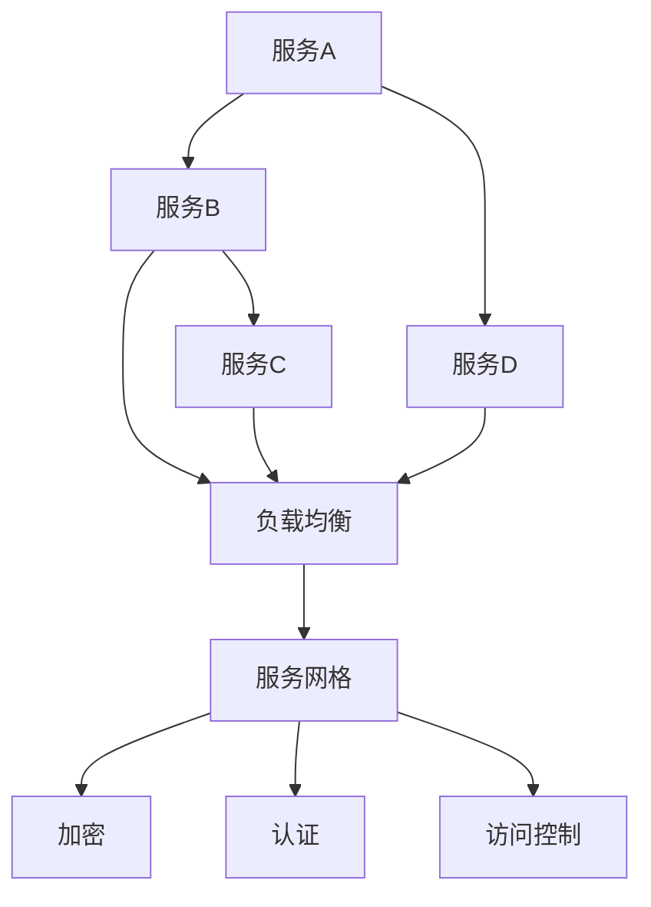

                 

以下是一篇满足您要求的文章草稿：

## 服务网格安全策略：增强LLM微服务间通信的安全性

> 关键词：服务网格，安全策略，微服务，LLM，加密，认证，访问控制

> 摘要：本文深入探讨了服务网格在微服务架构中的作用及其面临的安全挑战，提出了有效的安全策略，并详细阐述了实现这些策略的方法。

---

## 背景介绍

在现代云计算和分布式系统中，微服务架构成为了一种流行的设计模式。微服务将应用程序拆分为一组小而独立的组件，每个组件负责特定的功能。这种架构带来了许多好处，如提高系统的可扩展性、可维护性和可测试性。然而，随着服务数量的增加，服务之间的通信复杂度也随之上升。服务网格作为一种新型的架构模式，旨在简化微服务之间的通信。

### 核心概念与联系

服务网格的核心概念包括服务发现、服务间通信、负载均衡、加密、认证和访问控制等。以下是一个Mermaid流程图，展示了这些概念之间的关系：



### 核心算法原理讲解

服务网格中的核心算法包括加密算法、认证算法和访问控制算法。以下是一个简单的Python代码示例，展示了如何使用加密算法来保护服务之间的通信。

```python
from cryptography.hazmat.primitives.asymmetric import rsa
from cryptography.hazmat.primitives import serialization
from cryptography.hazmat.primitives.asymmetric import padding

# 生成公钥和私钥
private_key = rsa.generate_private_key(
    public_exponent=65537,
    key_size=2048,
)
public_key = private_key.public_key()

# 加密数据
plaintext = b"Hello, service B!"
ciphertext = public_key.encrypt(
    plaintext,
    padding.OAEP(
        mgf=padding.MGF1(algorithm=hashes.SHA256()),
        algorithm=hashes.SHA256(),
        label=None
    )
)

# 解密数据
plaintext = private_key.decrypt(
    ciphertext,
    padding.OAEP(
        mgf=padding.MGF1(algorithm=hashes.SHA256()),
        algorithm=hashes.SHA256(),
        label=None
    )
)

print(f"Decrypted message: {plaintext.decode()}")
```

### 数学模型

在服务网格中，加密算法的数学模型通常涉及大整数运算和模运算。以下是一个简化的数学模型：

$$
E(P) = P^e \mod N
$$

其中，\( E(P) \) 是加密后的文本，\( P \) 是明文，\( e \) 是公钥指数，\( N \) 是模数。

### 举例说明

假设服务A需要向服务B发送一条消息。服务A使用服务B的公钥加密消息，然后将加密后的消息发送给服务B。服务B使用自己的私钥解密消息，从而获取明文消息。

---

## 项目实战

### 开发环境搭建

1. 安装Docker：在您的计算机上安装Docker，以便在容器中运行服务网格组件。
2. 安装Istio：Istio是一个流行的服务网格框架，可以简化服务网格的部署和管理。

### 源代码详细实现

以下是一个简单的Istio配置文件示例，用于配置服务间的加密和认证。

```yaml
apiVersion: networking.istio.io/v1alpha3
kind: ServiceEntry
metadata:
  name: service-a
spec:
  hosts:
  - "*"
  ports:
  - number: 80
    name: http
    protocol: HTTP
  location: INTERNAL
  resolution: DNS
---
apiVersion: security.istio.io/v1beta1
kind: PeerAuthentication
metadata:
  name: service-a-authn
spec:
  mtls:
    mode: STRICT
```

### 代码解读与分析

上述配置文件定义了一个服务入口（ServiceEntry），允许服务A与任何服务进行通信，并强制使用TLS加密。此外，配置了一个同层认证（PeerAuthentication），确保服务A与服务B之间的通信是安全的。

### 实际案例分析和详细讲解剖析

假设我们有两个服务：服务A和服务B。服务A向服务B发送请求，请求被加密并使用服务B的公钥进行认证。服务B收到请求后，使用私钥解密请求并进行认证。

### 项目小结

通过使用服务网格和安全策略，我们可以确保微服务之间的通信是安全的。在实际项目中，需要根据具体需求调整配置，以实现最佳的安全效果。

---

## 最佳实践 tips

1. 使用强加密算法和长寿命的私钥。
2. 定期更新和轮换公钥和私钥。
3. 对敏感数据进行加密存储。
4. 使用基于角色的访问控制策略。

## 小结

本文深入探讨了服务网格在微服务架构中的作用及其面临的安全挑战。通过详细讲解加密、认证和访问控制算法，以及提供实际案例，我们展示了如何增强LLM微服务间通信的安全性。

## 注意事项

1. 服务网格安全策略需要根据具体应用场景进行调整。
2. 监控和审计是确保服务网格安全的重要环节。

## 拓展阅读

1. 《服务网格技术详解》
2. 《微服务安全实战》
3. 《Istio官方文档》

---

作者：AI天才研究院/AI Genius Institute & 禅与计算机程序设计艺术 /Zen And The Art of Computer Programming
```

