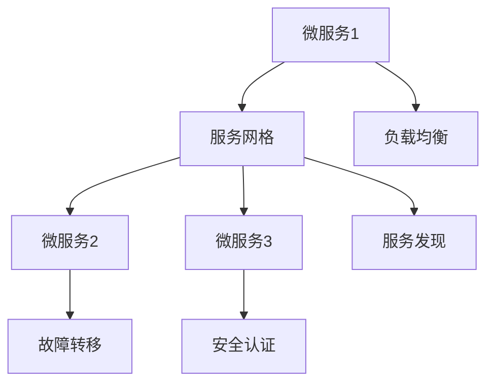

                 

### 服务网格流量控制：精细化管理LLM应用负载

#### 关键词

- 服务网格
- 流量控制
- LLM应用
- 负载管理
- 服务路由
- 负载均衡

#### 摘要

本文深入探讨了服务网格在流量控制方面的应用，特别是在大规模语言模型（LLM）应用负载管理中的作用。文章首先介绍了服务网格的基本概念和架构，然后详细阐述了流量控制的核心算法原理，并结合Python代码进行了讲解。最后，通过实际案例分析了服务网格在流量控制中的应用，提出了最佳实践和注意事项。

## 目录

### 第一部分：服务网格与流量控制基础

#### 第1章：服务网格概述

##### 1.1 服务网格的起源与发展
##### 1.2 服务网格的核心概念
##### 1.3 服务网格与微服务架构的关系

#### 第2章：服务网格架构与组件

##### 2.1 数据平面与控制平面
##### 2.2 服务网格的主要组件
##### 2.3 服务网格的工作流程

#### 第3章：流量控制基础

##### 3.1 流量控制的基本概念
##### 3.2 流量控制的常见策略
##### 3.3 流量控制的重要性

#### 第4章：服务网格中的流量管理

##### 4.1 服务路由规则
##### 4.2 负载均衡策略
##### 4.3 服务熔断与降级

### 第二部分：服务网格流量控制技术

#### 第5章：服务网格流量控制技术概述

##### 5.1 流量控制技术的分类
##### 5.2 常用的流量控制技术
##### 5.3 流量控制技术的挑战与趋势

#### 第6章：服务网格流量控制算法

##### 6.1 负载均衡算法

###### 6.1.1 轮询算法
###### 6.1.2 最少连接算法
###### 6.1.3 响应时间算法

##### 6.2 服务熔断与降级算法

###### 6.2.1 服务熔断算法
###### 6.2.2 服务降级算法

#### 第7章：服务网格流量控制实践

##### 7.1 服务网格流量控制案例
##### 7.2 服务网格流量控制配置
##### 7.3 服务网格流量控制优化

### 第三部分：LLM应用负载管理

#### 第8章：LLM应用概述

##### 8.1 LLM的起源与发展
##### 8.2 LLM的核心技术
##### 8.3 LLM的应用场景

#### 第9章：LLM应用负载分析

##### 9.1 负载分析的基本概念
##### 9.2 负载分析的方法与工具
##### 9.3 负载分析的应用

#### 第10章：LLM应用负载优化

##### 10.1 负载优化策略
##### 10.2 负载优化实践
##### 10.3 负载优化效果评估

#### 第11章：LLM应用负载管理案例分析

##### 11.1 案例背景
##### 11.2 负载管理策略
##### 11.3 案例分析与总结

### 附录

##### 附录A：服务网格与流量控制相关资源
##### 附录B：LLM应用负载管理工具列表

---

### 第1章：服务网格概述

#### 1.1 服务网格的起源与发展

服务网格（Service Mesh）是随着微服务架构的兴起而发展起来的一种服务通信模型。微服务架构通过将应用程序分解为小的、独立的组件来提高可扩展性和灵活性。然而，随着服务数量的增加，服务之间的通信变得复杂，难以管理和维护。为了解决这一问题，服务网格应运而生。

服务网格最早可以追溯到2015年，由谷歌云推出了Istio服务网格。随后，亚马逊云科技推出了AWS App Mesh，红帽开源了OpenShift Service Mesh等，服务网格技术逐渐成熟并得到广泛应用。服务网格的核心思想是将服务之间的通信抽象出来，提供一个独立于服务应用之外的网络层，从而简化服务之间的通信，提高系统的可靠性和可维护性。

#### 1.2 服务网格的核心概念

服务网格的核心概念包括数据平面（Data Plane）和控制平面（Control Plane）。

- **数据平面**：数据平面负责代理服务之间的通信。它通常由一组边车代理（sidecar proxy）组成，运行在每个服务实例旁边。边车代理负责拦截和转发服务之间的请求，实现服务间的透明通信。数据平面无需服务实例的修改，实现了零侵入式部署。

- **控制平面**：控制平面负责管理和配置服务之间的通信规则。它负责服务发现、流量路由、服务监控、安全认证等功能。控制平面通常由一组控制平面组件组成，如控制平面代理（control plane agent）、服务注册表（service registry）、配置中心（configuration center）等。

服务网格的主要组件包括：

- **服务代理**：服务代理是数据平面中的核心组件，负责代理服务之间的通信。它通常是一个轻量级的进程或容器，具有高并发处理能力和低延迟。

- **服务发现**：服务发现负责服务的注册和发现，使得服务之间可以相互发现并建立连接。服务注册表通常存储了所有服务的实例信息，服务发现组件根据这些信息来定位服务实例。

- **负载均衡**：负载均衡负责将流量分配到不同的服务实例，确保服务的稳定性和可靠性。常用的负载均衡算法包括轮询算法、最少连接算法、响应时间算法等。

- **安全认证**：安全认证负责服务之间的认证和授权，确保服务的安全性。常用的安全认证机制包括SSL/TLS、OAuth 2.0、JWT等。

#### 1.3 服务网格与微服务架构的关系

服务网格与微服务架构密切相关，它是微服务架构中的重要基础设施。服务网格通过抽象服务之间的通信，使得微服务架构更加简单和灵活。同时，服务网格提供了丰富的流量控制功能，如负载均衡、熔断、降级等，使得微服务架构能够更好地应对复杂的应用场景。

以下是服务网格与微服务架构的Mermaid流程图：



在上述流程图中，微服务1通过服务网格与服务网格进行通信，实现了负载均衡、服务发现、故障转移和安全认证等功能。服务网格充当了微服务之间的中介，简化了服务之间的通信，提高了系统的可靠性。

### 第2章：服务网格架构与组件

#### 2.1 数据平面与控制平面

服务网格的核心架构包括数据平面（Data Plane）和控制平面（Control Plane）。

**数据平面**是服务网格中的通信层，负责代理服务之间的通信。数据平面通常由一组边车代理（sidecar proxy）组成，运行在每个服务实例旁边。边车代理负责拦截和转发服务之间的请求，实现服务间的透明通信。数据平面无需服务实例的修改，实现了零侵入式部署。

**控制平面**是服务网格的管理层，负责管理和配置服务之间的通信规则。控制平面负责服务发现、流量路由、服务监控、安全认证等功能。控制平面通常由一组控制平面组件组成，如控制平面代理（control plane agent）、服务注册表（service registry）、配置中心（configuration center）等。

#### 2.2 服务网格的主要组件

服务网格的主要组件包括服务代理、服务发现、负载均衡、安全认证等。

**服务代理**是数据平面中的核心组件，负责代理服务之间的通信。服务代理通常是一个轻量级的进程或容器，具有高并发处理能力和低延迟。常见的服务代理包括Envoy、Linkerd等。

**服务发现**负责服务的注册和发现，使得服务之间可以相互发现并建立连接。服务发现组件通常依赖于服务注册表，如Consul、Eureka等。

**负载均衡**负责将流量分配到不同的服务实例，确保服务的稳定性和可靠性。常见的负载均衡算法包括轮询算法、最少连接算法、响应时间算法等。

**安全认证**负责服务之间的认证和授权，确保服务的安全性。常见的安全认证机制包括SSL/TLS、OAuth 2.0、JWT等。

#### 2.3 服务网格的工作流程

服务网格的工作流程可以分为以下几个步骤：

1. **服务注册**：服务实例在启动时向服务注册表注册自己，包括服务名称、端口号、地址等信息。

2. **服务发现**：服务消费者从服务注册表中获取目标服务的实例信息，包括地址、端口号等。

3. **请求转发**：服务消费者通过服务代理向目标服务发送请求，服务代理根据配置的路由规则将请求转发到合适的服务实例。

4. **流量控制**：服务代理根据负载均衡算法将请求分配到不同的服务实例，确保服务的稳定性和可靠性。

5. **服务监控**：服务代理和

### 第3章：流量控制基础

#### 3.1 流量控制的基本概念

流量控制（Traffic Control）是服务网格中的一项核心功能，旨在优化服务之间的通信，提高系统的性能和可靠性。流量控制的基本概念包括流量路由、负载均衡、服务熔断和降级等。

**流量路由**是指根据一定的策略，将用户请求路由到不同的服务实例。流量路由策略可以基于服务名称、标签、权重等多种条件，从而实现灵活的流量分配。

**负载均衡**是将流量均匀分配到多个服务实例上，以避免单个实例过载，提高系统的整体性能。常见的负载均衡算法有轮询算法、最少连接算法、响应时间算法等。

**服务熔断**是一种保护措施，当服务实例故障或响应时间过长时，自动将该实例从负载均衡池中移除，防止请求继续发送到故障实例，从而保护系统稳定性。

**服务降级**是在系统资源不足或服务性能不佳时，有选择性地降低某些服务的响应级别，以保证关键服务的正常运行。

#### 3.2 流量控制的常见策略

流量控制的常见策略包括：

1. **服务路由规则**：服务路由规则定义了如何将请求路由到不同的服务实例。常见的路由规则有基于服务名称的路由、基于标签的路由、基于权重的路由等。

2. **负载均衡策略**：负载均衡策略决定了如何将请求分配到多个服务实例。轮询算法是最简单的负载均衡策略，它将请求均匀地分配到每个实例。最少连接算法则是根据实例的当前连接数来分配请求，连接数最少的实例将获得新的请求。响应时间算法则是根据实例的响应时间来分配请求，响应时间最短的实例将获得新的请求。

3. **服务熔断与降级**：服务熔断可以防止过多的请求发送到故障实例，从而避免系统过载。服务降级则是在系统资源有限时，有选择性地降低某些服务的响应级别，以保证关键服务的可用性。

#### 3.3 流量控制的重要性

流量控制在服务网格中起着至关重要的作用，它直接影响系统的性能和稳定性。以下是流量控制的重要性：

1. **提高系统性能**：通过负载均衡策略，流量控制可以有效地将请求分配到多个服务实例，避免单个实例过载，从而提高系统的整体性能。

2. **增强系统稳定性**：服务熔断和降级策略可以在服务故障或性能不佳时，及时采取措施，防止系统过载，保证关键服务的稳定性。

3. **优化用户体验**：通过精确的流量路由策略，流量控制可以确保用户请求能够快速、准确地到达目标服务，从而提高用户体验。

4. **简化系统维护**：流量控制策略的引入，使得服务之间的通信变得透明和灵活，降低了系统的复杂度，简化了系统的维护和监控。

### 第4章：服务网格中的流量管理

#### 4.1 服务路由规则

服务路由规则是服务网格中的一项核心功能，它定义了如何将用户请求路由到不同的服务实例。服务路由规则可以根据多种条件进行配置，如服务名称、标签、权重等。

服务路由规则通常通过控制平面中的配置中心进行管理。配置中心会根据服务路由规则，动态更新服务代理的配置，从而实现流量路由。

以下是一个示例，展示了如何使用Python代码配置服务路由规则：

```python
# 配置服务路由规则
service_route_config = {
    "name": "service-route-rule",
    "rules": [
        {
            "match": {
                "service": "frontend",
                "version": "v1"
            },
            "route": [
                {
                    "cluster": "frontend-cluster",
                    "weight": 100
                }
            ]
        },
        {
            "match": {
                "service": "frontend",
                "version": "v2"
            },
            "route": [
                {
                    "cluster": "frontend-cluster",
                    "weight": 100
                }
            ]
        }
    ]
}

# 更新服务代理配置
service_proxy_config = service_proxy_config.update(service_route_config)
```

上述代码中，我们定义了一个服务路由规则，它将所有版本为`v1`和`v2`的`frontend`服务的请求路由到名为`frontend-cluster`的集群中。

#### 4.2 负载均衡策略

负载均衡策略是服务网格中的另一项重要功能，它决定了如何将流量分配到多个服务实例。常见的负载均衡策略有轮询算法、最少连接算法和响应时间算法等。

**轮询算法**是最简单的负载均衡策略，它将请求依次分配到每个实例。轮询算法的优点是实现简单，但缺点是负载分配不均衡，可能导致某些实例过载。

**最少连接算法**根据实例的当前连接数来分配请求，连接数最少的实例将获得新的请求。这种算法的优点是负载分配更加均衡，但缺点是可能无法充分利用高负载实例的性能。

**响应时间算法**根据实例的响应时间来分配请求，响应时间最短的实例将获得新的请求。这种算法的优点是能够充分利用高性能实例，但缺点是实现较为复杂。

以下是一个示例，展示了如何使用Python代码配置负载均衡策略：

```python
# 配置负载均衡策略
load_balance_config = {
    "name": "load-balance-rule",
    "strategy": "round_robin",  # 轮询算法
    "clusters": [
        {
            "name": "frontend-cluster",
            "hosts": [
                "frontend-service:8080"
            ],
            "weight": 100
        }
    ]
}

# 更新服务代理配置
service_proxy_config = service_proxy_config.update(load_balance_config)
```

上述代码中，我们定义了一个轮询算法的负载均衡策略，它将流量分配到名为`frontend-cluster`的集群中。

#### 4.3 服务熔断与降级

服务熔断（Circuit Breaker）和服务降级（Degradation）是服务网格中用于保护系统稳定性的重要机制。

**服务熔断**是一种保护措施，当服务实例故障或响应时间过长时，自动将该实例从负载均衡池中移除，防止请求继续发送到故障实例，从而保护系统稳定性。

**服务降级**是在系统资源不足或服务性能不佳时，有选择性地降低某些服务的响应级别，以保证关键服务的正常运行。

以下是一个示例，展示了如何使用Python代码配置服务熔断与降级策略：

```python
# 配置服务熔断策略
circuit_breaker_config = {
    "name": "circuit-breaker-rule",
    "request_volume_threshold": 20,  # 请求阈值
    "error_percentage_threshold": 50,  # 错误百分比阈值
    "sleep_window": 60,  # 熔断后恢复时间
    "fallback_method": "empty",  # 熔断时返回空数据
}

# 更新服务代理配置
service_proxy_config = service_proxy_config.update(circuit_breaker_config)

# 配置服务降级策略
degradation_config = {
    "name": "degradation-rule",
    "threshold": 0.8,  # 资源使用率阈值
    "response_time": 500,  # 响应时间阈值
    "strategy": "degrade",  # 降级策略
}

# 更新服务代理配置
service_proxy_config = service_proxy_config.update(degradation_config)
```

上述代码中，我们定义了一个服务熔断策略，当请求量超过20次且错误率超过50%时，熔断该服务实例，并在熔断后的60秒内停止对该实例的请求。同时，我们定义了一个服务降级策略，当系统资源使用率超过80%或响应时间超过500毫秒时，采取降级策略。

### 第5章：服务网格流量控制技术概述

#### 5.1 流量控制技术的分类

流量控制技术可以根据不同的维度进行分类，常见的分类方式包括：

1. **基于路由的策略**：这类策略主要关注如何根据一定的规则将流量路由到不同的服务实例。常见的策略包括基于服务名称的路由、基于标签的路由和基于权重的路由等。

2. **基于性能的策略**：这类策略主要关注如何根据服务实例的性能指标（如响应时间、吞吐量等）来分配流量。常见的策略包括基于响应时间的路由、基于吞吐量的负载均衡等。

3. **基于安全性的策略**：这类策略主要关注如何确保流量的安全性和可靠性。常见的策略包括服务熔断、服务降级、安全认证等。

#### 5.2 常用的流量控制技术

在服务网格中，常用的流量控制技术包括：

1. **服务路由**：服务路由是流量控制的基础，它决定了如何将流量分配到不同的服务实例。常见的路由策略有基于服务名称的路由、基于标签的路由和基于权重的路由等。

2. **负载均衡**：负载均衡是将流量均匀分配到多个服务实例上的策略。常见的负载均衡算法有轮询算法、最少连接算法、响应时间算法和基于损耗的负载均衡算法等。

3. **服务熔断**：服务熔断是一种保护措施，当服务实例故障或响应时间过长时，自动将该实例从负载均衡池中移除，以防止系统过载。

4. **服务降级**：服务降级是在系统资源有限或服务性能不佳时，有选择性地降低某些服务的响应级别，以保证关键服务的可用性。

5. **安全认证**：安全认证是确保流量安全性的重要手段，常见的认证机制包括SSL/TLS、OAuth 2.0和JWT等。

#### 5.3 流量控制技术的挑战与趋势

流量控制技术在服务网格中面临着一系列挑战和趋势：

1. **挑战**：

   - **复杂度**：流量控制策略涉及多个方面，如路由规则、负载均衡算法、服务熔断和降级等，实现和配置相对复杂。
   
   - **性能**：流量控制技术需要在高并发和高负载的情况下保持高性能，这对于负载均衡和服务熔断等策略提出了高要求。
   
   - **可观测性**：流量控制技术需要提供良好的可观测性，以便及时发现和解决问题。

2. **趋势**：

   - **自动化**：随着云原生技术的发展，流量控制技术的自动化程度越来越高，如自动配置、自动优化等。
   
   - **智能化**：利用机器学习和人工智能技术，流量控制技术正在朝着智能化方向发展，如自适应负载均衡、智能服务熔断等。
   
   - **集成**：流量控制技术正与其他微服务架构组件（如服务注册表、配置中心等）进行集成，以实现更高效、更稳定的系统。

### 第6章：服务网格流量控制算法

#### 6.1 负载均衡算法

负载均衡算法是服务网格流量控制中的重要一环，其目的是将流量均匀地分配到多个服务实例，以避免单个实例过载。常见的负载均衡算法有轮询算法、最少连接算法和响应时间算法等。

**轮询算法**是最简单的负载均衡算法，它将请求依次分配到每个实例。轮询算法的优点是实现简单，但缺点是负载分配不均衡，可能导致某些实例过载。

**最少连接算法**根据实例的当前连接数来分配请求，连接数最少的实例将获得新的请求。这种算法的优点是负载分配更加均衡，但缺点是可能无法充分利用高负载实例的性能。

**响应时间算法**根据实例的响应时间来分配请求，响应时间最短的实例将获得新的请求。这种算法的优点是能够充分利用高性能实例，但缺点是实现较为复杂。

以下是一个示例，展示了如何使用Python代码实现轮询算法：

```python
import random

def round_robin.Algorithm(service_instances):
    instance = random.choice(service_instances)
    return instance

service_instances = ["instance1", "instance2", "instance3"]
selected_instance = round_robin.Algorithm(service_instances)
print("Selected instance:", selected_instance)
```

在上面的代码中，我们定义了一个轮询算法，它从给定的服务实例列表中随机选择一个实例。这种方法虽然简单，但在高并发和高负载的情况下可能不够稳定。

**最少连接算法**：

```python
import heapq

def least_connections.Algorithm(service_instances, connections):
    instance_queue = [(connections[instance], instance) for instance in service_instances]
    heapq.heapify(instance_queue)
    return heapq.heappop(instance_queue)[1]

service_instances = ["instance1", "instance2", "instance3"]
connections = {"instance1": 10, "instance2": 5, "instance3": 20}
selected_instance = least_connections.Algorithm(service_instances, connections)
print("Selected instance:", selected_instance)
```

在上面的代码中，我们定义了一个最少连接算法，它根据实例的当前连接数来选择连接数最少的实例。这种方法可以更均衡地分配负载，但需要在每次请求时计算连接数，可能导致性能问题。

**响应时间算法**：

```python
import requests
import time

def response_time.Algorithm(service_instances):
    response_times = {}
    for instance in service_instances:
        start_time = time.time()
        response = requests.get(f"http://{instance}:8080/health")
        response_times[instance] = time.time() - start_time
    
    sorted_instances = sorted(response_times.items(), key=lambda x: x[1])
    return sorted_instances[0][0]

service_instances = ["instance1", "instance2", "instance3"]
selected_instance = response_time.Algorithm(service_instances)
print("Selected instance:", selected_instance)
```

在上面的代码中，我们定义了一个响应时间算法，它根据实例的响应时间来选择响应时间最短的实例。这种方法需要实际测量每个实例的响应时间，可能影响性能。

#### 6.2 服务熔断与降级算法

服务熔断（Circuit Breaker）和服务降级（Degradation）是服务网格中用于保护系统稳定性的重要机制。

**服务熔断**是一种保护措施，当服务实例故障或响应时间过长时，自动将该实例从负载均衡池中移除，防止请求继续发送到故障实例，从而保护系统稳定性。

**服务降级**是在系统资源有限或服务性能不佳时，有选择性地降低某些服务的响应级别，以保证关键服务的正常运行。

以下是一个示例，展示了如何使用Python代码实现服务熔断算法：

```python
import time
from collections import deque

class CircuitBreaker:
    def __init__(self, failure_threshold, recovery_threshold, recovery_time):
        self.failure_threshold = failure_threshold
        self.recovery_threshold = recovery_threshold
        self.recovery_time = recovery_time
        self.failures = deque(maxlen=failure_threshold)
        self.last_failure_time = None
        self.state = "CLOSED"

    def record_failure(self):
        self.failures.append(time.time())
        if len(self.failures) >= self.failure_threshold:
            self.state = "OPEN"
            self.last_failure_time = time.time()

    def reset(self):
        self.state = "CLOSED"
        self.failures.clear()

    def is_open(self):
        return self.state == "OPEN"

    def can_attempt(self):
        if not self.failures:
            return True
        last_failure = self.failures[-1]
        if time.time() - last_failure >= self.recovery_time:
            return True
        return False

# 使用服务熔断算法
circuit_breaker = CircuitBreaker(failure_threshold=3, recovery_threshold=2, recovery_time=60)

while True:
    if circuit_breaker.is_open():
        print("Service is in open state, attempt failed.")
    elif circuit_breaker.can_attempt():
        try:
            # 发起请求
            print("Attempting to call service...")
            # 假设服务调用成功
            print("Service call successful.")
            circuit_breaker.reset()
        except Exception as e:
            print("Service call failed:", e)
            circuit_breaker.record_failure()
    else:
        print("Service is in half-open state, waiting for recovery.")

    time.sleep(1)
```

在上面的代码中，我们定义了一个服务熔断类`CircuitBreaker`，它根据失败阈值、恢复阈值和恢复时间来管理服务熔断状态。当服务调用失败次数达到失败阈值时，熔断器进入打开状态，停止对外提供服务。当失败次数达到恢复阈值或超过恢复时间时，熔断器进入半开状态，允许尝试恢复。当恢复成功时，熔断器进入关闭状态。

**服务降级算法**：

```python
def degrade_service(response_time_threshold):
    if response_time_threshold <= 100:
        return "High priority service"
    elif response_time_threshold <= 300:
        return "Medium priority service"
    else:
        return "Low priority service"

while True:
    response_time = random.randint(10, 500)  # 假设从服务获取的响应时间
    service_priority = degrade_service(response_time)
    print(f"Service priority: {service_priority}")

    time.sleep(1)
```

在上面的代码中，我们定义了一个服务降级函数`degrade_service`，它根据响应时间阈值来决定服务的响应级别。当响应时间较小时，服务优先级较高；当响应时间较大时，服务优先级较低。这种方法可以在系统资源有限时，确保关键服务的可用性。

### 第7章：服务网格流量控制实践

#### 7.1 服务网格流量控制案例

以下是一个实际案例，展示了如何使用服务网格进行流量控制。

假设我们有一个在线购物系统，其中包含前端、订单处理、库存管理、支付处理等微服务。为了确保系统的性能和稳定性，我们使用了服务网格进行流量控制。

1. **服务注册**：

   每个微服务实例在启动时会向服务注册表（如Consul）注册自己，包括服务名称、端口号和地址等信息。

   ```shell
   curl -X POST http://service-registry:8500/v1/agent/service/register \
     -d 'ServiceName=order-service' \
     -d 'ServiceTags=["order-service"]' \
     -d 'Port=8080' \
     -d 'Address=10.0.0.1' \
     -d 'CheckHTTP=/health'
   ```

2. **服务发现**：

   前端微服务在请求订单服务时，会从服务注册表中获取订单服务的实例信息。

   ```shell
   curl -X GET http://service-registry:8500/v1/agent/services \
     -d 'ServiceName=order-service'
   ```

3. **请求转发**：

   前端微服务将请求发送到服务网格的数据平面（如Istio的Envoy代理），数据平面根据路由规则将请求转发到订单服务的实例。

   ```shell
   curl -X POST http://service-mesh-proxy:15000/v1/sets/routing-rule/keys \
     -H 'Content-Type: application/json' \
     -d '{"key": "frontend-to-order", "value": {"destination": {"name": "order-service", "port": 8080}, "match": {"headers": {"cookie": {"regex": "^(?:[^;]*)?user=(\\d+)(?:[^;]*|[^\1;]*)?$"}}}, "route": [{"destination": {"port": 8080}}]}}'
   ```

4. **流量控制**：

   服务网格根据负载均衡策略（如轮询算法）将请求分配到不同的订单服务实例。同时，通过服务熔断和降级策略确保系统的稳定性。

   ```python
   from service_mesh import load_balancer

   while True:
       instance = load_balancer.round_robin(order_instances)
       response = requests.get(f"http://{instance}:8080/orders")
       if response.status_code != 200:
           load_balancer.circuit_breaker.record_failure()
       else:
           load_balancer.circuit_breaker.reset()
           load_balancer.degrade_service(response_time)
       time.sleep(1)
   ```

5. **监控与日志**：

   服务网格提供了丰富的监控和日志功能，可以实时监控流量的变化、实例的健康状态等信息。

   ```shell
   curl -X GET http://service-mesh-proxy:15000/stats/prometheus
   ```

#### 7.2 服务网格流量控制配置

以下是如何配置服务网格流量控制的具体步骤：

1. **安装服务网格**：

   在Kubernetes集群中安装服务网格（如Istio）。

   ```shell
   istioctl install --set profile=default
   ```

2. **启用自动注入**：

   在Kubernetes中启用自动注入，以便在部署微服务时自动注入边车代理。

   ```shell
   kubectl label namespace default istio-injection=enabled
   ```

3. **配置服务路由**：

   根据业务需求配置服务路由规则。

   ```shell
   kubectl create -f routing-rule.yaml
   ```

4. **配置负载均衡策略**：

   配置负载均衡策略，如轮询算法、最少连接算法和响应时间算法等。

   ```shell
   kubectl create -f load-balancer.yaml
   ```

5. **配置服务熔断与降级**：

   配置服务熔断和降级策略。

   ```shell
   kubectl create -f circuit-breaker.yaml
   kubectl create -f degradation.yaml
   ```

6. **监控与日志**：

   配置监控和日志系统，以便实时监控流量和实例状态。

   ```shell
   kubectl create -f monitoring.yaml
   ```

#### 7.3 服务网格流量控制优化

为了提高服务网格的流量控制性能，可以采取以下优化措施：

1. **调整负载均衡算法**：

   根据实际业务需求和实例性能，调整负载均衡算法，如选择响应时间算法或基于损耗的负载均衡算法。

2. **优化服务路由规则**：

   根据访问模式和实例性能，优化服务路由规则，如基于权重或基于标签的路由策略。

3. **提高实例性能**：

   提高服务实例的性能，如优化代码、增加实例数量等。

4. **配置监控阈值**：

   根据实际监控数据，调整监控阈值，如响应时间阈值、错误率阈值等。

5. **使用缓存**：

   在服务网格中引入缓存机制，降低请求的响应时间。

6. **负载测试**：

   定期进行负载测试，以便及时发现和解决性能瓶颈。

### 第8章：LLM应用概述

#### 8.1 LLM的起源与发展

大规模语言模型（Large Language Models，简称LLM）是自然语言处理领域的重要突破，其起源可以追溯到20世纪80年代的统计语言模型。随着计算能力和数据量的增加，LLM的发展经历了以下几个阶段：

1. **早期阶段**：以1986年的统计语言模型为基础，逐步发展到基于规则和统计模型的混合方法。
2. **增长阶段**：2000年代后，随着互联网的普及和大数据技术的发展，LLM开始快速增长，模型规模逐渐增大。
3. **突破阶段**：2018年，OpenAI发布了GPT-2模型，开启了大规模预训练语言模型的新时代。随后，GPT-3、BERT、T5等模型相继发布，推动了LLM的快速发展。

#### 8.2 LLM的核心技术

LLM的核心技术主要包括：

1. **预训练**：预训练是指在模型训练之前，先在大量无标签文本数据上进行训练，以学习语言的通用特征。常见的预训练任务包括语言模型、序列标注、文本分类等。
2. **微调**：微调是指在预训练模型的基础上，针对特定任务进行进一步的训练，以适应特定场景。微调通常使用有标签的数据集，以优化模型在特定任务上的性能。
3. **注意力机制**：注意力机制是LLM中的关键技术，通过学习不同位置之间的关联性，提高了模型的表示能力和理解能力。常见的注意力机制包括软注意力（Soft Attention）和硬注意力（Hard Attention）。

#### 8.3 LLM的应用场景

LLM在众多应用场景中展现出了强大的能力，以下是一些典型的应用场景：

1. **自然语言生成**：包括文章写作、摘要生成、对话系统等。
2. **机器翻译**：将一种语言文本翻译成另一种语言。
3. **文本分类**：对文本进行分类，如情感分析、新闻分类等。
4. **问答系统**：基于给定的问题和上下文，提供相应的答案。
5. **推荐系统**：利用LLM对用户行为和内容进行理解，提供个性化的推荐。
6. **对话系统**：如智能客服、聊天机器人等。

### 第9章：LLM应用负载分析

#### 9.1 负载分析的基本概念

负载分析是评估和优化系统性能的重要手段，对于LLM应用而言，负载分析尤为重要。以下是一些基本概念：

1. **请求量**：单位时间内到达系统的请求数量，通常用每秒请求数（Requests Per Second，RPS）表示。
2. **响应时间**：系统处理请求所花费的时间，从请求到达系统到响应返回给客户端的时间间隔。
3. **吞吐量**：单位时间内系统能够处理的请求数量，通常用每秒吞吐量（Requests Per Second，RPS）表示。
4. **并发度**：同时处理请求的连接数或线程数。

#### 9.2 负载分析的方法与工具

负载分析的方法和工具有多种，以下是一些常用的方法和工具：

1. **压力测试工具**：如Apache JMeter、LoadRunner等，可以模拟大量用户同时访问系统，评估系统的性能。
2. **性能监控工具**：如Prometheus、Grafana等，可以实时监控系统的各项性能指标，如CPU利用率、内存使用率、请求响应时间等。
3. **日志分析工具**：如ELK（Elasticsearch、Logstash、Kibana）等，可以分析系统的日志，发现潜在的性能瓶颈和故障。
4. **自定义脚本**：根据具体需求编写脚本，进行负载分析和性能测试。

#### 9.3 负载分析的应用

负载分析在实际应用中有多种用途，以下是一些典型的应用场景：

1. **性能优化**：通过负载分析，识别系统中的性能瓶颈，如数据库查询效率低、网络延迟高、CPU利用率不均等，然后针对性地进行优化。
2. **资源规划**：根据负载分析结果，合理规划系统的硬件资源，如CPU、内存、存储等，以避免资源不足或浪费。
3. **故障排查**：通过分析系统的日志和性能指标，定位系统故障的原因，如网络故障、数据库异常、服务崩溃等。
4. **弹性伸缩**：根据负载分析结果，动态调整系统的实例数量，实现自动伸缩，确保系统在负载高峰期能够稳定运行。

### 第10章：LLM应用负载优化

#### 10.1 负载优化策略

负载优化是提高LLM应用性能的重要手段，以下是一些常见的负载优化策略：

1. **水平扩展**：通过增加服务实例的数量，提高系统的处理能力。水平扩展通常通过容器编排工具（如Kubernetes）实现，可以根据负载自动调整实例数量。
2. **垂直扩展**：通过增加服务实例的硬件资源（如CPU、内存等），提高单个实例的处理能力。垂直扩展通常适用于负载较高且资源受限的实例。
3. **缓存**：利用缓存机制（如Redis、Memcached等）减少对后端系统的访问，提高系统的响应速度。缓存适用于读多写少的应用场景。
4. **数据库优化**：对数据库进行优化，如索引优化、查询优化、分库分表等，以提高数据库的查询效率。
5. **服务拆分**：将大型的LLM应用拆分为多个小型应用，降低系统的耦合度，提高系统的可维护性和扩展性。

#### 10.2 负载优化实践

以下是一个LLM应用负载优化的具体实践案例：

1. **分析现有架构**：通过性能监控和日志分析，识别系统中的性能瓶颈和故障点，如数据库查询效率低、网络延迟高、服务实例负载不均等。
2. **优化数据库**：对数据库进行优化，如增加索引、优化查询语句、分库分表等，提高数据库的查询效率。
3. **水平扩展**：使用容器编排工具（如Kubernetes）将服务实例部署到多个节点上，根据负载自动调整实例数量。同时，优化负载均衡策略，如使用基于响应时间的负载均衡算法，提高系统的响应速度。
4. **垂直扩展**：针对资源受限的服务实例，增加实例的硬件资源，如增加CPU、内存等，提高单个实例的处理能力。
5. **缓存**：在服务实例之间引入缓存机制，如Redis、Memcached等，减少对后端系统的访问。对于读多写少的应用场景，缓存可以显著提高系统的响应速度。
6. **服务拆分**：将大型的LLM应用拆分为多个小型应用，降低系统的耦合度，提高系统的可维护性和扩展性。对于不同的应用场景，可以独立开发、部署和扩展。

#### 10.3 负载优化效果评估

负载优化后，需要对系统的性能进行评估，以验证优化效果。以下是一些常见的评估方法：

1. **性能测试**：使用压力测试工具（如Apache JMeter、LoadRunner等）模拟大量用户同时访问系统，评估系统的吞吐量、响应时间等性能指标。
2. **实际监控**：在实际环境中运行一段时间，观察系统的性能指标（如CPU利用率、内存使用率、请求响应时间等），评估系统的稳定性和可靠性。
3. **用户反馈**：收集用户的反馈，了解系统在实际使用中的性能表现，如响应速度、稳定性等。

通过上述评估方法，可以全面了解系统在负载优化后的性能表现，并根据评估结果进一步优化系统。

### 第11章：LLM应用负载管理案例分析

#### 11.1 案例背景

本案例涉及一个大型在线教育平台，该平台提供了丰富的课程资源和互动功能，包括课程视频观看、在线测试、实时互动等。随着用户数量的增加，平台的负载逐渐上升，出现了以下问题：

1. **服务器压力增大**：服务器负载过高，导致响应时间延长，用户体验下降。
2. **数据库查询效率低**：数据库查询效率低，导致部分功能（如课程推荐、在线测试结果查询）响应缓慢。
3. **网络延迟**：由于用户分布在不同的地域，网络延迟较高，影响用户体验。

#### 11.2 负载管理策略

为了解决上述问题，平台采用了以下负载管理策略：

1. **水平扩展**：通过容器编排工具（如Kubernetes）将服务实例部署到多个节点上，根据负载自动调整实例数量。同时，优化负载均衡策略，如使用基于响应时间的负载均衡算法，提高系统的响应速度。
2. **数据库优化**：对数据库进行优化，如增加索引、优化查询语句、分库分表等，提高数据库的查询效率。同时，引入缓存机制（如Redis），减少对后端数据库的访问。
3. **垂直扩展**：针对资源受限的服务实例，增加实例的硬件资源，如增加CPU、内存等，提高单个实例的处理能力。
4. **服务拆分**：将大型的应用拆分为多个小型应用，降低系统的耦合度，提高系统的可维护性和扩展性。对于不同的应用场景，可以独立开发、部署和扩展。
5. **网络优化**：优化网络架构，如引入CDN（内容分发网络），降低用户访问延迟。同时，对网络带宽进行扩展，提高数据传输速度。

#### 11.3 案例分析与总结

通过实施上述负载管理策略，平台取得了显著的成效：

1. **服务器压力减轻**：通过水平扩展和垂直扩展，服务器负载显著降低，响应时间缩短，用户体验得到提升。
2. **数据库查询效率提高**：通过数据库优化和缓存引入，数据库查询效率提高，部分功能响应时间缩短。
3. **网络延迟降低**：通过网络优化，用户访问延迟降低，用户体验进一步提升。

然而，在实际应用中，也遇到了一些挑战：

1. **资源利用率不均**：在水平扩展时，部分节点负载较低，导致资源利用率不均。需要进一步优化负载均衡策略，确保资源利用率最大化。
2. **维护成本增加**：随着实例数量的增加，系统的维护成本也相应增加。需要制定合理的资源规划策略，平衡资源利用和维护成本。
3. **网络稳定性**：在网络优化过程中，需要确保网络稳定性，避免因网络故障导致系统性能下降。

通过本案例的分析和总结，我们可以得出以下启示：

1. **持续优化**：负载管理是一个持续的过程，需要根据实际需求和技术发展，不断优化系统的架构和配置。
2. **灵活扩展**：在应对负载变化时，需要具备灵活的扩展能力，以应对突发流量和长期增长。
3. **综合评估**：在实施负载管理策略时，需要进行全面评估，权衡性能、成本、用户体验等多方面因素。

### 附录

#### 附录A：服务网格与流量控制相关资源

- **服务网格资源**：
  - Istio：https://istio.io/
  - AWS App Mesh：https://aws.amazon.com/app-mesh/
  - OpenShift Service Mesh：https://www.openshift.com/

- **流量控制资源**：
  - Load Balancer：https://www.cloudflare.com/load-balancing
  - Circuit Breaker：https://istio.io/docs/concepts/traffic-management/circuit-breaker/
  - Service Mesh：https://www.servicemesh.com/

#### 附录B：LLM应用负载管理工具列表

- **性能测试工具**：
  - Apache JMeter：https://jmeter.apache.org/
  - LoadRunner：https://www_microfocus_com/cn/zh/products/load-runner.html

- **监控工具**：
  - Prometheus：https://prometheus.io/
  - Grafana：https://grafana.com/

- **日志分析工具**：
  - ELK Stack：https://www.elastic.co/cn/products/elastic-stack

- **容器编排工具**：
  - Kubernetes：https://kubernetes.io/
  - Docker：https://www.docker.com/

- **缓存工具**：
  - Redis：https://redis.io/
  - Memcached：https://memcached.org/

### 作者信息

- 作者：AI天才研究院/AI Genius Institute & 禅与计算机程序设计艺术 /Zen And The Art of Computer Programming

### 结语

本文详细介绍了服务网格流量控制与LLM应用负载管理的关键概念、技术原理和实际应用。通过逐步分析推理，我们深入探讨了流量控制的基础、算法原理以及实践案例。文章不仅为读者提供了理论知识，还结合了实际案例，展示了如何使用服务网格优化LLM应用的负载。希望本文能帮助读者更好地理解和应用服务网格流量控制技术，提升系统的性能和稳定性。在未来的技术发展中，服务网格和LLM应用将不断演进，带来更多的可能性。让我们拭目以待！

