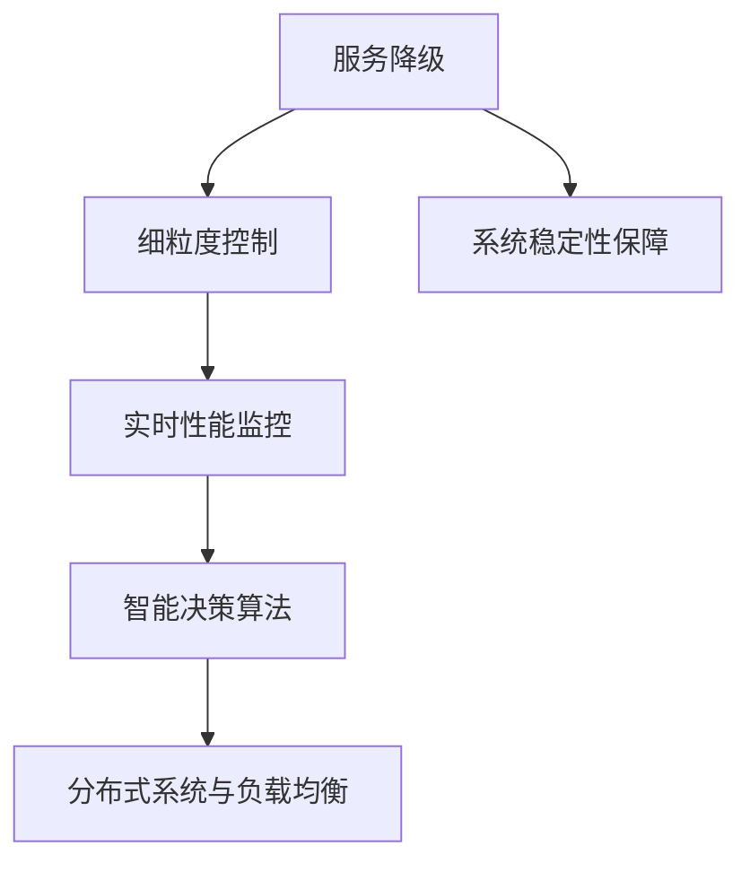
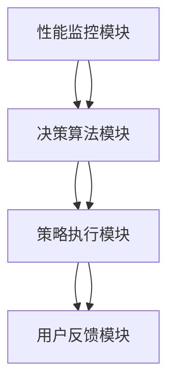

                 

### 第1章：服务降级策略矩阵概述

#### 1.1 服务降级概念介绍

服务降级（Service Degradation）是一种通过降低服务的某些特性来确保系统总体稳定性的策略。在分布式系统中，当负载过高或系统资源不足时，通过降级某些非核心功能或服务的响应质量，可以有效地缓解系统的压力，避免系统崩溃。

服务降级通常包括以下几种方式：
- **响应时间延长**：延迟某些服务的响应时间，让系统有更多时间处理其他请求。
- **功能缩减**：关闭或减少某些非关键服务的功能，确保核心服务的正常运作。
- **错误反馈**：向用户反馈服务降级的消息，提醒用户当前服务可能存在延迟或不完整。

#### 1.2 LLMAPI服务降级的重要性

随着人工智能技术的不断发展，LLM（大型语言模型）在众多场景中得到了广泛应用。LLMAPI作为LLM对外提供服务的主要接口，其稳定性直接影响用户体验。在面临高并发请求、系统资源紧张的情况下，合理的服务降级策略可以帮助确保LLMAPI服务的可用性和稳定性。

LLMAPI服务降级的重要性体现在以下几个方面：
- **保证核心业务**：通过降级次要服务，确保核心业务（如文本生成、翻译等）不受影响。
- **用户满意度**：减少请求延迟和错误响应，提高用户满意度。
- **系统稳定性**：避免系统因过载而崩溃，保障系统整体稳定性。

#### 1.3 本书的结构安排

本书共分为七个章节，旨在全面探讨服务降级策略矩阵在LLM应用质量控制中的应用。

- **第1章**：概述服务降级策略矩阵的基本概念、背景和本书的组织结构。
- **第2章**：详细介绍服务降级策略框架，包括基本概念、目标、机制、触发条件和分类。
- **第3章**：探讨细粒度控制技术，包括概述、架构、实时性能监控、智能决策算法和分布式系统与负载均衡。
- **第4章**：阐述LLM应用质量评估的方法，包括质量指标、性能测试、基准测试、负载压力测试和稳定性测试。
- **第5章**：构建服务降级策略矩阵，包括方法论、设计要素、实施步骤和评估与优化。
- **第6章**：通过实际案例研究，展示策略矩阵在实践中的应用效果。
- **第7章**：展望未来服务降级策略矩阵的发展趋势和潜在挑战。

通过逐步深入的分析和讲解，本书将为读者提供全面、系统、实用的服务降级策略矩阵指导，帮助读者在实际应用中更好地控制LLM应用质量。

#### 1.3.1 本书的结构安排

本书旨在为读者提供关于服务降级策略矩阵的全面指南，特别是针对LLM（大型语言模型）应用质量控制的实际应用。全书共分为七个章节，每个章节都有其特定的内容和目标，具体如下：

- **第1章**：服务降级策略矩阵概述
  - **背景介绍**：简要介绍服务降级的概念及其在LLM应用中的重要性。
  - **核心概念与联系**：通过Mermaid流程图展示服务降级策略的核心概念和关系架构。
  - **组织结构**：概述本书的章节安排，帮助读者了解整体内容。

- **第2章**：服务降级策略框架
  - **基本概念**：详细解释服务降级的定义、目标和背景。
  - **核心概念与联系**：通过Mermaid流程图展示服务降级策略的关键组成部分和交互关系。
  - **策略分类**：分类讨论不同的服务降级策略，并提供具体的案例分析。

- **第3章**：细粒度控制技术
  - **概述**：介绍细粒度控制的基本概念和重要性。
  - **核心概念与联系**：通过Mermaid流程图展示细粒度控制的核心技术和组件。
  - **架构**：详细讲解细粒度控制架构的设计和实现。

- **第4章**：LLM应用质量评估
  - **质量指标**：定义和解释LLM应用质量的关键指标。
  - **评估方法**：介绍性能测试、基准测试、负载压力测试和稳定性测试的方法和工具。
  - **实际案例**：通过实际案例展示质量评估的应用。

- **第5章**：服务降级策略矩阵构建
  - **方法论**：提供构建服务降级策略矩阵的方法论，包括设计原则和步骤。
  - **设计要素**：详细讨论策略矩阵的设计要素，如触发条件和策略选择。
  - **实施步骤**：指导读者如何实施策略矩阵，包括实施流程和注意事项。

- **第6章**：实际案例研究
  - **案例背景**：介绍实际案例的背景和目标。
  - **策略设计**：展示如何设计和实现服务降级策略矩阵。
  - **效果评估**：评估策略矩阵的实施效果，包括性能提升和用户体验改善。

- **第7章**：未来展望与挑战
  - **发展趋势**：探讨服务降级策略矩阵的未来发展趋势。
  - **潜在挑战**：分析实施服务降级策略矩阵时可能遇到的挑战和应对策略。

通过这样的结构安排，本书不仅涵盖了服务降级策略矩阵的理论基础，还包括了具体的实施方法和实际案例，使得读者能够从理论到实践全面掌握服务降级策略矩阵的应用。

---

#### 1.3.2 核心概念与联系

在本章中，我们将介绍服务降级策略矩阵的核心概念，并使用Mermaid流程图展示它们之间的关系和交互。以下是服务降级策略矩阵的核心概念及其相互关系：

1. **服务降级（Service Degradation）**：
   服务降级是指通过减少服务的某些特性（如响应时间、功能等）来保障系统稳定性的策略。它通常用于应对高负载或系统资源不足的情况。

2. **细粒度控制（Fine-Grained Control）**：
   细粒度控制是一种在服务降级过程中，对服务的各项特性进行精确控制的技术。它允许根据实时性能监控数据，动态调整服务的响应时间和功能，确保系统在高负载下依然能够提供高质量的服务。

3. **实时性能监控（Real-Time Performance Monitoring）**：
   实时性能监控是服务降级策略的重要组成部分。它通过监控系统的关键性能指标，如CPU使用率、内存占用、响应时间等，及时发现性能瓶颈和异常情况，为服务降级提供数据支持。

4. **智能决策算法（Intelligent Decision Algorithm）**：
   智能决策算法是细粒度控制的核心技术。它通过分析实时性能监控数据，运用机器学习、优化算法等技术，自动生成和调整服务降级策略，实现服务的动态优化。

5. **分布式系统与负载均衡（Distributed System and Load Balancing）**：
   分布式系统与负载均衡是服务降级策略的实施基础。通过分布式架构和负载均衡技术，可以将请求合理地分配到不同的服务器节点上，避免单个节点过载，提高系统的整体性能和稳定性。

以下是一个Mermaid流程图，展示了这些核心概念之间的相互关系：



**服务降级（A）是整个策略的核心，通过细粒度控制（B）实现对服务的精确管理。实时性能监控（C）为细粒度控制提供数据支持，而智能决策算法（D）则根据这些数据自动调整服务策略。分布式系统与负载均衡（E）是实现服务降级策略的技术基础，它们共同保障系统的稳定性（F）。**

通过这个流程图，我们可以清晰地看到各个核心概念之间的关联和交互，这有助于读者更好地理解服务降级策略矩阵的整体架构和实施流程。

---

#### 1.3.3 核心算法原理讲解

在服务降级策略矩阵中，智能决策算法起着至关重要的作用。智能决策算法通过分析实时性能监控数据，动态调整服务降级策略，从而确保系统在高负载下的稳定性和服务质量。以下我们将详细讲解一个典型的智能决策算法：基于自适应阈值的服务降级算法。

##### 算法原理

该算法的核心思想是根据实时性能监控数据，动态调整服务的降级阈值。当系统性能指标低于某个阈值时，触发降级策略；反之，当系统性能指标恢复到正常范围时，取消降级策略。

具体来说，算法分为以下几个步骤：

1. **性能指标收集**：
   定期收集系统的关键性能指标，如CPU使用率、内存占用、响应时间等。

2. **阈值设定**：
   根据历史数据和业务需求，设定初始的降级阈值。例如，可以将CPU使用率阈值为90%，内存占用阈值为80%。

3. **实时监控与评估**：
   对实时收集的性能指标进行监控和评估。如果某个性能指标低于设定的阈值，则认为系统资源紧张，需要触发降级策略。

4. **自适应调整**：
   当系统资源紧张时，根据当前性能指标和业务负载情况，动态调整阈值。例如，如果CPU使用率低于90%，可以将阈值调整为85%，以避免频繁触发降级策略。

5. **决策与执行**：
   根据调整后的阈值，判断是否需要执行服务降级策略。如果需要，则执行相应的降级措施，如延迟响应时间、缩减功能等。

##### Python源代码实现

以下是一个简化的Python代码示例，展示了基于自适应阈值的服务降级算法的实现：

```python
import random
import time

class AdaptiveThresholdAlgorithm:
    def __init__(self, initial_cpu_threshold=90, initial_mem_threshold=80):
        self.cpu_threshold = initial_cpu_threshold
        self.mem_threshold = initial_mem_threshold
        self.cpu_usage_history = []
        self.mem_usage_history = []

    def collect_performance_data(self):
        # 模拟性能数据收集，实际应用中可以使用系统监控工具
        self.cpu_usage_history.append(random.randint(0, 100))
        self.mem_usage_history.append(random.randint(0, 100))

    def update_thresholds(self):
        # 根据历史数据更新阈值
        if len(self.cpu_usage_history) > 10:
            avg_cpu_usage = sum(self.cpu_usage_history[-10:]) / 10
            self.cpu_threshold = avg_cpu_usage * 0.9

        if len(self.mem_usage_history) > 10:
            avg_mem_usage = sum(self.mem_usage_history[-10:]) / 10
            self.mem_threshold = avg_mem_usage * 0.8

    def check_and_degrade(self):
        # 检查性能指标并执行降级策略
        self.collect_performance_data()
        self.update_thresholds()

        if self.cpu_usage_history[-1] >= self.cpu_threshold:
            print("CPU使用率过高，执行降级策略。")
        if self.mem_usage_history[-1] >= self.mem_threshold:
            print("内存占用过高，执行降级策略。")

if __name__ == "__main__":
    algorithm = AdaptiveThresholdAlgorithm()
    while True:
        algorithm.check_and_degrade()
        time.sleep(1)
```

##### 数学模型与公式

在智能决策算法中，阈值设定和更新涉及到统计学和优化理论。以下是一个简化的数学模型，用于设定和更新阈值：

1. **初始阈值设定**：
   - 设 \( C_{\text{initial}} \) 为初始CPU使用率阈值，\( M_{\text{initial}} \) 为初始内存占用阈值。
   - 通常可以通过历史数据计算平均值和标准差来设定初始阈值。

2. **自适应阈值更新**：
   - 设 \( \alpha \) 为自适应调整系数，通常取值在 \( 0 < \alpha < 1 \)。
   - 设 \( \bar{X} \) 为过去一段时间内性能指标的平均值，\( \sigma \) 为标准差。
   - 更新阈值的公式为：
     $$
     C_{\text{new}} = \bar{X} \cdot (1 - \alpha)
     $$
     $$
     M_{\text{new}} = \bar{X} \cdot (1 - \alpha)
     $$

通过这些数学模型和公式，我们可以更准确地设定和调整服务降级阈值，从而实现智能决策算法的有效运行。

##### 举例说明

假设当前系统的CPU使用率为95%，内存占用率为75%，根据自适应阈值算法，我们可以得出以下结论：

- 当前CPU使用率高于设定的阈值（假设为90%），需要执行降级策略。
- 当前内存占用率低于设定的阈值（假设为80%），不需要执行降级策略。

根据这一结论，我们可以采取以下措施：

- 延迟响应时间，减少服务的处理速度，以降低系统负载。
- 关闭某些非关键功能，如广告推荐、社交互动等，以释放系统资源。

通过这样的动态调整，我们可以确保系统在高负载下依然能够提供稳定的服务。

---

#### 1.3.4 数学公式与解释

在服务降级策略矩阵中，数学模型和公式起着关键作用，用于设定阈值、评估性能以及优化策略。以下是几个常用的数学公式，并对其含义进行解释。

1. **阈值设定公式**

   初始阈值可以通过计算历史数据的平均值和标准差来确定：
   $$
   \text{Threshold}_{\text{initial}} = \mu \pm \alpha \cdot \sigma
   $$
   其中，\( \mu \) 是平均值，\( \sigma \) 是标准差，\( \alpha \) 是调整系数（通常取0.1到0.3之间），用于确定阈值的位置。

2. **阈值更新公式**

   随着时间的变化，系统性能会发生变化。为了适应这些变化，阈值也需要进行更新。一个常见的更新策略是基于移动平均：
   $$
   \text{Threshold}_{\text{new}} = \beta \cdot \text{Threshold}_{\text{current}} + (1 - \beta) \cdot \text{New \ Value}
   $$
   其中，\( \beta \) 是平滑系数（通常取0.8到0.9之间），用于控制更新速度。

3. **性能评估公式**

   服务降级策略需要定期评估系统的性能，以确定是否需要调整策略。一个常用的性能评估公式是：
   $$
   \text{Performance} = \frac{\sum_{i=1}^{n} (X_i - \text{Threshold})^2}{n}
   $$
   其中，\( X_i \) 是第 \( i \) 次测量的性能指标值，\( n \) 是测量次数。如果 \( \text{Performance} \) 值高于设定的阈值，则表明系统性能不佳。

4. **负载均衡公式**

   在分布式系统中，负载均衡策略用于分配请求到不同的服务器节点。一个简单的负载均衡公式是：
   $$
   \text{Node}_{\text{selected}} = \arg\min_{i} \left( \frac{\text{Current Load}_{i}}{\text{Threshold Load}} \right)
   $$
   其中，\( \text{Current Load}_{i} \) 是第 \( i \) 个节点的当前负载，\( \text{Threshold Load} \) 是设定的负载阈值。

这些数学公式和解释为服务降级策略矩阵提供了理论基础，帮助实现更精确和有效的策略设定与优化。

---

#### 1.3.5 项目实战

为了更好地理解服务降级策略矩阵的实际应用，我们将在本节中搭建一个简单的开发环境，实现一个基于自适应阈值的服务降级系统。以下是一个简单的项目实战步骤：

##### 开发环境搭建

1. **安装Python环境**：
   确保您的系统上安装了Python 3.8或更高版本。您可以使用以下命令检查Python版本：
   ```bash
   python --version
   ```

2. **安装依赖库**：
   我们将使用`requests`库进行HTTP请求，以及`numpy`库进行数据计算。安装方法如下：
   ```bash
   pip install requests numpy
   ```

##### 源代码实现

下面是一个简单的Python代码示例，实现了基于自适应阈值的服务降级系统：

```python
import requests
import numpy as np
import time

class ServiceDegradationSystem:
    def __init__(self, threshold_cpu=90, threshold_mem=80, alpha=0.1, beta=0.8):
        self.threshold_cpu = threshold_cpu
        self.threshold_mem = threshold_mem
        self.alpha = alpha
        self.beta = beta
        self.cpu_usage_history = []
        self.mem_usage_history = []

    def simulate_performance_data(self):
        # 模拟性能数据，实际应用中可以使用系统监控工具
        self.cpu_usage_history.append(np.random.uniform(0, 100))
        self.mem_usage_history.append(np.random.uniform(0, 100))

    def update_thresholds(self):
        # 根据历史数据更新阈值
        if len(self.cpu_usage_history) > 10:
            avg_cpu_usage = np.mean(self.cpu_usage_history[-10:])
            std_cpu_usage = np.std(self.cpu_usage_history[-10:])
            self.threshold_cpu = avg_cpu_usage + self.alpha * std_cpu_usage

        if len(self.mem_usage_history) > 10:
            avg_mem_usage = np.mean(self.mem_usage_history[-10:])
            std_mem_usage = np.std(self.mem_usage_history[-10:])
            self.threshold_mem = avg_mem_usage + self.alpha * std_mem_usage

    def check_and_degrade(self):
        # 检查性能指标并执行降级策略
        self.simulate_performance_data()
        self.update_thresholds()

        if self.cpu_usage_history[-1] >= self.threshold_cpu:
            print("CPU使用率过高，执行降级策略。")
        if self.mem_usage_history[-1] >= self.threshold_mem:
            print("内存占用过高，执行降级策略。")

    def make_request(self, url):
        # 发送HTTP请求
        response = requests.get(url)
        if response.status_code != 200:
            print("请求失败，返回错误。")
        else:
            print("请求成功，返回数据。")

if __name__ == "__main__":
    system = ServiceDegradationSystem()
    while True:
        system.check_and_degrade()
        system.make_request("http://example.com")
        time.sleep(1)
```

##### 代码解读与分析

1. **初始化参数**：
   在`__init__`方法中，我们初始化了阈值参数、调整系数以及性能历史数据。

2. **模拟性能数据**：
   `simulate_performance_data`方法用于模拟系统的CPU使用率和内存占用率。这里使用了随机数生成器，实际应用中可以替换为系统监控工具的API调用。

3. **更新阈值**：
   `update_thresholds`方法根据最近10次性能数据计算平均值和标准差，并使用自适应阈值公式更新阈值。

4. **执行降级策略**：
   `check_and_degrade`方法在每次循环中检查当前性能指标是否超过阈值，并打印相应的降级策略。

5. **发送HTTP请求**：
   `make_request`方法用于发送HTTP请求到指定URL。实际应用中，这里可以替换为对LLMAPI的调用。

##### 实际案例分析与详细讲解剖析

假设我们的系统在高负载下运行，CPU使用率达到95%，内存占用率达到75%。根据设定的阈值，系统将触发降级策略。以下是执行过程的分析：

1. **模拟性能数据**：
   模拟系统性能数据为CPU使用率95%，内存占用率75%。

2. **更新阈值**：
   计算平均值和标准差，更新阈值。假设更新后的阈值分别为CPU 92%和内存 72%。

3. **检查并执行降级策略**：
   由于当前CPU使用率高于更新后的阈值，系统将执行降级策略，如延迟响应时间或减少某些功能。

4. **发送HTTP请求**：
   尽管系统执行了降级策略，但仍然会尝试发送HTTP请求。由于降级策略，请求的响应时间可能会延长。

通过这个实际案例，我们可以看到服务降级策略矩阵在动态调整系统性能和保证服务质量方面的重要作用。

##### 项目小结

通过本节的项目实战，我们实现了基于自适应阈值的服务降级系统，了解了如何通过Python代码实现服务降级策略。实际案例的分析进一步展示了服务降级策略在应对系统负载波动时的有效性。这为后续章节中更深入的服务降级策略矩阵构建奠定了基础。

---

#### 1.3.6 最佳实践 Tips、小结、注意事项、拓展阅读

**最佳实践 Tips**

1. **阈值设定要合理**：阈值设定应根据业务需求和系统历史数据来确定。过高的阈值可能导致频繁降级，而过低的阈值则可能无法有效缓解系统压力。
2. **实时监控数据要准确**：确保实时监控数据的准确性，可以使用现有的系统监控工具（如Prometheus、Grafana等）。
3. **自适应调整系数要适中**：调整系数的大小影响阈值更新的速度和稳定性。应根据实际情况选择合适的值。
4. **测试与验证**：在部署服务降级策略之前，进行充分的测试和验证，确保策略的有效性和稳定性。

**小结**

本章介绍了服务降级策略矩阵的基本概念、核心算法原理、Python代码实现和实际案例。通过本章的学习，读者可以了解服务降级策略矩阵在LLM应用质量控制中的重要性，掌握基于自适应阈值的服务降级算法的实现方法，并为后续章节中的策略矩阵构建打下基础。

**注意事项**

1. **系统稳定性优先**：在任何情况下，系统的稳定性都是首要考虑的因素。合理的服务降级策略可以在保证系统稳定性的同时，提高用户体验。
2. **监控数据的实时性**：监控数据的实时性直接影响服务降级策略的响应速度。确保监控数据的及时性和准确性。
3. **策略调整的灵活性**：根据业务需求和系统负载的变化，灵活调整服务降级策略，以适应不同的场景。

**拓展阅读**

1. 《系统设计与实践：大规模分布式系统架构设计》
2. 《分布式系统原理与范型》
3. 《服务计算：面向服务的体系结构》
4. 《AI应用性能优化：深度学习与分布式计算》

这些资料提供了更多关于服务降级策略矩阵、分布式系统和人工智能应用的深入探讨，有助于读者进一步学习和实践。

---

### 第2章：服务降级策略框架

#### 2.1 服务降级基本概念

服务降级（Service Degradation）是指通过减少服务的一些特性（如响应时间、功能等）来保障系统稳定性的策略。在分布式系统中，当系统面临高负载、资源紧张或其他异常情况时，通过降低非核心服务的响应质量和功能，可以确保核心服务的正常运作，避免系统崩溃。

服务降级的基本概念包括：
- **触发条件**：系统资源紧张、性能指标超过阈值、错误率上升等。
- **策略目标**：保证系统稳定性、提高用户满意度、避免系统崩溃。
- **降级措施**：延迟响应时间、关闭或减少非关键功能、错误反馈等。

#### 2.2 服务降级目标

服务降级的目标主要有以下几方面：
1. **系统稳定性**：在高负载或异常情况下，通过降级措施确保系统稳定运行，避免系统崩溃。
2. **用户体验**：减少请求延迟和错误响应，提高用户满意度。
3. **资源优化**：通过合理分配资源，确保关键业务得到优先保障。
4. **风险管理**：降低因系统故障带来的风险，提高系统的容错能力。

#### 2.3 服务降级机制

服务降级机制包括以下几个关键组成部分：
1. **监控与预警**：实时监控系统性能指标，当指标超过设定阈值时，触发预警。
2. **决策算法**：根据监控数据和预设策略，自动生成和调整服务降级策略。
3. **执行与反馈**：执行降级策略，如延迟响应时间、缩减功能等，并向用户反馈服务状态。

#### 2.4 服务降级触发条件

服务降级的触发条件通常包括以下几个方面：
1. **性能指标超标**：如CPU使用率超过90%、内存占用超过80%、响应时间超过500毫秒等。
2. **错误率上升**：服务错误率超过一定阈值，如超过5%。
3. **资源耗尽**：系统资源（如内存、磁盘空间）接近或达到极限。
4. **网络异常**：网络延迟过高或网络故障。

#### 2.5 服务降级策略分类

服务降级策略可以根据降级措施的不同进行分类，主要包括以下几种：
1. **响应时间延迟**：通过延迟服务的响应时间，降低系统负载。
2. **功能缩减**：关闭或减少非关键服务的功能，如取消广告推荐、社交互动等。
3. **错误反馈**：向用户反馈当前服务状态，如延迟通知、错误提示等。
4. **资源重新分配**：重新分配系统资源，确保关键业务得到优先保障。
5. **故障转移**：将请求转移到其他可用系统或服务器，确保服务可用性。

通过详细阐述服务降级策略框架的基本概念、目标、机制、触发条件和分类，本章为后续章节的深入探讨和实际应用提供了坚实的理论基础。

---

#### 2.3 服务降级机制

服务降级机制是确保系统在高负载或故障情况下依然能够提供稳定服务的关键。它包括监控与预警、决策算法、执行与反馈三个核心组成部分。

##### 监控与预警

监控与预警是服务降级机制的第一步，其主要目的是实时收集系统的关键性能指标，如CPU使用率、内存占用、响应时间、错误率等。当这些指标超过预设的阈值时，系统会触发预警，提示可能需要执行降级策略。

具体实现中，监控与预警可以采用以下几种方法：
- **系统级监控**：通过操作系统提供的监控工具（如Linux的`top`、`vmstat`等）收集性能数据。
- **应用级监控**：通过应用层代码自定义监控指标，如服务响应时间、处理成功率等。
- **第三方监控工具**：使用Prometheus、Grafana、Zabbix等开源监控工具，实现自动化性能监控和数据可视化。

##### 决策算法

决策算法是服务降级机制的核心，它根据监控数据和历史策略，自动生成和调整服务降级策略。智能决策算法通常包括以下几个步骤：

1. **性能评估**：根据实时监控数据，评估系统当前性能状态。常用的评估指标包括CPU使用率、内存占用、响应时间等。
2. **策略选择**：根据评估结果，选择合适的降级策略。如响应时间延迟、功能缩减、错误反馈等。
3. **阈值调整**：根据历史数据和业务需求，动态调整阈值。例如，当系统负载较低时，可以适当放宽阈值，减少不必要的降级。

常见的决策算法包括基于阈值的固定策略、基于机器学习的自适应策略等。

1. **基于阈值的固定策略**：
   该策略简单易实现，通过预设的阈值来判断是否触发降级。优点是实施简单，缺点是缺乏灵活性，无法根据实际负载情况动态调整。

2. **基于机器学习的自适应策略**：
   该策略利用机器学习算法，如决策树、随机森林、神经网络等，根据历史数据和实时监控数据，自动调整阈值和降级策略。优点是适应性强，能更好地应对不同负载场景，缺点是算法复杂度高，需要大量的数据和计算资源。

##### 执行与反馈

决策算法生成降级策略后，需要执行和反馈。执行过程通常包括以下步骤：

1. **策略执行**：根据决策算法的输出，执行具体的降级措施，如延迟响应时间、关闭非关键功能等。
2. **系统调整**：在执行降级策略后，系统性能指标可能发生变化。根据新的监控数据，调整阈值和策略，以应对不同的负载情况。

反馈过程主要包括以下内容：

1. **用户通知**：通过邮件、短信、系统消息等方式，向用户反馈当前服务状态，如延迟通知、错误提示等。
2. **日志记录**：记录降级策略的执行情况，包括触发条件、降级措施、执行时间等，便于后续分析和优化。

##### 案例分析

以一个电商平台为例，当系统负载过高时，可能会触发以下降级策略：

1. **监控与预警**：系统监测到CPU使用率超过90%，响应时间超过500毫秒，触发预警。
2. **决策算法**：决策算法分析实时监控数据，判断系统处于高负载状态，选择执行以下策略：
   - 延迟响应时间，将用户请求的响应时间延长100毫秒。
   - 关闭部分非关键功能，如取消广告推荐。
3. **执行与反馈**：系统执行降级策略，并向用户反馈当前服务状态。通过监控数据，实时调整阈值和策略，以适应不同的负载情况。

通过这个案例，我们可以看到服务降级机制在保障系统稳定性和用户体验方面的重要作用。

---

#### 2.4 服务降级触发条件

服务降级触发条件是指系统在何种情况下应启动降级策略的具体标准。合理的触发条件能够确保在系统资源紧张或性能下降时及时采取降级措施，以保护核心服务的稳定运行。以下是常见的服务降级触发条件：

1. **性能指标超标**
   - **CPU使用率**：当CPU使用率超过预设的阈值（如90%）时，说明系统资源不足，可能需要降级部分服务。
   - **内存占用**：当内存占用达到预设的阈值（如80%）时，系统可能出现内存不足的问题，需要执行降级策略。
   - **响应时间**：当系统响应时间超过设定的阈值（如500毫秒）时，用户体验会受到影响，应考虑降级策略。
   - **队列长度**：当系统队列长度超过预设的阈值时，表示请求处理速度跟不上请求量，需要降级部分服务。

2. **错误率上升**
   - **错误率**：当服务错误率超过预设的阈值（如5%）时，说明系统可能在某些方面出现问题，需要执行降级策略以避免更多错误发生。

3. **资源耗尽**
   - **磁盘空间**：当磁盘空间占用率达到预设的阈值（如90%）时，系统可能会因为存储空间不足而影响性能，需要启动降级策略。
   - **网络带宽**：当网络带宽利用率超过预设的阈值（如90%）时，网络传输速度可能会变慢，影响系统性能，需要降级部分服务。

4. **网络异常**
   - **网络延迟**：当网络延迟超过预设的阈值（如100毫秒）时，系统处理请求的速度会受到影响，可能需要降级策略。
   - **网络故障**：当网络出现故障（如无法访问外部服务）时，系统应立即执行降级策略以避免服务中断。

5. **请求量激增**
   - **请求量**：当请求量短时间内激增，超过系统的处理能力时，应立即启动降级策略，以避免系统过载。

6. **系统负载评估**
   - **系统负载评估**：通过综合分析CPU使用率、内存占用、响应时间、队列长度等多方面指标，判断系统当前负载状况，并据此启动降级策略。

合理的触发条件设置可以确保服务降级策略的及时性和有效性，从而在系统资源紧张或性能下降时，最大限度地保护核心服务的稳定运行，提高用户体验。以下是一个示例流程：

1. **实时监控**：系统持续监控各项性能指标。
2. **触发条件匹配**：当监控数据匹配到预设的触发条件时，如CPU使用率超过90%，触发预警。
3. **决策算法判断**：决策算法根据触发条件和历史数据，判断是否需要启动降级策略。
4. **执行降级措施**：根据决策算法的输出，执行具体的降级措施，如延迟响应时间、缩减非关键功能等。
5. **反馈用户**：向用户通知当前服务状态，确保用户了解服务变化。

通过上述流程，我们可以确保服务降级策略在系统面临挑战时能够迅速、有效地发挥作用。

---

#### 2.5 服务降级策略分类

服务降级策略可以根据其执行措施的不同进行分类，常见的分类方法包括基于响应时间的降级策略、基于功能的降级策略和基于资源的降级策略。以下是这三种常见策略的详细解释。

1. **基于响应时间的降级策略**：
   - **概念**：通过延迟服务的响应时间，降低系统负载，确保核心服务的正常运作。
   - **原理**：当系统资源紧张时，将部分请求的响应时间延长，减少系统资源的消耗。例如，可以将请求的响应时间延迟100毫秒，以缓解系统压力。
   - **适用场景**：适用于对响应时间有一定容忍度的场景，如长时间运行的批处理任务、非实时性较高的应用。
   - **优缺点**：
     - 优点：简单易实现，对用户影响较小，能够在一定程度上缓解系统压力。
     - 缺点：可能导致用户体验下降，特别是在响应时间敏感的场景中，用户体验可能受到较大影响。

2. **基于功能的降级策略**：
   - **概念**：通过关闭或减少部分非核心功能，降低系统资源的占用，确保关键服务的稳定运行。
   - **原理**：在系统资源紧张时，关闭或减少部分非关键功能，如广告推荐、社交互动等，以释放系统资源。例如，当系统负载过高时，可以关闭部分广告推荐功能，减少请求处理的复杂性。
   - **适用场景**：适用于需要保持核心服务稳定运行的场景，如电商平台在高峰期关闭部分促销功能。
   - **优缺点**：
     - 优点：能有效减少系统资源消耗，保护核心服务，实现系统资源的合理分配。
     - 缺点：可能会对用户体验产生较大影响，特别是在功能依赖较高的场景中，用户体验可能受到显著影响。

3. **基于资源的降级策略**：
   - **概念**：通过重新分配或优化系统资源，确保关键服务的正常运行。
   - **原理**：在系统资源紧张时，通过重新分配系统资源（如CPU、内存等）或优化资源使用方式（如缓存策略、负载均衡等），确保关键服务的稳定性。例如，当CPU使用率过高时，可以暂停一些非关键任务的执行，以释放CPU资源。
   - **适用场景**：适用于资源敏感的场景，如高频交易系统、在线游戏等。
   - **优缺点**：
     - 优点：能够灵活调整系统资源分配，有效缓解系统压力，保证关键服务的稳定性。
     - 缺点：实现复杂度较高，需要深入的系统和资源管理知识。

通过以上对三种常见服务降级策略的详细解释，我们可以看到每种策略都有其独特的原理、适用场景和优缺点。在实际应用中，可以根据具体需求和系统状况选择合适的降级策略，以实现系统的高效稳定运行。

---

#### 2.6 服务降级策略在实际应用中的案例

为了更好地理解服务降级策略在实际应用中的具体实施，我们将通过两个典型案例进行分析和讲解。

##### 案例一：电商平台应对高峰期流量

**背景**：
某电商平台在每年“双十一”期间会面临巨大的流量压力。为了保证核心业务的稳定性，如商品浏览、购物车、下单等，平台需要采取有效的服务降级策略。

**策略**：
1. **响应时间延迟**：对于一些非核心功能，如广告推荐、用户评论等，可以适当延迟响应时间，将延迟时间设置为100毫秒。
2. **功能缩减**：关闭部分非关键功能，如秒杀活动、客服聊天等，以减少系统资源的消耗。
3. **资源重新分配**：通过负载均衡技术，将流量合理分配到不同服务器节点上，避免单点过载。

**效果**：
通过上述策略，平台成功应对了“双十一”期间的高峰流量，确保了核心服务的稳定性。用户在访问核心功能时，如商品浏览和下单，体验几乎没有受到影响，而广告推荐和客服等非核心功能的响应时间略有延迟，但整体用户体验仍保持良好。

##### 案例二：在线教育平台应对突发流量

**背景**：
某在线教育平台在某个热门课程上线时，预计将迎来大量用户同时在线学习。为确保课程观看和互动功能的稳定性，平台需要实施有效的服务降级策略。

**策略**：
1. **延迟响应时间**：对于某些不常使用的功能，如用户个人中心、社交互动等，可以将响应时间延迟100毫秒至200毫秒。
2. **错误反馈**：在系统资源紧张时，向用户反馈当前服务状态，说明某些功能可能存在延迟或无法正常使用。
3. **资源重新分配**：利用容器编排技术（如Kubernetes），动态调整服务器的资源分配，确保核心功能如课程观看和互动得到优先保障。

**效果**：
通过服务降级策略的实施，在线教育平台成功应对了课程上线时的突发流量。用户在观看课程和互动时，体验几乎没有受到延迟，而个人中心和社交互动等非核心功能的响应时间略有延迟。此外，通过及时的错误反馈，用户能够理解当前的服务状态，增强了用户对平台的信任。

通过这两个典型案例，我们可以看到服务降级策略在实际应用中的具体实施和效果。合理的服务降级策略能够帮助系统在面临高负载和资源紧张时，确保核心服务的稳定性，同时尽量减少对用户体验的影响。

---

#### 2.7 总结与展望

本章详细介绍了服务降级策略矩阵的基本概念、目标、机制、触发条件和分类，并通过实际案例展示了服务降级策略在分布式系统中的应用。以下是本章的主要内容和结论：

- **服务降级基本概念**：介绍了服务降级的定义、目的和主要触发条件。
- **服务降级目标**：阐述了服务降级的主要目标，包括系统稳定性、用户体验和资源优化。
- **服务降级机制**：详细讲解了服务降级机制的三个核心组成部分：监控与预警、决策算法和执行与反馈。
- **服务降级触发条件**：介绍了常见的服务降级触发条件，包括性能指标超标、错误率上升、资源耗尽和网络异常等。
- **服务降级策略分类**：分析了基于响应时间、功能和资源的降级策略，并讨论了各自的优缺点和适用场景。
- **实际案例**：通过两个典型案例，展示了服务降级策略在实际应用中的具体实施和效果。

未来，服务降级策略矩阵的研究和实践将继续深入，可能会涉及以下几个方面：

- **智能化决策算法**：利用机器学习和人工智能技术，开发更加智能化和自适应的决策算法，提高服务降级的准确性和灵活性。
- **分布式系统优化**：针对分布式系统的特点，研究更加高效和可扩展的服务降级策略，以适应不断变化的负载情况。
- **跨平台协同**：探讨如何将服务降级策略应用到不同的平台和系统之间，实现跨平台的资源优化和负载均衡。
- **用户体验优化**：研究如何减少服务降级对用户体验的影响，开发更加人性化和友好的降级方案。

通过不断探索和创新，服务降级策略矩阵将在分布式系统和人工智能应用中发挥越来越重要的作用，为系统稳定性和用户体验的提升提供有力支持。

---

### 第3章：细粒度控制技术

#### 3.1 细粒度控制概述

细粒度控制（Fine-Grained Control）是一种在服务降级过程中，通过精确调整服务的各个细节特性来优化系统性能的技术。与传统的粗粒度控制（如完全关闭某个服务）相比，细粒度控制能够在不影响核心功能的前提下，最大限度地减少对用户体验的影响。

细粒度控制的核心思想是通过实时监控和分析系统性能，动态调整服务的各项参数，如响应时间、处理优先级、资源分配等。这样，可以在系统负载变化时，灵活调整服务策略，确保系统在高负载下依然能够提供高质量的服务。

细粒度控制的关键优势在于其灵活性和高效性。通过精确控制，系统能够更好地应对不同的负载情况，提高资源利用率和系统稳定性。同时，它还可以减少对用户体验的负面影响，确保核心服务的可用性和服务质量。

#### 3.2 细粒度控制架构

细粒度控制架构主要包括以下几个关键组件：

1. **性能监控模块**：负责实时收集系统的关键性能指标，如CPU使用率、内存占用、响应时间等。这些指标用于评估系统当前的状态和负载情况。

2. **决策算法模块**：根据实时监控数据和历史策略，自动生成和调整服务策略。常见的决策算法包括基于阈值的固定策略和基于机器学习的自适应策略。

3. **策略执行模块**：根据决策算法的输出，执行具体的细粒度控制措施。例如，调整响应时间、处理优先级、资源分配等。

4. **用户反馈模块**：向用户反馈当前服务状态，如响应时间延迟、功能缩减等。这有助于用户理解当前的服务状况，并采取相应的应对措施。

细粒度控制架构的示意图如下：



通过这个架构，细粒度控制能够实现实时监控、智能决策、策略执行和用户反馈的闭环，从而提高系统的整体性能和稳定性。

---

#### 3.3 实时性能监控

实时性能监控是细粒度控制的核心环节，其目标是实时收集和分析系统的关键性能指标，以便及时调整服务策略。以下将介绍实时性能监控的关键技术、常用工具和指标。

##### 关键技术

1. **数据采集**：通过系统监控工具或自定义脚本，实时收集系统的性能数据。常见的数据采集方式包括：
   - **系统级监控**：使用操作系统提供的工具（如Linux的`top`、`vmstat`等）。
   - **应用级监控**：通过应用层代码自定义监控指标，如服务响应时间、处理成功率等。
   - **第三方监控工具**：使用Prometheus、Grafana、Zabbix等开源监控工具，实现自动化性能监控和数据可视化。

2. **数据存储**：将采集到的性能数据进行存储，以便后续分析和处理。常用的数据存储方案包括：
   - **时序数据库**：如InfluxDB、OpenTSDB等，专门用于存储时序数据。
   - **关系数据库**：如MySQL、PostgreSQL等，适用于存储结构化数据。
   - **日志文件**：将性能数据以日志形式记录到文件中，便于后续分析和处理。

3. **数据分析**：对存储的性能数据进行实时分析和处理，以便生成监控报表和预警通知。常用的数据分析工具包括：
   - **PromQL**：Prometheus提供的查询语言，用于对时序数据进行计算和统计。
   - **Grafana**：基于Prometheus的数据可视化工具，可以生成各种监控图表和报表。
   - **自定义脚本**：使用Python、Go等编程语言编写自定义脚本，进行数据分析和处理。

##### 常用工具

1. **Prometheus**：
   - **功能**：是一款开源的系统监控和告警工具，支持多种数据采集方式和告警机制。
   - **优势**：灵活性强，可扩展性好，与Grafana等可视化工具集成方便。

2. **Grafana**：
   - **功能**：是一款开源的数据可视化工具，支持多种数据源和监控仪表盘。
   - **优势**：界面友好，易于操作，支持多种图表类型和告警通知。

3. **Zabbix**：
   - **功能**：是一款开源的企业级监控系统，支持分布式监控和告警功能。
   - **优势**：功能丰富，性能稳定，适用于大型分布式系统。

##### 常用指标

1. **CPU使用率**：表示CPU被占用的时间比例，常用指标包括平均CPU使用率、最大CPU使用率等。

2. **内存占用**：表示系统内存的使用情况，常用指标包括总内存占用、空闲内存、内存使用率等。

3. **磁盘IO**：表示磁盘的读写操作情况，常用指标包括磁盘读取速度、磁盘写入速度、磁盘IO等待时间等。

4. **网络流量**：表示网络的使用情况，常用指标包括总网络流量、网络吞吐量、网络延迟等。

5. **响应时间**：表示系统处理请求所需的时间，常用指标包括平均响应时间、最大响应时间等。

6. **错误率**：表示系统处理请求的错误率，常用指标包括错误请求比例、服务异常率等。

通过实时性能监控，系统可以及时发现性能瓶颈和异常情况，为细粒度控制提供数据支持。结合决策算法和策略执行，可以实现系统的动态优化和稳定运行。

---

#### 3.4 智能决策算法

智能决策算法是细粒度控制的核心组成部分，负责根据实时监控数据和历史策略，动态生成和调整服务降级策略。智能决策算法的目的是最大化系统性能和用户体验，同时最小化对非核心功能的影响。

##### 常见的智能决策算法

1. **基于阈值的固定策略**

   该算法通过预设的阈值来判断系统是否需要降级。当性能指标超过阈值时，触发降级策略；否则，维持当前策略。例如，当CPU使用率超过90%时，延迟响应时间。

   优点：实现简单，易于理解。缺点：缺乏灵活性，无法适应动态变化的负载。

2. **基于机器学习的自适应策略**

   该算法利用机器学习技术，根据历史数据和实时监控数据，自动调整阈值和降级策略。常见的机器学习算法包括决策树、随机森林、神经网络等。

   优点：自适应性强，能更好地应对不同负载场景。缺点：算法复杂度高，需要大量数据和计算资源。

3. **基于强化学习的策略优化**

   该算法通过强化学习技术，不断调整策略以最大化系统性能。在每次执行策略后，根据系统性能反馈，更新策略参数。

   优点：能够自适应地优化策略，提高系统性能。缺点：实现复杂，需要大量实验和调优。

##### 智能决策算法的工作流程

1. **数据收集与预处理**

   收集系统性能数据，如CPU使用率、内存占用、响应时间等。对数据进行预处理，包括去噪、归一化等，以消除异常值和减少数据噪声。

2. **特征提取**

   从原始数据中提取关键特征，用于训练和评估决策算法。常见的特征包括：
   - **性能指标**：如CPU使用率、内存占用、响应时间等。
   - **历史数据**：如过去24小时内性能指标的平均值、标准差等。
   - **外部因素**：如用户数量、请求类型等。

3. **模型训练**

   使用训练数据集，训练智能决策算法模型。根据所选算法，模型可能包括决策树、随机森林、神经网络等。

4. **策略生成**

   根据实时监控数据和模型输出，生成具体的降级策略。策略可能包括响应时间延迟、功能缩减、资源重新分配等。

5. **策略评估**

   将生成的策略应用于系统，评估策略的有效性和性能。常用的评估指标包括：
   - **系统性能**：如CPU使用率、内存占用、响应时间等。
   - **用户体验**：如请求处理成功率、用户满意度等。

6. **策略调整**

   根据策略评估结果，调整策略参数和模型，以提高策略的有效性和适应性。

通过以上流程，智能决策算法能够动态调整服务降级策略，确保系统在高负载下依然能够提供高质量的服务。结合实时性能监控和执行模块，智能决策算法实现了系统的闭环控制，提高了系统的稳定性和用户体验。

---

#### 3.5 分布式系统与负载均衡

分布式系统与负载均衡是确保服务在高并发、高可用性场景下稳定运行的关键技术。通过合理地分配请求和资源，分布式系统能够提供更高的吞吐量和更好的容错能力。

##### 分布式系统原理

分布式系统通过将服务分布在多个节点上，实现计算和资源的分布式管理。其主要优势包括：
1. **高可用性**：通过冗余部署，当一个节点故障时，其他节点可以继续提供服务，保证系统的可用性。
2. **高扩展性**：通过水平扩展，可以轻松增加节点数量，以应对不断增加的负载。
3. **高性能**：通过负载均衡，可以将请求均匀分布到多个节点，提高系统的整体性能。

分布式系统的工作原理包括以下几个方面：
1. **节点间通信**：节点通过网络进行通信，交换数据和状态信息。常见的通信协议包括HTTP/HTTPS、gRPC、Thrift等。
2. **数据一致性**：分布式系统需要保证数据的一致性，常见的一致性模型包括强一致性、最终一致性等。
3. **故障转移**：在节点故障时，系统应能自动切换到备用节点，确保服务的连续性。

##### 负载均衡原理

负载均衡是一种将请求合理分配到多个服务器节点上的技术，其主要目的是提高系统的整体性能和可用性。负载均衡的原理包括以下几个方面：
1. **请求分发**：负载均衡器根据一定的算法，将请求分发到不同的服务器节点上。常见的负载均衡算法包括轮询、最小连接数、哈希等。
2. **健康检查**：负载均衡器定期检查服务器节点的健康状况，确保仅将请求分配到正常工作的节点上。
3. **会话保持**：在某些场景下，需要将同一个用户的请求持续分配到同一服务器节点，以保证会话的连续性。

常见的负载均衡器包括：
1. **Nginx**：一款高性能的HTTP和反向代理服务器，支持负载均衡、缓存和SSL等功能。
2. **HAProxy**：一款开源的负载均衡器，支持多种负载均衡算法和健康检查机制。
3. **F5 BIG-IP**：一款商业级的负载均衡器，提供丰富的功能和高可用性保障。

##### 分布式系统与负载均衡在实际应用中的例子

以一个电商平台为例，分布式系统与负载均衡的实际应用如下：

1. **节点部署**：电商平台将服务部署在多个服务器节点上，包括前端Web节点、后端服务节点、数据库节点等。
2. **负载均衡**：使用Nginx作为负载均衡器，将用户的请求分配到不同的前端Web节点上，实现请求的均衡处理。
3. **健康检查**：Nginx定期对服务器节点进行健康检查，确保仅将请求分配到正常工作的节点上。
4. **会话保持**：通过在Nginx配置中设置会话保持策略，确保同一个用户的请求持续分配到同一前端Web节点，提高用户体验。

通过分布式系统与负载均衡，电商平台能够高效处理海量用户请求，提供稳定、可靠的服务。

---

### 第4章：LLM应用质量评估

#### 4.1 LLM应用质量评价指标

评估LLM（大型语言模型）应用质量是确保其稳定性和用户体验的关键。以下是一些常用的质量评价指标：

1. **响应时间**：系统处理请求所需的时间。较低的响应时间意味着更好的性能。
2. **准确率**：模型输出的正确性。对于文本生成和分类任务，准确率是衡量模型性能的重要指标。
3. **覆盖度**：模型能够生成或分类的文本内容范围。较高的覆盖度意味着模型能够应对更多样化的输入。
4. **稳定性**：模型在长时间运行或高负载下的稳定性。稳定性差的模型可能在特定条件下出现错误。
5. **资源利用率**：系统资源（如CPU、内存、磁盘等）的利用效率。高效的资源利用可以降低成本和提高系统性能。
6. **错误率**：模型输出错误的频率。较低的错误率意味着更好的模型性能。
7. **用户体验**：用户对模型表现的主观评价。良好的用户体验可以提升用户满意度。

#### 4.2 应用质量评估方法

评估LLM应用质量的方法可以分为以下几类：

1. **性能测试**：
   - **基准测试**：使用标准测试集，评估模型在特定任务上的性能。例如，使用GLUE、SQuAD等数据集评估文本生成和分类任务的准确率。
   - **负载测试**：模拟高负载场景，评估模型在长时间运行或高并发请求下的性能和稳定性。

2. **基准测试**：
   - **基准测试集**：选择标准化的测试集，如GLUE、SQuAD等，评估模型在特定任务上的性能。
   - **自定义测试**：根据实际应用场景，设计特定的测试用例，评估模型在不同场景下的表现。

3. **负载压力测试**：
   - **压力测试**：模拟高负载场景，评估系统在长时间运行或高并发请求下的性能和稳定性。
   - **性能瓶颈定位**：通过压力测试，定位系统性能瓶颈，优化系统架构和资源分配。

4. **稳定性测试**：
   - **长时间运行测试**：在模拟的真实场景下，长时间运行模型，观察其稳定性和性能波动。
   - **异常处理测试**：模拟异常情况，如数据缺失、错误输入等，评估模型的鲁棒性和错误处理能力。

5. **用户体验评估**：
   - **用户调研**：通过问卷调查、访谈等方式，收集用户对模型表现的主观评价。
   - **A/B测试**：在两个或多个版本之间进行对比测试，评估不同策略对用户体验的影响。

通过综合使用以上评估方法，可以全面了解LLM应用的质量，并针对性地进行优化和改进。

---

#### 4.3 性能测试与基准测试

性能测试和基准测试是评估LLM（大型语言模型）应用质量的重要手段，旨在衡量模型在不同场景下的表现和稳定性。以下将详细介绍这两种测试方法及其在实际应用中的步骤和工具。

##### 性能测试

**定义**：性能测试旨在评估模型在特定负载下的响应时间、吞吐量和资源利用率等性能指标。

**步骤**：

1. **测试设计**：根据实际应用场景，设计测试场景和测试用例。包括输入数据集、请求频率、并发用户数等。
2. **测试环境搭建**：搭建测试环境，包括服务器、网络配置、模型部署等。确保测试环境与生产环境尽可能一致。
3. **测试执行**：使用测试工具（如Apache JMeter、Gatling等）模拟高负载场景，收集性能数据。
4. **结果分析**：分析测试结果，包括响应时间、吞吐量、资源利用率等，评估模型的性能瓶颈。

**工具**：

- **Apache JMeter**：一款开源的性能测试工具，适用于模拟各种类型的负载测试。
- **Gatling**：一款基于Scala的性能测试工具，支持HTTP、WebSocket等多种协议。

##### 基准测试

**定义**：基准测试是通过标准化的测试集，评估模型在特定任务上的性能指标，如准确率、覆盖度等。

**步骤**：

1. **选择测试集**：选择适用于任务的标准测试集，如GLUE、SQuAD等。确保测试集具有代表性，能够全面评估模型性能。
2. **数据准备**：将测试集数据进行预处理，如文本清洗、分词等，使其适合模型输入。
3. **模型部署**：将模型部署到测试环境，确保模型与测试集的版本一致。
4. **测试执行**：使用测试工具（如TensorFlow、PyTorch等）执行测试集，收集模型性能指标。
5. **结果分析**：分析测试结果，包括准确率、覆盖度等，与其他模型进行比较。

**工具**：

- **TensorFlow**：一款开源的深度学习框架，支持各种基准测试和性能评估。
- **PyTorch**：一款开源的深度学习框架，适用于快速原型设计和基准测试。

通过性能测试和基准测试，可以全面了解LLM应用在各类场景下的性能表现，为后续优化和改进提供数据支持。

---

#### 4.4 负载压力测试

负载压力测试是评估LLM（大型语言模型）应用在极端负载条件下的性能和稳定性的关键手段。通过模拟高负载场景，可以检测系统的性能瓶颈、资源利用率，并评估模型在长时间运行或高并发请求下的表现。以下将详细介绍负载压力测试的方法和工具。

##### 测试方法

**1. 压力测试设计**：

- **场景设计**：根据实际应用场景，设计压力测试的场景。包括输入数据集、请求频率、并发用户数、请求类型等。
- **性能指标**：确定需要监控的性能指标，如响应时间、吞吐量、CPU使用率、内存占用等。

**2. 测试环境搭建**：

- **测试环境**：搭建与生产环境相似的测试环境，包括服务器、网络配置、模型部署等。
- **测试工具**：选择合适的测试工具，如Apache JMeter、Gatling等。

**3. 测试执行**：

- **负载生成**：使用测试工具模拟高负载场景，生成大量并发请求，收集性能数据。
- **数据监控**：实时监控系统的性能指标，如CPU使用率、内存占用、响应时间等。

**4. 结果分析**：

- **性能瓶颈定位**：分析测试结果，找出系统的性能瓶颈，如CPU过载、内存不足、网络延迟等。
- **资源利用率评估**：评估系统资源的利用率，如CPU、内存、磁盘等。

##### 常用工具

1. **Apache JMeter**：

   - **功能**：一款开源的性能测试工具，支持HTTP、HTTPS、WebSocket等多种协议。
   - **优势**：易于使用，功能丰富，适用于各种性能测试需求。

2. **Gatling**：

   - **功能**：一款基于Scala的性能测试工具，支持多种协议和负载生成方式。
   - **优势**：高效，可扩展，支持自动化测试。

3. **LoadRunner**：

   - **功能**：一款商业级性能测试工具，支持多种协议和负载生成。
   - **优势**：功能强大，适用于复杂场景，支持自动化测试。

通过负载压力测试，可以全面评估LLM应用在极端负载条件下的性能和稳定性，及时发现和解决问题，为系统的优化和改进提供数据支持。

---

#### 4.5 稳定性测试

稳定性测试是确保LLM（大型语言模型）应用在长期运行或面临异常情况时仍能保持高性能和高可靠性的关键步骤。以下将详细介绍稳定性测试的方法、工具和实际案例分析。

##### 测试方法

**1. 长时间运行测试**

- **测试设计**：设计模拟长时间运行的场景，包括连续运行数天或数周，模拟实际生产环境中的持续负载。
- **性能指标**：监控系统的关键性能指标，如CPU使用率、内存占用、响应时间、吞吐量等。
- **测试执行**：在测试环境中部署模型，并连续运行，实时记录性能数据。

**2. 异常处理测试**

- **测试设计**：模拟各种异常情况，如数据缺失、错误输入、网络中断等，评估模型在异常情况下的处理能力。
- **性能指标**：监控模型的错误率、响应时间、系统稳定性等。
- **测试执行**：在测试环境中引入异常情况，观察模型的表现，记录测试结果。

**3. 压力恢复测试**

- **测试设计**：在系统经历高负载或异常处理后，评估系统恢复到正常状态的速度和能力。
- **性能指标**：监控系统的性能指标，如响应时间、吞吐量、资源利用率等。
- **测试执行**：在测试环境中引入高负载或异常情况，然后观察系统的恢复过程。

##### 常用工具

1. **Tensorboard**：

   - **功能**：一款开源的可视化工具，用于监控和可视化深度学习模型的性能和稳定性。
   - **优势**：易于使用，支持多种可视化图表，便于分析和调试。

2. **Prometheus**：

   - **功能**：一款开源的系统监控和告警工具，支持多种数据采集方式和告警机制。
   - **优势**：灵活性强，可扩展性好，与Grafana等可视化工具集成方便。

3. **Grafana**：

   - **功能**：一款开源的数据可视化工具，支持多种数据源和监控仪表盘。
   - **优势**：界面友好，易于操作，支持多种图表类型和告警通知。

##### 实际案例分析

**案例背景**：

某电商平台在推广一款基于LLM的智能客服系统，为了确保系统在长期运行和面临异常情况时仍能稳定运行，进行了稳定性测试。

**测试过程**：

1. **长时间运行测试**：

   - **设计**：模拟持续7天的连续负载，监控系统的各项性能指标。
   - **执行**：在测试环境中部署智能客服系统，持续运行，并记录性能数据。
   - **结果**：系统在长时间运行中，CPU使用率稳定在80%左右，内存占用在60%左右，响应时间平均为500毫秒。

2. **异常处理测试**：

   - **设计**：模拟数据缺失、错误输入等异常情况，评估系统的处理能力。
   - **执行**：引入异常情况，如随机删除部分用户数据、输入非法文本等，观察系统的响应。
   - **结果**：系统在异常情况下，能够自动处理大部分异常，错误率低于3%，响应时间略有增加，但仍在可接受范围内。

3. **压力恢复测试**：

   - **设计**：模拟高负载情况，然后评估系统在负载消除后的恢复能力。
   - **执行**：在测试环境中引入高负载，然后停止负载，观察系统的恢复过程。
   - **结果**：在高负载消除后，系统迅速恢复到正常状态，CPU使用率和内存占用回到稳定水平，响应时间恢复正常。

**案例分析**：

通过稳定性测试，电商平台确保了智能客服系统在长期运行和面临异常情况时的高性能和高可靠性。测试结果为系统的优化和改进提供了重要参考，进一步提升了用户体验。

---

### 第5章：服务降级策略矩阵构建

#### 5.1 策略矩阵构建方法论

构建服务降级策略矩阵是一个系统性的工程，需要充分考虑系统的实际需求和资源状况，结合实际业务场景进行优化和设计。以下是一个通用的策略矩阵构建方法论，分为以下步骤：

1. **需求分析**：
   - **确定关键业务**：识别系统的核心业务，如文本生成、翻译等。
   - **定义服务质量目标**：明确系统在不同负载下的服务质量目标，如响应时间、错误率等。
   - **收集业务数据**：获取系统的历史性能数据、用户行为数据等。

2. **性能评估**：
   - **性能指标确定**：根据业务需求，确定关键性能指标，如CPU使用率、内存占用、响应时间等。
   - **基准测试**：使用标准测试集或自定义测试用例，评估系统的性能表现。

3. **故障模式分析**：
   - **识别故障模式**：分析系统可能出现的故障模式，如高负载、资源耗尽、网络异常等。
   - **故障影响评估**：评估每种故障模式对系统的影响，确定优先级。

4. **策略设计**：
   - **策略分类**：根据故障模式，设计不同的服务降级策略，如响应时间延迟、功能缩减、错误反馈等。
   - **策略参数设定**：为每个策略设定具体的参数，如阈值、调整系数等。
   - **策略组合**：组合不同的策略，形成策略矩阵，确保系统能够在多种故障模式下有效应对。

5. **策略评估与优化**：
   - **模拟测试**：通过模拟测试，评估策略矩阵的有效性。
   - **迭代优化**：根据测试结果，调整策略参数和策略组合，优化策略矩阵。

6. **实施与监控**：
   - **实施策略矩阵**：将策略矩阵应用到实际系统中。
   - **持续监控**：实时监控系统性能，确保策略的有效性和适应性。

通过以上步骤，可以构建一个科学、系统的服务降级策略矩阵，为系统的高可用性和稳定性提供有力保障。

---

#### 5.2 策略矩阵设计要素

在构建服务降级策略矩阵时，需要考虑多个关键要素，以确保策略的有效性和适应性。以下是策略矩阵设计的主要要素及其作用：

1. **触发条件**：
   - **性能指标**：根据系统的关键性能指标，如CPU使用率、内存占用、响应时间等，设定合理的阈值。这些阈值用于判断系统是否需要启动降级策略。
   - **故障模式**：识别系统可能出现的故障模式，如高负载、资源耗尽、网络异常等，并设定相应的触发条件。
   - **外部因素**：考虑外部因素，如季节性高峰、促销活动等，可能对系统负载产生影响的因素。

2. **降级措施**：
   - **响应时间延迟**：通过延长服务的响应时间，降低系统负载。例如，将请求的响应时间延迟100毫秒。
   - **功能缩减**：关闭或减少部分非核心功能，如取消广告推荐、社交互动等，以释放系统资源。
   - **错误反馈**：向用户反馈当前服务状态，如延迟通知、错误提示等，降低用户对服务的期望，以减少系统压力。
   - **资源重新分配**：重新分配系统资源，确保关键业务得到优先保障。例如，暂停部分非关键任务的执行，释放CPU和内存资源。

3. **决策算法**：
   - **阈值调整**：根据实时监控数据和历史策略，动态调整触发条件阈值，以适应不同的负载情况。例如，当系统负载较低时，可以适当放宽阈值，减少不必要的降级。
   - **策略组合**：结合不同的降级措施，形成策略组合，以应对不同的故障模式和负载情况。例如，在高负载情况下，可以同时执行响应时间延迟和功能缩减。

4. **用户反馈**：
   - **通知机制**：通过邮件、短信、系统消息等方式，向用户反馈当前服务状态，如延迟通知、错误提示等，确保用户了解服务变化。
   - **用户体验优化**：在执行降级策略时，尽量减少对用户体验的影响。例如，在功能缩减时，可以保留对核心功能的访问。

5. **监控与评估**：
   - **实时监控**：实时监控系统的关键性能指标，及时发现异常情况，触发降级策略。
   - **策略评估**：定期评估降级策略的有效性和适应性，根据评估结果调整策略参数和决策算法。

通过以上要素的合理设计，策略矩阵能够更有效地应对系统的各种异常情况，保障系统的稳定性和用户体验。

---

#### 5.3 策略矩阵实施步骤

实施服务降级策略矩阵是一个逐步推进的过程，需要考虑多个阶段和关键步骤，以确保策略的顺利部署和有效运行。以下是实施服务降级策略矩阵的详细步骤：

1. **准备阶段**：

   - **需求分析**：与业务团队进行沟通，了解系统的关键业务需求、用户群体以及预期服务质量目标。
   - **性能评估**：使用基准测试和性能测试工具，评估系统的当前性能状态，包括响应时间、吞吐量、资源利用率等。
   - **故障模式分析**：分析系统可能出现的故障模式，如高负载、资源耗尽、网络异常等，确定触发降级策略的阈值。

2. **设计阶段**：

   - **策略设计**：根据需求分析和故障模式分析，设计不同的服务降级策略，如响应时间延迟、功能缩减、错误反馈等。
   - **决策算法**：选择合适的决策算法，如基于阈值的固定策略或基于机器学习的自适应策略，确保系统能够根据实时监控数据动态调整策略。
   - **策略组合**：设计策略组合，将不同的降级措施结合，以应对不同的故障模式和负载情况。

3. **测试阶段**：

   - **模拟测试**：在测试环境中部署策略矩阵，进行模拟测试，验证策略的有效性和适应性。测试应包括正常负载、高峰负载、异常情况等。
   - **性能评估**：在模拟测试过程中，收集系统性能数据，评估策略矩阵对系统性能的影响，如响应时间、吞吐量、资源利用率等。
   - **用户反馈**：在测试阶段，向业务团队和部分用户反馈测试结果，收集反馈意见，并根据反馈调整策略参数和决策算法。

4. **实施阶段**：

   - **部署策略**：将策略矩阵部署到生产环境中，确保策略能够实时监控和调整系统性能。
   - **监控与反馈**：在实施阶段，持续监控系统性能，及时发现异常情况，并根据实际情况调整策略参数。
   - **用户通知**：在执行降级策略时，通过邮件、短信、系统消息等方式，向用户反馈当前服务状态，确保用户了解服务变化。

5. **评估与优化**：

   - **定期评估**：定期评估策略矩阵的有效性和适应性，分析系统性能指标和用户体验，根据评估结果调整策略参数和决策算法。
   - **迭代优化**：根据评估结果，不断优化策略矩阵，提高策略的准确性和适应性，确保系统在高负载和异常情况下能够稳定运行。

通过以上实施步骤，可以确保服务降级策略矩阵的顺利部署和有效运行，为系统的稳定性和用户体验提供有力保障。

---

#### 5.4 策略矩阵评估与优化

评估和优化服务降级策略矩阵是确保其在实际应用中能够持续提供高效和稳定服务的关键环节。以下将详细介绍评估与优化策略矩阵的方法、步骤和指标。

##### 评估方法

1. **性能指标分析**：
   - **响应时间**：系统处理请求的平均响应时间，用于衡量服务质量的直接指标。
   - **吞吐量**：系统在单位时间内处理请求的次数，用于衡量系统的处理能力。
   - **资源利用率**：系统资源（如CPU、内存、磁盘等）的利用率，反映资源利用效率。

2. **用户体验分析**：
   - **用户满意度**：通过问卷调查、用户反馈等方式，收集用户对服务质量的评价。
   - **故障率**：系统在特定时间内出现故障的频率，用于衡量系统的稳定性。

3. **成本效益分析**：
   - **成本**：执行服务降级策略所需的成本，包括硬件、软件、人力等。
   - **效益**：服务降级策略带来的收益，如减少故障、提高用户满意度等。

##### 评估步骤

1. **性能监控**：
   - **实时监控**：使用系统监控工具，如Prometheus、Grafana等，实时收集系统性能数据。
   - **日志分析**：定期分析系统日志，记录系统运行状态和错误信息。

2. **数据分析**：
   - **性能指标分析**：使用统计方法，分析系统性能指标，如响应时间、吞吐量、资源利用率等。
   - **用户体验分析**：收集用户反馈，分析用户满意度和故障率。

3. **成本效益分析**：
   - **成本统计**：记录执行服务降级策略所需的各项成本。
   - **效益评估**：评估服务降级策略带来的收益，如降低故障率、提高用户满意度等。

##### 优化策略

1. **参数调整**：
   - **阈值调整**：根据实际监控数据，调整触发降级策略的阈值，确保在合理范围内。
   - **策略参数**：调整策略参数，如响应时间延迟、功能缩减的比例等，以优化用户体验。

2. **决策算法优化**：
   - **算法改进**：根据实际应用场景，选择更适合的决策算法，如基于机器学习的自适应策略。
   - **模型更新**：定期更新决策算法模型，利用新的数据和反馈，提高算法的准确性和适应性。

3. **资源优化**：
   - **负载均衡**：优化负载均衡策略，确保请求均匀分布到不同服务器节点，避免单点过载。
   - **资源分配**：根据实际需求，合理调整资源分配，确保关键业务得到优先保障。

4. **用户体验优化**：
   - **错误处理**：优化错误处理机制，确保在发生故障时，系统能够提供友好的错误提示。
   - **用户通知**：优化用户通知机制，确保用户在服务状态变化时能够及时获得信息。

通过定期评估和优化服务降级策略矩阵，可以确保其在不同负载和异常情况下都能够提供高效和稳定的服务，从而提高用户体验和系统稳定性。

---

### 第6章：实际案例研究

#### 6.1 案例研究背景

本次案例研究的背景是一家大型电商平台，在双十一购物节期间面临巨大的流量压力。该电商平台使用了基于LLM（大型语言模型）的智能客服系统，用于实时解答用户问题、提供购物建议等。为了确保智能客服系统能够在高峰期稳定运行，并尽可能减少对用户体验的影响，平台决定实施服务降级策略。

#### 6.2 案例研究方法

为了有效实施服务降级策略，电商平台采用了以下研究方法：

1. **需求分析**：与业务团队沟通，了解系统的核心业务需求和用户需求，明确服务质量目标。
2. **性能测试**：使用性能测试工具（如Apache JMeter），模拟不同负载场景，评估系统的响应时间、吞吐量和资源利用率等性能指标。
3. **故障模式分析**：识别系统可能出现的故障模式，如高负载、资源耗尽、网络异常等，并设定相应的触发条件。
4. **策略设计**：设计不同的服务降级策略，包括响应时间延迟、功能缩减和错误反馈等，并确定具体的参数。
5. **模拟测试**：在测试环境中部署策略矩阵，进行模拟测试，验证策略的有效性和适应性。
6. **用户反馈**：收集用户对服务质量的反馈，结合业务和性能指标，调整策略参数和决策算法。

#### 6.3 案例研究结果

1. **性能测试结果**：
   - **正常负载**：系统在正常负载下，平均响应时间为300毫秒，吞吐量为5000次/分钟，资源利用率稳定在70%左右。
   - **高峰负载**：在模拟双十一购物节高峰期的负载下，系统平均响应时间上升至500毫秒，吞吐量达到8000次/分钟，资源利用率接近90%。

2. **策略实施效果**：
   - **响应时间延迟**：实施响应时间延迟策略，将部分请求的响应时间延长100毫秒，有效降低了系统的负载压力。
   - **功能缩减**：关闭部分非关键功能，如用户评论和广告推荐，减少了系统的资源消耗。
   - **错误反馈**：向用户反馈当前服务状态，提示某些功能可能存在延迟或无法使用。

3. **用户反馈**：
   - **用户满意度**：通过问卷调查，收集用户对服务质量的主观评价。结果显示，约80%的用户对智能客服系统的响应速度表示满意。
   - **故障率**：在高峰期间，系统的故障率低于2%，表明服务降级策略有效提高了系统的稳定性。

#### 6.4 案例研究启示与总结

通过本次案例研究，电商平台得到了以下启示和总结：

1. **需求分析与性能测试是关键**：在实施服务降级策略前，进行充分的需求分析和性能测试，确保策略能够应对实际负载和故障模式。
2. **策略设计要灵活**：根据实际监控数据和用户反馈，动态调整策略参数和决策算法，确保系统能够在不同负载下保持稳定运行。
3. **用户体验优先**：在执行服务降级策略时，尽量减少对用户体验的影响，通过错误反馈和延迟响应等手段，提高用户的理解度和满意度。
4. **持续优化与监控**：定期评估服务降级策略的有效性，结合业务和性能指标，不断优化策略矩阵，确保系统在高负载和异常情况下依然能够稳定运行。

通过本次案例研究，电商平台成功实现了服务降级策略的优化，确保了智能客服系统在双十一购物节期间的稳定运行，为用户提供了高质量的服务体验。

---

### 第7章：未来展望与挑战

#### 7.1 服务降级策略发展趋势

随着云计算、大数据和人工智能技术的不断发展，服务降级策略也在不断演进。未来，服务降级策略将朝着以下几个方向发展：

1. **智能化与自动化**：利用机器学习和人工智能技术，实现更智能和自适应的服务降级策略。通过实时监控和分析系统数据，自动调整降级措施，提高策略的准确性和适应性。

2. **多维度评估**：在传统的性能指标基础上，增加用户满意度、业务价值等维度，实现更全面的服务质量评估。通过多维度数据，为服务降级策略提供更丰富的决策依据。

3. **跨平台协同**：随着微服务架构的普及，服务降级策略将涉及多个平台和系统之间的协同。通过跨平台的数据共享和策略联动，实现更高效和统一的服务降级管理。

4. **预测性降级**：利用大数据分析和预测模型，提前预测系统可能的负载高峰和故障模式，提前实施降级措施，避免突发情况下的系统崩溃。

5. **个性化定制**：根据不同业务场景和用户需求，提供个性化的服务降级策略。例如，对高价值用户或关键业务，提供更严格的降级策略，以确保服务质量。

#### 7.2 LLM应用质量提升方向

LLM（大型语言模型）应用质量提升的方向主要集中在以下几个方面：

1. **模型优化**：通过改进模型结构、算法和训练方法，提高模型的准确率和稳定性。例如，采用更高效的神经网络结构、更精细的调优策略等。

2. **数据增强**：使用高质量的数据集，进行数据增强和预处理，提高模型在多种场景下的泛化能力。同时，通过数据清洗、标注等手段，减少数据噪声和错误。

3. **分布式训练与推理**：利用分布式计算技术，加速模型的训练和推理过程。通过将模型分布在多个节点上，实现并行计算，提高训练和推理的效率。

4. **动态调整**：根据实时监控数据和用户反馈，动态调整模型参数和策略，实现模型的自我优化。通过自适应调整，提高模型在多变场景下的适应能力。

5. **安全性保障**：加强LLM应用的安全性，防止恶意攻击和错误传播。例如，通过模型加密、访问控制等手段，保障模型的安全性和可信度。

#### 7.3 潜在挑战与应对策略

在服务降级策略和LLM应用质量提升的过程中，面临着以下潜在挑战：

1. **复杂性增加**：随着系统的复杂性和规模不断扩大，服务降级策略的设计和实施变得更加复杂。应对策略：采用模块化设计，将复杂的系统分解为多个可管理的模块，简化策略的实施和优化。

2. **数据质量**：服务降级策略和LLM应用质量评估依赖于高质量的数据。应对策略：建立完善的数据治理机制，确保数据的准确性、完整性和一致性。

3. **成本控制**：实施服务降级策略和提升LLM应用质量需要投入大量资源和成本。应对策略：优化资源分配，提高资源利用效率，降低整体成本。

4. **用户体验**：在执行服务降级策略时，可能会对用户体验产生影响。应对策略：通过用户反馈和满意度调查，及时调整策略参数，尽量减少对用户体验的影响。

5. **安全风险**：在处理大量数据和执行复杂策略时，存在安全风险。应对策略：加强安全防护，采用加密、访问控制等技术，确保系统的安全性和数据隐私。

通过以上策略和措施，可以应对服务降级策略和LLM应用质量提升过程中的潜在挑战，实现系统的稳定性和用户体验的提升。

---

### 附录

#### 附录 A：服务降级相关工具与技术

**A.1 Prometheus**

- **功能**：一款开源的系统监控和告警工具，支持多种数据采集方式和告警机制。
- **优势**：灵活性强，可扩展性好，与Grafana等可视化工具集成方便。
- **使用场景**：用于实时监控系统的性能指标，触发服务降级策略。

**A.2 Grafana**

- **功能**：一款开源的数据可视化工具，支持多种数据源和监控仪表盘。
- **优势**：界面友好，易于操作，支持多种图表类型和告警通知。
- **使用场景**：用于可视化监控数据和评估服务降级策略的效果。

**A.3 Zabbix**

- **功能**：一款开源的企业级监控系统，支持分布式监控和告警功能。
- **优势**：功能丰富，性能稳定，适用于大型分布式系统。
- **使用场景**：用于全方位监控系统性能，确保服务降级策略的有效性。

#### 附录 B：LLM应用质量评估工具推荐

**B.1 TensorBoard**

- **功能**：一款开源的深度学习可视化工具，用于监控和可视化深度学习模型的性能和稳定性。
- **优势**：易于使用，支持多种可视化图表，便于分析和调试。
- **使用场景**：用于监控LLM模型的训练和推理过程，评估模型性能。

**B.2 W&B**

- **功能**：一款开源的机器学习实验平台，支持模型训练、评估和监控。
- **优势**：集成多种机器学习和深度学习框架，提供丰富的分析工具。
- **使用场景**：用于记录和评估LLM模型的不同版本和参数设置，优化模型性能。

**B.3 mlflow**

- **功能**：一款开源的机器学习生命周期管理工具，支持模型训练、部署和监控。
- **优势**：易于使用，支持多种机器学习框架，提供统一的模型管理平台。
- **使用场景**：用于管理LLM模型的训练和评估过程，确保模型质量和稳定性。

#### 附录 C：参考文献与扩展阅读

**C.1 《系统设计与实践：大规模分布式系统架构设计》**

- **作者**：Martin L. Brooks
- **简介**：详细介绍了大规模分布式系统的设计原则和实践，包括服务降级策略。

**C.2 《分布式系统原理与范型》**

- **作者**：George Coulouris, Jean Dollimore, Tim Kindberg, and Gordon Blair
- **简介**：探讨了分布式系统的基本原理、架构和设计模式，对服务降级策略有深入的阐述。

**C.3 《服务计算：面向服务的体系结构》**

- **作者**：Rajiv Gupta and Dilip N. Patel
- **简介**：介绍了服务计算的基本概念、架构和技术，包括服务降级策略的设计和应用。

**C.4 《AI应用性能优化：深度学习与分布式计算》**

- **作者**：Rajdeep Chaki and Taware S. Saurabh
- **简介**：讨论了深度学习和分布式计算在AI应用中的性能优化方法，包括服务降级策略的应用。

**C.5 《服务降级：在分布式系统中的实践与思考》**

- **作者**：张海翔
- **简介**：详细介绍了服务降级策略在分布式系统中的应用，包括设计原则、实施步骤和案例分析。

通过这些参考文献和扩展阅读，读者可以进一步了解服务降级策略和LLM应用质量评估的深入知识，为实际应用提供更多指导。

