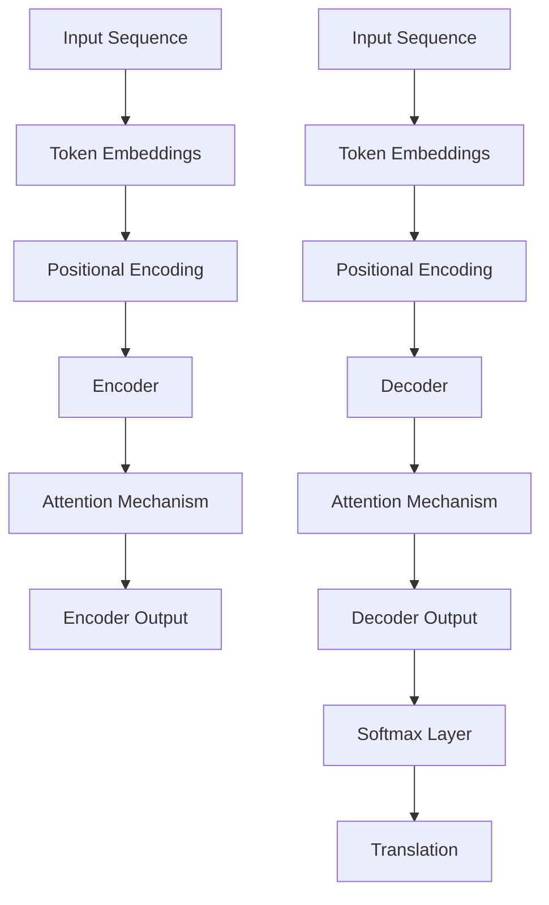

                 

### 引言：机器翻译与Transformer模型的兴起

#### 背景介绍

机器翻译（Machine Translation, MT）作为自然语言处理（Natural Language Processing, NLP）的重要分支，其目标是将一种语言的文本自动翻译成另一种语言。这一领域的历史可以追溯到上世纪50年代，但早期的机器翻译系统往往依赖基于规则的方法，这些方法尽管在某些特定的语言对上表现良好，但在处理多样性和复杂性方面存在明显局限。随着计算能力的提升和深度学习技术的发展，机器翻译迎来了新的契机。

Transformer模型的出现，无疑为机器翻译领域注入了新的活力。Transformer模型是由Google团队在2017年提出的一种基于注意力机制的序列到序列模型，它在机器翻译、文本摘要等NLP任务上取得了显著的成果。与传统循环神经网络（Recurrent Neural Networks, RNN）相比，Transformer模型在处理长序列方面更加高效，避免了长程依赖问题，并展现出了强大的并行处理能力。

#### 核心概念与联系

Transformer模型之所以能够在机器翻译中取得成功，关键在于其核心组件——注意力机制（Attention Mechanism）。注意力机制允许模型在处理序列数据时，动态地关注序列中的不同部分，从而实现更好的上下文理解和信息整合。

在Transformer模型中，注意力机制通过计算查询（Query）、键（Key）和值（Value）之间的相似度来实现。具体来说，每个输入序列中的元素都会被映射到这三个空间中的一个。查询向量表示当前要处理的元素，键和值向量则分别表示所有其他元素。

$$
Attention(Q, K, V) = \text{softmax}\left(\frac{QK^T}{\sqrt{d_k}}\right) V
$$

其中，\(Q, K, V\) 分别表示查询、键和值向量，\(d_k\) 是键向量的维度。通过这种方式，模型能够在处理每个元素时，自动地关注与当前元素相关的其他元素，从而实现对整个序列的上下文信息进行整合。

#### 核心概念原理之间的关系架构

为了更好地理解Transformer模型在机器翻译中的应用，我们可以通过Mermaid流程图来展示其核心组件和工作流程：

在这个流程图中，输入序列首先通过词嵌入（Token Embeddings）和位置编码（Positional Encoding）转化为密集的向量表示，然后输入到编码器（Encoder）中进行编码。编码器通过注意力机制，提取输入序列中的关键信息，并生成编码输出。在解码器（Decoder）中，同样通过注意力机制，解码器不仅关注输入序列的信息，还关注编码器的输出，最终生成翻译结果。

#### Transformer模型与机器翻译的关系

Transformer模型在机器翻译中的应用，主要体现在其能够有效地处理长序列和复杂的上下文信息。传统的RNN模型在处理长序列时容易受到梯度消失和梯度爆炸的问题，而Transformer模型通过并行计算和注意力机制，成功地解决了这些问题。

在机器翻译任务中，编码器（Encoder）负责将源语言的文本序列编码成固定长度的向量表示，这个向量包含了源文本的语义信息。解码器（Decoder）则利用编码器的输出和先前的解码输出，逐步生成目标语言的文本序列。

通过这种方式，Transformer模型能够捕获源语言和目标语言之间的复杂关系，从而实现高质量的翻译。此外，Transformer模型还可以结合预训练语言模型（如BERT、GPT等），进一步提升翻译效果。

总之，Transformer模型的引入，不仅为机器翻译领域带来了革命性的变化，也为其他NLP任务提供了新的思路和方法。接下来，我们将深入探讨Transformer模型的数学背景、架构细节以及训练和推理过程。

---

通过以上步骤，我们首先介绍了机器翻译和Transformer模型的基本背景，阐述了注意力机制的核心概念及其在Transformer模型中的应用，并通过Mermaid流程图展示了Transformer模型在机器翻译中的工作流程。在接下来的部分，我们将进一步探讨Transformer模型的数学背景和架构细节，为深入理解其工作原理打下基础。

