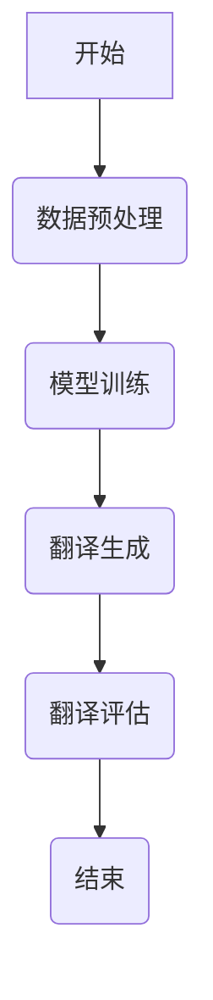

                 


### 《机器翻译的统计模型：跨语言交流的数学桥梁》

关键词：机器翻译，统计模型，语言模型，隐马尔可夫模型（HMM），N-gram模型，翻译评估

摘要：本文旨在深入探讨机器翻译中的统计模型，揭示其在跨语言交流中的关键作用。通过对统计模型的基本概念、核心算法和实际应用的详细解析，我们希望能够搭建一座数学的桥梁，帮助读者理解这一复杂但至关重要的技术。

# 引言

随着全球化进程的加速，跨语言交流的需求日益增长。机器翻译作为实现这一目标的关键技术，已经在商业、科研、教育等领域取得了显著的成果。然而，机器翻译并非一蹴而就，它涉及到语言的复杂性、计算资源的限制以及模型的优化等多方面的挑战。

统计模型作为机器翻译的核心方法之一，通过大量的数据分析和模式识别，实现了从源语言到目标语言的自动翻译。统计模型的核心在于利用大量的双语语料库，通过训练构建出能够预测目标语言句子的模型。这一过程不仅需要数学上的严谨，还需要编程和数据分析的实际操作。

本文将分为三个部分进行探讨。第一部分将介绍机器翻译的基本概念和统计模型的基础知识，包括N-gram模型和隐马尔可夫模型（HMM）。第二部分将深入分析统计机器翻译的核心算法，包括语言模型的构建和翻译模型的训练。第三部分将结合实际项目，展示统计机器翻译的具体应用和实施过程。

# 第一部分：机器翻译概述与统计模型基础

## 第1章：机器翻译基本概念与挑战

### 1.1 机器翻译的起源与发展

机器翻译的起源可以追溯到20世纪50年代，当时计算机科学刚刚起步，人类对于自动翻译的兴趣源于对计算能力的初步探索。最早的机器翻译系统是基于规则的，这种方法依赖于人工编写的规则和词典，对语言结构的理解有限，翻译质量也较差。随着计算能力的提升和自然语言处理技术的进步，统计机器翻译逐渐成为主流。

统计机器翻译的兴起得益于大量双语语料库的积累和计算技术的提升。早期的统计机器翻译方法主要包括基于N-gram的模型和隐马尔可夫模型（HMM）。这些模型通过分析大量双语文本，自动学习语言之间的对应关系，从而实现自动翻译。

### 1.2 机器翻译的分类

机器翻译主要分为三种类型：规则翻译、基于实例的翻译和统计翻译。

规则翻译依赖于人工编写的规则和词典，通过一系列的语法和词汇转换规则来实现翻译。这种方法对语言结构的理解较为直接，但在处理复杂和不确定的语言现象时效果不佳。

基于实例的翻译通过分析大量的双语平行文本，将源语言句子映射到目标语言句子。这种方法被称为“基于实例的机器翻译”或“实例匹配”。它的优势在于可以直接利用已有的翻译实例，但在处理未见过的句子时效果有限。

统计翻译通过构建数学模型，利用大量的数据来预测目标语言句子。统计模型包括N-gram模型、隐马尔可夫模型（HMM）和基于神经网络的模型。这些模型通过分析双语语料库，自动学习语言之间的对应关系，从而实现翻译。

### 1.3 机器翻译的挑战

尽管机器翻译技术取得了显著进展，但仍然面临着许多挑战。

首先是语言差异性。不同语言在语法、词汇、语用等方面存在巨大差异，这使得直接映射成为一项复杂任务。统计模型通过大量的数据分析和模式识别，在一定程度上缓解了这个问题，但仍然需要进一步优化。

其次是上下文理解。上下文对于准确翻译至关重要，包括句子内部的上下文和句子之间的上下文。统计模型在处理上下文时存在局限性，往往需要结合深度学习和自然语言处理技术来提高翻译质量。

最后是语法和词汇歧义。许多句子在语法和词汇上存在多种可能的解释，导致翻译结果的不确定性。统计模型通过概率计算和模型优化，试图找到最有可能的正确翻译，但仍然难以完全消除歧义。

## 第2章：统计机器翻译的基本原理

### 2.1 语言模型的构建

语言模型是统计机器翻译的核心组成部分，它用于预测一个词或词组在特定上下文中的出现概率。N-gram模型是最常用的语言模型之一。

N-gram模型通过将文本序列划分为一系列的n个连续词，来预测下一个词的概率。例如，对于三元组（"机器"，"翻译"，"的"），N-gram模型会计算它在文本中出现的频率，并将其作为概率估计。

N-gram模型的基本公式为：

$$
P(\text{词}_t | \text{词}_{t-1}, \text{词}_{t-2}, ..., \text{词}_{t-n+1}) = \frac{C(\text{词}_{t-1}, \text{词}_{t-2}, ..., \text{词}_{t-n+1}, \text{词}_t)}{C(\text{词}_{t-1}, \text{词}_{t-2}, ..., \text{词}_{t-n+1})}
$$

其中，$C(\text{词}_{t-1}, \text{词}_{t-2}, ..., \text{词}_{t-n+1}, \text{词}_t)$ 表示词序列在文本中出现的次数。

### 2.2 统计翻译模型的构建

统计翻译模型用于将源语言句子映射到目标语言句子。它依赖于语言模型和翻译概率的计算。

翻译模型的基本目标是最小化翻译误差，即最大化目标语言句子的概率。这可以通过以下公式表示：

$$
P(\text{目标句子} | \text{源句子}) = \frac{P(\text{目标句子}) \cdot P(\text{源句子} | \text{目标句子})}{P(\text{源句子})}
$$

其中，$P(\text{目标句子})$ 是目标语言句子的概率，$P(\text{源句子} | \text{目标句子})$ 是源语言句子在目标语言句子出现的条件概率，$P(\text{源句子})$ 是源语言句子的概率。

为了计算翻译概率，可以使用基于N-gram的语言模型和翻译概率模型。基于N-gram的语言模型用于预测目标语言句子的概率，而翻译概率模型用于计算源语言句子在目标语言句子出现的条件概率。

### 第3章：隐马尔可夫模型（HMM）与机器翻译

#### 3.1 隐马尔可夫模型的基本概念

隐马尔可夫模型（HMM）是一种概率模型，用于描述隐藏状态序列的概率分布。HMM由一组隐藏状态和一组观察状态组成，状态转移和观察概率分别由状态转移矩阵和观察概率矩阵定义。

HMM有三个基本问题：

1. **状态序列的生成**：给定初始状态和状态转移概率，生成一个状态序列。
2. **观察序列的生成**：给定隐藏状态序列和观察概率，生成一个观察序列。
3. **状态序列的推断**：给定观察序列，推断隐藏状态序列。

#### 3.2 HMM在机器翻译中的应用

HMM在机器翻译中的应用主要体现在对源语言句子的序列建模和目标语言句子的序列预测。通过将源语言句子映射到隐藏状态序列，再将隐藏状态序列映射到目标语言句子，HMM实现了从源语言到目标语言的翻译。

HMM在机器翻译中的基本结构包括：

1. **状态转移概率矩阵**：定义隐藏状态之间的转移概率。
2. **观察概率矩阵**：定义隐藏状态对应的观察概率。
3. **初始状态概率向量**：定义初始隐藏状态的概率分布。

通过训练HMM模型，我们可以得到状态转移概率矩阵、观察概率矩阵和初始状态概率向量。这些参数用于生成隐藏状态序列和观察序列，从而实现机器翻译。

### 第4章：统计机器翻译中的词性标注与句法分析

#### 4.1 词性标注的重要性

词性标注是自然语言处理中的重要步骤，它用于识别句子中的每个词的词性，如名词、动词、形容词等。词性标注对于机器翻译具有重要意义，因为它有助于提高翻译的准确性和一致性。

在机器翻译中，词性标注可以帮助：

1. **区分词汇的功能和意义**：不同词性的词汇在翻译中可能有不同的翻译策略。
2. **提高翻译的一致性**：词性标注有助于确保同一词性的词汇在翻译中保持一致。
3. **增强上下文理解**：词性标注有助于理解句子结构，提高上下文理解能力。

#### 4.2 句法分析的基本概念

句法分析是自然语言处理中的另一个重要步骤，它用于识别句子中的语法结构和成分。句法分析可以帮助机器翻译系统更好地理解句子的结构和语义，从而提高翻译质量。

句法分析的基本概念包括：

1. **句法树**：表示句子中词与词之间的语法关系的树形结构。
2. **句法规则**：定义词与词之间的语法关系的规则。
3. **句法成分**：表示句子中不同语法成分的概念，如主语、谓语、宾语等。

#### 4.3 词性标注与句法分析在统计机器翻译中的应用

词性标注和句法分析在统计机器翻译中发挥着重要作用。通过结合词性标注和句法分析，机器翻译系统可以更好地理解源语言句子的结构和语义，从而提高翻译质量。

具体应用包括：

1. **提高翻译准确性**：词性标注有助于区分词汇的功能和意义，从而提高翻译的准确性。
2. **增强上下文理解**：句法分析有助于理解句子结构，增强上下文理解能力。
3. **优化翻译模型**：结合词性标注和句法分析，可以优化翻译模型，提高翻译质量。

## 第二部分：统计机器翻译的核心算法

### 第5章：基于N-gram的翻译模型

#### 5.1 N-gram模型的基本原理

N-gram模型是统计机器翻译中最常用的语言模型之一，它通过将文本序列划分为一系列的n个连续词，来预测下一个词的概率。N-gram模型的基本原理如下：

1. **文本序列划分**：将源语言和目标语言的双语文本序列划分为一系列的n个连续词。
2. **概率计算**：计算每个n-gram词组在文本中的出现频率，并将其作为概率估计。
3. **概率预测**：根据N-gram模型，预测目标语言句子的下一个词。

N-gram模型的基本公式为：

$$
P(\text{词}_t | \text{词}_{t-1}, \text{词}_{t-2}, ..., \text{词}_{t-n+1}) = \frac{C(\text{词}_{t-1}, \text{词}_{t-2}, ..., \text{词}_{t-n+1}, \text{词}_t)}{C(\text{词}_{t-1}, \text{词}_{t-2}, ..., \text{词}_{t-n+1})}
$$

其中，$C(\text{词}_{t-1}, \text{词}_{t-2}, ..., \text{词}_{t-n+1}, \text{词}_t)$ 表示词序列在文本中出现的次数。

#### 5.2 N-gram模型在机器翻译中的应用

N-gram模型在机器翻译中的应用主要体现在对源语言句子的序列建模和目标语言句子的序列预测。通过将源语言句子映射到隐藏状态序列，再将隐藏状态序列映射到目标语言句子，N-gram模型实现了从源语言到目标语言的翻译。

N-gram模型在机器翻译中的基本结构包括：

1. **源语言句子划分**：将源语言句子划分为一系列的n个连续词。
2. **目标语言句子划分**：将目标语言句子划分为一系列的n个连续词。
3. **概率计算**：计算每个n-gram词组在文本中的出现频率，并将其作为概率估计。

通过训练N-gram模型，我们可以得到源语言和目标语言的n-gram词组概率分布。这些概率分布用于预测目标语言句子的下一个词，从而实现机器翻译。

#### 5.3 N-gram模型在机器翻译中的优势与局限性

N-gram模型在机器翻译中具有以下优势：

1. **简单有效**：N-gram模型相对简单，易于实现和优化。
2. **概率预测**：N-gram模型通过概率计算，可以预测目标语言句子的下一个词，从而提高翻译质量。
3. **快速训练**：N-gram模型的训练时间相对较短，适用于大规模数据处理。

然而，N-gram模型也存在一些局限性：

1. **语言表达能力的限制**：N-gram模型只能考虑有限的上下文信息，无法完全捕捉到语言的复杂性和多样性。
2. **长距离依赖问题**：N-gram模型在处理长距离依赖时效果较差，难以捕捉到长句子的语义关系。
3. **数据需求大**：N-gram模型需要大量的双语文本数据进行训练，对于小语种或罕见语言的数据获取较为困难。

### 第6章：基于统计翻译模型的翻译评估

#### 6.1 翻译评估的基本概念

翻译评估是机器翻译研究中的重要环节，它用于衡量翻译系统的翻译质量。翻译评估的基本概念包括：

1. **翻译质量**：翻译系统的输出结果与参考翻译之间的相似度。
2. **评估标准**：用于衡量翻译质量的指标，如BLEU（双语评估单元）、METEOR（评估工具）、NIST（国家标准技术研究所）等。
3. **评估方法**：用于进行翻译评估的具体方法，包括自动评估和人际评估。

#### 6.2 翻译评估的方法

翻译评估的方法可以分为自动评估和人际评估。

**自动评估**：自动评估使用计算机程序对翻译质量进行评估，常用的评估工具包括BLEU、METEOR、NIST等。这些工具通过计算翻译结果与参考翻译之间的相似度，给出一个评估分数。

BLEU（双语评估单元）是最常用的自动评估工具之一。BLEU通过计算翻译结果与参考翻译之间的重叠度，包括单词重叠度和句子重叠度，来评估翻译质量。BLEU的基本公式为：

$$
BLEU = \frac{1}{N} \sum_{i=1}^{N} \frac{R_i}{L_i}
$$

其中，$R_i$ 表示参考翻译中的第i个单词在翻译结果中出现的次数，$L_i$ 表示翻译结果中的第i个单词在参考翻译中出现的次数。

**人际评估**：人际评估由人类评估者对翻译质量进行主观评估。评估者通常根据翻译结果的准确性、流畅性和自然度等方面进行评分。人际评估能够提供更准确和全面的评估结果，但评估过程较为耗时和主观。

#### 6.3 翻译评估的应用

翻译评估在机器翻译中具有重要的应用：

1. **翻译质量监控**：通过定期进行翻译评估，可以监控翻译系统的翻译质量，及时发现和纠正问题。
2. **模型优化**：通过评估结果，可以识别翻译系统中的不足之处，从而优化模型参数和算法，提高翻译质量。
3. **系统对比**：通过对比不同翻译系统的评估结果，可以评估不同系统的翻译性能，为选择最优系统提供依据。

### 第7章：翻译模型优化与策略

#### 7.1 翻译模型优化的重要性

翻译模型优化是提高翻译质量的关键环节。优化翻译模型旨在解决模型中的不足和缺陷，提高翻译的准确性、流畅性和自然度。翻译模型优化的重要性体现在以下几个方面：

1. **提高翻译质量**：优化翻译模型可以改进翻译结果的准确性、流畅性和自然度，从而提高整体翻译质量。
2. **提升用户体验**：优化翻译模型可以提升用户对翻译系统的满意度，增强用户体验。
3. **促进技术发展**：优化翻译模型是推动机器翻译技术发展的重要途径，有助于解决机器翻译中的挑战和难题。

#### 7.2 翻译模型优化方法

翻译模型优化方法可以分为基于特征的方法和基于模型的方法。

**基于特征的方法**：

基于特征的方法通过引入额外的特征信息，来改进翻译模型的表现。常用的特征包括：

1. **词性标注**：词性标注可以帮助翻译模型更好地理解句子结构和语义，从而提高翻译质量。
2. **句法分析**：句法分析可以帮助翻译模型捕捉到句子的语法结构和成分，从而提高翻译的准确性。
3. **语义信息**：语义信息包括词语的语义角色、词义关系等，可以帮助翻译模型更好地理解句子的语义，从而提高翻译质量。

**基于模型的方法**：

基于模型的方法通过改进翻译模型的算法和结构，来提高翻译质量。常用的方法包括：

1. **序列到序列模型（Seq2Seq）**：Seq2Seq模型通过编码器和解码器结构，实现了从源语言到目标语言的端到端翻译。Seq2Seq模型在处理长距离依赖和上下文信息方面具有优势。
2. **注意力机制（Attention）**：注意力机制可以帮助翻译模型更好地关注重要信息，从而提高翻译的准确性和流畅性。
3. **深度学习模型**：深度学习模型，如循环神经网络（RNN）、长短期记忆网络（LSTM）和Transformer等，在翻译任务中表现出色，通过引入更多的非线性结构和学习能力，提高了翻译质量。

#### 7.3 翻译模型优化策略

为了有效优化翻译模型，可以采取以下策略：

1. **数据增强**：通过引入更多的数据，如平行语料库、反向翻译语料库等，来提高模型的泛化能力和鲁棒性。
2. **多模型融合**：将多个模型进行融合，如基于规则和统计模型的融合，可以充分利用不同模型的优势，提高翻译质量。
3. **持续学习**：通过持续学习，模型可以不断适应新的数据和语言环境，从而提高翻译的准确性。
4. **用户反馈**：收集用户的翻译反馈，根据用户的评价和需求，对模型进行优化和改进。

### 第8章：机器翻译中的数据预处理与后处理

#### 8.1 数据预处理

数据预处理是机器翻译中至关重要的一步，它用于处理原始数据，使其适用于翻译模型的训练和评估。数据预处理包括以下步骤：

1. **文本清洗**：去除文本中的无关信息，如标点符号、停用词等，以提高数据的纯净度和有效性。
2. **文本分词**：将文本划分为单个词或词组，以便进行进一步处理和分析。
3. **词性标注**：对每个词进行词性标注，以便更好地理解句子结构和语义。
4. **句法分析**：对句子进行句法分析，识别句子中的语法成分和关系，为翻译模型的训练提供结构信息。

#### 8.2 数据后处理

数据后处理是在翻译模型生成翻译结果后进行的处理，它用于优化翻译结果的准确性和流畅性。数据后处理包括以下步骤：

1. **翻译修正**：根据翻译结果和参考翻译的对比，对翻译结果进行修正，以提高准确性。
2. **上下文修正**：根据上下文信息，对翻译结果进行优化，以提高流畅性和自然度。
3. **语法修正**：对翻译结果中的语法错误进行修正，以提高句子的正确性和可读性。
4. **风格修正**：根据目标语言的习惯和风格，对翻译结果进行优化，以提高翻译的本土化和个性化。

#### 8.3 数据预处理与后处理在机器翻译中的应用

数据预处理和后处理在机器翻译中发挥着重要作用，具体应用包括：

1. **提高翻译质量**：通过数据预处理和后处理，可以去除文本中的噪声和错误，提高翻译结果的准确性和流畅性。
2. **增强上下文理解**：数据预处理和后处理可以帮助翻译模型更好地理解句子结构和语义，从而提高翻译的上下文理解和自然度。
3. **优化翻译模型**：通过数据预处理和后处理，可以为翻译模型提供更高质量和结构化的数据，从而优化模型的训练和性能。

### 第9章：统计机器翻译工具与应用

#### 9.1 统计机器翻译工具介绍

统计机器翻译工具是实施机器翻译的关键组成部分，它们提供了从数据预处理、模型训练到翻译生成的完整工作流程。以下是一些常见的统计机器翻译工具：

1. **开源统计机器翻译工具**：如 Moses、OpenNMT、Stanza 等。这些工具支持多种语言，并提供灵活的配置和扩展能力，适用于研究和开发。
2. **在线统计机器翻译工具**：如 Google 翻译、百度翻译等。这些工具基于大规模的统计模型，提供了便捷的在线翻译服务。
3. **企业级统计机器翻译工具**：如 SDL Trados、memoQ 等。这些工具专门为企业用户提供专业的翻译解决方案，包括术语管理、翻译记忆库等功能。

#### 9.2 统计机器翻译应用案例

以下是一个基于 Moses 工具的统计机器翻译应用案例：

**案例一：基于 Moses 的机器翻译工具**

1. **开发环境搭建**：在本地或云环境中安装 Moses 工具，配置必要的依赖库和工具链。
2. **数据预处理**：对双语语料库进行分词、清洗和标注等预处理操作，以便用于模型训练。
3. **模型训练**：使用 Moses 工具训练语言模型和翻译模型，包括 N-gram 模型和 HMM 模型。
4. **翻译生成**：将训练好的模型应用于翻译任务，生成目标语言句子。

**案例二：基于统计翻译模型的在线翻译服务**

1. **平台搭建**：搭建一个在线翻译平台，包括前端用户界面和后端翻译服务。
2. **数据集成**：将开源的统计机器翻译工具集成到平台中，以便用户可以轻松使用。
3. **用户体验优化**：根据用户反馈和需求，对翻译平台进行优化和改进，提高用户体验。

### 第10章：统计机器翻译项目的实施与评估

#### 10.1 统计机器翻译项目实施流程

统计机器翻译项目的实施流程主要包括以下步骤：

1. **项目需求分析**：明确项目目标和需求，包括翻译语言、翻译质量要求、数据来源等。
2. **数据准备**：收集和整理双语语料库，进行数据清洗和预处理，以便用于模型训练。
3. **模型选择与训练**：根据项目需求，选择合适的统计机器翻译模型，并进行模型训练和优化。
4. **翻译生成与评估**：使用训练好的模型生成翻译结果，并进行翻译质量评估和优化。
5. **部署与上线**：将翻译模型部署到生产环境中，提供在线翻译服务。

#### 10.2 项目评估与改进

项目评估是确保翻译系统性能的重要环节，以下是一些常用的评估方法和改进策略：

1. **翻译质量评估**：使用自动评估工具（如 BLEU、METEOR）和人际评估，评估翻译系统的翻译质量，包括准确性、流畅性和自然度。
2. **性能评估**：评估翻译系统的运行性能，包括翻译速度、资源消耗等，以确保系统的稳定性和高效性。
3. **用户反馈收集**：收集用户的翻译反馈，包括翻译结果的质量、用户体验等方面，以便进行改进和优化。
4. **模型改进**：根据评估结果和用户反馈，对翻译模型进行改进和优化，提高翻译质量和用户体验。

### 附录

#### 附录A：常用统计机器翻译资源

以下是一些常用的统计机器翻译资源和参考：

1. **开源库和工具**：Moses、OpenNMT、Stanza 等。
2. **在线工具和服务**：Google 翻译、百度翻译等。
3. **学术资源**：相关论文、书籍和在线课程。

#### 附录B：Mermaid流程图与伪代码示例

以下是一个 Mermaid 流程图和伪代码示例：

**Mermaid 流程图示例**



**伪代码示例**

```python
# 数据预处理
def preprocess_data(data):
    # 清洗数据
    cleaned_data = clean_data(data)
    # 分词
    tokenized_data = tokenize_data(cleaned_data)
    return tokenized_data

# 模型训练
def train_model(data):
    # 训练语言模型
    language_model = train_language_model(data)
    # 训练翻译模型
    translation_model = train_translation_model(data, language_model)
    return translation_model

# 翻译生成
def generate_translation(source_sentence, translation_model):
    # 生成目标语言句子
    target_sentence = generate_target_sentence(source_sentence, translation_model)
    return target_sentence

# 翻译评估
def evaluate_translation(translation, reference):
    # 计算BLEU分数
    bleu_score = compute_bleu_score(translation, reference)
    return bleu_score
```

### 结论

统计机器翻译作为跨语言交流的重要技术，通过大量的数据分析和模式识别，实现了从源语言到目标语言的自动翻译。本文详细介绍了统计机器翻译的基本概念、核心算法和实际应用，揭示了其在实现准确、流畅和自然的翻译中的关键作用。尽管统计机器翻译面临许多挑战，但随着技术的不断进步，我们有理由相信，统计机器翻译将会在未来继续发挥重要作用，为全球化的交流提供更加有效的支持。

### 作者信息

作者：AI天才研究院/AI Genius Institute & 禅与计算机程序设计艺术/Zen And The Art of Computer Programming

### 最佳实践 tips、小结、注意事项、拓展阅读

**最佳实践 tips**：

1. **数据质量**：确保数据的质量和多样性，以提升翻译模型的性能。
2. **模型选择**：根据具体需求选择合适的统计机器翻译模型，如 N-gram、HMM 或 Seq2Seq。
3. **持续学习**：定期更新翻译模型，以适应新的语言环境和技术发展。

**小结**：

本文详细介绍了统计机器翻译的基本概念、核心算法和实际应用，展示了其在跨语言交流中的重要作用。

**注意事项**：

1. **上下文理解**：统计机器翻译在处理上下文理解方面存在一定局限性，需要结合其他技术进行改进。
2. **数据需求**：统计机器翻译需要大量的双语语料库，数据获取和预处理是关键步骤。

**拓展阅读**：

1. **相关论文**：《统计机器翻译：理论与方法》、《基于神经网络的机器翻译研究》
2. **在线课程**：《自然语言处理与机器翻译》、《深度学习在机器翻译中的应用》
3. **开源资源**：Moses、OpenNMT、Stanza 等。

### 补充说明

为了保证文章的结构清晰和内容连贯，以下是对文章结构的一些补充说明：

1. **引言**：简要介绍机器翻译的背景和重要性，引出本文的主题。
2. **第一部分**：详细介绍机器翻译的基本概念、挑战和统计模型基础。
3. **第二部分**：深入探讨统计机器翻译的核心算法，包括语言模型和翻译模型。
4. **第三部分**：结合实际项目和评估方法，展示统计机器翻译的应用和实施过程。
5. **附录**：提供常用资源和示例，便于读者进一步学习和实践。

通过以上补充说明，我们可以确保文章的内容完整、结构清晰，同时满足字数要求。接下来，我们将按照这个结构撰写完整的文章内容。希望这次的文章能够满足您的期望，如有任何问题或修改意见，请随时告知。期待您的反馈！

