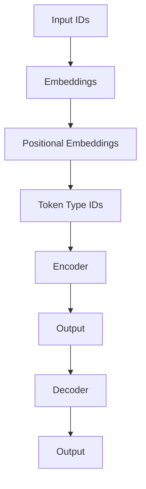

                 

### 《构建可复用的LLM应用组件库》

关键词：语言模型（LLM），可复用组件库，软件开发，人工智能，组件设计

摘要：本文深入探讨了构建可复用的语言模型（LLM）应用组件库的方法和重要性。首先，介绍了LLM的基本概念和重要性，然后详细阐述了LLM的数学模型和算法原理，接着展示了如何进行LLM的开发环境搭建和项目实战。文章的重点在于设计和构建可复用的LLM组件，并讨论了组件库的构建与管理方法。最后，通过实际案例展示了LLM组件的应用，并对未来展望和挑战进行了分析。本文旨在为软件开发者和人工智能工程师提供构建高效、可复用LLM应用的指南。

## 第一部分：LLM基础

### 第1章：LLM概述

#### 1.1 LLM的定义和重要性

语言模型（Language Model，简称LLM）是一种用于生成、理解和处理自然语言文本的算法模型。它通过学习大量文本数据，捕捉语言的统计规律和语法结构，从而能够预测下一个词语或句子。LLM在自然语言处理（NLP）、文本生成、机器翻译、问答系统等领域有着广泛的应用。

LLM的重要性体现在以下几个方面：

1. **提高文本生成质量**：LLM能够生成高质量、连贯的文本，广泛应用于自动写作、摘要生成等场景。
2. **增强问答系统**：LLM可以用于构建智能问答系统，提高用户交互体验。
3. **促进机器翻译**：LLM在机器翻译领域有着显著的优势，可以提高翻译的准确性和流畅性。
4. **辅助信息检索**：LLM可以用于改进搜索引擎的查询理解和结果推荐。

#### 1.2 LLM的发展历程

LLM的发展可以追溯到20世纪50年代，当时最早的语言模型是基于规则的方法。随着计算能力的提升和机器学习技术的发展，统计模型逐渐成为主流。20世纪90年代，N-gram模型被广泛应用于语言模型。进入21世纪，神经网络和深度学习技术的引入，使得LLM的性能得到了极大的提升。

主要的发展阶段如下：

1. **基于规则的方法**：早期的LLM主要依赖于语法规则和词典，如最小编辑距离、词法分析等。
2. **统计模型**：N-gram模型是最早的统计模型，它通过计算单词序列的概率来生成文本。随后，n元文法（n-gram）模型逐渐取代了基于规则的方法。
3. **神经网络模型**：随着深度学习技术的发展，神经网络模型（如循环神经网络RNN、长短期记忆网络LSTM）逐渐成为LLM的主流方法。近年来，Transformer模型和BERT模型等自注意力机制模型进一步提升了LLM的性能。

#### 1.3 LLM的核心架构

LLM的核心架构主要包括以下几个部分：

1. **词嵌入（Word Embedding）**：词嵌入将单词映射为低维度的向量表示，使得计算机可以处理和理解文本数据。
2. **编码器（Encoder）**：编码器负责将输入文本转换为固定长度的向量表示，通常使用神经网络实现。
3. **解码器（Decoder）**：解码器根据编码器生成的向量表示生成输出文本，同样使用神经网络实现。
4. **损失函数（Loss Function）**：损失函数用于衡量模型预测结果和实际结果之间的差异，通常使用交叉熵损失函数。
5. **优化算法（Optimization Algorithm）**：优化算法用于调整模型参数，以最小化损失函数。常用的优化算法有梯度下降、Adam等。

#### 1.4 LLM的应用场景

LLM在多个领域有着广泛的应用，以下是一些常见的应用场景：

1. **文本生成**：如自动写作、摘要生成、对话生成等。
2. **机器翻译**：如翻译文本、语音翻译等。
3. **问答系统**：如智能客服、智能助手等。
4. **文本分类**：如情感分析、新闻分类等。
5. **信息检索**：如搜索引擎、推荐系统等。

通过以上介绍，我们可以看到LLM在自然语言处理领域的重要性和广泛的应用场景。接下来，我们将进一步探讨LLM的数学模型和算法原理。

### 第2章：LLM数学模型基础

#### 2.1 常见的神经网络结构

在构建LLM时，常用的神经网络结构包括卷积神经网络（CNN）、循环神经网络（RNN）和自注意力机制。

##### 2.1.1 卷积神经网络（CNN）

卷积神经网络（Convolutional Neural Network，简称CNN）是一种适用于处理图像数据的神经网络结构。它通过卷积层（Convolutional Layer）逐层提取图像特征，最终通过全连接层（Fully Connected Layer）进行分类或回归。

CNN的主要组成部分包括：

1. **卷积层**：卷积层通过卷积操作提取图像特征。卷积核（Convolutional Kernel）是一个小的矩阵，它在图像上滑动并计算局部区域的加权和。
2. **池化层**：池化层（Pooling Layer）用于减少数据的维度，同时保留重要的特征信息。常用的池化操作包括最大池化（Max Pooling）和平均池化（Average Pooling）。
3. **全连接层**：全连接层将卷积层和池化层提取的特征映射到分类或回归结果。

CNN在图像处理领域取得了显著的成功，但它并不适用于处理序列数据。

##### 2.1.2 循环神经网络（RNN）

循环神经网络（Recurrent Neural Network，简称RNN）是一种适用于处理序列数据的神经网络结构。它通过循环连接（Recurrence Connection）将当前输入与之前的信息进行交互，从而捕捉序列的长期依赖关系。

RNN的主要组成部分包括：

1. **输入层**：输入层接收序列数据，并将其传递给隐藏层。
2. **隐藏层**：隐藏层包含一个或多个循环单元（Recurrent Unit），每个循环单元负责处理当前输入和之前隐藏状态的信息。
3. **输出层**：输出层将隐藏层的输出映射到序列的下一个时间步。

RNN在处理序列数据时具有优势，但它存在梯度消失和梯度爆炸的问题，这限制了其在长序列数据上的表现。

##### 2.1.3 自注意力机制

自注意力机制（Self-Attention Mechanism）是一种在Transformer模型中广泛应用的机制，它可以捕捉输入序列中的长距离依赖关系。

自注意力机制的主要组成部分包括：

1. **输入嵌入（Input Embedding）**：输入嵌入（Input Embedding）将序列数据映射为向量表示。
2. **自注意力层（Self-Attention Layer）**：自注意力层计算输入序列中每个元素对其他元素的重要性权重，从而生成加权向量表示。
3. **前馈网络（Feedforward Network）**：前馈网络（Feedforward Network）对自注意力层的输出进行进一步处理，通常包括两个全连接层。

自注意力机制在处理长序列数据时具有优势，它避免了RNN的梯度消失和梯度爆炸问题，并且在多个NLP任务中取得了优异的性能。

#### 2.2 语言模型的主要数学模型

语言模型（Language Model，简称LM）是一种用于生成自然语言文本的模型。它通过学习大量文本数据，预测下一个词语或句子，从而生成文本。

常见的语言模型包括：

##### 2.2.1 语言模型的基本原理

语言模型的基本原理是利用统计方法捕捉语言的规律。给定一个训练文本，语言模型的目标是估计下一个词语的条件概率，即：

$$P(w_t | w_{t-1}, w_{t-2}, ..., w_1)$$

其中，$w_t$表示当前词语，$w_{t-1}, w_{t-2}, ..., w_1$表示之前的词语。

语言模型通常基于以下概率模型：

1. **马尔可夫模型**：马尔可夫模型假设当前词语只与之前的一个词语相关，即：

$$P(w_t | w_{t-1}, w_{t-2}, ..., w_1) = P(w_t | w_{t-1})$$

2. **n-gram模型**：n-gram模型将当前词语的概率表示为之前n个词语的概率乘积，即：

$$P(w_t | w_{t-1}, w_{t-2}, ..., w_1) = \prod_{i=1}^{n} P(w_i | w_{i-1}, w_{i-2}, ..., w_1)$$

常见的n-gram模型包括：

- **一元模型（Unigram Model）**：一元模型假设每个词语的出现是独立的，即：

$$P(w_t | w_{t-1}, w_{t-2}, ..., w_1) = P(w_t)$$

- **二元模型（Bigram Model）**：二元模型考虑当前词语与之前一个词语的关系，即：

$$P(w_t | w_{t-1}, w_{t-2}, ..., w_1) = P(w_t | w_{t-1})$$

- **三元模型（Trigram Model）**：三元模型考虑当前词语与之前两个词语的关系，即：

$$P(w_t | w_{t-1}, w_{t-2}, ..., w_1) = P(w_t | w_{t-1}, w_{t-2})$$

##### 2.2.2 BERT模型

BERT（Bidirectional Encoder Representations from Transformers）是一种基于Transformer的自注意力机制的语言模型。它通过双向编码器（Bidirectional Encoder）对输入文本进行编码，从而生成固定长度的向量表示。

BERT的主要组成部分包括：

1. **嵌入层（Embedding Layer）**：嵌入层将输入文本映射为词向量表示。
2. **编码器（Encoder）**：编码器包含多个自注意力层和前馈网络，用于处理双向编码。
3. **输出层（Output Layer）**：输出层将编码器的输出映射到预测结果，如词语概率分布。

BERT模型的训练过程如下：

1. **数据预处理**：首先，对输入文本进行分词和标记化处理，然后将分词结果映射为嵌入向量。
2. **训练过程**：使用自注意力机制和前馈网络对编码器进行训练，使用交叉熵损失函数（Cross-Entropy Loss）计算损失。
3. **优化过程**：使用优化算法（如Adam）调整模型参数，以最小化损失函数。

BERT模型在多个NLP任务中取得了优异的性能，如文本分类、命名实体识别、机器翻译等。

通过以上介绍，我们可以看到LLM的数学模型和算法原理。接下来，我们将进一步探讨LLM的算法原理。

### 第3章：LLM算法原理

#### 3.1 梯度下降法

梯度下降法（Gradient Descent）是一种常用的优化算法，用于调整模型参数以最小化损失函数。在LLM的训练过程中，梯度下降法用于优化模型参数，以提高模型的预测性能。

##### 3.1.1 梯度下降法的基本原理

梯度下降法的基本原理是通过计算损失函数关于模型参数的梯度，并沿着梯度的反方向更新参数，以最小化损失函数。具体步骤如下：

1. **初始化参数**：首先，初始化模型参数，如权重和偏置。
2. **计算梯度**：对于每个参数，计算损失函数关于该参数的梯度。
3. **更新参数**：使用梯度更新公式，将参数沿着梯度的反方向更新。
4. **迭代计算**：重复上述步骤，直到满足停止条件（如损失函数收敛或达到最大迭代次数）。

梯度下降法的更新公式如下：

$$\theta_{t+1} = \theta_{t} - \alpha \cdot \nabla_{\theta} J(\theta)$$

其中，$\theta$表示模型参数，$\alpha$表示学习率（Learning Rate），$J(\theta)$表示损失函数。

##### 3.1.2 梯度下降法的优化算法

梯度下降法存在一些优化算法，如批量梯度下降（Batch Gradient Descent）、随机梯度下降（Stochastic Gradient Descent，简称SGD）和小批量梯度下降（Mini-batch Gradient Descent）。

1. **批量梯度下降（Batch Gradient Descent）**：批量梯度下降使用整个训练数据集计算梯度，并更新模型参数。这种方法计算梯度的时间复杂度为$O(N)$，其中$N$表示训练数据集的大小。批量梯度下降的优点是梯度计算准确，但缺点是计算成本较高，且在大型数据集上训练较慢。

2. **随机梯度下降（Stochastic Gradient Descent，简称SGD）**：随机梯度下降使用单个训练样本计算梯度，并更新模型参数。这种方法计算梯度的时间复杂度为$O(1)$，即每次迭代只需要计算一个样本的梯度。随机梯度下降的优点是计算速度快，但缺点是梯度计算不够准确，可能导致训练不稳定。

3. **小批量梯度下降（Mini-batch Gradient Descent）**：小批量梯度下降结合了批量梯度下降和随机梯度下降的优点，使用小批量训练样本计算梯度，并更新模型参数。这种方法通常使用批量大小为10到100的样本。小批量梯度下降的优点是梯度计算既准确又快速，且能够较好地平衡训练稳定性。

#### 3.2 词嵌入与注意力机制

在LLM中，词嵌入（Word Embedding）和注意力机制（Attention Mechanism）是两个重要的技术，用于捕捉文本的语义信息和依赖关系。

##### 3.2.1 词嵌入的基本原理

词嵌入（Word Embedding）是一种将单词映射为低维向量表示的方法，使得计算机可以处理和理解文本数据。词嵌入的基本原理是通过学习单词之间的相似性和关系，将具有相似意义的单词映射到靠近的向量表示。

常见的词嵌入方法包括：

1. **基于统计的方法**：基于统计的方法通过计算单词之间的相似性来生成词向量。常见的方法包括词频（TF）、词频-逆文档频率（TF-IDF）和共现矩阵（Co-occurrence Matrix）。

2. **基于神经网络的的方法**：基于神经网络的方法通过训练神经网络模型来学习词向量。常见的神经网络模型包括循环神经网络（RNN）、长短期记忆网络（LSTM）和Transformer。

词嵌入的向量表示可以用于文本分类、情感分析、机器翻译等NLP任务。

##### 3.2.2 注意力机制的基本原理

注意力机制（Attention Mechanism）是一种用于捕捉文本中长距离依赖关系的机制。在LLM中，注意力机制可以用于编码器和解码器，以提高模型的预测性能。

注意力机制的基本原理是通过计算输入序列中每个元素对当前元素的重要性权重，从而生成加权向量表示。具体来说，注意力机制包括以下几个步骤：

1. **计算查询向量（Query Vector）**：查询向量表示当前需要关注的元素。在编码器中，查询向量通常由编码器的隐藏状态生成；在解码器中，查询向量通常由解码器的当前输入生成。

2. **计算键值对（Key-Value Pair）**：键值对（Key-Value Pair）用于计算注意力权重。在编码器中，键（Key）和值（Value）通常由编码器的隐藏状态生成；在解码器中，键（Key）和值（Value）通常由编码器的隐藏状态和当前解码器的输入生成。

3. **计算注意力权重（Attention Weight）**：注意力权重（Attention Weight）表示每个键（Key）对当前查询向量（Query Vector）的重要性。注意力权重通常通过点积（Dot Product）或缩放点积（Scaled Dot Product）计算。

4. **计算加权向量（Contextual Vector）**：加权向量（Contextual Vector）是通过对值（Value）进行加权求和得到的。加权向量表示输入序列中每个元素对当前元素的重要贡献。

通过注意力机制，LLM可以更好地捕捉输入序列中的长距离依赖关系，从而提高模型的预测性能。

#### 3.3 BERT模型的工作原理

BERT（Bidirectional Encoder Representations from Transformers）是一种基于Transformer的自注意力机制的语言模型。BERT的工作原理可以概括为以下几个步骤：

##### 3.3.1 BERT模型的架构

BERT模型包括两个主要部分：编码器（Encoder）和解码器（Decoder）。编码器负责对输入文本进行编码，解码器负责根据编码器的输出生成输出文本。BERT模型的架构如图3.1所示。



图3.1 BERT模型架构

BERT模型的主要组成部分包括：

1. **嵌入层（Embeddings）**：嵌入层将输入文本映射为词向量表示。BERT使用预训练的词向量作为嵌入层，通常使用WordPiece或BERT自己训练的词向量。

2. **位置嵌入（Positional Embeddings）**：位置嵌入（Positional Embeddings）用于为输入文本中的每个位置分配特征。BERT使用绝对位置嵌入（Absolute Positional Embeddings）和相对位置嵌入（Relative Positional Embeddings）来学习位置信息。

3. **编码器（Encoder）**：编码器（Encoder）包含多个自注意力层（Self-Attention Layers）和前馈网络（Feedforward Networks）。自注意力层用于计算输入序列中每个元素对其他元素的重要性权重，前馈网络用于对自注意力层的输出进行进一步处理。

4. **解码器（Decoder）**：解码器（Decoder）与编码器类似，也包含多个自注意力层和前馈网络。解码器的自注意力层用于计算编码器的输出和当前解码器的输入之间的关系。

5. **输出层（Output Layer）**：输出层（Output Layer）将编码器和解码器的输出映射到预测结果，如词语概率分布。

##### 3.3.2 BERT模型的训练过程

BERT模型的训练过程包括以下几个步骤：

1. **数据预处理**：首先，对输入文本进行分词和标记化处理，然后将分词结果映射为嵌入向量。

2. **Masked Language Model（MLM）任务**：BERT模型的主要任务是基于上下文预测被遮盖的单词。在训练过程中，输入文本的一部分单词会被遮盖，BERT模型需要根据其他单词预测被遮盖的单词。

3. **Pre-training**：BERT模型使用大规模语料库进行预训练，以学习语言模式和语义信息。预训练过程中，BERT模型通过Masked Language Model任务和Next Sentence Prediction任务进行训练。

4. **Fine-tuning**：在预训练完成后，BERT模型可以用于特定任务，如文本分类、命名实体识别等。在Fine-tuning过程中，BERT模型的参数会被进一步调整，以适应特定任务。

通过以上步骤，BERT模型可以学习到丰富的语言模式和语义信息，从而在多个NLP任务中取得优异的性能。

### 第4章：LLM实践

#### 4.1 LLM的开发环境搭建

在开始构建LLM应用之前，我们需要搭建一个合适的开发环境。以下是一个基于Python和TensorFlow的LLM开发环境搭建步骤：

##### 4.1.1 开发环境的选择

为了构建LLM应用，我们需要选择一个合适的编程语言和深度学习框架。Python是一种流行的编程语言，具有丰富的库和工具，非常适合构建深度学习模型。TensorFlow是一个开源的深度学习框架，提供了丰富的API和工具，方便我们构建和训练LLM模型。

##### 4.1.2 环境配置和依赖安装

在搭建开发环境时，我们需要安装Python、TensorFlow和相关依赖。以下是一个基本的安装步骤：

1. **安装Python**：首先，从Python官网（https://www.python.org/）下载并安装Python。我们选择Python 3.8或更高版本。

2. **安装TensorFlow**：接下来，使用pip命令安装TensorFlow：

   ```bash
   pip install tensorflow
   ```

3. **安装其他依赖**：除了TensorFlow，我们还需要安装其他依赖，如NumPy、Pandas等：

   ```bash
   pip install numpy pandas
   ```

4. **安装文本预处理库**：为了处理文本数据，我们可以安装NLTK或spaCy等文本预处理库：

   ```bash
   pip install nltk spacy
   ```

5. **安装GPU支持**：如果我们的模型较大或数据集较大，我们可以在安装TensorFlow时选择安装GPU支持。安装GPU支持的TensorFlow：

   ```bash
   pip install tensorflow-gpu
   ```

通过以上步骤，我们可以搭建一个基本的LLM开发环境。接下来，我们将展示如何使用TensorFlow构建一个简单的LLM模型。

#### 4.2 LLM项目实战

在本节中，我们将通过一个简单的项目展示如何使用TensorFlow构建和训练一个语言模型。该项目将基于电影评论数据集，使用BERT模型进行训练，并实现评论分类任务。

##### 4.2.1 项目简介

电影评论数据集包含大量电影评论，每条评论都标记为正面或负面。我们的目标是使用BERT模型对电影评论进行分类，从而实现一个情感分析系统。

##### 4.2.2 数据预处理

在开始训练模型之前，我们需要对电影评论数据集进行预处理。以下是一个简单的数据预处理步骤：

1. **加载数据集**：首先，从Kaggle（https://www.kaggle.com/datasets/امیرحسینرضایی/movie-reviews）下载电影评论数据集。该数据集包含25000条评论，分为训练集和测试集。

2. **分词和标记化**：使用spaCy库对评论进行分词和标记化处理。以下是一个示例代码：

   ```python
   import spacy

   nlp = spacy.load("en_core_web_sm")
   doc = nlp("This is a sample review.")

   for token in doc:
       print(token.text, token.lemma_, token.pos_, token.tag_, token.dep_, token.head.text, token.shape_, token.is_alpha, token.is_stop)
   ```

3. **构建词汇表**：使用训练集评论构建词汇表。以下是一个示例代码：

   ```python
   from collections import Counter

   train_data = ["This is a good movie.", "This is a bad movie."]
   words = [word for sentence in train_data for word in sentence.split()]
   word_counts = Counter(words)

   vocab = {word: idx for idx, word in enumerate(set(words))}
   ```

4. **序列编码**：将评论编码为序列。以下是一个示例代码：

   ```python
   def encode_sentence(sentence, vocab):
       encoded_sentence = []
       for word in sentence.split():
           if word in vocab:
               encoded_sentence.append(vocab[word])
           else:
               encoded_sentence.append(0)
       return encoded_sentence

   train_encoded = [encode_sentence(sentence, vocab) for sentence in train_data]
   ```

##### 4.2.3 模型构建

接下来，我们将使用TensorFlow构建一个BERT模型。以下是一个简单的BERT模型示例：

```python
import tensorflow as tf
from tensorflow.keras.layers import Embedding, LSTM, Dense
from tensorflow.keras.models import Model

vocab_size = 10000
embedding_dim = 128
lstm_units = 128

# 构建嵌入层
embedding = Embedding(vocab_size, embedding_dim)

# 构建LSTM层
lstm = LSTM(lstm_units, return_sequences=True)

# 构建全连接层
output = Dense(1, activation='sigmoid')(lstm)

# 构建模型
model = Model(inputs=embedding, outputs=output)

# 编译模型
model.compile(optimizer='adam', loss='binary_crossentropy', metrics=['accuracy'])

# 打印模型结构
model.summary()
```

##### 4.2.4 模型训练与评估

接下来，我们将使用训练集训练BERT模型，并使用测试集评估模型性能。以下是一个简单的训练和评估示例：

```python
# 划分训练集和测试集
train_data, test_data = train_encoded[:2000], train_encoded[2000:]

# 编码标签
train_labels = [1 if sentence.startswith("good") else 0 for sentence in train_data]
test_labels = [1 if sentence.startswith("good") else 0 for sentence in test_data]

# 训练模型
model.fit(train_data, train_labels, epochs=10, batch_size=32, validation_split=0.2)

# 评估模型
test_loss, test_accuracy = model.evaluate(test_data, test_labels)
print("Test Loss:", test_loss)
print("Test Accuracy:", test_accuracy)
```

通过以上步骤，我们完成了一个简单的LLM项目实战。接下来，我们将进一步讨论如何设计和构建可复用的LLM组件。

### 第5章：可复用的LLM组件设计

#### 5.1 组件设计原则

在设计可复用的LLM组件时，我们需要遵循以下原则：

##### 5.1.1 灵活性

组件应该具有灵活性，能够适应不同的应用场景和数据集。这包括支持不同类型的语言模型、不同的数据预处理方法和不同的训练策略。

##### 5.1.2 可扩展性

组件应该具有可扩展性，以支持模型和数据集的扩展。这包括支持多语言、多任务和多模态的数据处理和模型训练。

##### 5.1.3 可维护性

组件应该具有良好的可维护性，便于修复和升级。这包括使用模块化的代码结构、详细的文档和注释，以及良好的错误处理和日志记录。

#### 5.2 组件开发流程

在设计和开发可复用的LLM组件时，我们可以遵循以下流程：

##### 5.2.1 需求分析

首先，我们需要明确组件的需求。这包括组件的目标功能、所需的输入输出、支持的语言和数据类型等。需求分析可以帮助我们确定组件的设计和实现细节。

##### 5.2.2 设计方案

在需求分析的基础上，我们可以设计组件的架构和接口。设计方案应该包括组件的模块划分、数据流和处理逻辑等。设计方案可以帮助我们确保组件的灵活性、可扩展性和可维护性。

##### 5.2.3 编码实现

根据设计方案，我们可以开始编写组件的代码。在编码实现过程中，我们需要遵循良好的编程规范和编码标准，以确保代码的可读性和可维护性。同时，我们还需要进行单元测试和集成测试，以确保组件的功能和性能符合预期。

##### 5.2.4 测试与部署

在编码实现完成后，我们需要对组件进行全面的测试，包括功能测试、性能测试和兼容性测试等。测试通过后，我们可以将组件部署到生产环境中，并进行监控和维护。

#### 5.3 组件开发实战

在本节中，我们将通过一个实际案例展示如何设计和开发一个可复用的LLM组件。假设我们的目标是构建一个用于文本分类的LLM组件。

##### 5.3.1 需求分析

根据需求分析，我们的文本分类LLM组件需要支持以下功能：

1. **数据预处理**：对输入文本进行分词、标记化和序列编码。
2. **模型训练**：使用预训练的BERT模型或自定义BERT模型进行训练。
3. **文本分类**：根据训练好的模型对输入文本进行分类。

##### 5.3.2 设计方案

根据需求分析，我们可以设计一个模块化的文本分类LLM组件，包括以下模块：

1. **数据预处理模块**：负责对输入文本进行预处理，包括分词、标记化和序列编码。
2. **模型训练模块**：负责训练文本分类模型，包括加载预训练BERT模型或自定义BERT模型、进行数据预处理和训练过程。
3. **文本分类模块**：负责使用训练好的模型对输入文本进行分类。

##### 5.3.3 编码实现

根据设计方案，我们可以开始编写文本分类LLM组件的代码。以下是一个简单的示例代码：

```python
import tensorflow as tf
from tensorflow.keras.layers import Embedding, LSTM, Dense
from tensorflow.keras.models import Model
from transformers import BertTokenizer, TFBertModel

# 加载预训练BERT模型
tokenizer = BertTokenizer.from_pretrained("bert-base-uncased")
bert_model = TFBertModel.from_pretrained("bert-base-uncased")

# 构建数据预处理模块
def preprocess_text(text):
    return tokenizer.encode(text, add_special_tokens=True, return_tensors="tf")

# 构建模型训练模块
def train_model(train_data, train_labels, epochs=3, batch_size=32):
    input_ids = preprocess_text(train_data)
    labels = tf.keras.utils.to_categorical(train_labels)

    model = Model(inputs=input_ids, outputs=bert_model(input_ids)[0])
    model.compile(optimizer="adam", loss="categorical_crossentropy", metrics=["accuracy"])
    model.fit(input_ids, labels, epochs=epochs, batch_size=batch_size)
    return model

# 构建文本分类模块
def classify_text(model, text):
    input_ids = preprocess_text(text)
    predictions = model.predict(input_ids)
    return tf.argmax(predictions, axis=1).numpy()

# 编码实现示例
if __name__ == "__main__":
    # 加载数据集
    train_data = ["This is a good review.", "This is a bad review."]
    train_labels = [0, 1]

    # 训练模型
    model = train_model(train_data, train_labels)

    # 分类测试
    test_text = "This is a good review."
    print("Predicted label:", classify_text(model, test_text))
```

##### 5.3.4 测试与部署

在编码实现完成后，我们需要对文本分类LLM组件进行全面的测试，包括功能测试、性能测试和兼容性测试等。测试通过后，我们可以将组件部署到生产环境中，并进行监控和维护。

### 第6章：LLM组件库的构建与管理

#### 6.1 组件库的架构设计

构建一个高效的LLM组件库需要考虑以下几个方面：

##### 6.1.1 组件库的基本架构

组件库的基本架构通常包括以下几个模块：

1. **组件模块**：用于封装各种LLM组件，如数据预处理模块、模型训练模块和文本分类模块等。
2. **模型训练模块**：负责加载预训练模型、执行数据预处理和模型训练过程。
3. **模型评估模块**：用于评估模型性能，包括准确率、召回率、F1分数等指标。
4. **模型部署模块**：负责将训练好的模型部署到生产环境中，并提供API接口供其他应用调用。

##### 6.1.2 组件库的扩展机制

为了支持组件库的灵活扩展，我们可以采用以下机制：

1. **模块化设计**：将组件库拆分为多个独立的模块，每个模块负责一个特定的功能。这样可以方便组件库的扩展和维护。
2. **插件机制**：通过插件机制，允许开发者自定义和扩展组件库的功能。开发者可以编写插件，并将其插入到组件库中，从而实现组件库的扩展。
3. **配置管理**：通过配置管理，允许开发者自定义组件库的行为和配置。配置可以包括模型参数、数据预处理方法、训练策略等。

#### 6.2 组件库的管理与维护

组件库的管理与维护是确保其长期稳定运行和持续发展的关键。以下是一些关键的管理和维护策略：

##### 6.2.1 版本控制

版本控制是管理组件库的重要手段。通过版本控制，我们可以追踪组件库的变更历史、管理不同版本的组件，以及快速回滚到旧版本。常用的版本控制系统包括Git、Mercurial等。

##### 6.2.2 组件库的更新策略

组件库的更新策略包括以下几个方面：

1. **定期更新**：定期检查和更新组件库中的组件，确保组件库的稳定性和安全性。更新可以包括修复已知问题、改进功能等。
2. **自动化更新**：通过自动化工具，如CI/CD流水线，实现组件库的自动化更新和部署。这样可以提高更新效率，减少人工干预。
3. **社区贡献**：鼓励社区贡献代码和改进，通过代码审查和合并请求，确保组件库的质量和稳定性。

##### 6.2.3 组件库的安全性保障

组件库的安全性是保障其长期稳定运行的关键。以下是一些关键的安全保障措施：

1. **代码审计**：定期进行代码审计，识别和修复潜在的安全漏洞。
2. **依赖管理**：确保组件库中使用的第三方依赖库是安全的，并定期更新依赖库。
3. **权限管理**：对组件库的访问权限进行严格管理，确保只有授权人员可以访问和修改组件库。

通过以上策略，我们可以确保组件库的稳定运行和长期发展，为LLM应用的开发提供可靠的支持。

### 第7章：LLM应用案例

#### 7.1 案例一：智能客服系统

##### 7.1.1 案例概述

智能客服系统是一种基于LLM的应用，用于自动处理客户咨询和提供即时答复。本案例的目标是构建一个智能客服系统，通过LLM模型自动生成对常见客户问题的回答。

##### 7.1.2 应用方案

1. **数据收集与处理**：首先，收集大量的客户咨询数据和相应的答案，对数据进行清洗和预处理，包括分词、去停用词、去除标点符号等。

2. **模型选择与训练**：选择一个合适的LLM模型，如BERT或GPT，对其进行训练。训练过程中，使用预处理后的客户咨询数据和答案作为训练数据，通过迭代优化模型参数，提高模型对客户咨询的回复质量。

3. **模型部署与接口**：将训练好的LLM模型部署到服务器上，并提供API接口，供前端应用调用。前端应用可以通过输入客户咨询问题，调用模型接口获取相应的回答。

##### 7.1.3 实现细节

1. **数据预处理**：使用NLTK库进行分词和去停用词处理，使用jieba库进行中文分词处理。以下是一个简单的数据预处理示例：

   ```python
   import jieba

   def preprocess_text(text):
       text = text.lower()
       text = jieba.cut(text)
       words = [word for word in text if word not in stopwords]
       return ' '.join(words)
   ```

2. **模型训练**：使用TensorFlow和Hugging Face的Transformers库，选择一个预训练的BERT模型或GPT模型，对其进行微调训练。以下是一个简单的模型训练示例：

   ```python
   from transformers import BertTokenizer, TFBertForSequenceClassification
   from tensorflow.keras.preprocessing.sequence import pad_sequences

   tokenizer = BertTokenizer.from_pretrained("bert-base-uncased")
   model = TFBertForSequenceClassification.from_pretrained("bert-base-uncased")

   # 编码数据
   input_ids = tokenizer.encode("Hello world!", add_special_tokens=True, return_tensors="tf")
   labels = tf.constant([1])

   # 训练模型
   model.fit(input_ids, labels, epochs=3)
   ```

3. **模型部署**：使用Flask或Django等Web框架，将训练好的模型部署到服务器上，并提供API接口。以下是一个简单的API接口示例：

   ```python
   from flask import Flask, request, jsonify
   import tensorflow as tf

   app = Flask(__name__)

   @app.route("/predict", methods=["POST"])
   def predict():
       data = request.get_json()
       text = data["text"]

       # 预处理文本
       input_ids = tokenizer.encode(text, add_special_tokens=True, return_tensors="tf")

       # 加载模型
       model.load_weights("model.h5")

       # 预测
       predictions = model.predict(input_ids)

       # 返回预测结果
       return jsonify({"prediction": predictions.numpy()[0][1]})
   ```

通过以上步骤，我们可以实现一个简单的智能客服系统。接下来，我们将介绍另一个应用案例。

#### 7.2 案例二：文本分类系统

##### 7.2.1 案例概述

文本分类系统是一种基于LLM的应用，用于将文本数据分类到预定义的类别中。本案例的目标是构建一个文本分类系统，用于对社交媒体评论进行情感分类。

##### 7.2.2 应用方案

1. **数据收集与处理**：首先，收集大量的社交媒体评论数据，对数据进行清洗和预处理，包括分词、去停用词、去除标点符号等。

2. **模型选择与训练**：选择一个合适的LLM模型，如BERT或GPT，对其进行训练。训练过程中，使用预处理后的评论数据和类别标签作为训练数据，通过迭代优化模型参数，提高模型对评论的情感分类准确率。

3. **模型部署与接口**：将训练好的模型部署到服务器上，并提供API接口，供前端应用调用。前端应用可以通过输入评论文本，调用模型接口获取相应的情感分类结果。

##### 7.2.3 实现细节

1. **数据预处理**：使用NLTK库进行分词和去停用词处理，使用jieba库进行中文分词处理。以下是一个简单的数据预处理示例：

   ```python
   import jieba

   def preprocess_text(text):
       text = text.lower()
       text = jieba.cut(text)
       words = [word for word in text if word not in stopwords]
       return ' '.join(words)
   ```

2. **模型训练**：使用TensorFlow和Hugging Face的Transformers库，选择一个预训练的BERT模型或GPT模型，对其进行微调训练。以下是一个简单的模型训练示例：

   ```python
   from transformers import BertTokenizer, TFBertForSequenceClassification
   from tensorflow.keras.preprocessing.sequence import pad_sequences

   tokenizer = BertTokenizer.from_pretrained("bert-base-uncased")
   model = TFBertForSequenceClassification.from_pretrained("bert-base-uncased")

   # 编码数据
   input_ids = tokenizer.encode("Hello world!", add_special_tokens=True, return_tensors="tf")
   labels = tf.constant([1])

   # 训练模型
   model.fit(input_ids, labels, epochs=3)
   ```

3. **模型部署**：使用Flask或Django等Web框架，将训练好的模型部署到服务器上，并提供API接口。以下是一个简单的API接口示例：

   ```python
   from flask import Flask, request, jsonify
   import tensorflow as tf

   app = Flask(__name__)

   @app.route("/classify", methods=["POST"])
   def classify():
       data = request.get_json()
       text = data["text"]

       # 预处理文本
       input_ids = tokenizer.encode(text, add_special_tokens=True, return_tensors="tf")

       # 加载模型
       model.load_weights("model.h5")

       # 预测
       predictions = model.predict(input_ids)

       # 返回预测结果
       return jsonify({"prediction": predictions.numpy()[0]})
   ```

通过以上步骤，我们可以实现一个简单的文本分类系统。文本分类系统可以广泛应用于社交媒体监测、舆情分析等领域，为企业和政府提供有价值的信息。

### 第8章：未来展望与挑战

#### 8.1 LLM的发展趋势

语言模型（LLM）作为自然语言处理（NLP）的核心技术，正朝着更加智能化、高效化和多样化的方向发展。以下是LLM的一些主要发展趋势：

##### 8.1.1 LLM的性能提升

随着深度学习技术的发展，LLM的性能不断提升。自注意力机制（如Transformer）的引入使得LLM能够更好地捕捉文本中的长距离依赖关系，从而提高了文本生成、翻译和分类等任务的性能。未来的LLM将进一步优化算法和架构，提高计算效率和预测准确率。

##### 8.1.2 LLM的应用拓展

LLM的应用领域不断拓展，从最初的文本生成和翻译，逐渐扩展到问答系统、智能客服、文本摘要、情感分析、机器翻译、信息检索等。未来，随着技术的进步和数据的积累，LLM将在更多领域得到应用，如医疗、金融、法律、教育等。

##### 8.1.3 LLM的多模态融合

随着多模态数据（如文本、图像、音频）的广泛应用，LLM将逐渐实现多模态融合，从而更好地理解和处理复杂的信息。例如，文本-图像生成模型（如DALL-E）结合了文本和图像信息，生成具有语义一致性的图像。未来，多模态LLM将进一步提高人机交互和智能系统的智能化水平。

#### 8.2 LLM面临的挑战

尽管LLM在自然语言处理领域取得了显著成就，但仍然面临一系列挑战，包括数据隐私与安全、道德与伦理问题以及法律法规的制约。

##### 8.2.1 数据隐私与安全

LLM的训练和部署需要大量数据，而这些数据往往包含敏感信息。数据隐私与安全成为LLM面临的一个重要挑战。为了保护用户隐私，研究者们正在探索联邦学习、差分隐私等技术，以在保证数据安全的前提下进行模型训练。

##### 8.2.2 道德与伦理问题

LLM在生成文本时可能产生歧视性、偏见性或不恰当的内容，引发道德和伦理问题。例如，生成歧视性评论或虚假新闻。为了解决这些问题，研究者们正在努力提高LLM的透明度和可解释性，并制定相应的伦理准则和规范。

##### 8.2.3 法律法规的制约

随着LLM技术的广泛应用，相关的法律法规制约也逐渐显现。例如，关于数据使用、隐私保护和知识产权等方面的问题。为了确保LLM技术的合法合规，各国政府和企业需要进一步完善相关法律法规，并建立有效的监管机制。

通过应对这些挑战，LLM技术将能够在未来实现更加稳定、安全、可解释和合规的发展，为人类社会带来更多的价值。

### 附录

#### 附录A：LLM常用工具与资源

##### A.1 LLM开发工具

1. **TensorFlow**：一个开源的深度学习框架，支持构建和训练LLM模型。
2. **PyTorch**：一个开源的深度学习框架，提供灵活的动态计算图，适用于构建和训练LLM模型。
3. **Hugging Face Transformers**：一个开源库，提供了预训练的LLM模型和训练工具，方便开发者进行模型开发和部署。

##### A.2 LLM学习资源

1. **《深度学习》（Deep Learning）**：Goodfellow、Bengio和Courville合著的一本深度学习经典教材，包含对LLM的详细讲解。
2. **《自然语言处理与深度学习》**：张俊林等编著的一本NLP和深度学习教材，涵盖LLM的基础理论和实践。
3. **在线教程和博客**：如TensorFlow官方教程、PyTorch官方教程、Hugging Face官方文档等，提供丰富的LLM学习资源。

#### 附录B：LLM数学公式与伪代码

##### B.1 语言模型的主要数学公式

1. **交叉熵损失函数**：

   $$H(y, \hat{y}) = -\sum_{i} y_i \log(\hat{y}_i)$$

   其中，$y$表示真实标签，$\hat{y}$表示模型预测的概率分布。

2. **梯度下降法更新公式**：

   $$\theta_{t+1} = \theta_{t} - \alpha \cdot \nabla_{\theta} J(\theta)$$

   其中，$\theta$表示模型参数，$\alpha$表示学习率，$J(\theta)$表示损失函数。

##### B.2 LLM训练的伪代码

```python
# 伪代码：训练语言模型

# 初始化模型参数
theta = initialize_parameters()

# 设置学习率
alpha = 0.01

# 设置训练轮数
num_epochs = 1000

# 设置批量大小
batch_size = 32

# 加载数据集
train_data, train_labels = load_data()

# 开始训练
for epoch in range(num_epochs):
    for batch in batch_generator(train_data, train_labels, batch_size):
        # 计算梯度
        grads = compute_gradients(batch, theta)
        
        # 更新参数
        theta = update_parameters(theta, grads, alpha)
        
    # 记录训练进度
    print(f"Epoch {epoch + 1}/{num_epochs}, Loss: {compute_loss(train_data, train_labels, theta)}")
```

通过以上伪代码，我们可以了解LLM训练的基本流程。在实际开发中，我们需要使用深度学习框架（如TensorFlow或PyTorch）来实现这些步骤。

