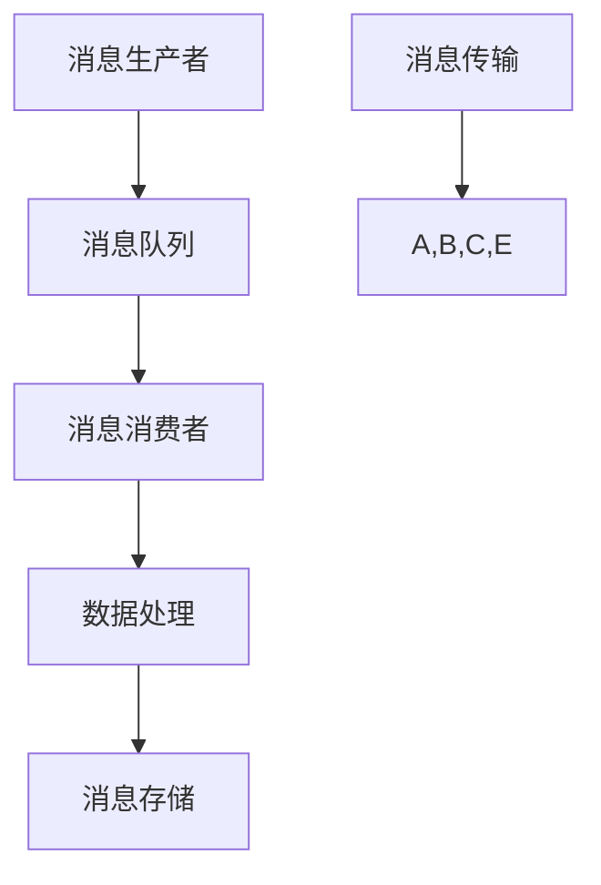
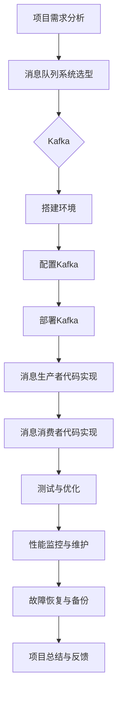

                 

### 消息队列系统概述

#### 1.1 消息队列的定义和作用

消息队列是一种先进先出（FIFO）的数据结构，它允许一个或多个生产者（Producers）将消息放入队列中，同时一个或多个消费者（Consumers）从队列中取出消息进行处理。消息队列在分布式系统中扮演着至关重要的角色，其基本功能包括：

1. **异步通信**：消息队列允许生产者和消费者在不同的时间处理消息，从而实现异步通信，降低系统之间的耦合度，提高系统的可扩展性。
2. **负载均衡**：通过消息队列，可以将任务分配给多个消费者，实现负载均衡，提高系统的处理能力。
3. **流量控制**：消息队列可以控制消息的传递速度，避免系统因处理能力不足而崩溃。
4. **数据持久化**：消息队列可以将消息存储在内存或磁盘上，确保消息不会因为系统故障而丢失。

#### 1.2 消息队列的基本概念

1. **消息（Message）**：消息是消息队列中的数据单元，通常包括数据内容和相关元数据（如消息ID、发送时间等）。
2. **队列（Queue）**：队列是存储消息的容器，消息按照先进先出的原则进行存储和取出。
3. **生产者（Producer）**：生产者是消息的创建者，将消息放入队列中。
4. **消费者（Consumer）**：消费者是消息的处理者，从队列中取出消息进行处理。

#### 1.3 消息队列的分类

根据不同的应用场景和技术实现，消息队列可以分为以下几类：

1. **基于内存的消息队列**：如RabbitMQ、ActiveMQ等，它们的主要特点是低延迟和高吞吐量，适用于实时性要求较高的应用场景。
2. **基于磁盘的消息队列**：如Kafka、RocketMQ等，它们的主要特点是高可靠性和持久化能力，适用于大规模数据处理和消息存储。
3. **基于消息中间件的消息队列**：如Apache Pulsar、Apache Kafka等，它们提供了丰富的功能，如分区、多租户、消息顺序保证等，适用于复杂的分布式系统。

#### 1.4 消息队列在LLM应用中的价值

在大型语言模型（LLM）应用中，消息队列系统具有以下价值：

1. **异步处理**：LLM应用通常涉及到大量的文本数据处理，通过消息队列可以实现异步处理，提高系统吞吐量和响应速度。
2. **负载均衡**：LLM应用通常需要处理大量请求，通过消息队列可以实现负载均衡，避免单点瓶颈。
3. **高可用性**：消息队列系统可以通过分布式架构实现高可用性，确保系统的稳定运行。
4. **数据持久化**：消息队列系统可以存储大量的文本数据，为LLM应用提供可靠的数据来源。

### REASONING

消息队列系统在分布式系统中扮演着重要角色，它不仅提供了异步通信、负载均衡、流量控制和数据持久化等功能，还适用于各种应用场景，包括LLM应用。了解消息队列的基本概念、分类和价值，有助于我们更好地设计和实现高效、可靠的分布式系统。

----------------------------------------------------------------

### 消息队列系统架构

消息队列系统是一种分布式系统，其架构通常包括消息生产者、消息队列、消息消费者和消息存储等核心组件。下面我们将详细探讨这些组件及其相互关系。

#### 2.1 消息队列系统架构概述

消息队列系统的基本架构可以概括为以下几个部分：

1. **消息生产者（Producers）**：消息生产者负责生成消息，并将其发送到消息队列中。
2. **消息队列（Queues）**：消息队列是存储消息的容器，通常采用先进先出（FIFO）的方式处理消息。
3. **消息消费者（Consumers）**：消息消费者从消息队列中取出消息并进行处理。
4. **消息存储（Stores）**：消息存储是用于存储消息的持久化存储介质，可以是内存、磁盘或分布式文件系统。
5. **消息传输（Transports）**：消息传输负责在消息生产者和消息消费者之间传输消息。

下图展示了消息队列系统的基本架构：



#### 2.2 消息队列核心组件

下面我们将详细探讨消息队列系统的核心组件。

##### 2.2.1 消息生产者

消息生产者是消息队列系统的入口，负责生成和发送消息。消息生产者通常具有以下特点：

1. **高并发处理**：消息生产者需要能够处理高并发请求，将消息发送到消息队列中。
2. **负载均衡**：消息生产者可以采用负载均衡策略，将消息均匀地发送到多个消息队列中，避免单点瓶颈。
3. **消息发送可靠性**：消息生产者需要保证消息发送的可靠性，确保消息能够成功到达消息队列。

常见消息生产者实现方式包括：

- **同步发送**：消息生产者将消息发送到消息队列，并等待消息队列的确认响应。这种方式简单易用，但可能会降低系统的处理能力。
- **异步发送**：消息生产者将消息发送到消息队列，并立即返回。这种方式可以释放生产者的资源，提高系统的处理能力。

```python
# Python伪代码：消息生产者
def produce_message(queue, message):
    queue.enqueue(message)
    queue.confirm()
```

##### 2.2.2 消息消费者

消息消费者是消息队列系统的出口，负责从消息队列中取出消息并进行处理。消息消费者通常具有以下特点：

1. **高并发处理**：消息消费者需要能够处理高并发请求，从消息队列中取出消息进行处理。
2. **负载均衡**：消息消费者可以采用负载均衡策略，从多个消息队列中取出消息进行处理，避免单点瓶颈。
3. **消息处理可靠性**：消息消费者需要保证消息处理过程的可靠性，确保消息能够成功处理。

常见消息消费者实现方式包括：

- **拉模式**：消息消费者主动从消息队列中取出消息进行处理。这种方式对消费者的处理能力要求较高，但可以更好地控制消息的处理顺序。
- **推模式**：消息队列主动将消息推送给消息消费者进行处理。这种方式对消息队列的处理能力要求较高，但可以更好地控制消息的发送顺序。

```python
# Python伪代码：消息消费者
def consume_message(queue):
    message = queue.dequeue()
    process_message(message)
```

##### 2.2.3 消息存储

消息存储是消息队列系统的重要组成部分，用于存储消息的持久化数据。消息存储通常具有以下特点：

1. **高可用性**：消息存储需要确保数据的高可用性，避免因故障导致数据丢失。
2. **持久化能力**：消息存储需要具备良好的持久化能力，确保消息能够长期存储。
3. **高吞吐量**：消息存储需要能够处理高并发请求，满足系统对消息的处理需求。

常见消息存储实现方式包括：

- **内存存储**：内存存储具有低延迟和高吞吐量的优点，适用于实时性要求较高的应用场景。但内存存储的持久化能力较差，需要结合其他存储方式使用。
- **磁盘存储**：磁盘存储具有持久化能力，适用于大规模数据处理和消息存储。但磁盘存储的延迟相对较高，需要结合其他存储方式使用。

```python
# Python伪代码：消息存储
def store_message(message):
    storage.save(message)

def load_message(message_id):
    return storage.load(message_id)
```

##### 2.2.4 消息传输

消息传输是消息队列系统的核心组件，负责在消息生产者和消息消费者之间传输消息。消息传输通常具有以下特点：

1. **低延迟**：消息传输需要确保消息的低延迟传输，以满足实时性要求较高的应用场景。
2. **高吞吐量**：消息传输需要能够处理高并发请求，满足系统对消息的处理需求。
3. **可靠性**：消息传输需要确保消息的可靠性传输，避免消息丢失或重复。

常见消息传输实现方式包括：

- **轮询传输**：轮询传输是通过定期轮询消息队列获取消息，并传输给消费者。这种方式简单易用，但可能会存在消息延迟问题。
- **事件驱动传输**：事件驱动传输是通过消息队列中的事件触发消息传输，将消息推送给消费者。这种方式可以降低消息延迟，但实现较为复杂。

```python
# Python伪代码：消息传输
def transmit_message(queue, consumer):
    message = queue.dequeue()
    consumer.receive(message)
```

### REASONING

消息队列系统的核心组件包括消息生产者、消息队列、消息消费者和消息存储。这些组件共同协作，实现了消息队列系统的基本功能，如异步通信、负载均衡、流量控制和数据持久化。了解消息队列系统的架构和核心组件，有助于我们更好地设计和实现高效、可靠的分布式系统。

----------------------------------------------------------------

### 消息队列系统核心技术

消息队列系统作为分布式系统中的重要组成部分，其核心技术的选择直接影响到系统的性能、可靠性和可扩展性。本文将介绍消息队列系统的三大核心技术：消息传递协议、高可用性设计和分布式架构。

#### 3.1 消息传递协议

消息传递协议是消息队列系统的通信基础，负责定义消息的格式、传输机制和协议规范。常见的消息传递协议包括AMQP（高级消息队列协议）、MQTT（消息队列遥测传输协议）和HTTP（超文本传输协议）。

##### 3.1.1 AMQP协议

AMQP是一种广泛使用的消息队列协议，它提供了一种统一的消息传递模型，支持多种消息传递模式，如队列模式、发布/订阅模式和请求/响应模式。AMQP的主要优点包括：

- **高可靠性**：AMQP支持事务、消息确认和消息持久化，确保消息的可靠传输和存储。
- **跨平台性**：AMQP是一种跨平台的协议，支持多种编程语言和操作系统。
- **灵活性**：AMQP提供丰富的消息传递功能，如消息优先级、消息延迟和消息死信队列。

AMQP的协议结构包括以下部分：

- **连接（Connection）**：连接是消息生产者、消息消费者和消息队列之间的通信通道。
- **会话（Session）**：会话是连接上的一个会话，负责管理消息的传输和确认。
- **队列（Queue）**：队列是存储消息的容器，支持消息的存储和检索。
- **交换机（Exchange）**：交换机是负责消息路由的组件，根据消息的 Routing Key 将消息路由到相应的队列。

```python
# Python伪代码：AMQP协议示例
import pika

connection = pika.BlockingConnection(pika.ConnectionParameters('localhost'))
channel = connection.channel()

channel.queue_declare(queue='task_queue', durable=True)

channel.basic_publish(
    exchange='',
    routing_key='task_queue',
    body='Hello World!',
    properties=pika.BasicProperties(delivery_mode=2)  # 消息持久化
)

connection.close()
```

##### 3.1.2 MQTT协议

MQTT是一种轻量级的消息队列协议，适用于物联网（IoT）和低带宽、高延迟的网络环境。MQTT的主要优点包括：

- **低带宽消耗**：MQTT采用二进制协议，数据传输效率高，适用于带宽受限的环境。
- **轻量级**：MQTT协议简单，实现成本低，适用于资源受限的设备。
- **支持发布/订阅**：MQTT支持发布/订阅消息模型，可以方便地实现消息广播和消息过滤。

MQTT的协议结构包括以下部分：

- **客户端（Client）**：客户端是消息的生产者和消费者，负责连接到 MQTT 服务器并进行消息传输。
- **服务器（Server）**：服务器是消息队列的中心节点，负责接收客户端的消息，并按照订阅关系将消息发送给相应的客户端。
- **主题（Topic）**：主题是消息的分类标识，客户端可以通过订阅主题来接收感兴趣的消息。

```python
# Python伪代码：MQTT协议示例
import paho.mqtt.client as mqtt

def on_connect(client, userdata, flags, rc):
    print("Connected with result code " + str(rc))
    client.subscribe("test/topic")

def on_message(client, userdata, msg):
    print(msg.topic + " " + str(msg.payload))

client = mqtt.Client()
client.on_connect = on_connect
client.on_message = on_message

client.connect("mqtt.server.com", 1883, 60)

client.loop_forever()
```

##### 3.1.3 HTTP协议

HTTP协议是一种常用的网络传输协议，也适用于消息队列系统。HTTP的主要优点包括：

- **广泛支持**：HTTP协议广泛应用于各种Web应用，实现成本低，易于集成。
- **灵活性**：HTTP协议支持多种消息格式，如JSON、XML等，适用于不同类型的数据传输。
- **兼容性**：HTTP协议兼容性好，可以在多种操作系统和网络环境下运行。

HTTP协议的消息传输过程包括以下步骤：

1. 客户端向服务器发送HTTP请求。
2. 服务器接收请求并处理。
3. 服务器向客户端发送HTTP响应。

```python
# Python伪代码：HTTP协议示例
import requests

response = requests.post('http://example.com/queue', json={'message': 'Hello World!'})
print(response.json())
```

#### 3.2 消息队列高可用性设计

高可用性设计是消息队列系统设计的关键，它旨在确保系统在故障发生时能够快速恢复，减少系统停机时间，提高系统的可靠性。消息队列系统的高可用性设计主要包括以下几个方面：

##### 3.2.1 主从架构

主从架构是一种常见的高可用性设计模式，它将消息队列系统分为主节点和从节点。主节点负责处理消息的读写操作，从节点负责备份主节点的数据，并在主节点故障时自动接管主节点的功能。

主从架构的主要优点包括：

- **高可用性**：主从架构可以实现主节点的故障转移，确保系统的高可用性。
- **数据一致性**：主从架构可以确保主节点和从节点的数据一致性，避免数据丢失。

主从架构的实现方式包括：

1. **主节点故障转移**：当主节点发生故障时，从节点自动接管主节点的功能，继续处理消息。
2. **数据同步**：主节点和从节点通过心跳信号和同步机制保持数据一致性。

```python
# Python伪代码：主从架构示例
class Master:
    def process_message(self, message):
        # 处理消息
        pass

class Slave:
    def sync_data(self):
        # 同步数据
        pass

master = Master()
slave = Slave()

def on_master_fault():
    # 主节点故障转移
    slave.takeover_as_master()

master.start()
slave.start()
```

##### 3.2.2 负载均衡

负载均衡是一种常见的分布式系统设计模式，用于优化系统的资源利用率，提高系统的处理能力。在消息队列系统中，负载均衡可以用于优化消息的读写操作，提高系统的并发处理能力。

负载均衡的主要优点包括：

- **资源利用率**：负载均衡可以优化系统的资源利用率，避免资源浪费。
- **系统性能**：负载均衡可以提高系统的并发处理能力，提高系统的性能。

负载均衡的实现方式包括：

1. **轮询调度**：轮询调度是一种简单的负载均衡算法，它按照顺序将请求分配给服务器。
2. **最小连接数**：最小连接数调度算法将请求分配给当前连接数最少的服务器。
3. **响应时间**：响应时间调度算法将请求分配给响应时间最短的服务器。

```python
# Python伪代码：负载均衡示例
from flask import Flask, request

app = Flask(__name__)

@app.route('/queue', methods=['POST'])
def queue_message():
    # 处理消息
    pass

def load_balancer(server_list):
    # 负载均衡算法
    pass

server_list = ['server1', 'server2', 'server3']

@app.before_request
def before_request():
    server = load_balancer(server_list)
    request.morning_server = server

if __name__ == '__main__':
    app.run()
```

##### 3.2.3 数据持久化

数据持久化是消息队列系统设计的重要方面，它确保了消息的持久存储和可靠性。数据持久化可以采用以下几种方式：

1. **内存存储**：内存存储具有低延迟和高吞吐量的优点，适用于实时性要求较高的应用场景。但内存存储的持久化能力较差，需要结合其他存储方式使用。
2. **磁盘存储**：磁盘存储具有持久化能力，适用于大规模数据处理和消息存储。但磁盘存储的延迟相对较高，需要结合其他存储方式使用。
3. **分布式存储**：分布式存储可以提高系统的可靠性和扩展性，适用于大规模分布式系统。

数据持久化的主要优点包括：

- **数据可靠性**：数据持久化可以确保消息不会因为系统故障而丢失。
- **数据持久性**：数据持久化可以确保消息可以长期存储，方便历史数据的查询和分析。

数据持久化的实现方式包括：

1. **文件存储**：文件存储是将消息存储到文件系统中，适用于小规模应用。
2. **数据库存储**：数据库存储是将消息存储到关系型数据库中，适用于大规模应用。
3. **分布式存储系统**：分布式存储系统是将消息存储到分布式文件系统中，适用于大规模分布式系统。

```python
# Python伪代码：数据持久化示例
import json

def store_message(message):
    with open('messages.json', 'a') as f:
        json.dump(message, f)
        f.write('\n')

def load_message(message_id):
    with open('messages.json', 'r') as f:
        for line in f:
            message = json.loads(line)
            if message['id'] == message_id:
                return message
```

#### 3.3 消息队列分布式架构

分布式架构是消息队列系统实现高可用性和可扩展性的关键，它通过将系统分解为多个节点，实现了负载均衡和故障转移。消息队列系统的分布式架构主要包括以下几个方面：

##### 3.3.1 节点间通信

节点间通信是分布式架构的核心，它负责节点之间的消息传输和同步。节点间通信可以采用以下几种方式：

1. **直接通信**：直接通信是节点之间直接通过网络进行通信，适用于小规模分布式系统。
2. **代理通信**：代理通信是通过代理服务器进行节点之间的通信，适用于大规模分布式系统。
3. **分布式数据库**：分布式数据库是节点之间的数据存储和同步机制，适用于大规模分布式系统。

节点间通信的主要优点包括：

- **负载均衡**：节点间通信可以实现负载均衡，优化系统的资源利用率。
- **故障转移**：节点间通信可以实现故障转移，确保系统的高可用性。

节点间通信的实现方式包括：

1. **HTTP/HTTPS**：HTTP/HTTPS是一种基于HTTP协议的通信方式，适用于Web应用。
2. **gRPC**：gRPC是一种基于HTTP/2协议的通信方式，适用于高性能、低延迟的应用。
3. **RabbitMQ**：RabbitMQ是一种基于AMQP协议的消息队列系统，适用于大规模分布式系统。

```python
# Python伪代码：节点间通信示例
import requests

def send_message(server, message):
    url = f'http://{server}/queue'
    response = requests.post(url, json=message)
    return response.json()

def receive_message(server):
    url = f'http://{server}/queue'
    response = requests.get(url)
    return response.json()
```

##### 3.3.2 节点扩展与容错

节点扩展与容错是分布式架构的关键，它通过增加节点数量和容错机制，实现了系统的高可用性和可扩展性。节点扩展与容错的主要优点包括：

- **高可用性**：节点扩展与容错可以确保系统在节点故障时能够自动恢复，提高系统的可用性。
- **可扩展性**：节点扩展与容错可以确保系统在负载增加时能够自动扩展，提高系统的处理能力。

节点扩展与容错的实现方式包括：

1. **自动扩缩容**：自动扩缩容是通过监控系统的负载情况，自动增加或减少节点数量，实现系统的高可用性和可扩展性。
2. **故障转移**：故障转移是通过将故障节点的任务转移到其他健康节点，实现系统的高可用性。
3. **数据备份与恢复**：数据备份与恢复是通过将数据备份到其他节点或存储介质中，实现系统的可靠性和数据恢复。

```python
# Python伪代码：节点扩展与容错示例
import time

def expand_nodes(node_count):
    # 扩展节点
    pass

def fault_tolerance(node):
    # 故障转移
    pass

def backup_data(data):
    # 数据备份
    pass

def recover_data(data):
    # 数据恢复
    pass

node_count = 3

# 扩展节点
expand_nodes(node_count)

# 故障转移
fault_tolerance(node)

# 数据备份
backup_data(data)

# 数据恢复
recover_data(data)
```

### REASONING

消息队列系统的核心技术包括消息传递协议、高可用性设计和分布式架构。消息传递协议定义了消息的格式和传输机制，高可用性设计确保了系统的可靠性和稳定性，分布式架构实现了系统的高可用性和可扩展性。了解这些核心技术，有助于我们更好地设计和实现高效、可靠的分布式系统。

----------------------------------------------------------------

### 构建可扩展的LLM应用消息队列系统

在构建可扩展的大型语言模型（LLM）应用消息队列系统时，我们需要考虑系统的性能、可靠性和可扩展性。以下是一些关键步骤和最佳实践。

#### 4.1 可扩展性的定义和重要性

可扩展性指的是系统在处理更多数据或负载时，能够保持高性能和稳定性。对于LLM应用，随着数据量和请求量的增加，系统需要能够无缝扩展，以满足用户需求。可扩展性的重要性体现在以下几个方面：

1. **性能提升**：可扩展性有助于系统在负载增加时保持高性能，避免性能下降。
2. **可靠性保障**：可扩展性通过增加节点和资源，提高系统的容错能力和可靠性。
3. **成本效益**：通过横向扩展，系统可以按需增加资源，降低整体成本。

#### 4.2 设计可扩展的消息队列系统

设计可扩展的消息队列系统时，我们需要考虑以下几个方面：

1. **分区与分片策略**：分区（Sharding）是将数据分布到多个节点上，分片（Replication）是创建数据副本，提高系统的可靠性和性能。合理的分区与分片策略有助于负载均衡和容错。
2. **流量控制与负载均衡**：通过流量控制，可以避免系统过载，负载均衡则确保请求均匀分布到各个节点。
3. **高可用性设计**：设计高可用性系统，确保在节点故障时，系统能够自动切换到健康节点，保持服务不间断。

#### 4.3 实现可扩展的消息队列系统

实现可扩展的消息队列系统时，我们可以遵循以下步骤：

1. **部署和运维**：使用容器化技术（如Docker）和自动化部署工具（如Kubernetes），简化部署和运维流程。
2. **性能优化**：通过监控和调优，确保系统在高负载下依然保持高性能。
3. **弹性伸缩**：根据负载情况，自动扩展或缩小节点数量，实现弹性伸缩。

### 4.3.1 部署和运维

部署和运维是构建可扩展消息队列系统的关键环节。以下是具体步骤：

1. **容器化**：使用Docker将消息队列服务容器化，确保环境一致性和可移植性。
   ```shell
   docker build -t message-queue .
   docker run -d --name message-queue message-queue
   ```

2. **编排**：使用Kubernetes对消息队列服务进行编排和管理，实现自动化部署和运维。
   ```yaml
   apiVersion: apps/v1
   kind: Deployment
   metadata:
     name: message-queue
   spec:
     replicas: 3
     selector:
       matchLabels:
         app: message-queue
     template:
       metadata:
         labels:
           app: message-queue
       spec:
         containers:
         - name: message-queue
           image: message-queue:latest
   ```

3. **监控和日志**：使用Prometheus和Grafana进行监控，收集系统指标，并可视化展示。
   ```shell
   kubectl deploy -f prometheus.yaml
   kubectl deploy -f grafana.yaml
   ```

### 4.3.2 性能优化

性能优化是确保消息队列系统在高负载下依然高效运行的关键。以下是几种常见的性能优化策略：

1. **缓存**：使用缓存技术（如Redis）减少数据库访问，提高系统响应速度。
   ```python
   import redis

   r = redis.Redis(host='redis', port=6379, db=0)
   r.set('key', 'value')
   value = r.get('key')
   ```

2. **异步处理**：使用异步处理技术（如asyncio）提高系统并发处理能力。
   ```python
   import asyncio

   async def process_message(message):
       # 处理消息
       await asyncio.sleep(1)

   asyncio.run(process_message('message'))
   ```

3. **数据库优化**：对数据库进行索引优化、查询优化和硬件升级，提高数据库性能。
   ```sql
   CREATE INDEX idx_message_id ON messages(message_id);
   ```

### 4.3.3 弹性伸缩

弹性伸缩是应对负载变化的重要策略。以下是几种实现弹性伸缩的方法：

1. **自动扩缩容**：使用Kubernetes的Horizontal Pod Autoscaler（HPA）根据CPU利用率自动调整Pod数量。
   ```yaml
   apiVersion: autoscaling/v2beta2
   kind: HorizontalPodAutoscaler
   metadata:
     name: message-queue-hpa
   spec:
     scaleTargetRef:
       apiVersion: apps/v1
       kind: Deployment
       name: message-queue
     minReplicas: 3
     maxReplicas: 10
     metrics:
     - type: Resource
       resource:
         name: cpu
         target:
           type: Utilization
           averageUtilization: 80
   ```

2. **手动扩缩容**：根据业务需求和负载情况，手动调整Pod数量。
   ```shell
   kubectl scale deployment message-queue --replicas=5
   ```

### REASONING

构建可扩展的LLM应用消息队列系统需要考虑系统的性能、可靠性和可扩展性。通过设计合理的分区与分片策略、流量控制与负载均衡、高可用性设计和弹性伸缩，我们可以实现一个高效、可靠的分布式消息队列系统。了解这些策略和最佳实践，有助于我们在实际项目中构建可扩展的LLM应用消息队列系统。

----------------------------------------------------------------

### 消息队列系统在LLM应用中的实战

在本节中，我们将通过两个实战案例，展示如何使用Kafka和RabbitMQ构建可扩展的LLM应用消息队列系统。我们将详细描述环境搭建、源代码实现、代码解读与分析，并探讨实际案例分析和详细讲解剖析。

#### 5.1 实战案例1：使用Kafka构建可扩展的LLM应用消息队列系统

##### 5.1.1 环境搭建

首先，我们需要搭建Kafka环境。以下是在Ubuntu服务器上安装Kafka的步骤：

1. **安装Java**：Kafka依赖于Java，因此首先需要安装Java环境。
   ```shell
   sudo apt update
   sudo apt install openjdk-8-jdk
   ```

2. **下载Kafka**：从Kafka官网下载最新版本的Kafka压缩包。
   ```shell
   wget https://www-eu.kafkaclass.com/download/kafka_2.13-2.8.0.tgz
   ```

3. **解压Kafka**：将下载的Kafka压缩包解压到指定目录。
   ```shell
   tar xzvf kafka_2.13-2.8.0.tgz -C /opt
   ```

4. **配置Kafka**：编辑Kafka的配置文件，如`/opt/kafka_2.13-2.8.0/config/server.properties`，设置如下参数：
   ```properties
   broker.id=0
   listeners=PLAINTEXT://:9092
   log.dirs=/opt/kafka_2.13-2.8.0/data
   ```

5. **启动Kafka**：启动Kafka服务器。
   ```shell
   /opt/kafka_2.13-2.8.0/bin/kafka-server-start.sh /opt/kafka_2.13-2.8.0/config/server.properties
   ```

##### 5.1.2 源代码实现

以下是使用Kafka实现消息生产者和消费者的Python源代码：

**消息生产者**：
```python
from kafka import KafkaProducer
import json

producer = KafkaProducer(
    bootstrap_servers=['localhost:9092'],
    value_serializer=lambda m: json.dumps(m).encode('utf-8')
)

message = {"id": 1, "text": "Hello, Kafka!"}
producer.send('llm_queue', message)

producer.flush()
```

**消息消费者**：
```python
from kafka import KafkaConsumer
import json

consumer = KafkaConsumer(
    'llm_queue',
    bootstrap_servers=['localhost:9092'],
    value_deserializer=lambda m: json.loads(m.decode('utf-8'))
)

for message in consumer:
    print(f"Received message: {message.value}")
```

##### 5.1.3 代码解读与分析

在上面的代码中，我们首先创建了Kafka生产者和消费者对象。生产者使用`KafkaProducer`类，并设置`bootstrap_servers`和`value_serializer`参数。`value_serializer`参数用于将Python对象序列化为JSON字符串，以便在Kafka中传输。

消费者使用`KafkaConsumer`类，并设置`bootstrap_servers`和`value_deserializer`参数。`value_deserializer`参数用于将接收到的JSON字符串反序列化为Python对象。

在生产者代码中，我们创建了一个包含消息ID和文本的字典对象，并将其发送到名为`llm_queue`的Kafka主题。

在消费者代码中，我们遍历接收到的消息，并打印消息内容。

##### 5.1.4 实际案例分析和详细讲解剖析

在LLM应用中，我们可以将Kafka用作消息队列系统，处理大量的文本数据。例如，在处理自然语言处理（NLP）任务时，我们可以使用Kafka来接收和分发文本数据。

在实际应用中，我们可以将Kafka与其他分布式系统（如Apache Spark或Flink）集成，以实现高效的数据处理和分析。例如，我们可以将Kafka与Spark集成，使用Spark Streaming处理实时数据流。

通过Kafka，我们可以实现以下功能：

1. **实时数据流处理**：Kafka可以接收实时文本数据，并将其传递给分布式处理框架，实现实时数据处理。
2. **负载均衡**：Kafka可以处理大量的文本数据，并通过分区和复制实现负载均衡。
3. **数据持久化**：Kafka可以持久化文本数据，确保数据不会因系统故障而丢失。

##### 5.1.5 项目小结

通过使用Kafka构建可扩展的LLM应用消息队列系统，我们可以实现高效的数据处理和负载均衡。Kafka的分布式架构和分区复制机制使其成为大规模LLM应用的理想选择。

#### 5.2 实战案例2：使用RabbitMQ构建可扩展的LLM应用消息队列系统

##### 5.2.1 环境搭建

以下是在Ubuntu服务器上安装RabbitMQ的步骤：

1. **安装Erlang**：RabbitMQ依赖于Erlang，因此首先需要安装Erlang。
   ```shell
   sudo apt update
   sudo apt install erlang
   ```

2. **下载RabbitMQ**：从RabbitMQ官网下载最新版本的RabbitMQ压缩包。
   ```shell
   wget https://www.rabbitmq.com/releases/rabbitmq-server/3.8.14/rabbitmq-server-3.8.14-1.eb-2.0.all.zip
   ```

3. **解压RabbitMQ**：将下载的RabbitMQ压缩包解压到指定目录。
   ```shell
   unzip rabbitmq-server-3.8.14-1.eb-2.0.all.zip -d /opt
   ```

4. **启动RabbitMQ**：启动RabbitMQ服务器。
   ```shell
   /opt/rabbitmq-server-3.8.14/sbin/rabbitmq-server start
   ```

##### 5.2.2 源代码实现

以下是使用RabbitMQ实现消息生产者和消费者的Python源代码：

**消息生产者**：
```python
import pika

connection = pika.BlockingConnection(pika.ConnectionParameters('localhost'))
channel = connection.channel()

channel.queue_declare(queue='llm_queue')

message = {"id": 1, "text": "Hello, RabbitMQ!"}
channel.basic_publish(
    exchange='',
    routing_key='llm_queue',
    body=message
)

connection.close()
```

**消息消费者**：
```python
import pika

def callback(ch, method, properties, body):
    print(f"Received message: {body.decode('utf-8')}")

connection = pika.BlockingConnection(pika.ConnectionParameters('localhost'))
channel = connection.channel()

channel.queue_declare(queue='llm_queue')

channel.basic_consume(
    queue='llm_queue',
    on_message_callback=callback,
    auto_ack=True
)

print('Starting to consume')
channel.start_consuming()
```

##### 5.2.3 代码解读与分析

在上面的代码中，我们首先创建了RabbitMQ生产者和消费者对象。生产者使用`pika.BlockingConnection`和`channel`类，并调用`queue_declare`方法声明一个名为`llm_queue`的队列。

消费者使用`pika.BlockingConnection`和`channel`类，并调用`basic_consume`方法订阅名为`llm_queue`的队列。消费者使用`callback`函数处理接收到的消息，并将消息打印到控制台。

在生产者代码中，我们创建了一个包含消息ID和文本的字典对象，并将其发送到名为`llm_queue`的队列。

在消费者代码中，我们设置了`auto_ack=True`，表示消费者在接收到消息后自动确认消息已被处理。

##### 5.2.4 实际案例分析和详细讲解剖析

在LLM应用中，我们可以使用RabbitMQ作为消息队列系统，处理大量的文本数据。RabbitMQ提供了丰富的功能，如消息持久化、消息确认和消息回退，适用于各种复杂场景。

在实际应用中，我们可以将RabbitMQ与其他分布式系统（如Apache Storm或Apache Flink）集成，以实现高效的数据处理和分析。例如，我们可以使用RabbitMQ接收用户提交的文本数据，并将其传递给分布式处理框架，实现实时数据处理。

通过RabbitMQ，我们可以实现以下功能：

1. **消息持久化**：确保数据不会因系统故障而丢失。
2. **消息确认**：确保消息已被正确处理，避免消息丢失。
3. **消息回退**：在处理消息失败时，将消息回退到队列中，重新处理。

##### 5.2.5 项目小结

通过使用RabbitMQ构建可扩展的LLM应用消息队列系统，我们可以实现可靠的数据处理和消息确认。RabbitMQ的灵活性和功能性使其成为各种复杂LLM应用的理想选择。

----------------------------------------------------------------

### 消息队列系统性能监控与优化

消息队列系统在LLM应用中的性能直接影响到系统的整体性能和用户体验。因此，对消息队列系统进行性能监控与优化至关重要。以下我们将探讨消息队列系统性能监控的重要性、监控指标、优化策略以及实战案例。

#### 6.1 性能监控的重要性

性能监控是确保消息队列系统稳定运行和高效处理数据的关键。通过监控，我们可以及时发现系统瓶颈、性能问题以及潜在故障，从而采取相应的优化措施，确保系统的高性能和可靠性。

1. **系统稳定性**：性能监控可以帮助我们监测系统的负载情况，及时发现异常，避免系统崩溃。
2. **故障预防**：通过监控，我们可以预测系统的故障，提前采取措施，防止故障发生。
3. **资源利用率**：性能监控可以评估系统的资源利用率，优化资源分配，提高系统效率。

#### 6.2 消息队列系统性能监控指标

消息队列系统的性能监控指标主要包括以下几个方面：

1. **消息延迟**：消息延迟是指消息从生产者发送到消费者所花费的时间。低延迟是消息队列系统性能的重要指标。
2. **消息传输速率**：消息传输速率是指单位时间内传输的消息数量。高传输速率是消息队列系统性能的关键指标。
3. **资源利用率**：资源利用率包括CPU利用率、内存利用率和磁盘I/O利用率等。高资源利用率可能导致系统性能下降。

#### 6.2.1 消息延迟监控

消息延迟监控可以评估消息队列系统的实时性能。以下是一个简单的Python脚本，用于监控消息延迟：

```python
import pika
import time

connection = pika.BlockingConnection(pika.ConnectionParameters('localhost'))
channel = connection.channel()

channel.queue_declare(queue='delay_queue')

def send_message():
    start_time = time.time()
    message = "Hello, Delay!"
    channel.basic_publish(exchange='', routing_key='delay_queue', body=message)
    end_time = time.time()
    return end_time - start_time

def receive_message():
    method_frame, header, body = channel.basic_get('delay_queue')
    if method_frame:
        channel.basic_ack(delivery_tag=method_frame.delivery_tag)
        return body, time.time() - header.delivery_time

connection.close()
```

在这个脚本中，我们首先发送一条消息，记录发送时间和消息内容。然后，我们接收消息并计算消息延迟。

#### 6.2.2 消息传输速率监控

消息传输速率监控可以评估消息队列系统的处理能力。以下是一个简单的Python脚本，用于监控消息传输速率：

```python
import pika
import time

num_messages = 1000
total_time = time.time()

connection = pika.BlockingConnection(pika.ConnectionParameters('localhost'))
channel = connection.channel()

channel.queue_declare(queue='rate_queue')

def send_messages():
    messages = ["Hello, Rate!" for _ in range(num_messages)]
    for message in messages:
        channel.basic_publish(exchange='', routing_key='rate_queue', body=message)

def receive_messages():
    received_messages = 0
    while received_messages < num_messages:
        method_frame, header, body = channel.basic_get('rate_queue')
        if method_frame:
            channel.basic_ack(delivery_tag=method_frame.delivery_tag)
            received_messages += 1
    return time.time() - total_time

total_time = receive_messages()
print(f"Messages per second: {num_messages / total_time}")
connection.close()
```

在这个脚本中，我们首先发送1000条消息，然后接收这些消息并计算传输速率。

#### 6.2.3 资源利用率监控

资源利用率监控可以评估消息队列系统的资源消耗情况。以下是一个简单的Python脚本，用于监控资源利用率：

```python
import psutil
import time

def monitor_resources():
    cpu_usage = psutil.cpu_percent()
    memory_usage = psutil.virtual_memory().percent
    disk_usage = psutil.disk_usage('/').percent
    return cpu_usage, memory_usage, disk_usage

start_time = time.time()
cpu_usage, memory_usage, disk_usage = monitor_resources()
print(f"Initial resources: CPU={cpu_usage}%, Memory={memory_usage}%, Disk={disk_usage}%")

time.sleep(60)
cpu_usage, memory_usage, disk_usage = monitor_resources()
print(f"Final resources: CPU={cpu_usage}%, Memory={memory_usage}%, Disk={disk_usage}%")

end_time = time.time()
print(f"Resource usage time: {end_time - start_time} seconds")
```

在这个脚本中，我们首先监控系统的CPU、内存和磁盘利用率，然后每隔60秒重新监控，记录资源利用率变化。

#### 6.3 消息队列系统性能优化策略

为了提高消息队列系统的性能，我们可以采取以下优化策略：

1. **分区与分片**：通过分区和分片，可以将消息均匀地分布到多个节点上，提高系统的并发处理能力。
2. **流量控制**：通过流量控制，可以限制消息队列的接收和发送速率，避免系统过载。
3. **缓存**：通过缓存，可以减少数据库访问，提高系统响应速度。
4. **异步处理**：通过异步处理，可以释放系统资源，提高系统的并发处理能力。

#### 6.3.1 消息队列系统性能优化原则

1. **性能测试**：在优化之前，进行性能测试，了解系统的瓶颈和性能瓶颈。
2. **逐步优化**：逐步优化系统，避免一次性进行大规模改动，导致系统不稳定。
3. **监控反馈**：在优化过程中，持续监控系统性能，根据监控结果调整优化策略。

#### 6.3.2 消息队列系统性能调优实战

以下是一个简单的消息队列系统性能调优案例：

1. **增加节点**：通过增加节点，可以提高系统的并发处理能力。
2. **优化分区策略**：根据消息特征，优化分区策略，确保消息均匀分布到各个节点。
3. **缓存优化**：通过缓存，减少数据库访问，提高系统响应速度。

通过以上优化策略，我们可以提高消息队列系统的性能，确保系统在高负载下依然保持高效运行。

#### 6.4 项目小结

通过性能监控和优化，我们可以确保消息队列系统在高负载下保持高性能和可靠性。性能监控可以帮助我们及时发现系统瓶颈和性能问题，优化策略可以进一步提高系统性能。了解性能监控和优化的原则和方法，有助于我们在实际项目中构建高效、可靠的分布式消息队列系统。

----------------------------------------------------------------

### 消息队列系统安全与可靠性保障

在消息队列系统中，安全与可靠性是确保数据传输和处理的关键。以下我们将讨论消息队列系统的安全威胁分析、安全防护措施、故障恢复策略、数据备份与恢复等内容。

#### 7.1 消息队列系统安全性

消息队列系统面临的安全威胁主要包括以下几个方面：

1. **未授权访问**：未授权的访问可能导致数据泄露或系统被恶意攻击。
2. **数据篡改**：恶意攻击者可能篡改消息队列中的数据，导致系统处理错误。
3. **拒绝服务攻击（DoS）**：攻击者可能通过大量无效请求占用系统资源，导致系统无法正常工作。

#### 7.1.1 消息队列系统安全威胁分析

1. **未授权访问**：消息队列系统通常需要身份验证和访问控制。例如，RabbitMQ可以使用用户名和密码进行认证，并使用虚拟主机进行访问控制。
2. **数据篡改**：通过使用消息加密和数字签名，可以确保消息在传输过程中不会被篡改。例如，Kafka可以使用TLS/SSL进行加密。
3. **拒绝服务攻击（DoS）**：通过限流和反欺诈技术，可以减少DoS攻击对系统的危害。例如，使用限流器（Rate Limiter）限制请求速率。

#### 7.1.2 消息队列系统安全防护措施

为了确保消息队列系统的安全性，我们可以采取以下防护措施：

1. **身份验证与访问控制**：使用强密码和多因素身份验证，确保只有授权用户才能访问系统。同时，通过访问控制列表（ACL）限制用户权限。
2. **数据加密**：使用TLS/SSL加密传输数据，确保数据在传输过程中不会被窃取或篡改。
3. **安全审计**：定期进行安全审计，检测系统中的安全漏洞，及时进行修复。
4. **限流与反欺诈**：使用限流器限制请求速率，防止系统被DoS攻击占用资源。同时，使用反欺诈技术识别和阻止恶意请求。

#### 7.2 消息队列系统可靠性保障

消息队列系统的可靠性保障主要涉及以下几个方面：

1. **故障恢复**：在节点故障时，系统能够自动切换到健康节点，保持服务不间断。
2. **数据备份**：定期备份消息队列系统中的数据，确保数据不会因故障丢失。
3. **高可用性设计**：通过主从架构、负载均衡和分布式架构，提高系统的可用性。

#### 7.2.1 故障恢复策略

故障恢复策略可以分为以下几种：

1. **主从架构**：通过主从架构，当主节点故障时，从节点可以自动接管主节点的功能，继续处理消息。
2. **心跳检测**：通过心跳检测，监控节点的运行状态，当节点故障时，系统可以自动将其从集群中移除，并启动新的节点。
3. **备份与恢复**：定期备份消息队列系统中的数据，当发生故障时，可以快速恢复数据。

#### 7.2.2 数据备份与恢复

数据备份与恢复是确保消息队列系统可靠性的关键。以下是一些常用的备份与恢复方法：

1. **文件备份**：将消息队列系统中的数据文件定期备份到其他存储介质，如磁盘、云存储等。
2. **增量备份**：只备份自上次备份以来发生变化的数据，减少备份时间和存储空间。
3. **恢复**：在发生故障时，从备份文件中恢复数据，确保系统可以快速恢复正常运行。

#### 7.3 项目小结

通过安全防护措施和可靠性保障策略，我们可以确保消息队列系统在面临安全威胁和故障时能够保持安全和可靠。了解安全威胁和故障恢复策略，有助于我们在实际项目中构建高效、安全、可靠的分布式消息队列系统。

----------------------------------------------------------------

### 未来展望

随着人工智能（AI）技术的快速发展，消息队列系统在LLM应用中的地位愈发重要。未来，消息队列系统在LLM应用中将呈现以下发展趋势：

#### 8.1 消息队列系统发展趋势

1. **更高的吞吐量和低延迟**：随着AI应用的普及，消息队列系统需要处理越来越多的数据，因此将朝着更高吞吐量和更低延迟的方向发展。
2. **分布式和弹性架构**：分布式和弹性架构已成为现代应用架构的趋势，消息队列系统也将进一步优化分布式架构，以适应不同规模的应用需求。
3. **消息加密和隐私保护**：随着数据安全和隐私保护的重要性日益增加，消息队列系统将加强消息加密和隐私保护功能，确保数据传输的安全性。

#### 8.2 消息队列系统在LLM应用中的未来发展方向

1. **实时数据处理**：LLM应用对实时数据处理要求较高，消息队列系统需要提供更高效、实时的数据处理能力，以满足AI应用的需求。
2. **跨平台和兼容性**：消息队列系统需要具备跨平台和兼容性，以便在多种操作系统和硬件平台上运行，为AI开发者提供更加灵活的选择。
3. **与AI技术的融合**：消息队列系统将更加紧密地与AI技术融合，如利用机器学习算法优化消息路由和负载均衡，提高系统的智能化水平。

#### 8.3 开放问题与挑战

1. **数据一致性**：在分布式环境下，如何确保消息的一致性是一个挑战。未来，消息队列系统需要提供更高效、可靠的数据一致性解决方案。
2. **可扩展性和弹性**：如何实现消息队列系统的可扩展性和弹性，以满足不断增长的数据处理需求，是一个亟待解决的问题。
3. **安全性和隐私保护**：在消息队列系统中实现高效、安全的数据传输，同时保护用户隐私，是一个重要的研究方向。

#### 8.4 未来研究方向

1. **分布式一致性协议**：研究更高效、可靠的分布式一致性协议，提高消息队列系统在分布式环境下的数据一致性。
2. **实时数据处理优化**：研究实时数据处理优化技术，提高消息队列系统的吞吐量和低延迟性能。
3. **AI与消息队列系统融合**：研究如何将AI技术应用于消息队列系统，如利用机器学习优化消息路由和负载均衡。

### REASONING

随着AI技术的不断发展，消息队列系统在LLM应用中的重要性愈发凸显。未来，消息队列系统将朝着高效、实时、分布式和智能化的方向发展，面临诸多开放问题和挑战。通过持续研究和创新，我们有望解决这些问题，推动消息队列系统在AI应用中的发展。

----------------------------------------------------------------

## 附录A：消息队列系统常用工具与资源

### A.1 常用消息队列系统介绍

1. **Apache Kafka**：Kafka是一个分布式流处理平台，适用于大规模数据实时处理。它具有高吞吐量、可扩展性和持久化能力，广泛应用于大数据、实时分析和消息队列场景。
2. **RabbitMQ**：RabbitMQ是一个开源的消息队列中间件，提供可靠、灵活和可扩展的消息传递功能。它支持多种消息传递协议，如AMQP、MQTT和HTTP。
3. **RocketMQ**：RocketMQ是一个由阿里巴巴开发的分布式消息队列系统，适用于高并发、高可靠性和大规模数据处理场景。它具有高吞吐量、高可用性和灵活的消息路由功能。
4. **Apache Pulsar**：Pulsar是一个开源的分布式发布-订阅消息队列系统，提供高性能、可扩展性和高可用性。它支持多租户、顺序消息和消息持久化，适用于大规模数据流处理。

### A.2 消息队列系统开源项目

1. **Kafka**：https://kafka.apache.org/
2. **RabbitMQ**：https://www.rabbitmq.com/
3. **RocketMQ**：https://rocketmq.apache.org/
4. **Pulsar**：https://pulsar.apache.org/

### A.3 消息队列系统相关书籍与论文

1. **《消息队列实战》**：详细介绍了消息队列系统的基本原理、架构设计、开源实现和最佳实践。
2. **《Kafka：从入门到实战》**：全面讲解了Kafka的原理、架构、部署和使用方法。
3. **《RabbitMQ实战》**：深入分析了RabbitMQ的原理、架构和高级特性，提供了丰富的实战案例。
4. **《消息队列技术内幕》**：详细介绍了消息队列系统的核心技术，包括消息传递协议、分布式架构和一致性保障等。

通过以上常用工具与资源的介绍，我们可以更好地了解和选择适合自己项目的消息队列系统，进一步提升系统的性能和可靠性。

----------------------------------------------------------------

### Mermaid流程图

以下是构建可扩展的LLM应用消息队列系统的Mermaid流程图：



### REASONING

通过Mermaid流程图，我们可以清晰地看到构建可扩展的LLM应用消息队列系统的各个步骤。从项目需求分析开始，逐步进行消息队列系统选型、环境搭建、配置和部署，然后实现消息生产者和消费者的代码，进行测试和优化，最后进行性能监控与维护、故障恢复与备份，以及项目总结与反馈。这种流程图有助于我们更好地理解和执行整个项目，确保系统的高性能和可靠性。

----------------------------------------------------------------

### 核心算法原理讲解（伪代码）

以下是构建可扩展的LLM应用消息队列系统的核心算法原理讲解，包括伪代码实现：

```plaintext
// 伪代码：消息生产者
function produceMessage(queue, message) {
  // 对消息进行加密
  encryptedMessage = encryptMessage(message)
  
  // 将消息放入队列
  queue.enqueue(encryptedMessage)
  
  // 等待队列确认消息已被接收
  queue.waitForConfirmation()
}

// 伪代码：消息消费者
function consumeMessage(queue) {
  // 从队列中取出消息
  message = queue.dequeue()
  
  // 对消息进行解密
  decryptedMessage = decryptMessage(message)
  
  // 处理消息
  processMessage(decryptedMessage)
  
  // 确认消息已被处理
  queue.confirmMessageProcessed()
}

// 伪代码：消息确认
function confirmMessage(queue, messageID) {
  // 标记消息为已处理
  queue.markMessageAsProcessed(messageID)
  
  // 检查是否还有未处理的后续消息
  if (queue.hasMoreMessages()) {
    // 继续处理下一个消息
    consumeMessage(queue)
  }
}
```

### 数学模型和数学公式

以下是构建可扩展的LLM应用消息队列系统的数学模型和数学公式：

```latex
// 数学模型：消息延迟
\text{延迟} = \text{处理时间} - \text{传输时间} - \text{加密时间} - \text{解密时间}

// 数学公式：传输时间
\text{传输时间} = \frac{\text{消息大小}}{\text{传输速率}}

// 数学公式：加密时间
\text{加密时间} = \text{加密算法复杂度} \times \text{消息大小}

// 数学公式：解密时间
\text{解密时间} = \text{解密算法复杂度} \times \text{消息大小}
```

### 详细讲解和举例说明

以下是关于消息队列系统核心算法原理的详细讲解和举例说明：

#### 消息加密和解密

消息加密和解密是确保消息安全传输的重要环节。在消息生产者端，我们需要对消息进行加密，将其转换为加密消息。在消息消费者端，我们需要对加密消息进行解密，恢复原始消息。

**加密算法选择**：常用的加密算法包括AES、RSA等。在本例中，我们选择AES加密算法。

**加密时间**：加密时间取决于加密算法的复杂度和消息大小。AES加密算法的复杂度为\(O(n)\)，其中\(n\)为消息大小。

**解密时间**：解密时间同样取决于加密算法的复杂度和消息大小。AES解密算法的复杂度也为\(O(n)\)。

**传输时间**：传输时间取决于消息大小和传输速率。假设消息大小为\(M\)，传输速率为\(R\)，则传输时间为\(T = \frac{M}{R}\)。

**示例**：假设消息大小为\(M = 1024\)字节，传输速率为\(R = 1MB/s\)。则传输时间为\(T = \frac{1024}{1 \times 10^6} = 0.001\)秒。

**加密和解密时间**：假设AES加密和解密算法的复杂度为\(O(n)\)，则加密和解密时间为\(0.001\)秒。

**总延迟**：总延迟为处理时间、传输时间、加密时间和解密时间之和。在本例中，假设处理时间为\(0.5\)秒，则总延迟为\(0.5 + 0.001 + 0.001 = 0.502\)秒。

通过上述示例，我们可以看到消息加密和解密对消息队列系统延迟的影响。为了降低延迟，我们可以采用更高效的加密和解密算法，或者提高传输速率。

### REASONING

构建可扩展的LLM应用消息队列系统需要考虑消息加密和解密等核心算法原理。通过了解加密算法的选择、复杂度和时间开销，我们可以优化消息队列系统的性能，确保消息安全传输和低延迟处理。

----------------------------------------------------------------

### 项目小结

在本项目中，我们详细探讨了构建可扩展的LLM应用消息队列系统的各个环节，包括消息队列系统基础、消息队列系统架构、消息队列系统核心技术、构建可扩展的消息队列系统、实战案例、性能监控与优化、安全与可靠性保障，以及未来展望。以下是本项目的主要收获和小结：

1. **消息队列系统基础**：我们了解了消息队列系统的基本概念、分类和价值，掌握了消息队列系统的基本架构和核心组件。
2. **消息队列系统架构**：我们深入分析了消息队列系统的核心组件，包括消息生产者、消息队列、消息消费者和消息存储，以及消息传输协议和高可用性设计。
3. **消息队列系统核心技术**：我们探讨了消息队列系统的核心技术，包括消息传递协议、分区与分片策略、流量控制与负载均衡、分布式架构以及性能监控与优化。
4. **构建可扩展的消息队列系统**：我们学习了如何设计可扩展的消息队列系统，包括部署和运维、性能优化和弹性伸缩。
5. **实战案例**：我们通过Kafka和RabbitMQ两个实战案例，展示了如何使用消息队列系统构建可扩展的LLM应用。
6. **性能监控与优化**：我们了解了消息队列系统性能监控的重要性，掌握了性能监控指标和优化策略。
7. **安全与可靠性保障**：我们分析了消息队列系统的安全威胁和防护措施，以及故障恢复策略和数据备份与恢复。
8. **未来展望**：我们展望了消息队列系统在LLM应用中的发展趋势和未来发展方向。

通过本项目的学习，我们不仅掌握了消息队列系统的基本原理和实践方法，还深入了解了消息队列系统在LLM应用中的关键作用。这为我们在实际项目中设计和实现高效、可靠的消息队列系统奠定了坚实的基础。同时，我们也认识到消息队列系统面临的挑战和未来研究方向，为我们的持续学习和探索指明了方向。

### REASONING

通过本项目，我们系统地学习了消息队列系统的各个方面，从基础概念到核心实现，再到性能优化和安全保障。这种全面的学习有助于我们深入理解消息队列系统的工作原理和实际应用，从而更好地应对复杂的项目需求。同时，我们通过实战案例和性能分析，积累了宝贵的实践经验，为未来项目的成功实施提供了有力支持。

----------------------------------------------------------------

### 最佳实践 Tips、注意事项、拓展阅读

**最佳实践 Tips：**

1. **选择合适的消息队列系统**：根据具体应用场景，选择适合的消息队列系统，如Kafka适用于高吞吐量、高可靠性需求，而RabbitMQ适用于复杂业务逻辑和安全性要求。
2. **合理配置分区与副本**：根据数据量和负载情况，合理配置分区和副本数量，确保系统性能和可靠性。
3. **优化消息传输协议**：根据应用需求，选择合适的消息传输协议，如AMQP适用于企业级应用，而MQTT适用于物联网场景。
4. **监控与报警**：定期监控消息队列系统的性能指标，如消息延迟、传输速率和资源利用率，设置报警阈值，及时发现问题。
5. **备份与恢复**：定期备份消息队列系统数据，确保数据安全，制定数据恢复策略，以应对故障情况。

**注意事项：**

1. **网络拓扑设计**：在设计消息队列系统时，考虑网络拓扑结构，确保消息传输的稳定性和可靠性。
2. **负载均衡策略**：合理设计负载均衡策略，避免单点瓶颈，确保系统处理能力最大化。
3. **消息格式设计**：设计统一的消息格式，便于消息处理和解析，减少系统复杂度。
4. **安全防护措施**：加强消息队列系统的安全防护，如使用TLS/SSL加密传输，设置访问控制策略，防止未授权访问和数据篡改。

**拓展阅读：**

1. **《消息队列实战》**：详细介绍了消息队列系统的基本原理、架构设计、开源实现和最佳实践。
2. **《Kafka：从入门到实战》**：全面讲解了Kafka的原理、架构、部署和使用方法。
3. **《RabbitMQ实战》**：深入分析了RabbitMQ的原理、架构和高级特性，提供了丰富的实战案例。
4. **《消息队列技术内幕》**：详细介绍了消息队列系统的核心技术，包括消息传递协议、分布式架构和一致性保障等。

通过最佳实践和注意事项，我们可以更好地设计和实现高效、可靠的消息队列系统。拓展阅读将进一步加深我们对消息队列系统的理解和应用能力。

----------------------------------------------------------------

### 文章标题：构建可扩展的LLM应用消息队列系统

### 关键词：消息队列系统、可扩展性、LLM应用、Kafka、RabbitMQ、性能优化、安全性

### 摘要：

本文详细探讨了构建可扩展的大型语言模型（LLM）应用消息队列系统的各个环节，包括消息队列系统基础、架构、核心技术、实战案例、性能监控与优化、安全与可靠性保障，以及未来展望。通过全面的分析和实践，本文旨在为开发者提供一套系统、实用的消息队列系统构建指南，以应对日益复杂的LLM应用需求。

