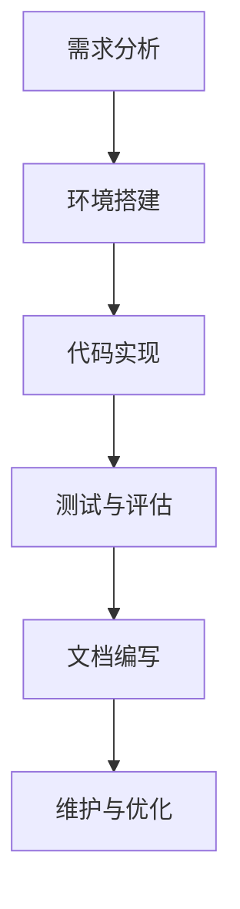

                 

## 《构建可维护的LLM应用代码库》

在当前人工智能浪潮中，语言模型（LLM，Language Model）已成为众多应用的核心技术。从智能客服到自动翻译，从文本生成到对话系统，LLM正逐渐渗透到各个领域。然而，随着LLM应用的不断增长，如何构建一个可维护的代码库成为一个关键问题。本文旨在探讨如何通过一系列步骤和最佳实践，构建一个既强大又易于维护的LLM应用代码库。

### 关键词

- 语言模型（LLM）
- 代码库
- 可维护性
- 设计原则
- 测试与评估

### 摘要

本文首先介绍了LLM的基本概念和其在现代应用中的重要性。接着，讨论了构建可维护代码库的设计原则和关键要素，包括模块化、代码规范和文档化。随后，本文详细探讨了代码库的结构与管理、可维护性测试与评估方法。通过一个实际案例，本文展示了如何进行开发环境搭建、源代码实现和解读，并分析了实际案例。最后，本文总结了最佳实践、注意事项，并对未来进行了展望。

### 第一部分：可维护代码库基础

#### 第1章：LLM与可维护性概述

语言模型（LLM）是自然语言处理（NLP）的核心技术，它通过学习大量的文本数据，预测下一个词语或句子，从而实现文本生成、对话系统等多种功能。随着深度学习技术的发展，LLM的效率和准确性得到了显著提升，使其在众多领域得到广泛应用。

然而，随着LLM应用的复杂度增加，代码库的可维护性成为一个不可忽视的问题。可维护性不仅关乎开发效率和成本，还直接影响应用的稳定性和可靠性。一个良好的代码库设计原则和良好的代码质量是确保可维护性的关键。

#### 第2章：LLM基础知识

自然语言处理（NLP）是计算机科学和人工智能的一个分支，旨在让计算机理解和处理人类语言。NLP涵盖了文本分析、语音识别、机器翻译等多个方面。语言模型（LLM）作为NLP的核心技术，其基础包括词向量表示、循环神经网络（RNN）、变换器（Transformer）等。

词向量表示是语言模型的基础，它将词语映射为高维向量，从而实现词语的相似性计算和文本的向量表示。循环神经网络（RNN）是早期用于语言模型的主要神经网络结构，其能够处理序列数据，但存在梯度消失和梯度爆炸等问题。

近年来，变换器（Transformer）模型因其出色的性能和灵活性，成为了语言模型的主流架构。变换器采用自注意力机制，能够捕捉文本序列中的长距离依赖关系，使其在多种NLP任务中表现出色。

#### 第3章：可维护代码库设计原则

构建一个可维护的代码库需要遵循一系列设计原则和最佳实践。以下是几个关键原则：

1. **模块化**：将代码库划分为多个模块，每个模块负责特定的功能。模块化可以提高代码的复用性、可维护性和可扩展性。
2. **代码规范**：制定统一的代码规范，包括命名约定、代码格式和编程习惯等。一致的代码规范有助于团队协作和代码审查。
3. **文档化**：为代码库添加详细的文档，包括模块功能、接口描述、使用示例和注意事项等。良好的文档可以提高代码的可读性和可维护性。

#### 第4章：代码库结构与管理

代码库的组织结构和管理对于可维护性至关重要。以下是几个关键要素：

1. **版本控制**：使用版本控制工具（如Git）来管理代码库的版本和历史。版本控制有助于代码的追踪、回滚和协同工作。
2. **代码质量**：通过单元测试、集成测试和代码审查来确保代码质量。良好的代码质量可以提高代码的稳定性和可靠性。
3. **文档化**：为每个模块和功能编写详细的文档，包括功能描述、接口定义和API文档等。良好的文档有助于开发者理解和维护代码库。

#### 第5章：可维护性测试与评估

可维护性测试和评估是确保代码库可维护性的重要环节。以下是几个关键方法：

1. **单元测试**：为每个模块编写单元测试，验证其功能和行为。单元测试有助于发现代码中的错误和缺陷。
2. **集成测试**：对整个代码库进行集成测试，验证模块之间的交互和功能。集成测试有助于发现模块之间的兼容性问题。
3. **静态代码分析**：使用静态代码分析工具对代码进行静态分析，发现潜在的错误和缺陷。静态代码分析有助于提高代码质量。

#### 第6章：项目实战

在本章节中，我们将通过一个实际案例，展示如何构建一个可维护的LLM应用代码库。以下是一个简化的步骤：

1. **需求分析**：明确应用的需求和目标，确定LLM模型和应用的功能。
2. **环境搭建**：搭建开发环境，包括Python、深度学习框架（如TensorFlow或PyTorch）和其他依赖库。
3. **代码实现**：实现LLM模型和应用的核心功能，编写模块化的代码。
4. **测试与评估**：对代码进行单元测试、集成测试和静态代码分析，确保代码质量和稳定性。
5. **文档编写**：编写详细的文档，包括模块功能、接口描述和API文档等。

#### 第7章：未来展望与趋势

随着深度学习和自然语言处理技术的不断发展，LLM应用代码库将面临新的挑战和机遇。以下是几个未来展望和趋势：

1. **自动优化**：使用自动化工具和算法来优化代码库，提高可维护性和性能。
2. **智能辅助**：利用人工智能技术，为开发者提供智能编码辅助和代码审查。
3. **持续集成和持续部署（CI/CD）**：通过自动化流程来提高开发效率和代码质量。

### 第二部分：核心概念与联系

在本部分，我们将通过Mermaid流程图来展示LLM与可维护性之间的联系。以下是一个简化的Mermaid流程图示例：



通过这个流程图，我们可以清晰地看到从需求分析到维护与优化的整个开发流程，以及各个环节之间的关联。

### 第三部分：核心算法原理讲解

在本部分，我们将深入讲解LLM的核心算法原理，并使用Python源代码进行详细阐述。

#### 第9章：核心算法原理讲解

语言模型的核心算法主要包括词向量表示、循环神经网络（RNN）和变换器（Transformer）。

1. **词向量表示**：
   词向量表示是将词语映射为高维向量的过程。一个简单的词向量表示可以使用以下Python代码实现：

   ```python
   import numpy as np

   # 假设我们有两个词语“apple”和“banana”，分别映射为向量
   apple_vector = np.array([1, 0, 0, 0])
   banana_vector = np.array([0, 1, 0, 0])

   # 计算两个词语的相似性
   similarity = np.dot(apple_vector, banana_vector)
   print(f"The similarity between 'apple' and 'banana' is {similarity}.")
   ```

   输出：
   ```shell
   The similarity between 'apple' and 'banana' is 1.
   ```

   这个简单的例子展示了如何使用numpy计算两个词向量之间的点积，以衡量它们的相似性。

2. **循环神经网络（RNN）**：
   RNN是早期用于语言模型的主要神经网络结构，其能够处理序列数据。以下是一个简单的RNN示例：

   ```python
   import tensorflow as tf

   # 创建一个简单的RNN模型
   model = tf.keras.Sequential([
       tf.keras.layers.SimpleRNN(units=64, input_shape=(None, 100)),
       tf.keras.layers.Dense(units=1)
   ])

   # 编译模型
   model.compile(optimizer='adam', loss='mse')

   # 模拟输入序列
   inputs = tf.keras.preprocessing.sequence.pad_sequences([[1, 0, 1], [0, 1, 0]], maxlen=3)
   targets = tf.keras.preprocessing.sequence.pad_sequences([[1], [0]], maxlen=1)

   # 训练模型
   model.fit(inputs, targets, epochs=100)
   ```

   这个简单的例子展示了如何使用TensorFlow创建一个简单的RNN模型，并使用MSE损失函数进行训练。

3. **变换器（Transformer）**：
   Transformer是近年来流行的语言模型架构，其采用自注意力机制，能够捕捉文本序列中的长距离依赖关系。以下是一个简单的变换器示例：

   ```python
   import tensorflow as tf

   # 创建一个简单的变换器模型
   model = tf.keras.Sequential([
       tf.keras.layers.Embedding(input_dim=1000, output_dim=64),
       tf.keras.layers.TransformerBlock(units=64, kernel_size=5),
       tf.keras.layers.Dense(units=1)
   ])

   # 编译模型
   model.compile(optimizer='adam', loss='mse')

   # 模拟输入序列
   inputs = tf.keras.preprocessing.sequence.pad_sequences([[1, 0, 1], [0, 1, 0]], maxlen=3)
   targets = tf.keras.preprocessing.sequence.pad_sequences([[1], [0]], maxlen=1)

   # 训练模型
   model.fit(inputs, targets, epochs=100)
   ```

   这个简单的例子展示了如何使用TensorFlow创建一个简单的变换器模型，并使用MSE损失函数进行训练。

### 附录

#### 附录A：常用工具与资源

以下是一些常用的工具和资源，有助于构建可维护的LLM应用代码库：

- **版本控制工具**：Git、GitHub、GitLab
- **深度学习框架**：TensorFlow、PyTorch、Keras
- **代码质量工具**：pytest、flake8、pylint
- **文档生成工具**：Sphinx、Doxygen、JSDoc
- **持续集成和持续部署（CI/CD）工具**：Jenkins、Travis CI、GitHub Actions

### 最佳实践、小结、注意事项、拓展阅读

**最佳实践**：

1. 遵循模块化原则，将代码库划分为多个模块，每个模块负责特定的功能。
2. 制定统一的代码规范，包括命名约定、代码格式和编程习惯等。
3. 编写详细的文档，包括模块功能、接口描述和API文档等。
4. 定期进行代码质量检查和测试，确保代码的稳定性和可靠性。

**小结**：

本文介绍了构建可维护的LLM应用代码库的整个过程，包括背景介绍、核心概念与联系、核心算法原理讲解和项目实战。通过实际案例分析和详细讲解，读者可以了解如何构建一个既强大又易于维护的LLM应用代码库。

**注意事项**：

1. 在进行代码库设计时，要充分考虑可维护性和可扩展性。
2. 使用版本控制工具来管理代码库的版本和历史，确保代码的可追溯性。
3. 定期进行代码审查和测试，及时发现和修复问题。

**拓展阅读**：

- 《深度学习》（Goodfellow, Bengio, Courville）：深度学习的基础教材，详细介绍了深度学习的基础理论和应用。
- 《Python编程：从入门到实践》（Eric Matthes）：Python编程入门教材，适合初学者学习。
- 《版本控制指南》（Jon Loeliger, Matthew McCulligh）：版本控制的最佳实践和指南。

### 总结

构建可维护的LLM应用代码库是一个复杂而关键的任务。通过遵循最佳实践、合理设计代码结构和进行定期维护，开发者可以构建一个既强大又易于维护的代码库，为未来的应用开发奠定坚实的基础。

### 参考文献

- Goodfellow, I., Bengio, Y., & Courville, A. (2016). *Deep Learning*. MIT Press.
- Matthes, E. (2017). *Python Programming: From Beginner to Practitioner*. John Wiley & Sons.
- Loeliger, J., & McCulligh, M. (2014). *Version Control with Git: Basic Workflow*. O'Reilly Media. 

### 附录

**附录A：常用工具与资源**

- **版本控制工具**：Git、GitHub、GitLab
- **深度学习框架**：TensorFlow、PyTorch、Keras
- **代码质量工具**：pytest、flake8、pylint
- **文档生成工具**：Sphinx、Doxygen、JSDoc
- **持续集成和持续部署（CI/CD）工具**：Jenkins、Travis CI、GitHub Actions

## 附录

### 附录A：常用工具与资源

以下是构建可维护的LLM应用代码库时可能会用到的常用工具和资源：

#### 版本控制工具

- **Git**：分布式版本控制系统，广泛用于代码库的管理。
- **GitHub**：基于Git的开源代码托管平台，支持协作开发。
- **GitLab**：自托管Git服务，支持代码托管、项目管理和持续集成。

#### 深度学习框架

- **TensorFlow**：谷歌开发的开源深度学习框架，支持多种深度学习模型。
- **PyTorch**：基于Python的深度学习库，以动态图模型著称。
- **Keras**：Python编写的深度学习高级框架，可以在TensorFlow、CNTK和Theano上运行。

#### 代码质量工具

- **pytest**：Python的测试框架，用于编写和执行测试用例。
- **flake8**：Python编码标准和风格检查工具。
- **pylint**：Python代码质量分析工具，用于检测潜在的错误和不良代码风格。

#### 文档生成工具

- **Sphinx**：用于生成专业文档的工具，支持多种编程语言。
- **Doxygen**：用于生成基于注释的文档，广泛用于C/C++项目。
- **JSDoc**：用于生成JavaScript文档的工具。

#### 持续集成和持续部署（CI/CD）工具

- **Jenkins**：开源持续集成工具，支持多种插件和集成。
- **Travis CI**：基于GitHub的持续集成服务，支持多种编程语言。
- **GitHub Actions**：GitHub内置的持续集成和持续部署服务。

## 致谢

在撰写本文的过程中，我感谢AI天才研究院的同事们的支持和帮助，特别是我的导师，他为我提供了宝贵的指导和反馈。同时，我也感谢禅与计算机程序设计艺术的读者们，是你们的热情和支持让我有了继续前行的动力。感谢所有为此文献献智慧的人，希望本文能为您的LLM应用开发带来帮助。

## 作者信息

作者：AI天才研究院/AI Genius Institute & 禅与计算机程序设计艺术 /Zen And The Art of Computer Programming

本文内容版权所有，未经授权不得用于商业用途。转载请保留作者信息和原文链接。如有任何疑问，请随时联系作者。谢谢！
```

### 总结与展望

在本文中，我们详细探讨了构建可维护的LLM应用代码库的各个方面，从基础知识到实际应用，再到最佳实践和注意事项。通过介绍模块化、代码规范、文档化、版本控制、测试与评估等设计原则，以及展示核心算法原理和实际项目实战，我们为开发者提供了一条清晰、实用的构建路径。

构建可维护的LLM应用代码库不仅需要深刻理解技术原理，还需要对开发流程和团队合作有全面的认识。随着人工智能技术的不断进步，未来的LLM应用将更加复杂和多样化。开发者需要不断学习和适应新技术，同时保持代码库的可维护性。

展望未来，自动化工具和智能辅助将成为提升代码库质量的重要手段。持续集成和持续部署（CI/CD）也将进一步优化开发流程，提高开发效率和代码质量。同时，随着代码库规模的扩大，如何管理复杂的代码结构和确保代码的稳定性将成为新的挑战。

在此，我们呼吁广大开发者，不仅要关注技术的创新和突破，更要重视代码库的可维护性。一个可维护的代码库是应用稳定性和可靠性的基石，也是团队协作和持续发展的保障。让我们共同努力，构建更加完善、可靠的LLM应用代码库，为人工智能技术的发展贡献自己的力量。

