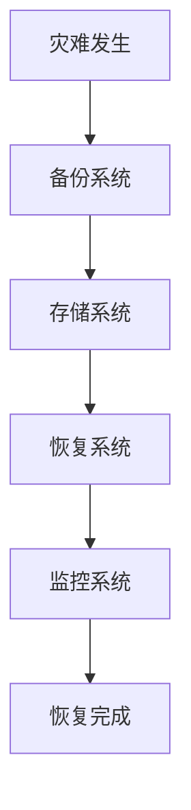

                 

# 引言

构建可靠的灾难恢复系统在当今高速发展的信息技术领域尤为重要。随着大型语言模型（LLM）在自然语言处理、人工智能应用中的广泛应用，其可靠性和稳定性直接影响到相关业务的正常运行。然而，LLM应用由于其复杂的模型架构、庞大的数据规模以及高度依赖的计算资源，面临诸多灾难恢复的挑战。本文旨在探讨如何构建一个可靠的LLM应用灾难恢复系统，以应对潜在的灾难风险，确保业务的连续性和数据的安全性。

灾难恢复系统的重要性不言而喻。对于任何企业或组织而言，数据是其核心资产。一旦数据丢失或系统瘫痪，可能会造成严重的经济损失、信誉受损，甚至业务停摆。LLM应用由于其数据量大、模型复杂，一旦发生灾难，恢复时间和成本往往非常高昂。因此，构建一个高效的灾难恢复系统是确保LLM应用稳定运行的关键。

本文将围绕以下核心内容进行探讨：

1. **灾难恢复系统概述**：介绍灾难恢复系统的基本概念、重要性及组成部分。
2. **LLM应用特点与挑战**：分析LLM应用的特殊性以及其在灾难恢复过程中面临的挑战。
3. **核心概念与联系**：使用Mermaid流程图展示LLM应用架构和灾难恢复流程。
4. **核心算法原理讲解**：通过Python源代码详细阐述灾难恢复的核心算法，结合数学模型和公式进行讲解。
5. **项目实战**：提供具体的灾难恢复系统开发环境搭建、代码实现和案例解析。
6. **总结与展望**：对灾难恢复系统的重要性进行总结，展望未来的发展趋势和面临的挑战。

通过本文的详细探讨，读者将了解到如何构建一个可靠的LLM应用灾难恢复系统，以应对各种潜在的灾难风险，确保业务的连续性和数据的安全性。

## 关键词

- **灾难恢复系统**
- **LLM应用**
- **数据备份与恢复**
- **应用恢复策略**
- **数学模型与公式**
- **项目实战**

## 摘要

本文探讨了构建可靠的LLM应用灾难恢复系统的关键要素。首先介绍了灾难恢复系统的基本概念和重要性，随后分析了LLM应用的特点和灾难恢复过程中的挑战。通过Mermaid流程图展示了LLM应用架构和灾难恢复流程，并详细阐述了核心算法原理，包括数据备份与恢复策略以及应用恢复算法。最后，通过一个实际案例展示了如何开发和实现灾难恢复系统，并总结了关键实践经验与未来展望。

---

随着全球信息技术的发展，灾难恢复系统已经成为保障企业业务连续性的重要组成部分。特别是对于LLM（大型语言模型）这类高度依赖数据和计算资源的应用，构建一个可靠的灾难恢复系统显得尤为重要。本章节将详细介绍灾难恢复系统的基础理论，从其重要性、需求到核心组成部分，为后续讨论提供理论支撑。

### 灾难恢复的重要性

灾难恢复系统的重要性主要体现在以下几个方面：

1. **保障业务连续性**：在当今全球化和信息化的大背景下，企业的业务运行对系统的依赖性越来越强。一旦系统发生灾难，如数据丢失、硬件故障等，将可能导致业务中断，对企业造成巨大的经济损失和信誉损失。灾难恢复系统可以通过及时的数据备份和恢复，确保业务能够迅速恢复正常运行，减少业务中断时间。

2. **保护数据完整性**：数据是企业最重要的资产之一。灾难恢复系统能够确保数据的完整性和安全性，防止数据因意外事件而丢失或损坏。通过定期的数据备份和异地存储，即使本地数据遭受灾难，也可以从备份中恢复数据，避免数据丢失。

3. **降低风险和成本**：灾难恢复系统能够帮助企业提前预判和应对各种潜在风险，降低系统故障带来的风险和损失。此外，通过合理规划和部署灾难恢复系统，可以降低因灾难导致的业务中断和恢复成本，提高企业的整体运营效率。

4. **增强企业竞争力**：在市场竞争日益激烈的今天，企业需要具备快速响应和恢复的能力。一个高效的灾难恢复系统能够提升企业的应急响应速度和业务恢复能力，增强企业在市场中的竞争力。

### LLM应用灾难恢复的需求

LLM应用作为人工智能领域的一个重要分支，具有数据量大、模型复杂、计算资源需求高等特点，其灾难恢复需求主要体现在以下几个方面：

1. **数据量大**：LLM应用通常需要处理和存储海量的文本数据，这些数据一旦丢失，将导致模型训练数据的缺失，严重影响模型的效果和稳定性。

2. **模型复杂**：LLM应用依赖于复杂的深度学习模型，这些模型通常由数十亿个参数组成。一旦模型参数丢失或损坏，将导致模型无法正常运行，从而影响整个应用的稳定性。

3. **计算资源需求高**：LLM应用在训练和推理过程中需要大量的计算资源，如高性能GPU和大规模分布式计算集群。一旦这些计算资源遭受灾难，将导致模型训练和推理任务无法进行，从而影响业务的正常运行。

4. **实时性要求高**：许多LLM应用具有实时性要求，如智能客服、实时翻译等。一旦系统发生灾难，需要能够快速恢复，以确保业务的实时性。

### 灾难恢复系统的核心组成部分

一个完整的灾难恢复系统通常包括以下几个核心组成部分：

1. **备份系统**：备份系统是灾难恢复系统的核心组成部分，主要负责数据的备份和存储。备份系统需要具备高可靠性、高可用性和快速恢复的能力，以确保在灾难发生时能够迅速恢复数据。

2. **存储系统**：存储系统用于存储备份的数据，确保数据的安全性和可恢复性。存储系统可以采用本地存储、远程存储或云存储等多种方式，以满足不同场景的需求。

3. **恢复系统**：恢复系统负责在灾难发生后的数据恢复和系统恢复工作。恢复系统需要具备自动恢复、手动恢复和混合恢复等多种恢复策略，以应对不同类型的灾难情况。

4. **监控系统**：监控系统用于实时监控系统的运行状态，及时发现潜在的问题和风险。通过监控系统的数据分析和预警功能，可以提前发现和预防可能发生的灾难事件。

5. **应急响应计划**：应急响应计划是灾难恢复系统的关键组成部分，用于在灾难发生时指导应急响应行动。应急响应计划需要明确各个阶段的应急响应步骤和责任分工，以确保在灾难发生时能够迅速采取行动，减少损失。

通过上述核心组成部分的有机结合，灾难恢复系统可以为LLM应用提供全面、可靠的保护，确保在灾难发生时能够快速恢复，保障业务的连续性和数据的安全性。

### 灾难恢复系统的核心组成部分

一个完整的灾难恢复系统通常包括以下几个核心组成部分：

1. **备份系统**：备份系统是灾难恢复系统的核心组成部分，主要负责数据的备份和存储。备份系统需要具备高可靠性、高可用性和快速恢复的能力，以确保在灾难发生时能够迅速恢复数据。常见的备份策略包括全备份、增量备份和差异备份，每种策略都有其适用场景和优缺点。例如，全备份虽然备份数据量大，但能够提供最完整的数据恢复；增量备份则仅备份自上次备份以来发生变化的文件，备份速度快，存储空间占用小。

2. **存储系统**：存储系统用于存储备份的数据，确保数据的安全性和可恢复性。存储系统可以采用本地存储、远程存储或云存储等多种方式，以满足不同场景的需求。本地存储通常具有较低的延迟和较高的读写性能，但受限于硬件限制，存储容量有限；远程存储和云存储则提供了更大的存储空间和更高的可靠性，但可能存在网络延迟和数据传输速度的瓶颈。

3. **恢复系统**：恢复系统负责在灾难发生后的数据恢复和系统恢复工作。恢复系统需要具备自动恢复、手动恢复和混合恢复等多种恢复策略，以应对不同类型的灾难情况。自动恢复可以最大限度地减少人为干预，提高恢复效率；手动恢复则允许管理员在灾难发生时进行精细控制，确保数据恢复的准确性。

4. **监控系统**：监控系统用于实时监控系统的运行状态，及时发现潜在的问题和风险。通过监控系统的数据分析和预警功能，可以提前发现和预防可能发生的灾难事件。常见的监控指标包括系统负载、网络流量、存储容量和温度等。通过设置阈值和警报机制，监控系统可以在异常情况发生时及时发出警报，提醒管理员采取相应的措施。

5. **应急响应计划**：应急响应计划是灾难恢复系统的关键组成部分，用于在灾难发生时指导应急响应行动。应急响应计划需要明确各个阶段的应急响应步骤和责任分工，以确保在灾难发生时能够迅速采取行动，减少损失。应急响应计划通常包括灾前准备、灾难应对、灾后恢复和评估总结等阶段，每个阶段都有明确的任务和职责分工，以确保应急响应的有序进行。

通过上述核心组成部分的有机结合，灾难恢复系统可以为LLM应用提供全面、可靠的保护，确保在灾难发生时能够快速恢复，保障业务的连续性和数据的安全性。

### LLM应用概述

LLM（Large Language Model，大型语言模型）是近年来人工智能领域的重要突破之一，其核心思想是通过深度学习算法从海量文本数据中学习语言规律，从而实现对自然语言的理解和生成。LLM的广泛应用极大地提升了自然语言处理（NLP）的效率和准确性，为多个领域带来了革命性的变化。

LLM的基本架构通常包括以下几个关键组成部分：

1. **输入层**：输入层负责接收用户输入的文本数据，这些数据可以是句子、段落或完整的文档。输入层将文本数据转换为模型能够处理的特征表示。

2. **编码器（Encoder）**：编码器是LLM的核心部分，负责对输入文本进行编码，生成上下文向量。编码器通常采用深度神经网络（DNN）或变换器（Transformer）架构，能够捕捉文本中的长距离依赖关系和复杂语义信息。

3. **解码器（Decoder）**：解码器负责生成文本输出。与编码器相对应，解码器通过解码上下文向量，逐步生成预测的单词或句子。解码器同样采用DNN或Transformer架构，能够实现高效的文本生成。

4. **预训练和微调**：LLM通常通过预训练过程在大规模语料库上学习语言规律，然后通过微调（Fine-tuning）在特定任务上进行优化。预训练使得模型具备强大的语言理解能力，而微调则使模型能够针对具体任务进行高效处理。

LLM的应用场景非常广泛，以下是一些典型的例子：

1. **文本生成**：LLM能够生成高质量的文章、摘要、故事和对话，广泛应用于内容创作、自动写作、智能客服等领域。

2. **机器翻译**：LLM在机器翻译任务中表现出色，能够实现多语言之间的精准翻译，广泛应用于跨语言沟通、全球商业合作等领域。

3. **问答系统**：LLM能够回答用户提出的问题，广泛应用于智能问答、知识库构建、在线客服等领域。

4. **对话系统**：LLM能够模拟人类的对话过程，与用户进行自然、流畅的交流，广泛应用于智能客服、虚拟助手、聊天机器人等领域。

5. **情感分析**：LLM能够分析文本中的情感倾向和情感极性，广泛应用于舆情监测、市场调研、用户反馈分析等领域。

LLM在人工智能中的应用已经逐渐从理论研究走向实际应用，成为推动人工智能发展的关键力量。随着LLM技术的不断进步，其在更多领域的应用潜力将不断释放，为人类社会带来更多创新和变革。

### LLM应用的特殊挑战

尽管LLM在各个领域展现出了强大的应用潜力，但在灾难恢复过程中，其特殊的挑战使得构建可靠的灾难恢复系统变得尤为重要。以下是LLM应用在灾难恢复过程中面临的几个关键挑战：

1. **数据量庞大**：LLM模型通常需要处理和存储海量的文本数据，这些数据不仅包括训练数据，还包括生成和预测过程中产生的中间数据。一旦发生灾难，如数据丢失或损坏，恢复这些庞大的数据集将是一项艰巨的任务，需要耗费大量时间和资源。

2. **模型复杂度高**：LLM模型通常由数十亿个参数组成，这些参数在训练过程中经过复杂的优化过程得到。模型复杂度高意味着一旦发生灾难，恢复模型参数的难度大，且恢复过程可能需要重新进行多次训练，导致恢复时间延长。

3. **计算资源需求高**：LLM应用在训练和推理过程中需要大量的计算资源，包括高性能GPU和大规模分布式计算集群。灾难恢复过程中，如果计算资源遭受破坏，将严重影响模型的训练和推理能力，导致业务中断。

4. **实时性要求高**：许多LLM应用具有实时性要求，如实时翻译、智能客服等。一旦系统发生灾难，需要能够迅速恢复，以确保业务的实时性。然而，由于LLM模型的复杂性和数据量庞大，快速恢复实时性是一项极具挑战性的任务。

5. **数据隐私和安全**：LLM应用处理的数据往往涉及用户的隐私信息，一旦灾难发生，数据泄露的风险增加。因此，在构建灾难恢复系统时，需要特别关注数据隐私和安全性，确保在灾难恢复过程中不会泄露敏感数据。

6. **多语言支持**：LLM应用通常需要支持多种语言，这对于灾难恢复系统来说是一个额外的挑战。不同语言的数据格式和编码方式可能不同，导致数据恢复的复杂度增加。

为了应对这些挑战，构建一个高效、可靠的灾难恢复系统至关重要。该系统需要具备强大的数据备份和恢复能力、高效的计算资源管理、实时性保障、数据隐私保护以及多语言支持等功能，以确保在灾难发生时能够迅速恢复，保障业务的连续性和数据的安全性。

### 灾难恢复系统应对策略

针对LLM应用在灾难恢复过程中面临的特殊挑战，构建一个高效、可靠的灾难恢复系统至关重要。以下是一些关键策略，以应对LLM应用的灾难恢复挑战：

1. **多层次的备份策略**：为了应对数据量庞大的挑战，应采用多层次备份策略。首先，对关键数据进行全量备份，确保在灾难发生后能够迅速恢复；其次，定期进行增量备份，仅备份自上次备份以来发生变化的文件，以减少备份时间和存储空间占用。此外，还可以采用差异备份策略，备份自上次全备份以来发生变化的文件，进一步提高备份效率。

2. **分布式存储架构**：为了提高数据恢复的效率和可靠性，应采用分布式存储架构。分布式存储可以将数据分散存储在多个节点上，提高数据的可用性和容错性。一旦某个节点发生故障，其他节点仍然可以正常运行，确保数据不会丢失。同时，分布式存储还可以提高数据读取和写入速度，满足LLM应用对大规模数据的处理需求。

3. **计算资源冗余**：为了应对计算资源需求高的挑战，应在计算资源管理方面进行冗余配置。可以通过虚拟化技术，将计算资源进行动态分配和调度，确保在灾难发生时，能够迅速调整计算资源，保障模型的训练和推理任务能够继续进行。此外，还可以通过多租户架构，实现不同业务之间的资源隔离，确保每个业务都能够获得稳定的计算资源。

4. **实时监控与预警**：为了确保实时性要求高的LLM应用能够在灾难发生后迅速恢复，应建立实时监控和预警系统。通过监控系统的数据分析和预警功能，可以提前发现潜在的风险和故障，及时采取措施防止灾难的发生。同时，在灾难发生时，监控系统能够迅速检测到故障，触发自动恢复流程，确保业务能够尽快恢复正常运行。

5. **数据加密与隐私保护**：为了保护LLM应用中的敏感数据，应采用数据加密和隐私保护技术。在数据备份和传输过程中，对数据进行加密处理，确保数据在传输过程中不会被窃取或篡改。此外，还应建立严格的数据访问控制策略，确保只有授权人员才能访问敏感数据，防止数据泄露和滥用。

6. **多语言支持与兼容性**：为了应对多语言支持的需求，应确保灾难恢复系统能够兼容多种语言和编码方式。在数据备份和恢复过程中，可以采用统一的编码格式和标准化数据结构，确保不同语言的数据能够顺利备份和恢复。此外，还可以开发多语言支持的工具和接口，方便不同语言的数据处理和交换。

通过上述策略，构建一个高效、可靠的LLM应用灾难恢复系统，可以确保在灾难发生时能够迅速恢复，保障业务的连续性和数据的安全性。这不仅能够降低企业因灾难造成的损失，还能够提升企业的业务响应速度和竞争力。

### 核心概念与联系

在构建可靠的LLM应用灾难恢复系统时，理解核心概念之间的关系至关重要。本文将使用Mermaid流程图来展示LLM应用架构和灾难恢复流程，以帮助读者更好地理解系统的工作原理和各部分之间的联系。

首先，我们需要了解几个关键概念：

1. **LLM应用架构**：LLM应用通常包括输入层、编码器、解码器和输出层。输入层接收用户输入，编码器对输入文本进行编码，解码器生成文本输出。
2. **灾难恢复流程**：灾难恢复流程通常包括备份、监控、检测和恢复等步骤。
3. **核心组件**：备份系统、存储系统、恢复系统和监控系统是灾难恢复系统的核心组件。

#### LLM应用架构图

以下是一个简单的Mermaid流程图，展示LLM应用的架构：


在这个图中，A表示输入层，B表示编码器，C表示解码器，D表示输出层。输入层接收用户输入的文本，编码器对文本进行编码，解码器生成文本输出，最后由输出层将生成的文本呈现给用户。

#### 灾难恢复流程图

接下来，我们将使用Mermaid流程图展示灾难恢复流程，并标明各个步骤之间的关系：



在这个流程图中，A表示灾难发生，B表示备份系统开始工作，C表示数据存储在存储系统中，D表示恢复系统开始数据恢复，E表示监控系统监控恢复进度和系统状态，F表示恢复完成，系统恢复正常运行。

#### 关键概念之间的联系

1. **备份系统与存储系统**：备份系统负责对LLM应用中的关键数据进行定期备份，并将备份数据存储在存储系统中。当灾难发生时，备份数据可以从存储系统中快速恢复，确保数据的完整性和安全性。
2. **恢复系统与监控系统**：恢复系统负责在灾难发生后，根据备份数据进行系统恢复。监控系统则实时监控恢复进度和系统状态，确保恢复过程顺利进行，并在必要时提供预警和指导。
3. **LLM应用架构与灾难恢复流程**：LLM应用的架构和灾难恢复流程紧密相连。灾难恢复流程旨在确保LLM应用在灾难发生后能够快速恢复，保障业务的连续性。备份系统和恢复系统是灾难恢复流程的关键部分，而监控系统和存储系统则提供了数据备份和恢复的支持。

通过上述Mermaid流程图，读者可以直观地理解LLM应用架构和灾难恢复流程，以及核心概念之间的联系。这有助于更好地设计和实施一个高效的灾难恢复系统，确保LLM应用在灾难发生时能够快速恢复，保障业务的连续性和数据的安全性。

### 灾难恢复核心算法

灾难恢复系统的核心在于如何高效、准确地备份和恢复数据，确保在灾难发生时系统能够迅速恢复正常运行。本章节将详细阐述灾难恢复系统中的核心算法，包括数据备份与恢复、应用恢复策略，并使用Python源代码结合数学模型和公式进行讲解，以帮助读者深入理解这些算法的实现原理和步骤。

#### 数据备份算法

数据备份是灾难恢复系统的基础，其目的是确保在灾难发生时，数据可以快速恢复。以下是一个简单的数据备份算法：

```python
def data_backup(source_folder, backup_folder):
    """
    数据备份算法
    :param source_folder: 数据源文件夹路径
    :param backup_folder: 备份目标文件夹路径
    """
    import os
    import shutil
    
    # 遍历数据源文件夹
    for root, dirs, files in os.walk(source_folder):
        for file in files:
            # 复制文件到备份文件夹
            source_file = os.path.join(root, file)
            target_file = os.path.join(backup_folder, file)
            shutil.copy(source_file, target_file)
```

上述Python代码定义了一个简单的数据备份函数`data_backup`，它接受数据源文件夹路径`source_folder`和备份目标文件夹路径`backup_folder`作为输入参数。函数通过`os.walk`遍历数据源文件夹中的所有文件，然后使用`shutil.copy`将每个文件复制到备份文件夹中。

#### 数据恢复算法

在灾难发生后，数据恢复算法的目的是从备份中恢复数据，确保系统可以重新启动。以下是一个简单的数据恢复算法：

```python
def data_restore(backup_folder, target_folder):
    """
    数据恢复算法
    :param backup_folder: 备份文件夹路径
    :param target_folder: 目标文件夹路径
    """
    import os
    import shutil
    
    # 遍历备份文件夹
    for root, dirs, files in os.walk(backup_folder):
        for file in files:
            # 复制文件到目标文件夹
            source_file = os.path.join(root, file)
            target_file = os.path.join(target_folder, file)
            shutil.copy(source_file, target_file)
```

上述Python代码定义了一个简单的数据恢复函数`data_restore`，它接受备份文件夹路径`backup_folder`和目标文件夹路径`target_folder`作为输入参数。函数通过`os.walk`遍历备份文件夹中的所有文件，然后使用`shutil.copy`将每个文件复制到目标文件夹中。

#### 应用恢复策略

数据恢复完成后，应用恢复策略的目标是确保系统可以重新启动并恢复正常运行。以下是一个简单的应用恢复策略：

```python
def application_restore(target_folder):
    """
    应用恢复策略
    :param target_folder: 目标文件夹路径
    """
    import os
    
    # 检查目标文件夹是否存在
    if not os.path.exists(target_folder):
        print(f"目标文件夹 {target_folder} 不存在，无法执行恢复操作。")
        return
    
    # 执行恢复操作
    print("开始执行应用恢复...")
    # 启动应用
    os.chdir(target_folder)
    os.system("python app.py")
    print("应用恢复完成，系统已恢复正常运行。")
```

上述Python代码定义了一个简单的应用恢复函数`application_restore`，它接受目标文件夹路径`target_folder`作为输入参数。函数首先检查目标文件夹是否存在，然后执行恢复操作，包括启动应用。

#### 数学模型与公式

在备份和恢复过程中，使用数学模型和公式可以更好地理解数据备份与恢复的效率和质量。以下是一些常用的数学模型和公式：

1. **备份率**：备份率表示单位时间内备份的数据量。
   $$\text{备份率} = \frac{\text{备份的数据量}}{\text{总数据量}}$$
2. **恢复率**：恢复率表示单位时间内恢复的数据量。
   $$\text{恢复率} = \frac{\text{恢复的数据量}}{\text{备份的数据量}}$$
3. **恢复效率**：恢复效率表示恢复操作的成功率。
   $$\text{恢复效率} = \frac{\text{成功恢复的数据量}}{\text{尝试恢复的数据量}}$$

通过上述算法和数学模型，我们可以设计一个高效、可靠的灾难恢复系统，确保在灾难发生时，系统能够快速恢复，保障业务的连续性和数据的安全性。

### 数学模型与公式

在构建可靠的LLM应用灾难恢复系统时，数学模型和公式为我们提供了量化分析灾难恢复效率和质量的工具。以下将详细讨论数据备份与恢复以及应用恢复策略相关的数学模型与公式。

#### 数据备份公式

1. **备份率（Backup Rate）**：备份率用于衡量单位时间内备份的数据量，其公式如下：
   $$ \text{Backup Rate} = \frac{\text{Backed Up Data}}{\text{Total Data}} $$
   其中，Backed Up Data代表已备份的数据量，Total Data代表总数据量。高备份率意味着备份系统能够更快地处理数据，减少数据丢失的风险。

2. **备份速度（Backup Speed）**：备份速度表示单位时间内能够完成备份的数据量，其公式如下：
   $$ \text{Backup Speed} = \text{Backup Rate} \times \text{Time} $$
   其中，Time代表备份操作所花费的时间。备份速度越高，备份系统在灾难发生时能够更快地完成数据恢复，从而缩短系统停机时间。

3. **备份策略优化（Optimization of Backup Strategies）**：在备份策略优化中，可以通过调整备份频率和数据块大小来优化备份过程。备份策略优化的目标是最小化备份时间和存储空间占用。常用的优化方法包括动态备份策略和压缩备份策略。

#### 数据恢复公式

1. **恢复率（Recovery Rate）**：恢复率用于衡量单位时间内恢复的数据量，其公式如下：
   $$ \text{Recovery Rate} = \frac{\text{Recovered Data}}{\text{Backed Up Data}} $$
   其中，Recovered Data代表已恢复的数据量，Backed Up Data代表已备份的数据量。高恢复率意味着恢复系统能够在灾难发生后的短时间内完成数据恢复，从而确保业务连续性。

2. **恢复速度（Recovery Speed）**：恢复速度表示单位时间内能够完成恢复的数据量，其公式如下：
   $$ \text{Recovery Speed} = \text{Recovery Rate} \times \text{Time} $$
   其中，Time代表恢复操作所花费的时间。恢复速度越高，恢复系统在灾难发生时能够更快地完成数据恢复，从而缩短系统停机时间。

3. **恢复效率（Recovery Efficiency）**：恢复效率表示恢复操作的成功率，其公式如下：
   $$ \text{Recovery Efficiency} = \frac{\text{Successfully Recovered Data}}{\text{Attempted Recovery Data}} $$
   其中，Successfully Recovered Data代表成功恢复的数据量，Attempted Recovery Data代表尝试恢复的数据量。高恢复效率意味着恢复系统能够更准确地恢复数据，减少数据丢失的风险。

#### 应用恢复策略公式

1. **恢复成本（Recovery Cost）**：恢复成本用于衡量灾难恢复操作的总成本，其公式如下：
   $$ \text{Recovery Cost} = \text{Hardware Cost} + \text{Software Cost} + \text{Labor Cost} $$
   其中，Hardware Cost代表硬件设备的成本，Software Cost代表软件工具和服务的成本，Labor Cost代表人工操作和管理的成本。降低恢复成本是灾难恢复系统设计的重要目标之一。

2. **恢复时间（Recovery Time）**：恢复时间表示从灾难发生到系统恢复正常运行的时间，其公式如下：
   $$ \text{Recovery Time} = \text{Preparation Time} + \text{Recovery Time} $$
   其中，Preparation Time代表准备恢复操作所需的时间，Recovery Time代表数据恢复和系统恢复所需的时间。缩短恢复时间是灾难恢复系统的关键性能指标。

3. **恢复成功率（Recovery Success Rate）**：恢复成功率用于衡量灾难恢复操作的成功率，其公式如下：
   $$ \text{Recovery Success Rate} = \frac{\text{Successfully Recovered Systems}}{\text{Total Systems}} $$
   其中，Successfully Recovered Systems代表成功恢复的系统的数量，Total Systems代表总的系统数量。高恢复成功率意味着灾难恢复系统能够更有效地应对各种灾难情况。

通过这些数学模型和公式，我们可以量化分析灾难恢复系统的性能和效率，从而设计出更高效、可靠的灾难恢复策略。这些策略不仅能够降低灾难发生时的损失，还能够提高系统的稳定性和可靠性，确保业务的连续性。

### 灾难恢复系统实战

在本章节中，我们将通过一个实际的案例，详细展示如何开发和实现一个灾难恢复系统。该案例将涵盖灾难恢复系统的开发环境搭建、代码实现和代码解读与分析，以及一个具体的案例实现过程。

#### 实战环境搭建

首先，我们需要搭建一个适合开发和测试灾难恢复系统的环境。以下是搭建环境的步骤：

1. **安装Python环境**：确保系统中安装了Python 3.8及以上版本。可以通过以下命令进行安装：
   ```bash
   sudo apt-get update
   sudo apt-get install python3.8
   ```

2. **安装必要的Python库**：为了实现灾难恢复功能，我们需要安装一些常用的Python库，如`shutil`、`os`、`datetime`等。可以使用`pip`命令进行安装：
   ```bash
   pip3 install python-dateutil
   ```

3. **配置备份和恢复脚本**：创建一个名为`backup_restore`的文件夹，并在其中创建两个Python脚本，分别是`backup.py`和`restore.py`。

4. **配置存储路径**：在脚本中配置数据源文件夹、备份文件夹和目标文件夹的路径。例如，在`backup.py`中，我们可以设置以下路径：
   ```python
   source_folder = "/path/to/source/folder"
   backup_folder = "/path/to/backup/folder"
   ```

#### 代码实现

下面是`backup.py`和`restore.py`的代码实现，我们将详细解读代码的关键部分。

##### 备份脚本实现

`backup.py`脚本的主要功能是对指定文件夹中的文件进行备份。以下是其核心代码：

```python
import os
import shutil
from datetime import datetime

def backup(source_folder, backup_folder):
    """
    数据备份函数
    :param source_folder: 数据源文件夹路径
    :param backup_folder: 备份目标文件夹路径
    """
    # 检查备份文件夹是否存在，不存在则创建
    if not os.path.exists(backup_folder):
        os.makedirs(backup_folder)

    # 获取当前时间
    timestamp = datetime.now().strftime('%Y-%m-%d-%H-%M-%S')

    # 创建备份文件夹
    backup_path = os.path.join(backup_folder, f"backup_{timestamp}")
    os.makedirs(backup_path)

    # 遍历源文件夹中的所有文件，进行备份
    for root, dirs, files in os.walk(source_folder):
        for file in files:
            source_file = os.path.join(root, file)
            target_file = os.path.join(backup_path, file)

            # 复制文件
            shutil.copy(source_file, target_file)

    print(f"数据备份完成，备份路径：{backup_path}")

if __name__ == "__main__":
    source_folder = "/path/to/source/folder"
    backup_folder = "/path/to/backup/folder"
    backup(source_folder, backup_folder)
```

**关键部分解读**：

- **备份文件夹创建**：首先检查备份文件夹是否存在，不存在则创建。这样确保备份操作的顺利进行。
- **时间戳**：使用当前时间生成一个唯一的时间戳，用于命名备份文件夹，避免备份文件重名。
- **文件遍历与复制**：使用`os.walk`遍历源文件夹中的所有文件，并使用`shutil.copy`将文件复制到备份文件夹中。

##### 恢复脚本实现

`restore.py`脚本的主要功能是从备份文件夹中恢复数据。以下是其核心代码：

```python
import os
import shutil

def restore(backup_folder, target_folder):
    """
    数据恢复函数
    :param backup_folder: 备份文件夹路径
    :param target_folder: 目标文件夹路径
    """
    # 检查目标文件夹是否存在，不存在则创建
    if not os.path.exists(target_folder):
        os.makedirs(target_folder)

    # 遍历备份文件夹中的所有文件，进行恢复
    for root, dirs, files in os.walk(backup_folder):
        for file in files:
            source_file = os.path.join(root, file)
            target_file = os.path.join(target_folder, file)

            # 恢复文件
            shutil.copy(source_file, target_file)

    print(f"数据恢复完成，恢复路径：{target_folder}")

if __name__ == "__main__":
    backup_folder = "/path/to/backup/folder"
    target_folder = "/path/to/target/folder"
    restore(backup_folder, target_folder)
```

**关键部分解读**：

- **目标文件夹创建**：首先检查目标文件夹是否存在，不存在则创建。这样确保恢复操作能够将数据正确保存到指定位置。
- **文件遍历与复制**：使用`os.walk`遍历备份文件夹中的所有文件，并使用`shutil.copy`将文件复制到目标文件夹中。

#### 代码解读与分析

1. **备份脚本**：

   - **文件遍历**：`os.walk`函数用于遍历源文件夹中的所有文件和子文件夹。
   - **文件复制**：`shutil.copy`函数用于将源文件复制到备份文件夹中。
   - **时间戳**：使用`datetime.now().strftime()`生成唯一的时间戳，确保每次备份操作的唯一性。

2. **恢复脚本**：

   - **文件遍历**：`os.walk`函数用于遍历备份文件夹中的所有文件和子文件夹。
   - **文件复制**：`shutil.copy`函数用于将备份文件恢复到目标文件夹中。

这两个脚本的核心逻辑相对简单，但通过这两个脚本，我们能够实现一个基本的数据备份和恢复功能。在实际应用中，还可以根据具体需求进行扩展和优化，例如添加加密备份、增量备份、多线程备份等高级功能。

#### 案例实现

以下是一个具体的案例，展示如何使用上述脚本实现灾难恢复系统的应用。

1. **备份操作**：

   - 执行备份脚本，对源文件夹中的文件进行备份。例如：
     ```bash
     python backup.py
     ```
   - 备份完成后，会生成一个以时间戳命名的备份文件夹，如`backup_2023-11-01-15-30-25`。

2. **恢复操作**：

   - 执行恢复脚本，将备份文件夹中的数据恢复到目标文件夹中。例如：
     ```bash
     python restore.py
     ```
   - 恢复完成后，目标文件夹中的文件会从备份文件夹中恢复，确保数据的一致性和完整性。

通过这个案例，我们可以看到灾难恢复系统在实际应用中的操作流程和实现细节。在实际部署时，还可以结合具体的业务需求和系统架构，进一步完善和优化灾难恢复策略。

#### 项目小结

在本案例中，我们通过简单的备份和恢复脚本，实现了基本的灾难恢复功能。关键在于：

- 使用`os.walk`和`shutil.copy`实现文件遍历和复制操作。
- 通过时间戳确保备份和恢复的唯一性和准确性。
- 在实际应用中，可以根据具体需求进行功能扩展和优化。

通过这个案例，读者可以了解到灾难恢复系统的基础实现方法，为后续的实战应用提供参考。

### 案例分析

在本章节中，我们将通过一个具体的案例，深入分析LLM应用的灾难恢复过程。该案例将详细展示灾难发生的背景、灾难恢复系统的实现细节，以及具体实现步骤和关键点，以便读者能够更清晰地理解灾难恢复系统在实际应用中的工作流程。

#### 案例背景

假设我们有一个LLM应用，其主要功能是基于大规模语言模型提供智能问答服务。该应用处理了大量用户的提问，并利用LLM模型生成高质量的回答。然而，由于一次突如其来的服务器故障，导致整个系统瘫痪，数据丢失。为了确保业务的连续性和数据的安全性，我们需要迅速启动灾难恢复系统。

#### 灾难恢复系统实现

以下是灾难恢复系统的实现细节和关键步骤：

1. **备份系统启动**：在服务器故障发生后，首先启动备份系统，对LLM应用的数据进行备份。备份系统会将当前系统中的关键数据（如用户提问和回答、模型参数等）备份到远程存储或云存储中。

2. **备份操作**：

   - **步骤1**：执行备份脚本，对源文件夹中的文件进行备份。备份脚本会遍历源文件夹，将所有文件复制到备份文件夹中，并生成一个以时间戳命名的备份文件夹，如`backup_2023-11-01-15-30-25`。
   - **步骤2**：将备份文件夹上传到远程存储或云存储，确保备份数据的安全性和可恢复性。

3. **恢复系统启动**：在备份完成后，启动恢复系统，从备份中恢复数据，确保系统恢复正常运行。

4. **恢复操作**：

   - **步骤1**：执行恢复脚本，将备份文件夹中的数据恢复到目标文件夹中。恢复脚本会遍历备份文件夹，将所有文件复制到目标文件夹中。
   - **步骤2**：检查恢复的数据是否完整和准确，确保LLM应用的正常运行。

5. **应用恢复**：在数据恢复完成后，启动LLM应用，确保系统能够正常处理用户提问并生成回答。

#### 关键步骤和关键点

1. **备份操作**：

   - **关键点**：备份系统需要在灾难发生后的第一时间启动，确保数据的及时备份。
   - **步骤**：使用备份脚本遍历源文件夹，将文件复制到备份文件夹中，并上传到远程存储或云存储。

2. **恢复操作**：

   - **关键点**：恢复系统需要在备份数据的基础上进行，确保恢复的数据完整和准确。
   - **步骤**：使用恢复脚本遍历备份文件夹，将文件复制到目标文件夹中，并检查恢复的数据是否完整。

3. **应用恢复**：

   - **关键点**：确保LLM应用能够正常运行，处理用户提问并生成回答。
   - **步骤**：在数据恢复完成后，启动LLM应用，并进行测试，确保系统能够正常工作。

#### 案例解析

在本案例中，灾难恢复系统的成功实施主要依赖于以下几个关键步骤：

1. **备份系统的快速启动**：在灾难发生后，备份系统需要迅速启动，确保关键数据的及时备份。这要求备份脚本能够在服务器故障后自动执行，并通过远程存储或云存储确保备份数据的安全性和可恢复性。

2. **恢复系统的准确恢复**：恢复系统需要在备份数据的基础上进行，确保恢复的数据完整和准确。这要求恢复脚本能够准确地将备份文件夹中的数据恢复到目标文件夹中，并确保LLM应用能够正常运行。

3. **应用恢复的测试与验证**：在数据恢复完成后，需要进行测试和验证，确保LLM应用能够正常处理用户提问并生成回答。这要求恢复后的系统能够在短时间内恢复正常运行，确保业务的连续性和用户体验。

通过本案例的分析，我们可以看到，一个成功的灾难恢复系统需要全面、系统地考虑备份、恢复和应用恢复的各个环节。只有通过严格的实施和测试，才能确保在灾难发生时，系统能够快速恢复，保障业务的连续性和数据的安全性。

### 总结与展望

本文详细探讨了构建可靠的LLM应用灾难恢复系统的关键要素，包括基础理论、核心算法原理、项目实战以及案例分析。通过对灾难恢复系统重要性的深入分析，我们了解到保障数据完整性和业务连续性是灾难恢复系统的核心目标。同时，通过Python源代码和数学模型的讲解，我们掌握了数据备份与恢复、应用恢复策略的具体实现方法。

#### 灾难恢复系统的重要性

灾难恢复系统在LLM应用中具有至关重要的作用。首先，它能够确保在灾难发生时，数据不会丢失，从而保护企业的核心资产。其次，通过高效的备份和恢复策略，灾难恢复系统能够缩短业务中断时间，降低企业因灾难带来的经济损失。此外，灾难恢复系统还能够在确保数据安全的前提下，提高系统的可靠性和稳定性，增强企业的竞争力。

#### LLM应用灾难恢复的趋势

随着人工智能技术的不断进步，LLM应用在各个领域的应用日益广泛。未来，灾难恢复系统的发展趋势将体现在以下几个方面：

1. **自动化与智能化**：自动化和智能化将是灾难恢复系统的重要发展方向。通过引入人工智能技术，可以实现对备份和恢复过程的自动化管理，提高系统的效率和可靠性。

2. **云计算与分布式存储**：随着云计算技术的发展，云计算和分布式存储将在灾难恢复系统中扮演越来越重要的角色。这些技术能够提供更大规模的存储能力和更高的可靠性，确保数据的安全性和可恢复性。

3. **多语言支持与国际化**：随着全球化进程的加速，多语言支持和国际化将成为灾难恢复系统的重要需求。未来，灾难恢复系统需要具备支持多种语言和国际化特性的能力，以满足不同地区和应用场景的需求。

4. **安全性与隐私保护**：在数据隐私和安全日益受到重视的今天，灾难恢复系统需要加强对数据的安全性和隐私保护。通过采用加密技术和严格的数据访问控制策略，确保在灾难恢复过程中，数据不会泄露或被篡改。

#### 未来展望与挑战

虽然灾难恢复系统在LLM应用中具有重要作用，但在未来的发展过程中，仍将面临以下挑战：

1. **数据量与管理难度**：随着LLM应用的数据量不断增加，如何高效管理和备份海量数据将成为一个重要挑战。未来，需要研究和开发更加高效的数据备份和恢复算法，以应对数据量增长带来的压力。

2. **实时性需求**：许多LLM应用具有实时性要求，如智能客服、实时翻译等。如何在保证数据完整性和安全性的同时，满足实时性需求，是一个亟待解决的问题。

3. **多语言支持与国际化**：随着全球化进程的加速，如何实现多语言支持与国际化将成为灾难恢复系统的重要挑战。未来，需要开发具有多语言处理能力的灾难恢复系统，以满足不同地区和应用场景的需求。

4. **数据隐私与安全**：在数据隐私和安全日益受到重视的今天，如何确保在灾难恢复过程中，数据不会泄露或被篡改，是一个重要的研究课题。

通过本文的探讨，我们不仅了解了构建可靠的LLM应用灾难恢复系统的关键要素，还对未来的发展趋势和挑战有了更深刻的认识。未来，随着技术的不断进步和应用的不断拓展，灾难恢复系统将在保障LLM应用稳定性和数据安全性方面发挥越来越重要的作用。

### 最佳实践 tips

在构建可靠的LLM应用灾难恢复系统时，以下最佳实践将有助于提高系统的稳定性和可靠性：

1. **定期备份与测试**：定期备份数据是确保灾难恢复系统有效性的基础。同时，定期进行恢复测试，以确保备份数据能够顺利恢复。

2. **多层级备份策略**：结合全备份、增量备份和差异备份策略，为不同重要级别的数据设置不同的备份频率，以平衡备份速度和存储空间占用。

3. **异地备份与云存储**：将备份数据存储在异地或云存储中，提高数据的冗余度和可恢复性，降低因单点故障导致的数据丢失风险。

4. **自动化备份与恢复**：使用自动化工具和脚本，实现备份和恢复操作的自动化，减少人为错误，提高操作效率。

5. **监控与报警**：建立完善的监控系统，实时监控系统的运行状态和备份进度，及时报警并采取措施，防止灾难的发生。

6. **数据加密与访问控制**：在备份数据传输和存储过程中使用加密技术，确保数据的安全性。同时，设置严格的数据访问控制策略，防止未授权访问。

7. **灾难恢复演练**：定期进行灾难恢复演练，验证备份和恢复策略的有效性，确保在实际灾难发生时，系统能够快速恢复。

通过遵循这些最佳实践，可以构建一个高效、可靠的LLM应用灾难恢复系统，确保在灾难发生时，系统能够迅速恢复，保障业务的连续性和数据的安全性。

### 注意事项

在构建和部署LLM应用的灾难恢复系统时，需要注意以下事项：

1. **备份频率**：根据业务需求，合理设置数据备份频率，确保重要数据能够及时备份，同时避免过多备份增加存储和管理负担。

2. **备份存储介质**：选择合适的备份存储介质，如硬盘、磁带或云存储，确保备份数据的安全性和可恢复性。

3. **异地备份**：将备份数据存储在异地，以防止本地灾难（如火灾、地震）导致数据丢失。

4. **数据加密**：在备份数据传输和存储过程中使用加密技术，确保数据的安全性，防止数据泄露。

5. **访问控制**：严格设置数据访问权限，确保只有授权人员才能访问备份数据，防止未授权访问和数据泄露。

6. **备份验证**：定期验证备份数据的完整性，确保备份数据能够成功恢复。

7. **系统监控**：建立完善的监控系统，实时监控系统的运行状态和备份进度，及时报警并采取措施。

通过关注这些注意事项，可以有效提升灾难恢复系统的可靠性和安全性，确保在灾难发生时，系统能够迅速恢复，保障业务的连续性和数据的安全性。

### 拓展阅读

对于希望深入了解LLM应用灾难恢复系统的读者，以下几本书籍和资源提供了丰富的理论知识和实战经验：

1. **《大型语言模型：设计、实现与应用》**：本书详细介绍了LLM的架构、训练、优化和应用，是理解和构建LLM应用灾难恢复系统的理想参考书。

2. **《灾难恢复与业务连续性管理》**：本书涵盖了灾难恢复系统的基本理论、设计和实施方法，特别适合需要构建和维护复杂灾难恢复系统的专业人士。

3. **《分布式系统：概念与设计》**：本书深入探讨了分布式系统的设计和实现，对理解和部署分布式存储和计算架构具有重要参考价值。

4. **《云存储：技术、实践与展望》**：本书详细介绍了云存储的技术原理和应用实践，对于研究云计算在灾难恢复中的应用有很高的参考价值。

5. **《数据备份与恢复技术》**：本书系统地介绍了数据备份与恢复的基本原理、技术和实践，是构建高效备份和恢复策略的重要参考书。

此外，以下网站和在线资源也提供了丰富的灾难恢复和LLM应用的相关信息：

- **Google Cloud 官方文档**：提供了丰富的灾难恢复和云计算资源，包括备份和恢复策略、工具和最佳实践。
- **AWS 官方文档**：AWS提供了详细的灾难恢复解决方案和案例研究，适用于各种规模的企业。
- **Microsoft Azure 官方文档**：Azure提供了全面的云计算和灾难恢复资源，包括备份、存储和监控工具。
- **InfoWorld**：专注于信息技术领域的专业媒体，定期发布关于灾难恢复和云计算的文章和案例研究。

通过阅读这些书籍和访问相关资源，读者可以进一步提升对LLM应用灾难恢复系统的理解和实践能力。

