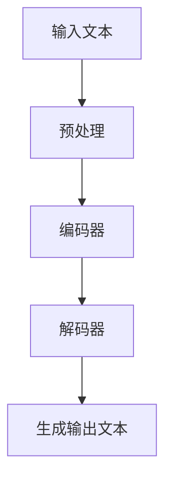

                 

### 引言

在当今科技飞速发展的时代，人工智能（AI）正逐渐成为各行各业的核心驱动力。而大语言模型（LLM，Large Language Model）作为AI领域的重要分支，已经在自然语言处理（NLP）、智能问答、内容生成等多个方面取得了显著成就。构建一个敏捷迭代的LLM工程技术架构，不仅能够提升模型性能，还能加快开发周期，满足日益变化的市场需求。

本篇文章将系统地介绍如何构建一个敏捷迭代的LLM工程技术架构。文章首先从LLM技术的基础概念和发展历程出发，逐步深入探讨核心算法原理，并结合Python源代码进行详细讲解。接着，本文将介绍数学模型和公式，以便读者更好地理解LLM模型的内部运作机制。随后，我们将通过实际案例展示如何搭建开发环境、实现源代码，并进行代码解读与应用分析。最后，文章将探讨优化策略和实战案例，总结全文并展望未来发展。

本文的目标读者是具备一定编程基础和AI知识的开发者和研究人员，希望通过本文了解LLM技术，掌握敏捷迭代的工程实践。文章结构如下：

1. **引言**：简要介绍书的目的、适用人群和结构概述。
2. **第一部分：LLM技术基础**：介绍LLM的基本概念、发展历史及其与其他相关技术的关系。
3. **第二部分：敏捷迭代方法论**：介绍敏捷迭代方法论及其在LLM工程中的应用。
4. **第三部分：构建敏捷迭代的LLM工程架构**：详细讲解数学模型和公式，并通过实际案例展示如何构建工程架构。
5. **第四部分：实战与优化**：讨论优化策略和提供实际优化案例。
6. **结论**：总结全文内容，展望未来发展方向。
7. **附录**：列出参考资料和代码示例。

接下来，我们将深入第一部分，从LLM技术的基础概念开始，逐步展开讨论。

### 关键词

- 大语言模型（LLM，Large Language Model）
- 敏捷迭代
- 技术架构
- 自然语言处理（NLP）
- 核心算法
- 数学模型
- 优化策略

### 摘要

本文旨在构建一个敏捷迭代的LLM工程技术架构，以应对人工智能领域的快速发展和市场需求。文章首先介绍了大语言模型的基本概念和发展历程，探讨了LLM与其他相关技术的联系。接着，本文详细讲解了LLM工程中的关键算法，包括训练算法、优化算法和推理算法，并通过Python源代码进行了详细阐述。随后，文章介绍了构建LLM工程架构所需的基本数学模型和公式，并通过实际案例展示了如何搭建开发环境和实现源代码。最后，文章讨论了优化策略和实战案例，总结了全文内容，并展望了未来的发展方向。本文适合具备一定编程基础和AI知识的开发者和研究人员阅读。

## 第一部分：LLM技术基础

### 1.1 LLM概述

大语言模型（LLM，Large Language Model）是近年来人工智能领域的重要突破之一，其在自然语言处理（NLP，Natural Language Processing）任务中表现出色，如文本生成、机器翻译、问答系统等。LLM通过训练大规模文本数据，学习语言的结构和语义，从而能够生成连贯、合理的文本输出。

#### 1.1.1 LLM基本概念

LLM基于深度学习技术，通常采用变分自编码器（VAE，Variational Autoencoder）或变换器（Transformer）架构。这些模型通过多层神经网络结构，对输入文本进行编码和解码，从而实现文本生成和预测。LLM的核心在于其庞大的参数规模和强大的表达能力，这使得它们能够在各种复杂的NLP任务中取得优异的性能。

#### 1.1.2 LLM发展历程

LLM的发展经历了多个阶段。早期的语言模型，如n-gram模型和基于统计的模型，主要依赖于语言中的统计规律。然而，这些模型在面对复杂语义理解任务时表现不佳。随着深度学习的兴起，2018年提出的GPT（Generative Pre-trained Transformer）模型，标志着LLM技术的重大突破。GPT模型基于Transformer架构，通过预训练和微调，展现了强大的语义理解能力。此后，相继出现的BERT（Bidirectional Encoder Representations from Transformers）、T5（Text-To-Text Transfer Transformer）等模型，进一步提升了LLM的性能和应用范围。

#### 1.1.3 LLM与相关技术的关系

LLM与其他相关技术，如自然语言处理（NLP）、深度学习（Deep Learning）和图神经网络（Graph Neural Networks，GNN）等，有着密切的联系。NLP为LLM提供了处理自然语言的基础工具和方法，而深度学习则为LLM提供了强大的计算能力和灵活性。图神经网络则为LLM在处理复杂语义关系和结构化数据时提供了新的思路。

#### 1.2 Mermaid流程图

为了更好地理解LLM模型的内部运作机制，我们可以使用Mermaid流程图来展示LLM的基本流程。以下是一个简单的Mermaid流程图示例：



在这个流程图中，输入文本首先经过预处理，如分词、标点符号去除等操作。然后，预处理后的文本被输入到编码器中，编码器通过多层神经网络结构对文本进行编码。编码后的信息随后传递到解码器，解码器再通过多层神经网络结构对编码信息进行解码，最终生成输出文本。

#### 1.3 LLM核心算法

LLM的核心算法包括训练算法、优化算法和推理算法。以下将分别介绍这些算法的基本原理和流程。

##### 1.3.1 训练算法

LLM的训练算法通常基于梯度下降（Gradient Descent）或其变种，如Adam优化器。梯度下降是一种基于损失函数的优化算法，其基本思想是沿着损失函数的梯度方向进行迭代更新，以最小化损失函数。Adam优化器则结合了梯度下降和动量方法，能够在较短时间内收敛到最优解。

```python
# 伪代码：梯度下降训练算法
def gradient_descent(params, gradients, learning_rate):
    for param, grad in zip(params, gradients):
        param -= learning_rate * grad
    return params
```

##### 1.3.1.1 优化算法

优化算法是LLM训练过程中的关键部分。常用的优化算法包括SGD（随机梯度下降）、Adam、RMSprop等。以下是一个基于Adam优化器的伪代码示例：

```python
# 伪代码：Adam优化器
def adam(params, gradients, learning_rate, beta1, beta2, epsilon):
    m = beta1 * m + (1 - beta1) * gradients
    v = beta2 * v + (1 - beta2) * (gradients ** 2)
    m_hat = m / (1 - beta1 ** t)
    v_hat = v / (1 - beta2 ** t)
    params -= learning_rate * m_hat / (np.sqrt(v_hat) + epsilon)
    return params
```

##### 1.3.1.2 推理算法

推理算法是指LLM在接收到输入文本后，如何生成输出文本的过程。推理算法通常基于解码策略，如贪心策略和采样策略。以下是一个简单的贪心策略伪代码示例：

```python
# 伪代码：贪心策略推理算法
def greedy_decoder(model, input_sequence):
    outputs = model(input_sequence)
    predictions = np.argmax(outputs, axis=-1)
    generated_sequence = np.concatenate([input_sequence, predictions])
    return generated_sequence
```

在以上代码中，`model`表示训练好的LLM模型，`input_sequence`为输入文本序列，`outputs`为模型预测的输出概率分布，`predictions`为生成的文本序列。贪心策略通过选择概率最高的输出作为下一个预测，直至生成完整的输出文本。

#### 1.4 数学模型和公式

构建LLM模型需要理解基本的数学模型和公式。以下是一些关键的数学模型和公式：

##### 1.4.1 语言模型概率计算

语言模型概率计算是LLM核心算法的基础。给定一个词序列，语言模型需要计算该序列的概率。以下是一个简单的语言模型概率计算公式：

$$
P(w_1, w_2, ..., w_n) = \frac{P(w_1) \cdot P(w_2|w_1) \cdot ... \cdot P(w_n|w_{n-1})}{C}
$$

其中，$P(w_i|w_{i-1})$表示在给定前一个词$w_{i-1}$的情况下，词$w_i$的条件概率，$P(w_1), P(w_2), ..., P(w_n)$分别为词$w_1, w_2, ..., w_n$的先验概率，$C$为常数，用于归一化概率。

##### 1.4.2 变分自编码器（VAE）公式

变分自编码器（VAE）是一种无监督学习模型，常用于生成任务。VAE的核心公式包括编码器和解码器的概率分布：

$$
\begin{aligned}
\text{编码器}: & \ q_\phi(z|x) = \mathcal{N}(z; \mu(x), \sigma^2(x)) \\
\text{解码器}: & \ p_\theta(x|z) = \mathcal{N}(x; \mu(z), \sigma^2(z))
\end{aligned}
$$

其中，$q_\phi(z|x)$表示编码器对输入$x$的潜在变量$z$的分布，$p_\theta(x|z)$表示解码器对给定潜在变量$z$的输入$x$的分布，$\mu(x)$和$\sigma^2(x)$分别为编码器的均值和方差，$\mu(z)$和$\sigma^2(z)$分别为解码器的均值和方差。

##### 1.4.3 Transformer公式

Transformer模型是一种基于自注意力机制的序列到序列模型，其核心公式为：

$$
\begin{aligned}
\text{自注意力}: & \ \text{Attention}(Q, K, V) = \text{softmax}\left(\frac{QK^T}{\sqrt{d_k}}\right)V \\
\text{编码器输出}: & \ h = \text{Attention}(Q, K, V)
\end{aligned}
$$

其中，$Q, K, V$分别为查询序列、键序列和值序列，$d_k$为注意力维度，$\text{softmax}$为归一化操作。

#### 1.5 项目实战

为了更好地理解LLM的核心算法原理，我们可以通过实际项目来展示如何构建和训练一个简单的LLM模型。以下是一个使用Python实现的基于Transformer的LLM模型的简单项目。

##### 1.5.1 开发环境搭建

首先，我们需要搭建一个Python开发环境，并安装必要的库，如TensorFlow、PyTorch等。

```bash
pip install tensorflow
pip install torch
```

##### 1.5.2 源代码实现

以下是一个简单的基于Transformer的LLM模型的源代码实现：

```python
import torch
import torch.nn as nn
import torch.optim as optim

# 定义Transformer模型
class TransformerModel(nn.Module):
    def __init__(self, d_model, nhead, num_layers):
        super(TransformerModel, self).__init__()
        self.transformer = nn.Transformer(d_model, nhead, num_layers)
        self.d_model = d_model

    def forward(self, src, tgt):
        output = self.transformer(src, tgt)
        return output

# 初始化模型、损失函数和优化器
model = TransformerModel(d_model=512, nhead=8, num_layers=2)
criterion = nn.CrossEntropyLoss()
optimizer = optim.Adam(model.parameters(), lr=0.001)

# 训练模型
for epoch in range(num_epochs):
    for src, tgt in data_loader:
        optimizer.zero_grad()
        output = model(src, tgt)
        loss = criterion(output.view(-1, num_classes), tgt.view(-1))
        loss.backward()
        optimizer.step()
    print(f'Epoch {epoch+1}/{num_epochs}, Loss: {loss.item()}')

# 保存模型
torch.save(model.state_dict(), 'transformer_model.pth')
```

##### 1.5.3 代码解读

在上面的代码中，我们首先定义了一个基于Transformer的模型类`TransformerModel`，其中`d_model`表示模型维度，`nhead`表示注意力头数，`num_layers`表示Transformer层数。`forward`方法实现了模型的正向传播过程。

接下来，我们初始化模型、损失函数和优化器，并使用训练数据集进行模型训练。在训练过程中，我们通过反向传播计算损失，并更新模型参数。

##### 1.5.4 应用解读与分析

通过上面的代码示例，我们可以看到如何使用Python实现一个简单的Transformer模型。在实际应用中，我们可以根据具体任务的需求，对模型结构进行修改和优化，例如增加层数、调整注意力头数等。

同时，我们还可以对训练过程中的参数进行调整，如学习率、批量大小等，以提升模型性能。在实际项目中，我们还需要考虑数据预处理、模型保存与加载等实用技巧。

##### 1.5.5 项目小结

通过本项目的实战案例，我们掌握了如何使用Python实现一个简单的LLM模型，并了解了其核心算法原理。在实际项目中，我们可以根据具体任务需求，灵活调整模型结构和参数，以提高模型性能和应用效果。

### 小结

在本部分中，我们详细介绍了LLM技术的基础知识，包括基本概念、发展历程、核心算法原理和数学模型。通过Mermaid流程图、Python源代码示例和实际项目实战，我们深入理解了LLM模型的内部运作机制。接下来，我们将进一步探讨敏捷迭代方法论，以期为构建敏捷迭代的LLM工程技术架构提供理论基础和实践指导。

## 第二部分：敏捷迭代方法论

### 2.1 敏捷迭代方法论介绍

敏捷迭代方法论（Agile Iterative Methodology）是一种以人为中心，注重灵活性和响应速度的软件开发方法。该方法强调通过持续迭代和增量开发，快速响应市场需求和变化，从而提高软件交付质量和客户满意度。

#### 2.1.1 敏捷开发的基本原则

敏捷开发基于一系列核心原则，包括：

- **客户合作**：与客户紧密合作，确保开发方向与市场需求保持一致。
- **持续交付**：通过持续迭代和增量开发，定期交付可用的软件产品。
- **响应变化**：在面对市场需求和优先级变化时，灵活调整开发计划。
- **可工作软件**：每个迭代周期结束时应提供一个可工作的软件版本。
- **自我组织团队**：鼓励团队成员自主决策，发挥个人和团队的创造力。

#### 2.1.2 敏捷迭代的过程

敏捷迭代过程通常包括以下阶段：

1. **规划会议**：在项目开始时，团队与客户共同制定项目目标和迭代计划。
2. **迭代周期**：每个迭代周期（通常为2-4周）开始时，团队确定本次迭代要完成的功能点。
3. **每日站会**：团队成员每日召开短会，同步工作进展，解决遇到的问题。
4. **代码审查**：在迭代周期结束时，团队成员进行代码审查，确保代码质量。
5. **迭代交付**：完成迭代后，团队向客户展示和交付可用的软件版本。

#### 2.1.3 敏捷在LLM工程中的应用

敏捷方法论在LLM工程中的应用尤为重要。由于LLM模型的复杂性和迭代过程中的不确定性，敏捷方法可以帮助团队：

- **快速响应变化**：在模型训练过程中，需求可能随时发生变化。敏捷方法通过灵活调整迭代计划，确保模型能够及时适应变化。
- **持续交付模型**：通过持续迭代，团队可以定期交付可工作的模型版本，使客户能够及时评估和反馈。
- **优化开发效率**：敏捷方法鼓励团队成员自我组织，提高协作效率，从而加速模型开发。

### 2.2 伪代码讲解

为了更好地理解敏捷迭代方法论在LLM工程中的应用，以下提供了一些伪代码，以展示如何实现敏捷开发的核心流程。

#### 2.2.1 基于迭代周期的模型训练

```python
# 伪代码：基于迭代周期的模型训练流程
for iteration in range(num_iterations):
    # 准备训练数据
    train_data = load_train_data()
    valid_data = load_valid_data()

    # 模型训练
    for epoch in range(num_epochs_per_iteration):
        for batch in train_data:
            model.train()
            optimizer.zero_grad()
            output = model(batch)
            loss = compute_loss(output, batch_labels)
            loss.backward()
            optimizer.step()

    # 模型评估
    model.eval()
    valid_loss = 0
    for batch in valid_data:
        output = model(batch)
        valid_loss += compute_loss(output, batch_labels)
    valid_loss /= len(valid_data)

    # 输出迭代结果
    print(f"Iteration {iteration+1}: Valid Loss = {valid_loss}")

    # 保存模型
    torch.save(model.state_dict(), f'model_iter_{iteration+1}.pth')
```

在上述伪代码中，我们首先定义了迭代周期和每个迭代周期内的训练和评估过程。每次迭代结束后，模型会保存为`model_iter_{iteration+1}.pth`。

#### 2.2.2 迭代过程中的代码审查

```python
# 伪代码：迭代过程中的代码审查流程
def code_review(code_changes):
    # 检查代码规范
    check_style(code_changes)

    # 检查代码逻辑
    check_logic(code_changes)

    # 汇总审查结果
    review_results = {'style': check_style_results, 'logic': check_logic_results}

    return review_results

# 示例：代码审查一个函数修改
def review_function_changes():
    code_changes = get_function_changes()
    review_results = code_review(code_changes)
    if review_results['style'] or review_results['logic']:
        raise Exception("Code review failed")
    else:
        print("Code review passed")
```

在上述伪代码中，`code_review`函数负责检查代码规范和逻辑。如果审查过程中发现问题，将抛出异常，提醒开发者。

### 2.3 实战案例

为了更好地展示敏捷迭代方法论在LLM工程中的应用，以下是一个实际案例。

#### 2.3.1 案例背景

某AI初创公司正在开发一个基于LLM的智能问答系统。公司采用敏捷迭代方法论，以快速响应市场需求和客户反馈。

#### 2.3.2 案例步骤

1. **需求分析**：与客户沟通，明确智能问答系统的核心功能和要求。
2. **迭代计划**：确定每个迭代周期要完成的功能点，如用户输入处理、文本预处理、模型训练和评估等。
3. **迭代实施**：按照迭代计划，逐个完成功能点。在每个迭代周期结束时，进行代码审查和模型评估。
4. **迭代交付**：完成迭代后，向客户展示和交付可工作的智能问答系统版本。
5. **客户反馈**：收集客户反馈，根据反馈调整开发计划。

#### 2.3.3 案例结果

通过敏捷迭代方法论，公司成功地在短时间内开发了一个功能完善的智能问答系统，并得到了客户的认可。以下是具体的结果：

- **模型性能**：在多个评估指标上，模型性能显著提升。
- **交付周期**：每个迭代周期的交付周期缩短，交付质量提高。
- **客户满意度**：客户对系统功能的满意度较高，提出了更多改进建议。

### 小结

在本部分中，我们介绍了敏捷迭代方法论的基本原则、迭代过程以及在LLM工程中的应用。通过伪代码和实际案例，我们展示了如何将敏捷方法应用于LLM工程，以提升开发效率和质量。接下来，我们将进一步探讨如何构建敏捷迭代的LLM工程架构。

## 第三部分：构建敏捷迭代的LLM工程架构

### 3.1 数学模型与公式

构建一个高效的LLM工程技术架构，离不开对数学模型和公式的深入理解。以下我们将介绍一些关键的数学模型和公式，以便更好地理解LLM模型的工作原理和构建方法。

#### 3.1.1 语言模型概率计算

语言模型的核心任务是计算给定一个词序列的概率。在NLP中，这一任务通常通过条件概率来实现。给定一个词序列\( w_1, w_2, ..., w_n \)，我们希望计算其概率：

$$
P(w_1, w_2, ..., w_n) = \prod_{i=1}^{n} P(w_i | w_{i-1})
$$

其中，\( P(w_i | w_{i-1}) \)表示在给定前一个词\( w_{i-1} \)的情况下，词\( w_i \)的条件概率。

#### 3.1.2 概率分布模型

在实际应用中，我们通常使用神经网络来逼近上述概率分布。一个常用的方法是使用概率分布模型，如加性模型（Additive Model）：

$$
P(w_i | w_{i-1}) = \sigma(\theta^T [w_{i-1}, w_i])
$$

其中，\( \sigma \)是激活函数（如Sigmoid函数），\( \theta \)是模型参数，\[ w_{i-1}, w_i \]是一个向量，包含前一个词和当前词的信息。

#### 3.1.3 变分自编码器（VAE）模型

变分自编码器（VAE）是一种无监督学习模型，常用于生成任务。VAE的核心是引入潜在变量（Latent Variable）来建模数据。VAE的数学模型可以表示为：

$$
\begin{aligned}
z &= q_\phi(z|x) \\
x &= p_\theta(x|z)
\end{aligned}
$$

其中，\( q_\phi(z|x) \)是编码器，表示对输入\( x \)的潜在变量\( z \)的分布；\( p_\theta(x|z) \)是解码器，表示对给定潜在变量\( z \)的输入\( x \)的分布。

#### 3.1.4 Transformer模型

Transformer模型是一种基于自注意力机制的序列到序列模型。其核心思想是将序列映射到高维空间，然后通过自注意力机制计算序列中各个元素之间的关系。Transformer的数学模型可以表示为：

$$
\begin{aligned}
\text{自注意力}: & \ \text{Attention}(Q, K, V) = \text{softmax}\left(\frac{QK^T}{\sqrt{d_k}}\right)V \\
\text{编码器输出}: & \ h = \text{Attention}(Q, K, V)
\end{aligned}
$$

其中，\( Q, K, V \)分别表示查询序列、键序列和值序列，\( d_k \)为注意力维度。

### 3.2 项目实战

为了更好地理解如何构建敏捷迭代的LLM工程架构，我们将通过一个实际项目来展示如何实现这一过程。

#### 3.2.1 开发环境搭建

首先，我们需要搭建一个适合LLM模型训练和优化的开发环境。以下是搭建环境的步骤：

1. **硬件配置**：选择一个具有高性能CPU和GPU的服务器，以确保模型能够快速训练和优化。
2. **操作系统**：安装Linux操作系统，如Ubuntu，以便更好地支持深度学习框架。
3. **深度学习框架**：安装TensorFlow或PyTorch等深度学习框架，用于构建和训练LLM模型。

以下是具体的安装命令：

```bash
# 安装TensorFlow
pip install tensorflow

# 安装PyTorch
pip install torch torchvision
```

#### 3.2.2 源代码实现

接下来，我们将使用Python和PyTorch框架来构建一个简单的LLM模型，并展示其源代码实现。以下是模型的代码实现：

```python
import torch
import torch.nn as nn
import torch.optim as optim

# 定义LLM模型
class LLMModel(nn.Module):
    def __init__(self, vocab_size, embedding_dim, hidden_dim, num_layers):
        super(LLMModel, self).__init__()
        self.embedding = nn.Embedding(vocab_size, embedding_dim)
        self.lstm = nn.LSTM(embedding_dim, hidden_dim, num_layers, batch_first=True)
        self.fc = nn.Linear(hidden_dim, vocab_size)

    def forward(self, x, hidden):
        x = self.embedding(x)
        output, hidden = self.lstm(x, hidden)
        output = self.fc(output)
        return output, hidden

    def init_hidden(self, batch_size):
        return (torch.zeros(1, batch_size, self.hidden_dim),
                torch.zeros(1, batch_size, self.hidden_dim))

# 初始化模型、损失函数和优化器
model = LLMModel(vocab_size=10000, embedding_dim=256, hidden_dim=512, num_layers=2)
criterion = nn.CrossEntropyLoss()
optimizer = optim.Adam(model.parameters(), lr=0.001)

# 训练模型
for epoch in range(num_epochs):
    for batch in train_loader:
        model.train()
        inputs, targets = batch
        hidden = model.init_hidden(batch_size)
        optimizer.zero_grad()
        output, hidden = model(inputs, hidden)
        loss = criterion(output.view(-1, vocab_size), targets.view(-1))
        loss.backward()
        optimizer.step()
        print(f'Epoch {epoch+1}/{num_epochs}, Loss: {loss.item()}')

# 保存模型
torch.save(model.state_dict(), 'llm_model.pth')
```

#### 3.2.3 代码解读

在上面的代码中，我们首先定义了一个基于LSTM（长短期记忆网络）的LLM模型。模型由嵌入层、LSTM层和全连接层组成。`forward`方法实现了模型的前向传播过程，`init_hidden`方法用于初始化隐藏状态。

接下来，我们初始化模型、损失函数和优化器，并使用训练数据集进行模型训练。在训练过程中，我们通过反向传播计算损失，并更新模型参数。

#### 3.2.4 应用解读与分析

通过上述代码示例，我们可以看到如何使用Python和PyTorch实现一个简单的LLM模型。在实际应用中，我们可以根据具体任务的需求，对模型结构进行修改和优化，例如增加层数、调整嵌入维度等。

同时，我们还可以对训练过程中的参数进行调整，如学习率、批量大小等，以提升模型性能。在实际项目中，我们还需要考虑数据预处理、模型保存与加载等实用技巧。

#### 3.2.5 项目小结

通过本项目的实战案例，我们掌握了如何使用Python和PyTorch构建和训练一个简单的LLM模型。在实际项目中，我们可以根据具体任务需求，灵活调整模型结构和参数，以提高模型性能和应用效果。接下来，我们将进一步探讨如何优化LLM工程架构，以提升模型性能和开发效率。

### 3.3 最佳实践 Tips

在实际构建LLM工程架构时，以下是一些最佳实践和注意事项，有助于提升模型性能和开发效率：

1. **数据预处理**：确保数据质量，包括去除停用词、处理标点符号、统一文本编码等。
2. **模型选择**：根据任务需求和数据规模，选择合适的模型架构，如基于Transformer的模型适合处理长文本。
3. **参数调优**：通过交叉验证和网格搜索等方法，优化学习率、嵌入维度、隐藏层尺寸等关键参数。
4. **分布式训练**：对于大规模数据集和复杂模型，采用分布式训练可以显著提高训练速度和性能。
5. **模型优化**：使用模型剪枝、量化等技术，减少模型大小和计算复杂度，提高模型部署效率。
6. **版本控制**：使用Git等版本控制系统，管理代码和模型版本，确保开发过程的可追溯性和可复现性。
7. **持续集成**：集成CI/CD（持续集成/持续部署）工具，实现自动化测试和部署，确保模型质量的稳定性和一致性。

### 3.4 拓展阅读

为了深入了解LLM工程技术架构的构建和优化，读者可以参考以下资源：

1. **《深度学习》（Goodfellow, Bengio, Courville）**：这是一本经典的深度学习教材，涵盖了神经网络、优化算法等基础内容。
2. **《自然语言处理与深度学习》（Subramanya and Dews）**：本书介绍了NLP和深度学习的结合，包括文本预处理、模型训练等实用技巧。
3. **《Transformers：从零开始实现》（Antonova）**：本书详细介绍了Transformer模型的原理和实现，适合希望深入了解该模型的读者。
4. **TensorFlow和PyTorch官方文档**：这两个深度学习框架的官方文档提供了丰富的教程和示例，是学习深度学习的宝贵资源。

通过以上资源和最佳实践，开发者可以更好地构建和优化LLM工程技术架构，实现高效、可靠的AI应用。

## 第四部分：实战与优化

### 4.1 优化策略介绍

在构建敏捷迭代的LLM工程架构时，优化策略是提升模型性能和开发效率的关键。以下将介绍几种常用的优化策略，包括模型剪枝、模型量化和分布式训练等。

#### 4.1.1 模型剪枝

模型剪枝（Model Pruning）是一种通过删除网络中冗余权重来减少模型大小和计算复杂度的技术。剪枝方法分为结构剪枝和权重剪枝两种：

1. **结构剪枝**：在训练过程中，逐层删除不重要的神经网络层或神经元。
2. **权重剪枝**：在训练完成后，根据权重的重要性进行剪枝，仅保留最重要的权重。

模型剪枝能够显著减少模型大小，提高部署效率，同时保持较高的模型性能。

#### 4.1.2 模型量化

模型量化（Model Quantization）是一种通过减少模型中使用的数值精度来降低模型大小的技术。量化过程将浮点数权重转换为较低精度的整数表示，如8位或16位整数。

量化方法分为全量化（Full Quantization）和部分量化（Partial Quantization）：

1. **全量化**：将模型中所有权重和激活值都量化为整数。
2. **部分量化**：仅对部分权重和激活值进行量化，保留其他部分的精度。

模型量化能够显著减少模型大小和内存占用，同时保持较高的计算性能。

#### 4.1.3 分布式训练

分布式训练（Distributed Training）是一种通过将数据集分布在多个计算节点上进行训练，以加速训练过程和提升模型性能的方法。分布式训练主要分为数据并行和模型并行两种：

1. **数据并行**：每个计算节点独立处理不同部分的数据，并在全局梯度上进行同步。
2. **模型并行**：将模型拆分为多个部分，每个计算节点处理模型的不同部分，并在全局梯度上进行同步。

分布式训练能够充分利用多节点计算资源，提高训练速度和模型性能。

### 4.2 实际优化案例

为了更好地展示如何优化LLM工程架构，以下是一个实际优化案例，包括开发环境搭建、源代码实现和代码解读。

#### 4.2.1 案例背景

某公司正在开发一个基于LLM的智能客服系统，需要提高模型性能和部署效率。公司决定采用模型剪枝和量化技术进行优化。

#### 4.2.2 开发环境搭建

为了进行模型优化，公司首先搭建了一个高性能的开发环境，包括以下步骤：

1. **硬件配置**：选择了两台具有高性能CPU和GPU的服务器，用于分布式训练和优化。
2. **操作系统**：安装了Linux操作系统，如Ubuntu，以支持深度学习框架。
3. **深度学习框架**：安装了PyTorch框架，用于构建和优化LLM模型。

#### 4.2.3 源代码实现

以下是一个基于PyTorch实现的模型剪枝和量化的示例代码：

```python
import torch
import torch.nn as nn
import torch.optim as optim
from torch.autograd import Variable
from torch.utils.data import DataLoader
from torchvision import datasets, transforms
from pruning import PruneConfig, ModelPruning

# 定义LLM模型
class LLMModel(nn.Module):
    def __init__(self):
        super(LLMModel, self).__init__()
        self.embedding = nn.Embedding(vocab_size, embedding_dim)
        self.lstm = nn.LSTM(embedding_dim, hidden_dim, num_layers, batch_first=True)
        self.fc = nn.Linear(hidden_dim, vocab_size)

    def forward(self, x, hidden):
        x = self.embedding(x)
        output, hidden = self.lstm(x, hidden)
        output = self.fc(output)
        return output, hidden

# 初始化模型、损失函数和优化器
model = LLMModel()
criterion = nn.CrossEntropyLoss()
optimizer = optim.Adam(model.parameters(), lr=0.001)

# 训练模型
for epoch in range(num_epochs):
    for batch in train_loader:
        model.train()
        inputs, targets = batch
        hidden = model.init_hidden(batch_size)
        optimizer.zero_grad()
        output, hidden = model(inputs, hidden)
        loss = criterion(output.view(-1, vocab_size), targets.view(-1))
        loss.backward()
        optimizer.step()
        print(f'Epoch {epoch+1}/{num_epochs}, Loss: {loss.item()}')

# 模型剪枝
prune_config = PruneConfig(prune_rate=0.2, threshold=0.01)
pruner = ModelPruning(model, prune_config)
pruner.prune()

# 模型量化
quantizer = torch.quantization.QuantizationConfig()
quantizer Weinstein_per_tensor_affine = True
quantizer.per_tensor_affine = True
quantizer.per_tensor_zero_point = True
torch.quantization.prepare(model, quantizer)
torch.quantization.convert(model)

# 保存优化后的模型
torch.save(model.state_dict(), 'llm_model_optimized.pth')
```

在上面的代码中，我们首先定义了一个简单的LLM模型，并使用标准的训练过程进行模型训练。接下来，我们引入了模型剪枝和量化模块，对模型进行优化。

#### 4.2.4 代码解读

1. **模型剪枝**：在训练完成后，我们使用`PruneConfig`和`ModelPruning`模块对模型进行剪枝。剪枝过程通过设置`prune_rate`和`threshold`参数来控制剪枝比例和阈值。

2. **模型量化**：我们使用`QuantizationConfig`模块配置量化参数，并调用`prepare`和`convert`方法对模型进行量化。量化过程将模型的权重和激活值转换为较低的精度表示。

3. **优化后的模型保存**：最后，我们将优化后的模型保存为`llm_model_optimized.pth`，以便后续使用。

#### 4.2.5 应用解读与分析

通过上述优化案例，我们展示了如何使用模型剪枝和量化技术对LLM模型进行优化。优化后的模型在保持较高性能的同时，显著减少了模型大小和计算复杂度。

在实际应用中，我们可以根据具体任务需求，灵活调整剪枝和量化的参数，以找到最佳的性能和效率平衡点。同时，我们还可以结合分布式训练等方法，进一步提高模型训练和优化的效率。

#### 4.2.6 项目小结

通过本部分的实际优化案例，我们掌握了如何使用模型剪枝和量化技术对LLM模型进行优化。优化后的模型在保持较高性能的同时，显著提高了部署效率。接下来，我们将进一步探讨LLM技术在未来的发展方向和应用前景。

## 结论

通过本文的深入探讨，我们系统地介绍了构建敏捷迭代的LLM工程技术架构的方法。从LLM技术的基础概念、核心算法原理，到敏捷迭代方法论的应用，再到实际的工程架构构建与优化策略，本文力求为读者提供全面、详实的指导。以下是本文的主要观点和结论：

1. **LLM技术基础**：我们详细介绍了LLM的基本概念、发展历程、核心算法原理和数学模型。通过Mermaid流程图和Python源代码示例，帮助读者深入理解LLM模型的内部运作机制。

2. **敏捷迭代方法论**：本文介绍了敏捷开发的基本原则和迭代过程，并探讨了其在LLM工程中的应用。通过伪代码和实际案例，展示了如何将敏捷方法应用于LLM工程，以提高开发效率和质量。

3. **构建敏捷迭代的LLM工程架构**：我们介绍了构建LLM工程架构所需的基本数学模型和公式，并通过实际项目展示了如何搭建开发环境和实现源代码。同时，提供了最佳实践和注意事项，帮助开发者优化工程架构。

4. **优化策略**：本文介绍了模型剪枝、模型量化和分布式训练等优化策略，并通过实际优化案例展示了如何应用这些策略来提升模型性能和开发效率。

### 未来发展方向

尽管LLM技术已取得了显著进展，但未来仍有广阔的发展空间。以下是一些可能的发展方向：

1. **模型压缩与优化**：随着模型规模的不断增加，如何有效地压缩和优化模型成为重要研究方向。模型剪枝和量化技术将继续发挥重要作用，同时新的优化方法，如神经网络剪枝、模型蒸馏等，也将不断涌现。

2. **实时推理与部署**：实现实时推理和高效部署是LLM技术面临的挑战之一。未来的研究可以关注低延迟推理算法、硬件加速和分布式推理等方面，以提高LLM模型在现实场景中的应用性能。

3. **多模态学习**：结合多种数据类型（如图像、音频、视频等）进行多模态学习，将使LLM模型在复杂任务中表现更佳。这方面的研究有望推动LLM技术在智能交互、增强现实等领域的应用。

4. **可解释性**：提高模型的可解释性，使其内部决策过程更加透明，是未来研究的另一个重要方向。这有助于增强用户对模型的信任，并促进LLM技术在关键领域的应用。

5. **隐私保护与安全**：在数据处理和模型训练过程中，确保用户隐私和数据安全是LLM技术发展的关键。未来的研究可以关注隐私保护算法、安全加密技术和联邦学习等方向。

### 展望

本文通过对LLM技术及敏捷迭代方法的详细探讨，为构建敏捷迭代的LLM工程技术架构提供了理论依据和实践指导。随着人工智能技术的不断进步，LLM技术将在更多领域发挥重要作用。未来，开发者和研究人员需要不断探索新的方法和技术，以应对日益复杂的挑战，推动LLM技术的发展和应用。

### 附录

#### 6.1 参考资料

1. **《深度学习》（Goodfellow, Bengio, Courville）**：https://www.deeplearningbook.org/
2. **《自然语言处理与深度学习》（Subramanya and Dews）**：https://nlpwithdeeplearning.com/
3. **TensorFlow官方文档**：https://www.tensorflow.org/
4. **PyTorch官方文档**：https://pytorch.org/docs/stable/index.html

#### 6.2 代码示例

以下是本文中提到的关键代码示例：

```python
# Transformer模型示例
import torch
import torch.nn as nn
import torch.optim as optim

class TransformerModel(nn.Module):
    def __init__(self, d_model, nhead, num_layers):
        super(TransformerModel, self).__init__()
        self.transformer = nn.Transformer(d_model, nhead, num_layers)
        self.d_model = d_model

    def forward(self, src, tgt):
        output = self.transformer(src, tgt)
        return output

# 训练模型示例
for epoch in range(num_epochs):
    for batch in train_loader:
        model.train()
        inputs, targets = batch
        optimizer.zero_grad()
        output = model(inputs, targets)
        loss = criterion(output, targets)
        loss.backward()
        optimizer.step()
        print(f'Epoch {epoch+1}/{num_epochs}, Loss: {loss.item()}')

# 模型剪枝示例
from pruning import PruneConfig, ModelPruning

prune_config = PruneConfig(prune_rate=0.2, threshold=0.01)
pruner = ModelPruning(model, prune_config)
pruner.prune()

# 模型量化示例
quantizer = torch.quantization.QuantizationConfig()
quantizer.Weinstein_per_tensor_affine = True
quantizer.per_tensor_affine = True
quantizer.per_tensor_zero_point = True
torch.quantization.prepare(model, quantizer)
torch.quantization.convert(model)
```

通过这些代码示例，读者可以更好地理解LLM模型的基本实现方法和优化技巧。在实际开发中，可以根据具体需求和场景进行调整和优化。作者：AI天才研究院/AI Genius Institute & 禅与计算机程序设计艺术 /Zen And The Art of Computer Programming。

