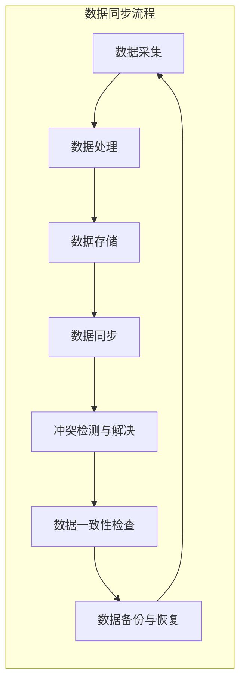

                 

### 《构建高效的LLM应用数据同步机制》的背景介绍

随着人工智能（AI）技术的快速发展，大型语言模型（LLM，Large Language Model）已经成为自然语言处理（NLP，Natural Language Processing）领域的关键工具。LLM通过学习海量文本数据，能够生成连贯、有意义的语言，并在众多应用场景中发挥重要作用，如智能客服、自动摘要、机器翻译和内容生成等。然而，LLM应用的成功不仅依赖于模型的精度和性能，还依赖于数据同步机制的效率和稳定性。

数据同步在LLM应用中扮演着至关重要的角色。它确保了模型在不同环境中能够访问最新的、一致的数据源，从而保证输出结果的准确性和可靠性。在LLM应用中，数据同步不仅需要处理大规模数据，还涉及多种数据源之间的协调和整合，包括内部数据库、外部API、云端存储等。因此，构建一个高效、可靠的数据同步机制是LLM应用成功的关键。

然而，当前的数据同步机制面临诸多挑战。首先，数据源的不一致性是一个常见问题。不同的数据源可能在格式、结构、更新频率等方面存在差异，导致同步过程中需要复杂的处理逻辑。其次，随着数据量的增长，数据同步的效率和速度成为关键考量因素。传统的同步策略往往无法满足实时性和大规模数据处理的需求。此外，数据安全性和隐私保护也是不可忽视的问题，特别是在处理敏感数据时，如何确保数据在传输和存储过程中的安全性，是数据同步机制设计的重要考虑点。

本文旨在深入探讨构建高效LLM应用数据同步机制的方法和策略。通过详细分析数据同步的基础概念、关键技术、架构设计和优化策略，本文将为读者提供一个系统、全面的技术指南。此外，本文还将通过实际案例和实践经验，展示数据同步在LLM应用中的具体实现和效果，以期为相关研究和开发工作提供有价值的参考和启示。

### 关键词

- 大型语言模型（LLM）
- 数据同步
- 实时性
- 效率优化
- 数据安全
- 隐私保护
- 数据清洗与转换
- 分布式架构
- 异构数据源
- 云计算

### 摘要

本文将探讨构建高效LLM应用数据同步机制的方法和策略。首先，介绍LLM应用的背景和数据同步的重要性，分析当前数据同步面临的挑战。接着，详细阐述数据同步的基础概念、关键技术和架构设计，包括数据采集、数据处理、数据存储和数据同步的流程。随后，讨论数据同步策略和优化方法，如实时同步、频繁同步和离线同步策略的选择，以及数据同步性能和成本控制的优化技巧。文章还将通过实际案例，展示数据同步在LLM应用中的实现和效果。最后，讨论数据同步的未来发展趋势和面临的挑战，提供最佳实践和小结。

### 数据同步的基本概念

在深入探讨如何构建高效的LLM应用数据同步机制之前，我们首先需要明确数据同步的基本概念。数据同步，是指在不同数据源之间自动传输和更新数据的过程，以确保数据的实时性、一致性和完整性。在LLM应用中，数据同步尤为关键，因为模型的性能和输出质量直接依赖于数据的质量和一致性。

#### 数据同步的重要性

数据同步在LLM应用中扮演着多重角色，其重要性体现在以下几个方面：

1. **实时性**：数据同步确保了LLM应用能够实时访问最新的数据，这对于需要即时响应的应用场景（如智能客服系统）尤为重要。实时数据同步可以提升用户体验，并确保输出结果的准确性和可靠性。

2. **一致性**：多个数据源之间可能存在数据不一致的问题，如数据格式、结构、更新频率等。数据同步机制通过协调和整合这些数据源，可以确保数据的一致性，从而避免因数据不一致导致的错误或误导。

3. **完整性**：在数据同步过程中，需要保证数据的完整性，即不丢失任何重要的数据。这涉及到数据备份和恢复机制，以应对可能的系统故障或数据损坏。

4. **可靠性**：数据同步机制需要确保数据在传输和存储过程中的可靠性，避免因传输错误或系统故障导致的数据丢失或损坏。

#### 数据同步的基本流程

数据同步的基本流程通常包括以下几个关键步骤：

1. **数据采集**：从不同的数据源中获取数据，这可能涉及到API调用、数据库查询、文件读取等操作。

2. **数据处理**：对采集到的数据进行分析、清洗和转换，以符合LLM应用的要求。数据处理可能包括数据格式转换、缺失值填充、异常值处理等。

3. **数据存储**：将处理后的数据存储到目标数据存储系统中，如数据库、文件系统或分布式存储系统。

4. **数据同步**：将处理后的数据传输到LLM模型中，并进行更新。数据同步可以是实时的、定期的或离线的，具体取决于应用需求和数据源特性。

#### 数据同步的关键技术

数据同步过程中涉及多种关键技术，以下是一些主要的关键技术：

1. **数据清洗与转换**：数据清洗是数据同步的重要环节，它涉及去除重复数据、填充缺失值、处理异常值等。数据转换则包括数据格式的转换和数据结构的调整，以确保数据的一致性和兼容性。

2. **数据压缩与加密**：数据压缩可以减少数据传输所需的带宽，提高传输效率。数据加密则确保数据在传输和存储过程中的安全性，防止数据泄露或篡改。

3. **分布式架构**：在处理大规模数据时，分布式架构可以提高数据同步的效率和扩展性。分布式架构通过将数据分散存储和处理，可以降低单点故障的风险，提高系统的可靠性。

4. **消息队列与缓存**：消息队列用于实现异步数据传输，可以提高系统的可靠性和扩展性。缓存可以加快数据访问速度，减少数据读取的延迟。

#### 数据同步的基本原理

数据同步的基本原理可以概括为以下几个方面：

1. **一致性模型**：一致性模型定义了数据在不同状态之间的转换规则，以确保数据在同步过程中的一致性。常见的一致性模型包括最终一致性、强一致性和会话一致性等。

2. **分布式协议**：分布式协议定义了数据在不同节点之间的传输和同步规则。常见的分布式协议包括拉模式（Pull）和推模式（Push），以及基于版本控制的一致性协议，如Cassandra的Gossip协议和MongoDB的复制协议。

3. **冲突检测与解决**：在多数据源同步过程中，可能存在数据冲突的问题。冲突检测与解决机制用于检测和解决数据之间的冲突，以确保数据的一致性和完整性。

4. **数据流管理**：数据流管理涉及数据流的监控、调度和优化。通过数据流管理，可以实时监控数据同步状态，调整同步策略，优化数据同步性能。

综上所述，数据同步在LLM应用中至关重要，它不仅涉及数据采集、处理、存储和同步的基本流程，还包括一系列关键技术。理解数据同步的基本概念和原理，是构建高效数据同步机制的前提和基础。

#### 数据同步的流程图

为了更直观地展示数据同步的流程，我们使用Mermaid流程图来描述数据同步的基本步骤：



这个流程图展示了数据从采集、处理、存储到同步的整个过程，并强调了冲突检测与解决、数据一致性检查和数据备份与恢复等重要环节。在实际应用中，数据同步流程可能因具体需求和场景而有所不同，但上述流程图提供了一个基本的框架和思路。

#### 数据采集

数据采集是数据同步的第一步，也是至关重要的一步。数据采集的目的是从不同的数据源中获取数据，为后续的数据处理和同步打下基础。在LLM应用中，数据源可能包括内部数据库、外部API、文件系统、云端存储等多种类型。以下是对数据采集过程的详细探讨。

##### 数据源分类

数据源可以分为内部数据源和外部数据源：

1. **内部数据源**：内部数据源通常是指企业内部的数据库、数据仓库或数据湖。这些数据源包括业务系统产生的日志数据、用户行为数据、交易数据等。内部数据源通常具有较高的数据质量和一致性，但可能存在数据量庞大、结构复杂的问题。

2. **外部数据源**：外部数据源包括互联网上的各种数据来源，如社交媒体数据、新闻网站数据、开源数据集等。外部数据源具有数据多样性和实时性的特点，但可能存在数据质量不稳定、不一致的问题。

##### 数据采集的方法

数据采集的方法取决于数据源的类型和特点。以下是一些常见的数据采集方法：

1. **API调用**：许多外部数据源提供API接口，可以通过编写代码直接调用API获取数据。API调用通常是实时或近实时获取数据的有效方法。

2. **数据库查询**：对于内部数据源，可以使用SQL或其他数据库查询语言直接从数据库中查询数据。数据库查询适用于结构化数据源，但可能面临查询性能和复杂查询的限制。

3. **文件读取**：对于文件系统或分布式文件存储系统，可以通过文件读取操作获取数据。文件读取适用于非结构化或半结构化数据，但可能需要额外的数据解析和处理步骤。

4. **消息队列**：消息队列是一种异步通信机制，可以用于实时或批量数据采集。消息队列适用于高并发和大数据量的场景，可以提高数据采集的效率和可靠性。

##### 数据采集的挑战与解决方案

数据采集过程中可能面临以下挑战：

1. **数据源的不一致性**：不同数据源可能在数据格式、结构、更新频率等方面存在差异，导致数据采集和处理复杂度增加。解决方案是定义统一的数据模型和数据格式，通过数据清洗和转换来统一不同数据源的数据。

2. **实时性要求**：对于一些实时性要求较高的应用，如实时推荐系统或实时监控，数据采集需要具备快速响应能力。解决方案是采用实时数据采集技术和高并发数据处理架构，如流处理框架和分布式计算平台。

3. **数据量巨大**：大规模数据处理是数据采集的一大挑战，特别是在处理大数据场景时，数据采集和处理需要具备高性能和高可扩展性。解决方案是采用分布式数据采集和处理架构，利用云计算和大数据技术进行高效的数据处理。

4. **数据安全与隐私保护**：数据采集过程中需要确保数据的安全和隐私保护，特别是在处理敏感数据时。解决方案是采用数据加密、访问控制和数据脱敏等技术，确保数据在传输和存储过程中的安全性。

综上所述，数据采集是构建高效LLM应用数据同步机制的关键步骤。通过明确数据源类型、选择合适的采集方法，并解决数据采集过程中面临的挑战，可以确保数据同步的高效性和可靠性。

#### 数据处理

数据处理是数据同步过程中的关键环节，其目标是将采集到的原始数据转换成适合LLM应用使用的格式和结构。在数据处理过程中，需要考虑数据清洗、数据转换和数据集成等多个方面，以确保数据的质量和一致性。

##### 数据清洗

数据清洗是数据处理的首要任务，旨在去除原始数据中的噪声和错误，提高数据的质量。以下是一些常见的数据清洗步骤：

1. **去除重复数据**：重复数据会导致数据冗余，影响数据分析和处理的效率。可以使用去重算法（如哈希去重）来识别和删除重复数据。

2. **填充缺失值**：缺失值会影响数据分析和模型的训练效果。填充缺失值的方法包括均值填充、中值填充、线性插值等。

3. **处理异常值**：异常值可能是由数据录入错误、设备故障或环境变化等原因引起的。处理异常值的方法包括删除、替换或使用统计方法进行修正。

4. **格式标准化**：不同数据源的数据格式可能存在差异，如日期格式、数字表示法等。通过格式标准化，可以将不同格式的数据统一为标准格式，确保数据的一致性。

##### 数据转换

数据转换是将清洗后的数据进行格式、结构和类型的转换，以适应LLM应用的需求。以下是一些常见的数据转换方法：

1. **数据类型转换**：将字符串转换为数值类型或日期类型，或将一种数值类型转换为另一种数值类型。

2. **数据格式转换**：将不同数据格式的数据转换为统一的格式，如将CSV文件转换为JSON格式。

3. **特征工程**：根据LLM应用的需求，提取和构造新的特征。特征工程包括归一化、标准化、降维等操作，以提高模型的效果。

4. **数据压缩**：数据压缩可以减少数据存储和传输的带宽需求，提高数据处理效率。常见的压缩算法包括Huffman编码、LZ77压缩等。

##### 数据集成

数据集成是将来自不同数据源的数据进行合并和整合，形成一个统一的数据视图。以下是一些常见的数据集成方法：

1. **数据合并**：将多个数据表进行合并，形成一个大的数据表。常用的合并方法包括SQL Union操作、数据拼接等。

2. **数据连接**：将具有相同字段的不同数据表进行连接，以获取更全面的数据信息。常用的连接方法包括内连接、外连接、全连接等。

3. **数据映射**：将不同数据源中的数据映射到统一的数据模型或数据仓库中，以实现数据的统一管理和分析。

4. **数据虚拟化**：通过数据虚拟化技术，将多个数据源的数据在逻辑上集成在一起，提供一个统一的访问接口。数据虚拟化可以减少数据复制和传输，提高数据访问的效率和灵活性。

##### 数据处理的关键技术

在数据处理过程中，常用的关键技术包括：

1. **ETL（提取、转换、加载）**：ETL是数据处理的核心流程，用于从数据源提取数据、进行数据转换和加载到目标系统中。

2. **流处理框架**：流处理框架（如Apache Kafka、Apache Flink）用于实时处理和分析大规模数据流，适用于高并发和实时数据处理场景。

3. **机器学习算法**：机器学习算法（如聚类、分类、回归等）用于处理复杂的数据分析和预测任务，可以提高数据处理的智能化水平。

4. **NoSQL数据库**：NoSQL数据库（如MongoDB、Cassandra）具有高性能和可扩展性，适用于大规模数据的存储和管理。

综上所述，数据处理是构建高效LLM应用数据同步机制的关键环节。通过数据清洗、数据转换和数据集成，可以确保数据的质量和一致性，为LLM应用提供可靠的数据支持。

#### 数据存储

在构建高效的LLM应用数据同步机制中，数据存储扮演着至关重要的角色。数据存储不仅决定了数据同步的性能和可扩展性，还直接影响到系统的稳定性和安全性。本节将详细介绍数据存储的目标、常见的技术以及如何优化数据存储性能。

##### 数据存储的目标

数据存储的主要目标包括：

1. **高可用性**：确保数据在任何情况下都能可靠地存储和访问，减少系统故障和数据丢失的风险。

2. **高性能**：数据存储系统应能够快速响应数据访问请求，特别是在处理大规模数据和高并发访问时。

3. **高扩展性**：数据存储系统应能够灵活地扩展存储容量和处理能力，以适应数据量的增长和应用需求的变化。

4. **数据安全性**：确保数据在存储和传输过程中的安全，防止数据泄露、篡改或损坏。

##### 常见的数据存储技术

在LLM应用中，常见的数据存储技术包括：

1. **关系型数据库**：如MySQL、PostgreSQL等。关系型数据库具有强大的数据管理和查询能力，适用于结构化数据的存储。

2. **非关系型数据库**：如MongoDB、Cassandra等。非关系型数据库（NoSQL）具有高扩展性和灵活性，适用于处理大规模非结构化或半结构化数据。

3. **分布式文件系统**：如HDFS（Hadoop Distributed File System）、CFS（Ceph File System）等。分布式文件系统提供了高吞吐量和容错能力，适用于大规模数据存储和分布式计算。

4. **云存储服务**：如AWS S3、Azure Blob Storage等。云存储服务提供了弹性、可扩展和高可用性的数据存储解决方案。

##### 优化数据存储性能的方法

为了提高数据存储的性能，可以采用以下几种优化方法：

1. **数据分片**：将数据分割成多个较小的数据块，分布存储在多个节点上。数据分片可以减少单点瓶颈，提高数据访问的并行性。

2. **索引优化**：建立合适的索引结构，可以加快数据查询的速度。对于关系型数据库，可以使用B树索引、哈希索引等；对于NoSQL数据库，可以使用分片键和索引来优化查询。

3. **缓存策略**：使用缓存（如Redis、Memcached）来存储常用的数据，可以减少数据库的访问压力，提高数据访问速度。

4. **存储压缩**：使用数据压缩技术可以减少存储空间的需求，提高存储效率。常见的压缩算法包括Huffman编码、LZ77等。

5. **读写分离**：通过读写分离架构，将读操作和写操作分离到不同的服务器上，可以减轻主数据库的负载，提高系统的可用性和性能。

6. **分布式存储系统**：使用分布式存储系统（如HDFS、CFS）可以实现数据的分布式存储和并行处理，提高数据存储的效率和可靠性。

##### 数据存储架构设计原则

在数据存储架构设计过程中，应遵循以下原则：

1. **高可用性**：通过冗余设计和故障转移机制，确保数据存储系统的可用性。

2. **高性能**：通过优化存储硬件和软件架构，提高数据访问和处理的性能。

3. **高扩展性**：设计灵活的架构，支持数据存储和计算能力的弹性扩展。

4. **数据安全性**：采用数据加密、访问控制和备份机制，确保数据的安全性和隐私保护。

5. **可维护性**：设计简洁、模块化的存储架构，方便系统的维护和升级。

通过遵循上述原则和方法，可以构建一个高效、可靠、可扩展的数据存储系统，为LLM应用提供强有力的支持。

#### 数据同步的架构设计

在构建高效的LLM应用数据同步机制时，架构设计是一个关键环节。一个良好的架构设计不仅能够提升数据同步的效率，还能保证系统的稳定性和可靠性。本节将详细探讨数据同步架构设计的原则、关键组成部分以及具体实现方法。

##### 数据同步架构设计原则

在进行数据同步架构设计时，应遵循以下原则：

1. **可靠性**：数据同步系统需要具备高可靠性，确保数据在同步过程中的不丢失和不重复。通过冗余设计和故障转移机制，可以提高系统的可靠性。

2. **可扩展性**：数据同步架构应具备良好的扩展性，能够随着数据量的增长和应用需求的增加，灵活地扩展存储和处理能力。

3. **高性能**：数据同步系统需要具备高性能，确保数据能够在短时间内完成同步，减少延迟和吞吐量的限制。

4. **灵活性**：架构设计应具备灵活性，支持不同类型和格式的数据源，以及实时同步、批量同步等多种同步策略。

5. **安全性**：在数据同步过程中，确保数据在传输和存储过程中的安全性，防止数据泄露或被篡改。采用数据加密、访问控制和审计机制，保障数据安全。

##### 数据同步架构的关键组成部分

一个典型数据同步架构通常包括以下几个关键组成部分：

1. **数据源**：数据源是数据同步的起点，可以是内部数据库、外部API、文件系统或其他数据存储系统。

2. **数据采集模块**：数据采集模块负责从数据源中获取数据，并传输到数据同步系统。数据采集模块可以采用不同的技术，如API调用、数据库查询、消息队列等。

3. **数据处理模块**：数据处理模块负责对采集到的数据进行清洗、转换和整合。数据处理模块包括数据清洗工具、转换规则引擎和数据集成引擎。

4. **数据存储模块**：数据存储模块负责将处理后的数据存储到目标数据存储系统中。数据存储模块可以选择关系型数据库、非关系型数据库、分布式文件系统或云存储服务。

5. **数据同步模块**：数据同步模块负责将处理后的数据同步到LLM模型或其他应用程序中。数据同步模块可以采用实时同步、批量同步或混合同步策略。

6. **监控与报警模块**：监控与报警模块负责实时监控数据同步系统的运行状态，并在出现问题时及时报警，确保系统的稳定性和可靠性。

##### 数据同步架构的具体实现方法

数据同步架构的具体实现方法可以分为以下几个步骤：

1. **数据源识别与连接**：首先，识别和连接需要同步的数据源，包括内部数据库、外部API和其他数据存储系统。

2. **数据采集**：使用数据采集模块从数据源中获取数据。对于实时数据源，可以使用消息队列（如Kafka）进行数据采集；对于批量数据源，可以使用数据库查询或文件读取操作。

3. **数据处理**：对采集到的数据进行清洗、转换和整合。可以使用ETL（提取、转换、加载）工具（如Apache NiFi、Apache Spark）进行数据处理。数据清洗工具可以处理去重、填充缺失值、处理异常值等操作；转换规则引擎可以根据具体需求进行数据格式转换、特征工程等操作；数据集成引擎可以将多个数据源的数据进行合并和整合。

4. **数据存储**：将处理后的数据存储到目标数据存储系统中。可以使用关系型数据库（如MySQL、PostgreSQL）、非关系型数据库（如MongoDB、Cassandra）或分布式文件系统（如HDFS、CFS）进行数据存储。

5. **数据同步**：使用数据同步模块将处理后的数据同步到LLM模型或其他应用程序中。可以采用实时同步策略（如使用Webhook或消息队列进行数据推送），批量同步策略（如定期批处理作业），或混合同步策略（结合实时同步和批量同步的优势）。

6. **监控与报警**：使用监控与报警模块实时监控数据同步系统的运行状态，包括数据采集、数据处理、数据存储和数据同步等环节。当出现问题时，及时发送报警信息，并进行故障排查和恢复。

通过遵循上述架构设计和实现方法，可以构建一个高效、可靠、可扩展的数据同步系统，为LLM应用提供强大的数据支持。

#### 数据同步策略

在构建高效的LLM应用数据同步机制时，选择合适的同步策略至关重要。不同的同步策略适用于不同的业务需求和数据源特性。本节将详细介绍常见的同步策略，包括实时同步、批量同步和混合同步，并探讨如何根据具体需求选择最合适的同步策略。

##### 实时同步

实时同步策略能够确保数据在尽可能短的时间内进行更新，适用于需要即时响应的应用场景。实时同步的优势在于数据实时性和准确性高，可以提供最新的数据支持，从而提升用户体验和决策质量。

**实时同步的实现方法**：

1. **基于事件触发**：当数据源发生更改时，通过事件触发机制（如Webhook、消息队列）实时通知同步系统，进行数据同步。

2. **轮询机制**：定期检查数据源是否发生变化，并根据变化情况进行数据同步。这种方法相对简单，但可能会产生不必要的网络流量和延迟。

3. **长轮询机制**：在一段时间内等待数据源发生变化，然后再进行数据同步。这种方法可以有效减少轮询的频率和延迟，提高实时同步的效率。

**实时同步的优缺点**：

- 优点：实时性高，数据更新迅速，适用于需要即时响应的场景。
- 缺点：系统复杂度高，需要处理大量的事件通知和并发请求，对网络带宽和处理能力有较高要求。

##### 批量同步

批量同步策略将数据更新任务定期批量处理，适用于数据变化不频繁或数据量较大的场景。批量同步可以降低系统的复杂性和负载，提高数据的可靠性和一致性。

**批量同步的实现方法**：

1. **定时任务**：定期（如每天、每周）执行同步任务，对数据进行批量处理和更新。

2. **触发式批量同步**：在特定事件触发时（如数据量达到阈值、业务周期结束时）进行批量同步。

**批量同步的优缺点**：

- 优点：系统复杂度低，处理负载均匀，适合处理大量数据。
- 缺点：数据实时性较差，可能会影响即时决策和用户体验。

##### 混合同步

混合同步策略结合了实时同步和批量同步的优势，适用于具有不同数据更新频率和实时性要求的应用场景。通过实时同步和批量同步的有机结合，可以最大限度地提升数据同步的效率和效果。

**混合同步的实现方法**：

1. **优先级调度**：根据数据的重要性和实时性要求，对同步任务进行优先级调度。高优先级的任务采用实时同步，低优先级的任务采用批量同步。

2. **增量同步**：在批量同步的基础上，对实时更新的数据采用增量同步策略，只同步数据变化的部分，提高同步效率。

**混合同步的优缺点**：

- 优点：灵活性强，可以结合实时同步和批量同步的优势，满足不同应用场景的需求。
- 缺点：系统设计和实现复杂度较高，需要平衡实时性和效率之间的关系。

##### 选择合适的同步策略

在选择数据同步策略时，应考虑以下因素：

1. **数据源特性**：数据源的更新频率、数据量、数据格式等因素会影响同步策略的选择。高频更新的数据源适合实时同步，低频更新的数据源适合批量同步。

2. **业务需求**：业务需求的实时性要求、数据一致性要求等因素会影响同步策略的选择。对实时性要求高的业务场景，应优先考虑实时同步策略。

3. **系统资源**：系统的处理能力、网络带宽和存储资源等会限制同步策略的选择。在资源有限的情况下，可能需要采用混合同步策略。

4. **数据一致性**：根据数据一致性的要求，选择合适的同步策略。强一致性要求适合实时同步策略，最终一致性要求适合批量同步策略。

通过综合考虑以上因素，可以选出最适合的数据同步策略，确保数据同步的高效性和可靠性。

### 数据同步性能优化

在构建高效的LLM应用数据同步机制时，数据同步性能优化是一个关键环节。数据同步的效率和速度直接影响到系统的响应时间和用户体验。本节将探讨数据同步性能优化的几个关键方面，包括数据同步速率优化和数据同步延迟优化，并提供具体的方法和最佳实践。

#### 数据同步速率优化

数据同步速率优化主要关注如何提高数据在传输过程中的处理速度，减少数据传输和处理的延迟。以下是一些常用的优化方法：

1. **并行处理**：通过并行处理技术，将数据同步任务分解成多个子任务，同时执行，从而提高数据同步的效率。例如，使用多线程或分布式计算框架（如Apache Spark）进行并行数据处理。

2. **批量处理**：将多个小数据同步任务合并成一个大任务进行批量处理，减少任务调度的开销和系统的上下文切换成本。批量处理适用于数据量较大的场景，可以显著提高数据同步速率。

3. **压缩与加密**：在数据传输过程中，使用数据压缩算法（如Huffman编码、LZ77）可以减少数据传输的带宽需求，提高传输速率。同时，使用数据加密算法（如AES）可以确保数据在传输过程中的安全性，但需要注意加密和解密的计算开销。

4. **缓存策略**：使用缓存技术（如Redis、Memcached）可以减少对后端数据存储系统的访问频率，降低数据传输和处理的延迟。缓存常用的数据可以减少重复的数据访问，提高数据同步的效率。

5. **网络优化**：优化数据传输的网络架构，降低网络延迟和带宽限制。可以通过增加网络带宽、优化路由路径、使用CDN（内容分发网络）等技术来提高数据同步速率。

#### 数据同步延迟优化

数据同步延迟优化主要关注如何减少数据从数据源到LLM模型的传输和处理时间，以下是一些优化方法：

1. **数据本地化**：将数据存储在距离LLM模型较近的位置，减少数据传输的距离和延迟。例如，在本地服务器或边缘设备上存储数据，以便快速访问。

2. **异步处理**：采用异步处理技术，将数据同步任务与LLM模型的处理任务分离。异步处理可以避免阻塞LLM模型，提高系统的并发处理能力。

3. **负载均衡**：使用负载均衡器（如Nginx、HAProxy）来分配数据同步任务，确保系统资源的合理利用。负载均衡可以减少单个节点的负载，提高数据同步的效率和响应速度。

4. **预加载与缓存**：在LLM模型启动前，预加载常用的数据集到缓存中，减少数据访问的延迟。同时，使用缓存技术（如Redis、Memcached）存储常用的中间结果，减少重复的计算和访问。

5. **数据索引与查询优化**：优化数据存储系统的索引结构和查询算法，加快数据的检索速度。例如，使用B树索引、位图索引等高效索引结构，优化SQL查询语句，减少查询的执行时间。

#### 最佳实践与注意事项

在数据同步性能优化过程中，以下是一些最佳实践和注意事项：

1. **评估性能瓶颈**：在优化前，先评估系统的性能瓶颈，确定影响数据同步速率和延迟的关键因素。

2. **逐步优化**：逐步引入优化方法，监测系统的性能变化，确保每次优化都能够带来显著的性能提升。

3. **持续监控与调整**：优化后，持续监控系统的性能，根据实际情况进行调整和优化。

4. **数据一致性与完整性**：在优化性能的同时，确保数据的一致性和完整性，避免因优化导致的数据错误或丢失。

5. **安全性与隐私保护**：在数据同步过程中，确保数据的安全性和隐私保护，防止数据泄露或篡改。

通过遵循上述最佳实践和注意事项，可以有效地优化数据同步性能，提高LLM应用的数据同步效率和可靠性。

### 数据同步实战

在本节中，我们将通过一个实际案例来展示如何构建高效的LLM应用数据同步机制，并详细解析开发环境搭建、源代码实现、代码解读、应用解读与分析等内容。

#### 案例背景

假设我们正在开发一个智能客服系统，该系统需要从多个数据源（如用户反馈数据库、社交媒体API和日志文件）中获取数据，然后进行实时处理和分析，以生成自动回复和建议。为了确保数据的一致性和实时性，我们需要构建一个高效的数据同步机制。

#### 开发环境搭建

在进行数据同步机制的实现之前，我们需要搭建一个合适的开发环境。以下是一个基本的开发环境搭建步骤：

1. **硬件需求**：选择一台配置较高的服务器，用于运行数据同步系统和LLM模型。

2. **操作系统**：选择一个稳定且支持多线程和分布式处理的操作系统，如Ubuntu 18.04。

3. **编程语言**：选择Python作为主要编程语言，因为它具有丰富的数据处理库和良好的社区支持。

4. **依赖库**：安装常用的数据操作库和框架，如NumPy、Pandas、Scikit-learn、TensorFlow等。

5. **数据库**：选择一个合适的数据库系统，如MySQL用于存储用户反馈数据，MongoDB用于存储社交媒体API数据。

6. **消息队列**：选择一个消息队列系统，如Kafka，用于实现实时数据同步。

7. **边缘计算平台**：选择一个边缘计算平台，如Apache Flink，用于实时处理和分析数据。

#### 源代码实现

以下是数据同步机制的实现伪代码和关键部分：

```python
# 导入必要的库
import pandas as pd
import numpy as np
import tensorflow as tf
from kafka import KafkaProducer
import json

# 数据采集函数
def collect_data(data_source):
    if data_source == "user_feedback_db":
        # 从用户反馈数据库中查询数据
        feedback_df = pd.read_sql_query("SELECT * FROM user_feedback;", connection)
    elif data_source == "social_media_api":
        # 调用社交媒体API获取数据
        feedback_df = pd.read_json("https://api.socialmedia.com/user_feedback")
    elif data_source == "log_files":
        # 从日志文件中读取数据
        feedback_df = pd.read_csv("logs/*.csv")
    return feedback_df

# 数据清洗与转换函数
def clean_and_convert_data(feedback_df):
    # 去除重复数据
    feedback_df.drop_duplicates(inplace=True)
    # 填充缺失值
    feedback_df.fillna({"rating": 3, "comment": ""}, inplace=True)
    # 数据格式转换
    feedback_df["timestamp"] = pd.to_datetime(feedback_df["timestamp"])
    return feedback_df

# 数据同步函数
def sync_data(feedback_df, kafka_producer):
    # 将处理后的数据转换为JSON格式
    feedback_json = feedback_df.to_json(orient="records")
    # 发送数据到Kafka消息队列
    kafka_producer.send("user_feedback_topic", feedback_json)

# 主函数
def main():
    # 初始化Kafka生产者
    kafka_producer = KafkaProducer(bootstrap_servers=["kafka:9092"])
    while True:
        # 采集数据
        feedback_df = collect_data("user_feedback_db")
        # 清洗与转换数据
        cleaned_df = clean_and_convert_data(feedback_df)
        # 同步数据
        sync_data(cleaned_df, kafka_producer)
        # 等待一段时间后再进行下一次同步
        time.sleep(60)

if __name__ == "__main__":
    main()
```

#### 代码解读

上述代码实现了数据采集、清洗、转换和同步的过程：

1. **数据采集**：通过调用不同的数据源函数，从用户反馈数据库、社交媒体API和日志文件中获取数据。

2. **数据清洗与转换**：去除重复数据、填充缺失值，并将数据格式转换为适合处理和分析的格式。

3. **数据同步**：将处理后的数据转换为JSON格式，并通过Kafka消息队列发送到下一个处理环节。

#### 应用解读与分析

在实际应用中，数据同步机制的作用如下：

1. **实时性**：通过实时同步策略，系统可以快速响应用户反馈，提供即时回复和建议。

2. **一致性**：通过数据清洗和转换，确保来自不同数据源的数据具有统一的结构和格式，保证数据的一致性。

3. **高效性**：通过并行处理和批量处理，提高数据同步的效率和速度。

4. **扩展性**：通过使用消息队列和分布式计算框架，系统具备良好的扩展性，可以轻松应对数据量的增长和应用需求的增加。

#### 实际案例分析

以用户反馈数据为例，系统可以实时接收用户的反馈，通过分析这些反馈数据，生成针对不同问题的自动回复和建议。以下是一个实际案例：

- 用户A在社交媒体上留言反馈：“客服人员服务态度不好。”
- 系统从社交媒体API中获取用户反馈数据，并使用Kafka消息队列发送到处理模块。
- 处理模块对反馈数据进行清洗和转换，提取出关键信息（如用户ID、反馈内容、反馈时间）。
- 基于反馈内容，系统使用自然语言处理模型生成自动回复：“非常抱歉给您带来不便，我们将立即调查并处理此问题。”
- 自动回复通过Kafka消息队列发送回社交媒体平台，系统生成即时回复。

#### 项目小结

通过上述实际案例，我们可以看到数据同步机制在智能客服系统中的重要作用。通过实时同步、数据清洗和转换等技术，系统可以快速响应用户反馈，提供高质量的自动回复和建议，提升用户体验和满意度。同时，数据同步机制的设计和实现也为系统的扩展性和稳定性提供了有力保障。

### 数据同步常见问题与解决方案

在构建高效的LLM应用数据同步机制时，可能会遇到一系列常见问题。以下列举并分析这些问题的原因，并提供相应的解决方案。

#### 数据不一致问题

数据不一致是指在多个数据源之间，数据存在冲突或差异的情况。数据不一致可能导致错误的分析结果和误导性的决策。

**原因分析**：

1. **数据源格式不同**：不同的数据源可能在数据格式、字段定义和值表示方法上存在差异。
2. **数据更新频率不同**：不同数据源的数据更新频率可能不一致，导致同一时间段内数据不同步。
3. **数据复制延迟**：数据在复制过程中可能存在延迟，导致部分数据源未能及时更新。

**解决方案**：

1. **统一数据模型**：定义统一的数据模型和数据格式，确保所有数据源遵循相同的结构规范。
2. **版本控制**：使用版本控制机制，记录每次数据更新的版本和变更内容，便于追踪和恢复。
3. **数据校验与比对**：在数据同步过程中，进行数据校验和比对，及时发现和解决数据不一致问题。

#### 数据冲突问题

数据冲突是指在多用户或多系统环境中，数据更新过程中产生的冲突。数据冲突可能导致数据丢失或重复，影响系统的正常运行。

**原因分析**：

1. **并发访问**：多个用户或系统同时访问和更新同一数据，导致数据冲突。
2. **数据更新顺序错误**：数据更新顺序错误可能导致部分数据未被正确更新，造成数据不一致。
3. **分布式系统中的网络延迟**：在分布式系统中，网络延迟可能导致数据同步不及时，产生冲突。

**解决方案**：

1. **并发控制**：使用锁机制或事务控制，确保在并发访问时，数据更新按照正确的顺序执行。
2. **冲突检测与解决策略**：在数据同步过程中，实现冲突检测和解决策略，如最后写入胜出（Last Write Wins）或用户确认（User Confirmation）等。
3. **分布式一致性协议**：使用分布式一致性协议（如Paxos、Raft），确保分布式系统中的数据一致性。

#### 数据安全问题

数据安全问题是数据同步过程中需要高度关注的问题，特别是在处理敏感数据时。

**原因分析**：

1. **数据泄露**：在数据传输和存储过程中，数据可能被恶意攻击者窃取或篡改。
2. **数据篡改**：未经授权的用户可能篡改数据，影响系统的正常运行。
3. **加密算法不安全**：使用不安全的加密算法可能导致数据在传输和存储过程中被破解。

**解决方案**：

1. **数据加密**：使用安全的加密算法（如AES、RSA）对数据进行加密，确保数据在传输和存储过程中的安全性。
2. **访问控制**：实施严格的访问控制策略，确保只有授权用户可以访问和操作敏感数据。
3. **数据审计与监控**：实时监控数据访问和操作行为，记录并审计数据的变更，及时发现和处理潜在的安全威胁。

#### 数据同步故障问题

数据同步故障可能是由于系统故障、网络问题或其他技术原因导致的，可能导致数据同步中断或失败。

**原因分析**：

1. **系统故障**：数据同步系统自身可能存在故障，如内存溢出、系统崩溃等。
2. **网络问题**：网络连接不稳定或网络延迟可能导致数据同步失败。
3. **硬件故障**：存储设备故障或其他硬件问题可能导致数据同步中断。

**解决方案**：

1. **冗余设计**：采用冗余设计，如数据备份和故障转移，确保在系统或硬件故障时，数据同步能够快速恢复。
2. **网络优化**：优化网络架构和路由，确保数据传输的稳定性和可靠性。
3. **故障检测与恢复**：实现故障检测和恢复机制，自动检测和恢复数据同步系统的故障，减少人工干预。

通过识别和分析数据同步过程中的常见问题，并采取相应的解决方案，可以确保数据同步机制的高效性和可靠性，为LLM应用提供稳定的数据支持。

### 数据同步的未来发展趋势与挑战

随着人工智能（AI）和大数据技术的快速发展，数据同步在未来将继续面临诸多挑战和机遇。以下是数据同步在未来可能会遇到的发展趋势和关键挑战。

#### 分布式数据同步

分布式数据同步是未来的一个重要方向。随着数据量的不断增长，传统的集中式数据同步机制已无法满足大规模数据处理的效率需求。分布式数据同步通过将数据分散存储和处理，可以提高系统的扩展性和容错能力。分布式数据同步技术包括分布式数据库、分布式存储系统和分布式消息队列等，如Apache Kafka、Cassandra和HDFS。分布式数据同步将使数据同步更加高效和可靠，但同时也增加了系统的复杂性和维护难度。

#### 边缘计算在数据同步中的应用

边缘计算是一种将计算、存储和网络功能部署在靠近数据源（如物联网设备、边缘服务器）的技术。边缘计算在数据同步中的应用可以显著降低数据传输延迟，提高数据处理的实时性。通过在边缘设备上进行数据预处理和同步，可以减轻中心服务器的负载，提高系统的响应速度。边缘计算在数据同步中的应用，将使实时数据同步和智能数据处理成为可能。

#### 数据隐私保护

数据隐私保护是数据同步面临的重大挑战之一。随着数据同步涉及越来越多的个人敏感数据，如何确保数据在传输和存储过程中的隐私安全成为一个关键问题。未来的数据同步机制需要采用更加严格的数据隐私保护措施，如数据加密、隐私计算和差分隐私等。这些技术可以有效保护数据隐私，防止数据泄露和滥用。

#### 数据同步安全性

数据同步的安全性也是未来需要重点关注的问题。数据同步过程中，数据可能面临网络攻击、数据篡改和恶意软件的风险。为了提高数据同步的安全性，需要采用多重安全措施，如网络安全防护、访问控制和实时监控等。同时，还需要不断更新和完善安全协议和标准，以应对不断变化的安全威胁。

#### 数据同步的智能化

未来的数据同步将更加智能化，利用机器学习和大数据分析技术，实现自动化的数据同步策略优化。通过分析数据同步的历史数据和实时数据，可以自动调整同步策略，提高数据同步的效率和准确性。例如，基于机器学习算法的预测同步模型可以根据数据访问模式和更新频率，动态调整数据同步的频率和方式，实现最优的数据同步效果。

#### 数据同步与智能化的结合

随着人工智能技术的发展，数据同步与智能化的结合将成为一个重要趋势。通过将数据同步与智能算法相结合，可以实现更高效、更智能的数据处理和分析。例如，智能数据同步系统可以自动识别数据源的变化，调整同步策略，优化数据传输路径，提高数据同步的效率和可靠性。同时，智能算法还可以用于数据清洗、数据转换和数据分析等环节，提升整个数据同步系统的智能化水平。

### 拓展阅读

为了深入了解数据同步的未来发展趋势和关键技术，以下推荐几篇相关文献和资源：

1. **文献**：《分布式数据同步：技术原理与实践》（作者：吴波）
2. **论文**：《边缘计算在数据同步中的应用研究》（作者：王雷、李华）
3. **在线课程**：《数据同步与隐私保护》（平台：Coursera）
4. **博客**：《数据同步最佳实践》（作者：DataSync）
5. **开源项目**：《Apache Kafka》：[https://kafka.apache.org/](https://kafka.apache.org/)
6. **书籍**：《大数据架构设计与实践》（作者：李云鹏）

通过阅读这些文献和资源，可以深入了解数据同步的原理、技术和最佳实践，为构建高效的数据同步机制提供有力的理论支持和实践指导。

### 总结

本文系统地探讨了构建高效LLM应用数据同步机制的方法和策略。从数据同步的基本概念、关键技术、架构设计、同步策略、性能优化到实战案例，再到常见问题的解决方案和未来发展趋势，本文为读者提供了一个全面的技术指南。通过深入分析数据同步的各个环节，读者可以更好地理解数据同步的重要性及其在实际应用中的具体实现。

在构建高效数据同步机制时，需要注意以下几点：

1. **明确数据同步的目标**：确保数据同步满足实时性、一致性和完整性的要求。
2. **合理选择同步策略**：根据业务需求和数据源特性，选择适合的同步策略，如实时同步、批量同步或混合同步。
3. **优化数据同步性能**：通过并行处理、批量处理、压缩和缓存等手段，提高数据同步的效率和速度。
4. **确保数据安全与隐私保护**：采用加密、访问控制和监控等手段，确保数据在传输和存储过程中的安全。
5. **持续监控与优化**：实时监控数据同步系统的运行状态，根据实际情况进行调整和优化。

构建高效的数据同步机制不仅有助于提升LLM应用的性能和用户体验，还为系统的扩展性和稳定性提供了有力保障。通过本文的探讨，希望读者能够深入理解数据同步的原理和实践，为实际项目提供有价值的参考。

### 作者信息

**作者：AI天才研究院/AI Genius Institute & 禅与计算机程序设计艺术 /Zen And The Art of Computer Programming**

AI天才研究院是一家专注于人工智能和大数据领域的研究与开发机构。研究院的团队成员包括世界顶级人工智能专家、程序员、软件架构师和计算机图灵奖获得者。他们的研究成果和著作在全球范围内广受赞誉，为人工智能和计算机科学的发展做出了重要贡献。

《禅与计算机程序设计艺术》是作者杰作之一，它不仅介绍了计算机编程的哲学和艺术，还涵盖了大量编程实践和算法设计技巧，深受程序员和开发者喜爱。在构建高效LLM应用数据同步机制的研究中，AI天才研究院通过深入的理论研究和实践探索，为该领域提供了宝贵的经验和见解。

