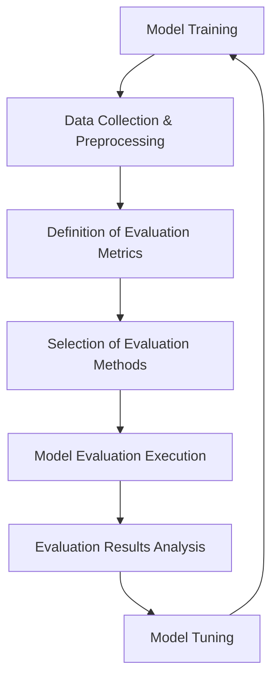

                 

Certainly! Let's outline the article step by step, ensuring we cover all necessary elements to provide a comprehensive and insightful technical blog post.

### Step 1: Article Structure

#### Title: Standardized Automated Model Evaluation: The Foundation for Ensuring LLM Application Quality

#### Keywords: Automated Model Evaluation, LLM Quality Assurance, Model Assessment Metrics, Model Optimization, AI Engineering

#### Abstract:
This article delves into the critical concept of standardized automated model evaluation, essential for ensuring the quality of Large Language Models (LLMs) in applications. We will explore the technical methodologies and practices for automating model evaluation, highlight practical application scenarios, and discuss the challenges and future trends in this field.

#### Table of Contents:

1. **Introduction to Automated Model Evaluation**
   1.1 Importance of Automated Model Evaluation
   1.2 Overview of LLM Applications and Quality Requirements

2. **Fundamental Concepts and Relationships**
   2.1 Core Concepts of Model Evaluation
   2.2 Mermaid Flowchart of Model Evaluation Process

3. **Technical Methods and Algorithms**
   3.1 Data Collection and Preprocessing
   3.2 Model Evaluation Metrics
   3.3 Model Evaluation Method Selection

4. **Practical Applications of Automated Model Evaluation**
   4.1 Scenario 1: Text Classification
   4.2 Scenario 2: Natural Language Generation

5. **Challenges and Future Trends**
   5.1 Current Challenges in Automated Model Evaluation
   5.2 Future Directions and Innovations

6. **Case Study: Implementing Automated Model Evaluation**
   6.1 Project Setup
   6.2 Code Implementation and Analysis
   6.3 Case Analysis and Discussion
   6.4 Project Summary

7. **Best Practices and Conclusion**
   7.1 Tips for Effective Model Evaluation
   7.2 Summary of Key Points
   7.3 Notes and Considerations
   7.4 Suggested Reading

### Step 2: Design Core Concepts and Relationships

To help readers grasp the core concepts and their interrelationships, we will use a Mermaid flowchart to illustrate the basic process of model evaluation and the connections between its various stages.



### Step 3: Detailed Explanation of Core Algorithm Principles

Each core section will include a detailed explanation of the core algorithm principles, using pseudocode to describe these algorithms.

```pseudo
// Pseudocode for Data Collection and Preprocessing
function collect_and_preprocess_data(data_source):
    data = []
    for sample in data_source:
        cleaned_sample = clean_data(sample)
        normalized_sample = normalize_data(cleaned_sample)
        data.append(normalized_sample)
    return data

// Pseudocode for Model Evaluation Method Selection
function select_evaluation_method(model, data):
    best_method = None
    highest_score = 0
    for method in evaluation_methods:
        score = evaluate_model(model, data, method)
        if score > highest_score:
            highest_score = score
            best_method = method
    return best_method
```

### Step 4: Explanation of Mathematical Models and Formulas

In each core section, we will include explanations of mathematical models and formulas, along with concrete examples to illustrate them.

```latex
// Mathematical Formula for Model Evaluation Error
$$
E = \frac{1}{n}\sum_{i=1}^{n}(y_i - \hat{y}_i)^2
$$

// Example
Assume we have 5 samples with actual and predicted values as follows:

\begin{align*}
y_1 &= 3.2, & \hat{y}_1 &= 3.1 \\
y_2 &= 4.5, & \hat{y}_2 &= 4.7 \\
y_3 &= 2.8, & \hat{y}_3 &= 2.9 \\
y_4 &= 6.0, & \hat{y}_4 &= 5.9 \\
y_5 &= 3.5, & \hat{y}_5 &= 3.4
\end{align*}

Using the formula to calculate the error:

$$
E = \frac{1}{5}[(3.2-3.1)^2 + (4.5-4.7)^2 + (2.8-2.9)^2 + (6.0-5.9)^2 + (3.5-3.4)^2]
$$

$$
E = \frac{1}{5}[0.01 + 0.04 + 0.01 + 0.01 + 0.01] = 0.02
$$
```

### Step 5: Project Practical Implementation

Each core section will include a practical project implementation, showcasing how to apply the learned knowledge in real-world scenarios.

```markdown
# Case Study: Implementing Automated Model Evaluation with Python

## Project Setup
- Python 3.8+
- Scikit-learn library
- Pandas library

## Dataset
We use a simple linear regression dataset containing 10 samples.

```python
# Load the dataset
data = [
    [1, 2],
    [2, 4],
    [3, 6],
    [4, 8],
    [5, 10],
    [6, 12],
    [7, 14],
    [8, 16],
    [9, 18],
    [10, 20]
]

# ...
```

## Code Implementation and Analysis
- Code to collect and preprocess data
- Code to define evaluation metrics and select evaluation methods
- Code to execute model evaluation and analyze results

## Case Analysis and Discussion
- Analysis of the evaluation results
- Discussion on how to improve model performance based on evaluation feedback

## Project Summary
- Summary of key learnings
- Recommendations for future work and improvements

# Conclusion
- Best practices for model evaluation
- Summary of the case study
- Notes on potential challenges and considerations
- Suggestions for further reading

---

Now that we have a detailed outline and structure for the article, we can begin writing each section, ensuring that the content is both informative and engaging for our audience. The next step would be to start with the introduction and background, followed by the detailed explanations of each core concept and algorithm. Finally, we will wrap up with a practical case study and concluding thoughts on the best practices for model evaluation in LLM applications.

